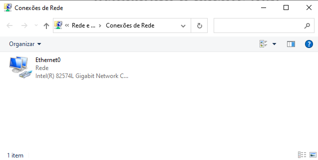
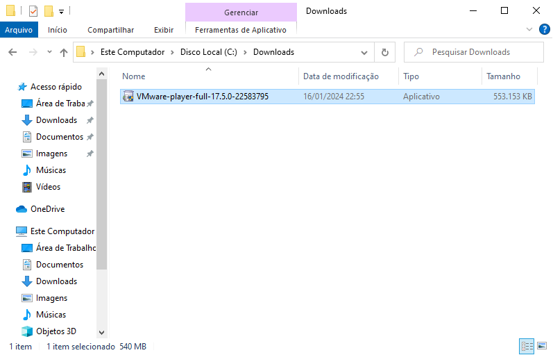
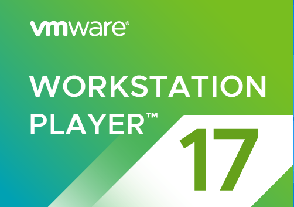
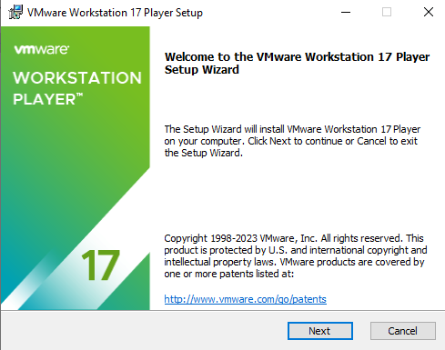
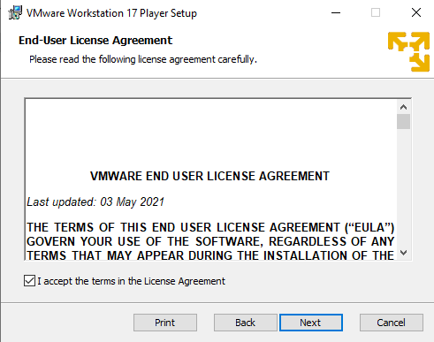
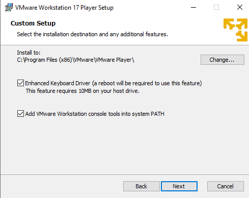
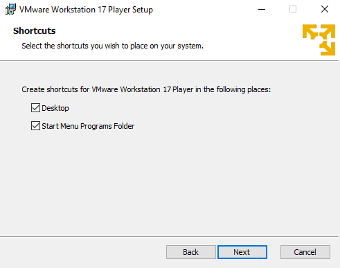
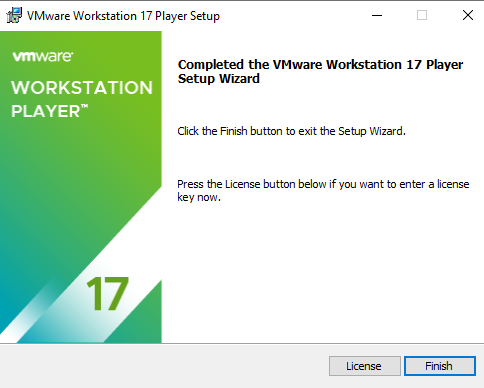
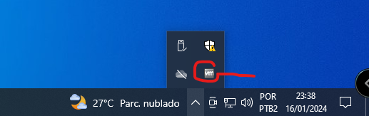

# \05 - Instalação Hypervisor Tipo 2

Aqui vou dar o exemplo da instalação de dois hypervisors do Tipo 2 mais comuns do mercado. O Vmware Player e o VirtualBox. Ambos são gratuitos e podem ser obtidos no site dos próprios fabricantes. Antes de qualquer coisa, vamos analisar como está a parte de rede do nosso sistema operacional. Primeiro vamos analisar o microsoft windows  

   

Perceba que aqui só temos uma placa de rede que é a placa física. Então vamos entrar no site: https://customerconnect.vmware.com/en/downloads/details?downloadGroup=WKST-PLAYER-1750&productId=1377&rPId=111473 e vamos clicar na versão para windows. Irei salvar o arquivo na pasta c:\downloads.   

   

Agora, aqui a instalação é como de um programa qualquer. Só vou alterar e deixar selecionado a opção para instalar o driver avançado de teclado.   

<table>
     <tr>
         <td width="33%"></img></td>
         <td width="33%"></img></td>
         <td width="33%"></img></td>
    </tr>
    <tr>
        <td width="33%"></img></td>
        <td width="33%"></img></td>
        <td width="33%"></img></td>
    </tr>
      <tr>
        <td width="33%"></img></td>
        <td width="33%"></img></td>
        <td width="33%"></img></td>
    </tr>
</table>

Depois disso é necessário reiniciar o windows.   
Após reiniciar, podemos notar que ao lado do relógio aparece um ícone.   

   

Esse é um conjunto de drivers do próprio hypervisor que permite as Máquinas Virtuais se comunicarem diretamente com o host e terem algumas melhorias como driver de vídeo. Com esse driver instalado é possível copiar algo para a memória do sistema operacional host e de dentro da máquina virtual regatar esse conteúdo com o comando "colar" do windows.   