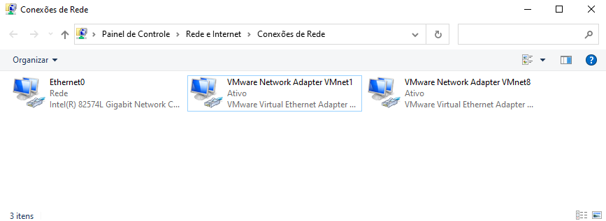
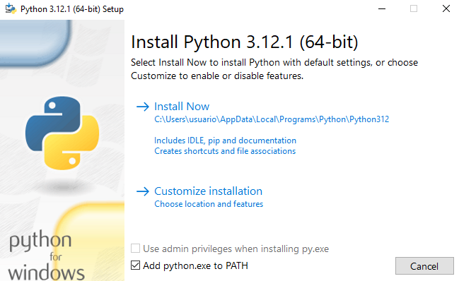
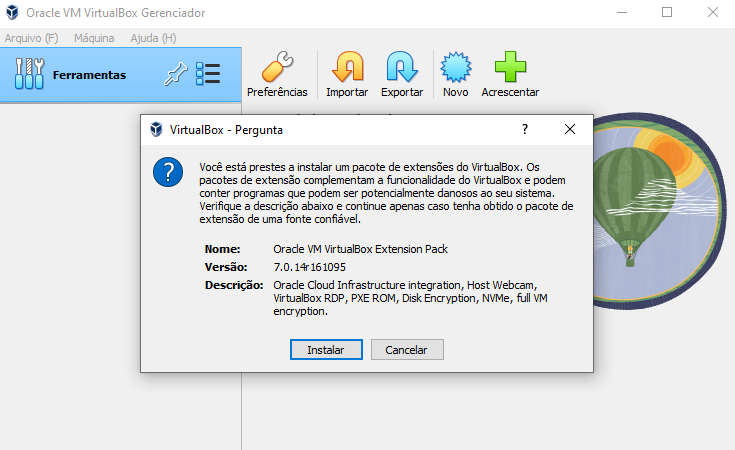
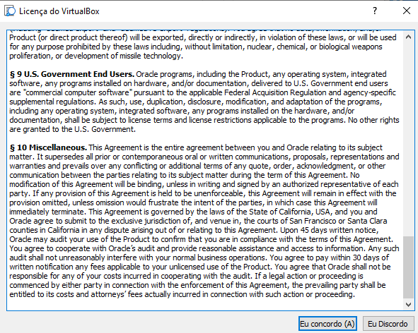
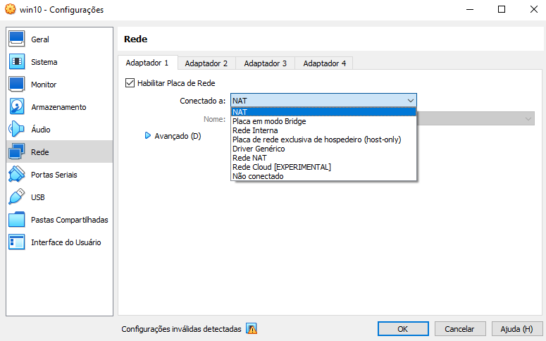

# 01 - VirtualBox em Windows

Agora vou demonstrar como realizar a instalação do VirtualBox no Windows. Ele é da empresa Oracle e pode ser obtido em : https://www.virtualbox.org/wiki/Downloads . Ele é bem parecido com o Vmware Player citado anteriormente.   

Então vamos analisar novamente como estão as nossas placas de rede no windows.   

   

Aqui podemos notar que temos 1 placa de rede física e mais duas virtuais, que foram criadas no exemplo anterior onde instalamos o Vmware Player. Então vou copiar o instalador do VirtaulBox do site e guardar em uma pasta no hd do sistema operacional host, o sistema físico.   

   

Agora é clicar no arquivo executável e seguir as instruções.   

<table>
     <tr>
         <td width="33%"></img></td>
         <td width="33%"></img></td>
    </tr>
    <tr>
        <td width="33%"></img></td>
        <td width="33%"></img></td>
    </tr>
    <tr>
        <td width="33%"></img></td>
        <td width="33%"></img></td>
    </tr>
</table>

Como podemos ver, a instalação deu uma mensagem de aviso que está faltando Python Core / win32api . Agora o virtualbox possui uma integração com a linguagem de programação python, porém como não temos esse programa instalado, então o hypervisor perde essas funcionalidades. Para resolvermos isso, precisamos instalar o python e logo após a win32api. Então vamos baixar o python em: https://www.python.org/downloads/ e vamos salvar o executável na mesma pasta que baixamos o virtualbox.    

Vamos executar o instalador quando começar a instalação, marcar a opção de adicionar o python ao path do sistema operacional.   

   

Bom aqui instalamos o python porém ainda não temos a api do python instalado. Vamos abrir o cmd e verificar a instalação do python.   

   

Agora vamos abrir o cmd e executar o seguinte comando: **py -m pip install pywin32**

   

Agora só falta instalarmos o Extension Pack, que são os drivers de aprimoramento do virtualbox. Então vamos ir ao link https://download.virtualbox.org/virtualbox/7.0.14/Oracle_VM_VirtualBox_Extension_Pack-7.0.14.vbox-extpack e salvar o aplicativo na mesma pasta onde salvamos o virtualbox.   

   

Vamos clicar no arquivo e ao executar será perguntado se desejamos instalar o pacote de extensões no virtualbox. Vamos clicar em sim.   

   

Então irá abrir uma tela com os termos de utilização do programa. Devemos descer o texto até o final e depois clicar em concordar.   

   

Pronto, agora terminamos de instalar o virtualbox e suas dependências.   

Como feito no vmware, já criei uma máquina virtual e vamos analisar as placas de rede.   

   

É aqui que podemos escolher como a placa de rede vai funcionar. Então temos as opções: 
> - **01 - Bridge:** aqui ela funciona como uma ponte. Ou marcamos a opção de replicar o endereço de IP da placa física ou, deixamos a placa obter um endereço automaticamente através do servidor DHCP da rede física. Essa opção é utilizada para as vms conseguirem sair para a Internet e conseguir "enxergar" as outras máquinas físicas da rede.
> - **02 - Nat:** esta opção serve para pegar o endereço de IP atribuído não roteável da VM e traduzir para um endereço de rede roteável, como os roteadores fazem com os endereços IPv4 das Lans. Essa opção normalmente é utilizada quando queremos que as Vms saiam para a Internet mas não enxerguem as máquinas físicas da rede real.
> - **03 - Host-only:** está opção serve para isolar a rede virtual da rede física. Então as vms se enxergam porém não conseguem sair para a Internet e nem conseguem conversar com as máquinas físicas da rede real.

Temos mais algumas opções, mas essencialmente são as mesmas.