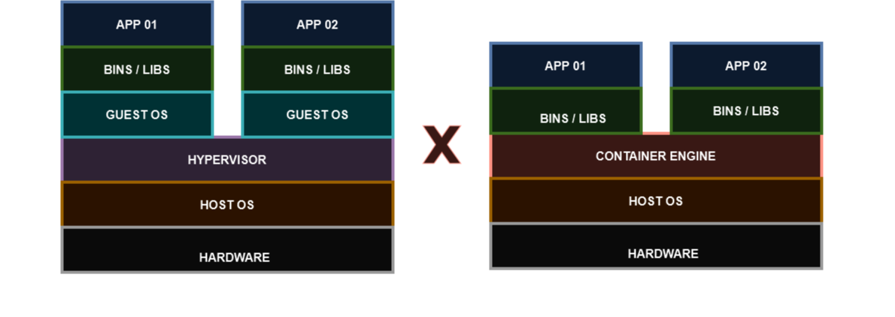

# 07 - Contêners, Docker e Kubernetes

<table>
     <tr>
          <td></img></td>
          <td></img></td>
          <td></img></td>
          <td></img></td>
          <td></img></td>
          <td></img></td>
     </tr>
<table>

Uma Máquina Virtual é uma emulação de um Sistema Operacional completo de um espaço virtual que comparei como uma "caixa" dentro desse so.   
Só que nesse conceito temos que ter um sistema operacional completo. Agora imagine que queremos somente "subir" alguns serviços ou aplicações somente. Então precisaríamos ter uma VM para cada serviço / aplicação ? Se analisarmos bem, até um certo tempo atrás era o que existia   
Com isso em mente foi criado o conceito de contêiner. Então ao invés de instalarmos um Hypervisor, depois criar uma Vm com um SO completo para depois subirmos a aplicação / serviço, agora instalamos um **contêiner engine.** Agora o conceito muda um pouco. Esse contêiner engine é instalado sobre um so e dai ele reserva um espaço com todas as bibliotecas e arquivos necessários para rodar a aplicação /serviço.   

Com isso, os containers ficam mais leves e podem se medidos em megabytes uma vez que não precisam subir um so completo a cada vez que precisar rodar a aplicação / serviço. O container já aproveita o so que está de pé servindo como host e com isso eles se tronam mais rápidos.   

   

Existem várias empresas que fornecem o Container Engine porém uma das mais populares é o Docker. Ele fornece uma pçataforma que permite criar, implantar e executar os containers de forma fácil e eficiente. Ele também fornece a opção de realizar snpashots dos mesmos.   
Então os containers são utilizados para empacotar funções individuais que realizam tarefas especificas, os chamados **micro serviços**.   

   

Então agora fica mais fácil de escalar / aumentar o ambiente de produção.   
Conforme vão surgindo as necessidades, ao invés de subir uma vm completa é mais fácil subir um container com as aplicações ou serviços necessários.   
**OBS:** os containers podem estar dentro de uma vm completa ou mesmo de um so guest completo instalado no hardware.   
Mas conforme vão crescendo o número de containers, a gerência pode ficar complicada. Então, o Docker é indicado para ambientes menores. Já para ambientes maiores foi criado o Kubernets.