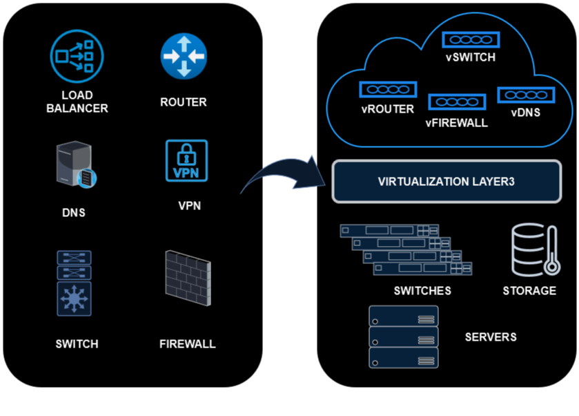
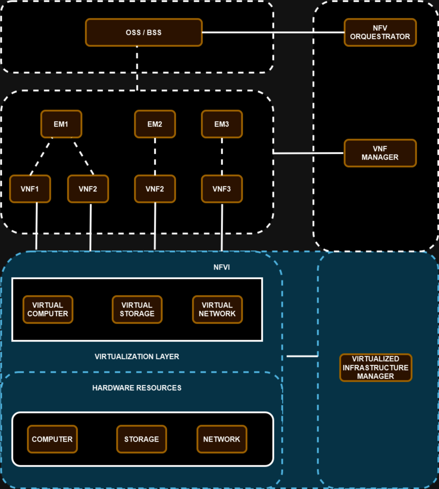
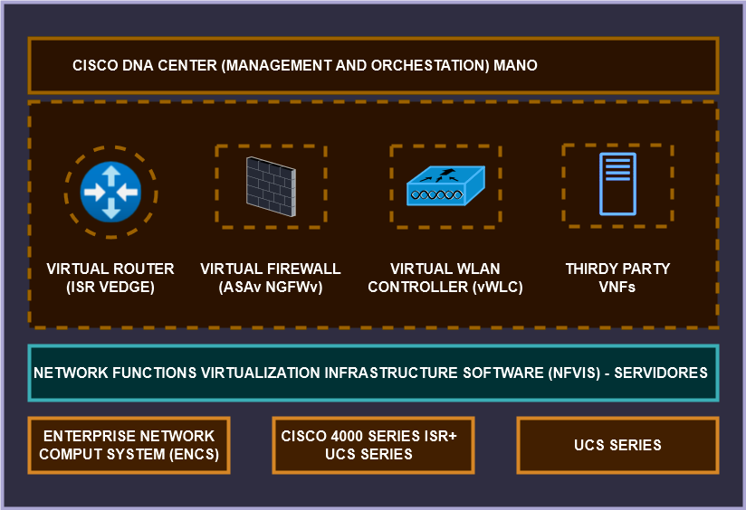
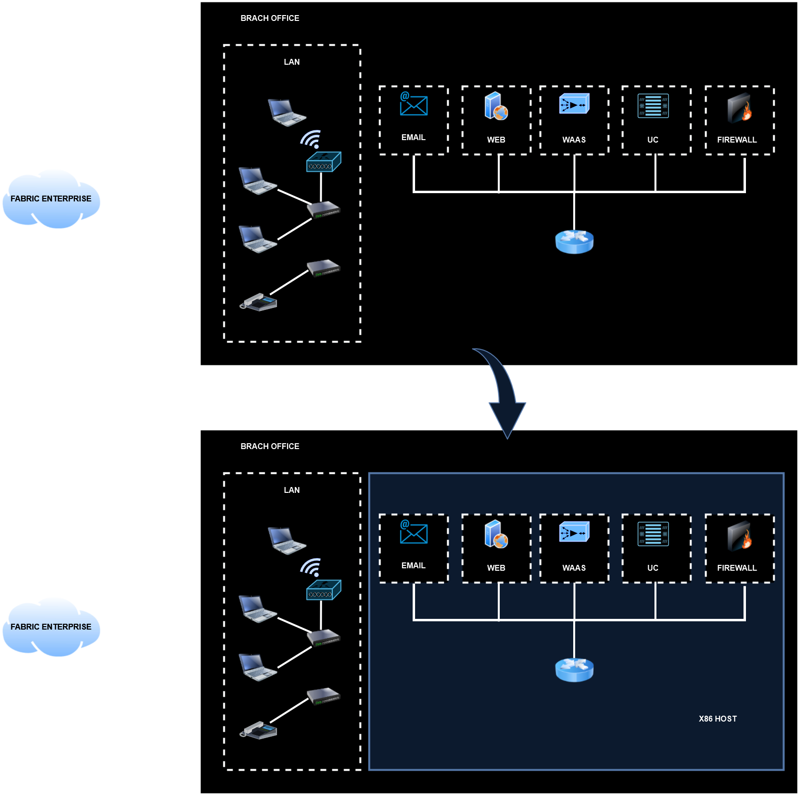

# 08 - Network Functions Virtualization (NFV)

Estas são as virtualizações de funções de rede (NFV - NETWORK FUNCTIONS VIRTUALIZATION), ou seja, são estruturas baseadas em normas da ETSI (European Telecomunications Standards Institute).   

   

Na abordagem tradicional nós temos todos os equipamentos (apliences) que fornecem uma função ou mais como os roteadores, switches, load balancer, etc. Mas estes são equipamentos físicos que ficam juntos dentro de um rack.   
Então resumidamente NFV é transformar essas funções de rede físicas em virtuais dentro de um servidor. Mas não pense que isso é igual a virtualização tradicional. Aqui os servidores são x86 mais "poderosos" onde as funções de rede são executadas como módulos de software em servidores x86.   
Isso segue um framework desenvolvido pela ETSI e no final temos uma infra-estrutura **NFV** ou **NFVI (Network Functions Virtualization Infrastructure)** e normalmente é executado em um hypervisor como uma vm. Isso permite ter ambientes mais homogeneos e escaláveis.   
Os VNFs normalmente executam funções de camadas **4 á 7** mas também podem executar as camadas 2 e 3, como em routers e switches.   
Também podem ser utilizados em nuvem.   

## Elementos de uma NFVI

- **Virtualized Infrastructure Manager (VIM):** essa é a parte inicial do framework onde acontece a abstração do hardware físico. Então aqui temos os recursos de hardware físico onde é instalado o Hypervisor. Em cima do Hypervisor é que acontece a abstração do hardware físico. Exemplo: rede virtual, storage virtual, Vm, etc.
- **Gerentes de elementos (EMS - Elemente Manager):** esses são os gerentes das funções de rede. Por exemplo, podemos ter um EMS gerenciando um VNF1(Vm1), um VNF2(DNS), um VNF3(Acelerador de Rede), depois um EMS2 gerenciando um VNF2(Firewall), um ENS3 gerenciando um VNF3(VM2) e assim por diante.
- **Operations Support System (OSS) / Bussiness Support System (BSS):** esse é o elemento que fornece as redes para as demais redes menores. É o elemento que está no topo do Framework e que lida com a maior carga do Framework inteiro. Até a parte de cobrança dos serviços é ele quem fornece. Por exemplo, um provedor de serviços fornece a rede para os demais clientes. Então imagine que esse provedor possua milhares de clientes. Ou seja, uma rede fornecendo redes para os demais clientes. É nesse nível que o OSS / BSS trabalha.   

   

## CISCO Enterprise Network Functions Virtualization (ENFV)

Essa é a solução enterprise da Cisco para poder virtualizar nas empresas. São suportados por essa solução:

- Cisco Integrated Services Virtual Router (ISRv)
- Cisco Adaptative Security Virtual Applience (ASAv)
- Cisco Firepower Next-Generation Firewall virtual (NGFWv)
- Viptela vEdge e cEdge para Sd-Wan
- Cisco virtual Wide Area Application Services (vWAAS)
- Cisco Virtual Wirelles Lan controlers (vWLCs)
- ThousandEyes
- Fortinet
- Palo Alto
- Info Vista
- Ctera
- Windows Server
- Linux Server

   

Essa é a plataforma da CISCO que traz uma rede convencional (com várias "caixas", cada uma com uma função) para o "novo mundo" onde existe um servidor x86 ou algum dispositivo semelhante onde dentro vão existir várias máquinas virtuais VNFs.   

   

## Exemplos de equipamentos CISCO

- **Tradicional:** Cisco 4000 series ISR, Cisco Catalyst 9000 series - Com serviços centralizados e serviços físicos conservadores.

https://www.cisco.com/c/en/us/solutions/service-provider/network-functions-virtualization-nfv/index.html
https://www.cisco.com/c/en/us/td/docs/routers/nfvis/get_started/nfvis-getting-started-guide/m_install-nfvis-new.html
