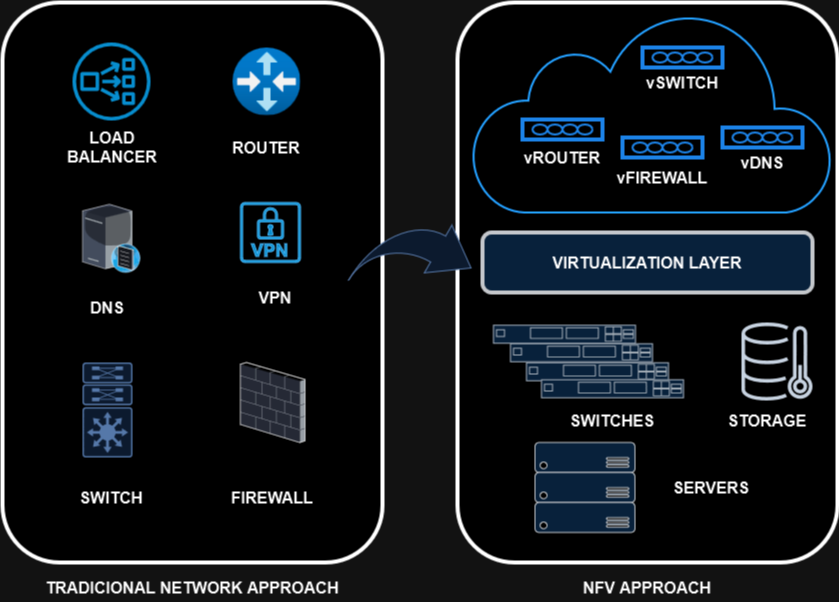

# 08 - Network Functions Virtualization (NFV)

Estas são as virtualizações de funções de rede (NFV - NETWORK FUNCTIONS VIRTUALIZATION), ou seja, são estruturas baseadas em normas da ETSI (European Telecomunications Standards Institute).   

   