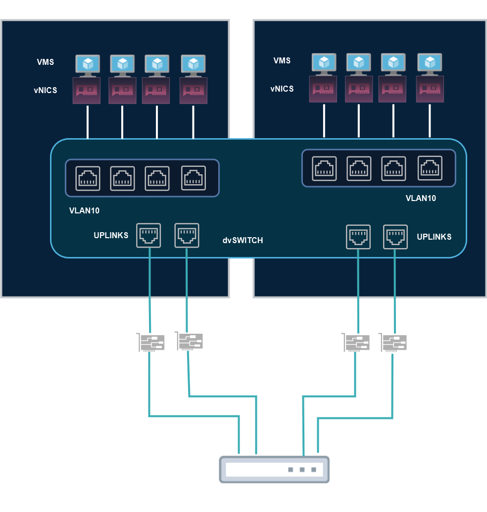

# 09 - Virtual Switching

Agora vamos falar sobre a virtualização de switches. Ela funciona com um software que faz a função de um switch físico.   
Então em um **Hypervisor do Tipo2**, temos as **vNics (virtual Network Cards)**, que como citado anteriormente tem as funções Host Only, NAT e Bridge. Já no **Hypervisor Tipo01**, bare metal, vamos ter os vSwitches e as vNics.   

   

Agora para cada VM poder acessar uma placa de rede física, ela precisa passar por um switch virtual criado pelo Hypervisor. Cada switch virtual precisa ter uma placa de rede física para poder ter acesso á rede.   
**OBS:** é preciso lembrar também que existem os vSwitches em NFV, mas o foco aqui será o de vSwitches em Hypervisors do **TIPO 01**.   
Então os vSwitches permitem que as máquinas virtuais "conversem" entre si dentro de um ambiente virtual e também com redes físicas externas por meio de placas de rede físicas (pNics). Porém os vSwitches emulam switches layer 2. Isso quer dizer que eles executam funções de camada 2 e funcionam um pouco diferente de um switch real. Por exemplo, eles não possuem o protocolo Spanning Three que evita loops de camada 2 uma vez que aqui não é mais necessário.   

## Exemplos de Vswitch

- Cisco Nexus 1000 ve, Cisco Application Virtual Switch (AVS), Open Switch (OVS), vSphere Switch, etc.

Cada fabricante tem sua implementação de vswitch e dependem do que for implementado, ou seja, não são totalmente iguais aos switches físicos. É importante ressaltar também que cada vswitch não se comunica diretamente com outro vswitch.   

## Tipos de Vswitch

**vNetwork Standard Switch (vSwitch ou VSS)**

Como dito anteriormente, o vswitch é o software que emula um switch físico. Nesse tipo de vswitch padrão, os vswitchs são conectados aos **pot groups** para depois poder conectar as vms. Então, por exemplo, se tivermos 3 port groups, um com 4 portas, outro com 3 portas e mais um com 1 porta, podemos conectar respectivamente 4, 3 e 1 máquinas virtuais por port-group. Porém dessa maneira, o vswitch só consegue acesso as redes virtuais. Então é preciso atrela as portas de uplink as portas de rede físicas para se ter acesso as redes externas físicas.   
Exemplos de vswitches vmware.   

   

Nesse exemplo temos 2 vswitches em um único host ESXI. Como dito anteriormente, eles emulam switches layer 2 e mesmo estando no mesmo host ESXI não se comunicam diretamente. Precisam de algum dispositivo de virtualização de camada 3 como um vrouter, por exemplo, para poderem se comunicar.   

   

Nesse segundo exemplo temos dois hosts ESXI. Cada um possui 1 vswitch com vms ligadas a eles. Agora a diferença aqui é que cada vswitch tem suas portas de uplink ligadas as placas de rede físicas e, essas estão ligadas a um switch físico. Isso é feito para poder criar **trunks 802.1q** entre o switch físico e as placas de rede físicas.   
Note que dentro dos vswitches, alguns grupos de portas estão em vlans diferentes, vlan 10 e vlan 20. Como dissemos anteriormente, os vswitches emulam switches layer 2 e, portanto, as vlans precisam de algum dispositivo de camada 3 para se conversarem.   
Aqui o switch físico está ligado a um roteador físico e, com isso, a parte de roteamento é feita fora dos hosts ESXI. Agora, as vlans passam a se enxergar.   

## vNetwork Distributed vSwitch (dvSwitch ou VDS)

   

Agora nesse exemplo, temos dois hosts físicos isolados fisicamente. Como mostrado nos exemplos anteriores, precisaríamos interligar os vswitches a switches físicos para poderem se conversar.   
Porém aqui é instalado um sistema de gerência em um ponto central que se comunica com os dois hosts físicos que estão separados.   
Então esse sistema de gerência faz com que os vswitches se tornem um só, ou **vswitches distribuidos**. Agora os dois switches passam a se conversar diretamente pois os hosts passam a entender que eles são um somente.   
Com isso, é possível se movimentar uma vm de uma porta de um vswitch para outra de forma mais simples   

## Containers (Virtual Bridge)

Agora aqui estamos tratando de virtualização de containers, como o Docker, por exemplo. Quando um conatiner engine é instalado, ele isola uma parte do SO com todos os binários e bibliotecas necessárias para que as aplicações possam funcionar. Porém cada container vai ter sua placa de rede virtual que é ligada a uma bridge. Essa bridge que vai ser responsável por fornecer os IPs para as placas de rede virtuais dos containers e, essa bridge se comunica direto com a placa de rede física do host físico para poder ter acesso as redes físicas reais.   

   

**OBS:** se você tiver vários dockers instalados em vários hosts, ai é necessário um orquestrador para gerenciar eles. O mais famoso é o Kubernetes.

Aqui deixo alguns links com mais informações relevantes sobre o assunto.   

- [REDES VMWARE ESXI](https://docs.vmware.com/br/VMware-vSphere/7.0/com.vmware.vsphere.hostclient.doc/GUID-31C1864C-5B1A-4586-947E-96E984B8F23C.html)
- [Conceitos básicos do adaptador de rede](https://docs.vmware.com/br/VMware-vSphere/7.0/com.vmware.vsphere.hostclient.doc/GUID-AF9E24A8-2CFA-447B-AC83-35D563119667.html?hWord=N4IghgNiBcIG4EsBOAXArpABAZwO4JQGMALEAXyA)
- [IOChain](https://blogs.vmware.com/vsphere/2018/12/understanding-the-esxi-network-iochain.html)
- [VLAN tagging](https://kb.vmware.com/s/article/1004074)
- [vSwitch ou switch distribuído de vNetwork](https://kb.vmware.com/s/article/1008127?lang=pt_PT)