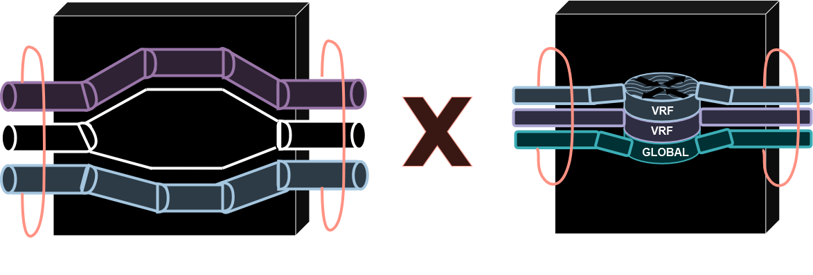

# 10 - Virtual Routing and Forwarding (VRF LITE)

O VRF é uma tecnologia de virtualização **em layer 3**. Ele cria **roteadores virtuais** dentro de um roteador físico.   
É uma tecnologia semelhante as vlans sendo que vlans atuam em camada 2 segregando as portas do switch em determinadas vlans (cria lans virtuais). Já o VRF segrega **caminhos / rotas layer 3**, ou seja, ele cria **tabelas de roteamento diferentes**. Cada tabela de roteamento representa um **roteador virtual**.   

    

Perceba que quando criamos VRFs, são criadas nova tabelas de roteamento porém, a tabela de roteamento que inicia no roteador permanece é chama de **Global**.   
Porém as interfaces, tabelas de encaminhamento **são completamente isoladas** entre as VRFs, impedindo que o tráfego de uma VRF seja encaminhado para outra VRF. Então, inicialmente todas as interfaces **pertencem a tabela global inicialmente**. A partir do momento que indicamos em uma interface a qual VRF ela deve ingressar, ai ela passa a fazer parte somente desta VRF.   
Então as VRFs segregam o tráfego de camada 3. Vamos imaginar que queremos isolar o tráfego de uma empresa de seus colaboradores externos, ou mesmo se queremos isolar o tráfego de voz do tráfego de dados e do tráfego de vídeo também. Então podemos criar uma VRF para cad tipo de tráfego, ou departamento, por exemplo.   
As VRFs são de camada 3 e, portanto, são configuradas em: **interfaces, sub-interfaces e svis (switches layer3).** Não funcionam em switches layer 2.   

## VRF x VRF LITE

- Com o VRF tradicional, o tráfego do cliente é isolado ao viajar da rede de origem para a rede de destino por meio do ambiente de núvem MPLS, VPN e MP-BGP de um provedor de serviços.
- VRF Lite é um VRF sem MPLS e MP-BGP, ou seja, as empresas usam isso quando têm várias redes com os mesmos enderços IP ou precisam de maior segmentação L3.

[VRF2](Imagens/vrf2.png)   
[VRF2](Imagens/vrf2.png)   

Então o VRF LITE é uma simplificação do VRF para podermos utilizar dentro das empresas. Como mostrado no exemplo, em um service provider, todo o tráfego passa dentro de um mesmo roteador. Então sem nenhuma VRF, o cliente A enxerga o cliente B, o que não é recomendado.   