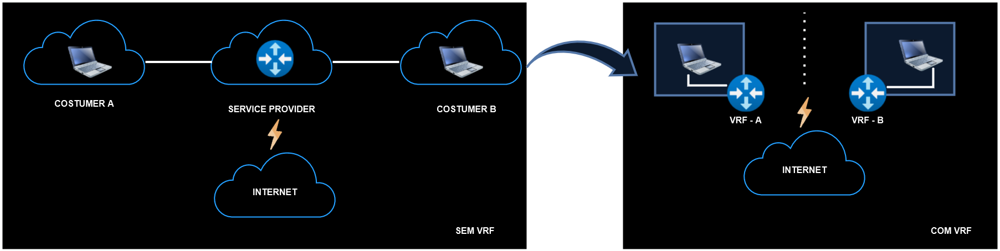
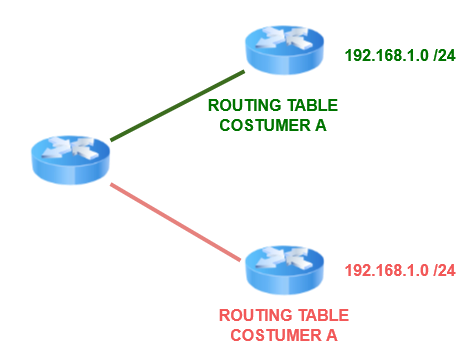

# 10 - Virtual Routing and Forwarding (VRF LITE)

O VRF é uma tecnologia de virtualização **em layer 3**. Ele cria **roteadores virtuais** dentro de um roteador físico.   
É uma tecnologia semelhante as vlans sendo que vlans atuam em camada 2 segregando as portas do switch em determinadas vlans (cria lans virtuais). Já o VRF segrega **caminhos / rotas layer 3**, ou seja, ele cria **tabelas de roteamento diferentes**. Cada tabela de roteamento representa um **roteador virtual**.   

    

Perceba que quando criamos VRFs, são criadas nova tabelas de roteamento porém, a tabela de roteamento que inicia no roteador permanece é chama de **Global**.   
Porém as interfaces, tabelas de encaminhamento **são completamente isoladas** entre as VRFs, impedindo que o tráfego de uma VRF seja encaminhado para outra VRF. Então, inicialmente todas as interfaces **pertencem a tabela global inicialmente**. A partir do momento que indicamos em uma interface a qual VRF ela deve ingressar, ai ela passa a fazer parte somente desta VRF.   
Então as VRFs segregam o tráfego de camada 3. Vamos imaginar que queremos isolar o tráfego de uma empresa de seus colaboradores externos, ou mesmo se queremos isolar o tráfego de voz do tráfego de dados e do tráfego de vídeo também. Então podemos criar uma VRF para cad tipo de tráfego, ou departamento, por exemplo.   
As VRFs são de camada 3 e, portanto, são configuradas em: **interfaces, sub-interfaces e svis (switches layer3).** Não funcionam em switches layer 2.   

## VRF x VRF LITE

- Com o VRF tradicional, o tráfego do cliente é isolado ao viajar da rede de origem para a rede de destino por meio do ambiente de núvem MPLS, VPN e MP-BGP de um provedor de serviços.
- VRF Lite é um VRF sem MPLS e MP-BGP, ou seja, as empresas usam isso quando têm várias redes com os mesmos enderços IP ou precisam de maior segmentação L3.

   

Então o VRF LITE é uma simplificação do VRF para podermos utilizar dentro das empresas. Como mostrado no exemplo, em um service provider, todo o tráfego passa dentro de um mesmo roteador. Então sem nenhuma VRF, o cliente A enxerga o cliente B, o que não é recomendado.   

## Tabela de roteamento e endereçamento global

   

Aqui a **VRF GLOBAL** é igual a tabela de roteamento que já conhecemos porém, para cada roteador virtual é criada uma tabela de endereços IP separadas.   
**OBS:** então os roteadores virtuais não são como as máquinas virtuais que fazem a abstração e separam um pedaço do hardware para cada vm. Aqui, cada tabela de roteamento nova que é criada é como se fosse um roteador novo e a tabela global é a tabela que já vem na caixa.   
Com isso, é possível que exista a sobreposição de endereços IPs. Quando não temos a VRF, se colocarmos o mesmo endereço de IP em duas portas distintas do mesmo roteador, iremos receber uma mensagem de sobreposição de IPs (Overlapping) pois somente existe uma tabela de roteamento. Já com VRF isso é possível pois estamos criando mais de uma tabela de roteamento e com isso segregamos rotas.   
Com isso, a configuração do VRF em um roteador garante que os caminhos sejam isolados, a segurança da rede seja aumentada e que a criptografia do tráfego na rede seja necessária para manter a privacidade entre as instâncias de VRF.

## Configurações

> - **1 - VRF definition-name:** em modo global
> - **2 - address-family {ipv4/ipv6}:** em modo de configuração VRF
> - **3 - VRF forwarding VRF-name:** no modo de configuração da interface ou sub-interface

O roteamento continua igual, com VRF ou sem VRF. A criação das vrfs e configurações de interfaces serão feitas apenas em um ponto central, os demais roteadores das pontas não necessitam de VRF.

## Passo a passo para configurar VRFS

1. Crie uma tabela de roteamento VRF usando o comando **VRF definition VRF-name**
2. Inicie a família de endereços apropriada usando o comando **address-family {ipv4 / ipv6}**
3. Entre no modo de configuração da interface e especifique a interface a ser associada á instancia VRF usando o comando **interface interface-id**
4. Associe a instância VRF à interface ou sub-interface inserindo um ou ambos os comandos a seguir:
    - IPv4: **ip address ip máscara-de-sub-rede**
    - IPv6: **ipv6 address endereço-IPv6 / comprimento do prefixo**

## Roteamento com VRF

**COM OSPF**

- **router ospf process-id VRF name**
    - **router-id**
    - **network**
    - **passive interface**
    - **etc**

**OBS:** para os outros protocolos, seguir o mesmo raciocínio.   

**ROTA ESTÁTICA**

- **ip route vrf name rede-destino máscara gateway ou interface de saída**

**COMANDOS SHOW**

- **show ip vrf**
- **show ip route vrf vrf-name**
- **show ip protocols vrf vrf-name**
- **ping vrf vrf-name ip ip-address**