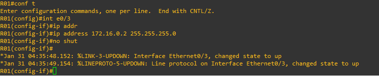
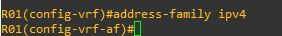

# 11 - Exemplo Pratico VRF 01

Agora vamos praticar e para isso vou demonstrar em alguns exemplos práticos o funcionamento da tecnologia VRF.   

   

No cenário eu estou interligando dois roteadores, simulando a situação de sobrepor endereços IPv4 nas interfaces dos mesmos roteadores. Essa situação também ira acontecer nos hosts. Em cenários normais isso não é possível pois o roteador possui somente uma tabela de roteamento nativa. Então vamos dar uma olhada na tabela de roteamento de R01.   

   

Bom, como não não temos nada configurado, aqui temos somente a tabela de roteamento sem nenhuma rota instalada nela. Então vou atribuir um endereço IP (172.16.0.2 /24) á interface e0/3 do roteador e mostrar a tabela de roteamento após isso.   

<table>
       <tr>
           <td width="50%"></img></td>
           <td width="50%"></img></td>
       </tr>
</table>

Agora vou atribuir o mesmo endereço IP (172.16.0.2 /24) na interface e0/2e vamos observar o comportamento do roteador.   

   

Percebam que o roteador irá retornar a mensagem de **"OVERLAPS"**. Isso ocorre porque se o roteador permitir que essa rota seja instalada ele irá ficar perdido. Veja, uma rota é é uma caminho indicado ao roteador onde dizemos qual protocolo de roteamento foi utilizado, se é uma rota manualmente inserida, uma rota local, o endereço de IP e por onde ele deve passar, qual interface utilizar. Então se conseguíssemos adicionar 2 rotas para o mesmo endereço IP, uma dizendo para sair pela interface e0/2 e outra para sair pela interface e0/3 qual rota o roteador iria escolher ? Por esse motivo ele apresenta a mensagem de erro e não instala a rota.   

Certo até agora nada de novidade. Não criamos nada de novo. Então vamos criar a vrf. Para isso temos os seguintes passos:

> 01. **"vrf definition vrf-name"** : 
>   - aqui criamos as novas tabelas de roteamento para cada VRF que queremos criar. Comando em modo global
> 02. **address family {Ipv4 / Ipv6}** : 
>   - aqui escolhemos qual versão de Ip queremos utilizar. Podemos escolher uma versão ou as duas ao mesmo tempo. Comando em modo de configuração VRF.
> 03. **vrf forwarding vrf-name**: 
>   - então aqui devemos entrar na interface desejada e digitar o comando. Esse comando associa a interface a VRF criada.

Então vamos criar a VRF1 em R01.   

<table>
       <tr>
           <td width="50%"></img></td>
           <td width="50%"></img></td>
       </tr>
</table>

Agora a VRF2 em R01.   

<table>
       <tr>
           <td width="50%"></img></td>
           <td width="50%"></img></td>
       </tr>
</table>

Agora vamos analisar como ficaram as nossas VRFs.

<table>
       <tr>
           <td width="50%"></img></td>
           <td width="50%"></img></td>
       </tr>
</table>

Agora vamos entrar na interface e0/3 e vamos dizer para a interface utilizar a VRF1. Percebam que quando mostrei as VRFs, nenhuma interface estava atrelada a nenhuma VRF e, portanto, **todas fazem parte da VRF GLOBAL**, que no caso é igual a tabela de roteamento tradicional.   

   

**OBS:** percebam que se digitarmos o comando: **vrf forwarding ?** 'faz com que o roteador nos mostre os nomes das VRFs disponíveis que já foram criadas.
**OBS2:** lembram que antes tínhamos atribuído um endereço IP para essa interface ? Olha o que acontece agora.

   

Isso mesmo, o roteador desativa a interface e remove o endereço IP atribuído pois agora estamos vinculando essa interface a uma nova tabela de roteamento e, essa tabela, não possui essa rota ainda.   