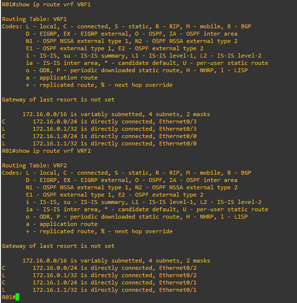

# 12 - Exemplo Pratico VRF 02

Aqui não vou me alongar muito nas explicações e vou direto a prática. Para esse segundo exemplo vou utilizar o mesmo cenário doe exemplo anterior.

   

No exemplo anterior eu criei duas VRFs em cada roteador e escolhi utilizar rotas estáticas como meio de roteamento. Mas sabemos que para a parte de roteamento podemos utilizar protocolos dinâmicos para isso. Então, como parte da pratica, vou remover as configurações e vou começar do zero.   
Então vamos entrar no roteador 01 e mostrar as configurações das vrfs e as suas tabelas de roteamento.    

<table>
       <tr>
           <td width="33%"></img></td>
           <td width="33%"></img></td>
           <td width="33%"></img></td>
       </tr>
</table>

Agora vamos remover as rotas estáticas e as vrfs.  

<table>
       <tr>
           <td width="50%"></img></td>
           <td width="50%"></img></td>
       </tr>
</table>

Então agora devemos remover as vrfs.   

Deixo aqui uma cópia do arquivo com a resolução . [LAB(RESOLVIDO)](Arquivos/vrf(resolvido).zip)
