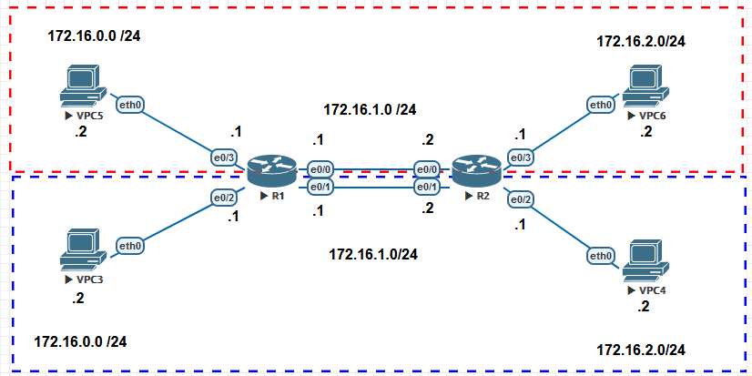

# 12 - Exemplo Pratico VRF 02

Aqui não vou me alongar muito nas explicações e vou direto a prática. Para esse segundo exemplo vou utilizar o mesmo cenário doe exemplo anterior.

   

No exemplo anterior eu criei duas VRFs em cada roteador e escolhi utilizar rotas estáticas como meio de roteamento. Mas sabemos que para a parte de roteamento podemos utilizar protocolos dinâmicos para isso. Então, como parte da pratica, vou remover as configurações e vou começar do zero.   
Então vamos entrar no roteador 01 e mostrar as configurações das vrfs e as suas tabelas de roteamento.    

<table>
       <tr>
           <td width="33%"></img></td>
           <td width="33%"></img></td>
           <td width="33%"></img></td>
       </tr>
</table>

Bom, como não não temos nada configurado, aqui temos somente a tabela de roteamento sem nenhuma rota instalada nela. Então vou atribuir um endereço IP (172.16.0.2 /24) á interface e0/3 do roteador e mostrar a tabela de roteamento após isso.   

<table>
       <tr>
           <td width="50%"></img></td>
           <td width="50%"></img></td>
       </tr>
</table>

Agora vou atribuir o mesmo endereço IP (172.16.0.2 /24) na interface e0/2e vamos observar o comportamento do roteador.   

   

Percebam que o roteador irá retornar a mensagem de **"OVERLAPS"**. Isso ocorre porque se o roteador permitir que essa rota seja instalada ele irá ficar perdido. Veja, uma rota é é uma caminho indicado ao roteador onde dizemos qual protocolo de roteamento foi utilizado, se é uma rota manualmente inserida, uma rota local, o endereço de IP e por onde ele deve passar, qual interface utilizar. Então se conseguíssemos adicionar 2 rotas para o mesmo endereço IP, uma dizendo para sair pela interface e0/2 e outra para sair pela interface e0/3 qual rota o roteador iria escolher ? Por esse motivo ele apresenta a mensagem de erro e não instala a rota.   

Certo até agora nada de novidade. Não criamos nada de novo. Então vamos criar a vrf. Para isso temos os seguintes passos:

> 01. **"vrf definition vrf-name"** : 
>   - aqui criamos as novas tabelas de roteamento para cada VRF que queremos criar. Comando em modo global
> 02. **address family {Ipv4 / Ipv6}** : 
>   - aqui escolhemos qual versão de Ip queremos utilizar. Podemos escolher uma versão ou as duas ao mesmo tempo. Comando em modo de configuração VRF.
> 03. **vrf forwarding vrf-name**: 
>   - então aqui devemos entrar na interface desejada e digitar o comando. Esse comando associa a interface a VRF criada.

Então vamos criar a VRF1 em R01.   

<table>
       <tr>
           <td width="50%"></img></td>
           <td width="50%"></img></td>
       </tr>
</table>

Agora a VRF2 em R01.   

<table>
       <tr>
           <td width="50%"></img></td>
           <td width="50%"></img></td>
       </tr>
</table>

Agora vamos analisar como ficaram as nossas VRFs.

<table>
       <tr>
           <td width="50%"></img></td>
           <td width="50%"></img></td>
       </tr>
</table>

Agora vamos entrar na interface e0/3 e vamos dizer para a interface utilizar a VRF1. Percebam que quando mostrei as VRFs, nenhuma interface estava atrelada a nenhuma VRF e, portanto, **todas fazem parte da VRF GLOBAL**, que no caso é igual a tabela de roteamento tradicional.   

   

**OBS:** percebam que se digitarmos o comando: **vrf forwarding ?** 'faz com que o roteador nos mostre os nomes das VRFs disponíveis que já foram criadas.
**OBS2:** lembram que antes tínhamos atribuído um endereço IP para essa interface ? Olha o que acontece agora.

   

Isso mesmo, o roteador desativa a interface e remove o endereço IP atribuído pois agora estamos vinculando essa interface a uma nova tabela de roteamento e, essa tabela, não possui essa rota ainda.   
Vamos entrar agora na interface e0/0 e vamos repetir o mesmo processo. Perceba que vamos atrelar essa interface a VRF1, a mesma VRF atrelada a interface e0/3 anteriormente. Então aqui é o mesmo caso, se tentarmos configurar o mesmo endereço IP aqui vamos ter a mensagem de **Overlapping** pois estamos na mesma VRF, a VRF1.   

Agora vamos repetir o mesmo processo nas interface e0/2 e e0/1 que são as que faltam.

<table>
       <tr>
           <td width="50%"></img></td>
           <td width="50%"></img></td>
       </tr>
</table>

Então vamos exibir como ficaram as VRFs agora.   

   
   

Agora conseguimos ver que temos 3 tabelas de roteamento instaladas no mesmo roteador: **A GLOBAL, A VRF1 e A RF2** respectivamente. Com isso conseguimos segregar as rotas e agora podemos dizer que temos 3 roteadores dentro da mesma caixa. Então agora o que falta fazer ? Falta realizarmos as mesmas configurações em R02, ou seja, criarmos as duas VRFs, atribuir as interface e fornecer os Ips as mesmas. Então vamos lá.   

<table>
       <tr>
           <td width="50%"></img></td>
           <td width="50%"></img></td>
       </tr>
       <tr>
           <td width="50%"></img></td>
           <td width="50%"></img></td>
       </tr>
       <tr>
           <td width="50%"></img></td>
           <td width="50%"></img></td>
       </tr>
       <tr> 
           <td width="50%"></img></td>
           <td width="50%"></img></td>
       </tr>
</table>

Mas agora os hosts conseguem se enxergar ? Aqui é um onde as coisas ficam interessantes. Se pensarmos bem, nossas VRFs já possuem as interfaces atreladas a elas, portanto só temos as rotas locais. Então os roteadores não "sabem" como chegar no vizinho. Então agora falta informarmos as rotas. Podemos utilizar rota estática ou um protocolo de roteamento dinâmico. Aqui vou optar por configurar uma rota estática. Porém, em cada VRF precisamos configurar a rota estática. Então vamos acessar o R1.  

   

Agora vamos analisar como ficaram as tabelas de roteamento das VRF1 e VRF2 em R01.   

<table>
       <tr>
           <td width="50%"></img></td>
           <td width="50%"></img></td>
       </tr>
</table>

Pronto, agora eu configurei a rota padrão para as vrfs VRF1 e VRF2. Falta fazermos o mesmo no rotador R2.   

   

E agora vamos mostrar também as tabelas de roteamento das VRF1 e VRF2 em R02.   

<table>
       <tr>
           <td width="50%"></img></td>
           <td width="50%"></img></td>
       </tr>
</table>

Então vamos realizar alguns testes.   

   

Como podemos olhar pela imagem, agora os hosts se conversam. Mas perceberam algo de estranho ? Quando eu realizo um teste por ping, ele executa sem problemas. Mas quando eu executo o trace, quando chega no último salto, que é o host é exibida a mensagem: **"3   *172.16.2.2   0.213 ms (ICMP type:3, code:3, Destination port unreachable)"**. A explicação aqui é simples mas não óbvia. Na sua grande maioria, o trace executa por icmp. Já em linux ele é executado em udp. Então quando executamos dessa maneira ai, ele vai resultar em problemas no último salto. Então como os VPCs no EVE NG são baseados em Linux, temos que indicar isso no nosso teste.   

   

Deixo aqui uma cópia do arquivo com a resolução . [LAB(RESOLVIDO)](Arquivos/vrf(resolvido).zip)
