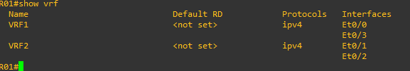
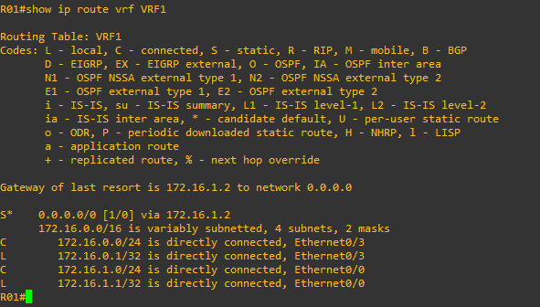

# 12 - Exemplo Pratico VRF LITE 02

Aqui não vou me alongar muito nas explicações e vou direto a prática. Para esse segundo exemplo vou utilizar o mesmo cenário doe exemplo anterior.

   

No exemplo anterior eu criei duas VRFs em cada roteador e escolhi utilizar rotas estáticas como meio de roteamento. Mas sabemos que para a parte de roteamento podemos utilizar protocolos dinâmicos para isso. Então, como parte da pratica, vou remover as configurações e vou começar do zero.   
Então vamos entrar no roteador 01 e mostrar as configurações das vrfs e as suas tabelas de roteamento.    

<table>
       <tr>
           <td width="33%"></img></td>
           <td width="33%"></img></td>
           <td width="33%"></img></td>
       </tr>
</table>

Agora vamos remover as rotas estáticas e as vrfs.  

<table>
       <tr>
           <td width="50%"></img></td>
           <td width="50%"></img></td>
       </tr>
</table>

Então agora devemos remover as vrfs. Note que ao retirarmos as vrfs de R01, automaticamente nos é apresentada a mensagem de que os ips são removidos das interfaces e com isso, as interfaces perdem também as associações com as vrfs.  

<table>
       <tr>
           <td width="50%"></img></td>
           <td width="50%"></img></td>
       </tr>
</table>

O mesmo processo deverá ser realizado em R02.  
Bom, como agora temos os roteadores configurados na condição inicial (sem VRFs, só com a tabela de roteamento global), então vamos configurar as VRFs 1 e 2 nos roteadores R01 e R02. Sim esse processo já foi feito anteriormente e não muda em nada, mas como trata-se de prática, quantos mais praticamos, mais fixamos os conceitos e comandos. Então vamos-lá.   

<table>
       <tr>
           <td width="50%"></img></td>
           <td width="50%"></img></td>
       </tr>
</table>

Novamente, devemos proceder com os mesmos comandos em R02.  
Veja como ficou em R02.  

   

Agora é só configurarmos os endereços de ip nas interfaces, uma vez que já criamos as VRFs e já associamos as devidas interfaces. Veja como ficaram as VRFs depois de configurarmos os endereços IP.   

<table>
       <tr>
           <td width="50%">ROTEADOR R01</td>
           <td width="50%">ROTEADOR R02</td>
       </tr>
       <tr>
           <td width="50%"></img></td>
           <td width="50%"></img></td>
       </tr>
</table>

Até aqui confesso que é pura e simples repetição do laboratório anterior. Mas agora vamos entrar na parte de roteamento. Agora vou utilizar protocolos dinâmicos.   

## OPEN SHORTEST PATH (OSPF) SINGLE ÁREA

Agora vou demonstrar como realizar o roteamento através do OSPF single área. Aqui, o processo é quase o mesmo quando temos nenhuma VRF configurada.  
Então vamos acessar R01 e habilitar o OSPF nas interfaces **E0/0 e E0/1**. Também vamos definir as mesmas interfaces como sendo do tipo **point-to-point** pois não queremos ativar a eleição de DR e BR nesses links uma vez que não temos mais roteadores participando do processo.   

<table>
       <tr>
           <td width="50%"></img></td>
           <td width="50%"></img></td>
       </tr>
</table>

Então o mesmo deverá ser feito em R02.   

<table>
       <tr>
           <td width="50%"></img></td>
           <td width="50%"></img></td>
       </tr>
</table>

Podemos notar que agora o processo de adjacência está completo e os roteadores se tornaram vizinhos.    

<table>
       <tr>
           <td width="50%"></img></td>
           <td width="50%"></img></td>
       </tr>
</table>

Mas ainda não completamos nosso cenário. Falta ainda habilitarmos o OSPF na interfaces **E0/2 e E0/3 em R01** e **E0/2 e E0/3 em R02**. Então vamos configurar os roteadores.   

<table>
       <tr>
           <td width="50%"></img></td>
           <td width="50%"></img></td>
       </tr>
</table>

Agora vamos verificar as tabelas de roteamento.   

   
   

Deixo aqui uma cópia do arquivo com a resolução . [LAB(RESOLVIDO)](Arquivos/vrf(resolvido).zip)
