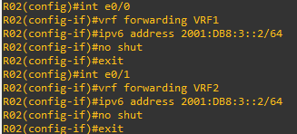

# 14 - Exemplo Pratico VRF LITE 04 - IPV6

Aqui não vou me alongar muito nas explicações e vou direto a prática. Para esse segundo exemplo vou utilizar o mesmo cenário doe exemplo anterior.

   

No exemplo anterior eu criei duas VRFs em cada roteador e escolhi utilizar rotas estáticas como meio de roteamento. Mas sabemos que para a parte de roteamento podemos utilizar protocolos dinâmicos para isso. Então, como parte da pratica, vou remover as configurações e vou começar do zero.   
Então vamos entrar no roteador 01 e mostrar as configurações das vrfs e as suas tabelas de roteamento.    

<table>
       <tr>
           <td width="33%"></img></td>
           <td width="33%"></img></td>
           <td width="33%"></img></td>
       </tr>
</table>

Agora vamos remover as rotas estáticas e as vrfs.  

<table>
       <tr>
           <td width="50%"></img></td>
           <td width="50%"></img></td>
       </tr>
</table>

Então agora devemos remover as vrfs. Note que ao retirarmos as vrfs de R01, automaticamente nos é apresentada a mensagem de que os ips são removidos das interfaces e com isso, as interfaces perdem também as associações com as vrfs.  

<table>
       <tr>
           <td width="50%"></img></td>
           <td width="50%"></img></td>
       </tr>
</table>

O mesmo processo deverá ser realizado em R02.  
Bom, como agora temos os roteadores configurados na condição inicial (sem VRFs, só com a tabela de roteamento global), então vamos configurar as VRFs 1 e 2 nos roteadores R01 e R02. Sim esse processo já foi feito anteriormente e não muda em nada, mas como trata-se de prática, quantos mais praticamos, mais fixamos os conceitos e comandos. Então vamos-lá.   

<table>
       <tr>
           <td width="50%"></img></td>
           <td width="50%"></img></td>
       </tr>
</table>

Novamente, devemos proceder com os mesmos comandos em R02.  
Veja como ficou em R02.  

   

Agora é só configurarmos os endereços de ip nas interfaces, uma vez que já criamos as VRFs e já associamos as devidas interfaces. Veja como ficaram as VRFs depois de configurarmos os endereços IP.   

<table>
       <tr>
           <td width="50%">ROTEADOR R01</td>
           <td width="50%">ROTEADOR R02</td>
       </tr>
       <tr>
           <td width="50%"></img></td>
           <td width="50%"></img></td>
       </tr>
</table>

Até aqui confesso que é pura e simples repetição do laboratório anterior. Mas agora vamos entrar na parte de roteamento. Agora vou utilizar protocolos dinâmicos.   

## Enhanced Interior Gateway Routing Protocol (EIGRP)

Agora aqui como opção de Roteamento Dinâmico escolhemos o EIGRP. Então vamos acessar o roteador R01 e vamos configurar esse protocolo.   

   
   

Percebam agora que a configuração é feita dentro da **definição da VRF dentro do parâmetro address-family** mas, basicamente é a mesma configuração que é realizada quando não se configuram as VRFs.   

Eu acho essa abordagem um pouco confusa e então prefiro realizar as configurações dentro das definições do protocolo eigrp. Dentro dele vamos ter também a **definição da VRF dentro do parâmetro address-family**. Agora aqui cabe um parênteses. Por questões de estabilidade, vou criar duas interfaces LoopBack, uma para cada VRF. Como elas sempre ficam no estado de up, elas ajudam a manter a estabilidade do processo de roteamento.   

   
   

Bom configuramos as interfaces e agora vou entrar no processo de roteamento EIGRP. Mas antes de mais nada, vou relembrar que o IGRP possui um número de processo e, os roteadores que estão na mesma área precisam ter o mesmo número do processo para que a vizinhança seja estabelecida. Outro ponto que vale ressaltar é que todo processo de EIGRP possui um número de **id que é escrito no formato do ipv4**. Esse parâmetro serve para identificar e distinguir cada roteador no processo do EIGRP. Serve também para a **Eleição do Sucessor e do Sucessor do Feasible (FS e FDS)**. Como estamos configurando o EIGRP em VRF, aqui teremos uma leve mudança, que é bem importante. Então vamos as configurações.  </brwr>

<table>
       <tr>
           <td width="50%">ROTEADOR R01</td>
           <td width="50%">ROTEADOR R01</td>
       </tr>
       <tr>
           <td width="50%"></img></td>
           <td width="50%"></img></td>
       </tr> 
       <tr>
           <td width="50%">ROTEADOR R02</td>
           <td width="50%">ROTEADOR R02</td>
       </tr>   
       <tr>
           <td width="50%"></img></td>
           <td width="50%"></img></td>
       </tr> 
</table>

Então podemos notar que dentro do parâmetro address-family adicionamos o parâmetro **autonomous-system**. Esse parâmetro é o mesmo parâmetro quando digitamos **router eigrp nº do processo**. Tanto o EIGRP quanto autonomous-system precisam ter o mesmo número pois esse é o número do processo do EIGRP que vai rodar dentro da caixa. Então vamos analisar agora como ficaram as tabelas de roteamento.   

<table>
       <tr>
           <td width="50%">ROTEADOR R01</td>
           <td width="50%">ROTEADOR R02</td>
       </tr>
       <tr>
           <td width="50%"></img></td>
           <td width="50%"></img></td>
       </tr>
</table>

Agora vamos acessar o vpc1 e realizar um teste.   

  
