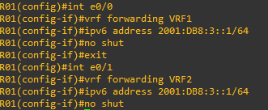
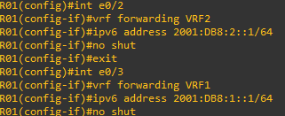
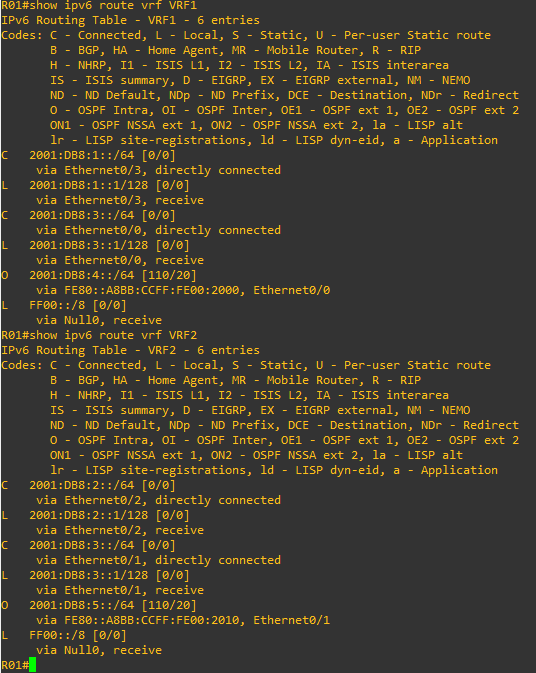

# 14 - Exemplo Pratico VRF LITE 04 - IPV6

Agora eu estou utilizando o mesmo cenário anterior porém eu estou utilizando IPv6. Também nos hosts não vou mais "duplicar" os endereços IPv6, somente nas interfaces que ligam os roteadores.     

   

No cenário temos configurado os hosts. Então vamos entrar nos equipamentos e criar as vrfs.   

<table>
      <tr>
          <td width="50%"></img></td>
          <td width="50%"></img></td>
      </tr>
</table>

Aqui eu defini duas VRFs, **VRF1 e VRF2** nos dois roteadores. Depois disso eu ativei o roteamento ipv6. Agora vamos colocar as interfaces nas respectivas VRFs e configurar seus IPs.   

<table>
      <tr>
          <td width="50%">ROTEADOR R01</td>
          <td width="50%">ROTEADOR R01</td>
      </tr>
      <tr>
          <td width="50%"></img></td>
          <td width="50%"></img></td>
      </tr>
      <tr>
          <td width="50%">ROTEADOR R02</td>
          <td width="50%">ROTEADOR R02</td>
      </tr>
      <tr>
          <td width="50%"></img></td>
          <td width="50%"></img></td>
      </tr>
</table>

Por questões de organização e estabilidade vou criar duas interfaces **LOOPBACK (Lo01 e Lo02)** nos dois roteadores e posteriormente vou associá-las as devidas VRFs.   

<table>
      <tr>
          <td width="50%">ROTEADOR R01</td>
          <td width="50%">ROTEADOR R02</td>
      </tr>
      <tr>
          <td width="50%"></img></td>
          <td width="50%"></img></td>
      </tr>
</table>

Nesse momento, agora falta somente a parte de roteamento, que eu optei pelo OSPF single área.   

## ROTEAMENTO OSPF SINGLE ÁREA

Agora vamos acessar os roteadores e realizar as configurações.   

<table>
      <tr>
          <td width="50%">ROTEADOR R01</td>
          <td width="50%">ROTEADOR R02</td>
      </tr>
      <tr>
          <td width="50%"></img></td>
          <td width="50%"></img></td>
      </tr>
</table>

Então vamos verificar as tabelas de roteamento.   

<table>
      <tr>
          <td width="50%">ROTEADOR R01</td>
          <td width="50%">ROTEADOR R02</td>
      </tr>
      <tr>
          <td width="50%"></img></td>
          <td width="50%"></img></td>
      </tr>
</table>