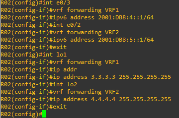
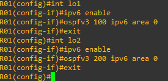
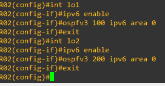
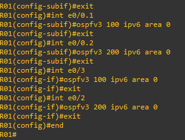

# 15 - Exemplo Pratico VRF LITE 04 - IPV6 (02)

Agora vou utilizar o mesmo cenário do exemplo anterior porém estou realizando uma pequena alteração alteração. Agora os roteadores estão ligados entre si somente por uma conexão.     

   

Se pararmos para analisar, agora vamos manter as duas VRFs, VRF1 e VRF2 que utilizamos até aqui porém só teremos uma interface de saída em cada roteador. Então como faremos para interligar as dois roteadores para que os mesmos possam permitir o tráfego das duas VRFs ?   

Bom vamos começar configurando as VRFs, as interfaces de Loopback e as interfaces que não se ligam aos roteadores.   
**OBS:** não se esquece que sempre que for utilizar o IPv6, você deverá ativar o roteamento IPv6 em modo global com o comando: **ipv6 unicast-routing**

<table>
      <tr>
          <td width="50%">ROTEADOR R01</td>
          <td width="50%">ROTEADOR R01</td>
      </tr>
      <tr>
          <td width="50%"></img></td>
          <td width="50%"></img></td>
      </tr>
      <tr>
          <td width="50%">ROTEADOR R02</td>
          <td width="50%">ROTEADOR R02</td>
      </tr>
      <tr>
          <td width="50%"></img></td>
          <td width="50%"></img></td>
      </tr>
</table>

Aqui eu defini duas VRFs, **VRF1 e VRF2** nos dois roteadores. Depois disso eu ativei o roteamento ipv6. Agora vamos colocar as interfaces nas respectivas VRFs e configurar seus IPs.   

<table>
      <tr>
          <td width="50%">ROTEADOR R01</td>
          <td width="50%">ROTEADOR R01</td>
      </tr>
      <tr>
          <td width="50%"></img></td>
          <td width="50%"></img></td>
      </tr>
      <tr>
          <td width="50%">ROTEADOR R02</td>
          <td width="50%">ROTEADOR R02</td>
      </tr>
      <tr>
          <td width="50%"></img></td>
          <td width="50%"></img></td>
      </tr>
</table>

Por questões de organização e estabilidade vou criar duas interfaces **LOOPBACK (Lo01 e Lo02)** nos dois roteadores e posteriormente vou associá-las as devidas VRFs.   

<table>
      <tr>
          <td width="50%">ROTEADOR R01</td>
          <td width="50%">ROTEADOR R02</td>
      </tr>
      <tr>
          <td width="50%"></img></td>
          <td width="50%"></img></td>
      </tr>
</table>

Nesse momento, agora falta somente a parte de roteamento, que eu optei pelo OSPF single área.   

## ROTEAMENTO OSPF SINGLE ÁREA

Agora vamos acessar os roteadores e realizar as configurações.   

<table>
      <tr>
          <td width="50%">ROTEADOR R01</td>
          <td width="50%">ROTEADOR R02</td>
      </tr>
      <tr>
          <td width="50%"></img></td>
          <td width="50%"></img></td>
      </tr>
</table>

Então vamos verificar as tabelas de roteamento.   

<table>
      <tr>
          <td width="50%">ROTEADOR R01</td>
          <td width="50%">ROTEADOR R02</td>
      </tr>
      <tr>
          <td width="50%"></img></td>
          <td width="50%"></img></td>
      </tr>
</table>

Agora vou entrar no VPC05 e vou realizar um Ping no VPC6 e depois no VPC4.   

   

Percebam que do VPC5 eu consigo Pingar pois estamos dentro da mesma VRF, a VRF1. Já do VPC5 não conseguimos pingar o VPC4 pois estamos em duas VRFS diferentes. Com isso conseguimos segregar o trafego de camada 3 dentro dos roteadores. Isso permite escalabilidade e crescimento.