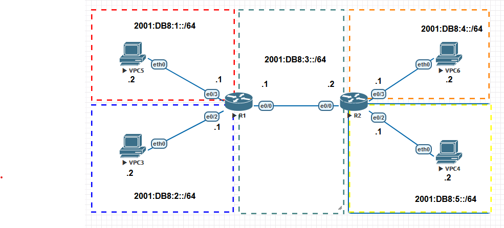
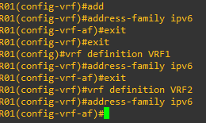
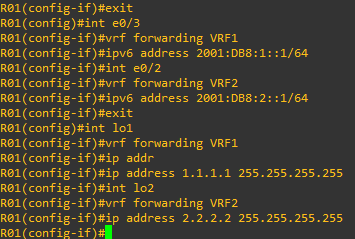
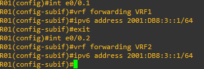
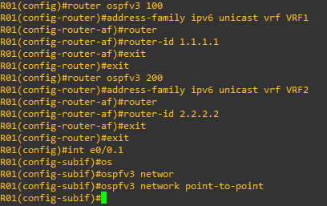
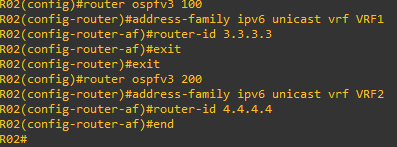

# 15 - Exemplo Pratico VRF LITE 04 - IPV6 (02)

Agora vou utilizar o mesmo cenário do exemplo anterior porém estou realizando uma pequena alteração alteração. Agora os roteadores estão ligados entre si somente por uma conexão.     

   

Se pararmos para analisar, agora vamos manter as duas VRFs, VRF1 e VRF2 que utilizamos até aqui porém só teremos uma interface de saída em cada roteador. Então como faremos para interligar os dois roteadores para que os mesmos possam permitir o tráfego das duas VRFs ?   

Bom vamos começar configurando as VRFs, as interfaces de Loopback e as interfaces que não se ligam aos roteadores.   
**OBS:** não se esquece que sempre que for utilizar o IPv6, você deverá ativar o roteamento IPv6 em modo global com o comando: **ipv6 unicast-routing**

<table>
      <tr>
          <td width="50%">ROTEADOR R01</td>
          <td width="50%">ROTEADOR R01</td>
      </tr>
      <tr>
          <td width="50%"></img></td>
          <td width="50%"></img></td>
      </tr>
      <tr>
          <td width="50%">ROTEADOR R02</td>
          <td width="50%">ROTEADOR R02</td>
      </tr>
      <tr>
          <td width="50%"></img></td>
          <td width="50%"></img></td>
      </tr>
</table>

Certo, então até aqui temos 02 VRFs em cada roteador, as interfaces ligadas aos hosts finais estão configuradas nas suas respectivas VRFs e temos também duas interfaces Loopbacks no dois roteadores. Agora falta a gente configurar as interfaces que ligam os roteadores. Já conseguiram imaginar como configurar agora ?   
Bom aqui iremos utilizar o recurso de sub interfaces para podermos resolver o problema. Então vamos acessar os equipamentos e configurá-los.   

<table>
      <tr>
          <td width="50%">ROTEADOR R01</td>
          <td width="50%">ROTEADOR R02</td>
      </tr>
      <tr>
          <td width="50%"></img></td>
          <td width="50%"></img></td>
      </tr>
<table>

Bom agora falta a parte de roteamento.    

## ROTEAMENTO OSPF SINGLE ÁREA

Agora vou direto em R01 e já vou adicionar as interfaces no OSPF e terminar os demais ajustes do protocolo.  

<table>
        <tr>
            <td width="33%"></img></td>
            <td width="33%"></img></td>
            <td width="33%"></img></td>
        </tr>
</table>

Vamos repetir o mesmo processo no roteador R02   

<table>
        <tr>
            <td width="33%"></img></td>
            <td width="33%"></img></td>
            <td width="3%"></img></td>
        </tr>
</table>