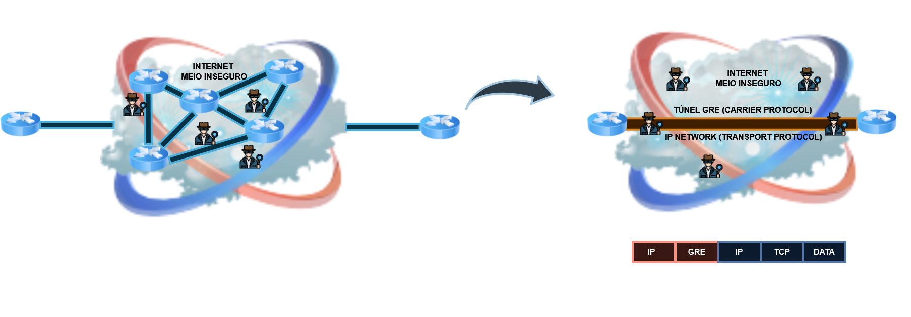
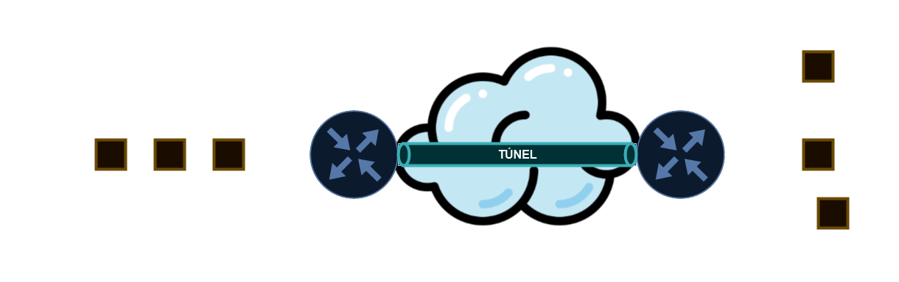
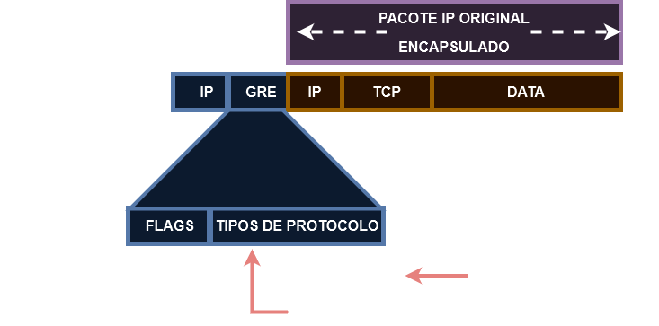
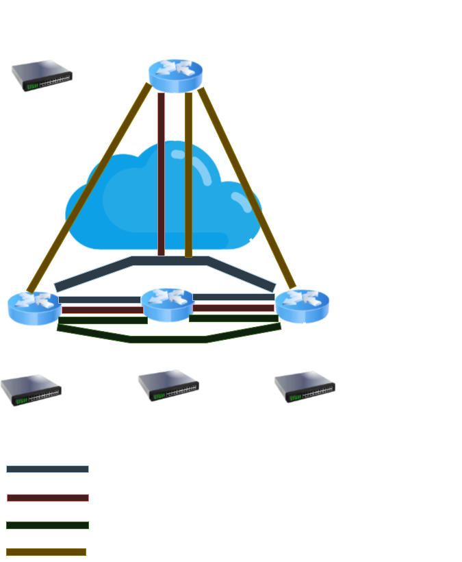

# 16 - TÚNEIS GRE (GENERIC ROUTING ENCAPSULATION)

Vamos pensar agora em tempos um pouco distantes onde as empresas com matriz e filial queriam se comunicar. Então cada ponta dessas empresas tinham que serem ligadas através de cabos diretos com links dedicados.   
Então as empresas solicitavam as operadoras esse tipo de ligação. Isso era caro e difícil de se manter.   
Percebendo esse cenário, o fabricantes pensaram da seguinte maneira: "Porque ao invés de se passar um cabo direto entre matriz e filial não se desenvolve algo que substitua isso e aproveite o link de Internet uma vez que as duas partes interessadas já possuem o link de Internet ?"   
Com esse pensamento em mete e com o passar do tempo, os links de Internet foram se popularizando e os custos diminuindo. Com isso, a CISCO desenvolveu os **Túneis GRE que estão descritos na rfc 4213.**   
Então, um túnel nada mais é a abstração do cabo, ou seja, é como se um "cabo virtual" fosse ligado no roteador da matriz e chegasse no roteador da filial. Com isso os custos caem pois agora não existe mais a necessidade de um cabo direto e os links de Internet são aproveitados.   
Mas aí é criado um outro problema: **segurança**. Como de início foi pensado só no túnel, não existe nenhum tipo de criptografia e o tráfego passa em modo transparente, ou seja, o tráfego vai acessar a Internet e quem estiver no mesmo meio pode interceptar essa comunicação e conseguir ver o tráfego. A solução para esse tipo de problema é a utilização do protocolo **IPSEC** sobre o túnel, pois ele vai criptografar os dados, e mesmo que o tráfego seja interceptado, a conversa não pode ser vista.   

## GRE: Generic Routing Encpasulation 

O GRE foi desenvolvido pela CISCO e está descrita na **RFC 4213**. Ele não provê segurança.   
Os pacotes enviados através do GRE são encapsulados por um novo cabeçalho e colocados no túnel com o endereço de destino final do túnel.  

   

Então como podemos observar nas figuras, o pacote pode passar por vários roteadores ao longo do caminho até chegar ao seu destino final.   
Porém quando utilizamos o GRE, formamos um túnel com início em um roteador terminando em outro, como em uma mtariz e filial. Esse é o nosso **overlay**, que fica sobre o **underlay**. Aos olhos do usuário final, isso é transparente, ou seja, se o usuário executar um **tracert**, será mostrado somente as interfaces dos roteadores que formam o túnel mas por trás disso, o pacote pode estar passando por um caminho complexo.   
Com isso podemos notar que o GRE adiciona um overhead no cabeçalho IP original e é necessário ficar atento ao tamanho do mtu do pacote agora. Ele encapsula o pacote original e acrescenta dois campos: **IP e GRE**.  
No destino, os pacotes são descapsulados e continuam seu caminho pelo cabeçalho original.   

  

Se os pacotes forem trafegar pela Internet, é necessário se ter IPs roteáveis nas pontas. O túnel também pode ser formado na Internet.   

## Principais Características do GRE

* **Multiprotocolo:** encapsula uma grande variedade de tipos de protocolos de pacotes dentro de túneis 
* **Cria um link virtual** ponto a ponto para os roteadores CISCO em pontos remotos através de uma rede **IP**
* **Usa o IP para transporte** (camada3) e suporta diversos de roteamento 
* **Utiliza um cabeçalho adicional** para suportar  multicasting e qualquer outro protocolo da camada 3 do modelo **OSI** como caraga útil (payload ou dados)

## Cabeçalho GRE

   

## Configurando um túnel GRE

* **ETAPA 1:** criar uma interface de túnel (comando **interface tunnel x** onde x é o número do túnel, como na criação de interfaces loopbacks)
* **ETAPA 2:** atribuir os endereços IPv4 e IPv6 ao túnel (comando **ip address e ipv6 address**)
* **ETAPA 3:** configurar a interface de origem (comando **tunnel source serial xy** podendo ser também um endereço IPv4 alcançável)
* **ETAPA 4:** identificar o IP de destino do túnel (comando **túnnel destination x.x.x.x**)
* **ETAPA 5:** (opcional) configurar qual protocolo de camada 3 o GRE vai encapsular (comando **tunnel mode gre {IP | IPv6 | Multipoint})
* **ETAPA 6:** Repita os mesmo passos no roteador remoto

## Comandos de verificações

Para verificar um túnel podemos utilizar os comandos:

* **show interface tunnel num-tunnel:** verificar o estado do túnel e detalhes da conexão
* **show ip interface brief:** verificar resumidamente o IP e o estado do túnel
* **traceroute IP-LAN-REMOTE:** verificar se o roteador pega a saída correta para a LAN remora via túnel 
* **Comandos para IPv6:** *show ipv6 interface tunnel num-tunnel; show ipv6 interface brief e traceroute*

## Desvantagem do GRE

* Muita configuração para ambientes grandes

   

Observe no exemplo que temos 4 roteadores. Então, para que cada roteador possa se ligar ao vizinho por túneis, são necessários criar 3 túneis por roteador. No exemplo temos 4 roteadores, logo **4 x 3 = 12** túneis para interligar tudo.   
Isso começa a ficar inviável pois o número de conexões e configurações a serem feitas fica grande, tudo de forma manual.   
Uma vez que o túnel é formado, ele não "cai", ele sempre fica ativo. Com isso, os túneis precisam trocar informações e, mesmo que eles não estejam em uso, eles sempre conseomem largura de banda.   

* **Solução: *DMVPN*** (Dynamic Multipoint VPN) com **mGRE** (GRE multiponto) e **NHRP** (Next Hop Resolution Protocol)

   