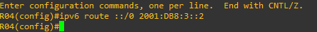
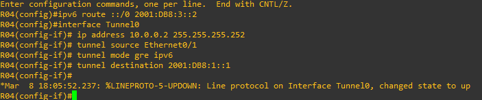
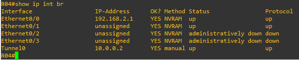
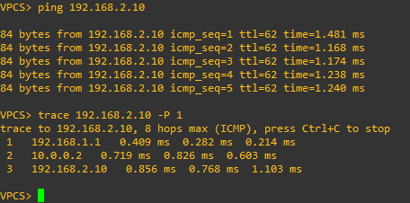
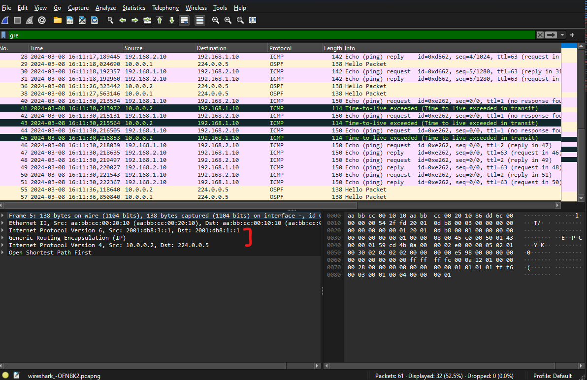

# 17 - Exemplo Prático - Tuneis GRE 01

Vamos imaginar a seguinte situação: estamos na empresa XPTO e precisamos ter comunicação com a filial através da Internet. O problema aqui é que ambas as partes, matriz e filial possuem somente redes utilizando o protocolo IPv4 e a empresa que fornece o link de Internet agora só funciona com o protocolo IPv6. Uma solução seria se utilizar os Tuneis GRE. Vamos analisar o cenário.  

   

Como podemos notar, o link da operadora só possui IPv6 e a matriz / filial só IPv4. Basicamente o que iremos fazer é criar um túnel GRE entra Matriz Filial e ele vai transportar o IPv4 dentro do Túnel GRE, ou seja, para os usuários é como se o tráfego passasse por R01 e fosse direto para R02 com comunicação IPv4.   

   

Mas como essa mágica é feita se temos somente uma rede IPv4 e a Operadora IPv6 ?  Simples, o GRE encapsula o pacote original e assim, o pacote encapsulado é suportado pelo túnel.    

   

Então vamos as configurações. Vamos acessar primeiro o roteador R01. Aqui vou assumir que o endereçamento de IP das interfaces já está configurada e que vamos configurar o default gateway para a interface de saída com a Internet, a interface E0/1.   

   

E agora vamos criar a interface túnel.   

   

Percebam que aqui eu indico a origem **(tunnel source)** como sendo a interface com saída para a Internet, a **E0/1**. Como destino eu indiquei o endereço IPv6 do roteador R04 da filial que está ligado na Internet. Então aqui temos origem e destino do túnel. Como vamos atravessar o tráfego pela Internet que somente é em IPv6, temos que fornecer o comando **tunnel mode gre ipv6** para ele entender que irá passar pelo IPv6. E depois eu configurei o endereço IPv4 dessa interface, ou seja, o túnel será formado em IPv4 mas está passando pela Internet em IPv6.   

Como podemos notar, ele exibe a Informação de que a interface Tunnel0 fica ativa mesmo não tendo a outra ponta do Túnel configurada. Também podemos confirmar através do comando **show ip interface brief**.   

   

Então agora o que falta é fazer o mesmo no outro lado do túnel, ou seja, fazer o mesmo em R04. Então vamos lá.   

    

Primeiro configuramos a rota padrão para a interface que está com saída para Internet. Agora vamos configurar a interface Tunnel0.   

   

Da mesma forma que configuramos em R01, aqui definimos a interface **tunnel source** como sendo a **E0/1** que tem a saída para Internet. Como destino **(source detination)** eu indico o IPv6 do roteador R01 da matriz. Também precisamos indicar o modo do túnel como **tunnel mode gre ipv6**.   

Então vamos verificar o status da interface tunel0.   

   

Bom, agora é possível se pingar os endereços dos túneis mas não os endereços internos da Matriz e Filial. Ainda falta a parte de roteamento. Para isso eu escolhi o protocolo OSPF como protocolo de roteamento. Então vamos configurar as duas pontas do túnel.   

<Table>
      <TR>
          <Td width="50%"> </img> </Td>
          <Td width="50%"> </img> </Td>
      </TR>
</Table>

Agora nesse momento podemos perceber que os túneis formaram o processo de adjacência e podemos pensar que agora as redes da Matriz e Filial conseguem se comunicar. Mas vamos analisar as tabelas de roteamento de ambos os roteadores para verificarmos os detalhes com calma.   

<Table>
      <TR>
          <Td width="50%"> </img> </Td>
          <Td width="50%"> </img> </Td>
      </TR>
</Table>

Como podemos perceber, ativamos o OSPF nas Interface Tunnel0 em R01 e R04 mas o ospf não informou nenhuma rota para os roteadores. O segredo aqui é que queremos que o ospf passe as interfaces diretamente conectadas, pois são elas que possuem a comunicação interna com as redes locais. Então vamos habilitar esse parâmetro no ospf.   

<Table>
      <TR>
          <Td width="50%"> </img> </Td>
          <Td width="50%"> </img> </Td>
      </TR>
</Table>

E vamos analisar novamente as tabelas de roteamento para ver a diferença agora.   

<Table>
      <TR>
          <Td width="50%"> </img> </Td>
          <Td width="50%"> </img> </Td>
      </TR>
</Table>

Agora podemos reparar que apareceu uma rota do tipo **E2 (External Type 2)** em cada roteador apontando para a rede local. Ou seja, o ospf agora passa a divulgar as interfaces diretamente conectadas e com isso as redes passam a se comunicar. Então vou fazer um teste do VPC1 para o VPC2. Vamos observar.   

   

Como podemos analisar através do ping, podemos notar que as duas redes agora se comunicam apesar de não suportarem o IPv6. Também podemos perceber através do trace que o pacote sai da rede 192.168.1.0, passa pela rede 10.0.0.0 e chega direto a rede 192.168.2.0 ,  ou seja, os roteadores agora pensam que os pacotes saem direto do roteador R01 para o R04 sem passar na Internet. Ele somente pensa, mas o trafego realmente atravessa a Internet.   

Para finalizar, eu abri uma sessão do Wireshark e realizei a captura de pacotes na interface E0/1 para podermos analisar a comunicação.   

   

Através da analise dessa captura, podemos notar que a comunicação começa em IPv6, ai o pacote é encapsulado pelo túnel GRE e depois vemos o pacote IPv4, dentro do túnel e, com isso é possível se ter a comunicação entre Matriz e Filial.