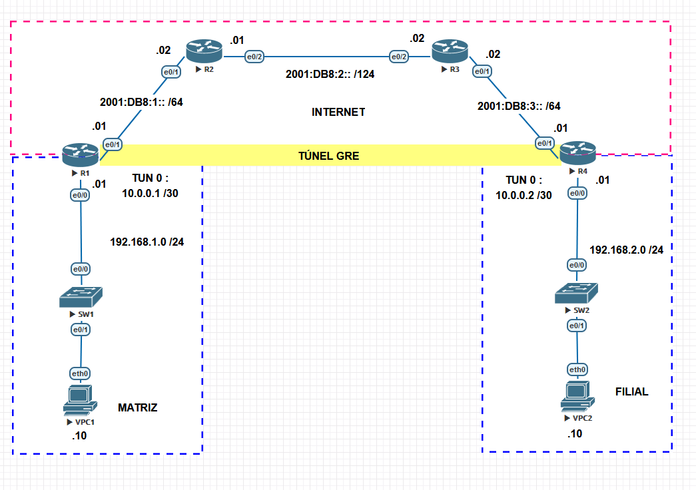
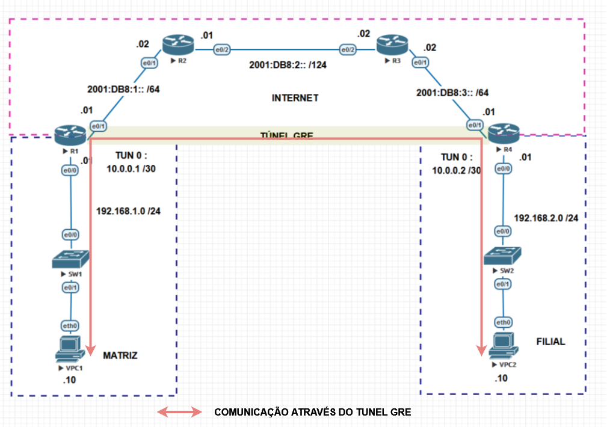
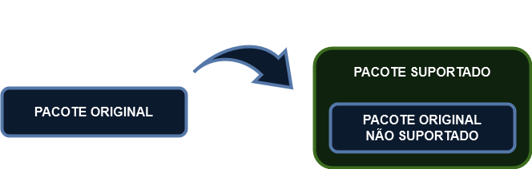
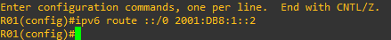
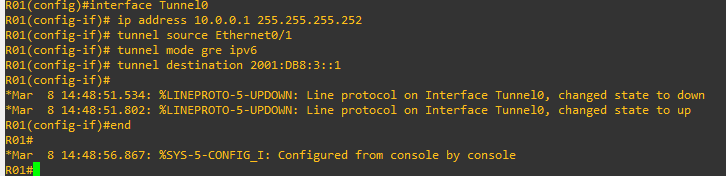
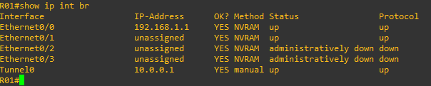

# 17 - Exemplo Prático - Tuneis GRE 01

Vamos imaginar a seguinte situação: estamos na empresa XPTO e precisamos ter comunicação com a filial através da Internet. O problema aqui é que ambas as partes, matriz e filial possuem somente redes utilizando o protocolo IPv4 e a empresa que fornece o link de Internet agora só funciona com o protocolo IPv6. Uma solução seria se utilizar os Tuneis GRE. Vamos analisar o cenário.  

   

Como podemos notar, o link da operadora só possui IPv6 e a matriz / filial só IPv4. Basicamente o que iremos fazer é criar um túnel GRE entra Matriz Filial e ele vai transportar o IPv4 dentro do Túnel GRE, ou seja, para os usuários é como se o tráfego passasse por R01 e fosse direto para R02 com comunicação IPv4.   

   

Mas como essa mágica é feita se temos somente uma rede IPv4 e a Operadora IPv6 ?  Simples, o GRE encapsula o pacote original e assim, o pacote encapsulado é suportado pelo túnel.    

   

Então vamos as configurações. Vamos acessar primeiro o roteador R01. Aqui vou assumir que o endereçamento de IP das interfaces já está configurada e que vamos configurar o default gateway para a interface de saída com a Internet, a interface E0/1.   

   

E agora vamos criar a interface túnel.   

   

Percebam que aqui eu indico a origem **(tunnel source)** como sendo a interface com saída para a Internet, a **E0/1**. Como destino eu indiquei o endereço IPv6 do roteador da filial que está ligado na Internet. Então aqui temos origem e destino do túnel. Como vamos atravessar o tráfego pela Internet que somente é em IPv6, temos que fornecer o comando **tunnel mode gre ipv6** para ele entender que irá passar pelo IPv6. E depois eu configurei o endereço IPv4 dessa interface, ou seja, o túnel será formado em IPv4 mas está passando pela Internet em IPv6.   

Como podemos notar, ele exibe a Informação de que a interface Tunnel0 fica ativa mesmo não tendo a outra ponta do Túnel configurada. Também podemos confirmar através do comando **show ip interface brief**.   

   

Então agora o que falta é fazer o mesmo no outro lado do túnel, ou seja, fazer o mesmo em R04. Então vamos lá.   

    