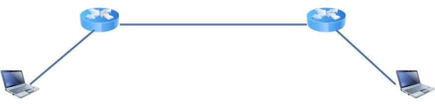
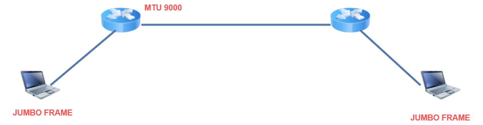
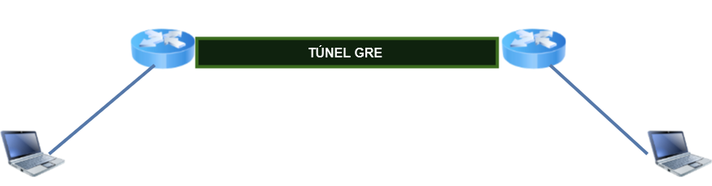
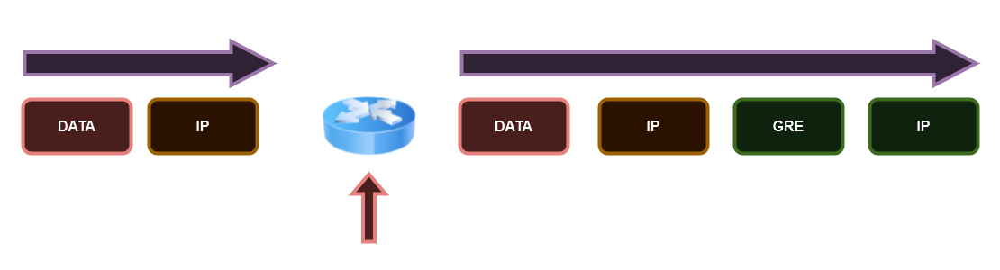
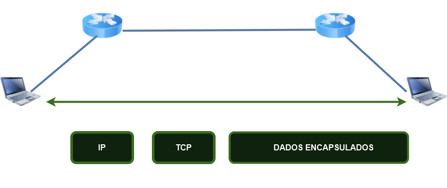

# 18 - Considerações sobre MTU e MSS e Túneis GRE

**MTU = Maximum Transmission Unit (Uniddade Máxima de Transmissão)**   
**MSS = Maximum Segment Size (Tamanho Máximo de um Segmento)**

## MTU

Quando falamos de MTU, precisamos ter em mente que existem diferentes tipos de MTU que seguem o modelo OSI.   
Então quando falamos MTU, normalmente estamos falando de **camada 02**, ou seja, estamos falando do tamanho máximo em bytes da quantidade de dados que um quadro pode ter.   
Mas não existe uma negociação no meio, esse é um parâmetro que é configurado nas portas de roteadores, switches, etc.   

   

Então como não há uma negociação, um lado do link não conhece o MTU do outro lado, e com isso, poderão existir MTUs diferentes. Nesse caso dizemos que quando essa situação ocorre temos **um mismatch de MTUs**. Com isso os pacotes são descartados e o contador **Giant** é acrescentado.   

## MTUs acima do padrão - Jumbo Frames

Bom sabemos o tamanho padrão do MTU é de 1500 bytes. Mas e se ocorrer uma necessidade de se transmitir informações maiores do que **1500 bytes?**   
Existem os frames chamados de ***Jumbo Frames***, ou seja, são frames **são frames maiores que 1500 bytes e vão até 9000 byes**.   
Esse tipo de necessidade é mais comum em data center. Para essa comunicação ocorrer, é necessário que esse tipo de frame seja configurado nas portas dos roteadores e switches e; os servidores e endpoints envolvidos também estejam configurados para utilizar os *jumbo frames*.   

   

## IP MTU

   

   

Esse é um valor de camada 3, ou seja, é um valor que precisa ser ajustado conforme o tipo de protocolo que irá passar nas interfaces.   
Então no caso de um túnel GRE, precisam ser adicionadas dados dos cabeçalhos IP original. Por esse motivo, o tamanho do **IP MTU** fica menor que os 1500 bytes.   
Se esse valor não for ajustado e o IP MTU ficar acima dos 1500 bytes, ou o pacato é descartado ou ocorrerá fragmentação. Isso pode ser um problema pois existem equipamentos que não suportam a fragmentação. Isso pode até fazer com que o túnel GRE pare de funcionar se ocorrer.   

No exemplo, o MTU no túnel GRE foi configurado para **1400 bytes**. Então podemos observar que 1400 bytes é o tamanho total do pacote IP nesse túnel e que depois é **adicionado mais 24 bytes** do túnel GRE. Com isso, não ocorrerá fragmentação.   

## MSS - CAMADA 4

   

