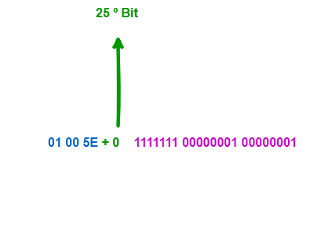

- [01 - Multicast](#01---multicast)
  - [Faixas de Endereçamento IP](#faixas-de-endereçamento-ip)
    - [**IPV4**](#ipv4)
    - [**IPV6**](#ipv6)
  - [Problemas de não utilizar o multicast](#problemas-de-não-utilizar-o-multicast)
  - [Endereçamento Multicast](#endereçamento-multicast)
  - [Tipos de Endereço Multicast](#tipos-de-endereço-multicast)
  - [Tipos de Endereço Multicast IPv4](#tipos-de-endereço-multicast-ipv4)
    - [1. Endereços Bem Conhecidos (Well-Known)](#1-endereços-bem-conhecidos-well-known)
    - [2. Escopo Global - 224.0.1.0/24 (Internetwork Control Block)](#2-escopo-global---22401024-internetwork-control-block)
    - [3. Endereços Multicast Privados ("Administratively Scoped Addresses")](#3-endereços-multicast-privados-administratively-scoped-addresses)
    - [4 Source-Specific Multicast (SSM)](#4-source-specific-multicast-ssm)
    - [5 GLOP Addressing](#5-glop-addressing)
    - [6 Multicast com Prefixo Unicast (Embedded-RP ou IPv4 Multicast prefix-based)](#6-multicast-com-prefixo-unicast-embedded-rp-ou-ipv4-multicast-prefix-based)
  - [Tipos de Endereço Multicast IPv6](#tipos-de-endereço-multicast-ipv6)
    - [1. Escopo IPv6 Multicast (Scope Field)](#1-escopo-ipv6-multicast-scope-field)
    - [2. MLD (Multicast Listener Discovery)](#2-mld-multicast-listener-discovery)
  - [Formação de Endereços de Camada 02 (Mac Address)](#formação-de-endereços-de-camada-02-mac-address)
  - [IPv4](#ipv4-1)
  - [IPv6](#ipv6-1)
    - [Estrutura do Endereço Multicast IPv6](#estrutura-do-endereço-multicast-ipv6)
    - [Mapeamento de IPv6 Multicast para MAC Address](#mapeamento-de-ipv6-multicast-para-mac-address)
  - [Simulados](#simulados)
  - [Multicast - Árvore de Distribuição](#multicast---árvore-de-distribuição)

## Formação de Endereços de Camada 02 (Mac Address)

## IPv4

Para qualquer host pode responder a alguma requisição em redes IP, ele tem um endereço de camada 2 chamado de mac address que é único. Porém, agora como estamos em multicast, os hosts
tem que responder a um endereço de grupo de multicast para poderem fazer parte desse grupo. Como as placas de rede podem receber vários fluxos de comunicação ao mesmo tempo, é assim que eles conseguem identificar os fluxos multicast. Mas para tanto, foram criadas algumas regras específicas.  

Primeiro, precisamos lembrar que o MAC address é um endereço de 12 dígitos hexadecimais, com segmentos de 8 bits contendo no total 48 bits. Exemplo: 00:11:22:33:44:55 

### Regras de Formação IPv4 Multicast MAC:

- Os **primeiros 24 bits** de um Mac Address de multicast sempre serão **01:00:5E**
- O primeiro bit mais à esquerda é conhecido como **individual/group bit (I/G)** e, sempre que ele for o valor **1**, isso indica que ele é um multicast.
- O vigésimo quinto bit sempre será setado em **0**. Isso é feito para evitar ambiguidades e tentar manter o endereço de multicast em faixas menores.
- O restante dos outros **23 bits** é utilizado para calcular o resto do endereço de multicast.

**Comandos para Verificar MAC Multicast:**

```ios
! Verificar tabela MAC com endereços multicast
Switch# show mac address-table multicast

! Verificar endereços MAC específicos
Switch# show mac address-table address 01005e.xxxx.xx

! Monitorar tráfego multicast na interface
Switch# show interfaces gigabitethernet0/1 counters
```

Agora vamos a um exemplo de como funciona essa regra. Vamos transformar o endereço IP 239.255.1.1 .  

  

Certo agora aplicamos a regra.  

  

E por fim agora é só converter a parte em Binário para Hexadecimal.  

  

**Comandos para Teste Prático:**  

```ios
! Testar conectividade multicast
Router# ping 239.255.1.1

! Verificar grupos IGMP na interface
Router# show ip igmp groups interface gigabitethernet0/1

! Capturar tráfego para análise
Router# debug ip packet 239.255.1.1
```

## Problema de Sobreposição

Agora vamos pensar um pouco. Se os 25 primeiro bits são fixos, isso não pode gerar algum tipo de problema ? Sim, podem existir sobreposições de endereços uma vez que somente os 23 últimos bits vão variar. Vamos supor que eu tenha endereços que os 23 últimos bits seja iguais. Vamos ao exemplo:  

  

Esse tipo de problema pode fazer com que hosts que não sejam os alvos comecem a receber os tráfegos não solicitado e isso dificulta a gerência dos grupos multicast. Para solucionar esse tipo de problema devemos fazer filtragem de pacotes com o uso de Vlans, ACLS e Firewalls controlando o fluxo de dados.  

**Comandos para Identificar Sobreposições:**  

```ios
! Verificar conflitos de MAC multicast
Switch# show mac address-table | include 01005e

! Verificar grupos IGMP ativos
Router# show ip igmp groups summary

! Filtrar por endereços específicos
Switch# show mac address-table vlan 10 | include 01005e
```

Para solucionar esse tipo de problema devemos fazer filtragem de pacotes com o uso de Vlans, ACLS e Firewalls controlando o fluxo de dados.  

**Comandos para Mitigação:**  

```ios
! Configurar IGMP Snooping para controle
Switch(config)# ip igmp snooping
Switch(config)# ip igmp snooping vlan 10

! Configurar boundaries multicast
Router(config-if)# ip multicast boundary 10
Router(config)# access-list 10 deny 239.255.1.0 0.0.0.255
```

Por outro lado, se considerarmos IPv6, o espaço de endereçamento IP é muito maior e esse tipo de problema é evitado. Portanto, a recomendação é utilizar IPv6 sempre que possível.

## IPv6

A formação de endereços IPv6 em multicast é estruturada de forma diferente do IPv4, e uma das principais vantagens é a forma como o mapeamento para endereços MAC de camada 2 é feito, eliminando a colisão que acontece no IPv4.  

O endereço IPv6 multicast é sempre do tipo **ff00::/8**, o que significa que os primeiros **8 bits** são fixos em **1111 1111 (ff em hexadecimal)**. O restante do endereço é dividido em campos que definem a finalidade e o escopo do grupo multicast.  

### Estrutura do Endereço Multicast IPv6

O formato geral de um endereço multicast IPv6 é: **FF [flags] [scope] :: [group ID]**

- **FF (8 bits):** É o prefixo que identifica o endereço como multicast.

- **flags (4 bits):** Indicam o tipo do endereço multicast. Os dois primeiros bits são reservados (sempre 0), e os outros dois indicam se o endereço é permanente (0) ou temporário (1), e se ele é atribuído com base em um prefixo unicast (1).

- **scope (4 bits):** Define o escopo de atuação do grupo multicast, limitando a propagação do tráfego. Alguns escopos comuns são:  

        **1 (Interface-Local):** Válido apenas na interface.

        **2 (Link-Local):** Válido apenas no link (rede local).

        **5 (Site-Local):** Válido apenas dentro de uma empresa ou campus.

        **E (Global):** Endereço publicamente roteável pela Internet.

- **group ID (112 bits):** É o identificador único do grupo multicast.

**Comandos para Análise de Estrutura:**  

```ios
! Verificar endereços IPv6 multicast por escopo
Router# show ipv6 mroute | include ff02
Router# show ipv6 mroute | include ff05

! Testar conectividade por escopo
Router# ping ipv6 ff02::1
Router# ping ipv6 ff05::1
```

### Mapeamento de IPv6 Multicast para MAC Address

Este é o ponto principal e uma melhoria significativa em relação ao IPv4.  

- O prefixo MAC para multicast IPv6 é fixo: **33:33:00:00:00:00**.

- Para criar o endereço MAC completo, os últimos **32 bits (a parte do group ID)** do endereço IPv6 multicast são copiados e anexados aos últimos 32 bits do endereço MAC, substituindo os zeros.  

**Exemplo:**

```text
    Endereço IPv6 Multicast: ff02::1:ff1e:8899

    Endereço MAC de Destino:

        O prefixo fixo é 33:33:.

        Os últimos 32 bits do endereço IPv6 são ff:1e:88:99.

        O endereço MAC final será 33:33:ff:1e:88:99.
```

**Comandos para Verificação IPv6:**  

```ios
! Verificar mapeamento IPv6 para MAC
Switch# show mac address-table | include 3333

! Testar endereço específico
Router# ping ipv6 ff02::1:ff1e:8899

! Debug MLD para ver mapeamentos
Router# debug ipv6 mld events
```

**Vantagem sobre o IPv4:**

Ao contrário do IPv4, onde 23 bits do endereço multicast são mapeados para o MAC (o que causa o problema de múltiplos endereços IP mapearem para o mesmo endereço MAC), no IPv6, todos os 32 bits do group ID são usados. Isso significa que cada endereço IPv6 multicast corresponde a um único endereço MAC multicast, eliminando a possibilidade de colisões de endereçamento na camada 2.  

**Comandos Comparativos:**  

```ios
! Comparar tabelas MAC IPv4 vs IPv6
Switch# show mac address-table | include 01005e | count
Switch# show mac address-table | include 3333 | count

! Verificar uso de recursos
Switch# show processes cpu | include IGMP|MLD
Switch# show memory processes | include IGMP|MLD
```

**Troubleshooting de MAC Multicast:**

```ios
! Problemas gerais de multicast L2
Switch# show ip igmp snooping
Switch# show ipv6 mld snooping

! Verificar flooding multicast
Switch# show mac address-table aging-time
Switch# show spanning-tree interface gi0/1 portfast

! Limpar tabelas para teste
Switch# clear mac address-table
Switch# clear ip igmp snooping statistics
```

## Simulados

- **[Simulado 01](https://alcancil.github.io/Cisco/CCNP%20350-401%20ENCOR/03%20-%20Infrastructure/01%20-%20Multicast/01%20-%20Multicast/Arquivos/Simulado/01.html)**
- **[Simulado 02](https://alcancil.github.io/Cisco/CCNP%20350-401%20ENCOR/03%20-%20Infrastructure/01%20-%20Multicast/01%20-%20Multicast/Arquivos/Simulado/02.html)**  
- **[DASHBOARD](https://alcancil.github.io/Cisco/CCNP%20350-401%20ENCOR/03%20-%20Infrastructure/01%20-%20Multicast/01%20-%20Multicast/Arquivos/Simulado/dashboard.html)**  
