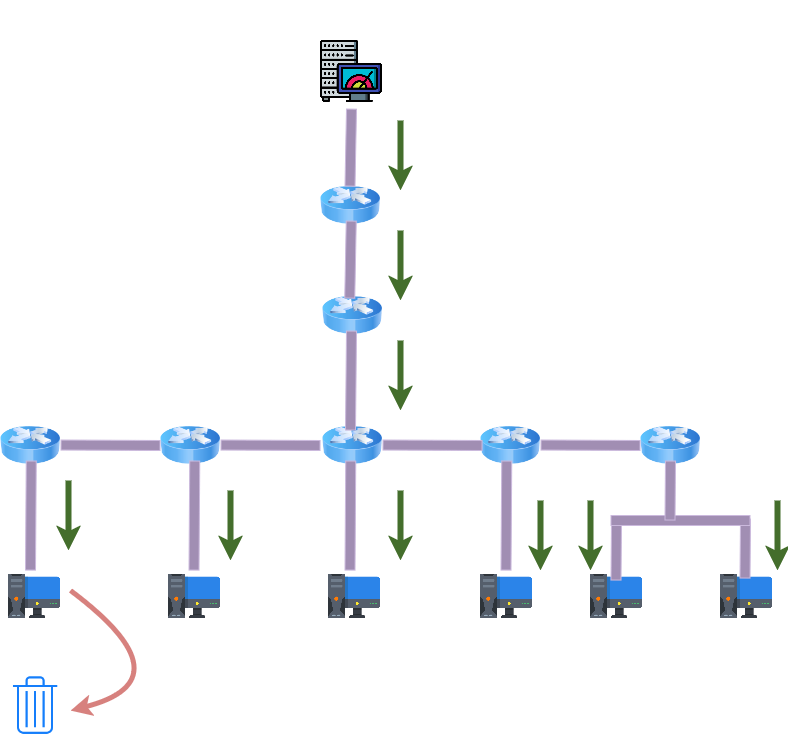

- [01 - Multicast](#01---multicast)
  - [Faixas de Endereçamento IP](#faixas-de-endereçamento-ip)
    - [**IPV4**](#ipv4)
    - [**IPV6**](#ipv6)
  - [Problemas de não utilizar o multicast](#problemas-de-não-utilizar-o-multicast)
  - [Endereçamento Multicast](#endereçamento-multicast)
  - [Tipos de Endereço Multicast](#tipos-de-endereço-multicast)
  - [Tipos de Endereço Multicast IPv4](#tipos-de-endereço-multicast-ipv4)
    - [1. Endereços Bem Conhecidos (Well-Known)](#1-endereços-bem-conhecidos-well-known)
    - [2. Escopo Global - 224.0.1.0/24 (Internetwork Control Block)](#2-escopo-global---22401024-internetwork-control-block)
    - [3. Endereços Multicast Privados ("Administratively Scoped Addresses")](#3-endereços-multicast-privados-administratively-scoped-addresses)
    - [4 Source-Specific Multicast (SSM)](#4-source-specific-multicast-ssm)
    - [5 GLOP Addressing](#5-glop-addressing)
    - [6 Multicast com Prefixo Unicast (Embedded-RP ou IPv4 Multicast prefix-based)](#6-multicast-com-prefixo-unicast-embedded-rp-ou-ipv4-multicast-prefix-based)
  - [Tipos de Endereço Multicast IPv6](#tipos-de-endereço-multicast-ipv6)
    - [1. Escopo IPv6 Multicast (Scope Field)](#1-escopo-ipv6-multicast-scope-field)
    - [2. MLD (Multicast Listener Discovery)](#2-mld-multicast-listener-discovery)
  - [Formação de Endereços de Camada 02 (Mac Address)](#formação-de-endereços-de-camada-02-mac-address)
  - [IPv4](#ipv4-1)
  - [IPv6](#ipv6-1)
    - [Estrutura do Endereço Multicast IPv6](#estrutura-do-endereço-multicast-ipv6)
    - [Mapeamento de IPv6 Multicast para MAC Address](#mapeamento-de-ipv6-multicast-para-mac-address)
  - [Simulados](#simulados)
  - [Multicast - Árvore de Distribuição](#multicast---árvore-de-distribuição)

# 01 - Multicast

Para falar sobre o tipo de comunicação **multicast** é preciso fazer uma pequena revisão. Então primeiramente vamos observar os tipos de comunicação existentes.

| UNICAST                         | BROADCAST                            | MULTICAST                                     |
|---------------------------------|--------------------------------------|-----------------------------------------------|
|  |   |            |

Como podemos observar, quando o tráfego vai de um emissor para um receptor podemos chamar de **unicast**, ou seja, é um tráfego direto. Um exemplo que podemos citar desse tipo de comunicação é a ligação telefônica por exemplo, ou mesmo quando se faz um acesso via ssh para algum equipamento.  

Depois temos o **broadcast**. Diferente do primeiro tipo de comunicação, esse é um tipo de comunicação onde um envia e todos recebem. Podemos citar o exemplo do protocolo arp onde os equipamentos precisam mapear o endereço mac com o endereço IP. Para o protocolo arp poder descobrir a quem pertence um endereço IP por exemplo, ele faz um "flood" para todos os equipamentos na rede e com isso a comunicação se dá de forma conhecida por **broadcast**.

Agora se analisarmos bem esses dois tipos de comunicação iremos perceber que no unicast a comunicação se dá de uma forma mais eficiente pois ela entrega os pacotes somente para o destinatário escolhido. Já no broadcast, todos recebem os pacotes independentemente se eles precisam ou não receber tal pacote. Isso faz com que o host que receba o pacote tenha que analisar o mesmo, verificar se ele é o destinatário e se não for, descartar o mesmo. Essa forma de comunicação não é muito eficiente pois em ambientes muito grandes ocupa banda muitas vezes desnecessárias e faz com que o host tenha que processar o pacote e consumir memória e processador.  

Com base nessa limitação, foi desenvolvido o **multicast**. Agora, nesse tipo de comunicação, existe uma fonte de envio de dados mas somente um grupo, ou grupos de hosts que irão receber esses dados. Com isso, o consumo de banda do meio é utilizada de forma mais eficiente e não força quem não tem que fazer parte da conversa receber dados indesejados.  

## Faixas de Endereçamento IP

### **IPV4**

| Classe de IP             | Faixa de Endereçamento         |
|--------------------------|--------------------------------|
| Classe A                 | 0.0.0.0 a 127.255.255.255      |  
| Classe B                 | 128.0.0.0 a 191.255.255.255    |
| Classe C                 | 192.0.0.0 a 223.255.255.255    |
| **Classe D (Multicast)** | **224.0.0.0 a 239.255.255.255**|
| Classe E (Reservado)     | 240.0.0.0 a 247.255.255.255    |

### **IPV6**

| Tipo de Endereço    |  Faixa de Endereçamento | Descrição                                                                                                                          |
| ------------------   | ------------------- | ----------------------------------------------------------------------------------------------------------------------------------------|
| Unicast Global       |  2000::/3           | Usado para comunicação unicast na Internet. É equivalente aos endereços públicos no IPv4.                                               |
| Unicast Link-Local   |  FE80::/10          | Usado para comunicação dentro de um link (como em uma LAN). Esses endereços são configurados automaticamente em cada interface de rede. |
| Unicast Unique Local |  FC00::/7          | Endereços para redes privadas (semelhante a 192.168.0.0/16 no IPv4).                                                                    |
| **Multicast**        |  FF00::/8           | Usado para comunicação multicast.                                                                                                       |
| Anycast              | Derivado de unicast | Endereços unicast atribuídos a vários nós, mas roteados para o mais próximo.                                                            |
| Loopback                 | ::1            | Endereço para a própria máquina (equivalente a 127.0.0.1 no IPv4).                                                                      |
| Endereço Não Especificado | ::          | Indica ausência de endereço (usado como fonte em algumas situações, como durante a autoconfiguração).                                   |
| Reservado            |4000::/2, 6000::/3 e outras faixas | Reservado pela IETF para uso futuro.                                                                                      |
| Embedded IPv4        | ::FFFF:0:0/96 e 2002::/16 | Usado para compatibilidade com IPv4, como no caso de NAT64 (endereço mapeado para IPv4) ou redes 6to4.                            |

**Destaques sobre a tabela:**  

- **Unicast Global:** Utilizado para endereços roteáveis na Internet.
- **Link-Local:** Necessário para operações básicas dentro de uma rede local; todos os dispositivos IPv6 têm um endereço link-local automaticamente.
- **Multicast:** Substitui a funcionalidade de broadcast no IPv6.  
- **Loopback:** Para testes internos no dispositivo.  

Dois pontos importantes sobre multicast em camadas 2 e 3:

- **Camada 2 (Switches):** Utilizam IGMP Snooping para "escutar" as mensagens IGMP entre hosts e roteadores, criando uma tabela de quais portas têm hosts interessados em cada grupo multicast.

- **Camada 3 (Roteadores):** Gerenciam os grupos multicast localmente via IGMP e fazem o roteamento inter-redes via PIM (Protocol Independent Multicast).

O IGMP funciona entre hosts e roteadores dentro de uma rede local, mas quando é necessário enviar tráfego multicast para outras redes, o protocolo PIM é responsável pelo roteamento inter-redes.

**Observação:** Existem outros protocolos multicast além do PIM (como DVMRP e MOSPF), porém o PIM se tornou o padrão da indústria para roteamento multicast.

  

- **Origem Multicast:** É o servidor que envia o tráfego multicast para o grupo.

- **FHR (First Hop Router):** É o roteador de "primeiro salto" que está diretamente conectado à origem. Ele recebe o tráfego multicast primeiro e inicia o processo de roteamento PIM.

- **Local Multicast Router:** Roteadores intermediários que participam da árvore PIM.

- **Switch Layer 2 com IGMP Snooping:** Dispositivo que usa o IGMP Snooping para aprender quais portas têm hosts interessados em um grupo multicast específico, evitando inundações de tráfego na rede local.

- **Hosts:** Recebem o tráfego multicast após enviarem uma Mensagem de Pedido IGMP (IGMP Join) para se juntar ao grupo.

## Problemas de não utilizar o multicast

Depois de entender isso, vamos analisar um cenário onde eu tenho um servidor de vídeos e que esteja transmitindo para a rede toda em **broadcast**. Agora vamos supor que em cada salto,
eu ocupe 10mbs de largura de banda.  

  

Como podemos perceber, o servidor de vídeos envia os pacotes para todos os computadores da rede. Vamos supor que o servidor de vídeos ocupe 10 Mbps para enviar os dados. Rapidamente podemos notar que a cada salto então teríamos que ter uma largura de banda 10 Mbps no mínimo para cada salto. Agora vamos imaginar que cada host resolva assistir a 5 vídeos ao mesmo tempo.
Portanto teríamos que ter 50 Mbps de largura de banda, mesmo para os hosts não interessados. Isso é refletido em desperdício de banda e, outro ponto é que os hosts finais não interessados
necessariamente precisam processar esses pacotes consumindo mais processador e memória.  

Como podemos observar nas duas topologias apresentadas, temos duas situações: a comunicação em camada 2 e a comunicação em camada 3. Para a comunicação em camada 2, utilizaremos o **protocolo IGMP (Internet Group Management Protocol)** e em camada 3 o **protocolo PIM (Protocol Independent Multicast)** .  

**OBS:** O protocolo IGMP é ativado em switches e tem a função ***snooping*** ( no sentido de escuta em inglês), ou seja, ele trabalha com  requisições e envios de informações. Já o protocolo
***PIM*** é ativado em roteadores.

## Endereçamento Multicast

Como mencionado anteriormente, foram definidas faixas de endereços IPv4 e IPv6 para a comunicação multicast. Seguem as faixa de endereços definidas pela IANA.  

**IPv4**  

| Designação                                       | Faixa de endereços Multicast            |
|--------------------------------------------------|-----------------------------------------|
| Local network control block                      | 224.0.0.0 to 224.0.0.255                |
| Internetwork control block                       | 224.0.1.0 to 224.0.1.255                |
| Ad hoc block I                                   | 224.0.2.0 to 224.0.255.255              |
| Reserved                                         | 224.1.0.0 to 224.1.255.255              |
| SDP/SAP block                                    | 224.2.0.0 to 224.2.255.255              |
| Ad hoc block II                                  | 224.3.0.0 to 224.4.255.255              |
| Reserved                                         | 224.5.0.0 to 224.251.255.255            |
| DIS Transient Groups                             | 224.252.0.0 to 224.255.255.255          |
| Reserved                                         | 225.0.0.0 to 231.255.255.255            |
| Source Specific Multicast (SSM) block            | 232.0.0.0 to 232.255.255.255            |
| GLOP block                                       | 233.0.0.0 to 233.251.255.255            |
| Ad hoc block III                                 | 233.252.0.0 to 233.255.255.255          |
| Unicast-Prefix-based IPv4 Multicast Addresses    | 234.0.0.0 to 234.255.255.255            |
| Reserved                                         | 235.0.0.0 to 238.255.255.255            |
| Organization-Local Scope (Administratively scoped block) | 239.0.0.0 to 239.255.255.255    |

Para informações mais detalhadas e atualizadas, consulte o registro oficial da IANA:
[Registro oficial de endereços multicast IPv4 pela IANA](https://www.iana.org/assignments/multicast-addresses/multicast-addresses.xhtml)  

• **Local network control block (224.0.0.0/24):** Endereços de controle no bloco de rede local são utilizados pelos ***protocolos de controle de tráfego*** e não são encaminhados para domínios de broadcast. São de escopo local. Exemplos desses endereços são o ***todos os hosts nessa sub-rede (224.0.0.0.2) e todos os roteadores PIM (224.0.0.13)***  

• **Internetwork control block (224.0.1.0/24):** Esse é um bloco de endereços que pode ser transmitidos através da Internet. Exemplos incluem ***Network Time Protocol (NTP), (224.0.1.1), Cisco-RP-Announce (224.0.1.39), e Cisco-RP-Discovery (224.0.1.40).***  

• ***Organization-Local Scope (239.0.0.0/8):*** São endereços definidos na RFC 2365 e tem escopo local. São similares aos endereços da ***RFC 1918**.  

 Em outras palavras os administradores de redes estão livres para poder utilizá-los dentro do próprio domínio sem se preocupar com conflitos
 em outras redes.  

**IPv6**  

| **Endereço Multicast IPv6** | **Descrição**                               | **Escopo Disponível**                  |
|-----------------------------|---------------------------------------------|----------------------------------------|
| FF0X::1                     | Todos os nós                                | Interface-local (1), Link-local (2)    |
| FF0X::2                     | Todos os roteadores                         | Interface-local (1), Link-local (2), Site-local (5) |
| FF0X::5                     | Roteadores OSPFv3 AllSPF                    | Link-local (2)                         |
| FF0X::6                     | Roteadores OSPFv3 Designated                | Link-local (2)                         |
| FF0X::9                     | Roteadores RIP                              | Link-local (2)                         |
| FF0X::A                     | Roteadores EIGRP                            | Link-local (2)                         |
| FF0X::12                    | Todos os roteadores PIM                     | Link-local (2)                         |
| FF0X::16                    | Todos os roteadores RPL                     | Link-local (2)                         |
| FF0X::FB                    | mDNSv6                                      | Todos os escopos                       |
| FF0X::101                   | Todos os servidores NTP                     | Todos os escopos                       |
| FF0X::1:2                   | Todos os servidores e agentes de retransmissão DHCPv6   | Link-local (2)             |
| FF0X::1:3                   | Todos os servidores DHCPv6 no site          | Site-local (5)                         |
| FF0X::1:FFXX:XXXX           | Endereço multicast de nó solicitado         | Link-local (2)                         |

Notas:

    O campo 'X' no endereço multicast representa o valor do campo de escopo, que define a abrangência do endereço multicast. Os valores possíveis para 'X' são:
        1: Interface-Local
        2: Link-Local
        5: Site-Local
        8: Organization-Local
        E: Global

    O endereço FF0X::1:FFXX:XXXX é utilizado para os endereços de nó solicitado, onde os últimos 24 bits correspondem aos últimos 24 bits do endereço unicast ou anycast do nó.

Para informações mais detalhadas e atualizadas, consulte o registro oficial da IANA:
[Registro oficial de endereços multicast IPv6 pela IANA](https://www.iana.org/assignments/ipv6-multicast-addresses/ipv6-multicast-addresses.xhtml)