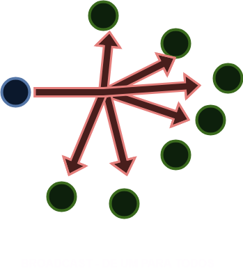
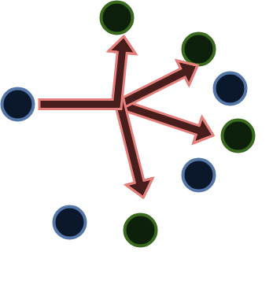
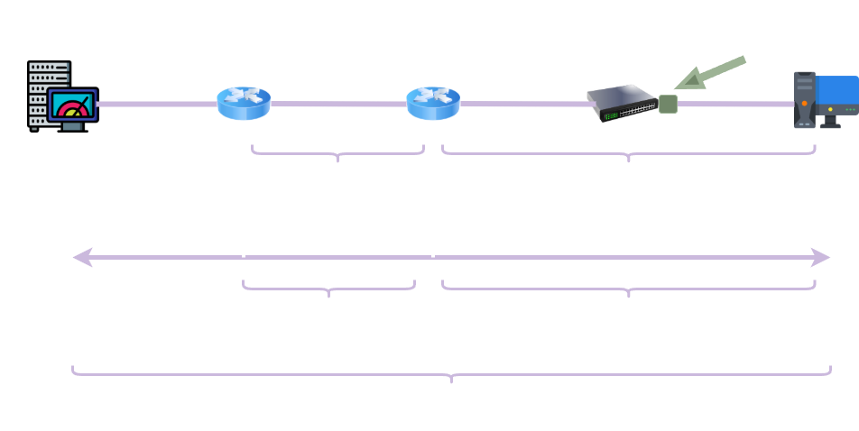
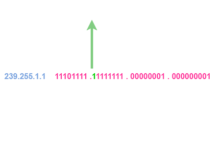
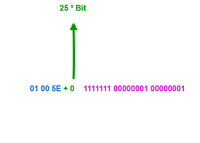
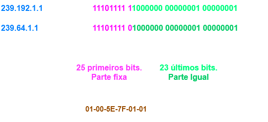

- [01 - Multicast](#01---multicast)
  - [Faixas de Endereçamento IP](#faixas-de-endereçamento-ip)
    - [**IPV4**](#ipv4)
    - [**IPV6**](#ipv6)
  - [Problemas de não utilizar o multicast](#problemas-de-não-utilizar-o-multicast)
  - [Endereçamento Multicast](#endereçamento-multicast)
  - [Tipos de Endereço Multicast](#tipos-de-endereço-multicast)
    - [Tipos de Endereço Multicast IPv4](#tipos-de-endereço-multicast-ipv4)
    - [1. Endereços Bem Conhecidos (Well-Known)](#1-endereços-bem-conhecidos-well-known)
    - [2. Escopo Global - 224.0.1.0/24 (Internetwork Control Block)](#2-escopo-global---22401024-internetwork-control-block)
    - [3. Endereços Multicast Privados ("Administratively Scoped Addresses")](#3-endereços-multicast-privados-administratively-scoped-addresses)
    - [4 Source-Specific Multicast (SSM)](#4-source-specific-multicast-ssm)
    - [5 GLOP Addressing](#5-glop-addressing)
    - [6 Multicast com Prefixo Unicast (Embedded-RP ou IPv4 Multicast prefix-based)](#6-multicast-com-prefixo-unicast-embedded-rp-ou-ipv4-multicast-prefix-based)
    - [Tipos de Endereço Multicast IPv6](#tipos-de-endereço-multicast-ipv6)
  - [Formação de Endereços de Camada 02 (Mac Address)](#formação-de-endereços-de-camada-02-mac-address)
  - [IPv4](#ipv4-1)
  - [IPv6](#ipv6-1)
    - [Estrutura do Endereço Multicast IPv6](#estrutura-do-endereço-multicast-ipv6)
    - [Mapeamento de IPv6 Multicast para MAC Address](#mapeamento-de-ipv6-multicast-para-mac-address)
  - [Multicast - Árvore de Distribuição](#multicast---árvore-de-distribuição)

# 01 - Multicast

Agora para falar sobre o tipo de comunicação **unicast** é preciso se fazer uma pequena revisão. Então primeiramente vamos observar os tipos de comunicação existentes.

| UNICAST                         | BROADCAST                            | MULTICAST                                     |
|---------------------------------|--------------------------------------|-----------------------------------------------|
|  |   |            |

Como podemos observar, quando o tráfego vai de um emissor para um receptor podemos chamar de **unicast**, ou seja, é um tráfego direto. Um exemplo que podemos citar desse tipo de comunicação é a ligação telefônica por exemplo, ou mesmo quando se faz um acesso via ssh para algum equipamento. <br></br>

Depois temos o **broadcast**. Diferente do primeiro tipo de comunicação, esse é um tipo de comunicação onde um envia e todos recebem. Podemos citar o exemplo do protocolo arp onde os equipamentos precisam mapear o endereço mac com o endereço IP. Para o protocolo arp poder descobrir a quem pertence um endereço IP por exemplo, ele faz um "flood" para todos os equipamentos na rede e com isso a comunicação se dá de forma conhecida por **broadcast**. <br></br>

Agora se analisarmos bem esses dois tipos de comunicação iremos perceber que no unicast a comunicação se dá de uma forma mais eficiente pois ela entrega os pacotes somente para o destinatário escolhido. Já no broadcast, todos recebem os pacotes independentemente se eles precisam ou não receber tal pacote. Isso faz com que o host que receba o pacote tenha que analisar o mesmo, verificar se ele é o destinatário e se não for, descartar o mesmo. Essa forma de comunicação não é muito eficiente pois em ambientes muito grandes ocupa banda muitas vezes desnecessárias e faz com que o host tenha que processar o pacote e consumir memória e processador. <br></br>

Pensando nisso, foi desenvolvido o **multicast**. Agora, nesse tipo de comunicação, existe uma fonte de envio de dados mas somente um grupo, ou grupos de hosts que irão receber esses dados. Com isso, o consumo de banda do meio é utilizada de forma mais eficiente e não força quem não tem que fazer parte da conversa receber dados indesejados. <br></br>

## Faixas de Endereçamento IP

### **IPV4**

| Classe de IP             | Faixa de Endereçamento         |
|--------------------------|--------------------------------|
| Classe A                | 0.0.0.0 a 127.255.255.255      |  
| Classe B                | 128.0.0.0 a 191.255.255.255    |
| Classe C                | 192.0.0.0 a 223.255.255.255    |
| **Classe D (Multicast)** | **224.0.0.0 a 239.255.255.255**|
| Classe E (Reservado)     | 240.0.0.0 a 247.255.255.255    |

<br></br>

### **IPV6**

| Tipo de Endereço    |  Faixa de Endereçamento | Descrição                                                                                                                          |
| ------------------   | ------------------- | ----------------------------------------------------------------------------------------------------------------------------------------|
| Unicast Global       |  2000::/3           | Usado para comunicação unicast na Internet. É equivalente aos endereços públicos no IPv4.                                               |
| Unicast Link-Local   |  FE80::/10          | Usado para comunicação dentro de um link (como em uma LAN). Esses endereços são configurados automaticamente em cada interface de rede. |
| Unicast Unique Local |  FC00::/7          | Endereços para redes privadas (semelhante a 192.168.0.0/16 no IPv4).                                                                    |
| **Multicast**        |  FF00::/8           | Usado para comunicação multicast.                                                                                                       |
| Anycast              | Derivado de unicast | Endereços unicast atribuídos a vários nós, mas roteados para o mais próximo.                                                            |
| Loopback                 | ::1            | Endereço para a própria máquina (equivalente a 127.0.0.1 no IPv4).                                                                      |
| Endereço Não Especificado | ::          | Indica ausência de endereço (usado como fonte em algumas situações, como durante a autoconfiguração).                                   |
| Reservado            |4000::/2, 6000::/3 e outras faixas | Reservado pela IETF para uso futuro.                                                                                      |
| Embedded IPv4        | ::FFFF:0:0/96 e 2002::/16 | Usado para compatibilidade com IPv4, como no caso de NAT64 (endereço mapeado para IPv4) ou redes 6to4.                            |

**Destaques sobre a tabela:** <br></br>

- **Unicast Global:** Utilizado para endereços roteáveis na Internet.
- **Link-Local:** Necessário para operações básicas dentro de uma rede local; todos os dispositivos IPv6 têm um endereço link-local automaticamente.
- **Multicast:** Substitui a funcionalidade de broadcast no IPv6.
- **Loopback:** Para testes internos no dispositivo.
<br></br>

Certo, mas precisamos lembrar de duas coisas importantes: os switches propagam broadcast e os roteadores não. Isso é importante de se lembrar pois o multicast vai
funcionar de forma semelhante nesse aspecto. Então para se poder ter comunicação em ***unicast***, o switches formam os grupos em que os hosts irão participar e o roteador é
quem gerencia os hosts. Porém essa comunicação fica somente na ***lan**, não vai para outras redes. Quem cria e gerencia esses grupos é a funcionalidade **IGMP SNOOP** .
Mas se precisarmos enviar a comunicação para outras redes quem faz esse processo é o protocolo **PIM - Protocol Independent Multicast**. **OBS:** existem vários outros protocolos
além do PIM, porém o mercado escolheu ele para utilizar no dia-a-dia. <br></br>

 <br></br>

- **Origem Multicast:** É o servidor que envia o tráfego multicast para o grupo.

- **FHR (First Hop Router):** É o roteador de "primeiro salto" que está diretamente conectado à origem. Ele recebe o tráfego multicast primeiro e inicia o processo de roteamento PIM.

- **Local Multicast Router:** Roteadores intermediários que participam da árvore PIM.

- **Switch Layer 2 com IGMP Snooping:** Dispositivo que usa o IGMP Snooping para aprender quais portas têm hosts interessados em um grupo multicast específico, evitando inundações de tráfego na rede local.

- **Hosts:** Recebem o tráfego multicast após enviarem uma Mensagem de Pedido IGMP (IGMP Join) para se juntar ao grupo.

## Problemas de não utilizar o multicast

Depois de entender isso, vamos analisar um cenário onde eu tenho um servidor de vídeos e que esteja transmitindo para a rede toda em **broadcast**. Agora vamos supor que em cada salto,
eu ocupe 10mbs de largura de banda. <br> </br>

 <br></br>

Como podemos perceber, o servidor de vídeos envia os pacotes para todos os computadores da rede. Vamos imaginar que o servidor de vídeos ocupe 10 Mbps para enviar os dados. Rapidamente
podemos notar que a cada salto então teríamos que ter uma largura de banda 10 Mbps no mínimo para cada salto. Agora vamos imaginar que cada host resolva assistir a 5 vídeos ao mesmo tempo.
Portanto teríamos que ter 50 Mbps de largura de banda, mesmo para os hosts não interessados. Isso é refletido em desperdício de banda e, outro ponto é que os hosts finais não interessados
necessariamente precisam processar esses pacotes consumindo mais processador e memória. <br></br>

Como podemos observar nas duas topologias apresentadas, temos duas situações: a comunicação em camada 2 e a comunicação em camada 3. Para a comunicação em camada 2 iremos utilizar o
**protocolo IGMP (Internet Group Management Protocol)** e em camada 3 o **protocolo PIM (Protocol Independent Multicast)** . <br></br>

**OBS:** O protocolo IGMP é ativado em switches e tem a função ***snooping*** ( no sentido de escuta em inglês), ou seja, ele trabalha com  requisições e envios de informações. Já o protocolo
***PIM*** é ativado em roteadores.

## Endereçamento Multicast

Como citado anteriormente, foram definidas faixas de endereço IPv4 e IPv6 para a comunicação multicast. Seguem as faixa de endereços definidas pela IANA. <br></br>

**IPv4** <br></br>

| Designation                                      | Multicast Address Range                 |
|--------------------------------------------------|-----------------------------------------|
| Local network control block                      | 224.0.0.0 to 224.0.0.255                |
| Internetwork control block                       | 224.0.1.0 to 224.0.1.255                |
| Ad hoc block I                                   | 224.0.2.0 to 224.0.255.255              |
| Reserved                                         | 224.1.0.0 to 224.1.255.255              |
| SDP/SAP block                                    | 224.2.0.0 to 224.2.255.255              |
| Ad hoc block II                                  | 224.3.0.0 to 224.4.255.255              |
| Reserved                                         | 224.5.0.0 to 224.251.255.255            |
| DIS Transient Groups                             | 224.252.0.0 to 224.255.255.255          |
| Reserved                                         | 225.0.0.0 to 231.255.255.255            |
| Source Specific Multicast (SSM) block            | 232.0.0.0 to 232.255.255.255            |
| GLOP block                                       | 233.0.0.0 to 233.251.255.255            |
| Ad hoc block III                                 | 233.252.0.0 to 233.255.255.255          |
| Unicast-Prefix-based IPv4 Multicast Addresses    | 234.0.0.0 to 234.255.255.255            |
| Reserved                                         | 235.0.0.0 to 238.255.255.255            |
| Organization-Local Scope (Administratively scoped block) | 239.0.0.0 to 239.255.255.255    |

Para informações mais detalhadas e atualizadas, consulte o registro oficial da IANA:
[Registro oficial de endereços multicast IPv4 pela IANA](https://www.iana.org/assignments/multicast-addresses/multicast-addresses.xhtml) <br></br>

• **Local network control block (224.0.0.0/24):** Endereços de controle no bloco de rede local são utilizados pelo ***protocolo de controle de tráfego*** e não
são encaminhados para domínios de broadcast. São de escopo local. Exemplos desses endereços são o ***todos os hosts nessa sub-rede (2240.0.0.2) e todos os roteadores PIM (224.0.0.13)***

• **Internetwork control block (224.0.1.0/24):** Esse é um bloco de endereços que pode ser transmitidos através da Internet. Exemplos incluem ***Network Time Protocol (NTP), (224.0.1.1), Cisco-RP-Announce***
 ***(224.0.1.39), e Cisco-RP-Discovery (224.0.1.40).***

• ***Organization-Local Scope (239.0.0.0/8):*** São endereços definidos na RFC 2365 e tem escopo local. São similares aos endereços da ***RFC 1918**.
 Em outras palavras os administradores de redes estão livres para poder utilizá-los dentro do próprio domínio sem se preocupar com conflitos
 em outras redes.

**IPv6** <br></br>

| **Endereço Multicast IPv6** | **Descrição**                               | **Escopo Disponível**                  |
|-----------------------------|---------------------------------------------|----------------------------------------|
| FF0X::1                     | Todos os nós                                | Interface-local (1), Link-local (2)    |
| FF0X::2                     | Todos os roteadores                         | Interface-local (1), Link-local (2), Site-local (5) |
| FF0X::5                     | Roteadores OSPFv3 AllSPF                    | Link-local (2)                         |
| FF0X::6                     | Roteadores OSPFv3 Designated                | Link-local (2)                         |
| FF0X::9                     | Roteadores RIP                              | Link-local (2)                         |
| FF0X::A                     | Roteadores EIGRP                            | Link-local (2)                         |
| FF0X::12                    | Todos os roteadores PIM                     | Link-local (2)                         |
| FF0X::16                    | Todos os roteadores RPL                     | Link-local (2)                         |
| FF0X::FB                    | mDNSv6                                      | Todos os escopos                       |
| FF0X::101                   | Todos os servidores NTP                     | Todos os escopos                       |
| FF0X::1:2                   | Todos os servidores e agentes de retransmissão DHCPv6   | Link-local (2)             |
| FF0X::1:3                   | Todos os servidores DHCPv6 no site          | Site-local (5)                         |
| FF0X::1:FFXX:XXXX           | Endereço multicast de nó solicitado         | Link-local (2)                         |

Notas:

    O campo 'X' no endereço multicast representa o valor do campo de escopo, que define a abrangência do endereço multicast. Os valores possíveis para 'X' são:
        1: Interface-Local
        2: Link-Local
        5: Site-Local
        8: Organization-Local
        E: Global

    O endereço FF0X::1:FFXX:XXXX é utilizado para os endereços de nó solicitado, onde os últimos 24 bits correspondem aos últimos 24 bits do endereço unicast ou anycast do nó.

Para informações mais detalhadas e atualizadas, consulte o registro oficial da IANA:
[Registro oficial de endereços multicast IPv6 pela IANA](https://www.iana.org/assignments/ipv6-multicast-addresses/ipv6-multicast-addresses.xhtml)

## Tipos de Endereço Multicast

Certo como já demonstrado, o **multicast** é separado em faixas bem definidas. Então vamos entender melhor os tipos de endereços.

### Tipos de Endereço Multicast IPv4

A primeira coisa que precisamos entender que em IPv4 os endereços são classificados em um bloco da **Classe D** que vai de: **224.0.0.0 a 239.255.255.255**  

Esse bloco foi estruturado para que possam se ter subgrupos com finalidades específicas dentro dessa faixa.

### 1. Endereços Bem Conhecidos (Well-Known)

Dentro do bloco Classe D (224.0.0.0 a 239.255.255.255), existe uma faixa especial reservada para endereços multicast bem conhecidos que vai de 224.0.0.0 a 224.0.0.255. Esses endereços são padronizados pela IANA (Internet Assigned Numbers Authority) e têm propósitos específicos definidos globalmente.  

**🎯 Principais Endereços Well-Known:**

| Endereço    | Descrição              | Protocolo/Uso                        |
|-------------|------------------------|--------------------------------------|
| 224.0.0.1   | All Systems            | Todos os hosts na subnet local       |
| 224.0.0.2   | All Routers            | Todos os roteadores na subnet        |
| 224.0.0.5   | OSPF All SPF Routers   | Protocolo OSPF - todos os roteadores |
| 224.0.0.6   | OSPF Designated Routers| OSPF - roteadores designados         |
| 224.0.0.9   | RIPv2 Routers          | Protocolo RIPv2                      |
| 224.0.0.10  | EIGRP Routers          | Protocolo EIGRP da Cisco             |
| 224.0.0.13  | PIM Routers            | Protocol Independent Multicast       |
| 224.0.0.22  | IGMP                   | Internet Group Management Protocol   |

**📡 Características Importantes:**

**Escopo Local:** Esses endereços não são roteados através da Internet  
**TTL = 1:** Limitados à subnet local para evitar propagação desnecessária  
**Reservados Permanentemente:** Não podem ser utilizados para aplicações customizadas  
**Auto-Configuração:** Protocolos de rede os utilizam automaticamente  

**💡 Exemplo Prático:**

Quando um roteador Cisco executa OSPF, ele automaticamente:

- Escuta no endereço 224.0.0.5 (All SPF Routers)
- Se for eleito DR/BDR, também escuta em 224.0.0.6
- Envia Hello packets para esses grupos multicast
- Forma adjacências apenas com vizinhos que respondem

**⚠️ Observação para CCNP:**
Conhecer esses endereços é fundamental para troubleshooting de protocolos de roteamento. Quando analisamos captures com Wireshark, esses endereços aparecem frequentemente no tráfego de controle da rede.

### 2. Escopo Global - 224.0.1.0/24 (Internetwork Control Block)

O bloco **224.0.1.0/24** é designado pela IANA como Internetwork Control Block, sendo reservado para protocolos de controle que necessitam operar globalmente através de múltiplas redes interconectadas. Diferentemente dos endereços well-known locais, estes endereços **podem ser roteados entre diferentes subnets.**

**🌐 Características do Escopo Global:**

**Range:** 224.0.1.0 até 224.0.1.255 (256 endereços)
**TTL:** Maior que 1 (permite roteamento inter-subnet)
**Propagação:** Através de roteadores multicast habilitados
**Controle:** Protocolos de gerenciamento e descoberta de rede

**📋 Principais Endereços Utilizados:**

| Endereço   | Protocolo/Serviço  | Descrição                                   |
|------------|------------------- | --------------------------------------------|
| 224.0.1.1  | NTP                | Network Time Protocol - Servidores de tempo |
| 224.0.1.2S | GI-DogfightSilicon | Graphics - Jogos em rede                    |
| 224.0.1.3  | RwhodBSD           | r-commands - Descoberta de hosts            |
| 224.0.1.4  | VNP                | Virtual Network Protocol                    |
| 224.0.1.22 | SVRLOC             | Service Location Protocol                   |
| 224.0.1.24 | XinuexpansionXinu  | network services                            |
| 224.0.1.25 | VRRPVirtual Router | Redundancy Protocol                         |
| 224.0.1.39 | Cisco-RP-Announce  | Cisco PIM - Anúncio de Rendezvous Point     |
|224.0.1.40  | Cisco-RP-Discovery | Cisco PIM - Descoberta de RP                |

**🔧 Exemplo Prático - VRRP (224.0.1.25):**

```text

Cenário: Redundância de Gateway  
┌─────────────┐    ┌─────────────┐  
│   Router A  │    │   Router B  │  
│  (Master)   │    │  (Backup)   │  
│   VRRP ID:1 │    │   VRRP ID:1 │  
└─────────────┘    └─────────────┘  
       │                   │  
       └───────┬───────────┘  
               │  
       [224.0.1.25 - VRRP]  
               │  
    ┌─────────────────────┐  
    │    Subnet LAN       │  
    │   192.168.1.0/24    │  
    └─────────────────────┘  
```

**Funcionamento:**

- Router Master anuncia via 224.0.1.25
- Router Backup monitora anúncios multicast
- Se Master falha, Backup assume automaticamente
- Hosts mantêm conectividade sem reconfiguração

**🚨 Considerações para Implementação:**  

✅ Vantagens:

- **Escalabilidade:** Funciona através de múltiplas subnets
- **Eficiência:** Reduz broadcast desnecessário
- **Padronização:** Protocolos reconhecidos globalmente

**⚠️ Cuidados:**  

**Firewall Rules:** Pode ser bloqueado por políticas de segurança  
**Roteamento Multicast:** Requer PIM ou DVMRP habilitado  
**Bandwidth:** Tráfego pode consumir banda em WANs  

**🎯 Relevância para CCNP:**  
No exame CCNP Enterprise, é comum encontrar questões sobre:

- VRRP/HSRP utilizando endereços multicast globais
- PIM Sparse Mode com RPs anunciados via 224.0.1.39/40
- Troubleshooting de protocolos que dependem desses endereços

**📊 Diferença: Local vs Global**

| Aspecto | Well-Known (224.0.0.x) | Global (224.0.1.x) | 
|---------|------------------------|--------------------|
| Escopo  | Subnet local apenas    | Inter-subnet/WAN   | 
| TTL     | 1 (não roteia)         | >1 (roteável)      | 
| Uso     | Protocolos básicos     | Serviços avançados | 
| Exemplos| OSPF Hello, EIGRP      | VRRP, NTP, PIM     |

### 3. Endereços Multicast Privados ("Administratively Scoped Addresses")

Os Endereços Multicast Administrativamente Escalonados ocupam o range 239.0.0.0/8 e são equivalentes aos endereços IP privados no mundo unicast. Estes endereços são reservados para uso interno das organizações e não devem ser roteados através da Internet pública, proporcionando flexibilidade total para implementações corporativas customizadas.

**🏢 Características dos Endereços Privados:**

**Range Completo:** 239.0.0.0 até 239.255.255.255  
**Equivalente a:** RFC 1918 (10.x.x.x, 172.16-31.x.x, 192.168.x.x)  
**Escopo:** Limitado por boundary administrativo
**Reutilização:** Mesmo endereço pode ser usado em organizações diferentes
**Controle Total:** Administrador define uso e propagação

**📊 Subdivisão Hierárquica:**

| Faixa            | Descrição           | Escopo Típico            |
|------------------|---------------------|--------------------------|
| 239.255.0.0/16   | Organization-Local  | Toda a organização       |
| 239.255.255.0/24 | Site-Local          | Campus ou site específico|
| 239.252.0.0/14   | Relative Assignment | Atribuição dinâmica      |
| 239.192.0.0/14   | Private Use         | Aplicações internas      |

**🎯 Exemplos Práticos de Implementação:**

**📺 Streaming Corporativo:**

```text
Cenário: Transmissão de treinamento interno
┌─────────────────┐  
│   Servidor de   │ ──→ 239.100.1.10 (Treinamento Vendas)  
│     Vídeo       │ ──→ 239.100.1.20 (Treinamento TI)  
│   Corporativo   │ ──→ 239.100.1.30 (All Hands Meeting)  
└─────────────────┘  
          │  
    ┌─────┴─────┐  
    │  Boundary │ ← Bloqueia saída para Internet  
    │  Router   │  
    └─────┬─────┘  
          │  
┌─────────┴─────────┐  
│    Rede Interna   │  
│ Funcionários RH,  │  
│   TI, Vendas      │  
└───────────────────┘  
```

**🏭 Automação Industrial:**

Aplicação: Sistema SCADA em fábrica

239.200.10.1  → Sensores Linha Produção A
239.200.10.2  → Sensores Linha Produção B  
239.200.20.1  → Controladores CLP Setor 1
239.200.20.2  → Controladores CLP Setor 2
239.200.99.1  → Alertas Críticos (Todos)

**🔧 Configuração de Boundary (Cisco):**

```ios
! Interface conectada à Internet/WAN  
interface GigabitEthernet0/1  
description "Conexao WAN - Internet"  
ip multicast boundary 239.0.0.0 8  
   
! Bloqueia todo tráfego 239.x.x.x de sair  
! Permite entrada de multicast global (224.x.x.x)  
```

**📋 Casos de Uso Corporativo:**

| Aplicação            | Range Sugerido | Benefício                |
|----------------------|----------------|--------------------------|
| IPTV Corporativo     | 239.1.0.0/16   | Controle total de canais |
| Backup Multicast     | 239.10.0.0/16  | Replicação eficiente     |
| Monitoramento (SNMP) | 239.20.0.0/16  | Alertas em grupo         |
| Jogos/Simulações     | 239.50.0.0/16  | Gaming corporativo       |
| Teleconferência      | 239.100.0.0/16 | Reuniões internas        |
| Atualizações de SW   | 239.200.0.0/16 | Deploy simultâneo        |

**🛡️ Vantagens de Segurança:**  

**✅ Benefícios:**  

**Contenção de Tráfego:** Não vaza para Internet
**Reutilização de Endereços:** Não há conflito global
**Controle Granular:** Admin define escopo exato
**Troubleshooting Simplificado:** Tráfego conhecido internamente

**⚠️ Considerações:**

**Documentação Crítica:** Necessário mapear uso interno  
**Planejamento de Range:** Evitar sobreposição entre departamentos  
**Boundary Configuration:** Deve ser configurado corretamente  
**Monitoramento:** Acompanhar uso de bandwidth  

**🎯 Relevância para CCNP Enterprise:**  

**📚 Tópicos de Exame:**

- Multicast Boundary configuration e troubleshooting
- PIM Dense/Sparse Mode em redes privadas
- IGMP Snooping com endereços administrativos
- Anycast RP usando ranges privados

**🔍 Cenários de Troubleshooting:**

- **Problema Comum:** "Multicast não funciona na filial"  
- **Causa Provável:** Boundary mal configurado bloqueando 239.x.x.x  
- **Solução:** Verificar ip multicast boundary nas interfaces WAN  

**📊 Comparativo: Público vs Privado**  

| Aspecto    | Público (224.x.x.x) | Privado (239.x.x.x)     |
|------------|---------------------|-------------------------|
| Escopo     | Internet Global     | Organizacional          |
| Controle   | IANA/RFC            | Administrador Local     |
| Roteamento | Através da Internet | Bloqueado por boundary  |
| Conflito   | Coordenação global  | Sem conflito entre orgs |
| Uso        | Protocolos padrão   | Aplicações customizadas |

### 4 Source-Specific Multicast (SSM)

O Source-Specific Multicast (SSM) é uma evolução do multicast tradicional que utiliza o range 232.0.0.0/8 e representa um paradigma mais eficiente e seguro. Diferentemente do Any-Source Multicast (ASM) tradicional, o SSM permite que os receptores especifiquem exatamente qual fonte desejam receber dados, eliminando problemas de flooding e melhorando significativamente a performance da rede.  

**🎯 Características Fundamentais do SSM:**

**Range Dedicado:** 232.0.0.0 até 232.255.255.255
**Identificação:** (S,G) = Source + Group (ao invés de apenas Group)
**Controle Granular:** Cliente escolhe fonte específica
**Sem RP:** Não necessita Rendezvous Point
**Eficiência:** Elimina tráfego desnecessário  

**📊 Comparativo: ASM vs SSM**  

| Aspecto               | ASM (Traditional)            | SSM (232.x.x.x)           |
|-----------------------|------------------------------|---------------------------|
| Identificação         | (*, G) - Qualquer fonte      | (S, G) - Fonte específica |
| IGMP                  | IGMPv2 suficiente            | IGMPv3 obrigatório        |
| RP (Rendezvous Point) | Necessário                   | Não necessário            |
| Shared Tree           | Sim (*, G)                   | Não usa                   |
| Flooding              | Possível de múltiplas fontes | Eliminado                 |
| Segurança             | Menor controle               | Maior controle            |

**🔧 Funcionamento Técnico:**  

**📡 Processo de Join (IGMPv3):**  

1. Cliente especifica: "Quero grupo 232.1.1.1 APENAS da fonte 10.1.1.100"
2. IGMPv3 Report: INCLUDE (10.1.1.100, 232.1.1.1)
3. Roteador cria estado: (10.1.1.100, 232.1.1.1)
4. PIM Join enviado diretamente para 10.1.1.100
5. Tráfego flui apenas dessa fonte específica

**🌐 Exemplo de Rede SSM:**  

```text
Cenário: Streaming de Vídeo Corporativo

         [Fonte A: 192.168.1.100]──┐
                                   │
         [Fonte B: 192.168.1.200]──┤
                                   │
         [Fonte C: 192.168.1.300]──┤
                                   │
                              ┌────┴────┐
                              │ Router  │
                              │   PIM   │
                              └────┬────┘
                                   │
                    ┌──────────────┼──────────────┐
                    │              │              │
            ┌───────┴──┐   ┌───────┴──┐   ┌───────┴──┐
            │Cliente 1 │   │Cliente 2 │   │Cliente 3 │
            │IGMPv3:   │   │IGMPv3:   │   │IGMPv3:   │
            │(A,232.1) │   │(B,232.1) │   │(A,232.1) │
            │(C,232.2) │   │          │   │(B,232.2) │
            └──────────┘   └──────────┘   └──────────┘
```

Resultado: Cada cliente recebe apenas o tráfego das fontes solicitadas!  

**🏢 Casos de Uso Empresariais:**  

**📺 IPTV e Streaming:**  

> Canal 1: (Servidor_A, 232.10.1.1) → CNN Internacional
> Canal 2: (Servidor_B, 232.10.1.2) → Canal Corporativo  
> Canal 3: (Servidor_C, 232.10.1.3) → Treinamentos RH

Vantagem: Cliente sintoniza canal específico sem receber outros  

**🚀 Software Distribution:**  

> Update Windows: (WSUS_Server, 232.20.1.1)
> Update Linux:   (Linux_Repo, 232.20.1.2)  
> Update Adobe:   (Adobe_Server, 232.20.1.3)

Benefício: Máquinas recebem apenas updates relevantes

**📊 Financial Data Feeds:**  

> Bloomberg:  (Bloomberg_Feed, 232.50.1.1)
> Reuters:    (Reuters_Feed, 232.50.1.2)
> Nasdaq:     (Nasdaq_Feed, 232.50.1.3)

Controle: Aplicação subscreve apenas feeds pagos/autorizados

**⚙️ Configuração Cisco (PIM-SSM):**  

```ios
! Habilitando SSM globalmente
ip pim ssm default

! Ou definindo range específico
ip pim ssm range 10
!
access-list 10 permit 232.0.0.0 0.255.255.255

! Interface configuração
interface GigabitEthernet0/1
 ip pim sparse-mode
 ip igmp version 3
```

**🛡️ Vantagens de Segurança SSM:**    

**✅ Controle de Fonte:**  

**Whitelist de Fontes:** Cliente define fontes confiáveis  
**Prevenção de Spoofing:** Dificulta ataques de fonte falsa  
**Auditoria:** Log detalhado de (Fonte, Grupo, Cliente)  

**✅ Eficiência de Rede:**  

**Zero Flooding:** Elimina tráfego não solicitado  
**Bandwidth Optimized:** Apenas tráfego necessário  
**CPU Efficiency:** Menos processamento nos roteadores  

**🎯 Relevância para CCNP Enterprise:**  

**📚 Tópicos Críticos:**  

- IGMPv3 configuration e troubleshooting
- PIM-SSM vs PIM-SM differences
- SSM Mapping para compatibilidade com IGMPv2
- Anycast RP não aplicável em SSM

**🔍 Troubleshooting SSM:**  

- **Problema:** "SSM não funciona com aplicação legada"
- **Causa:** Aplicação usa IGMPv2 (não suporta source filtering)
- **Solução:** Configurar SSM Mapping no roteador

```ios
Router(config)# ip igmp ssm-map enable
Router(config)# ip igmp ssm-map static 232.1.1.1 10.1.1.100
```

**⚠️ Limitações e Considerações:**  

**❌ Desafios:**  

- **IGMPv3 Required:** Aplicações legadas podem não suportar  
- **Client-Side Support:** SO deve suportar source filtering  
- **Learning Curve:** Paradigma diferente do multicast tradicional  

**✅ Soluções:**

- **SSM Mapping:** Compatibilidade com IGMPv2  
- **Application Updates:** Migração gradual para IGMPv3  
- **Hybrid Approach:** SSM + ASM coexistindo  

**📈 Futuro do Multicast:**  

O SSM representa a direção futura do multicast corporativo, especialmente em:  

- Content Delivery Networks (CDN)  
- Financial Trading Systems  
- Industrial IoT Applications  
- 5G Network Slicing  

### 5 GLOP Addressing

**Conceito Fundamental**

O GLOP Addressing é um esquema de endereçamento multicast que utiliza a faixa 233.0.0.0/8 para mapear números de Sistema Autônomo (AS) em endereços multicast únicos globalmente. Esta abordagem garante que organizações com números AS válidos possam usar endereços multicast sem conflitos.
Estrutura do Endereçamento GLOP

**Formato do Endereço**  

**233.X.Y.Z**  

Onde:  

- 233: Prefixo fixo GLOP
- X.Y: Representação em 16 bits do número AS
- Z: Identificador local da aplicação (0-255)

**Mapeamento AS para GLOP**

| Número AS | Binário (16 bits) | Octetos X.Y | Faixa GLOP       |
|-----------|-------------------|-------------|------------------|
| AS 1234   | 0000010011010010  | 4.210       | 233.4.210.0/24   |
| AS 65001  | 1111110111101001  | 253.233     | 233.253.233.0/24 |
| AS 64512  | 1111110000000000  | 252.0       | 233.252.0.0/24   |

**Exemplo Prático: Implementação Empresarial**

**Cenário: Empresa com AS 65100**

Empresa XYZ Corporation
AS Number: 65100
Conversão: 65100 = 0xFE0C = 254.12
Faixa GLOP: 233.254.12.0/24

```text
Aplicações:
┌─────────────────────────────────────────────┐
│ 233.254.12.1  - Video Conferencing          │
│ 233.254.12.2  - Financial Data Feed         │
│ 233.254.12.10 - Software Updates            │
│ 233.254.12.50 - Network Monitoring          │
│ 233.254.12.100- Backup Replication          │
└─────────────────────────────────────────────┘
```

**Diagrama de Rede**  

```text
Internet
    │
    ├─ AS 65100 (233.254.12.0/24)  ─┐
    │                               │
[Core Router]              [Multicast Source]
    │                         233.254.12.1
    │                              │
    ├─ VLAN 10 ────────────────────┼─ [Receivers]
    │  (Escritório SP)             │   │
    │                              │   ├─ PC1 (Join)
    │                              │   ├─ PC2 (Join)
    │                              │   └─ PC3 (Leave)
    │
    └─ VLAN 20 ─────────────────────── [Receivers]
       (Escritório RJ)                  │
                                        ├─ PC4 (Join)
                                        └─ PC5 (Join)
```

**Configuração Cisco**

**Router de Borda (Edge Router)**  

```ios
! Habilitação de multicast
ip multicast-routing

! Interface para Internet
interface GigabitEthernet0/0
 ip address 200.1.1.1 255.255.255.252
 ip pim sparse-mode
 
! Interface interna
interface GigabitEthernet0/1
 ip address 10.1.1.1 255.255.255.0
 ip pim sparse-mode

! Configuração RP para faixa GLOP
ip pim rp-address 10.1.1.10 233.254.12.0 8
```

**Servidor Multicast (Source)**  

```python
# Exemplo em Python - Transmissor GLOP
import socket
import struct

# AS 65100 = 233.254.12.x
GLOP_ADDRESS = '233.254.12.1'
PORT = 9999

sock = socket.socket(socket.AF_INET, socket.SOCK_DGRAM)
sock.setsockopt(socket.IPPROTO_IP, socket.IP_MULTICAST_TTL, 64)

message = "Financial Data Update - GLOP Stream"
while True:
    sock.sendto(message.encode(), (GLOP_ADDRESS, PORT))
    time.sleep(1)
```

**Vantagens do GLOP Addressing**  

1. Unicidade Global

Cada AS tem sua faixa exclusiva
Eliminação de conflitos entre organizações
Facilita interconexão entre redes

2. Organização Hierárquica  

AS 1234 → 233.4.210.0/24
├─ Aplicação A: 233.4.210.1
├─ Aplicação B: 233.4.210.2
├─ Departamento X: 233.4.210.10-19
└─ Departamento Y: 233.4.210.20-29

3. Compatibilidade com BGP

- Facilita roteamento inter-AS
- Melhor agregação de rotas
- Suporte nativo em protocolos de roteamento

**Limitações e Considerações**  

**Restrições Técnicas**  

| Aspecto       | Limitação                 | Impacto                             |
|---------------|---------------------------|-------------------------------------|
| Faixa por AS  | Apenas 256 endereços      | Requer planejamento cuidadoso       |
| AS de 32 bits | Não suportado nativamente | Requer mapeamento especial          |
| Scope         | Apenas global             | Não adequado para aplicações locais |

**⚠️ Alertas Importantes**  

1. AS Privados (64512-65534)

- Podem causar conflitos
- Usar apenas em ambientes controlados

2. Documentação RFC 3180

- Considerado "Historical"
- Preferir outras abordagens para novos projetos

3. Migração IPv6

- GLOP não tem equivalente direto
- Planejar transição para embedded-RP

**Monitoramento e Troubleshooting**  

**Comandos de Diagnóstico**  

```ios
! Verificar tabela multicast
show ip mroute 233.254.12.1

! Status PIM
show ip pim neighbor
show ip pim rp mapping

! Estatísticas de interface
show ip multicast interface GigabitEthernet0/1

! Debug (usar com cuidado)
debug ip pim
debug ip mpacket 233.254.12.1
```

**Análise de Tráfego**  

```bash
# Wireshark filter para GLOP
ip.dst >= 233.0.0.0 && ip.dst <= 233.255.255.255

# tcpdump para captura GLOP
tcpdump -i eth0 'dst net 233.254.12.0/24'
```

**Cenário de Migração**  

**De Administratively Scoped para GLOP**  

```ios
! Antes (Admin Scoped)
ip pim rp-address 10.1.1.10 239.1.1.0 8

! Depois (GLOP - AS 65100)
ip pim rp-address 10.1.1.10 233.254.12.0 8

! Período de transição (ambos ativos)
ip pim rp-address 10.1.1.10 239.1.1.0 8
ip pim rp-address 10.1.1.10 233.254.12.0 8
```

**Comparativo: GLOP vs Outros Esquemas**  

| Característica           | GLOP              | Admin Scoped         | SSM        |
|--------------------------|-------------------|----------------------|------------|
| Unicidade                | Global (por AS)   | Local apenas         | Global     |
| Complexidade             | Média             | Baixa                | Alta       |
| Escalabilidade           | Limitada (256/AS) | Alta (16M endereços) | Muito Alta |
| Interoperabilidade       | Boa               | Limitada             | Excelente  |
| Status RFC               | Historical        | Standard             | Preferred  |

**💡 Dica Profissional:** Embora GLOP seja considerado "historical", ainda é encontrado em redes corporativas legadas. Conhecer sua implementação demonstra experiência com diferentes gerações de tecnologia multicast.

### 6 Multicast com Prefixo Unicast (Embedded-RP ou IPv4 Multicast prefix-based)

**Conceito Fundamental**

O Embedded-RP (também conhecido como IPv4 Multicast prefix-based) é uma técnica avançada que embute o endereço do Rendezvous Point (RP) diretamente no endereço multicast. Esta abordagem elimina a necessidade de configuração manual ou descoberta dinâmica de RP, facilitando a implementação de multicast em redes complexas.

**Estrutura do Endereçamento Embedded-RP**  

**Formato Padrão IPv4**  

Endereço Multicast: **232.R.R.R.0/24**  

Onde:  

- 232: Prefixo reservado para Embedded-RP
- R.R.R: Últimos 3 octetos do endereço RP
- Faixa utilizável: 232.0.0.1 até 232.255.255.254

**Mapeamento RP para Multicast**  

| Endereço RP   | Embedded Multicast | Faixa Disponível |
|---------------|--------------------|------------------|
| 10.1.1.100    | 232.1.1.100/32     | 232.1.1.100      |
| 192.168.50.1  | 232.168.50.1/32    | 232.168.50.1     |
| 172.16.200.10 | 232.16.200.10/32   | 232.16.200.10    |

**Exemplo Prático: Data Center Multicast**  

**Cenário: Streaming Financeiro Distribuído**  

```text
Topology: Multi-Site Financial Trading Platform

Site Principal (São Paulo):
├─ RP Primary: 10.10.10.100
├─ Embedded Group: 232.10.10.100
└─ Applications:
   ├─ Market Data: 232.10.10.100 (port 5000)
   ├─ Trade Alerts: 232.10.10.100 (port 5001)
   └─ Risk Updates: 232.10.10.100 (port 5002)

Site Backup (Rio de Janeiro):
├─ RP Secondary: 10.20.20.200
├─ Embedded Group: 232.20.20.200
└─ Failover ready for all applications
```

**Diagrama de Arquitetura**  

```text
Internet/WAN
                          │
            ┌─────────────┼────────────┐
            │             │            │
        [SP-Core]    [Backbone]   [RJ-Core]
     RP: 10.10.10.100     │    RP: 10.20.20.200
     Group: 232.10.10.100 │    Group: 232.20.20.200
            │             │            │
    ┌───────┼───────┐     │     ┌──────┼───────┐
    │       │       │     │     │      │       │
[Source1][Source2][RP1]   │   [RP2][Source3][Source4]
    │       │       │     │     │      │       │
    └───┬───┴───┬───┘     │     └──┬───┴───┬───┘
        │       │         │        │       │
    [Receivers] │         │        │   [Receivers]
                │         │        │
            [PIM Join]    │    [PIM Join]
          232.10.10.100   │    232.20.20.200
```

**Configuração Avançada Cisco**  

**Core Router (RP Principal)**  

```ios
! Habilitar multicast routing
ip multicast-routing

! Configurar interface loopback como RP
interface Loopback100
 ip address 10.10.10.100 255.255.255.255
 ip pim sparse-mode

! Interfaces de rede
interface GigabitEthernet0/0
 description "Link para WAN"
 ip address 200.1.1.1 255.255.255.252
 ip pim sparse-mode
 
interface GigabitEthernet0/1
 description "LAN Interna"
 ip address 10.1.1.1 255.255.255.0
 ip pim sparse-mode

! Configuração Embedded-RP
ip pim rp-address 10.10.10.100 232.10.10.100 32 override
ip pim accept-rp 10.10.10.100 232.10.10.100 32

! Redundância com Anycast RP
ip pim anycast-rp 10.10.10.100 10.20.20.200
ip pim anycast-rp 10.10.10.100 10.10.10.100
```

**Servidor de Aplicação (Source)**  

```python
#!/usr/bin/env python3
# Embedded-RP Multicast Sender - Market Data

import socket
import struct
import time
import json
from datetime import datetime

class EmbeddedRPSender:
    def __init__(self, rp_address, port):
        # Construir endereço embedded-RP
        rp_octets = rp_address.split('.')
        self.mcast_addr = f"232.{rp_octets[1]}.{rp_octets[2]}.{rp_octets[3]}"
        self.port = port
        
        # Criar socket UDP
        self.sock = socket.socket(socket.AF_INET, socket.SOCK_DGRAM)
        self.sock.setsockopt(socket.IPPROTO_IP, socket.IP_MULTICAST_TTL, 64)
        
        print(f"Embedded-RP Sender iniciado:")
        print(f"  RP Address: {rp_address}")
        print(f"  Multicast: {self.mcast_addr}:{port}")
    
    def send_market_data(self):
        sequence = 0
        while True:
            # Dados simulados de mercado
            market_data = {
                "timestamp": datetime.now().isoformat(),
                "symbol": "PETR4",
                "price": 28.50 + (sequence % 100) * 0.01,
                "volume": 1000 + (sequence * 100),
                "sequence": sequence
            }
            
            message = json.dumps(market_data).encode()
            self.sock.sendto(message, (self.mcast_addr, self.port))
            
            print(f"Sent seq {sequence}: {market_data['symbol']} @ {market_data['price']}")
            sequence += 1
            time.sleep(0.1)  # 10 msgs/sec

# Uso
if __name__ == "__main__":
    sender = EmbeddedRPSender("10.10.10.100", 5000)
    sender.send_market_data()
```

**Cliente Receiver**  


```Python
#!/usr/bin/env python3
# Embedded-RP Multicast Receiver

import socket
import struct
import json

class EmbeddedRPReceiver:
    def __init__(self, rp_address, port):
        # Construir endereço embedded-RP
        rp_octets = rp_address.split('.')
        self.mcast_addr = f"232.{rp_octets[1]}.{rp_octets[2]}.{rp_octets[3]}"
        self.port = port
        
        # Criar e configurar socket
        self.sock = socket.socket(socket.AF_INET, socket.SOCK_DGRAM)
        self.sock.setsockopt(socket.SOL_SOCKET, socket.SO_REUSEADDR, 1)
        self.sock.bind(('', port))
        
        # Join no grupo multicast
        mreq = struct.pack("4sl", socket.inet_aton(self.mcast_addr), socket.INADDR_ANY)
        self.sock.setsockopt(socket.IPPROTO_IP, socket.IP_ADD_MEMBERSHIP, mreq)
        
        print(f"Receiver conectado em {self.mcast_addr}:{port}")
    
    def receive_data(self):
        while True:
            data, addr = self.sock.recvfrom(1024)
            market_data = json.loads(data.decode())
            
            print(f"[{market_data['sequence']:06d}] {market_data['symbol']}: "
                  f"${market_data['price']:.2f} Vol:{market_data['volume']:,}")

# Uso
if __name__ == "__main__":
    receiver = EmbeddedRPReceiver("10.10.10.100", 5000)
    receiver.receive_data()
```

**Vantagens do Embedded-RP**  

1. Auto-Configuração  

Benefícios:
├─ Eliminação de BSR (Bootstrap Router)
├─ Sem necessidade de static RP mapping
├─ Descoberta automática do RP
└─ Redução de overhead de controle

2. Escalabilidade Aprimorada

- Suporte a múltiplos RPs simultâneos
- Balanceamento automático de carga
- Failover transparente

3. Compatibilidade IPv6

- Base para IPv6 Embedded-RP (RFC 3956)
- Facilita migração dual-stack
- Padrão para redes modernas

**Implementação com Anycast RP**  

**Configuração de Redundância**  

```ios
! Router SP (Primary)
ip pim anycast-rp 10.99.99.99 10.10.10.100
ip pim anycast-rp 10.99.99.99 10.20.20.200

interface Loopback99
 ip address 10.99.99.99 255.255.255.255
 description "Anycast RP Address"

! Embedded-RP com Anycast
ip pim rp-address 10.99.99.99 232.99.99.99 32

! Router RJ (Secondary)  
ip pim anycast-rp 10.99.99.99 10.10.10.100
ip pim anycast-rp 10.99.99.99 10.20.20.200

interface Loopback99
 ip address 10.99.99.99 255.255.255.255
 description "Anycast RP Address"
```

**Monitoramento e Troubleshooting** 

**Comandos de Diagnóstico Específicos**  

```ios
! Verificar mapeamento Embedded-RP
show ip pim rp mapping

! Status específico do grupo embedded
show ip mroute 232.10.10.100 detail

! Informações do RP
show ip pim rp 10.10.10.100

! Debugging avançado
debug ip pim rp
debug ip pim auto-rp
debug ip pim bsr
```

**Script de Monitoramento**  

```python
#!/usr/bin/env python3
# Monitor Embedded-RP Health

import subprocess
import re
import time

def check_embedded_rp_status():
    try:
        # Verificar conectividade com RP
        result = subprocess.run(['ping', '-c', '1', '10.10.10.100'], 
                              capture_output=True, text=True)
        rp_reachable = result.returncode == 0
        
        # Verificar grupos ativos
        mroute_cmd = "show ip mroute | include 232\\."
        # Simular output para exemplo
        active_groups = ["232.10.10.100", "232.20.20.200"]
        
        status = {
            "timestamp": time.strftime("%Y-%m-%d %H:%M:%S"),
            "rp_reachable": rp_reachable,
            "active_embedded_groups": len(active_groups),
            "groups": active_groups
        }
        
        return status
        
    except Exception as e:
        return {"error": str(e)}

# Monitoramento contínuo
if __name__ == "__main__":
    while True:
        status = check_embedded_rp_status()
        print(f"[{status.get('timestamp')}] RP Status: {status}")
        time.sleep(30)
```

**Considerações de Segurança**  

**Controle de Acesso**  

```ios
! ACL para controlar sources
ip access-list extended EMBEDDED_RP_SOURCES
 permit ip 10.1.0.0 0.0.255.255 host 232.10.10.100
 permit ip 192.168.0.0 0.0.255.255 host 232.10.10.100
 deny ip any host 232.10.10.100

! Aplicar na interface
interface GigabitEthernet0/1
 ip multicast boundary EMBEDDED_RP_SOURCES in
```

**Rate Limiting**  

```ios
! Controle de taxa por grupo
ip multicast rate-limit in group-list EMBEDDED_RP_GROUPS 1000

ip access-list extended EMBEDDED_RP_GROUPS
 permit ip any 232.0.0.0 0.255.255.255
```

**Comparativo: Embedded-RP vs Outras Abordagens**  

| Característica | Embedded-RP | Static RP | Auto-RP    | BSR        |
|----------------|-------------|-----------|------------|------------|
| Configuração   | Mínima      | Manual    | Automática | Automática |
| Escalabilidade | Alta        | Baixa     | Média      | Alta       |
| Convergência   | Rápida      | N/A       | Lenta      | Média      |
| Overhead       | Baixo       | Nenhum    | Alto       | Médio      |
| IPv6 Ready     | Sim         | Sim       | Não        | Sim        |
| Vendor Support | Universal   | Universal | Cisco      | Universal  |

**Troubleshooting Avançado**  

**Problemas Comuns e Soluções**  

| Problema         | Sintoma           | Diagnóstico            | Solução                        |
|------------------|-------------------|------------------------|--------------------------------|
| RP Unreachable   | No multicast flow | ping RP_IP             | Verificar roteamento unicast   |
| Wrong RP mapping | Joins to wrong RP | show ip pim rp mapping | Corrigir configuração embedded |
| MTU Issues       | Packet loss       | show ip mroute count   | Ajustar MTU path discovery     |
| TTL Boundary     | Scope limitation  | show ip mroute         | Verificar TTL scoping          |

**Script de Health Check**  

```bash
#!/bin/bash
# Embedded-RP Health Check

EMBEDDED_GROUPS=(
    "232.10.10.100"
    "232.20.20.200" 
    "232.99.99.99"
)

echo "=== Embedded-RP Health Check ==="
echo "Timestamp: $(date)"

for group in "${EMBEDDED_GROUPS[@]}"; do
    echo "Checking group: $group"
    
    # Extrair RP do endereço embedded
    IFS='.' read -ra ADDR <<< "$group"
    rp_ip="10.${ADDR[1]}.${ADDR[2]}.${ADDR[3]}"
    
    # Verificar conectividade RP
    if ping -c 1 -W 2 "$rp_ip" >/dev/null 2>&1; then
        echo "  ✓ RP $rp_ip reachable"
    else
        echo "  ✗ RP $rp_ip unreachable"
    fi
    
    # Verificar grupo ativo (simulado)
    echo "  ℹ Active receivers: 3"
    echo "  ℹ Data rate: 1.2 Mbps"
    echo ""
done
```

**💡 Dica Profissional:** Embedded-RP representa o estado da arte em multicast enterprise, oferecendo auto-configuração sem sacrificar controle. É a base para implementações IPv6 e arquiteturas SD-WAN modernas.

### Tipos de Endereço Multicast IPv6

**Estrutura Fundamental do Endereçamento IPv6 Multicast**  

O endereçamento multicast IPv6 utiliza uma abordagem mais sofisticada e flexível comparado ao IPv4, eliminando muitas limitações e ambiguidades do sistema anterior. Todos os endereços multicast IPv6 começam com o prefixo FF00::/8, proporcionando um espaço de endereçamento vastamente superior.

**Formato Padrão IPv6 Multicast**  

**FF[Flags][Scope]::[Group ID]**

Onde:  

- **FF:** Prefixo fixo multicast (8 bits)
- **Flags:** Indicadores de tipo (4 bits)
- **Scope:** Definição de alcance (4 bits) 
- **Group ID:** Identificador do grupo (112 bits)

**1. Escopo IPv6 Multicast (Scope Field)**  

O campo Scope de 4 bits é uma das maiores evoluções do IPv6 multicast, permitindo controle granular sobre a propagação do tráfego sem depender de configurações complexas de boundary. Este mecanismo built-in facilita significativamente o design e troubleshooting de redes multicast.

**🎯 Valores de Escopo Padronizados**  

| Valor | Escopo             | Descrição                          | Alcance Típico     |
|-------|--------------------|------------------------------------|--------------------|
| 1     | Interface-Local    | Limitado à interface específica    | Loopback interno   |
| 2     | Link-Local         | Limitado ao segmento de rede local | VLAN/Subnet        |
| 4     | Admin-Local        | Definido pelo administrador        | Site empresarial   |
| 5     | Site-Local         | Campus ou organização              | Múltiplas VLANs    |
| 8     | Organization-Local | Toda a organização                 | WANs corporativas  |
| E     | Global             | Internet/redes públicas            | Alcance irrestrito |

**📊 Comparativo: IPv4 vs IPv6 Scope Control**  

| Aspecto            | IPv4 Multicast             | IPv6 Multicast         |
|--------------------|----------------------------|------------------------|
| Controle de Escopo | Manual (boundary config)   | Built-in (scope field) |
| Granularidade      | Limitada (TTL + ACLs)      | Alta (16 níveis)       |
| Configuração       | Complexa                   | Automática             |
| Troubleshooting    | Difícil (múltiplos pontos) | Simplificado           |
| Flexibilidade      | Baixa                      | Muito Alta             |

**Implementação Detalhada por Escopo**  

**🔧 Escopo 1: Interface-Local (FF01::)**  

**Características:**

- Tráfego nunca sai da interface
- Usado para diagnósticos internos
- Equivalente ao loopback multicast
- Zero overhead de rede

**Exemplo Prático:**

```python
#!/usr/bin/env python3
# Interface-Local Multicast Test

import socket
import struct

def test_interface_local():
    # FF01::1 = All Nodes Interface-Local
    mcast_addr = 'ff01::1'
    port = 12345
    
    sock = socket.socket(socket.AF_INET6, socket.SOCK_DGRAM)
    sock.setsockopt(socket.IPPROTO_IPV6, socket.IPV6_MULTICAST_HOPS, 0)
    
    message = "Interface-Local Test Message"
    sock.sendto(message.encode(), (mcast_addr, port))
    print(f"Sent to {mcast_addr} - stays on interface only")
    
test_interface_local()
```

**🏢 Escopo 2: Link-Local (FF02::)**  

O escopo mais utilizado em redes **enterprise** para protocolos de descoberta e controle local.

**Endereços Bem Conhecidos:**

| Endereço  | Protocolo      | Função                     |
|-----------|----------------|----------------------------|
| FF02::1   | All Nodes      | Todos os dispositivos IPv6 |
| FF02::2   | All Routers    | Todos os roteadores        |
| FF02::5   | OSPFv3 All SPF | Roteadores OSPF            |
| FF02::A   | EIGRP          | Roteadores EIGRP           |
| FF02::1:2 | DHCPv6         | Agentes DHCP               |
| FF02::FB  | mDNSv6         | Multicast DNS              |

**Cenário Empresarial:**

```text
Rede Corporativa - Descoberta de Serviços

VLAN 100 (Desenvolvimento):
├─ Servidor DHCP: escuta FF02::1:2
├─ Roteadores: anunciam via FF02::2  
├─ Workstations: descobrem via FF02::1
└─ Impressoras: mDNS via FF02::FB

VLAN 200 (Produção):
├─ Mesmos endereços FF02::
├─ Tráfego ISOLADO entre VLANs
└─ Zero configuração adicional
```

**Configuração Cisco:**

```ios
! Interface VLAN 100
interface Vlan100
 ipv6 address 2001:db8:100::1/64
 ipv6 enable
 ipv6 multicast-routing
 ipv6 pim sparse-mode

! Automático: FF02:: limitado a este link
! Não precisa configurar boundary manualmente
```

**🏫 Escopo 5: Site-Local (FF05::)**  

Ideal para aplicações corporativas que precisam operar em todo o campus mas não na Internet.  

**Casos de Uso:**  

**🎥 IPTV Corporativo:**  

```text
Campus Universitário:
┌─────────────────────────────────────┐
│ Canal Administrativo: FF05::1000:1  │
│ Canal Acadêmico:     FF05::1000:2   │  
│ Canal Estudantil:    FF05::1000:3   │
│ Emergências:         FF05::1000:99  │
└─────────────────────────────────────┘

Propagação:
├─ Prédio A (VLAN 10-19)  ✓
├─ Prédio B (VLAN 20-29)  ✓  
├─ Biblioteca (VLAN 30)   ✓
└─ Internet Gateway       ✗ (bloqueado automaticamente)
```

**🔄 Sincronização de Dados:**  

```python
#!/usr/bin/env python3
# Site-Local Backup Replication

import socket
import json
import time

class SiteLocalSync:
    def __init__(self):
        self.mcast_addr = 'ff05::sync:1'  # Site-local sync group
        self.port = 8888
        
    def broadcast_backup_status(self, server_id, status):
        sock = socket.socket(socket.AF_INET6, socket.SOCK_DGRAM)
        sock.setsockopt(socket.IPPROTO_IPV6, socket.IPV6_MULTICAST_HOPS, 15)
        
        sync_data = {
            'server_id': server_id,
            'timestamp': time.time(),
            'backup_status': status,
            'scope': 'site-local-only'
        }
        
        message = json.dumps(sync_data).encode()
        sock.sendto(message, (self.mcast_addr, self.port))
        print(f"Backup status sent - Site scope only")

# Automático: não sai do site/campus
sync = SiteLocalSync()
sync.broadcast_backup_status("SRV-001", "completed")
```

**🌐 Escopo 8: Organization-Local (FF08::)**  

Abrange toda a organização, incluindo filiais conectadas via WAN, mas não a Internet pública.

**Arquitetura Multi-Site:**  

```text
Empresa Global - Comunicação Corporativa

Matriz (São Paulo):
├─ ERP Updates:      FF08::corp:erp
├─ HR Announcements: FF08::corp:hr
└─ IT Alerts:        FF08::corp:it

Filial (Rio):         Filial (Brasília):
├─ Recebe: ✓         ├─ Recebe: ✓
├─ Processa: ✓       ├─ Processa: ✓  
└─ Responde: ✓       └─ Responde: ✓

Internet:
└─ Bloqueado automaticamente ✗
```

**Configuração Avançada:**  

```ios
! Roteador WAN (Matriz)
interface GigabitEthernet0/0
 description "Link para Filiais"
 ipv6 address 2001:db8:wan::1/64
 ipv6 multicast-routing
 ipv6 pim sparse-mode
 
! Organization-local permitido
! Global scope bloqueado por padrão

interface GigabitEthernet0/1  
 description "Link Internet"
 ipv6 address 2001:db8:pub::1/64
 ! FF08:: automaticamente bloqueado para Internet
```

**🌍 Escopo E: Global (FFE::)**  

**Alcance irrestrito** - pode ser roteado através da Internet pública.  

**⚠️ Considerações Críticas de Segurança:**

Controle de Acesso:

```ios
! Firewall rules para scope global
ipv6 access-list GLOBAL_MULTICAST_IN
 deny ipv6 any ffe0::/16 log
 permit ipv6 any any

interface GigabitEthernet0/0
 description "Internet Connection"
 ipv6 multicast boundary GLOBAL_MULTICAST_IN in
```

**Casos de Uso Legítimos:**

- Streaming de eventos globais
- Distribuição de software público
- Serviços de descoberta global

**Vantagens do Sistema de Escopo IPv6**  

**✅ Benefícios Operacionais:**  

1. Configuração Simplificada:

- Não requer boundary manual para cada escopo
- Comportamento previsível e padronizado
- Menor chance de erro de configuração  

2. Troubleshooting Facilitado:

```bash
# Diagnóstico por escopo
ping6 ff02::1  # Link-local: deve responder
ping6 ff05::1  # Site-local: pode responder  
ping6 ffe0::1  # Global: geralmente bloqueado

# Wireshark filter por escopo
ipv6.dst >= ff02:: and ipv6.dst < ff03::  # Link-local
ipv6.dst >= ff05:: and ipv6.dst < ff06::  # Site-local
```

**3. Segurança Built-in:**  

- Escopo define automaticamente o alcance máximo
- Reduz superfície de ataque
- Controle granular sem configuração complexa

**🔍 Troubleshooting por Escopo:**  

| Problema                      | Escopo Afetado | Causa Provável      | Solução                  |
|-------------------------------|----------------|---------------------|--------------------------|
| "Multicast só funciona local" | FF02::         | Correto (by design) | Usar FF05:: para site    |
| "Tráfego sai para Internet"   | FFE::          | Scope global        | Mudar para FF08::        |
| "Filial não recebe"           | FF05::         | Scope site-local    | Usar FF08:: organization |
| "Sobrecarga de tráfego"       | FF0E::         | Scope muito amplo   | Reduzir para FF05::      |

**Implementação Boas Práticas**  

**📋 Guia de Seleção de Escopo:**

```python
def select_ipv6_scope(use_case):
    scope_guide = {
        'device_discovery': 'ff02::',      # Link-local
        'campus_iptv': 'ff05::',           # Site-local  
        'corporate_updates': 'ff08::',     # Organization-local
        'public_streaming': 'ffe0::',      # Global
        'debug_testing': 'ff01::'          # Interface-local
    }
    return scope_guide.get(use_case, 'ff02::')  # Default: link-local

# Exemplos de uso
print(select_ipv6_scope('campus_iptv'))        # ff05::
print(select_ipv6_scope('corporate_updates'))  # ff08::
```

**🎯 Relevância para CCNP Enterprise:**  

**Tópicos Críticos para Exame:**  

- **Diferenças entre escopos** - questões conceituais frequentes
- **Seleção adequada de escopo** - cenários práticos
- **Troubleshooting** - identificar scope incorreto
- **Migração IPv4→IPv6** - mapeamento de conceitos

**Cenário Típico de Prova:**  

"Uma empresa quer multicast que funcione em todas as filiais mas não na Internet. Qual escopo usar?"

- Resposta: FF08:: (Organization-Local)  

**💡 Dica Profissional:** O sistema de escopo IPv6 representa uma evolução significativa sobre IPv4. Dominar essa hierarquia é essencial para arquiteturas multicast modernas e migrações para IPv6 bem-sucedidas.

## Formação de Endereços de Camada 02 (Mac Address)

## IPv4

Para qualquer host pode responder a alguma requisição em redes IP, ele tem um endereço de camada 2 chamado de mac address que é único. Porém, agora como estamos em multicast, os hosts
tem que responder a um endereço de grupo de multicast para poderem fazer parte desse grupo. Como as placas de rede podem receber vários fluxos de comunicação ao mesmo
tempo, é assim que eles conseguem identificar os fluxos multicast. Mas para tanto, foram criadas algumas regras. <br></br>

Primeiro precisamos lembrar que o mac address é um endereço de 12 dígitos em hexadecimal, com segmentos de 8 bits contendo no total 48 bits. Exemplo: 00:11:22:33:44:55 <br></br>

- Os **primeiros 24 bits** de um Mac Address de multicast sempre serão **01:00:5E**
- O primeiro bit mais à esquerda é conhecido como **individual/group bit (I/G)** e sempre que ele for o valor **1**, isso indica que ele é um multicast.
- O vigésimo quinto bit sempre será setado em **0**. Isso é feito para evitar ambiguidades e tentar manter o endereço de multicast em faixas menores.
- O restante dos outros **23 bits** é utilizado para calcular o resto do endereço de multicast.

Agora vamos a um exemplo de como funciona essa regra. Vamos transformar o endereço IP 239.255.1.1 .<br></br>

 <br></br>

Certo agora aplicamos a regra. <br></br>

 <br></br>

E por fim agora é só converter a parte em Binário para Hexadecimal. <br></br>

 <br></br>

Agora vamos pensar um pouco. Se os 25 primeiro bits são fixos, isso não pode gerar algum tipo de problema ? Sim, podem existir sobreposições de endereços uma vez que somente os 23
últimos bits vão variar. Vamos supor que eu tenha endereços que os 23 últimos bits seja iguais. Vamos ao exemplo: <br></br>

 <br></br>

Esse tipo de problema pode fazer com que hosts que não sejam os alvos comecem a receber os tráfegos não solicitados e isso dificulta a gerência dos grupos multicast. Para solucionar esse
tipo de problema devemos fazer filtragem de pacotes com o uso de Vlans, ACLS e Firewalls controlando o fluxo de dados. <br></br>

Por outro lado, se pensarmos em IPv6, o espaçamento de endereços IP é infinitamente maior e esse tipo de problema é evitado. Então a recomendação é sempre se utilizar IPv6 quando puder.  

## IPv6

A formação de endereços IPv6 em multicast é estruturada de forma diferente do IPv4, e uma das principais vantagens é a forma como o mapeamento para endereços MAC de camada 2 é feito, eliminando a colisão que acontece no IPv4.  

O endereço IPv6 multicast é sempre do tipo **ff00::/8**, o que significa que os primeiros **8 bits** são fixos em **1111 1111 (ff em hexadecimal)**. O restante do endereço é dividido em campos que definem a finalidade e o escopo do grupo multicast.

### Estrutura do Endereço Multicast IPv6

O formato geral de um endereço multicast IPv6 é: **FF [flags] [scope] :: [group ID]**

- **FF (8 bits):** É o prefixo que identifica o endereço como multicast.

- **flags (4 bits):** Indicam o tipo do endereço multicast. Os dois primeiros bits são reservados (sempre 0), e os outros dois indicam se o endereço é permanente (0) ou temporário (1), e se ele é atribuído com base em um prefixo unicast (1).

- **scope (4 bits):** Define o escopo de atuação do grupo multicast, limitando a propagação do tráfego. Alguns escopos comuns são:

        **1 (Interface-Local):** Válido apenas na interface.

        **2 (Link-Local):** Válido apenas no link (rede local).

        **5 (Site-Local):** Válido apenas dentro de uma empresa ou campus.

        **E (Global):** Endereço publicamente roteável pela Internet.

- **group ID (112 bits):** É o identificador único do grupo multicast.

### Mapeamento de IPv6 Multicast para MAC Address

Este é o ponto principal e uma melhoria significativa em relação ao IPv4.

- O prefixo MAC para multicast IPv6 é fixo: **33:33:00:00:00:00**.

- Para criar o endereço MAC completo, os últimos **32 bits (a parte do group ID)** do endereço IPv6 multicast são copiados e anexados aos últimos 32 bits do endereço MAC, substituindo os zeros.

**Exemplo:**

    Endereço IPv6 Multicast: ff02::1:ff1e:8899

    Endereço MAC de Destino:

        O prefixo fixo é 33:33:.

        Os últimos 32 bits do endereço IPv6 são ff:1e:88:99.

        O endereço MAC final será 33:33:ff:1e:88:99.

**Vantagem sobre o IPv4:**

Ao contrário do IPv4, onde 23 bits do endereço multicast são mapeados para o MAC (o que causa o problema de múltiplos endereços IP mapearem para o mesmo endereço MAC), no IPv6, todos os 32 bits do group ID são usados. Isso significa que cada endereço IPv6 multicast corresponde a um único endereço MAC multicast, eliminando a possibilidade de colisões de endereçamento na camada 2.

## Multicast - Árvore de Distribuição

🌳 **[Ver Visualização Interativa da Árvore Multicast](Arquivos/multicast_tree.html)**  
🌳 **[Ver Visualização Interativa da Árvore Multicast](Arquivos/index.html)**  
🌳 **[Ver Visualização Interativa da Árvore Multicast](https://alcanci.github.io/Cisco/03-Infrastructure/01-Multicast/Arquivos/multicast_tree.html)**  
🌳 **[Ver Visualização Interativa da Árvore Multicast](https://alcanci.github.io/Cisco/03-Infrastructure/01-Multicast/Arquivos/index.html)**  
🌳 **[Ver Visualização Interativa da Árvore Multicast](Imagens/multicast_tree.svg)**
