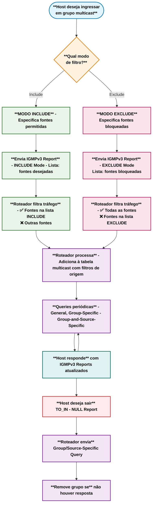

# Índice

- [Índice](#índice)
  - [IGMPv3](#igmpv3)
    - [Funcionamento do IGMPv3](#funcionamento-do-igmpv3)
    - [Processo de Participação no IGMPv3](#processo-de-participação-no-igmpv3)
    - [Consultas no IGMPv3](#consultas-no-igmpv3)
    - [Eleição do Querier no IGMPv3](#eleição-do-querier-no-igmpv3)
    - [Fluxograma do Processo IGMPv3](#fluxograma-do-processo-igmpv3)
    - [Tipos de Transições de Estado no IGMPv3](#tipos-de-transições-de-estado-no-igmpv3)
    - [Vantagens do IGMPv3](#vantagens-do-igmpv3)
    - [Resumo da Operação do IGMPv3](#resumo-da-operação-do-igmpv3)

## IGMPv3

O IGMPv3 evolui em relação à versão 2 ao permitir identificar a origem desejada do tráfego multicast, possibilitando que os destinatários apliquem filtros de origem e escolham de quais fontes receber o tráfego.  

Essa versão foi desenvolvida para coexistir junto das outras. A diferença da versão 3 para 2 é que na versão 3 foram acrescentados novos campos na consulta de adesão e um novo tipo de
mensagem IGMP chamado relatório de associação da versão 3 para oferecer suporte à filtragem de origem.  

O IGMPv3 oferece suporte a aplicativos que sinalizam fontes explicitamente do qual desejam receber tráfego. Com o IGMPv3, os destinatários sinalizam a intenção de se associar a um endereço de grupo multicast usando um relatório de associação nos dois modos a seguir:

- **MODO DE INCLUSÂO:** nesse modo, o destinatário anuncia a adesão para um endereço de grupo de multicast e fornece uma lista (include list) de endereços de fontes de quem ele deseja receber o tráfego
- **MODO DE EXCLUSÂO:** nesse modo, o destinatário anuncia a adesão para um endereço de grupo de multicast e fornece uma lista (exclude list) de endereços de quem ele não receber o tráfego.
Para receber o tráfego de todas as fontes, que é o comportamento do IGMPv2, o destinatário utiliza **o modo de exclusão de adesão com um uma lista de exclusão vazia**

  

- **CÓDIGO MÁXIMO DE RESPOSTA :** Este campo é ignorado para tipos de mensagens diferentes de consulta de associação. Para o tipo de consulta de adesão, é o tempo máximo permitido antes de enviar um relatório de resposta. O valor está em unidades de 0,1 segundos.
- **CHECKSUM :** campo de 16 bits 1 que complementa a soma da mensagem IGMP. É o mesmo algoritmo utilizado pelo TCP/IP.
- **ENDEREÇO DE GRUPO :** É definido como 0 ao enviar uma consulta geral. Caso contrário, endereço multicast para consultas específicas de grupo ou de origem.
- **RESV :** É configurado em 0 e é ignorado quando recebido
- **S FLAG :** Representa o sinalizador Suprimir processamento do lado do roteador. Quando o sinalizador está definido, ele indica a supressão das atualizações de timer que os roteadores multicast realizam ao receber qualquer consulta.
- **QRV :** Representa a variável de robustez do consultor (querier). Os roteadores continuam recuperando o valor QRV da consulta recebida mais recentemente como seu próprio valor até que o QRV recebido mais recentemente seja zero.
- **QQIC :** Representa o código de intervalo de consulta do consultor.
- **NÚMERO DE FONTES :** Representa o número de endereços de origem presentes na consulta. Para consulta geral ou consulta específica de grupo, este campo é zero e para consulta específica de grupo e origem, este campo é diferente de zero.
- **ENDEREÇO DE ORIGEM[N] :** Representa o endereço IP unicast para N campos.

### Funcionamento do IGMPv3  

Quando um destinatário deseja ingressar em um grupo multicast no IGMPv3, ele envia uma mensagem IGMPv3 Membership Report que pode conter múltiplos registros de grupo em uma única mensagem. Cada registro especifica:  

- O endereço do grupo multicast
- O modo de filtro (Include ou Exclude)
- A lista de endereços de origem

O roteador que atua como querier processa esses relatórios e mantém o estado de cada grupo, incluindo as listas de origem associadas. Isso permite um controle muito mais granular sobre qual tráfego multicast é encaminhado.

### Processo de Participação no IGMPv3  

**Modo de Inclusão (Include Mode):**  

O host especifica exatamente de quais fontes deseja receber tráfego  
Exemplo: "Quero receber o grupo 224.1.1.1, mas apenas das fontes 10.1.1.1 e 10.1.1.2" 

```mermaid
sequenceDiagram
    participant Host
    participant Switch
    participant Roteador
    participant Fonte1 as Fonte A<br>(10.1.1.1)
    participant Fonte2 as Fonte B<br>(10.1.1.2)

    Host->>Roteador: IGMPv3 Report - INCLUDE Mode<br>Grupo: 224.1.1.1<br>Fontes: [10.1.1.1]
    Note right of Roteador: Adiciona grupo com<br>filtro de origem específica
    Host->>Switch: IGMPv3 Report (escutado via IGMP Snooping)
    Note right of Switch: Associa porta ao grupo<br>com filtro de origem

    Roteador-->>Host: General Query (periódico)
    Host->>Roteador: IGMPv3 Report - INCLUDE Mode<br>Fontes: [10.1.1.1]

    Fonte1->>Roteador: Tráfego Multicast (224.1.1.1)
    Roteador->>Host: Encaminha tráfego ✅
    
    Fonte2->>Roteador: Tráfego Multicast (224.1.1.1)
    Note right of Roteador: Filtrado - fonte não está<br>na lista INCLUDE ❌

    Host->>Roteador: IGMPv3 Report - TO_IN(NULL)<br>(equivalente ao Leave)
    Roteador->>Host: Group-and-Source-Specific Query
    Note right of Roteador: Remove grupo da tabela<br>se não houver resposta
````

**Modo de Exclusão (Exclude Mode):**

O host especifica de quais fontes NÃO deseja receber tráfego  
Exemplo: "Quero receber o grupo 224.1.1.1 de todas as fontes, exceto de 10.1.1.3"  

Para manter compatibilidade com IGMPv2: Um host pode usar o modo de exclusão com lista vazia, indicando que deseja receber de todas as fontes (comportamento padrão do IGMPv2).

```mermaid
sequenceDiagram
    participant Host
    participant Switch
    participant Roteador
    participant Fonte1 as Fonte A<br>(10.1.1.1)
    participant Fonte2 as Fonte B<br>(10.1.1.2)
    participant Fonte3 as Fonte C<br>(10.1.1.3)

    Host->>Roteador: IGMPv3 Report - EXCLUDE Mode<br>Grupo: 224.1.1.1<br>Fontes Bloqueadas: [10.1.1.3]
    Note right of Roteador: Adiciona grupo com<br>lista de exclusão
    Host->>Switch: IGMPv3 Report (escutado via IGMP Snooping)
    Note right of Switch: Associa porta ao grupo<br>com filtro de exclusão

    Roteador-->>Host: General Query (periódico)
    Host->>Roteador: IGMPv3 Report - EXCLUDE Mode<br>Fontes Bloqueadas: [10.1.1.3]

    Fonte1->>Roteador: Tráfego Multicast (224.1.1.1)
    Roteador->>Host: Encaminha tráfego ✅
    
    Fonte2->>Roteador: Tráfego Multicast (224.1.1.1)
    Roteador->>Host: Encaminha tráfego ✅

    Fonte3->>Roteador: Tráfego Multicast (224.1.1.1)
    Note right of Roteador: Filtrado - fonte está na<br>lista EXCLUDE ❌

    Host->>Roteador: IGMPv3 Report - TO_IN(NULL)<br>(Leave Group)
    Roteador->>Host: Group-Specific Query
    Note right of Roteador: Remove grupo da tabela<br>se não houver resposta
```

### Consultas no IGMPv3  

O IGMPv3 suporta três tipos de consultas:

- **General Query:** Verifica todos os grupos ativos (endereço de grupo = 0.0.0.0)
- **Group-Specific Query:** Verifica um grupo específico
- **Group-and-Source-Specific Query:** Verifica um grupo e fontes específicas

### Eleição do Querier no IGMPv3

O processo de eleição do querier no IGMPv3 mantém o mesmo princípio do IGMPv2: o roteador com menor endereço IP na interface local vence a eleição. Porém, o IGMPv3 introduz melhorias:  

- **Consultas mais específicas:** O querier pode fazer consultas direcionadas para grupos e fontes específicas
- **Melhor eficiência:** Reduz o tráfego desnecessário ao permitir consultas mais granulares
- **Compatibilidade:** Queriers IGMPv3 podem interagir com hosts IGMPv1/v2 na mesma rede

### Fluxograma do Processo IGMPv3



[IGMPv3 - Animação](https://alcancil.github.io/Cisco/CCNP%20350-401%20ENCOR/03%20-%20Infrastructure/01%20-%20Multicast/02%20-%20IGMP/Arquivos/igmpv3.html)

### Tipos de Transições de Estado no IGMPv3  

O IGMPv3 define várias transições de estado que são comunicadas através dos reports:

| Transição | Significado                           | Exemplo de Uso                                 |
|-----------|---------------------------------------|------------------------------------------------|
| TO_IN(A)  | Mudança para modo Include com lista A | Host quer receber apenas de fontes específicas |
| TO_EX(A)  | Mudança para modo Exclude com lista A | Host quer receber de todas, exceto lista A     |
| ALLOW(A)  | Adicionar fontes A à lista atual      | Host quer receber de fontes adicionais         |
| BLOCK(A)  | Remover fontes A da lista atual       | Host não quer mais receber de certas fontes    |

Essas transições permitem que o host modifique dinamicamente suas preferências de recebimento sem precisar sair e reingressar no grupo.

### Vantagens do IGMPv3

- **Source-Specific Multicast (SSM):** Permite especificar exatamente de qual fonte receber
- **Melhor segurança:** Hosts podem bloquear fontes indesejadas
- **Eficiência aprimorada:** Reduz tráfego desnecessário na rede
- **Compatibilidade:** Coexiste com versões anteriores
- **Controle granular:** Múltiplos grupos e fontes em uma única mensagem

### Resumo da Operação do IGMPv3

**📹 Papéis**  

- **Host (receptor):** informa ao roteador quais grupos deseja participar e de quais fontes específicas
- **Querier (roteador):** mantém estado detalhado de grupos e suas listas de origem

**📹 Tipos de Mensagens**  

| Mensagem          | Origem  | Função                                                             |
|-------------------|---------|--------------------------------------------------------------------|
| IGMPv3 Membership | Report  | HostAnuncia participação em grupos com lista de fontes específicas |
| General Query     | Querier | Verifica todos os grupos ativosGroup-Specific                      |
| Query             | Querier | Verifica um grupo específico                                       |
| Group-and-Source  | Query   | Querier Verifica um grupo e fontes específicas                     |

**Estados de Filtro**  

O IGMPv3 mantém estados de filtro para cada interface:

- **INCLUDE (S,G):** Recebe tráfego do grupo G apenas das fontes na lista S
- **EXCLUDE (S,G):** Recebe tráfego do grupo G de todas as fontes, exceto as da lista S

Esses estados são fundamentais para o funcionamento correto do Source-Specific Multicast (SSM) e permitem que aplicações tenham controle preciso sobre suas fontes de dados.
