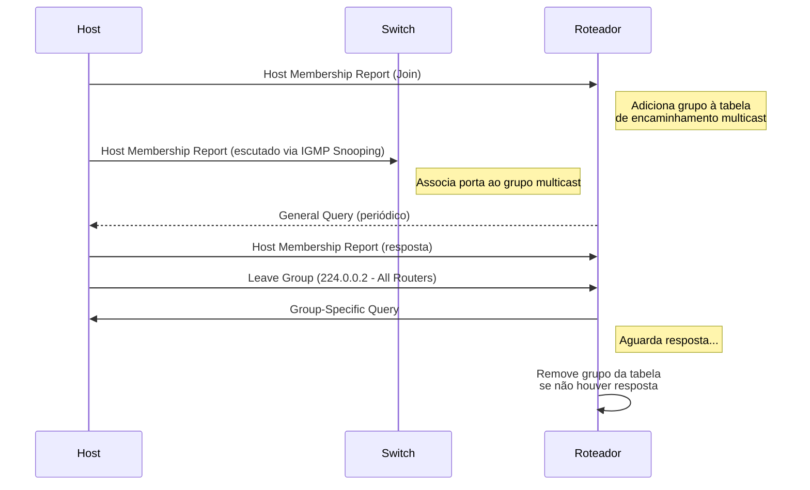
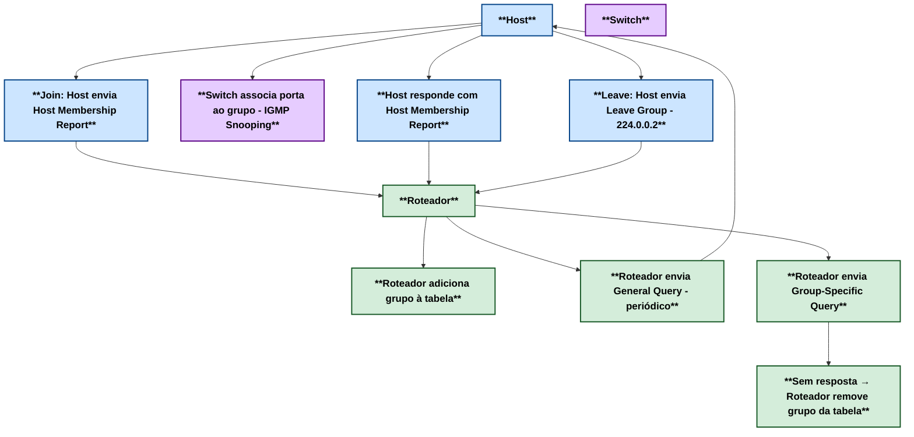
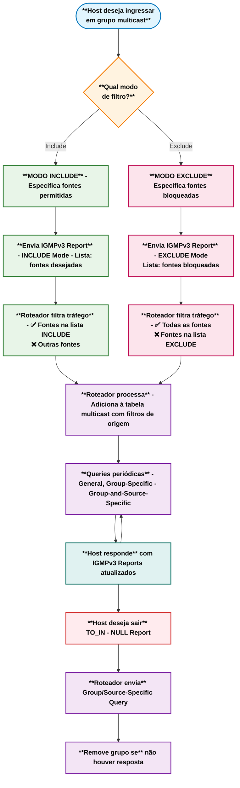

# Índice

- [Índice](#índice)
  - [02 - Internet Group Management Protocol](#02---internet-group-management-protocol)
  - [Aplicações](#aplicações)
  - [IGMPv1](#igmpv1)
  - [IGMPv2](#igmpv2)
    - [Processo de participação (Join/Leave) no IGMPv2](#processo-de-participação-joinleave-no-igmpv2)
    - [🔄 IGMPv2 e a “eleição silenciosa” - Eleição do querier](#-igmpv2-e-a-eleição-silenciosa---eleição-do-querier)
    - [📝 Resumo da Operação do IGMPv2](#-resumo-da-operação-do-igmpv2)
  - [IGMPv3](#igmpv3)
    - [Funcionamento do IGMPv3](#funcionamento-do-igmpv3)
    - [Processo de Participação no IGMPv3](#processo-de-participação-no-igmpv3)
    - [Consultas no IGMPv3](#consultas-no-igmpv3)
    - [Eleição do Querier no IGMPv3](#eleição-do-querier-no-igmpv3)
    - [Fluxograma do Processo IGMPv3](#fluxograma-do-processo-igmpv3)
    - [Tipos de Transições de Estado no IGMPv3](#tipos-de-transições-de-estado-no-igmpv3)
    - [Vantagens do IGMPv3](#vantagens-do-igmpv3)
    - [Resumo da Operação do IGMPv3](#resumo-da-operação-do-igmpv3)
    - [Resumo](#resumo)
  - [Tabela Comparativa: IGMPv1 vs IGMPv2 vs IGMPv3](#tabela-comparativa-igmpv1-vs-igmpv2-vs-igmpv3)
  - [Comparação Detalhada das Versões do IGMP](#comparação-detalhada-das-versões-do-igmp)
  - [Funcionalidades Básicas](#funcionalidades-básicas)
  - [Tipos de Mensagens](#tipos-de-mensagens)
  - [Tipos de Consultas (Queries)](#tipos-de-consultas-queries)
  - [Campos da Mensagem](#campos-da-mensagem)
  - [Processo de Saída (Leave)](#processo-de-saída-leave)
  - [Filtragem e Controle](#filtragem-e-controle)
  - [Eleição do Querier](#eleição-do-querier)
  - [Eficiência e Performance](#eficiência-e-performance)
  - [Aplicações Típicas](#aplicações-típicas)
  - [Limitações por Versão](#limitações-por-versão)
    - [IGMPv1](#igmpv1-1)
    - [IGMPv2](#igmpv2-1)
    - [IGMPv3](#igmpv3-1)
  - [Recomendações de Implementação](#recomendações-de-implementação)
  - [📝 **Resumo Executivo**](#-resumo-executivo)
  - [Referências](#referências)
  - [Simulados](#simulados)

## 02 - Internet Group Management Protocol

Esse protocolo permite que hosts e roteadores adjacentes estabeleçam comunicação multicast em redes IP, otimizando o uso de banda e a transmissão de pacotes. O multicast pode ter um único ou vários remetentes e destinatários. Ele é utilizado em redes IPv4 e em redes IPv6 é utilizado o Multicast Listener Discovery (MLD) que é um protocolo que gerencia membros multicast IPv6.  

O **IGMP (Internet Group Management Protocol)** é o protocolo responsável por permitir que os hosts informem ao roteador local sua intenção de ingressar ou sair de grupos multicast.  

Ele opera na **Camada 3 (Rede) do modelo OSI**, mas sua função está voltada principalmente **ao controle e gerenciamento de grupos multicast**. O IGMP atua dentro de **uma sub-rede,** funcionando como um protocolo de vizinhança entre os hosts e o roteador multicast conectado ao mesmo segmento.

Dessa forma, o roteador consegue identificar quais grupos multicast possuem membros ativos naquela rede local, garantindo que o tráfego seja encaminhado apenas para os segmentos onde realmente há receptores interessados.

Sem o IGMP, roteadores e switches não teriam como saber com precisão onde entregar o tráfego multicast, o que resultaria em desperdício de banda e, em cenários mais críticos, em inundações desnecessárias de tráfego na rede.

Atualmente existem 3 versões desse protocolo: **IGMPv1** definida na RFC 1112 que raramente é utilizada, **IGMPv2** definida na RFC 2236 que é a mais comum de ser encontrada na **RFC 3376** e **IGMPv3** que é definida na rfc RFC 3376.  

## Aplicações

- **Streaming:** o IGMP é muito utilizado em streaming de áudio e vídeo onde uma pessoa transmite um único fluxo de comunicação para um grupo em específico.
- **Jogos Online:** esse também é um uso comum para esse protocolo onde hoje em dia cada vez mais os usuários de jogos se tornaram mais exigentes e com a utilização do IGMP a comunicação se dá de forma mais eficiente.
- **Videoconferência:** essa é uma modalidade de comunicação que vem se tornando cada vez mais popular e exige também um uso mais eficiente de banda.  

## IGMPv1

  

- **VERSÃO:** Campo configurado em 1. Versão do protocolo.
- **TIPO:** 1 para consulta de associação e relatório de associação de destinatário.  
- **NÃO UTILIZADO:** campo não utilizado preenchido com zeros.
- **CHECKSUM:** campo de 16 bits 1 que complementa a soma da mensagem IGMP. É o mesmo algoritmo utilizado pelo TCP/IP
- **ENDEREÇO DE GRUPO:** O campo de endereço do grupo é zero quando enviado e ignorado quando recebido na mensagem de consulta de associação. Em uma mensagem de relatório de associação, o campo de endereço do grupo utiliza o endereço do grupo de hosts IP do grupo que está sendo relatado

## IGMPv2

  

As mensagens IGMPv2 são encapsuladas no protocolo **IP com a marcação de número 2** e possuem um TTL (Time To Live) igual a 1, limitando seu alcance à rede local. Quando o pacote chega ao próximo salto, o TTL é decrementado para 0 e descartado.

- **TIPO:** esse campo indica **5** tipos de mensagens IGMP diferentes:
  - **1 - Relatório de adesão versão 2:** essa é uma mensagem com o valor *0x16* que é enviada para os destinatários para se juntar ao grupo IGMP ou uma resposta de consulta feita pelos destinatários. É referida como IGMP join.
  - **2 - Relatório de adesão versão 1:** é uma mensagem com o valor 0x12 para fins de compatibilidade com o IGMPv1.
  - **3 - Consulta geral de associação:** é uma mensagem com o valor 0x11 enviada para todos os hosts de 224.0.0.1 para verificar se existem hosts nessa sub-rede. Ela seta o campo de endereço de grupo para 0.0.0.0
  - **4 - Consulta específica do grupo:** é uma mensagem com o valor 0x11 e é uma mensagem de resposta para o endereço que pediu para sair do grupo. O endereço do grupo é o IP de destino
endereço do pacote IP e o campo de endereço do grupo.
  - **5 - Tempo máximo de resposta:** Este campo é definido apenas em geral e mensagens de consulta de associação específicas de grupo (tipo valor 0x11); isto especifica o tempo máximo permitido antes de enviar um
relatório de resposta em unidades de um décimo de segundo. Em todos as outras mensagens, é definido como 0x00 pelo remetente e ignorado pelos destinatários.
- **CHECKSUM:** campo de 16 bits 1 que complementa a soma da mensagem IGMP. É o mesmo algoritmo utilizado pelo TCP/IP
- **ENDEREÇO DE GRUPO:** Este campo é definido como 0.0.0.0 nas mensagens de consulta geral e é definido para o endereço do grupo em configurações de mensagens específicas do grupo. As mensagens de relatório de adesão contém
o endereço do grupo que está sendo reportado neste campo; as mensagens de saída do grupo contém o endereço do grupo que está sendo deixado neste campo.  

**OBS:**  
    **Tipos**

    0x11 for Membership Query
    0x12 for IGMPv1 Membership Report
    0x16 for IGMPv2 Membership Report
    0x22 for IGMPv3 Membership Report
    0x17 for Leave Group  

Quando um destinatário quer receber um fluxo multicast, ele envia um relatório de adesão não solicitado para o roteador local, para o grupo que ele deseja se juntar.  

O termo oficial é ‘relatório de adesão não solicitado’. No entanto, é comum ouvir a expressão IGMP Join, por ser mais simples de usar — embora não seja o termo padronizado.  

Então o roteador local envia uma mensagem PIM Join em direção á origem para solicitar um fluxo multicast. Quando o roteador local começa a receber o fluxo multicast, ele envia de volta o fluxo para a sub-rede que o destinatário está.  

Logo após, o roteador começa a enviar mensagens de consulta de associação para a sub-rede, com o endereço de todos os hosts 224.0.0.1 para descobrir quais são os hosts presentes.
Essas mensagens de consulta gerais possuem um tempo padrão de resposta de 10 segundos por padrão.  

Em resposta a essas consultas, os destinatários configuram um timer entre 0 e 10 segundos. Quando esse timer expira, os destinatários enviam de volta um relatório de adesão informando a qual
grupo pertencem. Se um destinatário receber o relatório de outro destinatário para um dos grupos ao qual pertence enquanto estiver com um timer em execução, ele interrompe seu
timer para o grupo especificado e não envia um relatório; isso serve para suprimir relatórios duplicados.  

Quando um destinatário quer deixar o grupo, ele envia uma mensagem para o endereço 224.0.0.2 ( endereço all-routers group) se ele for o último destinatário a responder as consultas.
Caso contrário, ele pode sair do grupo de forma silenciosa pois neste caso deve existir algum outro destinatário na sub-rede.  

Quando a mensagem de saída do grupo é recebida pelo roteador, ela segue com uma consulta de associação específica do grupo para o grupo endereço multicast para determinar se há
algum destinatário interessado no grupo restante na sub-rede. Se não existir outro, então o remove o estado de IGMP do grupo.  

Mas pode ocorrer que nessa sub-rede exista tenha mais do que somente um roteador. Nesse caso ocorrerá uma eleição para ver quem vai responder as consultas IGMP. Então os roteadores
enviam mensagens de consultas genéricas de adesão contendo o endereço do seu IP com destino para 224.0.0.1 . Quando um roteador recebe uma mensagem dessas, ele compara o endereço IP
da mensagem com o endereço IP da sua própria interface de rede. O roteador **com o menor endereço IP** então é eleito como o roteador que irá responder as consultas IGMP dessa sub-rede.
Nesse momento, os outros roteadores iniciam um timer que reinicia toda a vez que ele recebe uma mensagem de consulta de adesão do roteador que venceu a eleição.  

Se por algum motivo o roteador que venceu a eleição para de enviar as mensagens, uma nova eleição ocorre. Um roteador que não responde as consultas, espera o dobro do tempo, que por
padrão é 60 segundos, e se ele não receber nenhuma consulta nesse intervalo, ele aciona uma nova eleição de IGMP.  

### Processo de participação (Join/Leave) no IGMPv2

No IGMPv2 (Internet Group Management Protocol versão 2), o processo de participação em grupos multicast segue uma sequência clara entre hosts, roteadores e switches (quando há IGMP Snooping habilitado).

Quando um host deseja ingressar em um grupo multicast, ele envia uma mensagem Host Membership Report para o endereço multicast de destino. O roteador que atua como querier naquela rede escuta essa mensagem e passa a registrar o grupo em sua tabela de encaminhamento multicast, associando-o à interface de onde a mensagem foi recebida.

Se houver switches com IGMP Snooping ativado, eles também escutam esse report e associam a porta física ao grupo multicast, garantindo que o tráfego seja encaminhado apenas para os hosts interessados, evitando flooding desnecessário.

Para manter a associação ativa, o roteador envia periodicamente General Queries, às quais os hosts devem responder com novos Host Membership Reports. Dessa forma, o roteador confirma a permanência de membros ativos naquele grupo.

Quando um host deseja sair de um grupo, ele envia uma mensagem Leave Group para o endereço 224.0.0.2 (All Routers). Ao receber esse Leave, o roteador dispara uma Group-Specific Query para verificar se ainda existem outros hosts interessados naquele grupo. Se ninguém responder dentro do tempo limite, o roteador conclui que não há mais membros naquela interface e remove o grupo de sua tabela.

Esse processo garante que o tráfego multicast seja encaminhado apenas quando necessário, otimizando o uso da rede.





### 🔄 IGMPv2 e a “eleição silenciosa” - Eleição do querier

Quando falamos de multicast, um ponto importante é: quem será o querier?
Imagine vários roteadores em uma mesma rede, todos prontos para coordenar os grupos multicast. Se todos enviarem queries ao mesmo tempo, vira bagunça.

**👉 É aí que entra a eleição automática do IGMPv2.**  

Funciona assim: todos se apresentam, mas o que tem o menor IP na interface local ganha o cargo de querier. Os outros respeitam e ficam de reserva, prontos para assumir se o principal cair.  

Ou seja, não existe caos: o protocolo se organiza sozinho, mantendo a rede multicast funcional e estável.  

### 📝 Resumo da Operação do IGMPv2  

🔹 Papéis  

- **Host (receptor):** informa ao roteador que deseja ou não participar de um grupo multicast.  

- **Querier (roteador):** mantém a lista de grupos ativos na rede e envia mensagens de consulta.  

🔹 Tipos de Mensagens  

| Mensagem             | Origem  | Função                                                              |
|----------------------|---------| --------------------------------------------------------------------|
| Membership Report    | Host    | Anuncia participação em um grupo multicast.                         |
| Leave Group          | Host    | Informa que não deseja mais receber o grupo.                        |
| General Query        | Querier | Verifica se há hosts interessados em grupos.                        |
| Group-Specific Query | Querier | Confirma se ainda existem hosts interessados em um grupo específico.|

[IGMPv2 - Animação](https://alcancil.github.io/Cisco/CCNP%20350-401%20ENCOR/03%20-%20Infrastructure/01%20-%20Multicast/02%20-%20IGMP/Arquivos/igmpv2.html)

## IGMPv3

O IGMPv3 evolui em relação à versão 2 ao permitir identificar a origem desejada do tráfego multicast, possibilitando que os destinatários apliquem filtros de origem e escolham de quais fontes receber o tráfego.  

Essa versão foi desenvolvida para coexistir junto das outras. A diferença da versão 3 para 2 é que na versão 3 foram acrescentados novos campos na consulta de adesão e um novo tipo de
mensagem IGMP chamado relatório de associação da versão 3 para oferecer suporte à filtragem de origem.  

O IGMPv3 oferece suporte a aplicativos que sinalizam fontes explicitamente do qual desejam receber tráfego. Com o IGMPv3, os destinatários sinalizam a intenção de se associar a um endereço de grupo multicast usando um relatório de associação nos dois modos a seguir:

- **MODO DE INCLUSÂO:** nesse modo, o destinatário anuncia a adesão para um endereço de grupo de multicast e fornece uma lista (include list) de endereços de fontes de quem ele deseja receber o tráfego
- **MODO DE EXCLUSÂO:** nesse modo, o destinatário anuncia a adesão para um endereço de grupo de multicast e fornece uma lista (exclude list) de endereços de quem ele não receber o tráfego.
Para receber o tráfego de todas as fontes, que é o comportamento do IGMPv2, o destinatário utiliza **o modo de exclusão de adesão com um uma lista de exclusão vazia**

  

- **CÓDIGO MÁXIMO DE RESPOSTA :** Este campo é ignorado para tipos de mensagens diferentes de consulta de associação. Para o tipo de consulta de adesão, é o tempo máximo permitido antes de enviar um relatório de resposta. O valor está em unidades de 0,1 segundos.
- **CHECKSUM :** campo de 16 bits 1 que complementa a soma da mensagem IGMP. É o mesmo algoritmo utilizado pelo TCP/IP.
- **ENDEREÇO DE GRUPO :** É definido como 0 ao enviar uma consulta geral. Caso contrário, endereço multicast para consultas específicas de grupo ou de origem.
- **RESV :** É configurado em 0 e é ignorado quando recebido
- **S FLAG :** Representa o sinalizador Suprimir processamento do lado do roteador. Quando o sinalizador está definido, ele indica a supressão das atualizações de timer que os roteadores multicast realizam ao receber qualquer consulta.
- **QRV :** Representa a variável de robustez do consultor (querier). Os roteadores continuam recuperando o valor QRV da consulta recebida mais recentemente como seu próprio valor até que o QRV recebido mais recentemente seja zero.
- **QQIC :** Representa o código de intervalo de consulta do consultor.
- **NÚMERO DE FONTES :** Representa o número de endereços de origem presentes na consulta. Para consulta geral ou consulta específica de grupo, este campo é zero e para consulta específica de grupo e origem, este campo é diferente de zero.
- **ENDEREÇO DE ORIGEM[N] :** Representa o endereço IP unicast para N campos.

### Funcionamento do IGMPv3  

Quando um destinatário deseja ingressar em um grupo multicast no IGMPv3, ele envia uma mensagem IGMPv3 Membership Report que pode conter múltiplos registros de grupo em uma única mensagem. Cada registro especifica:  

- O endereço do grupo multicast
- O modo de filtro (Include ou Exclude)
- A lista de endereços de origem

O roteador que atua como querier processa esses relatórios e mantém o estado de cada grupo, incluindo as listas de origem associadas. Isso permite um controle muito mais granular sobre qual tráfego multicast é encaminhado.

### Processo de Participação no IGMPv3  

**Modo de Inclusão (Include Mode):**  

O host especifica exatamente de quais fontes deseja receber tráfego  
Exemplo: "Quero receber o grupo 224.1.1.1, mas apenas das fontes 10.1.1.1 e 10.1.1.2" 

```mermaid
sequenceDiagram
    participant Host
    participant Switch
    participant Roteador
    participant Fonte1 as Fonte A<br>(10.1.1.1)
    participant Fonte2 as Fonte B<br>(10.1.1.2)

    Host->>Roteador: IGMPv3 Report - INCLUDE Mode<br>Grupo: 224.1.1.1<br>Fontes: [10.1.1.1]
    Note right of Roteador: Adiciona grupo com<br>filtro de origem específica
    Host->>Switch: IGMPv3 Report (escutado via IGMP Snooping)
    Note right of Switch: Associa porta ao grupo<br>com filtro de origem

    Roteador-->>Host: General Query (periódico)
    Host->>Roteador: IGMPv3 Report - INCLUDE Mode<br>Fontes: [10.1.1.1]

    Fonte1->>Roteador: Tráfego Multicast (224.1.1.1)
    Roteador->>Host: Encaminha tráfego ✅
    
    Fonte2->>Roteador: Tráfego Multicast (224.1.1.1)
    Note right of Roteador: Filtrado - fonte não está<br>na lista INCLUDE ❌

    Host->>Roteador: IGMPv3 Report - TO_IN(NULL)<br>(equivalente ao Leave)
    Roteador->>Host: Group-and-Source-Specific Query
    Note right of Roteador: Remove grupo da tabela<br>se não houver resposta
````

**Modo de Exclusão (Exclude Mode):**

O host especifica de quais fontes NÃO deseja receber tráfego  
Exemplo: "Quero receber o grupo 224.1.1.1 de todas as fontes, exceto de 10.1.1.3"  

Para manter compatibilidade com IGMPv2: Um host pode usar o modo de exclusão com lista vazia, indicando que deseja receber de todas as fontes (comportamento padrão do IGMPv2).

```mermaid
sequenceDiagram
    participant Host
    participant Switch
    participant Roteador
    participant Fonte1 as Fonte A<br>(10.1.1.1)
    participant Fonte2 as Fonte B<br>(10.1.1.2)
    participant Fonte3 as Fonte C<br>(10.1.1.3)

    Host->>Roteador: IGMPv3 Report - EXCLUDE Mode<br>Grupo: 224.1.1.1<br>Fontes Bloqueadas: [10.1.1.3]
    Note right of Roteador: Adiciona grupo com<br>lista de exclusão
    Host->>Switch: IGMPv3 Report (escutado via IGMP Snooping)
    Note right of Switch: Associa porta ao grupo<br>com filtro de exclusão

    Roteador-->>Host: General Query (periódico)
    Host->>Roteador: IGMPv3 Report - EXCLUDE Mode<br>Fontes Bloqueadas: [10.1.1.3]

    Fonte1->>Roteador: Tráfego Multicast (224.1.1.1)
    Roteador->>Host: Encaminha tráfego ✅
    
    Fonte2->>Roteador: Tráfego Multicast (224.1.1.1)
    Roteador->>Host: Encaminha tráfego ✅

    Fonte3->>Roteador: Tráfego Multicast (224.1.1.1)
    Note right of Roteador: Filtrado - fonte está na<br>lista EXCLUDE ❌

    Host->>Roteador: IGMPv3 Report - TO_IN(NULL)<br>(Leave Group)
    Roteador->>Host: Group-Specific Query
    Note right of Roteador: Remove grupo da tabela<br>se não houver resposta
```

### Consultas no IGMPv3  

O IGMPv3 suporta três tipos de consultas:

- **General Query:** Verifica todos os grupos ativos (endereço de grupo = 0.0.0.0)
- **Group-Specific Query:** Verifica um grupo específico
- **Group-and-Source-Specific Query:** Verifica um grupo e fontes específicas

### Eleição do Querier no IGMPv3

O processo de eleição do querier no IGMPv3 mantém o mesmo princípio do IGMPv2: o roteador com menor endereço IP na interface local vence a eleição. Porém, o IGMPv3 introduz melhorias:  

- **Consultas mais específicas:** O querier pode fazer consultas direcionadas para grupos e fontes específicas
- **Melhor eficiência:** Reduz o tráfego desnecessário ao permitir consultas mais granulares
- **Compatibilidade:** Queriers IGMPv3 podem interagir com hosts IGMPv1/v2 na mesma rede

### Fluxograma do Processo IGMPv3



[IGMPv3 - Animação](https://alcancil.github.io/Cisco/CCNP%20350-401%20ENCOR/03%20-%20Infrastructure/01%20-%20Multicast/02%20-%20IGMP/Arquivos/igmpv3.html)

### Tipos de Transições de Estado no IGMPv3  

O IGMPv3 define várias transições de estado que são comunicadas através dos reports:

| Transição | Significado                           | Exemplo de Uso                                 |
|-----------|---------------------------------------|------------------------------------------------|
| TO_IN(A)  | Mudança para modo Include com lista A | Host quer receber apenas de fontes específicas |
| TO_EX(A)  | Mudança para modo Exclude com lista A | Host quer receber de todas, exceto lista A     |
| ALLOW(A)  | Adicionar fontes A à lista atual      | Host quer receber de fontes adicionais         |
| BLOCK(A)  | Remover fontes A da lista atual       | Host não quer mais receber de certas fontes    |

Essas transições permitem que o host modifique dinamicamente suas preferências de recebimento sem precisar sair e reingressar no grupo.

### Vantagens do IGMPv3

- **Source-Specific Multicast (SSM):** Permite especificar exatamente de qual fonte receber
- **Melhor segurança:** Hosts podem bloquear fontes indesejadas
- **Eficiência aprimorada:** Reduz tráfego desnecessário na rede
- **Compatibilidade:** Coexiste com versões anteriores
- **Controle granular:** Múltiplos grupos e fontes em uma única mensagem

### Resumo da Operação do IGMPv3

**📹 Papéis**  

- **Host (receptor):** informa ao roteador quais grupos deseja participar e de quais fontes específicas
- **Querier (roteador):** mantém estado detalhado de grupos e suas listas de origem

**📹 Tipos de Mensagens**  

| Mensagem          | Origem  | Função                                                             |
|-------------------|---------|--------------------------------------------------------------------|
| IGMPv3 Membership | Report  | HostAnuncia participação em grupos com lista de fontes específicas |
| General Query     | Querier | Verifica todos os grupos ativosGroup-Specific                      |
| Query             | Querier | Verifica um grupo específico                                       |
| Group-and-Source  | Query   | Querier Verifica um grupo e fontes específicas                     |

**Estados de Filtro**  

O IGMPv3 mantém estados de filtro para cada interface:

- **INCLUDE (S,G):** Recebe tráfego do grupo G apenas das fontes na lista S
- **EXCLUDE (S,G):** Recebe tráfego do grupo G de todas as fontes, exceto as da lista S

Esses estados são fundamentais para o funcionamento correto do Source-Specific Multicast (SSM) e permitem que aplicações tenham controle preciso sobre suas fontes de dados.

### Resumo

## Tabela Comparativa: IGMPv1 vs IGMPv2 vs IGMPv3  

## Comparação Detalhada das Versões do IGMP

| **Característica**  | **IGMPv1**          | **IGMPv2**                 | **IGMPv3**                      |
|---------------------|---------------------|----------------------------|---------------------------------|
| **RFC**             | RFC 1112 (1989)     | RFC 2236 (1997)            | RFC 3376 (2002)                 |
| **Status de Uso**   | Raramente utilizada | Mais comum                 | Crescente adoção                |
| **Compatibilidade** | -                   | Backward compatible com v1 | Backward compatible com v1 e v2 |

## Funcionalidades Básicas

| **Aspecto**            | **IGMPv1**               | **IGMPv2**                   | **IGMPv3**                         |
|------------------------|--------------------------|------------------------------|------------------------------------|
| **Join de Grupo**      | ✅ Host Membership Report| ✅ IGMPv2 Membership Report | ✅ IGMPv3 Membership Report        |
| **Leave de Grupo**     | ❌ Apenas timeout        | ✅ Leave Group Message      | ✅ TO_IN(NULL) / Transições        |
| **Queries Periódicas** | ✅ Host Membership Query | ✅ General Query            | ✅ General Query                   |
| **Filtro de Origem**   | ❌ Não suportado         | ❌ Não suportado            | ✅ **Source Filtering**            |
| **Múltiplos Grupos**   | ❌ Um report por grupo   | ❌ Um report por grupo      | ✅ **Múltiplos grupos por report** |

## Tipos de Mensagens

| **Tipo de Mensagem**          | **IGMPv1** | **IGMPv2**                 | **IGMPv3**                |
|-------------------------------|------------|----------------------------|---------------------------|
| **Host Membership Query**     | ✅ 0x11    | ✅ 0x11 (compatibilidade) | ✅ 0x11 (compatibilidade) |
| **Host Membership Report v1** | ✅ 0x12    | ✅ 0x12 (compatibilidade) | ✅ 0x12 (compatibilidade) |
| **Leave Group**               | ❌         | ✅ 0x17                   | ✅ 0x17 (compatibilidade) |
| **IGMPv2 Membership Report**  | ❌         | ✅ 0x16                   | ✅ 0x16 (compatibilidade) |
| **IGMPv3 Membership Report**  | ❌         | ❌                        | ✅ **0x22**               |

## Tipos de Consultas (Queries)

| **Tipo de Query**                   | **IGMPv1**             | **IGMPv2**    | **IGMPv3**        |
|-------------------------------------|------------------------|---------------|-------------------|
| **General Query**                   | ✅ Para todos os hosts | ✅ Melhorada | ✅ Mais eficiente |
| **Group-Specific Query**            | ❌                     | ✅ **Novo**  | ✅ Mantido        |
| **Group-and-Source-Specific Query** | ❌                     | ❌           | ✅ **Novo**       |

## Campos da Mensagem

| **Campo**                    | **IGMPv1**       | **IGMPv2**       | **IGMPv3**          |
|------------------------------|------------------|------------------|---------------------|
| **Versão**                   | 4 bits (valor 1) | 4 bits (valor 2) | 4 bits (valor 3)    |
| **Tipo**                     | 4 bits           | 8 bits           | 8 bits              |
| **Tempo Máximo de Resposta** | ❌               | ✅ **8 bits**   | ✅ 8 bits           |
| **Checksum**                 | ✅ 16 bits       | ✅ 16 bits      | ✅ 16 bits          |
| **Endereço de Grupo**        | ✅ 32 bits       | ✅ 32 bits      | ✅ 32 bits          |
| **Flags (S, QRV)**           | ❌               | ❌              | ✅ **Novos campos** |
| **Número de Fontes**         | ❌               | ❌              | ✅ **16 bits**      |
| **Lista de Fontes**          | ❌               | ❌              | ✅ **N × 32 bits**  |

## Processo de Saída (Leave)

| **Aspecto**             | **IGMPv1**            | **IGMPv2**              | **IGMPv3**                     |
|-------------------------|-----------------------|-------------------------|--------------------------------|
| **Método de Saída**     | Timeout silencioso    | Leave Group Message     | Transições de estado avançadas |
| **Endereço de Destino** | -                     | 224.0.0.2 (All Routers) | Flexível                       |
| **Confirmação**         | ❌                    | Group-Specific Query    | Group/Source-Specific Query    |
| **Eficiência**          | Baixa (timeout longo) | Média                   | **Alta**                       |

## Filtragem e Controle

| **Recurso**                         | **IGMPv1** | **IGMPv2**    | **IGMPv3**            |
|-------------------------------------|------------|---------------|-----------------------|
| **Any-Source Multicast (ASM)**      | ✅ Básico  | ✅ Melhorado | ✅ Completo           |
| **Source-Specific Multicast (SSM)** | ❌         | ❌           | ✅ **Suporte nativo** |
| **Modo de Inclusão**                | ❌         | ❌           | ✅ **INCLUDE(S,G)**   |
| **Modo de Exclusão**                | ❌         | ❌           | ✅ **EXCLUDE(S,G)**   |
| **Filtragem de Origem**             | ❌         | ❌           | ✅ **Granular**       |

## Eleição do Querier

| **Aspecto**             | **IGMPv1** | **IGMPv2** | **IGMPv3** |
|-------------------------|------------|------------|------------|
| **Processo de Eleição** | Básico | **Menor IP vence** | Mesmo do v2 |
| **Detecção de Falha** | Timeout simples | Timer + re-eleição | Melhorado |
| **Coexistência** | - | Com IGMPv1 | Com v1 e v2 |

## Eficiência e Performance

| **Métrica**               | **IGMPv1** | **IGMPv2** | **IGMPv3**    |
|---------------------------|------------|------------|---------------|
| **Overhead de Rede**      | Alto       | Médio      | **Baixo**     |
| **Precisão do Controle**  | Básica     | Boa        | **Excelente** |
| **Tempo de Convergência** | Lento      | Melhorado  | **Rápido**    |
| **Escalabilidade**        | Limitada   | Boa        | **Excelente** |
| **Segurança**             | Básica     | Básica     | **Melhorada** |

## Aplicações Típicas

| **Cenário de Uso**     | **IGMPv1** | **IGMPv2** | **IGMPv3** |
|------------------------|------------|------------|------------|
| **Streaming Básico**   | ✅        | ✅ ✅      | ✅ ✅ ✅ |
| **IPTV**               | ❌        | ✅ ✅      | ✅ ✅ ✅ |
| **Videoconferência**   | ❌        | ✅         | ✅ ✅ ✅ |
| **Jogos Online**       | ❌        | ✅         | ✅ ✅ ✅ |
| **SSM/Canal Premium**  | ❌        | ❌         | ✅ ✅ ✅ |
| **Segurança Avançada** | ❌        | ❌         | ✅ ✅ ✅ |

## Limitações por Versão

### IGMPv1  

- ❌ Não suporta Leave explícito
- ❌ Timeout longo para detectar saída
- ❌ Sem controle de fonte
- ❌ Eleição de querier básica

### IGMPv2  

- ❌ Não suporta filtragem de origem
- ❌ Um grupo por mensagem
- ❌ Sem suporte a SSM
- ❌ Controle limitado sobre fontes

### IGMPv3  

- ⚠️ Maior complexidade
- ⚠️ Requer suporte de hardware/software
- ⚠️ Overhead inicial maior
- ⚠️ Curva de aprendizado

## Recomendações de Implementação

| **Cenário**                | **Versão Recomendada** | **Justificativa**              |
|----------------------------|------------------------|--------------------------------|
| **Redes Legadas**          | IGMPv2                 | Compatibilidade e simplicidade |
| **IPTV/Streaming**         | IGMPv3                 | Controle granular e eficiência |
| **Ambientes Corporativos** | IGMPv3                 | Segurança e controle avançado  |
| **Provedores de Internet** | IGMPv3                 | Escalabilidade e SSM           |
| **Aplicações Críticas**    | IGMPv3                 | Precisão e performance         |

---

## 📝 **Resumo Executivo**

- **IGMPv1**: Funcional básico, obsoleto
- **IGMPv2**: Padrão atual, amplamente suportado
- **IGMPv3**: Futuro, recursos avançados de filtragem

**💡 Dica**: Para novos projetos, considere IGMPv3 para máxima flexibilidade e controle.

## Referências

| RFC   | Título                                                                 | Link                                                    |
|-------|------------------------------------------------------------------------|---------------------------------------------------------|
| RFC 1112 | Host Extensions for IP Multicasting           | [https://www.rfc-editor.org/rfc/rfc1112](https://www.rfc-editor.org/rfc/rfc1112) |
| RFC 2236 | Internet Group Management Protocol, Version 2 | [https://www.rfc-editor.org/rfc/rfc2236](https://www.rfc-editor.org/rfc/rfc2236) |
| RFC 3376 | Internet Group Management Protocol, Version 3 | [https://www.rfc-editor.org/rfc/rfc3376](https://www.rfc-editor.org/rfc/rfc3376) |

## Simulados  

**[Simulado 01](https://alcancil.github.io/Cisco/CCNP%20350-401%20ENCOR/03%20-%20Infrastructure/01%20-%20Multicast/02%20-%20IGMP/Arquivos/Simulado/01.html)**  

**[Simulado 02](https://alcancil.github.io/Cisco/CCNP%20350-401%20ENCOR/03%20-%20Infrastructure/01%20-%20Multicast/02%20-%20IGMP/Arquivos/Simulado/02.html)**

**[Simulado 03](https://alcancil.github.io/Cisco/CCNP%20350-401%20ENCOR/03%20-%20Infrastructure/01%20-%20Multicast/02%20-%20IGMP/Arquivos/Simulado/03.html)**

**[Dashboard](https://alcancil.github.io/Cisco/CCNP%20350-401%20ENCOR/03%20-%20Infrastructure/01%20-%20Multicast/02%20-%20IGMP/Arquivos/Simulado/dashboard.html)**  
