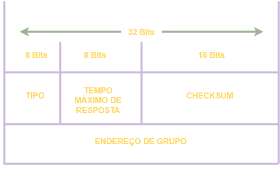

# 02 - Internet Group Management Protocol

Esse é o protocolo utilizado para os hosts se juntarem aos grupos de multicast. Atualmente existem 3 versões desse protocolo: **IGMPv1** definida na RFC 1112 que raramente é utilizada, 
**IGMPv2** definida na RFC 2236 que é a mais comum de ser encontrada e **RFC 3376** definida na RFC 3376.   

   

A mensagens são encapsulados dentro do protocolo  **IP com a marcação de número 2** . Ela possui um TTL (Time To Live) de 1, ou seja, essas mensagens tem escopo local. Só conseguem ser encaminhadas 
para os roteadores locais e não são roteadas para outras redes uma vez que para o próximo salto o TTL é decrementado para 0 e a mensagem é descartada.   

* **TIPO:** 