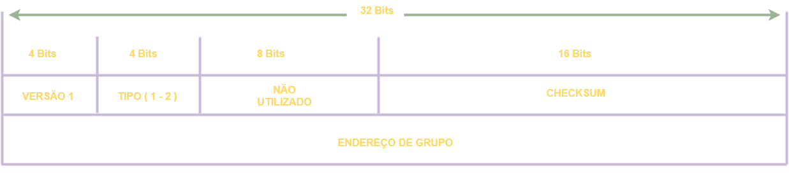
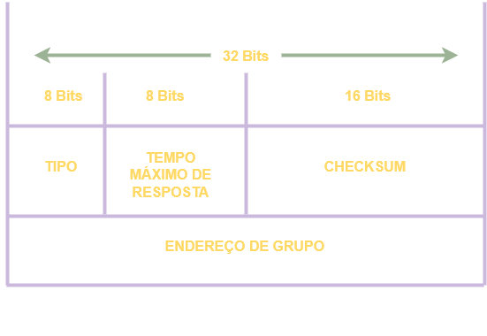
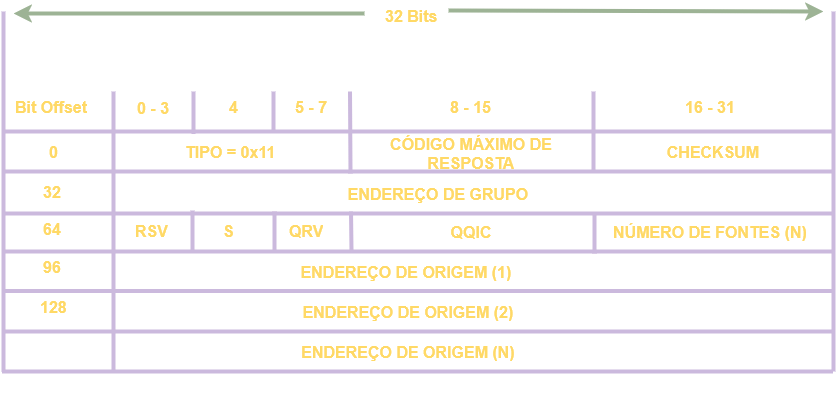

# 02 - Internet Group Management Protocol

Esse é um protocolo criado para os hosts e os roteadores adjacentes para criarem uma comunicação multicast entre redes IP e para utilizarem de forma mais eficiente as transmissões de
pacotes e dados. O multicast pode ter um único ou vários remetentes e destinatários. Ele é utilizado em redes IPv4 e em redes IPv6 é utilizado o Multicast Listener Discovery (MLD) 
que é um protocolo que gerência membros multicast IPv6.   

Atualmente existem 3 versões desse protocolo: **IGMPv1** definida na RFC 1112 que raramente é utilizada, **IGMPv2** definida na RFC 2236 que é a mais comum de ser encontrada e 
**RFC 3376** definida na RFC 3376.   

# Aplicações

* **Streaming:** o IGMP é muito utilizado em streaming de áudio e vídeo onde uma pessoa transmite um único fluxo de comunicação para um grupo em específico.
* **Jogos Online:** esse também é um uso comum para esse protocolo onde hoje em dia cada vez mais os usuários de jogos se tornaram mais exigentes e com a utilização do IGMP a comunicação se dá de forma mais eficiente.
* **Videoconferência:** essa é uma modalidade de comunicação que vem se tornando cada vez mais popular e exige também um uso mais eficiente de banda.

# IGMPv1

   

* **VERSÂO:** Campo configurado em 1. Versão do protocolo.
* **TIPO:** 1 para consulta de associação e relatório de associação de destinatário. 
* **NÂO UTILIZADO:** campo não utilizado preenchido com zeros.
* **CHECKSUM:** campo de 16 bits 1 que complementa a soma da mensagem IGMP. É o mesmo algoritmo utilizado pelo TCP/IP 
* **ENDEREÇO DE GRUPO:** O campo de endereço do grupo é zero quando enviado e ignorado quando recebido na mensagem de consulta de associação. Em uma mensagem de relatório de associação, 
o campo de endereço do grupo utiliza o endereço do grupo de hosts IP do grupo que está sendo relatado

# IGMPv2

   

A mensagens são encapsulados dentro do protocolo  **IP com a marcação de número 2** . Ela possui um TTL (Time To Live) de 1, ou seja, essas mensagens tem escopo local. Só conseguem ser encaminhadas 
para os roteadores locais e não são roteadas para outras redes uma vez que para o próximo salto o TTL é decrementado para 0 e a mensagem é descartada.   

* **TIPO:** esse campo indica **5** tipos de mensagens IGMP diferentes:
    * **1 - Relatório de adesão versão 2:** essa é uma mensagem com o valor *0x16* que é enviada para os destinatários para se juntar ao grupo IGMP ou uma resposta de consulta feita pelos destinatárioes. É referida como IGMP join.
    * **2 - Relatório de adesão versão 1:** é uma mensagem com o valor 0x12 para fins de compatibilidade com o IGMPv1.
    * **3 - Consulta geral de associação:** é uma mensagem com o valor 0x11 enviada para todos os hosts de 224.0.0.1 para verificar se existem hosts nessa sub-rede. Ela seta o campo de endereço de grupo para 0.0.0.0
    * **4 - Consulta específica do grupo:** é uma mensagem com o valor 0x11 e é uma mensagem de resposta para o endereço que pediu para sair do grupo. O endereço do grupo é o IP de destino
endereço do pacote IP e o campo de endereço do grupo.
    * **5 - Tempo máximo de resposta:** Este campo é definido apenas em geral e mensagens de consulta de associação específicas de grupo (tipo valor 0x11); isto especifica o tempo máximo permitido antes de enviar um
relatório de resposta em unidades de um décimo de segundo. Em todos as outras mensagens, é definido como 0x00 pelo remetente e ignorado pelos destinatários.
* **CHECKSUM:** campo de 16 bits 1 que complementa a soma da mensagem IGMP. É o mesmo algoritmo utilizado pelo TCP/IP
* **ENDEREÇO DE GRUPO:** Este campo é definido como 0.0.0.0 nas mensagens de consulta geral e é definido para o endereço do grupo em configurações de mensagens específicas do grupo. As mensagens de relatório de adesão contém
o endereço do grupo que está sendo reportado neste campo; as mensagens de saída do grupo contém o endereço do grupo que está sendo deixado neste campo.   

Quando um destinatário quer receber um fluxo multicast, ele envia um relatório de adesão não solicitado para o roteador local, para o grupo que ele deseja se juntar. Esse termo: "relatório de adesão não solicitado"
é o termo oficial porém é comum se ouvir falar IGMP Join pois é mais fácil de falar e escrever, porém IGMP Join não é o termo oficial. Então o roteador local envia uma mensagem PIM Join
em direção á origem para solicitar um fluxo multicast. Quando o roteador local começa a receber o fluxo multicast, ele envia de volta o fluxo para a sub-rede que o destinatário está.   

Então o roteador começa a enviar mensagens de consulta de associação para a sub-rede, com o endereço de todos os hosts 224.0.0.1 para descobrir quais são os hosts presentes.
Essas mensagens de consulta gerais possuem um tempo padrão de resposta de 10 segundos por padrão.   

Em resposta a essas consultas, os destinatários configuram um timer entre 0 e 10 segundos. Quando esse timer expira, os destinatários enviam de volta um relatório de adesão informando a qual
grupo pertencem. Se um destinatário receber o relatório de outro destinatário para um dos grupos ao qual pertence enquanto estiver com um timer em execução, ele interrompe seu 
timer para o grupo especificado e não envia um relatório; isso serve para suprimir relatórios duplicados.   

Quando um destinatário quer deixar o grupo, ele envia uma mensagem para o endereço 224.0.0.2 ( endereço all-routers group) se ele for o último destinatário a responder as consultas.
Caso contrário, ele pode sair do grupo de forma silenciosa pois neste caso deve existir algum outro destinatário na sub-rede.   

Quando a mensagem de saída do grupo é recebida pelo roteador, ela segue com uma consulta de associação específica do grupo para o grupo endereço multicast para determinar se há 
algum destinatário interessado no grupo restante na sub-rede. Se não existir outro, então o remove o estado de IGMP do grupo.   

Mas pode ocorrer que nessa sub-rede exista tenha mais do que somente um roteador. Nesse caso ocorrerá uma eleição para ver quem vai responder as consultas IGMP. Então os roteadores
enviam mensagens de consultas genéricas de adesão contendo o endereço do seu IP com destino para 224.0.0.1 . Quando um roteador recebe uma mensagem dessas, ele compara o endereço IP
da mensagem com o endereço IP da sua própria interface de rede. O roteador **com o menor endereço IP** então é eleito como o roteador que irá responder as consultas IGMP dessa sub-rede.
Nesse momento, os outros roteadores iniciam um timer que reinicia toda a vez que ele recebe uma mensagem de consulta de adesão do roteador que venceu a eleição.   

Se por algum motivo o roteador que venceu a eleição para de enviar as mensagens, uma nova eleição ocorre. Um roteador que não responde as consultas, espera o dobro do tempo, que por
padrão é 60 segundos, e se ele não receber nenhuma consulta nesse intervalo, ele aciona uma nova eleição de IGMP.   

# IGMPv3

   