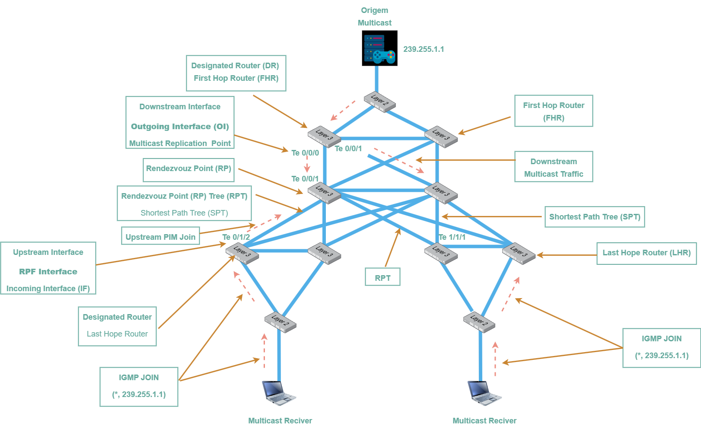

# Índice

- [Índice](#índice)
  - [03 - PIM - Protocol Independent Multicast](#03---pim---protocol-independent-multicast)
  - [Contexto Histórico](#contexto-histórico)
    - [Tipos de Árvores de Distribuição](#tipos-de-árvores-de-distribuição)
  - [Modos de Operação do PIM](#modos-de-operação-do-pim)
    - [1. PIM Dense Mode (PIM-DM) - RFC 3973](#1-pim-dense-mode-pim-dm---rfc-3973)
      - [Fluxograma do Processo - PIM Dense Mode (PIM-DM)](#fluxograma-do-processo---pim-dense-mode-pim-dm)
    - [2. PIM Sparse Mode (PIM-SM) - RFC 4601/7761](#2-pim-sparse-mode-pim-sm---rfc-46017761)
      - [Fluxograma do Processo - PIM Sparse Mode (PIM-SM)](#fluxograma-do-processo---pim-sparse-mode-pim-sm)
    - [3. PIM Source-Specific Multicast (PIM-SSM) - RFC 4607](#3-pim-source-specific-multicast-pim-ssm---rfc-4607)
      - [Fluxograma do Processo - PIM Source-Specific Multicast (PIM-SSM)](#fluxograma-do-processo---pim-source-specific-multicast-pim-ssm)
    - [4. PIM Bidirectional (PIM-BIDIR) - RFC 5015](#4-pim-bidirectional-pim-bidir---rfc-5015)
      - [Fluxograma do Processo - PIM Bidirectional (PIM-BIDIR)](#fluxograma-do-processo---pim-bidirectional-pim-bidir)
    - [5. PIM Sparse Dense Mode (PIM-SDM)](#5-pim-sparse-dense-mode-pim-sdm)
      - [Fluxograma do Processo - PIM Sparse Dense Mode (PIM-SDM)](#fluxograma-do-processo---pim-sparse-dense-mode-pim-sdm)
    - [Terminologias Importantes](#terminologias-importantes)
    - [Comparação dos Modos](#comparação-dos-modos)
  - [Componentes do PIM](#componentes-do-pim)
    - [1. 📺 Multicast Source (Origem Multicast)](#1--multicast-source-origem-multicast)
    - [2. 🗳️ Designated Router (DR)](#2-️-designated-router-dr)
    - [3. 🔌 First Hop Router (FHR)](#3--first-hop-router-fhr)
    - [4. 🎯 Rendezvous Point (RP)](#4--rendezvous-point-rp)
    - [5. 📡 Last Hop Router (LHR)](#5--last-hop-router-lhr)
    - [6. ⚡ SPT Router](#6--spt-router)
    - [7. 🔄 Bootstrap Router (BSR)](#7--bootstrap-router-bsr)
    - [8. 💻 Multicast Receivers (Receptores)](#8--multicast-receivers-receptores)
    - [9. 🔌 Switches com IGMP Snooping](#9--switches-com-igmp-snooping)
    - [10. 🔄 Interfaces e Direcionamento](#10--interfaces-e-direcionamento)
    - [11. Árvores de Distribuição](#11-árvores-de-distribuição)
    - [Mensagens PIM Principais](#mensagens-pim-principais)
  - [Compreendendo a Árvore Multicast](#compreendendo-a-árvore-multicast)
  - [Introdução 🌟](#introdução-)
    - [🔸 ETAPA 1 - Topologia Básica](#-etapa-1---topologia-básica)
    - [🔸 ETAPA 2 - Ramificações e Protocolos](#-etapa-2---ramificações-e-protocolos)
    - [Novos elementos:](#novos-elementos)
    - [🔸 ETAPA 3 - Árvore Completa com RP](#-etapa-3---árvore-completa-com-rp)
    - [Elementos avançados:](#elementos-avançados)
  - [Conectando Tudo: A Evolução Completa 🚀](#conectando-tudo-a-evolução-completa-)
    - [O Processo Completo:](#o-processo-completo)
    - [A Magia do Multicast:](#a-magia-do-multicast)
  - [Representação dos elementos da árvore](#representação-dos-elementos-da-árvore)

## 03 - PIM - Protocol Independent Multicast  

## Contexto Histórico

O desenvolvimento do multicast IP e seus protocolos de roteamento passou por várias fases importantes:
Primeiros Protocolos (1980s-1990s):

- DVMRP (Distance Vector Multicast Routing Protocol) foi um dos primeiros protocolos de roteamento multicast
- MOSPF (Multicast Extensions to OSPF) tentou integrar multicast ao OSPF
- Esses protocolos tinham limitações significativas em termos de escalabilidade

**Evolução para PIM (1990s):**

- O PIM foi desenvolvido para superar as limitações dos protocolos anteriores
- Primeira especificação do PIM-DM (Dense Mode) e PIM-SM (Sparse Mode)
- O conceito "Protocol Independent" foi revolucionário - permitia que o PIM funcionasse sobre qualquer protocolo de roteamento unicast

**Padronização:**

- RFC 2362 (1998): PIM-SM versão 2 - https://tools.ietf.org/rfc/rfc2362.txt
- RFC 4601 (2006): PIM-SM versão 2 (revisão e atualização) - https://tools.ietf.org/rfc/rfc4601.txt
- RFC 3973 (2005): PIM-DM - https://tools.ietf.org/rfc/rfc3973.txt

**O que é o PIM?**

O IGMP é o protocolo que permite aos hosts participarem de grupos multicast e sinalizarem seu interesse em receber fluxos multicast específicos. Porém, o IGMP opera apenas no escopo da rede local e não tem a capacidade de rotear pacotes multicast da origem até os destinos através de múltiplas redes. É nesse momento que o PIM (Protocol Independent Multicast) entra em ação.  

```text
❌ Sem PIM:
📺 Origem ──❓── [Router] ──❓── [Router] ──❓── 💻 Receptor
   "Como o tráfego multicast atravessa a rede?"

✅ Com PIM:
📺 Origem ──🌲── [Router] ──🌲── [Router] ──🌲── 💻 Receptor
   "PIM constrói árvores de distribuição inteligentes"
```

O PIM é um protocolo de roteamento multicast que:

- **Constrói árvores de distribuição** para entregar tráfego multicast de forma eficiente
- **É independente de protocolo** - pode utilizar informações de qualquer protocolo de roteamento unicast (OSPF, BGP, RIP, etc.)
- **Otimiza o uso da largura de banda** evitando duplicação desnecessária de pacotes
- **Escalável** para redes de grande porte

O protocolo é descrito principalmente na RFC **4601 (PIM-SM)** e possui diferentes modos de operação para atender diferentes cenários de rede.  

**Como o PIM Funciona**  

Como o PIM por si só não transporta o tráfego dos pacotes entre os roteadores multicast, ele precisa consultar a tabela de roteamento unicast para determinar os caminhos de rede. Por isso ele é chamado de Protocol Independent - porque se baseia na tabela de roteamento unicast formada por protocolos como EIGRP, OSPF, RIP, BGP, etc., ou até mesmo rotas estáticas.  

Resumindo, ele consulta a tabela RIB (Routing Information Base). 

```text
PIM consulta RIB:  

┌─────────────────┐     ┌──────────────────┐      ┌─────────────────┐
│ Protocolo OSPF  │───▶ │ Tabela RIB       │ ◀───│ PIM usa essa    │
│ BGP, EIGRP, etc │     │ (unicast routes) │      │ info para árvore│
└─────────────────┘     └──────────────────┘      └─────────────────┘
```

Com essas informações de roteamento, o PIM constrói árvores de distribuição multicast para definir os caminhos otimizados entre origem e destinos do tráfego multicast.

### Tipos de Árvores de Distribuição

**Conceito Visual das Árvores**  

```text
🌳 Shared Tree (*,G) - "Árvore Compartilhada"
    
    📺 Source A        📺 Source B
         \                /
          \              /
           ▼            ▼
            [RP Router]           ← Ponto Central
           /     |     \
          ▼      ▼      ▼
      [LHR1]  [LHR2]  [LHR3]
        |      |       |
       💻     💻      💻

🌲 Source Tree (S,G) - "Árvore por Origem"

    📺 Source A específica
         |
         ▼
      [Router] ──┬──▶ [LHR1] ──▶ 💻
                 │
                 └──▶ [LHR2] ──▶ 💻
```

O PIM utiliza dois tipos principais de árvores para distribuir o tráfego multicast:

**1. Source Tree (Árvore de Origem) - (S,G)**  

- Também conhecida como: **Shortest Path Tree (SPT)**
- Notação: **(S,G) onde S = Source (origem) e G = Group (grupo)**
- Representação: 🌲  

**Características:**  

- Cada origem (source) tem sua própria árvore
- Utiliza o caminho mais curto da origem para cada receptor
- Oferece a menor latência possível
- Consome mais memória nos roteadores (uma entrada por origem)
- Exemplo: (192.168.1.10, 224.1.1.1)

**2. Shared Tree (Árvore Compartilhada) - (*,G)**  

- Também conhecida como: **Rendezvous Point Tree (RP Tree)**
- Notação: **(*,G) onde * = qualquer origem e G = Group (grupo)**
- Representação: 🌳  

**Características:**  

- Todas as origens do mesmo grupo compartilham a mesma árvore
- Utiliza um ponto central chamado Rendezvous Point (RP)
- Consome menos memória (uma entrada por grupo)
- Pode não oferecer o caminho mais curto
- Exemplo: (*, 224.1.1.1)

**3. Source-Specific Multicast (SSM) - (S,G) no modo SSM**  

- Notação: **(S,G) em grupos SSM (232.0.0.0/8)**

**Características:**

- Os receptores especificam tanto a origem quanto o grupo
- Não requer Rendezvous Point (RP)
- Elimina problemas de segurança do multicast tradicional
- Utilizado principalmente em IPTV e streaming

**Principais Características**  

- **Protocol Independent:** Utiliza a tabela de roteamento unicast existente
- **Suporte a diferentes topologias:** Funciona em redes densas e esparsas
- **Eficiência:** Constrói árvores otimizadas para distribuição
- **Flexibilidade:** Múltiplos modos de operação (Sparse Mode, Dense Mode, etc.)

## Modos de Operação do PIM

O PIM possui diferentes modos de operação, cada um otimizado para cenários específicos de rede.  

**Comparação Visual dos Modos**  

```text
PIM Dense Mode - "Flood and Prune"
📺 ──flood──▶ ALL ──prune──▶ NEEDED
    "Inunda primeiro, depois poda"

PIM Sparse Mode - "Pull Model"  
📺 ──join──▶ RP ──join──▶ RECEIVERS
    "Constrói sob demanda"

PIM-SSM - "Source Specific"
📺 ──direct──▶ RECEIVERS (know source)
    "Receptores conhecem a origem"
```

Os 5 modos de operação do PIM são:

- PIM Dense Mode (PIM-DM)
- PIM Sparse Mode (PIM-SM)
- PIM Source-Specific Multicast (PIM-SSM)
- PIM Bidirectional (PIM-BIDIR)
- PIM Sparse Dense Mode (PIM-SDM)

### 1. PIM Dense Mode (PIM-DM) - RFC 3973

**Filosofia: "Flood and Prune" (Inundar e Podar)**  

**Representação do Processo:**

```text
Fase 1 - Flood:
📺 ──▶ [R1] ──flood──┬──▶ [R2] ──▶ 💻 ✅
                      └──▶ [R3] ──▶ ∅ ❌

Fase 2 - Prune:  
📺 ──▶ [R1] ──────────┬──▶ [R2] ──▶ 💻 ✅
                       └──prune── [R3] ✗
```

**Como funciona:**  

- Assume que receptores estão densamente distribuídos pela rede
- Inicialmente inunda todo o tráfego multicast por todas as interfaces
- Utiliza mensagens Prune para remover galhos desnecessários
- Reconstrói periodicamente a árvore através de flood novamente

**Características:**

- Simples de configurar e entender
- Eficiente quando há muitos receptores
- Desperdiça largura de banda inicialmente
- Não escalável para redes grandes
- Ideal para LANs com alta densidade de receptores

**Quando usar**: Redes pequenas com muitos receptores próximos  

#### Fluxograma do Processo - PIM Dense Mode (PIM-DM)  

```mermaid
flowchart TD
    A["Tráfego multicast chega na rede"] --> B["Roteador inunda o tráfego para todas as interfaces"]
    B --> C{"Receptores interessados?"}
    C -- Sim --> D["Mantém o tráfego ativo"]
    C -- Não --> E["Envia mensagem PIM Prune para cortar o galho"]
    D --> F["Árvore multicast otimizada"]
    E --> F["Árvore multicast otimizada"]
    F --> G["Flood periódico reinicia o processo"]

%% Estilos (esquema de farol + negrito)
%% Amarelo = flood inicial
style A fill:#fef08a,stroke:#000,stroke-width:1px,color:#000,font-weight:bold
style B fill:#fef08a,stroke:#000,stroke-width:1px,color:#000,font-weight:bold

%% Vermelho = decisão de podar
style C fill:#fca5a5,stroke:#000,stroke-width:1px,color:#000,font-weight:bold
style E fill:#fca5a5,stroke:#000,stroke-width:1px,color:#000,font-weight:bold

%% Verde = estados finais/otimizados
style D fill:#86efac,stroke:#000,stroke-width:1px,color:#000,font-weight:bold
style F fill:#86efac,stroke:#000,stroke-width:1px,color:#000,font-weight:bold
style G fill:#86efac,stroke:#000,stroke-width:1px,color:#000,font-weight:bold
```



### 2. PIM Sparse Mode (PIM-SM) - RFC 4601/7761

**Filosofia: "Pull Model" (Modelo de Solicitação)**  

```text
Representação PIM-SM:
💻 Receptor ──IGMP Join──▶ [LHR]
[LHR] ──PIM Join──▶ [RP]
[Source] ──PIM Register──▶ [RP]
[RP] ──Shared Tree──▶ [LHR]


"Constrói sob demanda via RP e pode migrar para SPT"
```

**Como funciona:**

- Assume que receptores estão esparsamente distribuídos
- Utiliza Rendezvous Point (RP) como ponto central
- Constrói árvores sob demanda apenas quando há receptores
- Pode migrar de Shared Tree (*,G) para Source Tree (S,G)

**Componentes principais:**  

- **Rendezvous Point (RP):** Ponto de encontro central
- **Bootstrap Router (BSR):** Elege e anuncia RPs
- **Designated Router (DR):** Roteador designado por segmento

**Tipos de árvores utilizadas:**

- 🌳 Shared Tree (*,G): Árvore inicial compartilhada via RP
- 🌲 Source Tree (S,G): Árvore otimizada após SPT switchover 

**Características:**

- Muito escalável
- Conserva largura de banda
- Mais complexo de configurar
- Requer planejamento de RPs
- Padrão para redes empresariais e ISPs

**Quando usar:** Redes grandes com receptores distribuídos

#### Fluxograma do Processo - PIM Sparse Mode (PIM-SM)  

```mermaid
flowchart TD
    A["Host envia IGMP Join"] --> B["DR recebe Join"]
    B --> C["Consulta tabela unicast"]
    C --> D["🌳 Join em direção ao RP (*,G)"]
    D --> E["🌳 Tráfego pela Shared Tree (*,G)"]
    E --> F{"SPT Switch Ativado?"}
    F -- Sim --> G["🌲 Constrói Source Tree (S,G)"]
    F -- Não --> H["🌳 Permanece na Shared Tree (*,G)"]
    G --> I["🌲 Tráfego flui pela SPT (S,G)"]
    H --> J["🌳 Tráfego flui pela RP Tree (*,G)"]
    %% Estilos (esquema de farol)
    %% Amarelo (início / intermediário)
    style A fill:#fef08a,stroke:#000,stroke-width:1px,color:#000,font-weight:bold
    style B fill:#fef08a,stroke:#000,stroke-width:1px,color:#000,font-weight:bold
    style C fill:#fef08a,stroke:#000,stroke-width:1px,color:#000,font-weight:bold
    style D fill:#fef08a,stroke:#000,stroke-width:1px,color:#000,font-weight:bold
    style E fill:#fef08a,stroke:#000,stroke-width:1px,color:#000,font-weight:bold
    %% Vermelho (decisão / permanência RP)
    style F fill:#fca5a5,stroke:#000,stroke-width:1px,color:#000,font-weight:bold
    style H fill:#fca5a5,stroke:#000,stroke-width:1px,color:#000,font-weight:bold
    %% Verde (SPT ativo / fluxo final)
    style G fill:#86efac,stroke:#000,stroke-width:1px,color:#000,font-weight:bold
    style I fill:#86efac,stroke:#000,stroke-width:1px,color:#000,font-weight:bold
    style J fill:#fca5a5,stroke:#000,stroke-width:1px,color:#000,font-weight:bold
```



### 3. PIM Source-Specific Multicast (PIM-SSM) - RFC 4607

**Filosofia: "Source-Specific" (Específico por Origem)**  

**Representação Visual**  

```text
Representação SSM:
📺 192.168.1.10/232.1.1.1 ──direct──▶ 💻
   "Receptor sabe exatamente qual origem quer"
   
vs PIM-SM:
📺 Any Source/239.1.1.1 ──via RP──▶ 💻  
   "Receptor aceita qualquer origem do grupo"
```

**Como funciona:**  

- Receptores especificam origem E grupo (S,G)
- Não requer Rendezvous Point (RP)
- Sempre utiliza Source Trees (S,G)
- Integra-se com IGMPv3/MLDv2

**Características:**

- Elimina problemas de segurança do multicast tradicional
- Mais simples que PIM-SM (sem RP)
- Ideal para aplicações one-to-many
- Utiliza faixa de endereços 232.0.0.0/8

**Quando usar:** IPTV, streaming, aplicações com origem conhecida

#### Fluxograma do Processo - PIM Source-Specific Multicast (PIM-SSM)  

```mermaid
flowchart TD
    A["Receptor envia IGMPv3 Join com (S,G)"] --> B["Roteador recebe pedido com origem e grupo"]
    B --> C["Constrói diretamente a Source Tree (S,G)"]
    C --> D["Tráfego flui pelo caminho mais curto"]
    D --> E["Aplicações One-to-Many (IPTV, Streaming)"]

%% Estilos (esquema de farol + negrito)
%% Amarelo = início (Join receptor)
style A fill:#fef08a,stroke:#000,stroke-width:1px,color:#000,font-weight:bold
style B fill:#fef08a,stroke:#000,stroke-width:1px,color:#000,font-weight:bold

%% Verde = árvore construída / tráfego ativo
style C fill:#86efac,stroke:#000,stroke-width:1px,color:#000,font-weight:bold
style D fill:#86efac,stroke:#000,stroke-width:1px,color:#000,font-weight:bold
style E fill:#86efac,stroke:#000,stroke-width:1px,color:#000,font-weight:bold
```



### 4. PIM Bidirectional (PIM-BIDIR) - RFC 5015  

**Filosofia: "Bidirectional Shared Tree" (Árvore Compartilhada Bidirecional)**  

**Representação visual**  

```text
Representação BIDIR:
📺 Source1 ──┐
             │
📺 Source2 ──┤──▶ [RP] ◀──┬── 📺 Source3
              │             │
📺 Source4 ──┘             └── 📺 Source5

"Múltiplas origens, uma árvore, tráfego bidirecional"
```

**Como funciona:**

- Utiliza apenas Shared Trees (*,G)
- Tráfego flui em ambas as direções na árvore
- Múltiplas origens podem usar a mesma árvore
- Reduz drasticamente o estado nos roteadores

**Características:**

- Extremamente escalável para muitas origens
- Reduz estado de roteamento
- Pode criar loops se mal configurado
- Ideal para aplicações many-to-many

**Quando usar:** Aplicações colaborativas, jogos online, muitas origens

#### Fluxograma do Processo - PIM Bidirectional (PIM-BIDIR)

```mermaid
flowchart TD
    A["Múltiplas origens enviam tráfego"] --> B["Árvore Compartilhada (*,G) é utilizada"]
    B --> C{"Tráfego flui em ambas as direções?"}
    C -- Sim --> D["Roteadores mantêm pouco estado"]
    D --> E["Rede altamente escalável"]
    E --> F["Aplicações Many-to-Many (colaboração, jogos online)"]

%% Estilos (esquema de farol + negrito)
%% Amarelo = início (origens e uso da Shared Tree)
style A fill:#fef08a,stroke:#000,stroke-width:1px,color:#000,font-weight:bold
style B fill:#fef08a,stroke:#000,stroke-width:1px,color:#000,font-weight:bold

%% Vermelho = decisão crítica (direção do tráfego / risco de loops se mal configurado)
style C fill:#fca5a5,stroke:#000,stroke-width:1px,color:#000,font-weight:bold

%% Verde = benefícios finais (estado reduzido, escalabilidade, aplicações)
style D fill:#86efac,stroke:#000,stroke-width:1px,color:#000,font-weight:bold
style E fill:#86efac,stroke:#000,stroke-width:1px,color:#000,font-weight:bold
style F fill:#86efac,stroke:#000,stroke-width:1px,color:#000,font-weight:bold
```



### 5. PIM Sparse Dense Mode (PIM-SDM)

**Filosofia:** "Hybrid Mode" (Modo Híbrido)  

**Representação visual**  

```text
Configuração por Grupo:
224.1.1.x ──▶ Dense Mode (flood & prune)
239.1.1.x ──▶ Sparse Mode (via RP)  
232.1.1.x ──▶ SSM Mode (direct)

"Flexibilidade máxima por faixa de endereços"
```

**Como funciona:**

- Combina PIM-DM e PIM-SM na mesma rede
- Configuração por grupo multicast:  

    1. Grupos configurados como "dense" → usa PIM-DM
    2. Grupos configurados como "sparse" → usa PIM-SM
    3. Grupos não configurados → usa modo padrão definido  

- Permite otimização específica por aplicação

**Características:**

- Flexibilidade máxima de configuração
- Permite coexistência de diferentes comportamentos
- Complexidade de gerenciamento aumentada
- Configuração granular por faixa de grupos

**Quando usar:** Redes mistas com diferentes tipos de aplicações multicast  

#### Fluxograma do Processo - PIM Sparse Dense Mode (PIM-SDM)

```mermaid
flowchart TD
    A["Roteador recebe solicitação para Grupo G"] --> B{"Qual modo de operação para o Grupo G?"}
    B -- Configurado como PIM-DM --> C["Inunda o tráfego para todas as interfaces (Flood)"]
    B -- Configurado como PIM-SM --> D["Envia Join em direção ao Rendezvous Point (RP)"]
    C --> E["Receptores 'podam' galhos desnecessários (Prune)"]
    E --> F["Tráfego flui pela Source Tree (S,G)"]
    D --> G["Tráfego flui pela Shared Tree (*,G)"]
    F --> H["Modo PIM-DM para o Grupo G"]
    G --> I["Modo PIM-SM para o Grupo G"]

%% Estilos (esquema de cores + negrito)
%% Amarelo = início, ação de entrada
style A fill:#fef08a,stroke:#000,stroke-width:1px,color:#000,font-weight:bold
style B fill:#fca5a5,stroke:#000,stroke-width:1px,color:#000,font-weight:bold

%% Vermelho = ponto de decisão
style C fill:#fef08a,stroke:#000,stroke-width:1px,color:#000,font-weight:bold
style D fill:#fef08a,stroke:#000,stroke-width:1px,color:#000,font-weight:bold

%% Verde = fluxo final, comportamento do tráfego
style E fill:#86efac,stroke:#000,stroke-width:1px,color:#000,font-weight:bold
style F fill:#86efac,stroke:#000,stroke-width:1px,color:#000,font-weight:bold
style G fill:#86efac,stroke:#000,stroke-width:1px,color:#000,font-weight:bold
style H fill:#86efac,stroke:#000,stroke-width:1px,color:#000,font-weight:bold
style I fill:#86efac,stroke:#000,stroke-width:1px,color:#000,font-weight:bold
```



### Terminologias Importantes

**PIM Any-Source Multicast (PIM-ASM)**  

- Não é um modo específico, mas sim um termo conceitual
- Refere-se ao PIM-SM tradicional onde qualquer origem pode enviar para um grupo
- Os receptores não especificam a origem previamente (ao contrário do SSM)
- Utiliza Rendezvous Point (RP) para descoberta de origens
- Oposto conceitual ao Source-Specific Multicast (SSM)

### Comparação dos Modos

| Modo      | Escalabilidade | Complexidade | Uso de Banda | Cenário Ideal      |
|-----------|----------------|--------------|--------------|--------------------|
| PIM-DM    | Baixa          | Baixa        | Alto inicial | LANs densas        |
| PIM-SM    | Alta           | Alta         | Otimizado    | Redes corporativas |
| PIM-SSM   | Alta           | Média        | Otimizado    | IPTV/Streaming     |
| PIM-BIDIR | Muito Alta     | Alta         | Otimizado    | Many-to-many       |

**Principais Características**  

- **Protocol Independent:** Utiliza a tabela de roteamento unicast existente
- **Suporte a diferentes topologias:** Funciona em redes densas e esparsas
- **Eficiência:** Constrói árvores otimizadas para distribuição
- **Flexibilidade:** Múltiplos modos de operação (Sparse Mode, Dense Mode, etc.)  

## Componentes do PIM  

O PIM utiliza vários componentes especializados para formar e manter as árvores multicast:

### 1. 📺 Multicast Source (Origem Multicast)

**Função:** Dispositivo que gera e transmite o tráfego multicast 

```text
Representação:
📺 Server IPTV (192.168.1.10)
   │ 
   │ Gera tráfego para: 239.255.1.1
   │
   ▼
[FHR] ← Primeiro roteador que recebe
```

**Responsabilidades:**  

- **Geração de conteúdo:** Produz o tráfego multicast (ex: 239.255.1.1)
- **Transmissão inicial:** Envia dados para o First-Hop Router
- **Identificação:** Cada origem é identificada pelo seu endereço IP
- **Aplicações típicas:** Servidores de IPTV, streaming, videoconferência

### 2. 🗳️ Designated Router (DR)

**Função:** Roteador designado responsável por um segmento de rede específico

```text
Representação - Eleição DR:

Segmento LAN:
    [R1] ──┐
           │── LAN Segment
    [R2] ──┘     │
    ↑            │
    DR          💻 Host
    
"Apenas DR processa IGMP do segmento"
"Evita duplicação de Join/Register"
```

**Responsabilidades:**

- **Eleição automática:** Roteador com maior prioridade DR ou maior IP se empate
- **Interface com hosts:** Processa mensagens IGMP dos hosts locais
- **Geração de Join/Prune:** Envia mensagens PIM Join em direção ao RP ou origem
- **Registro de origens:** Encapsula tráfego multicast inicial para o RP (Register)
- **Prevenção de duplicação:** Evita múltiplos roteadores enviando o mesmo tráfego
- **Onde atua:** Em cada segmento de LAN (sub-rede)

### 3. 🔌 First Hop Router (FHR)

**Função:** Primeiro roteador no caminho das origens multicast (conectado à origem)  

```text
Representação:
📺 Source ──▶ [FHR] ──Register──▶ [RP]
              │
              ├─ "Registra nova origem"
              ├─ "Encapsula tráfego inicial"  
              └─ "Primeira replicação"
```

**Responsabilidades:**

- **Register Process:** Encapsula tráfego da origem e envia para RP via PIM Register
- **Descoberta de RP:** Localiza o RP apropriado para o grupo
- **Encaminhamento inicial:** Primeira replicação do tráfego multicast
- **Interface com origem:** Recebe tráfego diretamente da fonte multicast
- **SPT Join:** Processa Joins diretos das árvores de origem (S,G)

Na imagem: Roteadores R1 e R2 conectados à Multicast Source

### 4. 🎯 Rendezvous Point (RP)

**Função:** Ponto de encontro central para grupos multicast (apenas em PIM-SM)  

```text
Representação - RP como "Hub Central":

    📺 Source1 ──┐
                 │
    📺 Source2 ──┤──▶ [RP] ──┬──▶ [LHR1] ──▶ 💻
                 │           │
    📺 Source3 ──┘           └──▶ [LHR2] ──▶ 💻
    
    "Todas as origens se registram no RP"
    "Todos os receptores se conectam ao RP"
```

**Responsabilidades:**  

- **Descoberta de origens:** Recebe PIM Register das origens via FHR
- **Ponto de encontro:** Local onde receptores se conectam inicialmente (*,G)
- **Construção de RPT:** Forma a Rendezvous Point Tree (Shared Tree)
- **Transição para SPT:** Facilita mudança para Source Tree quando necessário
- **Balanceamento:** Pode haver múltiplos RPs para diferentes grupos

Na imagem: Roteador R3 atuando como RP central

### 5. 📡 Last Hop Router (LHR)

**Função:** Último roteador no caminho até os receptores (conectado aos receptores)  

```text
Representação:
[RP] ──▶ [LHR] ──▶ SW ──▶ 💻 Receptor
         │                │
         │                └─ IGMP Join
         └─ PIM Join ──────▲
         
"Converte IGMP em PIM"
"Decide SPT Switchover"
```

**Responsabilidades:**  

- **Interface com receptores:** Conecta diretamente aos hosts interessados
- **Processamento IGMP:** Recebe IGMP Join dos hosts locais
- **Conversão IGMP→PIM:** Converte IGMP Join em PIM Join upstream
- **SPT Switchover:** Decide quando migrar de (*,G) para (S,G)
- **Otimização de caminho:** Procura pelo caminho mais curto até a origem

Na imagem: Roteadores R5, R6, R7, R8 conectados aos Multicast Receivers  

### 6. ⚡ SPT Router

**Função:** Roteadores que participam da Shortest Path Tree (S,G)  

```text
Representação - SPT Switchover:

ANTES (via RP):
📺 ──▶ [FHR] ──▶ [RP] ──▶ [LHR] ──▶ 💻
       "Caminho mais longo via RP"

DEPOIS (SPT):  
📺 ──▶ [FHR] ──▶ [SPT Router] ──▶ [LHR] ──▶ 💻
       "Caminho otimizado direto"
```

**Responsabilidades:**  

- **Caminho otimizado:** Participa do caminho direto origem→receptor
- **Bypassing RP:** Permite tráfego direto sem passar pelo RP
- **Lower latency:** Oferece menor latência que RPT
- **Encaminhamento (S,G):** Mantém estado específico por origem

Na imagem: Roteador R4 no caminho SPT

### 7. 🔄 Bootstrap Router (BSR)

**Função:** Eleição e anúncio automático de RPs (PIM-SM dinâmico)  

```text
Representação - Descoberta de RP:

[BSR] ──flood──▶ Todos os roteadores PIM
  │
  ├─ "RP para 224.x.x.x = 10.1.1.1"
  ├─ "RP para 239.x.x.x = 10.2.2.2"  
  └─ "RP para 232.x.x.x = N/A (SSM)"
```

**Responsabilidades:**

- **Eleição de BSR:** Auto-eleição baseada em prioridade e IP
- **Descoberta de RPs:** Coleta anúncios de candidatos a RP
- **Distribuição de mapeamentos:** Anuncia qual RP serve cada faixa de grupos
- **Redundância:** Permite múltiplos RPs candidatos por grupo
- **Flooding de BSR:** Distribui informações RP por toda a rede PIM

### 8. 💻 Multicast Receivers (Receptores)

**Função:** Dispositivos finais que consomem o tráfego multicast  

**Representação visual**  

```text
Receptores em uma LAN:
💻 Host1 ──IGMP Join──▶ [SW]
💻 Host2 ──IGMP Join──▶ [SW]
💻 Host3 ──(não envia Join)


[SW] ──PIM Join──▶ [LHR] ──▶ Árvore Multicast


"Apenas hosts interessados recebem tráfego multicast"
```

**Responsabilidades:**

- **IGMP Join:** Enviam IGMP Join para grupos desejados (ex: 239.255.1.1)
- **Sinalização de interesse:** Indicam quais fluxos desejam receber
- **IGMP Leave:** Sinalizam quando não querem mais o tráfego
- **Consumo de conteúdo:** Aplicações finais (players, browsers, etc.)

Na imagem: Hosts conectados aos switches SW1, SW2, SW3

### 9. 🔌 Switches com IGMP Snooping

**Função:** Equipamentos L2 que otimizam a distribuição multicast na LAN  

```text
Representação - IGMP Snooping:

SWITCH SEM Snooping:
[LHR] ──▶ [SW] ──┬──▶ 💻 Interessado
                 ├──▶ 💻 NÃO interessado ❌
                 └──▶ 💻 NÃO interessado ❌

SWITCH COM Snooping:
[LHR] ──▶ [SW] ──┬──▶ 💻 Interessado ✅
                 ├──✗ 💻 (bloqueado)
                 └──✗ 💻 (bloqueado)
```

**Responsabilidades:**  

- **IGMP Snooping:** Aprendem quais portas têm receptores interessados
- **Flooding inteligente:** Enviam tráfego apenas para portas interessadas
- **Tabela de grupos:** Mantêm mapeamento grupo↔portas
- **Prevenção de flooding:** Evitam inundar toda a VLAN com multicast

Na imagem: SW1, SW2, SW3 entre receptores e LHRs

### 10. 🔄 Interfaces e Direcionamento

```text
Representação - RPF Check:

Tráfego chegando pela interface correta:
📺 Source ──▶ [Router] ──IIF(✅)──▶ OIF ──▶ 💻
              "RPF OK"

Tráfego chegando pela interface errada:  
📺 Source ──▶ [Router] ──IIF(❌)──✗ Descartado
              "RPF Fail"
```

**IIF (Incoming Interface)**  

- **RPF Check:** Interface pela qual tráfego deve chegar (Reverse Path Forwarding)
- **Validação:** Previne loops verificando origem do tráfego
- **Upstream:** Interface em direção à origem ou RP

**OIF (Outgoing Interface)**  

- **Replicação:** Interfaces de saída para próximos roteadores
- **Downstream:** Interfaces em direção aos receptores
- **Lista OIL:** Outgoing Interface List mantida por grupo

Na imagem: Te0/0/0, Te0/0/1 mostram as interfaces específicas

### 11. Árvores de Distribuição

**RPT (Rendezvous Point Tree) - (*,G)**  

- **Shared Tree:** Árvore compartilhada via RP
- **Qualquer origem:** Suporta múltiplas origens para o mesmo grupo
- **Estado reduzido:** Menos entradas na tabela multicast
- **Caminho possivelmente subótimo:** Pode não ser o mais curto

**SPT (Shortest Path Tree) - (S,G)**  

- **Source Tree:** Árvore específica por origem
- **Caminho otimizado:** Menor latência origem→receptor
- **Mais estado:** Uma entrada por origem ativa
- **Migração:** LHR pode migrar de RPT para SPT

### Mensagens PIM Principais

```text
Fluxo de Mensagens PIM:

1. Hello: [R1] ↔ [R2] "Descoberta de vizinhos"

2. Register: [FHR] ──▶ [RP] "Nova origem ativa"

3. Join: [LHR] ──▶ [RP] "Quero receber tráfego"

4. Prune: [LHR] ──▶ [RP] "Não quero mais tráfego"

5. Assert: [R1] ↔ [R2] "Quem encaminha neste link?"
```

**Mensagens de Controle**  

- **Hello:** Descoberta de vizinhos e eleição DR
- **Join/Prune:** Construção e poda de árvores
- **Register:** FHR anuncia nova origem ao RP
- **Register-Stop:** RP informa que não precisa mais de Registers
- **Assert:** Resolução de forwarding duplicado
- **Bootstrap:** Distribuição de informações RP (BSR)
- **Candidate-RP-Advertisement:** Anúncio de candidatos a RP

**Estados das Interfaces**  

- **Join:** Interface faz parte da árvore de distribuição
- **Prune:** Interface removida da árvore
- **Forward:** Interface encaminha tráfego multicast
- **Block:** Interface bloqueia tráfego multicast

**Principais Características**  

- **Protocol Independent:** Utiliza a tabela de roteamento unicast existente
- **Suporte a diferentes topologias:** Funciona em redes densas e esparsas
- **Eficiência:** Constrói árvores otimizadas para distribuição
- **Flexibilidade:** Múltiplos modos de operação (Sparse Mode, Dense Mode, etc.)

## Compreendendo a Árvore Multicast  

## Introdução 🌟  

O roteamento multicast é uma tecnologia essencial para distribuição eficiente de dados para múltiplos destinatários simultaneamente. Imagine que você precisa transmitir um vídeo ao vivo para milhares de pessoas - ao invés de enviar milhares de cópias individuais, o multicast permite enviar apenas uma cópia que se replica apenas quando necessário na rede.  

Para compreender como funciona uma árvore multicast completa, vamos construí-la passo a passo, começando pelos conceitos mais básicos até chegar ao modelo completo e sofisticado.  

---

### 🔸 ETAPA 1 - Topologia Básica  

*Compreendendo os elementos fundamentais*  

```text
    📡 Fonte Multicast (239.255.1.1)
    │
    │ [Dados multicast fluindo]
    ▼
┌─────────┐
│ 🔀 R1   │ ← Router Principal
│ [DR/FHR]│   (Designated Router / First Hop Router)
└─────────┘
    │
    │ [Interface downstream]
    ▼
┌─────────┐
│ 🔀 R2   │ ← Router Intermediário  
│         │
└─────────┘
    │
    │ [Entrega final]
    ▼
  💻 Receptor (Host)
```

**Elementos desta etapa:**  

- **📡 Fonte Multicast**: Origina o tráfego (ex: servidor de vídeo)
- **🔀 Designated Router (DR)**: Primeiro router que recebe da fonte
- **🔀 First Hop Router (FHR)**: Mesmo que DR, responsável por iniciar o processo
- **Interface Downstream**: Por onde os dados "descem" na árvore
- **💻 Receptor**: Dispositivo final que consome o conteúdo

**Conceito chave**: O fluxo sempre vai da fonte → routers → receptores, como uma árvore onde os dados "fluem" de cima para baixo.  

---

### 🔸 ETAPA 2 - Ramificações e Protocolos  

*Introduzindo múltiplos caminhos e controle*  

```text
                    📡 Origem Multicast
                         │
                         ▼
                   ┌─────────┐
                   │ 🔀 R1   │ ← First Hop Router (FHR)
                   │ [DR/FHR]│
                   └─────────┘
                         │
        ┌────────────────┼────────────────┐
        │ Te 0/0/0       │ Te 0/0/1       │ Te 0/1/2
        ▼                ▼                ▼
  ┌─────────┐      ┌─────────┐      ┌─────────┐
  │ 🔀 R2   │      │ 🔀 R3   │      │ 🔀 R4   │
  │         │      │         │      │         │
  └─────────┘      └─────────┘      └─────────┘
        │                │                │
        │                │                │
    [IGMP JOIN]      [IGMP JOIN]      [IGMP JOIN]
        ▼                ▼                ▼
      💻 Host1         💻 Host2         💻 Host3
```

### Novos elementos:  

- **Te 0/0/0, Te 0/0/1**: Interfaces específicas dos routers
- **🔄 IGMP JOIN**: Protocolo que hosts usam para "entrar" no grupo multicast
- **Múltiplos receptores**: A árvore se ramifica para atender vários destinos
- **RPF (Reverse Path Forwarding)**: Cada router verifica se o pacote veio pela interface correta

**Conceito chave**: Os receptores "pedem" para entrar no grupo via IGMP JOIN, e a árvore cresce conforme a demanda.  

---

### 🔸 ETAPA 3 - Árvore Completa com RP 

*Adicionando otimização e ponto de encontro*  

```text
                    📡 Origem Multicast (239.255.1.1)
                         │
                         ▼
                   ┌─────────┐
                   │ 🔀 R1   │ ← First Hop Router (FHR)  
                   │ [DR/FHR]│
                   └─────────┘
                         │
                    [Registro no RP]
                         ▼
          ┌─────────────────────────────────┐
          │        🎯 RP (R-Central)        │ ← Rendezvous Point
          │     [Ponto de Encontro]         │   (Coordena toda a árvore)
          └─────────────────────────────────┘
                         │
        ┌────────────────┼────────────────┐
        │ SPT            │ RPT            │ RPT
        ▼                ▼                ▼
  ┌─────────┐      ┌─────────┐      ┌─────────┐
  │ 🔀 R2   │      │ 🔀 R3   │      │ 🔀 R4   │ ← Last Hop Routers (LHR)
  │ [LHR]   │      │ [LHR]   │      │ [LHR]   │
  └─────────┘      └─────────┘      └─────────┘
        │                │                │
    [Upstream]       [Upstream]       [Upstream]
     PIM JOIN         PIM JOIN         PIM JOIN
        │                │                │
        ▼                ▼                ▼
  [Interface de]   [Interface de]   [Interface de]
   [Saída (OI)]     [Saída (OI)]     [Saída (OI)]
        │                │                │
    [IGMP JOIN]      [IGMP JOIN]      [IGMP JOIN]
        ▼                ▼                ▼
      💻 Host1         💻 Host2         💻 Host3
```

### Elementos avançados:  

- **🎯 Rendezvous Point (RP)**: Ponto central que coordena toda a árvore
- **SPT (Shortest Path Tree)**: Caminho mais curto da fonte ao receptor
- **RPT (RP Tree)**: Árvore que passa pelo ponto de encontro
- **Last Hop Router (LHR)**: Router final antes dos hosts
- **PIM JOIN**: Protocolo entre routers para construir a árvore
- **Upstream/Downstream**: Direções na árvore (para cima/para baixo)
- **OI (Outgoing Interface)**: Interface por onde saem os dados

**Conceito chave**: O RP atua como um "centro de distribuição" - inicialmente todo tráfego passa por ele, mas depois pode ser otimizado com caminhos diretos (SPT).  

---

## Conectando Tudo: A Evolução Completa 🚀  

Agora que compreendemos cada etapa, podemos visualizar como tudo se conecta na árvore multicast completa mostrada na sua imagem original:  

### O Processo Completo:  

1. **Fonte inicia transmissão** → First Hop Router detecta
2. **FHR registra no RP** → RP se torna ponto central  
3. **Receptores fazem IGMP JOIN** → Last Hop Routers detectam interesse
4. **LHRs fazem PIM JOIN upstream** → Árvore cresce em direção à fonte
5. **RP coordena distribuição** → Dados fluem por toda a árvore
6. **Otimização SPT** → Caminhos diretos são criados quando viável

### A Magia do Multicast:  

A beleza desta arquitetura está na **eficiência**: uma única transmissão da fonte se replica apenas nos pontos necessários da rede, economizando largura de banda e recursos. Cada router replica os dados apenas para as interfaces onde há interesse (receptores downstream).

A imagem que você compartilhou representa esse sistema completo em funcionamento, com todos os protocolos (PIM, IGMP), tipos de árvores (SPT, RPT), e elementos (DR, RP, FHR, LHR) trabalhando harmoniosamente para entregar conteúdo multicast de forma otimizada.

**Resultado**: Uma única transmissão de vídeo, por exemplo, pode alcançar milhares de receptores usando apenas a largura de banda necessária em cada segmento da rede! 🎯✨

## Representação dos elementos da árvore

