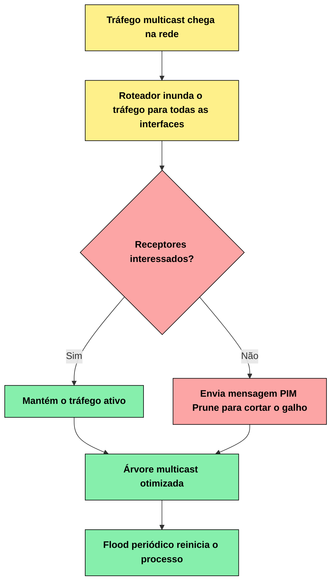
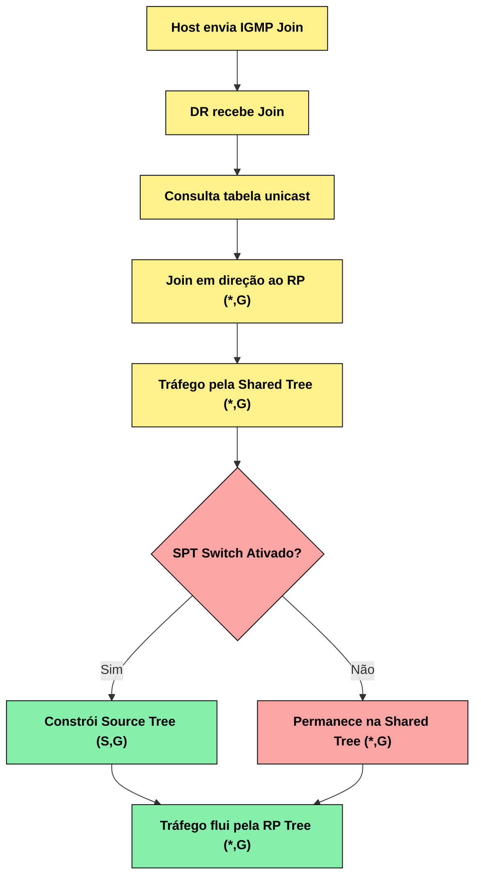

# Índice

- [Índice](#índice)
  - [03 - PIM - Protocol Independent Multicast](#03---pim---protocol-independent-multicast)
  - [Contexto Histórico](#contexto-histórico)
    - [Tipos de Árvores de Distribuição](#tipos-de-árvores-de-distribuição)
  - [Modos de Operação do PIM](#modos-de-operação-do-pim)
    - [1. PIM Dense Mode (PIM-DM) - RFC 3973](#1-pim-dense-mode-pim-dm---rfc-3973)
      - [Fluxograma do Processo](#fluxograma-do-processo)
    - [2. PIM Sparse Mode (PIM-SM) - RFC 4601/7761](#2-pim-sparse-mode-pim-sm---rfc-46017761)
    - [3. PIM Source-Specific Multicast (PIM-SSM) - RFC 4607](#3-pim-source-specific-multicast-pim-ssm---rfc-4607)
    - [4. PIM Bidirectional (PIM-BIDIR) - RFC 5015](#4-pim-bidirectional-pim-bidir---rfc-5015)
    - [5. PIM Any-Source Multicast (PIM-ASM)](#5-pim-any-source-multicast-pim-asm)
    - [Comparação dos Modos](#comparação-dos-modos)

## 03 - PIM - Protocol Independent Multicast  

## Contexto Histórico

O desenvolvimento do multicast IP e seus protocolos de roteamento passou por várias fases importantes:
Primeiros Protocolos (1980s-1990s):

- DVMRP (Distance Vector Multicast Routing Protocol) foi um dos primeiros protocolos de roteamento multicast
- MOSPF (Multicast Extensions to OSPF) tentou integrar multicast ao OSPF
- Esses protocolos tinham limitações significativas em termos de escalabilidade

**Evolução para PIM (1990s):**

- O PIM foi desenvolvido para superar as limitações dos protocolos anteriores
- Primeira especificação do PIM-DM (Dense Mode) e PIM-SM (Sparse Mode)
- O conceito "Protocol Independent" foi revolucionário - permitia que o PIM funcionasse sobre qualquer protocolo de roteamento unicast

**Padronização:**

- RFC 2362 (1998): PIM-SM versão 2 - https://tools.ietf.org/rfc/rfc2362.txt
- RFC 4601 (2006): PIM-SM versão 2 (revisão e atualização) - https://tools.ietf.org/rfc/rfc4601.txt
- RFC 3973 (2005): PIM-DM - https://tools.ietf.org/rfc/rfc3973.txt

**O que é o PIM?**

O IGMP é o protocolo que permite aos hosts participarem de grupos multicast e sinalizarem seu interesse em receber fluxos multicast específicos. Porém, o IGMP opera apenas no escopo da rede local e não tem a capacidade de rotear pacotes multicast da origem até os destinos através de múltiplas redes. É nesse momento que o PIM (Protocol Independent Multicast) entra em ação.  

O PIM é um protocolo de roteamento multicast que:

- **Constrói árvores de distribuição** para entregar tráfego multicast de forma eficiente
- **É independente de protocolo** - pode utilizar informações de qualquer protocolo de roteamento unicast (OSPF, BGP, RIP, etc.)
- **Otimiza o uso da largura de banda** evitando duplicação desnecessária de pacotes
- **Escalável** para redes de grande porte

O protocolo é descrito principalmente na RFC **4601 (PIM-SM)** e possui diferentes modos de operação para atender diferentes cenários de rede.  

**Como o PIM Funciona**  

Como o PIM por si só não transporta o tráfego dos pacotes entre os roteadores multicast, ele precisa consultar a tabela de roteamento unicast para determinar os caminhos de rede. Por isso ele é chamado de Protocol Independent - porque se baseia na tabela de roteamento unicast formada por protocolos como EIGRP, OSPF, RIP, BGP, etc., ou até mesmo rotas estáticas.  

Resumindo, ele consulta a tabela RIB (Routing Information Base).  

Com essas informações de roteamento, o PIM constrói árvores de distribuição multicast para definir os caminhos otimizados entre origem e destinos do tráfego multicast.

### Tipos de Árvores de Distribuição

O PIM utiliza dois tipos principais de árvores para distribuir o tráfego multicast:

**1. Source Tree (Árvore de Origem) - (S,G)**  

Também conhecida como: **Shortest Path Tree (SPT)**  
Notação: **(S,G) onde S = Source (origem) e G = Group (grupo)**  

**Características:**  

- Cada origem (source) tem sua própria árvore
- Utiliza o caminho mais curto da origem para cada receptor
- Oferece a menor latência possível
- Consome mais memória nos roteadores (uma entrada por origem)
- Exemplo: (192.168.1.10, 224.1.1.1)

**2. Shared Tree (Árvore Compartilhada) - (*,G)**  

- Também conhecida como: **Rendezvous Point Tree (RP Tree)**  
- Notação: **(*,G) onde * = qualquer origem e G = Group (grupo)**  

**Características:**

- Todas as origens do mesmo grupo compartilham a mesma árvore
- Utiliza um ponto central chamado Rendezvous Point (RP)
- Consome menos memória (uma entrada por grupo)
- Pode não oferecer o caminho mais curto
- Exemplo: (*, 224.1.1.1)

**3. Source-Specific Multicast (SSM) - (S,G) no modo SSM**  

- Notação: **(S,G) em grupos SSM (232.0.0.0/8)**

**Características:**

- Os receptores especificam tanto a origem quanto o grupo
- Não requer Rendezvous Point (RP)
- Elimina problemas de segurança do multicast tradicional
- Utilizado principalmente em IPTV e streaming

**Principais Características**  

- **Protocol Independent:** Utiliza a tabela de roteamento unicast existente
- **Suporte a diferentes topologias:** Funciona em redes densas e esparsas
- **Eficiência:** Constrói árvores otimizadas para distribuição
- **Flexibilidade:** Múltiplos modos de operação (Sparse Mode, Dense Mode, etc.)

## Modos de Operação do PIM

O PIM possui diferentes modos de operação, cada um otimizado para cenários específicos de rede:  

### 1. PIM Dense Mode (PIM-DM) - RFC 3973

**Filosofia: "Flood and Prune" (Inundar e Podar)**  

**Como funciona:**  

- Assume que receptores estão densamente distribuídos pela rede
- Inicialmente inunda todo o tráfego multicast por todas as interfaces
- Utiliza mensagens Prune para remover galhos desnecessários
- Reconstrói periodicamente a árvore através de flood novamente

**Características:**

- Simples de configurar e entender
- Eficiente quando há muitos receptores
- Desperdiça largura de banda inicialmente
- Não escalável para redes grandes
- Ideal para LANs com alta densidade de receptores

**Quando usar**: Redes pequenas com muitos receptores próximos  

#### Fluxograma do Processo

### 2. PIM Sparse Mode (PIM-SM) - RFC 4601/7761

**Filosofia: "Pull Model" (Modelo de Solicitação)**  

**Como funciona:**

- Assume que receptores estão esparsamente distribuídos
- Utiliza Rendezvous Point (RP) como ponto central
- Constrói árvores sob demanda apenas quando há receptores
- Pode migrar de Shared Tree (*,G) para Source Tree (S,G)

**Componentes principais:**  

- **Rendezvous Point (RP):** Ponto de encontro central
- **Bootstrap Router (BSR):** Elege e anuncia RPs
- **Designated Router (DR):** Roteador designado por segmento

**Características:**

- Muito escalável
- Conserva largura de banda
- Mais complexo de configurar
- Requer planejamento de RPs
- Padrão para redes empresariais e ISPs

**Quando usar:** Redes grandes com receptores distribuídos

### 3. PIM Source-Specific Multicast (PIM-SSM) - RFC 4607

**Filosofia: "Source-Specific" (Específico por Origem)**  

**Como funciona:**  

- Receptores especificam origem E grupo (S,G)
- Não requer Rendezvous Point (RP)
- Sempre utiliza Source Trees (S,G)
- Integra-se com IGMPv3/MLDv2

**Características:**

- Elimina problemas de segurança do multicast tradicional
- Mais simples que PIM-SM (sem RP)
- Ideal para aplicações one-to-many
- Utiliza faixa de endereços 232.0.0.0/8

**Quando usar:** IPTV, streaming, aplicações com origem conhecida

### 4. PIM Bidirectional (PIM-BIDIR) - RFC 5015  

**Filosofia: "Bidirectional Shared Tree" (Árvore Compartilhada Bidirecional)**  

**Como funciona:**

- Utiliza apenas Shared Trees (*,G)
- Tráfego flui em ambas as direções na árvore
- Múltiplas origens podem usar a mesma árvore
- Reduz drasticamente o estado nos roteadores

**Características:**

- Extremamente escalável para muitas origens
- Reduz estado de roteamento
- Pode criar loops se mal configurado
- Ideal para aplicações many-to-many

**Quando usar:** Aplicações colaborativas, jogos online, muitas origens

### 5. PIM Any-Source Multicast (PIM-ASM)  

**Descrição:** Termo genérico para PIM-SM tradicional onde qualquer origem pode enviar para um grupo sem que os receptores especifiquem a origem previamente.

### Comparação dos Modos

| Modo      | Escalabilidade | Complexidade | Uso de Banda | Cenário Ideal      |
|-----------|----------------|--------------|--------------|--------------------|
| PIM-DM    | Baixa          | Baixa        | Alto inicial | LANs densas        |
| PIM-SM    | Alta           | Alta         | Otimizado    | Redes corporativas |
| PIM-SSM   | Alta           | Média        | Otimizado    | IPTV/Streaming     |
| PIM-BIDIR | Muito Alta     | Alta         | Otimizado    | Many-to-many       |

**Principais Características**  

- **Protocol Independent:** Utiliza a tabela de roteamento unicast existente
- **Suporte a diferentes topologias:** Funciona em redes densas e esparsas
- **Eficiência:** Constrói árvores otimizadas para distribuição
- **Flexibilidade:** Múltiplos modos de operação (Sparse Mode, Dense Mode, etc.)