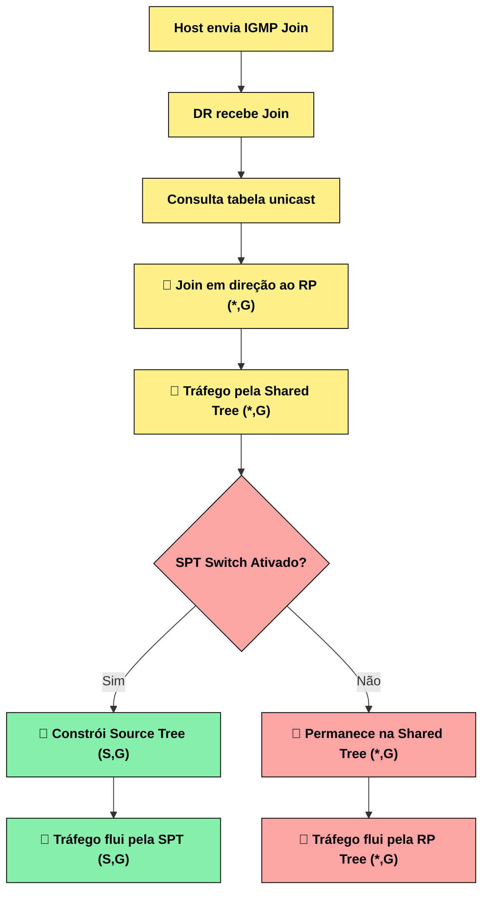

## PIM - Protocol Independent Multicast

## Contexto Histórico

O desenvolvimento do multicast IP e seus protocolos de roteamento passou por várias fases importantes:

**Primeiros Protocolos (1980s-1990s):**
- DVMRP (Distance Vector Multicast Routing Protocol) foi um dos primeiros protocolos de roteamento multicast
- MOSPF (Multicast Extensions to OSPF) tentou integrar multicast ao OSPF
- Esses protocolos tinham limitações significativas em termos de escalabilidade

**Evolução para PIM (1990s):**
- O PIM foi desenvolvido para superar as limitações dos protocolos anteriores
- Primeira especificação do PIM-DM (Dense Mode) e PIM-SM (Sparse Mode)
- O conceito "Protocol Independent" foi revolucionário - permitia que o PIM funcionasse sobre qualquer protocolo de roteamento unicast

**Padronização:**
- RFC 2362 (1998): PIM-SM versão 2 - https://tools.ietf.org/rfc/rfc2362.txt
- RFC 4601 (2006): PIM-SM versão 2 (revisão e atualização) - https://tools.ietf.org/rfc/rfc4601.txt
- RFC 3973 (2005): PIM-DM - https://tools.ietf.org/rfc/rfc3973.txt

## O que é o PIM?

O IGMP é o protocolo que permite aos hosts participarem de **grupos multicast** e sinalizarem seu interesse em receber fluxos **multicast** específicos. Porém, o IGMP opera apenas no escopo da rede local e não tem a capacidade de rotear pacotes multicast da origem até os destinos através de múltiplas redes. É nesse momento que o PIM (Protocol Independent Multicast) entra em ação.

```
❌ Sem PIM:
📺 Origem ──❓── [Router] ──❓── [Router] ──❓── 💻 Receptor
   "Como o tráfego multicast atravessa a rede?"

✅ Com PIM:
📺 Origem ──🌲── [Router] ──🌲── [Router] ──🌲── 💻 Receptor
   "PIM constrói árvores de distribuição inteligentes"
```

O PIM é um protocolo de roteamento multicast que:

- **Constrói árvores de distribuição** para entregar tráfego multicast de forma eficiente
- É **independente de protocolo** - pode utilizar informações de qualquer protocolo de roteamento unicast (OSPF, BGP, RIP, etc.)
- **Otimiza o uso da largura de banda** evitando duplicação desnecessária de pacotes
- **Escalável** para redes de grande porte

## Como o PIM Funciona

Como o PIM por si só não transporta o tráfego dos pacotes entre os roteadores multicast, ele precisa consultar a tabela de roteamento unicast para determinar os caminhos de rede. Por isso ele é chamado de **Protocol Independent** - porque se baseia na tabela de roteamento unicast formada por protocolos como EIGRP, OSPF, RIP, BGP, etc., ou até mesmo rotas estáticas. Resumindo, ele consulta a tabela **RIB** (Routing Information Base).

```
PIM consulta RIB:
┌─────────────────┐    ┌──────────────────┐    ┌─────────────────┐
│ Protocolo OSPF  │───▶│ Tabela RIB       │◀───│ PIM usa essa    │
│ BGP, EIGRP, etc │    │ (unicast routes) │    │ info para árvore│
└─────────────────┘    └──────────────────┘    └─────────────────┘
```

Com essas informações de roteamento, o PIM constrói árvores de distribuição multicast para definir os caminhos otimizados entre origem e destinos do tráfego multicast.

## Tipos de Árvores de Distribuição

### Conceito Visual das Árvores

```
🌳 Shared Tree (*,G) - "Árvore Compartilhada"
    
    📺 Source A        📺 Source B
         \                /
          \              /
           ▼            ▼
            [RP Router]           ← Ponto Central
           /     |     \
          ▼      ▼      ▼
      [LHR1]  [LHR2]  [LHR3]
        |      |       |
       💻     💻      💻

🌲 Source Tree (S,G) - "Árvore por Origem"

    📺 Source A específica
         |
         ▼
      [Router] ──┬──▶ [LHR1] ──▶ 💻
                 │
                 └──▶ [LHR2] ──▶ 💻
```

### 1. Source Tree (Árvore de Origem) - (S,G)
- **Também conhecida como**: Shortest Path Tree (SPT)
- **Notação**: (S,G) onde S = Source (origem) e G = Group (grupo)
- **Representação**: 🌲
- **Características**:
  - Cada origem (source) tem sua própria árvore
  - Utiliza o caminho mais curto da origem para cada receptor
  - Oferece a menor latência possível
  - Consome mais memória nos roteadores (uma entrada por origem)
  - Exemplo: (192.168.1.10, 224.1.1.1)

### 2. Shared Tree (Árvore Compartilhada) - (*,G)
- **Também conhecida como**: Rendezvous Point Tree (RP Tree)
- **Notação**: (*,G) onde * = qualquer origem e G = Group (grupo)
- **Representação**: 🌳
- **Características**:
  - Todas as origens do mesmo grupo compartilham a mesma árvore
  - Utiliza um ponto central chamado **Rendezvous Point (RP)**
  - Consome menos memória (uma entrada por grupo)
  - Pode não oferecer o caminho mais curto
  - Exemplo: (*, 224.1.1.1)

### 3. Source-Specific Multicast (SSM) - (S,G) no modo SSM
- **Notação**: (S,G) em grupos SSM (232.0.0.0/8)
- **Características**:
  - Os receptores especificam tanto a origem quanto o grupo
  - Não requer Rendezvous Point (RP)
  - Elimina problemas de segurança do multicast tradicional
  - Utilizado principalmente em IPTV e streaming

## Componentes do PIM - Abordagem Progressiva

### Nível 1: Os 3 Personagens Principais

```
📺 Multicast Source    🎯 Rendezvous Point    💻 Multicast Receiver
    (Origem)              (Ponto Central)           (Receptor)
        |                       |                       |
        |                       |                       |
    [FHR Router] ─────────── [RP Router] ─────────── [LHR Router]
    "Primeiro"              "Central"               "Último"
    
🔄 Fluxo básico:
1. 💻 → IGMP Join → [LHR]
2. [LHR] → PIM Join → [RP] 
3. [FHR] → Register → [RP]
4. 📺 → [FHR] → [RP] → [LHR] → 💻
```

### Nível 2: Componentes Detalhados

#### 1. 📺 Multicast Source (Origem Multicast)
**Função**: Dispositivo que gera e transmite o tráfego multicast

```
Representação:
📺 Server IPTV (192.168.1.10)
   │ 
   │ Gera tráfego para: 239.255.1.1
   │
   ▼
[FHR] ← Primeiro roteador que recebe
```

**Responsabilidades**:
- **Geração de conteúdo**: Produz o tráfego multicast (ex: 239.255.1.1)
- **Transmissão inicial**: Envia dados para o First-Hop Router
- **Identificação**: Cada origem é identificada pelo seu endereço IP
- **Aplicações típicas**: Servidores de IPTV, streaming, videoconferência

#### 2. 🎯 Rendezvous Point (RP)
**Função**: Ponto de encontro central para grupos multicast (apenas em PIM-SM)

```
Representação - RP como "Hub Central":

    📺 Source1 ──┐
                 │
    📺 Source2 ──┤──▶ [RP] ──┬──▶ [LHR1] ──▶ 💻
                 │           │
    📺 Source3 ──┘           └──▶ [LHR2] ──▶ 💻
    
    "Todas as origens se registram no RP"
    "Todos os receptores se conectam ao RP"
```

**Responsabilidades**:
- **Descoberta de origens**: Recebe PIM Register das origens via FHR
- **Ponto de encontro**: Local onde receptores se conectam inicialmente (*,G)
- **Construção de RPT**: Forma a Rendezvous Point Tree (Shared Tree)
- **Transição para SPT**: Facilita mudança para Source Tree quando necessário
- **Balanceamento**: Pode haver múltiplos RPs para diferentes grupos

#### 3. 🔌 First Hop Router (FHR)
**Função**: Primeiro roteador no caminho das origens multicast

```
Representação:
📺 Source ──▶ [FHR] ──Register──▶ [RP]
              │
              ├─ "Registra nova origem"
              ├─ "Encapsula tráfego inicial"  
              └─ "Primeira replicação"
```

**Responsabilidades**:
- **Register Process**: Encapsula tráfego da origem e envia para RP via PIM Register
- **Descoberta de RP**: Localiza o RP apropriado para o grupo
- **Encaminhamento inicial**: Primeira replicação do tráfego multicast
- **Interface com origem**: Recebe tráfego diretamente da fonte multicast

#### 4. 📡 Last Hop Router (LHR)
**Função**: Último roteador no caminho até os receptores

```
Representação:
[RP] ──▶ [LHR] ──▶ SW ──▶ 💻 Receptor
         │                │
         │                └─ IGMP Join
         └─ PIM Join ──────▲
         
"Converte IGMP em PIM"
"Decide SPT Switchover"
```

**Responsabilidades**:
- **Interface com receptores**: Conecta diretamente aos hosts interessados
- **Processamento IGMP**: Recebe IGMP Join dos hosts locais
- **Conversão IGMP→PIM**: Converte IGMP Join em PIM Join upstream
- **SPT Switchover**: Decide quando migrar de (*,G) para (S,G)
- **Otimização de caminho**: Procura pelo caminho mais curto até a origem

#### 5. ⚡ SPT Router
**Função**: Roteadores que participam da Shortest Path Tree

```
Representação - SPT Switchover:

ANTES (via RP):
📺 ──▶ [FHR] ──▶ [RP] ──▶ [LHR] ──▶ 💻
       "Caminho mais longo via RP"

DEPOIS (SPT):  
📺 ──▶ [FHR] ──▶ [SPT Router] ──▶ [LHR] ──▶ 💻
       "Caminho otimizado direto"
```

**Responsabilidades**:
- **Caminho otimizado**: Participa do caminho direto origem→receptor
- **Bypassing RP**: Permite tráfego direto sem passar pelo RP
- **Lower latency**: Oferece menor latência que RPT
- **Encaminhamento (S,G)**: Mantém estado específico por origem

#### 6. 🗳️ Designated Router (DR)
**Função**: Roteador designado responsável por um segmento de rede

```
Representação - Eleição DR:

Segmento LAN:
    [R1] ──┐
           │── LAN Segment
    [R2] ──┘     │
    ↑            │
    DR          💻 Host
    
"Apenas DR processa IGMP do segmento"
"Evita duplicação de Join/Register"
```

**Responsabilidades**:
- **Eleição automática**: Roteador com maior prioridade DR ou maior IP
- **Interface com hosts**: Processa mensagens IGMP dos hosts locais
- **Prevenção de duplicação**: Evita múltiplos roteadores enviando o mesmo tráfego

### Nível 3: Componentes de Infraestrutura

#### 7. 🔄 Bootstrap Router (BSR)
**Função**: Eleição e anúncio automático de RPs

```
Representação - Descoberta de RP:

[BSR] ──flood──▶ Todos os roteadores PIM
  │
  ├─ "RP para 224.x.x.x = 10.1.1.1"
  ├─ "RP para 239.x.x.x = 10.2.2.2"  
  └─ "RP para 232.x.x.x = N/A (SSM)"
```

#### 8. 🔌 Switches com IGMP Snooping
**Função**: Otimização Layer 2 para multicast

```
Representação - IGMP Snooping:

SEM Snooping:
[LHR] ──▶ [SW] ──┬──▶ 💻 Interessado
                 ├──▶ 💻 NÃO interessado ❌
                 └──▶ 💻 NÃO interessado ❌

COM Snooping:
[LHR] ──▶ [SW] ──┬──▶ 💻 Interessado ✅
                 ├──✗ 💻 (bloqueado)
                 └──✗ 💻 (bloqueado)
```

#### 9. 🔄 Interfaces e Direcionamento

```
Representação - RPF Check:

Tráfego chegando pela interface correta:
📺 Source ──▶ [Router] ──IIF(✅)──▶ OIF ──▶ 💻
              "RPF OK"

Tráfego chegando pela interface errada:  
📺 Source ──▶ [Router] ──IIF(❌)──✗ Descartado
              "RPF Fail"
```

**IIF (Incoming Interface)**:
- **RPF Check**: Interface pela qual tráfego deve chegar
- **Validação**: Previne loops verificando origem do tráfego
- **Upstream**: Interface em direção à origem ou RP

**OIF (Outgoing Interface)**:
- **Replicação**: Interfaces de saída para próximos roteadores
- **Downstream**: Interfaces em direção aos receptores
- **Lista OIL**: Outgoing Interface List mantida por grupo

### Nível 4: Topologia Completa Simplificada

```
Topologia PIM Completa:

                    📺 Multicast Source
                    192.168.1.10/239.255.1.1
                           │
                       [R1-FHR] ──Register──┐
                           │                │
                       [R2-DR]              ▼
                           │            [R3-RP] 🎯
                       Shared Tree          │
                           │                │
    ┌──────────────────────┴────────────────┼──────────────┐
    │                                       │              │
 [R5-LHR]     [R6-LHR]            [R4-SPT] │         [R8-LHR]
    │           │                     │    │              │
   SW1         SW2              Source Tree │             💻
    │           │                     │    │
   💻          💻                    [R7-LHR]
                                       │
                                      SW3
                                       │
                                      💻

Legenda:
🎯 RP = Rendezvous Point
🌳 Shared Tree (via RP) 
🌲 Source Tree (direto)
```

## Mensagens e Estados PIM

### Principais Mensagens

```
Fluxo de Mensagens PIM:

1. Hello: [R1] ↔ [R2] "Descoberta de vizinhos"

2. Register: [FHR] ──▶ [RP] "Nova origem ativa"

3. Join: [LHR] ──▶ [RP] "Quero receber tráfego"

4. Prune: [LHR] ──▶ [RP] "Não quero mais tráfego"

5. Assert: [R1] ↔ [R2] "Quem encaminha neste link?"
```

**Mensagens de Controle**:
- **Hello**: Descoberta de vizinhos e eleição DR
- **Join/Prune**: Construção e poda de árvores
- **Register**: FHR anuncia nova origem ao RP
- **Register-Stop**: RP informa que não precisa mais de Registers
- **Assert**: Resolução de forwarding duplicado
- **Bootstrap**: Distribuição de informações RP (BSR)

**Estados das Interfaces**:
- **Join**: Interface faz parte da árvore de distribuição
- **Prune**: Interface removida da árvore
- **Forward**: Interface encaminha tráfego multicast
- **Block**: Interface bloqueia tráfego multicast

## Modos de Operação do PIM

### Comparação Visual dos Modos

```
PIM Dense Mode - "Flood and Prune"
📺 ──flood──▶ ALL ──prune──▶ NEEDED
    "Inunda primeiro, depois poda"

PIM Sparse Mode - "Pull Model"  
📺 ──join──▶ RP ──join──▶ RECEIVERS
    "Constrói sob demanda"

PIM-SSM - "Source Specific"
📺 ──direct──▶ RECEIVERS (know source)
    "Receptores conhecem a origem"
```

### 1. PIM Dense Mode (PIM-DM) - RFC 3973
**Filosofia**: "Flood and Prune" (Inundar e Podar)

**Representação do Processo**:
```
Fase 1 - Flood:
📺 ──▶ [R1] ──flood──┬──▶ [R2] ──▶ 💻 ✅
                     └──▶ [R3] ──▶ ∅ ❌

Fase 2 - Prune:  
📺 ──▶ [R1] ──────────┬──▶ [R2] ──▶ 💻 ✅
                      └──prune── [R3] ✗
```

### 2. PIM Sparse Mode (PIM-SM) - RFC 4601/7761
**Filosofia**: "Pull Model" (Modelo de Solicitação)

**Tipos de árvores utilizadas**:
- 🌳 **Shared Tree (*,G)**: Árvore inicial compartilhada via RP
- 🌲 **Source Tree (S,G)**: Árvore otimizada após SPT switchover

#### Fluxograma do Processo - PIM Sparse Mode (PIM-SM)


### 3. PIM Source-Specific Multicast (PIM-SSM) - RFC 4607
**Filosofia**: "Source-Specific" (Específico por Origem)

```
Representação SSM:
📺 192.168.1.10/232.1.1.1 ──direct──▶ 💻
   "Receptor sabe exatamente qual origem quer"
   
vs PIM-SM:
📺 Any Source/239.1.1.1 ──via RP──▶ 💻  
   "Receptor aceita qualquer origem do grupo"
```

### 4. PIM Bidirectional (PIM-BIDIR) - RFC 5015
**Filosofia**: "Bidirectional Shared Tree"

```
Representação BIDIR:
📺 Source1 ──┐
             │
📺 Source2 ──┤──▶ [RP] ◀──┬── 📺 Source3
             │             │
📺 Source4 ──┘             └── 📺 Source5

"Múltiplas origens, uma árvore, tráfego bidirecional"
```

### 5. PIM Sparse Dense Mode (PIM-SDM)
**Filosofia**: "Hybrid Mode"

```
Configuração por Grupo:
224.1.1.x ──▶ Dense Mode (flood & prune)
239.1.1.x ──▶ Sparse Mode (via RP)  
232.1.1.x ──▶ SSM Mode (direct)

"Flexibilidade máxima por faixa de endereços"
```

## Comparação dos Modos

| Modo | Escalabilidade | Complexidade | Uso de Banda | Cenário Ideal |
|------|----------------|--------------|--------------|---------------|
| PIM-DM | Baixa | Baixa | Alto inicial | LANs densas |
| PIM-SM | Alta | Alta | Otimizado | Redes corporativas |
| PIM-SSM | Alta | Média | Otimizado | IPTV/Streaming |
| PIM-BIDIR | Muito Alta | Alta | Otimizado | Many-to-many |
| PIM-SDM | Variável | Muito Alta | Variável | Redes híbridas |

## Terminologias Importantes

### PIM Any-Source Multicast (PIM-ASM)
- **Não é um modo específico**, mas sim um **termo conceitual**
- Refere-se ao **PIM-SM tradicional** onde qualquer origem pode enviar para um grupo
- Os receptores **não especificam a origem** previamente (ao contrário do SSM)
- Utiliza Rendezvous Point (RP) para descoberta de origens
- Oposto conceitual ao **Source-Specific Multicast (SSM)**

## Principais Características

- **Protocol Independent**: Utiliza a tabela de roteamento unicast existente
- **Suporte a diferentes topologias**: Funciona em redes densas e esparsas
- **Eficiência**: Constrói árvores otimizadas para distribuição
- **Flexibilidade**: Múltiplos modos de operação (Sparse Mode, Dense Mode, etc.)