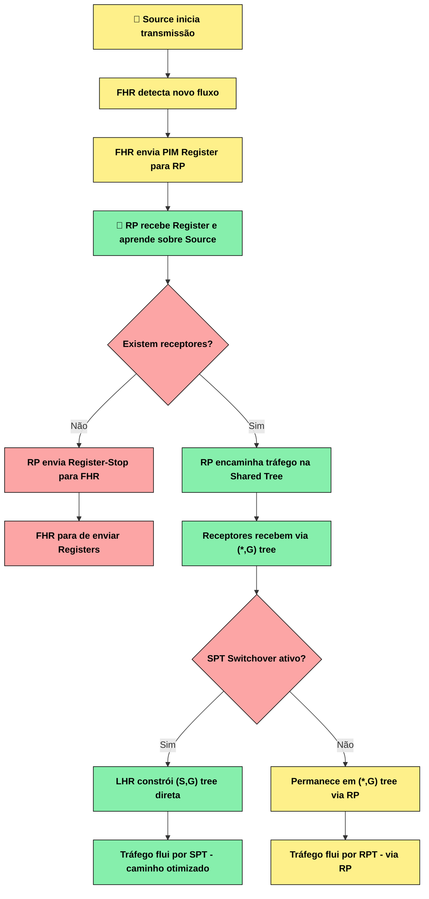
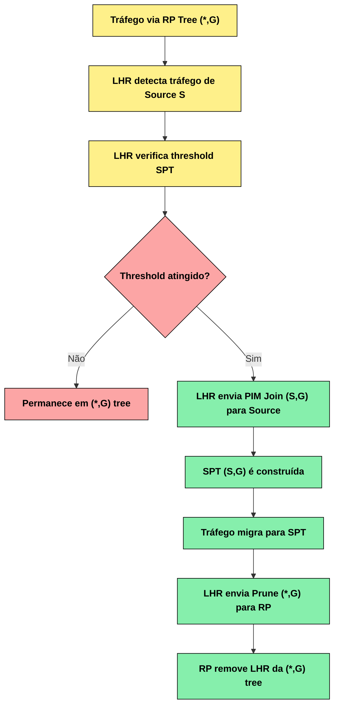

# Índice

- [Índice](#índice)
  - [04 - PIM - Rendezvous Points (RPs)](#04---pim---rendezvous-points-rps)
  - [O que é um Rendezvous Point (RP)?](#o-que-é-um-rendezvous-point-rp)
    - [Representação Visual do RP](#representação-visual-do-rp)
    - [Funcionamento do RP](#funcionamento-do-rp)
    - [Por que precisamos de um RP?](#por-que-precisamos-de-um-rp)
  - [Tipos de Configuração de RP](#tipos-de-configuração-de-rp)
    - [1. Static RP (RP Estático)](#1-static-rp-rp-estático)
    - [2. Auto-RP (Cisco Proprietário)](#2-auto-rp-cisco-proprietário)
    - [3. Bootstrap Router (BSR) - RFC 5059](#3-bootstrap-router-bsr---rfc-5059)
    - [4. Anycast RP - RFC 4610](#4-anycast-rp---rfc-4610)
    - [5. Embedded RP (IPv6)](#5-embedded-rp-ipv6)
  - [Processo de Funcionamento do RP](#processo-de-funcionamento-do-rp)
    - [Fluxograma - Processo Completo do RP](#fluxograma---processo-completo-do-rp)
  - [Configuração de RPs](#configuração-de-rps)
    - [Static RP - Configuração Manual](#static-rp---configuração-manual)
    - [Auto-RP - Configuração Cisco](#auto-rp---configuração-cisco)
    - [BSR - Configuração Padrão RFC](#bsr---configuração-padrão-rfc)
    - [Anycast RP - Alta Disponibilidade](#anycast-rp---alta-disponibilidade)
  - [Seleção e Descoberta de RPs](#seleção-e-descoberta-de-rps)
    - [Processo de Seleção do RP](#processo-de-seleção-do-rp)
    - [Hash Function para Seleção de RP](#hash-function-para-seleção-de-rp)
  - [RP Tree vs Source Tree](#rp-tree-vs-source-tree)
    - [Comparação Visual](#comparação-visual)
    - [SPT Switchover - Migração para Source Tree](#spt-switchover---migração-para-source-tree)
  - [Troubleshooting de RPs](#troubleshooting-de-rps)
    - [Comandos de Verificação](#comandos-de-verificação)
    - [Problemas Comuns](#problemas-comuns)
  - [Otimização e Melhores Práticas](#otimização-e-melhores-práticas)
    - [Placement Strategy (Estratégia de Posicionamento)](#placement-strategy-estratégia-de-posicionamento)
    - [Redundância e Failover](#redundância-e-failover)

## 04 - PIM - Rendezvous Points (RPs)

## O que é um Rendezvous Point (RP)?

O **Rendezvous Point (RP)** é o componente central do PIM Sparse Mode, funcionando como um "ponto de encontro" onde origens multicast se registram e receptores se conectam para descobrir e receber fluxos multicast.

### Representação Visual do RP

```text
Conceito do RP - "Ponto de Encontro Central":

🔺 Source A ──Register──┐
                         │
🔺 Source B ──Register──┤──▶ 🎯 RP ──┬──▶ [LHR1] ──▶ 💻 Receiver 1
                         │             │
🔺 Source C ──Register──┘              ├──▶ [LHR2] ──▶ 💻 Receiver 2
                                       └──▶ [LHR3] ──▶ 💻 Receiver 3

"RP = Ponto onde origens se ANUNCIAM e receptores se CONECTAM"
```

### Funcionamento do RP

**Função Principal:**

- **Descoberta de Origens:** Permite que receptores encontrem origens ativas  
- **Ponto de Convergência:** Local central para construção da árvore multicast
- **Redução de Estado:** Menos entradas de roteamento nos roteadores
- **Escalabilidade:** Suporta múltiplas origens e receptores por grupo

**Processo em 3 Etapas:**

```text
1. REGISTRO DAS ORIGENS:
   🔺 Source → [FHR] ──PIM Register──▶ 🎯 RP
   "Origens se anunciam para o RP"

2. SOLICITAÇÃO DOS RECEPTORES:
   💻 Receiver → [LHR] ──PIM Join (*,G)──▶ 🎯 RP
   "Receptores solicitam grupos ao RP"

3. DISTRIBUIÇÃO DO TRÁFEGO:
   🔺 Source → 🎯 RP → [LHR] → 💻 Receiver
   "RP coordena a entrega via Shared Tree"
```

### Por que precisamos de um RP?

**Problema sem RP:**

```text
❌ Sem RP - Como receptor encontra origem?

🔺 Source (192.168.1.10) transmitindo para 239.1.1.1
💻 Receiver quer receber 239.1.1.1

Pergunta: "Onde está a origem 192.168.1.10?"
Resposta: "Não sabemos! 🤷‍♂️"
```

**Solução com RP:**

```text
✅ Com RP - Ponto central de descoberta

🔺 Source se registra: "Estou transmitindo 239.1.1.1"
💻 Receiver solicita: "Quero receber 239.1.1.1"
🎯 RP conecta: "Source está ativa, aqui está o tráfego!"
```

## Tipos de Configuração de RP

Existem diferentes métodos para configurar e descobrir RPs em uma rede PIM:

### 1. Static RP (RP Estático)

**Características:**  

- Configuração manual em todos os roteadores
- Simples de implementar em redes pequenas
- Não possui redundância automática
- Adequado para ambientes controlados

**Representação:**  

```text
Configuração Static RP:

[R1] ──┐
[R2] ──┤ ip pim rp-address 10.1.1.1 (configuração manual)
[R3] ──┤ ip pim rp-address 10.1.1.1 (em todos os roteadores)
[R4] ──┘

🎯 RP = 10.1.1.1 (definido estaticamente)
```

### 2. Auto-RP (Cisco Proprietário)

**Características:**  

- Protocolo proprietário da Cisco
- Discovery automática de RPs candidatos
- Utiliza grupos especiais 224.0.1.39 e 224.0.1.40
- Funciona apenas em equipamentos Cisco

**Processo Auto-RP:**

```text
Auto-RP Process:

1. RP Candidate anuncia:
   [RP Candidate] ──▶ 224.0.1.39 (RP-ANNOUNCE)
   "Sou candidato a RP para grupos X"

2. Mapping Agent coleta e distribui:
   [Mapping Agent] ──▶ 224.0.1.40 (RP-DISCOVERY)
   "RP para grupos X é 10.1.1.1"

3. Todos os roteadores aprendem:
   [All Routers] ◀── 224.0.1.40
   "OK, RP para X é 10.1.1.1"
```

### 3. Bootstrap Router (BSR) - RFC 5059

**Características:**  

- Padrão RFC (interoperável entre vendors)
- Eleição automática de Bootstrap Router
- Distribuição de informações de RP por flooding
- Suporte nativo à redundância

**Processo BSR:**

```text
BSR Process:

1. Eleição do BSR:
   [Candidates] ──Bootstrap Messages──▶ [BSR Eleito]
   "Maior prioridade/IP vence"

2. RP Candidates anunciam:
   [RP Candidates] ──▶ [BSR] ──▶ RP-Set Message
   "Coleta candidatos e distribui mapeamento"

3. Flooding para toda rede:
   [BSR] ──flood──▶ [All PIM Routers]
   "Todos aprendem mapeamento RP↔Grupos"
```

### 4. Anycast RP - RFC 4610

**Características:**  

- Alta disponibilidade e load balancing
- Múltiplos RPs com mesmo endereço IP
- Sincronização via MSDP (Multicast Source Discovery Protocol)
- Ideal para redes grandes e críticas

**Representação Anycast RP:**

```text
Anycast RP - Redundância:

🎯 RP1 (10.1.1.100) ──MSDP──┐
                             ├── Sincronização
🎯 RP2 (10.1.1.100) ──MSDP──┤    de estado
                             │
🎯 RP3 (10.1.1.100) ──MSDP──┘

"Mesmo IP, múltiplos roteadores físicos"  
"Roteamento unicast determina RP mais próximo"
```

### 5. Embedded RP (IPv6)

**Características:**  

- Específico para IPv6
- Endereço do RP embutido no endereço do grupo
- Não requer configuração adicional
- Auto descoberta baseada no próprio endereço

```text
Embedded RP (IPv6):

Grupo: FF7X:0240:RPIP::/96
       │    │    │
       │    │    └─ IP do RP embutido
       │    └─ Embedded RP flag
       └─ Escopo multicast

Exemplo: FF75:0240:2001:DB8::1::/96
         RP = 2001:DB8::1
```

## Processo de Funcionamento do RP

### Fluxograma - Processo Completo do RP



**Detalhamento do Processo:**

**Fase 1 - Register Process:**  

```text
1. Source transmite → FHR detecta novo fluxo
2. FHR encapsula pacotes → PIM Register → RP
3. RP aprende sobre nova source (S,G)
4. RP verifica se há receptores para G
```

**Fase 2 - Join Process:**  

```text
5. Receptor envia IGMP Join → LHR
6. LHR envia PIM Join (*,G) → upstream direction → RP
7. Shared Tree (*,G) é construída
8. RP conecta source à árvore de distribuição
```

**Fase 3 - Traffic Flow:**  

```text
9. Tráfego flui: Source → FHR → RP → LHR → Receiver
10. RP pode enviar Register-Stop se tráfego flui diretamente
11. Possível migração para SPT (S,G) para otimizar caminho
```

## Configuração de RPs

### Static RP - Configuração Manual

**Cisco IOS:**

```cisco
! Configurar RP estático para todos os grupos
Router(config)# ip pim rp-address 10.1.1.1

! Configurar RP para grupos específicos
Router(config)# access-list 10 permit 239.1.0.0 0.0.255.255
Router(config)# ip pim rp-address 10.1.1.1 10

! Verificar RP
Router# show ip pim rp mapping
```

**Vantagens:**  

- Simples e direto
- Controle total sobre seleção
- Previsível e determinístico

**Desvantagens:**  

- Configuração manual em todos os roteadores
- Sem redundância automática
- Difícil manutenção em redes grandes

### Auto-RP - Configuração Cisco

**RP Candidate:**

```cisco
! Configurar como candidato a RP
Router(config)# ip pim send-rp-announce loopback0 scope 16 group-list 10
Router(config)# access-list 10 permit 239.1.0.0 0.0.255.255

! Configurar interface para anúncios
Router(config)# interface loopback0
Router(config-if)# ip pim sparse-mode
```

**Mapping Agent:**

```cisco
! Configurar Mapping Agent
Router(config)# ip pim send-rp-discovery loopback0 scope 16

! Habilitar Auto-RP listener em interfaces
Router(config)# ip pim autorp listener
```

**Características Auto-RP:**  

- Usa grupos 224.0.1.39 (RP-ANNOUNCE) e 224.0.1.40 (RP-DISCOVERY)
- Scope controla TTL dos anúncios
- Mapping Agent pode ser diferente do RP

### BSR - Configuração Padrão RFC

**Bootstrap Router:**

```cisco
! Configurar BSR candidato
Router(config)# ip pim bsr-candidate loopback0 30 10

! BSR hash mask (para load balancing)
Router(config)# ip pim bsr-candidate loopback0 hash-mask-len 30 priority 10
```

**RP Candidate:**

```cisco
! Configurar RP candidato
Router(config)# access-list 10 permit 239.1.0.0 0.0.255.255
Router(config)# ip pim rp-candidate loopback0 group-list 10 priority 50

! Verificar BSR
Router# show ip pim bsr-router
Router# show ip pim rp mapping
```

**Vantagens BSR:**  

- Padrão RFC (interoperável)
- Eleição automática de BSR
- Suporte nativo à redundância
- Hash function para load balancing

### Anycast RP - Alta Disponibilidade

**Configuração Anycast RP:**

```cisco
! Configuração no RP1
Router1(config)# ip pim rp-address 10.1.1.100
Router1(config)# ip msdp peer 10.2.2.2 connect-source loopback0

! Configuração no RP2  
Router2(config)# ip pim rp-address 10.1.1.100
Router2(config)# ip msdp peer 10.1.1.1 connect-source loopback0

! Loopback com mesmo IP (Anycast)
Router1(config)# interface loopback1
Router1(config-if)# ip address 10.1.1.100 255.255.255.255

Router2(config)# interface loopback1  
Router2(config-if)# ip address 10.1.1.100 255.255.255.255
```

**MSDP (Multicast Source Discovery Protocol):**  

- Sincroniza informações de sources entre RPs
- Permite redundância transparente
- Suporta load balancing automático

## Seleção e Descoberta de RPs

### Processo de Seleção do RP

**Prioridade de Seleção:**

```text
1. Static RP (configuração manual)
   ↓ Maior prioridade - sempre usado se configurado

2. Auto-RP discovery  
   ↓ Segundo em prioridade

3. BSR discovery
   ↓ Menor prioridade - usado se outros não disponíveis

4. Embedded RP (IPv6 only)
   ↓ Extraído do próprio endereço do grupo
```

**Critérios de Desempate:**

```text
Para múltiplos RPs candidatos:

1. Maior Priority value (Auto-RP/BSR)
2. Hash function result (BSR)
3. Maior endereço IP (tiebreaker)
```

### Hash Function para Seleção de RP

**BSR Hash Algorithm:**

```text
Hash = (G & hash_mask) XOR (C & hash_mask)

Onde:
G = Endereço do grupo multicast
C = Endereço do RP candidato  
hash_mask = Máscara configurada no BSR

Candidato com maior hash value vence
```

**Exemplo Prático:**

```text
Grupo: 239.1.1.1
Hash Mask: /30 (255.255.255.252)
RP1: 10.1.1.1, Priority: 100
RP2: 10.1.1.2, Priority: 100

Hash1 = (239.1.1.1 & mask) XOR (10.1.1.1 & mask)
Hash2 = (239.1.1.1 & mask) XOR (10.1.1.2 & mask)

Maior hash vence para este grupo específico
```

## RP Tree vs Source Tree

### Comparação Visual

**RP Tree (*,G) - Shared Tree:**

```text
🌳 SHARED TREE via RP:

🔺 Source A ──┐
              ├──▶ 🎯 RP ──┬──▶ [LHR1] ──▶ 💻 Receiver 1  
🔺 Source B ──┘           └──▶ [LHR2] ──▶ 💻 Receiver 2

Características:
✅ Menos estado nos roteadores (uma entrada (*,G))
✅ Suporta múltiplas sources facilmente
❌ Caminho pode ser subótimo
❌ RP pode ser gargalo
```

**Source Tree (S,G) - SPT:**

```text
🌲 SOURCE TREE direto:

🔺 Source A ──direto──┬──▶ [LHR1] ──▶ 💻 Receiver 1
                      └──▶ [LHR2] ──▶ 💻 Receiver 2

🔺 Source B ──direto──┬──▶ [LHR1] ──▶ 💻 Receiver 1  
                      └──▶ [LHR2] ──▶ 💻 Receiver 2

Características:
✅ Caminho otimizado (menor latência)
✅ Sem single point of failure
❌ Mais estado nos roteadores (uma entrada por source)
❌ Complexidade aumenta com muitas sources
```

### SPT Switchover - Migração para Source Tree

**Quando acontece:**

```text
Condições para SPT Switchover:

1. Tráfego acima do threshold (default: primeiro pacote)
2. LHR decide migrar para caminho otimizado
3. Source está ativa e acessível via unicast
4. Configuração permite SPT (não bloqueado)
```

**Processo de Switchover:**



**Controle de SPT Switchover:**

```cisco
! Desabilitar SPT switchover (permanecer em RP Tree)
Router(config)# ip pim spt-threshold infinity

! Configurar threshold específico
Router(config)# ip pim spt-threshold 100

! Configurar por grupo
Router(config)# access-list 10 permit 239.1.0.0 0.0.255.255  
Router(config)# ip pim spt-threshold infinity group-list 10
```

## Troubleshooting de RPs

### Comandos de Verificação

**Verificar RP Mapping:**

```cisco
Router# show ip pim rp mapping
PIM Group-to-RP Mappings

Group(s) 224.0.0.0/4
  RP: 10.1.1.1 (loopback0), v2v1
      Info source: 10.1.1.1 (loopback0), elected via Auto-RP
           Uptime: 00:05:23, expires: 00:02:36

Group(s) 239.1.0.0/16  
  RP: 10.2.2.2 (loopback0), v2v1
      Info source: 10.2.2.2 (loopback0), via bootstrap, priority 0, holdtime 150
           Uptime: 00:10:15, expires: 00:02:15
```

**Verificar Estado do RP:**

```cisco
Router# show ip pim rp
Group: 239.1.1.1, RP: 10.1.1.1, uptime 00:05:23, expires 00:02:36
  RP: 10.1.1.1 (loopback0), v2v1
      Info source: 10.1.1.1 (loopback0), elected via Auto-RP
           Uptime: 00:05:23, expires: 00:02:36

! Verificar se roteador é RP para algum grupo
Router# show ip pim rp-hash 239.1.1.1
  RP: 10.1.1.1 (Loopback0)
    Info source: 10.1.1.1, via Auto-RP
```

**Verificar Register Process:**

```cisco
Router# show ip pim interface
Address          Interface                Ver/ Nbr    Query  DR  DR
                                         Mode Count   Intvl  Prior
10.1.1.1         Loopback0                v2/S  0       30    1   10.1.1.1
192.168.1.1      FastEthernet0/0          v2/S  1       30    1   192.168.1.2

Router# show ip pim neighbor  
PIM Neighbor Table
Mode: B - Bidir Capable, DR - Designated Router, N - Default DR Priority,
      P - Proxy Capable, S - State Refresh Capable, G - GenID Capable,
      L - DR Load-balancing Capable

Neighbor          Interface                Uptime/Expires    Ver   DR
Address                                                            Prio/Mode
192.168.1.2       FastEthernet0/0          00:15:23/00:01:36 v2    1 / S P G
```

### Problemas Comuns

**1. RP não responde a Registers:**

```text
Sintomas:
- Sources não aparecem na tabela multicast do RP
- show ip pim rp não mostra sources registradas
- Tráfego multicast não flui

Diagnóstico:
Router# debug ip pim rp
Router# show ip pim rp-hash <group>
Router# show ip mroute <group> <source>

Possíveis Causas:
- RP address incorreto
- Conectividade unicast FHR↔RP quebrada  
- ACL bloqueando PIM Register packets
- MTU issues com encapsulamento Register
```

**2. Receptores não recebem tráfego:**

```text  
Sintomas:
- IGMP Join visível no LHR mas sem tráfego
- (*,G) entry existe mas sem incoming traffic
- RP recebe Register mas não encaminha

Diagnóstico:
Router# show ip mroute <group>
Router# show ip pim rp <group>  
Router# debug ip pim <group>

Possíveis Causas:
- RP não está na árvore SPF para LHR
- PIM Join não chegando ao RP
- RPF failure na direção RP→LHR
```

**3. Múltiplos RPs conflitantes:**

```text
Sintomas:  
- Diferentes roteadores usam RPs diferentes
- Tráfego intermitente ou inconsistente
- show ip pim rp mapping mostra conflitos

Diagnóstico:
Router# show ip pim rp mapping
Router# show ip pim autorp
Router# show ip pim bsr-router

Soluções:
- Verificar consistência de configuração
- Analisar prioridades Auto-RP/BSR
- Confirmar conectividade entre candidatos
```

## Otimização e Melhores Práticas

### Placement Strategy (Estratégia de Posicionamento)

**Critérios para Posicionamento do RP:**

```text
🎯 RP Placement - Fatores Críticos:

1. CENTRALIDADE TOPOLÓGICA:
   ├─ Próximo ao core da rede
   ├─ Menor número de hops para edges  
   └─ Evitar single points of failure

2. CAPACIDADE DO EQUIPAMENTO:
   ├─ CPU suficiente para Register processing
   ├─ Memória para tabelas multicast grandes
   └─ Largura de banda adequada

3. CONECTIVIDADE:
   ├─ Múltiplos caminhos para redundância
   ├─ Baixa latência para sources/receivers
   └─ Links confiáveis e estáveis
```

**Exemplo de Placement:**

```text
RUIM - RP na borda:
[Core] ──long path──▶ 🎯 RP (Edge) ◀──sources/receivers
"Alto delay, single point failure"

BOM - RP no core:
     🎯 RP (Core)
    /      |      \
[Edge1] [Edge2] [Edge3]
"Baixo delay, múltiplos caminhos"
```

### Redundância e Failover  

**Estratégias de Redundância:**

**1. Anycast RP:**

```