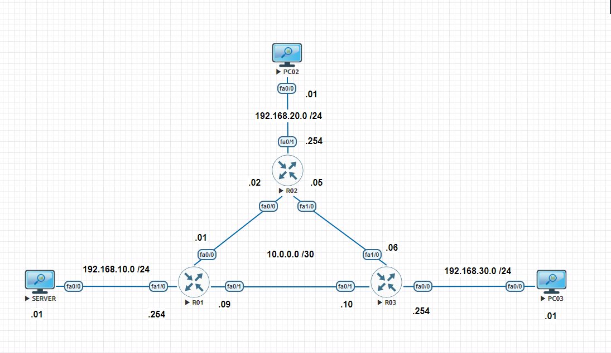
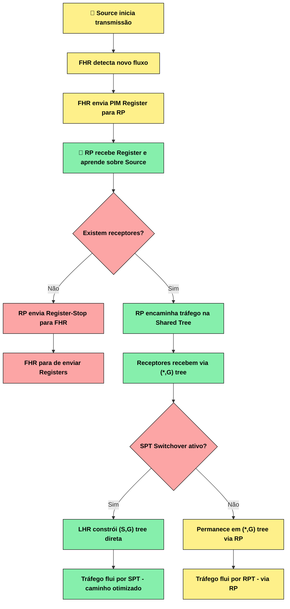
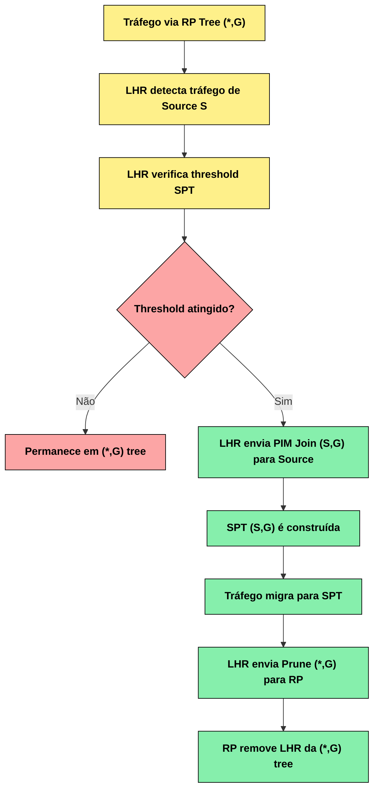

# Índice

- [Índice](#índice)
  - [05 - Exemplo Prático - PIM Dense Mode](#05---exemplo-prático---pim-dense-mode)
  - [Funcionamento do Pim - Dense Mode](#funcionamento-do-pim---dense-mode)
    - [Representação Visual do RP](#representação-visual-do-rp)
    - [Funcionamento do RP](#funcionamento-do-rp)
    - [Por que precisamos de um RP?](#por-que-precisamos-de-um-rp)
  - [Tipos de Configuração de RP](#tipos-de-configuração-de-rp)
    - [1. Static RP (RP Estático)](#1-static-rp-rp-estático)
    - [2. Auto-RP (Cisco Proprietário)](#2-auto-rp-cisco-proprietário)
    - [3. Bootstrap Router (BSR) - RFC 5059](#3-bootstrap-router-bsr---rfc-5059)
    - [4. Anycast RP - RFC 4610](#4-anycast-rp---rfc-4610)
    - [5. Embedded RP (IPv6)](#5-embedded-rp-ipv6)
  - [Tabela Comparativa - Tipos de Configuração de Rendezvous Points (RP)](#tabela-comparativa---tipos-de-configuração-de-rendezvous-points-rp)
  - [Resumo das Características Principais](#resumo-das-características-principais)
  - [Processo de Funcionamento do RP](#processo-de-funcionamento-do-rp)
    - [Fluxograma - Processo Completo do RP](#fluxograma---processo-completo-do-rp)
  - [Configuração de RPs](#configuração-de-rps)
    - [Static RP - Configuração Manual](#static-rp---configuração-manual)
    - [Auto-RP - Configuração Cisco](#auto-rp---configuração-cisco)
    - [BSR - Configuração Padrão RFC](#bsr---configuração-padrão-rfc)
    - [Anycast RP - Alta Disponibilidade](#anycast-rp---alta-disponibilidade)
  - [Seleção e Descoberta de RPs](#seleção-e-descoberta-de-rps)
    - [Processo de Seleção do RP](#processo-de-seleção-do-rp)
    - [Hash Function para Seleção de RP](#hash-function-para-seleção-de-rp)
  - [RP Tree vs Source Tree](#rp-tree-vs-source-tree)
    - [Comparação Visual](#comparação-visual)
    - [SPT Switchover - Migração para Source Tree](#spt-switchover---migração-para-source-tree)
  - [Troubleshooting de RPs](#troubleshooting-de-rps)
    - [Comandos de Verificação](#comandos-de-verificação)
    - [Problemas Comuns](#problemas-comuns)
  - [Otimização e Melhores Práticas](#otimização-e-melhores-práticas)
    - [Placement Strategy (Estratégia de Posicionamento)](#placement-strategy-estratégia-de-posicionamento)
    - [Redundância e Failover](#redundância-e-failover)
    - [Scenario Avançados e Casos de Uso](#scenario-avançados-e-casos-de-uso)
    - [Security e Hardening](#security-e-hardening)
    - [Performance Tuning e Optimization](#performance-tuning-e-optimization)
  - [📌 O que vimos até aqui](#-o-que-vimos-até-aqui)
    - [Simulados](#simulados)

## 05 - Exemplo Prático - PIM Dense Mode

Certo, agora que vimos a teoria é hora de praticar. A primeira coisa que precisa ser dita que o multicast é um serviço e, portanto, precisamos aplicar ele em um cenário que já está pronto e funcional.



## Funcionamento do Pim - Dense Mode

O **Rendezvous Point (RP)** é o coração do PIM Sparse Mode. Ele funciona como um ponto de encontro central: todas as origens multicast se registram nele, e os receptores consultam o RP para descobrir quais fluxos estão disponíveis.
Sem o RP, os receptores não teriam uma forma simples de localizar as origens ativas, tornando inviável a comunicação multicast em larga escala.
Em resumo, o RP é o elo de ligação entre quem transmite e quem deseja receber — garantindo organização, eficiência e escalabilidade na construção das árvores multicast.

### Representação Visual do RP

```text
Conceito do RP - "Ponto de Encontro Central":

🔺 Source A ──Register──┐
                         │
🔺 Source B ──Register──┤──▶ 🎯 RP ──┬──▶ [LHR1] ──▶ 💻 Receiver 1
                         │             │
🔺 Source C ──Register──┘              ├──▶ [LHR2] ──▶ 💻 Receiver 2
                                       └──▶ [LHR3] ──▶ 💻 Receiver 3

"RP = Ponto onde origens se ANUNCIAM e receptores se CONECTAM"
```

### Funcionamento do RP

O funcionamento do RP pode ser entendido como um processo de intermediação. Ele recebe anúncios das origens, registra esses fluxos, e quando um receptor solicita determinado grupo, o RP conecta as duas pontas e garante que o tráfego flua pela Shared Tree (*,G).  

**Função Principal:**

- **Descoberta de Origens:** Permite que receptores encontrem origens ativas  
- **Ponto de Convergência:** Local central para construção da árvore multicast
- **Redução de Estado:** Menos entradas de roteamento nos roteadores
- **Escalabilidade:** Suporta múltiplas origens e receptores por grupo

**Processo em 3 Etapas:**

```text
1. REGISTRO DAS ORIGENS:
   🔺 Source → [FHR] ──PIM Register──▶ 🎯 RP
   "Origens se anunciam para o RP"

2. SOLICITAÇÃO DOS RECEPTORES:
   💻 Receiver → [LHR] ──PIM Join (*,G)──▶ 🎯 RP
   "Receptores solicitam grupos ao RP"

3. DISTRIBUIÇÃO DO TRÁFEGO:
   🔺 Source → 🎯 RP → [LHR] → 💻 Receiver
   "RP coordena a entrega via Shared Tree"
```

### Por que precisamos de um RP?

**Problema sem RP:**  

Sem o Rendezvous Point, não existe um mecanismo central que diga aos receptores onde estão as origens multicast. Imagine um host que deseja receber um fluxo para o grupo 239.1.1.1: ele não tem como descobrir em qual parte da rede a origem está transmitindo. Cada roteador ficaria “no escuro”, sem saber para onde encaminhar os pedidos de recepção.
O resultado seria confusão, desperdício de banda ou até mesmo a impossibilidade de estabelecer a comunicação multicast.  

```text
❌ Sem RP - Como receptor encontra origem?

🔺 Source (192.168.1.10) transmitindo para 239.1.1.1
💻 Receiver quer receber 239.1.1.1

Pergunta: "Onde está a origem 192.168.1.10?"
Resposta: "Não sabemos! 🤷‍♂️"
```

**Solução com RP:**  

Com o RP, esse problema é resolvido. O RP funciona como um catálogo central:  

- As origens se registram nele, anunciando os grupos que estão transmitindo.
- Os receptores consultam o RP quando desejam ingressar em um grupo.  
- O RP então conecta as duas pontas, permitindo que o tráfego flua pela árvore compartilhada (*,G).  

Dessa forma, o RP garante que receptores encontrem as origens de maneira rápida, organizada e eficiente, viabilizando o multicast em redes de grande escala.  

```text
✅ Com RP - Ponto central de descoberta

🔺 Source se registra: "Estou transmitindo 239.1.1.1"
💻 Receiver solicita: "Quero receber 239.1.1.1"
🎯 RP conecta: "Source está ativa, aqui está o tráfego!"
```

## Tipos de Configuração de RP

Existem diferentes métodos para configurar e descobrir RPs em uma rede PIM:

### 1. Static RP (RP Estático)

O Static RP é a forma mais simples de definir um Rendezvous Point. Nele, o administrador escolhe manualmente qual roteador será o RP e configura todos os roteadores da rede PIM para reconhecer esse endereço.  

Isso significa que não existe um processo de eleição ou descoberta automática: cada roteador já “sabe de antemão” quem é o RP responsável por centralizar as sessões multicast.  

Esse método é bastante útil em redes pequenas ou ambientes de laboratório, onde o controle é total e a simplicidade é mais importante que a escalabilidade.

**Características:**  

- Configuração manual em todos os roteadores
- Simples de implementar em redes pequenas
- Não possui redundância automática
- Adequado para ambientes controlados

**Representação:**  

```text
Configuração Static RP:

[R1] ──┐
[R2] ──┤ ip pim rp-address 10.1.1.1 (configuração manual)
[R3] ──┤ ip pim rp-address 10.1.1.1 (em todos os roteadores)
[R4] ──┘

🎯 RP = 10.1.1.1 (definido estaticamente)
```

### 2. Auto-RP (Cisco Proprietário)

O Auto-RP foi criado pela Cisco para resolver a limitação do Static RP, eliminando a necessidade de configurar manualmente o RP em todos os roteadores.
Nesse modelo, a descoberta do RP é feita de forma automática: roteadores candidatos anunciam sua disponibilidade, e um Mapping Agent coleta esses anúncios e distribui para todos os demais roteadores da rede.  

Esse processo garante que todos os dispositivos aprendam, de maneira dinâmica, qual é o RP responsável por cada grupo multicast.  

A grande vantagem é a simplicidade operacional e redução de erros de configuração. Porém, como é um protocolo proprietário da Cisco, só funciona em equipamentos Cisco e, em cenários "multivendor", não é a solução mais indicada.  

**Características:**  

- Protocolo proprietário da Cisco
- Discovery automática de RPs candidatos
- Utiliza grupos especiais 224.0.1.39 e 224.0.1.40
- Funciona apenas em equipamentos Cisco

**Processo Auto-RP:**

```text
Auto-RP Process:

1. RP Candidate anuncia:
   [RP Candidate] ──▶ 224.0.1.39 (RP-ANNOUNCE)
   "Sou candidato a RP para grupos X"

2. Mapping Agent coleta e distribui:
   [Mapping Agent] ──▶ 224.0.1.40 (RP-DISCOVERY)
   "RP para grupos X é 10.1.1.1"

3. Todos os roteadores aprendem:
   [All Routers] ◀── 224.0.1.40
   "OK, RP para X é 10.1.1.1"
```

### 3. Bootstrap Router (BSR) - RFC 5059

O Bootstrap Router (BSR) é o método padrão definido pela RFC 5059 para a descoberta e distribuição de RPs em redes PIM Sparse Mode. Diferente do Auto-RP (que é proprietário da Cisco), o BSR é aberto e interoperável, podendo ser usado em ambientes multivendor.  

No BSR, os roteadores elegem automaticamente um Bootstrap Router responsável por coletar as informações dos candidatos a RP e distribuí-las para toda a rede. Essa eleição garante resiliência e redundância nativa: se o BSR principal falhar, outro candidato assume a função.  

O resultado é uma rede mais escalável, padronizada e tolerante a falhas, sem a necessidade de configuração manual em todos os dispositivos.  

**Características:**  

- Padrão RFC (interoperável entre vendors)
- Eleição automática de Bootstrap Router
- Distribuição de informações de RP por flooding
- Suporte nativo à redundância

**Processo BSR:**

```text
BSR Process:

1. Eleição do BSR:
   [Candidates] ──Bootstrap Messages──▶ [BSR Eleito]
   "Maior prioridade/IP vence"

2. RP Candidates anunciam:
   [RP Candidates] ──▶ [BSR] ──▶ RP-Set Message
   "Coleta candidatos e distribui mapeamento"

3. Flooding para toda rede:
   [BSR] ──flood──▶ [All PIM Routers]
   "Todos aprendem mapeamento RP↔Grupos"
```

### 4. Anycast RP - RFC 4610

O Anycast RP é uma técnica que aumenta a resiliência e a escalabilidade do multicast em redes grandes e críticas. Nesse modelo, múltiplos roteadores são configurados para atuar como RP utilizando o mesmo endereço IP. Assim, para a rede, todos eles representam “o mesmo RP”, mas na prática são diferentes dispositivos físicos distribuídos pela infraestrutura.  

O roteamento unicast se encarrega de direcionar cada origem ou receptor ao RP mais próximo, garantindo balanceamento de carga e menor latência. Já a consistência entre os múltiplos RPs é mantida pelo protocolo MSDP (Multicast Source Discovery Protocol), que sincroniza as informações de estado entre eles.  

O grande benefício do Anycast RP é que ele oferece alta disponibilidade: se um RP falhar, os outros continuam respondendo de forma transparente, sem necessidade de reconfiguração manual. Por isso, é amplamente utilizado em backbones de ISPs e grandes redes corporativas que exigem continuidade e performance.  

**Características:**  

- Alta disponibilidade e load balancing
- Múltiplos RPs com mesmo endereço IP
- Sincronização via MSDP (Multicast Source Discovery Protocol)
- Ideal para redes grandes e críticas

**Representação Anycast RP:**

```text
Anycast RP - Redundância:

🎯 RP1 (10.1.1.100) ──MSDP──┐
                             ├── Sincronização
🎯 RP2 (10.1.1.100) ──MSDP──┤    de estado
                             │
🎯 RP3 (10.1.1.100) ──MSDP──┘

"Mesmo IP, múltiplos roteadores físicos"  
"Roteamento unicast determina RP mais próximo"
```

### 5. Embedded RP (IPv6)

O Embedded RP foi introduzido no IPv6 como uma forma simples e eficiente de resolver o problema da descoberta do RP. Diferente dos outros métodos (Static RP, Auto-RP, BSR ou Anycast RP), o endereço do RP já vem embutido diretamente no endereço multicast do grupo.  

Isso significa que não há necessidade de protocolos adicionais para anúncio ou descoberta. Quando um roteador recebe um grupo multicast IPv6 com Embedded RP, ele consegue identificar automaticamente qual é o RP responsável apenas analisando o próprio endereço do grupo.  

A grande vantagem é a simplicidade operacional: não é preciso configurar mapeamentos nem manter processos de sincronização. Essa abordagem torna o multicast em IPv6 mais direto, especialmente útil em ambientes que buscam reduzir dependências de protocolos auxiliares.  

**Características:**  

- Específico para IPv6
- Endereço do RP embutido no endereço do grupo
- Não requer configuração adicional
- Auto descoberta baseada no próprio endereço

```text
Embedded RP (IPv6):

Grupo: FF7X:0240:RPIP::/96
       │    │    │
       │    │    └─ IP do RP embutido
       │    └─ Embedded RP flag
       └─ Escopo multicast

Exemplo: FF75:0240:2001:DB8::1::/96
         RP = 2001:DB8::1
```

## Tabela Comparativa - Tipos de Configuração de Rendezvous Points (RP)  

| Característica        | Static RP                     | Auto-RP                         | Bootstrap Router (BSR)           | Anycast RP               | Embedded RP          |
|-----------------------|-------------------------------|---------------------------------|----------------------------------|--------------------------|----------------------|
| Padrão/RFC            | Manual                        | Proprietário Cisco              | RFC 5059                         | RFC 4610                 | IPv6                 |
| Configuração          | Manual em todos os roteadores | Automática                      | Automática                       | Manual + MSDP            | Automática           |
| Descoberta            | Não há (pré-configurado)      | Automática via grupos especiais | Eleição automática de BSR        | Roteamento unicast       | Embutida no endereço |
| Interoperabilidade    | Universal                     | Apenas Cisco                    | Multivendor                      | Multivendor              | IPv6 universal       |
| Redundância           | Não possui                    | Limitada                        | Nativa                           | Alta disponibilidade     | Não aplicável        |
| Escalabilidade        | Baixa                         | Média                           | Alta                             | Muito Alta               | Alta                 |
| Complexidade          | Muito Simples                 | Simples                         | Média                            | Alta                     | Muito Simples        |
| Grupos Especiais      | N/A                           | 224.0.1.39, 224.0.1.40          | Bootstrap Messages               | N/A                      | N/A                  |
| Protocolos Auxiliares | Nenhum                        | Auto-RP                         | BSR                              | MSDP                     | Nenhum               |
| Tolerância a Falhas   | Baixa                         | Média                           | Alta                             | Muito Alta               | N/A                  |
| Load Balancing        | Não                           | Não                             | Não                              | Sim                      | Não                  |
| Melhor Cenário        | Redes pequenas/laboratório    | Redes Cisco homogêneas          | Redes multivendor médias/grandes | Backbones/redes críticas | Redes IPv6 simples   |

## Resumo das Características Principais  

**🔧 Static RP**  

- Configuração manual mais simples
- Adequado para ambientes controlados
- Sem redundância automática

**🏢 Auto-RP (Cisco)**  

- Discovery automática em equipamentos Cisco
- Utiliza Mapping Agent para distribuição
- Limitado a ambientes homogêneos Cisco

**🌐 Bootstrap Router (BSR)**  

- Padrão RFC com interoperabilidade
- Eleição automática e redundância nativa
- Distribuição por flooding

**⚡ Anycast RP**  

- Alta disponibilidade com múltiplos RPs físicos
- Sincronização via MSDP
- Balanceamento de carga automático

**📍 Embedded RP (IPv6)**  

- RP embutido no próprio endereço do grupo
- Zero configuração adicional
- Específico para IPv6

## Processo de Funcionamento do RP

### Fluxograma - Processo Completo do RP



**Detalhamento do Processo:**

**Fase 1 - Register Process:**  

- **O que acontece:** Esta é a fase inicial onde uma nova fonte de multicast é descoberta e registrada na rede. Quando uma fonte começa a transmitir dados multicast, o roteador conectado diretamente a ela (First Hop Router - FHR) detecta este novo fluxo e inicia o processo de notificação para o Rendezvous Point (RP).  

- **Por que é importante:** O RP precisa saber sobre todas as fontes ativas na rede para poder coordenar a distribuição de tráfego multicast. Sem este registro, os receptores não conseguiriam encontrar as fontes disponíveis.  

```text
1. Source transmite → FHR detecta novo fluxo
2. FHR encapsula pacotes → PIM Register → RP
3. RP aprende sobre nova source (S,G)
4. RP verifica se há receptores para G
```

**Fase 2 - Join Process:**  

- **O que acontece:** Quando um receptor deseja receber tráfego multicast de um grupo específico, ele envia uma mensagem IGMP Join. O roteador local (Last Hop Router - LHR) processa esta solicitação e envia uma mensagem PIM Join em direção ao RP. Conforme a mensagem viaja pela rede, cada roteador no caminho constrói uma árvore de distribuição compartilhada.  

- **Por que é importante:** Esta fase estabelece o caminho pelo qual o tráfego multicast fluirá da fonte até os receptores interessados, criando uma infraestrutura eficiente de distribuição.  

```text
5. Receptor envia IGMP Join → LHR
6. LHR envia PIM Join (*,G) → upstream direction → RP
7. Shared Tree (*,G) é construída
8. RP conecta source à árvore de distribuição
```

**Fase 3 - Traffic Flow:**  

- **O que acontece:** Com a árvore de distribuição estabelecida, o tráfego multicast pode fluir da fonte através do FHR, passando pelo RP, até chegar aos receptores via LHR. O RP pode otimizar o caminho enviando uma mensagem Register-Stop para evitar encapsulamento desnecessário, e há possibilidade de migração para uma árvore SPT (Shortest Path Tree) para otimizar a rota.  

- **Por que é importante:** Esta é a fase operacional onde o tráfego multicast efetivamente chega aos destinatários. As otimizações realizadas aqui garantem eficiência na utilização da largura de banda da rede.  

```text
1. Tráfego flui: Source → FHR → RP → LHR → Receiver
2.  RP pode enviar Register-Stop se tráfego flui diretamente
3.  Possível migração para SPT (S,G) para otimizar caminho
```

## Configuração de RPs

### Static RP - Configuração Manual

**Cisco IOS:**

```cisco
! Configurar RP estático para todos os grupos
Router(config)# ip pim rp-address 10.1.1.1

! Configurar RP para grupos específicos
Router(config)# access-list 10 permit 239.1.0.0 0.0.255.255
Router(config)# ip pim rp-address 10.1.1.1 10

! Verificar RP
Router# show ip pim rp mapping
```

**Vantagens:**  

- Simples e direto
- Controle total sobre seleção
- Previsível e determinístico

**Desvantagens:**  

- Configuração manual em todos os roteadores
- Sem redundância automática
- Difícil manutenção em redes grandes

### Auto-RP - Configuração Cisco

**RP Candidate:**

```cisco
! Configurar como candidato a RP
Router(config)# ip pim send-rp-announce loopback0 scope 16 group-list 10
Router(config)# access-list 10 permit 239.1.0.0 0.0.255.255

! Configurar interface para anúncios
Router(config)# interface loopback0
Router(config-if)# ip pim sparse-mode
```

**Mapping Agent:**

```cisco
! Configurar Mapping Agent
Router(config)# ip pim send-rp-discovery loopback0 scope 16

! Habilitar Auto-RP listener em interfaces
Router(config)# ip pim autorp listener
```

**Características Auto-RP:**  

- Usa grupos 224.0.1.39 (RP-ANNOUNCE) e 224.0.1.40 (RP-DISCOVERY)
- Scope controla TTL dos anúncios
- Mapping Agent pode ser diferente do RP

### BSR - Configuração Padrão RFC

**Bootstrap Router:**

```cisco
! Configurar BSR candidato
Router(config)# ip pim bsr-candidate loopback0 30 10

! BSR hash mask (para load balancing)
Router(config)# ip pim bsr-candidate loopback0 hash-mask-len 30 priority 10
```

**RP Candidate:**

```cisco
! Configurar RP candidato
Router(config)# access-list 10 permit 239.1.0.0 0.0.255.255
Router(config)# ip pim rp-candidate loopback0 group-list 10 priority 50

! Verificar BSR
Router# show ip pim bsr-router
Router# show ip pim rp mapping
```

**Vantagens BSR:**  

- Padrão RFC (interoperável)
- Eleição automática de BSR
- Suporte nativo à redundância
- Hash function para load balancing

### Anycast RP - Alta Disponibilidade

**Configuração Anycast RP:**

```cisco
! Configuração no RP1
Router1(config)# ip pim rp-address 10.1.1.100
Router1(config)# ip msdp peer 10.2.2.2 connect-source loopback0

! Configuração no RP2  
Router2(config)# ip pim rp-address 10.1.1.100
Router2(config)# ip msdp peer 10.1.1.1 connect-source loopback0

! Loopback com mesmo IP (Anycast)
Router1(config)# interface loopback1
Router1(config-if)# ip address 10.1.1.100 255.255.255.255

Router2(config)# interface loopback1  
Router2(config-if)# ip address 10.1.1.100 255.255.255.255
```

**MSDP (Multicast Source Discovery Protocol):**  

- Sincroniza informações de sources entre RPs
- Permite redundância transparente
- Suporta load balancing automático

## Seleção e Descoberta de RPs

### Processo de Seleção do RP

**Prioridade de Seleção:**

```text
1. Static RP (configuração manual)
   ↓ Maior prioridade - sempre usado se configurado

2. Auto-RP discovery  
   ↓ Segundo em prioridade

3. BSR discovery
   ↓ Menor prioridade - usado se outros não disponíveis

4. Embedded RP (IPv6 only)
   ↓ Extraído do próprio endereço do grupo
```

**Critérios de Desempate:**

```text
Para múltiplos RPs candidatos:

1. Maior Priority value (Auto-RP/BSR)
2. Hash function result (BSR)
3. Maior endereço IP (tiebreaker)
```

### Hash Function para Seleção de RP

**BSR Hash Algorithm:**

```text
Hash = (G & hash_mask) XOR (C & hash_mask)

Onde:
G = Endereço do grupo multicast
C = Endereço do RP candidato  
hash_mask = Máscara configurada no BSR

Candidato com maior hash value vence
```

**Exemplo Prático:**

```text
Grupo: 239.1.1.1
Hash Mask: /30 (255.255.255.252)
RP1: 10.1.1.1, Priority: 100
RP2: 10.1.1.2, Priority: 100

Hash1 = (239.1.1.1 & mask) XOR (10.1.1.1 & mask)
Hash2 = (239.1.1.1 & mask) XOR (10.1.1.2 & mask)

Maior hash vence para este grupo específico
```

## RP Tree vs Source Tree

### Comparação Visual

**RP Tree (*,G) - Shared Tree:**

```text
🌳 SHARED TREE via RP:

🔺 Source A ──┐
              ├──▶ 🎯 RP ──┬──▶ [LHR1] ──▶ 💻 Receiver 1  
🔺 Source B ──┘           └──▶ [LHR2] ──▶ 💻 Receiver 2

Características:
✅ Menos estado nos roteadores (uma entrada (*,G))
✅ Suporta múltiplas sources facilmente
❌ Caminho pode ser subótimo
❌ RP pode ser gargalo
```

**Source Tree (S,G) - SPT:**

```text
🌲 SOURCE TREE direto:

🔺 Source A ──direto──┬──▶ [LHR1] ──▶ 💻 Receiver 1
                      └──▶ [LHR2] ──▶ 💻 Receiver 2

🔺 Source B ──direto──┬──▶ [LHR1] ──▶ 💻 Receiver 1  
                      └──▶ [LHR2] ──▶ 💻 Receiver 2

Características:
✅ Caminho otimizado (menor latência)
✅ Sem single point of failure
❌ Mais estado nos roteadores (uma entrada por source)
❌ Complexidade aumenta com muitas sources
```

### SPT Switchover - Migração para Source Tree

**Quando acontece:**

```text
Condições para SPT Switchover:

1. Tráfego acima do threshold (default: primeiro pacote)
2. LHR decide migrar para caminho otimizado
3. Source está ativa e acessível via unicast
4. Configuração permite SPT (não bloqueado)
```

**Processo de Switchover:**



**Controle de SPT Switchover:**

```cisco
! Desabilitar SPT switchover (permanecer em RP Tree)
Router(config)# ip pim spt-threshold infinity

! Configurar threshold específico
Router(config)# ip pim spt-threshold 100

! Configurar por grupo
Router(config)# access-list 10 permit 239.1.0.0 0.0.255.255  
Router(config)# ip pim spt-threshold infinity group-list 10
```

## Troubleshooting de RPs

### Comandos de Verificação

**Verificar RP Mapping:**

```cisco
Router# show ip pim rp mapping
PIM Group-to-RP Mappings

Group(s) 224.0.0.0/4
  RP: 10.1.1.1 (loopback0), v2v1
      Info source: 10.1.1.1 (loopback0), elected via Auto-RP
           Uptime: 00:05:23, expires: 00:02:36

Group(s) 239.1.0.0/16  
  RP: 10.2.2.2 (loopback0), v2v1
      Info source: 10.2.2.2 (loopback0), via bootstrap, priority 0, holdtime 150
           Uptime: 00:10:15, expires: 00:02:15
```

**Verificar Estado do RP:**

```cisco
Router# show ip pim rp
Group: 239.1.1.1, RP: 10.1.1.1, uptime 00:05:23, expires 00:02:36
  RP: 10.1.1.1 (loopback0), v2v1
      Info source: 10.1.1.1 (loopback0), elected via Auto-RP
           Uptime: 00:05:23, expires: 00:02:36

! Verificar se roteador é RP para algum grupo
Router# show ip pim rp-hash 239.1.1.1
  RP: 10.1.1.1 (Loopback0)
    Info source: 10.1.1.1, via Auto-RP
```

**Verificar Register Process:**

```cisco
Router# show ip pim interface
Address          Interface                Ver/ Nbr    Query  DR  DR
                                         Mode Count   Intvl  Prior
10.1.1.1         Loopback0                v2/S  0       30    1   10.1.1.1
192.168.1.1      FastEthernet0/0          v2/S  1       30    1   192.168.1.2

Router# show ip pim neighbor  
PIM Neighbor Table
Mode: B - Bidir Capable, DR - Designated Router, N - Default DR Priority,
      P - Proxy Capable, S - State Refresh Capable, G - GenID Capable,
      L - DR Load-balancing Capable

Neighbor          Interface                Uptime/Expires    Ver   DR
Address                                                            Prio/Mode
192.168.1.2       FastEthernet0/0          00:15:23/00:01:36 v2    1 / S P G
```

### Problemas Comuns

**1. RP não responde a Registers:**

```text
Sintomas:
- Sources não aparecem na tabela multicast do RP
- show ip pim rp não mostra sources registradas
- Tráfego multicast não flui

Diagnóstico:
Router# debug ip pim rp
Router# show ip pim rp-hash <group>
Router# show ip mroute <group> <source>

Possíveis Causas:
- RP address incorreto
- Conectividade unicast FHR↔RP quebrada  
- ACL bloqueando PIM Register packets
- MTU issues com encapsulamento Register
```

**2. Receptores não recebem tráfego:**

```text  
Sintomas:
- IGMP Join visível no LHR mas sem tráfego
- (*,G) entry existe mas sem incoming traffic
- RP recebe Register mas não encaminha

Diagnóstico:
Router# show ip mroute <group>
Router# show ip pim rp <group>  
Router# debug ip pim <group>

Possíveis Causas:
- RP não está na árvore SPF para LHR
- PIM Join não chegando ao RP
- RPF failure na direção RP→LHR
```

**3. Múltiplos RPs conflitantes:**

```text
Sintomas:  
- Diferentes roteadores usam RPs diferentes
- Tráfego intermitente ou inconsistente
- show ip pim rp mapping mostra conflitos

Diagnóstico:
Router# show ip pim rp mapping
Router# show ip pim autorp
Router# show ip pim bsr-router

Soluções:
- Verificar consistência de configuração
- Analisar prioridades Auto-RP/BSR
- Confirmar conectividade entre candidatos
```

## Otimização e Melhores Práticas

### Placement Strategy (Estratégia de Posicionamento)

**Critérios para Posicionamento do RP:**

```text
🎯 RP Placement - Fatores Críticos:

1. CENTRALIDADE TOPOLÓGICA:
   ├─ Próximo ao core da rede
   ├─ Menor número de hops para edges  
   └─ Evitar single points of failure

2. CAPACIDADE DO EQUIPAMENTO:
   ├─ CPU suficiente para Register processing
   ├─ Memória para tabelas multicast grandes
   └─ Largura de banda adequada

3. CONECTIVIDADE:
   ├─ Múltiplos caminhos para redundância
   ├─ Baixa latência para sources/receivers
   └─ Links confiáveis e estáveis
```

**Exemplo de Placement:**

```text
RUIM - RP na borda:
[Core] ──long path──▶ 🎯 RP (Edge) ◀──sources/receivers
"Alto delay, single point failure"

BOM - RP no core:
     🎯 RP (Core)
    /      |      \
[Edge1] [Edge2] [Edge3]
"Baixo delay, múltiplos caminhos"
```

### Redundância e Failover  

**Estratégias de Redundância:**

**1. Anycast RP:**

```text
Anycast RP - Configuração Completa:

Site A:                    Site B:
┌──────────────────┐      ┌──────────────────┐
│ 🎯 RP1           │──MSDP──│ 🎯 RP2           │
│ 10.0.0.100/32    │      │ 10.0.0.100/32    │
│ (Anycast)        │      │ (Anycast)        │
└──────────────────┘      └──────────────────┘
        │                          │
    [Sources A]                [Sources B]
    [Receivers A]              [Receivers B]

"Mesmo endereço IP, sincronização via MSDP"
"Roteamento unicast determina RP mais próximo"
```

**Configuração Anycast RP Completa:**

```cisco
! RP1 (Site A)
Router1(config)# interface loopback100
Router1(config-if)# ip address 10.0.0.100 255.255.255.255
Router1(config-if)# ip pim sparse-mode

Router1(config)# ip pim rp-address 10.0.0.100
Router1(config)# ip msdp peer 10.1.1.2 connect-source loopback0
Router1(config)# ip msdp originator-id loopback0

! RP2 (Site B) 
Router2(config)# interface loopback100  
Router2(config-if)# ip address 10.0.0.100 255.255.255.255
Router2(config-if)# ip pim sparse-mode

Router2(config)# ip pim rp-address 10.0.0.100
Router2(config)# ip msdp peer 10.1.1.1 connect-source loopback0
Router2(config)# ip msdp originator-id loopback0
```

**2. BSR com Múltiplos RPs:**

```text
BSR Redundancy Model:

    🔄 BSR Primary ──backup──→ 🔄 BSR Secondary
            │                         │
    ┌───────┴────────┐         ┌──────┴─────────┐
    │                │         │                │
  🎯 RP1 (Pri: 100) 🎯 RP2   🎯 RP3 (Pri: 50) 🎯 RP4
    
"BSR distribui múltiplos candidatos"
"Hash function balanceia grupos entre RPs"
"Failover automático se RP primário falha"
```

**Configuração BSR Redundante:**

```cisco
! BSR Primary
RouterBSR1(config)# ip pim bsr-candidate loopback0 30 100

! BSR Backup  
RouterBSR2(config)# ip pim bsr-candidate loopback0 30 50

! RP Candidates (mesma configuração em ambos)
RouterRP1(config)# ip pim rp-candidate loopback0 priority 100
RouterRP2(config)# ip pim rp-candidate loopback0 priority 50
RouterRP3(config)# ip pim rp-candidate loopback0 priority 75
```

**3. Load Balancing entre RPs:**

```text
RP Load Balancing via Hash:

Grupos 239.1.1.1-100 ──hash──→ 🎯 RP1 (10.1.1.1)
Grupos 239.1.2.1-100 ──hash──→ 🎯 RP2 (10.1.1.2)  
Grupos 239.1.3.1-100 ──hash──→ 🎯 RP3 (10.1.1.3)

"Hash function distribui grupos automaticamente"
"Reduz carga em RPs individuais"
"Melhora performance geral"
```

**Monitoring e Alertas:**

```cisco
! Configurar SNMP para monitoramento RP
Router(config)# snmp-server enable traps pim neighbor-change rp-mapping-change

! Configurar syslog para eventos críticos
Router(config)# logging discriminator PIM_EVENTS facility local0

! Track RP reachability
Router(config)# track 1 ip route 10.1.1.1 255.255.255.255 reachability
Router(config)# event manager applet RP_DOWN
Router(config-applet)# event track 1 state down
Router(config-applet)# action 1.0 syslog msg "RP 10.1.1.1 is unreachable!"
```

### Scenario Avançados e Casos de Uso

**1. Multi-Domain RP Design:**

```text
Enterprise Multi-Site RP:

    🌐 Internet/WAN
         │
    ┌────┼────┐
    │    │    │
   Site1 │ Site2  Site3
  🎯 RP1 │🎯 RP2 🎯 RP3
 (Local) │(Main) (DR)
    │    │    │
 Sources │ Sources Sources
Receivers│Receivers Receivers

Design Pattern:
- RP principal no site central  
- RPs locais para redundância
- MSDP entre sites para sincronização
```

**Configuração Multi-Site:**

```cisco
! Site Principal (RP Main)
SiteMain(config)# ip msdp peer 10.10.1.1 connect-source loopback0 remote-as 65001
SiteMain(config)# ip msdp peer 10.10.3.1 connect-source loopback0 remote-as 65003
SiteMain(config)# ip msdp redistribute

! Site 1 (RP Local)
Site1(config)# ip msdp peer 10.10.2.1 connect-source loopback0 remote-as 65002
Site1(config)# ip msdp mesh-group CORP_SITES

! Site 3 (DR Site)  
Site3(config)# ip msdp peer 10.10.2.1 connect-source loopbook0 remote-as 65002
Site3(config)# ip msdp default-peer 10.10.2.1
```

**2. RP para Aplicações Específicas:**

```text
Application-Specific RP Design:

📺 IPTV RP (239.0.0.0/8)     ──→ 🎯 RP_IPTV (High-performance)
🎮 Gaming RP (239.100.0.0/16) ──→ 🎯 RP_GAMING (Low-latency)  
📞 Voice RP (239.200.0.0/16) ──→ 🎯 RP_VOICE (QoS-enabled)
📊 Data RP (239.255.0.0/16)  ──→ 🎯 RP_DATA (Standard)

"RPs dedicados por tipo de aplicação"
"Otimização específica por workload"
```

**Configuração Application-Specific:**

```cisco
! IPTV RP - Performance otimizada
RouterIPTV(config)# access-list 100 permit ip any 239.0.0.0 0.255.255.255
RouterIPTV(config)# ip pim rp-candidate loopback0 group-list 100 priority 10
RouterIPTV(config)# ip pim spt-threshold 1 group-list 100

! Gaming RP - Baixa latência  
RouterGaming(config)# access-list 200 permit ip any 239.100.0.0 0.0.255.255
RouterGaming(config)# ip pim rp-candidate loopback0 group-list 200 priority 10
RouterGaming(config)# ip pim spt-threshold 0 group-list 200

! Voice RP - QoS garantido
RouterVoice(config)# access-list 300 permit ip any 239.200.0.0 0.0.255.255  
RouterVoice(config)# ip pim rp-candidate loopback0 group-list 300 priority 10
RouterVoice(config)# class-map VOICE_MCAST
RouterVoice(config-cmap)# match access-group 300
RouterVoice(config)# policy-map VOICE_QOS
RouterVoice(config-pmap)# class VOICE_MCAST
RouterVoice(config-pmap-c)# priority percent 30
```

### Security e Hardening

**1. RP Security Best Practices:**

```text
🔒 RP Security Layers:

1. CONTROLE DE ACESSO:
   ├─ ACL em interfaces RP
   ├─ Filtros PIM Register/Join
   └─ Source/Group authentication

2. PROTEÇÃO DO RP:  
   ├─ Rate limiting PIM messages
   ├─ CPU protection (CoPP)
   └─ Memory monitoring

3. NETWORK SEGMENTATION:
   ├─ RP em VLAN dedicada
   ├─ Firewall rules específicas
   └─ Management plane separado
```

**Implementação Security:**

```cisco
! Rate limiting PIM messages
Router(config)# access-list 50 permit 224.0.0.0 15.255.255.255
Router(config)# class-map PIM_CONTROL
Router(config-cmap)# match access-group 50

Router(config)# policy-map CoPP_POLICY
Router(config-pmap)# class PIM_CONTROL  
Router(config-pmap-c)# police 1000000 conform-action transmit exceed-action drop

Router(config)# control-plane
Router(config-cp)# service-policy input CoPP_POLICY

! Source authentication
Router(config)# ip pim accept-register list 60
Router(config)# access-list 60 permit ip 192.168.0.0 0.0.255.255 any
Router(config)# access-list 60 permit ip 10.0.0.0 0.255.255.255 any

! Join filtering
Router(config)# ip pim accept-rp 10.1.1.1 100
Router(config)# access-list 100 permit ip any 239.0.0.0 0.255.255.255
```

**2. Anti-Spoofing e Validation:**

```text
PIM Security Mechanisms:

┌─ uRPF (Unicast RPF) ─────────┐
│ Valida origem dos Register   │
│ Previne source spoofing      │
└─────────────────────────────┘

┌─ PIM Authentication ────────┐  
│ MD5/SHA authentication      │
│ Entre neighbors PIM         │
└─────────────────────────────┘

┌─ BSR Security ──────────────┐
│ BSR message authentication  │  
│ Prevents rogue BSR/RP       │
└─────────────────────────────┘
```

**Configuração Anti-Spoofing:**

```cisco
! uRPF strict mode
Router(config)# interface fastethernet0/0
Router(config-if)# ip verify unicast source reachable-via rx

! PIM authentication
Router(config)# interface fastethernet0/0  
Router(config-if)# ip pim message-digest-key 1 md5 MySecretKey

! BSR authentication
Router(config)# ip pim bsr-candidate loopback0 30 10
Router(config)# ip pim message-digest-key 1 md5 BSR_SecretKey
```

### Performance Tuning e Optimization

**1. RP Performance Optimization:**

```text
🚀 RP Performance Tuning:

CPU OPTIMIZATION:
├─ Register processing em hardware (se disponível)
├─ PIM message batching
└─ Periodic maintenance optimization

MEMORY OPTIMIZATION:  
├─ Timeout tuning para entries inativas
├─ SPT switchover agressivo
└─ Prune/Join aggregation

NETWORK OPTIMIZATION:
├─ Register supression tuning
├─ Hello interval optimization  
└─ Assert mechanism tuning
```

**Implementação Performance:**

```cisco
! Register optimization
Router(config)# ip pim register-rate-limit 500

! SPT switchover tuning - migra imediatamente  
Router(config)# ip pim spt-threshold 0

! Hello interval otimizado para detecção rápida
Router(config)# interface fastethernet0/0
Router(config-if)# ip pim hello-interval 15
Router(config-if)# ip pim query-interval 60

! Join/Prune interval tuning
Router(config)# ip pim join-prune-interval 45

! State refresh optimization (PIM-DM)
Router(config)# ip pim state-refresh-interval 45
Router(config)# ip pim state-refresh-ttl 100
```

**2. Capacity Planning:**

```text
📊 RP Capacity Planning:

SOURCES PER RP:
├─ Hardware platform limits
├─ Register processing capacity  
└─ Memory per (S,G) entry

GROUPS PER RP:
├─ Hash distribution effectiveness
├─ (*,G) vs (S,G) ratio
└─ Geographic distribution

BANDWIDTH CALCULATIONS:
├─ Peak simultaneous streams
├─ Average bitrate per stream
└─ Replication factor
```

**Monitoring Capacity:**

```cisco
! SNMP monitoring
Router(config)# snmp-server enable traps pim invalid-register
Router(config)# snmp-server enable traps pim neighbor-change
Router(config)# snmp-server enable traps pim rp-mapping-change

! Performance counters
Router# show ip pim rp-hash detail
Router# show processes cpu | include PIM
Router# show memory summary | include Multicast

! Custom EEM monitoring
Router(config)# event manager applet RP_CAPACITY_MONITOR
Router(config-applet)# event timer watchdog time 300
Router(config-applet)# action 1.0 cli command "show ip pim rp mapping | count"
Router(config-applet)# action 2.0 regexp "([0-9]+)" "$_cli_result" RESULT
Router(config-applet)# action 3.0 if $RESULT gt 1000
Router(config-applet)# action 3.1 syslog msg "RP overload: $RESULT groups"
```

## 📌 O que vimos até aqui

**🎯 Rendezvous Point (RP) - Conceito Central**

- RP = "Ponto de encontro" central do PIM Sparse Mode
- Conecta sources (via Register) com receivers (via Join)
- Reduz estado nos roteadores usando Shared Tree (*,G)

**⚙️ Tipos de Configuração RP**

| Método       | Características                    | Cenário Ideal          |
|-------------|-----------------------------------|------------------------|
| Static RP    | Manual, simples, sem redundância  | Redes pequenas/teste   |
| Auto-RP     | Cisco proprietário, automático    | Ambientes Cisco puro   |
| BSR         | RFC padrão, interoperável         | Redes multi-vendor     |
| Anycast RP  | Alta disponibilidade via MSDP     | Redes críticas         |
| Embedded RP | IPv6, auto-descoberta            | Redes IPv6 modernas    |

**🔄 Processo RP**

1. **Register Phase:** Sources se anunciam via FHR → RP
2. **Join Phase:** Receivers solicitam via LHR → RP  
3. **Distribution:** Tráfego flui via Shared Tree (*,G)
4. **Optimization:** Possível migração para SPT (S,G)

**🚀 Otimização e Redundância**

- **Anycast RP:** Múltiplos RPs com mesmo IP + MSDP
- **Load Balancing:** Hash function distribui grupos  
- **Application-Specific:** RPs dedicados por workload
- **Security:** ACLs, rate limiting, authentication

**💡 SPT Switchover:** Migração de (*,G) para (S,G) para otimizar latência

**🔧 Troubleshooting:** show ip pim rp mapping, debug ip pim, análise Register/Join

👉 **Próximo tópico:** PIM Dense Mode vs Sparse Mode - comparação detalhada e casos de uso.

---

### Simulados

**[Simulado 01 - RP Basics](https://alcancil.github.io/Cisco/CCNP%20350-401%20ENCOR/03%20-%20Infrastructure/01%20-%20Multicast/04%20-%20RP/Arquivos/Simulado/01.html)**

**[Simulado 02 - Auto-RP vs BSR](https://alcancil.github.io/Cisco/CCNP%20350-401%20ENCOR/03%20-%20Infrastructure/01%20-%20Multicast/04%20-%20RP/Arquivos/Simulado/02.html)**

**[Simulado 03 - Anycast RP](https://alcancil.github.io/Cisco/CCNP%20350-401%20ENCOR/03%20-%20Infrastructure/01%20-%20Multicast/04%20-%20RP/Arquivos/Simulado/03.html)**

**[Simulado 04 - SPT Switchover](https://alcancil.github.io/Cisco/CCNP%20350-401%20ENCOR/03%20-%20Infrastructure/01%20-%20Multicast/04%20-%20RP/Arquivos/Simulado/04.html)**

**[Simulado 05 - RP Security](https://alcancil.github.io/Cisco/CCNP%20350-401%20ENCOR/03%20-%20Infrastructure/01%20-%20Multicast/04%20-%20RP/Arquivos/Simulado/05.html)**

**[Simulado 06 - Multi-Site RP](https://alcancil.github.io/Cisco/CCNP%20350-401%20ENCOR/03%20-%20Infrastructure/01%20-%20Multicast/04%20-%20RP/Arquivos/Simulado/06.html)**

**[Simulado 07 - RP Troubleshooting](https://alcancil.github.io/Cisco/CCNP%20350-401%20ENCOR/03%20-%20Infrastructure/01%20-%20Multicast/04%20-%20RP/Arquivos/Simulado/07.html)**

**[Simulado 08 - Performance Tuning](https://alcancil.github.io/Cisco/CCNP%20350-401%20ENCOR/03%20-%20Infrastructure/01%20-%20Multicast/04%20-%20RP/Arquivos/Simulado/08.html)**

**[Simulado 09 - BSR Advanced](https://alcancil.github.io/Cisco/CCNP%20350-401%20ENCOR/03%20-%20Infrastructure/01%20-%20Multicast/04%20-%20RP/Arquivos/Simulado/09.html)**

**[Simulado 10 - RP Design](https://alcancil.github.io/Cisco/CCNP%20350-401%20ENCOR/03%20-%20Infrastructure/01%20-%20Multicast/04%20-%20RP/Arquivos/Simulado/10.html)**

**[Dashboard](https://alcancil.github.io/Cisco/CCNP%20350-401%20ENCOR/03%20-%20Infrastructure/01%20-%20Multicast/04%20-%20RP/Arquivos/Simulado/dashboard.html)**
