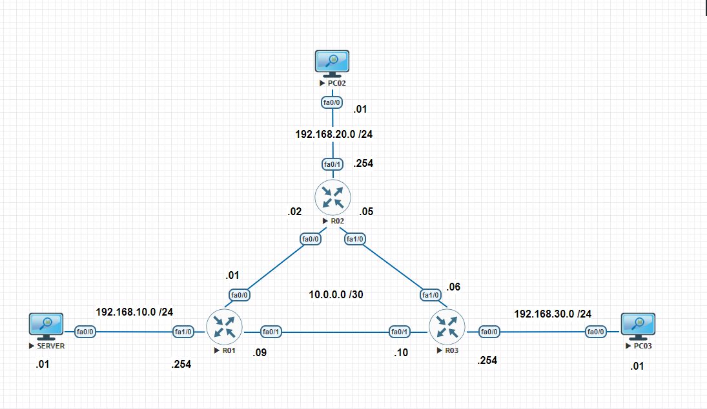
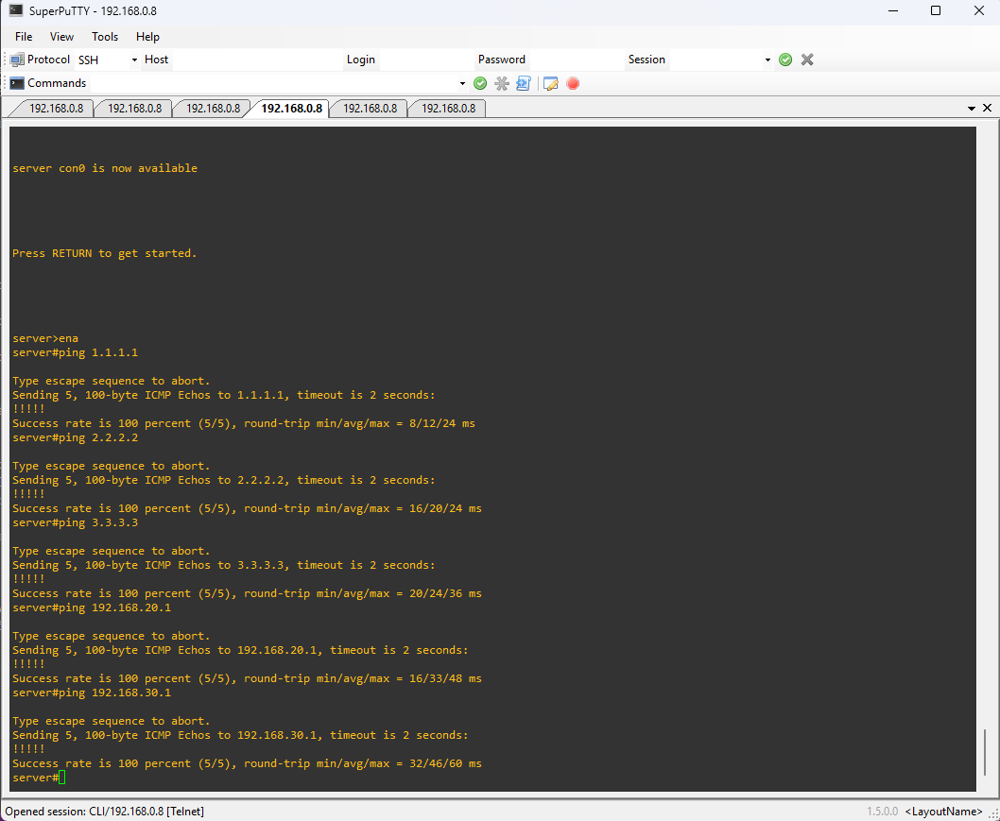
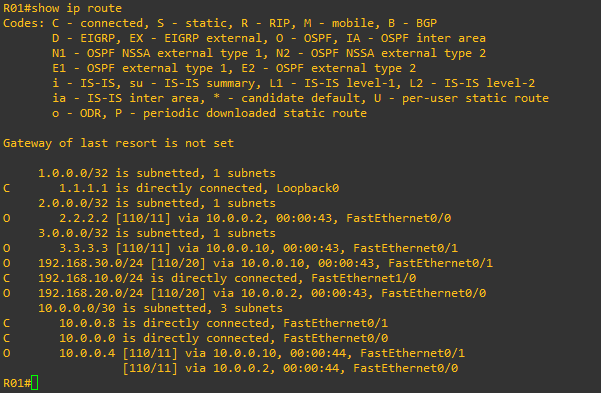
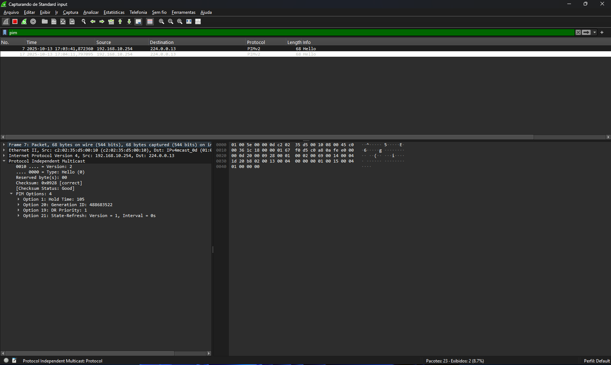
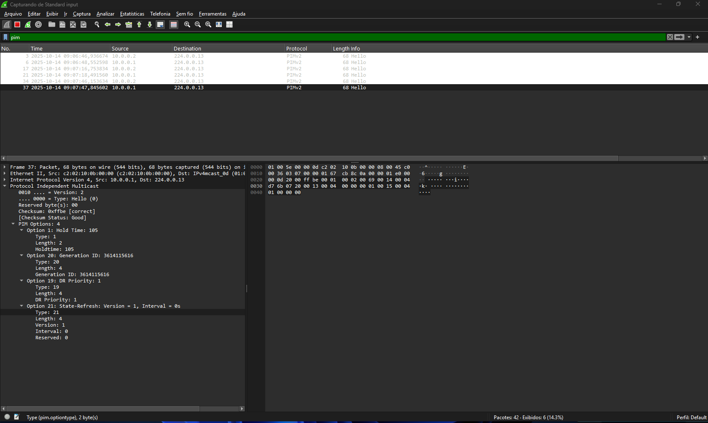
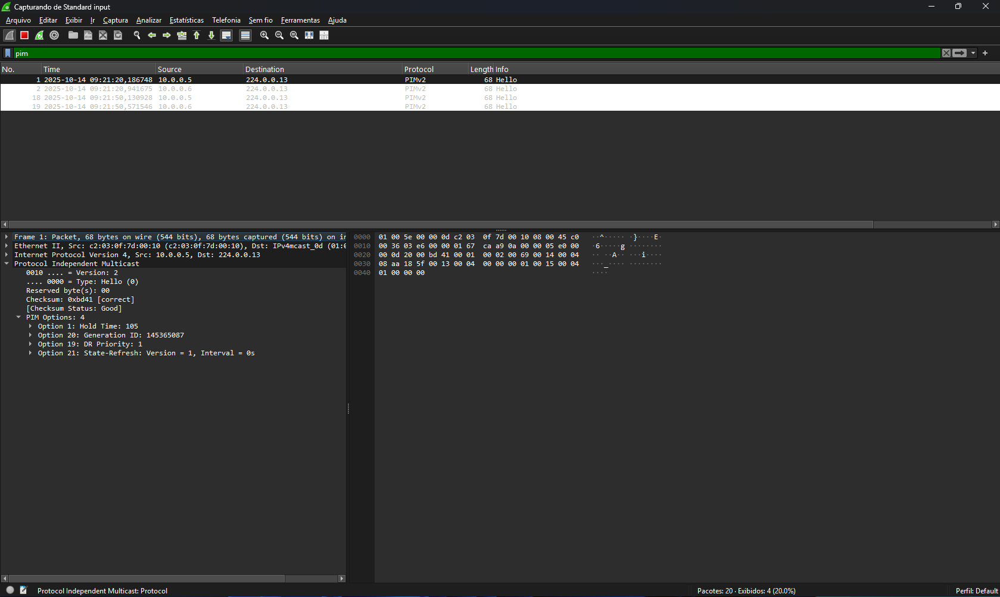
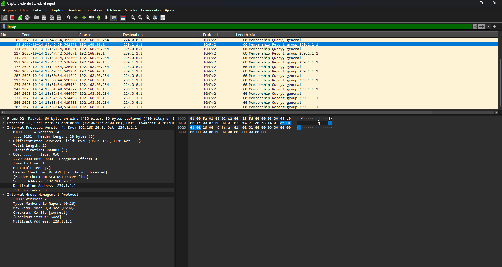
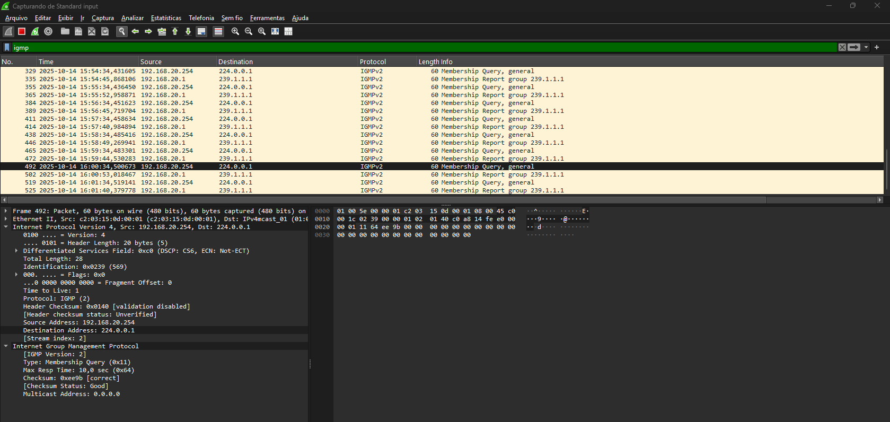
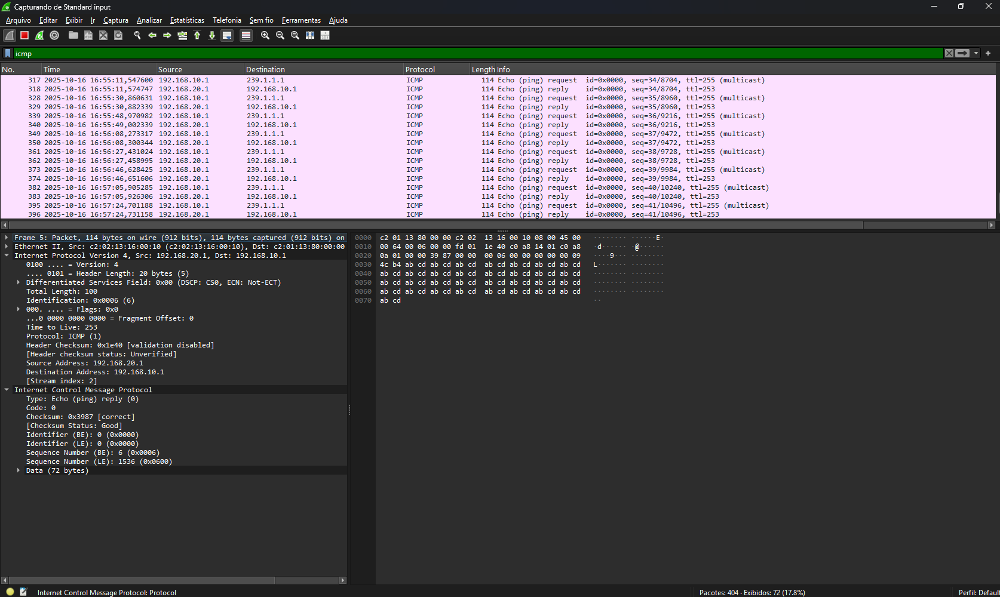

# Índice

- [Índice](#índice)
  - [05 - Exemplo Prático - PIM Dense Mode](#05---exemplo-prático---pim-dense-mode)
    - [Explicação do Cenário](#explicação-do-cenário)
    - [Testes Preliminares](#testes-preliminares)
    - [Onde o PIM deve ser ativado](#onde-o-pim-deve-ser-ativado)
  - [Função do DR no PIM Dense Mode](#função-do-dr-no-pim-dense-mode)
    - [Contexto: Por que o PIM precisa de um DR?](#contexto-por-que-o-pim-precisa-de-um-dr)
    - [Processo de Eleição do DR no PIM Dense Mode](#processo-de-eleição-do-dr-no-pim-dense-mode)
    - [Função prática do DR no PIM Dense Mode](#função-prática-do-dr-no-pim-dense-mode)
    - [Resumo rápido](#resumo-rápido)
  - [Endereço Multicast 224.0.0.13](#endereço-multicast-2240013)
    - [Revisão](#revisão)
    - [Resumo prático](#resumo-prático)
  - [Explicação da Tabela de roteamento multicast](#explicação-da-tabela-de-roteamento-multicast)
    - [Realizando Join Group](#realizando-join-group)

## 05 - Exemplo Prático - PIM Dense Mode

### Explicação do Cenário

Agora que vimos a teoria é hora de praticar. A primeira coisa que precisa ser dita que o **multicast é um serviço** e, portanto, precisamos aplicar ele em um cenário que já está pronto e funcional.  

  

Nesse cenário estamos utilizando **seis roteadores**.  

Sim, isso mesmo — os “hosts” são, na verdade, **roteadores disfarçados de hosts**, e por isso não realizaremos muitas configurações neles.  

Nos demais roteadores, que estão interligados entre si, foi configurado apenas o protocolo de roteamento dinâmico **OSPF**, garantindo que todas as redes já possuam **conectividade IP completa** antes de ativarmos o multicast.  

O que precisamos entender aqui é que o **PIM Dense Mode** funciona segundo o princípio **“flood and prune”**.  
Mas o que isso significa?  

Quando o processo de comunicação multicast se inicia, o protocolo PIM envia o tráfego multicast por todos os caminhos possíveis (flood), **até descobrir quais roteadores possuem receptores interessados** naquele grupo multicast.  
Os caminhos que **não possuem hosts interessados** são posteriormente **“podados” (pruned)** da árvore de distribuição, otimizando o fluxo.  

Nesse exemplo, o **Host01 (Server)** será a **fonte** da comunicação multicast, enquanto apenas o **Host03** será o **receptor** interessado nesse tráfego.  

### Testes Preliminares

Agora vamos acessar o SERVER e vamos garantir que existe comunicação entre todos os hosts.  
**OBS:** nos roteadores eu configurei interfaces de LOOPABCK. Então R01 tem o ip 1.1.1.1 /32, R02 tem o ip 2.2.2.2 /32 e R03 tem o ip 3.3.3.3 /32 .  



Com isso, podemos ver que todos os hosts se alcançam e se comunicam. Mas o mais importante é observer a a tabela de roteamento para podermos entender um conceito simples.  

  

Essa é a tabela de roteamento em R01. Estamos acostumados a analisar essa tabela para verificarmos se o roteamento dinâmico está funcionando corretamente e não temos nenhum problema. Porém uma coisa que não é muito falada e que pode passar despercebida no primeiro momento é que essa tabela é como se fosse um bando de dados onde é feito o mapeamento da comunicação das redes que agora se dá em **unicast**. Ou seja, um host vai se comunicar diretamente com o outro, ou seja, comunicação de **um para um.**  

No nosso caso queremos ter a comunicação **de um para um grupo**, ou seja, **comunicação multicast**. Então nosso papel aqui é montar a árvore de comuniçação que já foi explicada anteriormente. Essa árvore é como se fosse uma tabela de roteamento só que agora multicast.  

Então a primeira coisa que precisamos verificar é se o **roteamento multicast está ativo** no equipamento.  

```ios
R01#show ip multicast  
  Multicast Routing: disabled  
  Multicast Multipath: disabled  
  Multicast Route limit: No limit  
  Multicast Triggered RPF check: enabled  
  Multicast Fallback group mode: Sparse  
  Multicast DVMRP Interoperability: disabled  
  Number of multicast boundaries configured with filter-autorp option: 0  
R01#  
```

Certo, como podemos ver, o roteamento multicast não está ativo. Então vamos ativar o mesmo.  

>R01(config)#ip multicast-routing  

Só para confirmar, vamos rodar o mesmo comando mais uma vez.  

```ios
R01#show ip multicast  
  Multicast Routing: enabled  
  Multicast Multipath: disabled  
  Multicast Route limit: No limit  
  Multicast Triggered RPF check: enabled  
  Multicast Fallback group mode: Sparse  
  Multicast DVMRP Interoperability: disabled  
  Number of multicast boundaries configured with filter-autorp option: 0  
R01#  
```

Agora que temos o roteamento multicast ativo, precisamos ativar o protocolo **PIM**. Esse protocolo deve ser ativado nas interfaces onde a comunicação ira ocorrer.  

### Onde o PIM deve ser ativado

No modo **Dense Mode (PIM-DM)**, o tráfego multicast é floodado por todas as interfaces que participam do domínio multicast.  

👉 Portanto, você deve ativar o PIM **em todas as interfaces que participam do caminho multicast** — ou seja, interfaces que interligam roteadores e também interfaces conectadas a redes com hosts (fontes ou receptores).  

✅ **Resumo da regra prática:**  

- Ative o PIM nas interfaces que têm roteadores vizinhos PIM e nas interfaces onde há fontes ou receptores multicast.  

🌀 **Sobre interfaces de Loopback (muito importante)**  

- Não é necessário ativar PIM em interfaces Loopback, a menos que ela seja usada como origem do tráfego multicast (por exemplo, um servidor multicast rodando em 1.1.1.1).  

- Por padrão, o PIM trabalha nas interfaces que realmente encaminham tráfego multicast (as físicas).  

- A Loopback costuma ser usada apenas como Router-ID, endereço de origem de OSPF/PIM, ou fonte lógica (RP) em cenários de Sparse Mode — não é o caso aqui.  

Portanto, no nosso cenário vamos entrar no roteador R01 vamos ativar o PIM em todas as interfaces que estão ativas e vão fazer parte do multicast.  

```ios
 R01>ena  
 R01#show ip int br  
  Interface                  IP-Address      OK? Method Status                Protocol  
  FastEthernet0/0            10.0.0.1        YES NVRAM  up                    up  
  FastEthernet0/1            10.0.0.9        YES NVRAM  up                    up  
  FastEthernet1/0            192.168.10.254  YES NVRAM  up                    up  
  Loopback0                  1.1.1.1         YES NVRAM  up                    up  
 R01#conf t  
 Enter configuration commands, one per line.  End with CNTL/Z.  
 R01(config)#int f0/0  
 R01(config-if)#ip pim dense-mode  
 R01(config-if)#  
 *Mar  1 03:53:26.735: %PIM-5-DRCHG: DR change from neighbor 0.0.0.0 to 10.0.0.1 on interface FastEthernet0/0  
 R01(config-if)#int f0/1  
 R01(config-if)#ip pim dense-mode  
 R01(config-if)#  
 *Mar  1 03:53:48.687: %PIM-5-DRCHG: DR change from neighbor 0.0.0.0 to 10.0.0.9 on interface FastEthernet0/1  
 R01(config-if)#ip pim  
 R01(config-if)#int f1/0  
 R01(config-if)#ip pim dense-mode  
 R01(config-if)#  
 *Mar  1 03:54:21.635: %PIM-5-DRCHG: DR change from neighbor 0.0.0.0 to 192.168.10.254 on interface FastEthernet1/0  
 R01(config-if)#  
```

Agora que ativamos o **PIM DENSE-MODE** podemos observar que nos é exibida uma mensagem de aviso (log nível 5)  
  
***Mar  1 03:54:21.635: %PIM-5-DRCHG: DR change from neighbor 0.0.0.0 to 192.168.10.254 on interface FastEthernet1/0**  
  
Essa mensagem se dá por conta do processo de eleição do **DR (Designated Router)**. Apesar dessa mensagem gerar uma dúvida, isso não tem nada a ver com o protocolo OSPF. Apenas ocorre uma coincidência nas nomenclaturas: **DR (Designated Router)** pois nos dois protocolos é mesma nomenclatura.  

## Função do DR no PIM Dense Mode

No PIM Dense Mode, a comunicação multicast funciona com o método Flood and Prune:

- Inicialmente, o tráfego multicast é enviado para todos os roteadores PIM;
- Os roteadores que não têm receptores interessados enviam mensagens Prune, pedindo para parar de receber o fluxo.
- O Designated Router é quem:
- Inicia o envio do fluxo multicast para a LAN;
- Coordena a poda (prune) quando não há interesse local;
- Evita duplicação de pacotes multicast quando há mais de um roteador conectado à mesma rede.  

### Contexto: Por que o PIM precisa de um DR?  

Em uma rede multiacesso (como um segmento Ethernet), podem existir vários roteadores PIM conectados à mesma sub-rede.  
Quando um host multicast envia tráfego para um grupo (ex: 239.1.1.1), todos os roteadores PIM na LAN recebem esse tráfego.  

- Se todos eles repassassem o fluxo multicast ao mesmo tempo, haveria duplicação de pacotes e loops.  
  
Por isso, o PIM precisa eleger um único roteador que será responsável por reencaminhar o tráfego multicast na LAN — esse é o Designated Router (DR).  

### Processo de Eleição do DR no PIM Dense Mode

A eleição é baseada nas mensagens PIM Hello, trocadas periodicamente entre os roteadores.

🔹 **Etapa 1 — Envio de mensagens Hello**

Todos os roteadores PIM em uma interface enviam mensagens Hello periodicamente (a cada 30 segundos por padrão).  
Essas mensagens contêm informações como:  

- IP da interface de origem
- Prioridade do DR (DR Priority)
- Temporizador de Hello  

O comando **debug ip pim ou show ip pim interface** permite ver esses parâmetros.

🔹 **Etapa 2 — Comparação dos parâmetros**

Ao receber Hellos dos vizinhos, cada roteador compara sua prioridade com as dos outros:  

- Maior prioridade vence.
- Por padrão, o valor é 1 em todos os roteadores.

Pode ser alterado com:  

> interface FastEthernet0/0
> ip pim dr-priority <valor>  

🔹 **Etapa 3 — Eleição e anúncio do DR**

Quando um roteador identifica que ele possui a maior prioridade (ou maior IP em empate), ele se declara DR.  
O Cisco IOS registra isso com mensagens como:  

> %PIM-5-DRCHG: DR change from neighbor 0.0.0.0 to 192.168.10.254 on interface FastEthernet1/0

📘 Interpretação:  

- O campo from neighbor 0.0.0.0 indica que não havia DR anterior.
- O novo DR é o roteador cujo IP é 192.168.10.254 (o próprio).  

🔹 **Etapa 4 — Manutenção do DR**  

Enquanto o DR estiver ativo e enviando Hellos, os outros roteadores não tentam assumir o papel.  
Se o DR parar de enviar Hellos (por falha, interface down ou perda de conectividade), os demais roteadores detectam a ausência e refazem a eleição automaticamente.  

### Função prática do DR no PIM Dense Mode

O DR atua como ponto central para:  

- Registrar as fontes (quando há hosts multicast na LAN).
- Enviar os pacotes multicast iniciais no modo flood.
- Responder a mensagens IGMP vindas dos hosts receptores. 

Ou seja, o DR é quem fala com os hosts (via IGMP) e com os outros roteadores (via PIM).  

**🔍 Exemplo prático**

Imagine três roteadores PIM ligados à mesma rede 192.168.10.0/24:

| Roteador | IP da Interface | Prioridade PIM |
|----------|-----------------|----------------|
| R1       | 192.168.10.1    |       1        |
| R2       | 192.168.10.2    |       1        |
| R3       | 192.168.10.3    |       5        |

➡️ Resultado:  

O R3 será o Designated Router, pois tem maior prioridade (5).  
Se R3 cair, a eleição é refeita: o DR passa a ser R2 (maior IP entre os restantes).  

### Resumo rápido

| Etapa | Descrição                                                  |
|-------|------------------------------------------------------------|
| 1️⃣    | Todos enviam mensagens PIM Hello                           |
| 2️⃣    | Comparam prioridade (dr-priority)                          |
| 3️⃣    | Empate → vence o maior IP da interface                     |
| 4️⃣    | Roteador vencedor se torna o DR                            |
| 5️⃣    | DR é responsável pelo tráfego multicast e comunicação IGMP |
| 6️⃣    | Se o DR falhar → nova eleição automática                   |

Agora vamos confirmar isso com o **Whireshark** Vamos ligar ele na interface de R01 que está ligada ao nosso HOST01 (SERVER) e vamos procurar pelas mensagens Hello do protocolo PIM.  

  

Como podemos ver, a mensagem **Hello** é originada do IP 192.168.0.254, que é o IP do nosso SERVER com origem para **224.0.0.13**  

## Endereço Multicast 224.0.0.13

| Campo               | Valor                                              |
|---------------------|----------------------------------------------------|
| Endereço IPv4       | 224.0.0.13                                         |
| Nome reservado      | ALL-PIM-ROUTERS                                    |
| Protocolo associado | Protocol Independent Multicast (PIM)               |
| Escopo              | Local-link (não é roteável)                        |
| Função              | Comunicação entre roteadores PIM no mesmo segmento |  

E dentro do pacote:  

- Option 19: DR Priority: 1
- Option 20: Generation ID: 488683522
- Option 21: State-Refresh: Version = 1, Interval = 0s

Essas opções são usadas justamente para o processo de eleição do DR e detecção de vizinhos.  

**🔍 O papel do endereço 224.0.0.13 em resumo**

| Função                           | Descrição                                                                                                          |
|----------------------------------|--------------------------------------------------------------------------------------------------------------------|
| Descoberta de vizinhos           | Os roteadores PIM enviam Hellos para 224.0.0.13 e escutam nesse grupo para saber quem mais está no mesmo segmento. |
| Eleição de DR                    | As mensagens Hello trocadas via 224.0.0.13 contêm o campo de prioridade que define quem será o DR.                 |
| Troca de informações de controle | Outras mensagens PIM (Join/Prune, Assert, Register Stop, etc.) também usam esse grupo.                             |
| Escopo local (não roteável)      | Pacotes para 224.0.0.13 nunca saem da rede local — são sempre TTL=1.                                               |  

### Revisão

A tabela abaixo mostra outros endereços multicast da faixa 224.0.0.x, usados por protocolos de roteamento e gerenciamento:

| Endereço   | Nome                  | Usado por                 |
|------------|-----------------------|---------------------------|
| 224.0.0.1  | All Hosts             | Todos os hosts multicast  |
| 224.0.0.2  | All Routers           | Todos os roteadores       |
| 224.0.0.5  | All OSPF Routers      | OSPF                      |
| 224.0.0.6  | OSPF DR/BDR Routers   | OSPF                      |
| 224.0.0.9  | RIPng Routers         | RIPng                     |
| 224.0.0.10 | EIGRP Routers         | EIGRP                     |
| 224.0.0.13 | All PIM Routers       | PIMv2                     |
| 224.0.0.18 | VRRP Routers          | VRRP                      |  

### Resumo prático

🔹 Quem envia: todo roteador com ip pim dense-mode (ou sparse, etc.) ativo em uma interface.  
🔹 Quem recebe: todos os roteadores PIM do mesmo segmento (escutando 224.0.0.13).  
🔹 TTL = 1: os pacotes nunca são roteados.  

Usado para:

- Descoberta de vizinhos PIM
- Eleição de DR
- Comunicação de controle  

Agora que entendemos, o inicio do processo, vamos analisar a tabela de roteamento multicast. Aqui é importante que esse é o ponto de criação de nossa árvore multicast.  
O comando fica:  

> R01#show ip mroute  

E o resultado é a saída:  

```ios
 IP Multicast Routing Table
 Flags: D - Dense, S - Sparse, B - Bidir Group, s - SSM Group, C - Connected,  
       L - Local, P - Pruned, R - RP-bit set, F - Register flag,  
       T - SPT-bit set, J - Join SPT, M - MSDP created entry,  
       X - Proxy Join Timer Running, A - Candidate for MSDP Advertisement,  
       U - URD, I - Received Source Specific Host Report,  
       Z - Multicast Tunnel, z - MDT-data group sender,  
       Y - Joined MDT-data group, y - Sending to MDT-data group  
 Outgoing interface flags: H - Hardware switched, A - Assert winner  
 Timers: Uptime/Expires  
 Interface state: Interface, Next-Hop or VCD, State/Mode  
  
 (*, 224.0.1.40), 00:00:20/00:02:40, RP 0.0.0.0, flags: DCL  
  Incoming interface: Null, RPF nbr 0.0.0.0  
  Outgoing interface list:  
    FastEthernet0/0, Forward/Dense, 00:00:20/00:00:00  
  
 R01#  
```

## Explicação da Tabela de roteamento multicast

Como essa tabela é diferente da tabela de roteamento tradicional, vamos analisar suas entradas.  

🔹 Linha principal:  

```ios
(*, 224.0.1.40), 00:00:20/00:02:40, RP 0.0.0.0, flags: DCL 
```

- (*, 224.0.1.40) → É uma entrada (*,G), ou seja, “para qualquer origem (*), grupo 224.0.1.40”.  
Isso indica que qualquer fonte enviando para esse grupo será tratada por essa entrada (é o estado compartilhado).  
  
- 00:00:20/00:02:40 → Tempo desde que a entrada foi criada (uptime) e quanto tempo falta para expirar (expire time).  
  
- RP 0.0.0.0 → O RP (Rendezvous Point) é 0.0.0.0 porque o modo é PIM Dense Mode, que não usa RP (só o Sparse Mode usa RP).  
  
- flags: DCL  

Cada letra indica um estado:

  D → Dense-mode entry

  C → Connected (a origem está diretamente conectada)

  L → Local (o roteador faz parte do grupo — ou recebeu IGMP localmente)  

🔹 Próxima parte:  

```ios
Incoming interface: Null, RPF nbr 0.0.0.0  
```

- **Incoming interface: Null** → Ainda não há uma origem (S,G) conhecida enviando tráfego multicast. Ou seja, o roteador conhece o grupo, mas não sabe ainda de onde vem o fluxo.  
- **RPF nbr 0.0.0.0** → O Reverse Path Forwarding neighbor (vizinho RPF) não está definido, pois ainda não há rota multicast para a origem.  

🔹 Saídas (onde o tráfego será enviado):  

```ios
Outgoing interface list:  
  FastEthernet0/0, Forward/Dense, 00:00:20/00:00:00  
```

- O tráfego multicast (quando chegar) será encaminhado pela interface FastEthernet0/0.  
- Forward/Dense → indica que o tráfego será reenviado (forwarded) no modo dense-mode.  
- Timers → mostram há quanto tempo o estado está ativo e quando expira.  

💡 **Em outras palavras:**  
O roteador R01 está participando do grupo 224.0.1.40, aprendeu via IGMP local, ainda não recebeu tráfego multicast, mas já sabe por onde reenviar quando ele aparecer.  
  
**224.0.1.40 — Cisco RP-Announce (Auto-RP Announcement) - Grupo proprietário da Cisco**  

Esse endereço é usado pelo protocolo Cisco Auto-RP, que faz parte do PIM (Protocol Independent Multicast), modo Sparse.  
Mesmo que você esteja usando Dense Mode, os roteadores Cisco ainda escutam alguns grupos multicast padrão (como o 224.0.1.40), especialmente se o PIM estiver ativado — por isso ele aparece na tabela.  

🔹 **Função do grupo 224.0.1.40**  
  
- Utilizado por Candidatos a RP (Rendezvous Point) para anunciar suas informações a todos os roteadores.  
- Em outras palavras, roteadores que querem ser RP enviam suas mensagens de anúncio (RP-Announce) para o grupo 224.0.1.40.  
  
🔹 **Complemento: o 224.0.1.39**
  
- Esse é o outro grupo relacionado:  
224.0.1.39 — Cisco RP-Discovery (Auto-RP Discovery)  
É usado pelos roteadores para descobrir quem são os RPs disponíveis.  
Ou seja, os Mapping Agents escutam 224.0.1.40 e enviam informações no 224.0.1.39.  
  
**📘 Resumo prático**  

| Grupo      |Função                       | Descrição                                        |
|------------|-----------------------------|--------------------------------------------------|
| 224.0.0.13 | PIM Hello                   | Troca de mensagens entre roteadores PIM vizinhos |
| 224.0.1.39 | Auto-RP Discovery           | Distribui mapeamentos RP para os roteadores      |
| 224.0.1.40 | Auto-RP Announcement        | Roteadores candidatos a RP anunciam sua função   |
| 224.0.0.x  | Multicast de link-local     | Não roteável (apenas dentro do segmento local)   |
| 224.0.1.x  | Multicast global (roteável) | Pode atravessar roteadores                       |  

Para verificarmos em quais interfaces foram configurados o protocolo PIm, vamos executar o comando:

```ios
R01#show ip pim interface

Address          Interface                Ver/   Nbr    Query  DR     DR
                                          Mode   Count  Intvl  Prior
10.0.0.1         FastEthernet0/0          v2/D   0      30     1      10.0.0.1
10.0.0.9         FastEthernet0/1          v2/D   0      30     1      10.0.0.9
192.168.10.254   FastEthernet1/0          v2/D   0      30     1      192.168.10.254
R01#
```

Agora que demos o inicio da criação da nossa árvore, precisamos fazer as mesmas configurações nos outros roteadores R02 e R03.  
Vamos acessar R02 agora e aplicar os mesmos comandos nas interfaces.  

```ios
R02#conf t
R02(config)#ip multicast-routing
R02(config)#int f0/0
R02(config-if)#ip pim dense-mode
R02(config-if)#
*Mar  1 00:13:15.155: %PIM-5-DRCHG: DR change from neighbor 0.0.0.0 to 10.0.0.2 on interface FastEthernet0/0
R02(config-if)#int f0/1
R02(config-if)#ip pim dense-mode
R02(config-if)#
*Mar  1 00:13:36.107: %PIM-5-DRCHG: DR change from neighbor 0.0.0.0 to 192.168.20.254 on interface FastEthernet0/1
R02(config-if)#int f1/0
R02(config-if)#ip pim dense-mode
*Mar  1 00:13:44.023: %PIM-5-NBRCHG: neighbor 10.0.0.1 UP on interface FastEthernet0/0
R02(config-if)#
*Mar  1 00:13:53.055: %PIM-5-DRCHG: DR change from neighbor 0.0.0.0 to 10.0.0.5 on interface FastEthernet1/0
R02(config-if)#
```

Agora podemos notar que agora o roteador já conseguiu formar vizinhos. Isso é mostrado nas mensagens de log exibidas:  

```ios
*Mar  1 00:13:15.155: %PIM-5-DRCHG: DR change from neighbor 0.0.0.0 to 10.0.0.2 on interface FastEthernet0/0
```

Com isso já conseguimos verificar em R01 e R02 os vizinhos.  

- R01  

```ios
R01>ena
R01#show ip pim neighbor
PIM Neighbor Table
Mode: B - Bidir Capable, DR - Designated Router, N - Default DR Priority,
      S - State Refresh Capable
Neighbor          Interface                Uptime/Expires    Ver   DR
Address                                                            Prio/Mode
10.0.0.2          FastEthernet0/0          00:04:57/00:01:43 v2    1 / DR S
R01#
```
  
- R02  

```ios
R02#show ip pim neighbor
PIM Neighbor Table
Mode: B - Bidir Capable, DR - Designated Router, N - Default DR Priority,
      S - State Refresh Capable
Neighbor          Interface                Uptime/Expires    Ver   DR
Address                                                            Prio/Mode
10.0.0.1          FastEthernet0/0          00:06:02/00:01:37 v2    1 / S
R02#
```  

Vamos também analisar a tabela de roteamento multicast em R02.  

```ios
R02#show ip mroute
IP Multicast Routing Table
Flags: D - Dense, S - Sparse, B - Bidir Group, s - SSM Group, C - Connected,
       L - Local, P - Pruned, R - RP-bit set, F - Register flag,
       T - SPT-bit set, J - Join SPT, M - MSDP created entry,
       X - Proxy Join Timer Running, A - Candidate for MSDP Advertisement,
       U - URD, I - Received Source Specific Host Report,
       Z - Multicast Tunnel, z - MDT-data group sender,
       Y - Joined MDT-data group, y - Sending to MDT-data group
Outgoing interface flags: H - Hardware switched, A - Assert winner
 Timers: Uptime/Expires
 Interface state: Interface, Next-Hop or VCD, State/Mode

(*, 224.0.1.40), 00:07:59/00:02:54, RP 0.0.0.0, flags: DCL
  Incoming interface: Null, RPF nbr 0.0.0.0
  Outgoing interface list:
    FastEthernet0/0, Forward/Dense, 00:07:59/00:00:00

R02#
```

Podemos notar que a tabela é bem parecida com a do roteador R01. Ainda não configuramos R03 e nem iniciamos a comunicação.  
Vamos analisar o tráfego com o Whireshark. Então vamos analisar o tráfego em R02 na porta f0/0, que está ligada a R01.  

  

Analisando a saída, podemos observar agora que jpa temos pacotes hello sendo enviados de R01 para R02.  

Portanto, agora vamos configurar o mesmo em R03.  

```ios
R03#conf t
Enter configuration commands, one per line.  End with CNTL/Z.
R03(config)#ip multicast-routing
R03(config)#int f0/0
R03(config-if)#ip pim dense-mode
R03(config-if)#
*Mar  1 00:34:46.935: %PIM-5-DRCHG: DR change from neighbor 0.0.0.0 to 192.168.30.254 on interface FastEthernet0/0
R03(config-if)#int f0/1
R03(config-if)#ip pim dense-mode
R03(config-if)#
*Mar  1 00:34:58.567: %PIM-5-NBRCHG: neighbor 10.0.0.9 UP on interface FastEthernet0/1
*Mar  1 00:34:59.883: %PIM-5-DRCHG: DR change from neighbor 0.0.0.0 to 10.0.0.10 on interface FastEthernet0/1
R03(config-if)#int f1/0
R03(config-if)#ip pim dense-mode
R03(config-if)#
*Mar  1 00:35:10.395: %PIM-5-NBRCHG: neighbor 10.0.0.5 UP on interface FastEthernet1/0
*Mar  1 00:35:11.831: %PIM-5-DRCHG: DR change from neighbor 0.0.0.0 to 10.0.0.6 on interface FastEthernet1/0
R03(config-if)#
```  

Vamos verificar as configurações.  

- Tabela de roteamento multicast
  
```ios
R03#show ip mroute
IP Multicast Routing Table
Flags: D - Dense, S - Sparse, B - Bidir Group, s - SSM Group, C - Connected,
       L - Local, P - Pruned, R - RP-bit set, F - Register flag,
       T - SPT-bit set, J - Join SPT, M - MSDP created entry,
       X - Proxy Join Timer Running, A - Candidate for MSDP Advertisement,
       U - URD, I - Received Source Specific Host Report,
       Z - Multicast Tunnel, z - MDT-data group sender,
       Y - Joined MDT-data group, y - Sending to MDT-data group
Outgoing interface flags: H - Hardware switched, A - Assert winner
 Timers: Uptime/Expires
 Interface state: Interface, Next-Hop or VCD, State/Mode

(*, 224.0.1.40), 00:02:15/00:02:04, RP 0.0.0.0, flags: DCL
  Incoming interface: Null, RPF nbr 0.0.0.0
  Outgoing interface list:
    FastEthernet1/0, Forward/Dense, 00:01:51/00:00:00
    FastEthernet0/1, Forward/Dense, 00:02:03/00:00:00
    FastEthernet0/0, Forward/Dense, 00:02:15/00:00:00

R03#
```

- Vizinhos PIM  

```ios
R03#show ip pim neighbor
PIM Neighbor Table
Mode: B - Bidir Capable, DR - Designated Router, N - Default DR Priority,
      S - State Refresh Capable
Neighbor          Interface                Uptime/Expires    Ver   DR
Address                                                            Prio/Mode
10.0.0.9          FastEthernet0/1          00:02:52/00:01:19 v2    1 / S
10.0.0.5          FastEthernet1/0          00:02:40/00:01:31 v2    1 / S
R03#
```

Vamos analisar o tráfego com o Whireshark que é aplicando na interface f1/0 de R03, ligado ao route R02.

  

### Realizando Join Group

Agora temos que pensar assim, até aqui temos as inteligências da nossa árvore, mas não temos os interessados. No exemplo, para demonstrar o comportamento de **flood and prune**, vamos dizer que iremos transmitir nosso fluxo de SERVER até o HOST2. Portanto nossa árvore passa entre os roteadores R01, R02 e R03, mas os "galhos" (que são os hosts interessados no fluxo) só estão em R01 e R02.  
Para tanto, vamos escolher o endereço **239.1.1.1** que um endereço de grupo multicast semelhante a rf1918, ou seja, só tem escopo local. Também precisamos configurar nos hosts para eles façam o **join para o grupo**.  
No nosso exemplo, precisamos entrar somente no HOST02 e na interface f0/0, que é a que está ligada ao roteador R02 vamos executar o comando o seguinte comando:  

```ios
host02#conf t
host02(config)#int f0/0
host02(config-if)#ip igmp join-group 239.1.1.1
```

Agora vamos fazer a captura no whireshark dessa porta para analisar o comportamento.  



Quem adiciona o Host ao grupo **multicast 239.1.1.1** é o protocolo **igmp**. Então se analisarmos na saída, vemos que temos o endereço de ip 192.168.20.1, que é o endereço IPv4 do Host02 para o destino 239.1.1.1. Ou seja nesse momento ele ingressa no grupo 239.1.1.1. Então todos os hosts que estão nesse grupo vão começar a escutar toda o trefego desse grupo, mas o restante dos hosts irão ser podados da "conversa". Só que também podemos ver que além do grupo 239.1.1.1 existe um outro, o 224.0.0.1  

  

Aqui quem está enviando é o roteador multicast (192.168.20.254), não o host.  
Esse pacote é um IGMP General Query, enviado periodicamente pelo Querier (o roteador PIM/IGMP responsável pela rede local) para o endereço 224.0.0.1 — que é o grupo “todos os hosts multicast-capable”. Esse é um endereço padrão IPv4 multicast reservado pelo IANA, usado para todos os dispositivos multicast na rede local.  
  
👉 Portanto, qualquer host ou roteador multicast deve escutar esse endereço.

**E por que o campo “Multicast Address” aparece como 0.0.0.0?**  

Isso acontece apenas nas mensagens de Query (e nunca nos Reports).  
  
**Explicação:**
  
Quando o campo “Multicast Address” = 0.0.0.0, o roteador está dizendo:  

- “Este é um General Query, quero saber quais grupos multicast estão ativos nesta sub-rede”.

Quando o campo mostra um grupo específico (ex: 239.1.1.1), então é um:

- “Group-Specific Query”, pedindo apenas sobre aquele grupo.

Resumindo o fluxo completo:  

| Tipo de pacote                  | Origem                    | Destino                   | Multicast Address | Função                                                          |
|---------------------------------|---------------------------|---------------------------|-------------------|-----------------------------------------------------------------|
| IGMP Membership Query (general) | Roteador (192.168.20.254) | 224.0.0.1                 | 0.0.0.0	          | Pergunta a todos os hosts: “quem está inscrito em algum grupo?” |
| IGMP Membership Report          | Host (192.168.20.1)       | 239.1.1.1                 | 239.1.1.1         | O host responde: “eu quero participar do grupo 239.1.1.1”       |

Agora, vamos voltar em R02 e analisar novamente nossa tabela de roteamento multicast.  

```ios
R02#show ip mroute
IP Multicast Routing Table
Flags: D - Dense, S - Sparse, B - Bidir Group, s - SSM Group, C - Connected,
       L - Local, P - Pruned, R - RP-bit set, F - Register flag,
       T - SPT-bit set, J - Join SPT, M - MSDP created entry,
       X - Proxy Join Timer Running, A - Candidate for MSDP Advertisement,
       U - URD, I - Received Source Specific Host Report,
       Z - Multicast Tunnel, z - MDT-data group sender,
       Y - Joined MDT-data group, y - Sending to MDT-data group
Outgoing interface flags: H - Hardware switched, A - Assert winner
 Timers: Uptime/Expires
 Interface state: Interface, Next-Hop or VCD, State/Mode

(*, 239.1.1.1), 00:00:12/00:02:47, RP 0.0.0.0, flags: DC
  Incoming interface: Null, RPF nbr 0.0.0.0
  Outgoing interface list:
    FastEthernet1/0, Forward/Dense, 00:00:12/00:00:00
    FastEthernet0/1, Forward/Dense, 00:00:12/00:00:00
    FastEthernet0/0, Forward/Dense, 00:00:12/00:00:00

(*, 224.0.1.40), 00:01:52/00:02:08, RP 0.0.0.0, flags: DCL
  Incoming interface: Null, RPF nbr 0.0.0.0
  Outgoing interface list:
    FastEthernet1/0, Forward/Dense, 00:01:52/00:00:00
    FastEthernet0/0, Forward/Dense, 00:01:53/00:00:00

R02#
```  

Aqui podemos notar que agora apareceu uma segunda entrada:  

```ios
(*, 239.1.1.1), 00:00:12/00:02:47, RP 0.0.0.0, flags: DC
  Incoming interface: Null, RPF nbr 0.0.0.0
  Outgoing interface list:
    FastEthernet1/0, Forward/Dense, 00:00:12/00:00:00
    FastEthernet0/1, Forward/Dense, 00:00:12/00:00:00
    FastEthernet0/0, Forward/Dense, 00:00:12/00:00:00
```

Isso confirma que agora o host fez o join no  **grupo 239.1.1.1**. Se observarmos também veremos que temos a flag **DC**, ou seja, **D - Dense C - Connected**, que nos diz que o hoste está conectado a interface e o Pim está ativo no modo Dense.  
Cabe aqui uma breve explicação do desse modo. Como dito anteriormente, o **PIM Dense - Mode**, tem o comportamento de **Flood e Prune**. Mas o que isso realmente quer dizer?  
Bem, o Pim nesse modo é mais adotado por sua facilidade na configuração porém, mesmo que a rede não esteja sendo utilizada, como ele tem que fazer um **flood**, nesse momento a bada está sendo consumida pois o protocolo precisa verificar em quais portas que o tráfego multicast irá passar e quais portas possuem hosts interessados. È por isso que ele faz o flood, mas isso pode ser considerado um pouco de desperdício de banda e, por esse motivo, não é o modo de atuação do PIM mais efetivo.  

Até aqui temos quase tudo pronto. Porém nos falta uma fonte real para transmissão de dados em multicast. Para tanto, vamos acesso o nosso host apelidado de **SERVER** e vamos realizar um ping para o grupo **239.1.1.1**.  

```ios
server#ping ip 239.1.1.1 ?
  data      specify data pattern
  df-bit    enable do not fragment bit in IP header
  repeat    specify repeat count
  size      specify datagram size
  source    specify source address or name
  timeout   specify timeout interval
  validate  validate reply data
  <cr>

server#ping ip 239.1.1.1 repeat 10000

Type escape sequence to abort.
Sending 10000, 100-byte ICMP Echos to 239.1.1.1, timeout is 2 seconds:
...
Reply to request 3 from 192.168.20.1, 20 ms
Reply to request 4 from 192.168.20.1, 84 ms
Reply to request 5 from 192.168.20.1, 132 ms
Reply to request 6 from 192.168.20.1, 84 ms
Reply to request 7 from 192.168.20.1, 88 ms
Reply to request 8 from 192.168.20.1, 96 ms
Reply to request 9 from 192.168.20.1, 112 ms
Reply to request 10 from 192.168.20.1, 124 ms
Reply to request 11 from 192.168.20.1, 120 ms
Reply to request 12 from 192.168.20.1, 192 ms
Reply to request 13 from 192.168.20.1, 92 ms
Reply to request 14 from 192.168.20.1, 124 ms
Reply to request 15 from 192.168.20.1, 136 ms
Reply to request 16 from 192.168.20.1, 84 ms
Reply to request 17 from 192.168.20.1, 100 ms
....
```

Agora podemos ter certeza de que nossa configuração funcionou. Podemos reparar que ao executar um **echo request** para o grupo **239.1.1.1** quem retornou o **echo reply** foi o host interessado com o ip **192.168.20.1**  

Vamos realizar uma captura do Whireshark na **interface f1/0 de entrada de R01**

  
  
Porém vamos analisar a tabela de roteamento multicast nos roteadores para ver como ficou a situação.  

**R01**  

```ios
R01#show ip mroute
IP Multicast Routing Table
Flags: D - Dense, S - Sparse, B - Bidir Group, s - SSM Group, C - Connected,
       L - Local, P - Pruned, R - RP-bit set, F - Register flag,
       T - SPT-bit set, J - Join SPT, M - MSDP created entry,
       X - Proxy Join Timer Running, A - Candidate for MSDP Advertisement,
       U - URD, I - Received Source Specific Host Report,
       Z - Multicast Tunnel, z - MDT-data group sender,
       Y - Joined MDT-data group, y - Sending to MDT-data group
Outgoing interface flags: H - Hardware switched, A - Assert winner
 Timers: Uptime/Expires
 Interface state: Interface, Next-Hop or VCD, State/Mode

(*, 239.1.1.1), 00:08:20/stopped, RP 0.0.0.0, flags: D
  Incoming interface: Null, RPF nbr 0.0.0.0
  Outgoing interface list:
    FastEthernet0/1, Forward/Dense, 00:08:20/00:00:00
    FastEthernet0/0, Forward/Dense, 00:08:20/00:00:00

(192.168.10.1, 239.1.1.1), 00:08:20/00:02:44, flags: T
  Incoming interface: FastEthernet1/0, RPF nbr 0.0.0.0
  Outgoing interface list:
    FastEthernet0/0, Forward/Dense, 00:08:21/00:00:00
    FastEthernet0/1, Prune/Dense, 00:01:54/00:01:05

(*, 224.0.1.40), 00:25:28/00:02:32, RP 0.0.0.0, flags: DCL
  Incoming interface: Null, RPF nbr 0.0.0.0
  Outgoing interface list:
    FastEthernet0/1, Forward/Dense, 00:25:26/00:00:00
    FastEthernet0/0, Forward/Dense, 00:25:28/00:00:00

R01#
```

A primeira entrada **(*, 239.1.1.1), 00:08:20/stopped, RP 0.0.0.0, flags: D** nos diz assim:  

- **(*,239.1.1.1)** → indica uma entrada do tipo “shared tree”, ou seja, qualquer origem (representada por *) que envie tráfego para o grupo 239.1.1.1 será encaminhada conforme esta rota.
- **Incoming interface: Null, RPF nbr 0.0.0.0** → significa que o roteador ainda não aprendeu uma origem específica para esse grupo. Ele apenas sabe que o grupo existe, mas não há uma interface de entrada definida.
- **Outgoing interface list:** mostra as interfaces que devem encaminhar o tráfego multicast desse grupo.
  - **FastEthernet0/1, Forward/Dense** → interface encaminhando o tráfego normalmente (modo PIM Dense).
  - **FastEthernet0/0, Forward/Dense** → mesma função, também participando do encaminhamento.
A flag D confirma que o grupo está sendo tratado no modo PIM Dense Mode.  
  
A segunda entrada é **(192.168.10.1, 239.1.1.1), 00:08:20/00:02:44, flags: T**

- Aqui temos uma entrada (S,G), ou seja, uma origem (S) específica — 192.168.10.1 — enviando tráfego ao grupo 239.1.1.1.
- **Incoming interface: FastEthernet1/0, RPF nbr 0.0.0.0** → indica que o roteador recebe o tráfego multicast dessa origem pela interface Fa1/0, conforme a checagem RPF (Reverse Path Forwarding).
- **Outgoing interface list:**
  - **FastEthernet0/0, Forward/Dense** → tráfego está sendo reenviado por essa interface.
  - **FastEthernet0/1, Prune/Dense** → essa interface foi podada (pruned), o que significa que o roteador vizinho dessa interface não tem receptores interessados no grupo 239.1.1.1.
O flag **T (SPT-bit set)** mostra que essa entrada pertence à árvore de caminho mais curto (Shortest Path Tree) — o roteador já conhece a origem e está enviando o tráfego diretamente por ela.  

A terceira entrada é **(*, 224.0.1.40), 00:25:28/00:02:32, RP 0.0.0.0, flags: DCL**  
Esse grupo 224.0.1.40 é utilizado por protocolos de descoberta (exemplo: NTP multicast ou mensagens de serviço), não sendo um grupo criado manualmente pelo administrador.

- **(*,224.0.1.40)** indica que qualquer origem pode enviar pacotes para esse grupo.  
- **Incoming interface: Null** → não há uma origem específica conhecida, apenas a detecção de que o grupo está ativo.
- **Outgoing interface list:**
  - **FastEthernet0/1, Forward/Dense**
  - **FastEthernet0/0, Forward/Dense**
Ambas as interfaces estão propagando o tráfego do grupo **224.0.1.40** no modo Dense.  
  
Os flags **DCL** indicam:

- **D** → Dense mode
- **C** → Conectado localmente (há hosts na LAN associados a esse grupo)
- **L** → O próprio roteador participa desse grupo (escuta localmente)

📘 Resumo conceitual:

Agora podemos ver a formação de nossa árvore múlticast.  

- Entradas (*,G) representam grupos multicast conhecidos, mas ainda sem origem definida.
- Entradas (S,G) representam grupos que já têm uma origem identificada enviando tráfego.
- As interfaces em “Forward” participam do encaminhamento multicast.
- As interfaces em “Prune” não participam, pois não há receptores downstream.
- Flags como D, C, L, T ajudam a entender o estado do grupo e o modo de operação do PIM.

---  

**R02**  

```ios
R02#show ip mroute
IP Multicast Routing Table
Flags: D - Dense, S - Sparse, B - Bidir Group, s - SSM Group, C - Connected,
       L - Local, P - Pruned, R - RP-bit set, F - Register flag,
       T - SPT-bit set, J - Join SPT, M - MSDP created entry,
       X - Proxy Join Timer Running, A - Candidate for MSDP Advertisement,
       U - URD, I - Received Source Specific Host Report,
       Z - Multicast Tunnel, z - MDT-data group sender,
       Y - Joined MDT-data group, y - Sending to MDT-data group
Outgoing interface flags: H - Hardware switched, A - Assert winner
 Timers: Uptime/Expires
 Interface state: Interface, Next-Hop or VCD, State/Mode

(*, 239.1.1.1), 00:26:19/stopped, RP 0.0.0.0, flags: DC
  Incoming interface: Null, RPF nbr 0.0.0.0
  Outgoing interface list:
    FastEthernet1/0, Forward/Dense, 00:26:19/00:00:00
    FastEthernet0/1, Forward/Dense, 00:26:19/00:00:00
    FastEthernet0/0, Forward/Dense, 00:26:19/00:00:00

(192.168.10.1, 239.1.1.1), 00:10:53/00:02:42, flags: T
  Incoming interface: FastEthernet0/0, RPF nbr 10.0.0.1
  Outgoing interface list:
    FastEthernet0/1, Forward/Dense, 00:10:54/00:00:00
    FastEthernet1/0, Prune/Dense, 00:01:16/00:01:43

(*, 224.0.1.40), 00:28:00/00:02:05, RP 0.0.0.0, flags: DCL
  Incoming interface: Null, RPF nbr 0.0.0.0
  Outgoing interface list:
    FastEthernet1/0, Forward/Dense, 00:27:59/00:00:00
    FastEthernet0/0, Forward/Dense, 00:28:00/00:00:00

R02#
```

Em R02, temos três entradas na tabela multicast, semelhantes às do roteador R01, porém com algumas diferenças no papel do roteador e nas interfaces envolvidas.  

**Entrada: (*, 239.1.1.1), 00:26:19/stopped, RP 0.0.0.0, flags: DC**  

- **(*,239.1.1.1)** → representa uma rota genérica para o grupo multicast 239.1.1.1.  
Aqui, o asterisco (*) indica que o roteador ainda não tem uma origem específica (S) definida, mas já reconhece que o grupo existe.  
- **Incoming interface: Null, RPF nbr 0.0.0.0** → o roteador ainda não determinou a interface de entrada do tráfego multicast (ou seja, ainda não recebeu fluxo de nenhuma origem para este grupo).
- **Outgoing interface list:**
  - **FastEthernet1/0, Forward/Dense**
  - **FastEthernet0/1, Forward/Dense**
  - **FastEthernet0/0, Forward/Dense**
    Todas as interfaces estão em estado Forward, indicando que o roteador está encaminhando o tráfego multicast do grupo 239.1.1.1 nessas interfaces.  
    O flag **DC** significa:  
    - **D** → o grupo está operando em Dense Mode.
    - **C** → há hosts diretamente conectados a uma das interfaces do roteador que participam do grupo 239.1.1.1 (ou seja, há receptores IGMP ativos).  

**Entrada: (192.168.10.1, 239.1.1.1), 00:10:53/00:02:42, flags: T**
  
- Aqui temos uma entrada (S,G), ou seja, o roteador conhece a origem 192.168.10.1 que está enviando tráfego multicast para o grupo 239.1.1.1.
  - **Incoming interface: FastEthernet0/0, RPF nbr 10.0.0.1**
  Isso mostra que o tráfego multicast está sendo recebido pela interface **Fa0/0, e o vizinho RPF (Reverse Path Forwarding)** para essa origem é 10.0.0.1 — ou seja, o próximo roteador no caminho de retorno até a origem.
- **Outgoing interface list:**
  - **FastEthernet0/1, Forward/Dense** → essa interface está encaminhando o tráfego multicast do grupo.
  - **FastEthernet1/0, Prune/Dense** → o roteador poda (prune) o tráfego nessa interface porque não há receptores interessados a jusante (downstream).
    O **flag T** indica que esta rota pertence à árvore de caminho mais curto **(SPT – Shortest Path Tree)**, o que significa que o tráfego flui diretamente da origem 192.168.10.1 até os destinos, sem depender de um RP (Rendezvous Point).

🟩 3️⃣ Entrada: (*, 224.0.1.40), 00:28:00/00:02:05, RP 0.0.0.0, flags: DCL

Essa é uma entrada para o grupo 224.0.1.40, que é um endereço multicast reservado para protocolos de controle e descoberta, como NTP (Network Time Protocol).

(*,224.0.1.40) indica que o grupo é conhecido, mas sem origem específica.

Incoming interface: Null → o roteador ainda não recebeu tráfego específico para o grupo.

Outgoing interface list:

FastEthernet1/0, Forward/Dense

FastEthernet0/0, Forward/Dense
Ambas as interfaces estão encaminhando o tráfego multicast desse grupo.

Os flags DCL significam:

D → Dense Mode

C → Conectado (há hosts escutando localmente)

L → Local (o próprio roteador participa desse grupo internamente, como listener)

📘 Resumo técnico do R02:

O R02 atua como roteador de trânsito (intermediário) entre a origem do tráfego multicast (192.168.10.1) e outros roteadores com receptores IGMP ativos.

Ele recebe o fluxo pela interface Fa0/0 (do R01) e repassa pela Fa0/1, enquanto a Fa1/0 foi podada, indicando ausência de receptores naquele segmento.

O grupo 239.1.1.1 está ativo e operando normalmente em PIM Dense Mode, com propagação automática e pruning dinâmico.

O grupo 224.0.1.40 está sendo tratado internamente, refletindo a presença de serviços de controle (ex: NTP multicast).

---  

**R03**  

```ios
R03#show ip mroute
IP Multicast Routing Table
Flags: D - Dense, S - Sparse, B - Bidir Group, s - SSM Group, C - Connected,
       L - Local, P - Pruned, R - RP-bit set, F - Register flag,
       T - SPT-bit set, J - Join SPT, M - MSDP created entry,
       X - Proxy Join Timer Running, A - Candidate for MSDP Advertisement,
       U - URD, I - Received Source Specific Host Report,
       Z - Multicast Tunnel, z - MDT-data group sender,
       Y - Joined MDT-data group, y - Sending to MDT-data group
Outgoing interface flags: H - Hardware switched, A - Assert winner
 Timers: Uptime/Expires
 Interface state: Interface, Next-Hop or VCD, State/Mode

(*, 239.1.1.1), 00:11:35/stopped, RP 0.0.0.0, flags: D
  Incoming interface: Null, RPF nbr 0.0.0.0
  Outgoing interface list:
    FastEthernet1/0, Forward/Dense, 00:11:35/00:00:00
    FastEthernet0/1, Forward/Dense, 00:11:35/00:00:00

(192.168.10.1, 239.1.1.1), 00:01:56/00:01:11, flags: PT
  Incoming interface: FastEthernet0/1, RPF nbr 10.0.0.9
  Outgoing interface list:
    FastEthernet1/0, Prune/Dense, 00:01:58/00:01:02, A

(*, 224.0.1.40), 00:28:41/00:02:17, RP 0.0.0.0, flags: DCL
  Incoming interface: Null, RPF nbr 0.0.0.0
  Outgoing interface list:
    FastEthernet1/0, Forward/Dense, 00:28:11/00:00:00
    FastEthernet0/1, Forward/Dense, 00:28:12/00:00:00
    FastEthernet0/0, Forward/Dense, 00:28:41/00:00:00

R03#
```