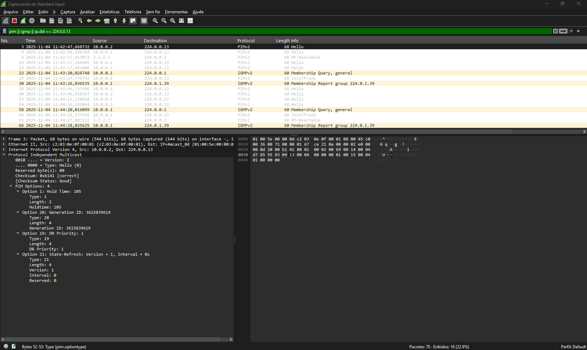
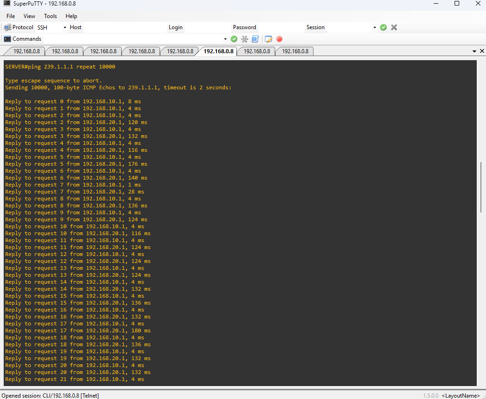
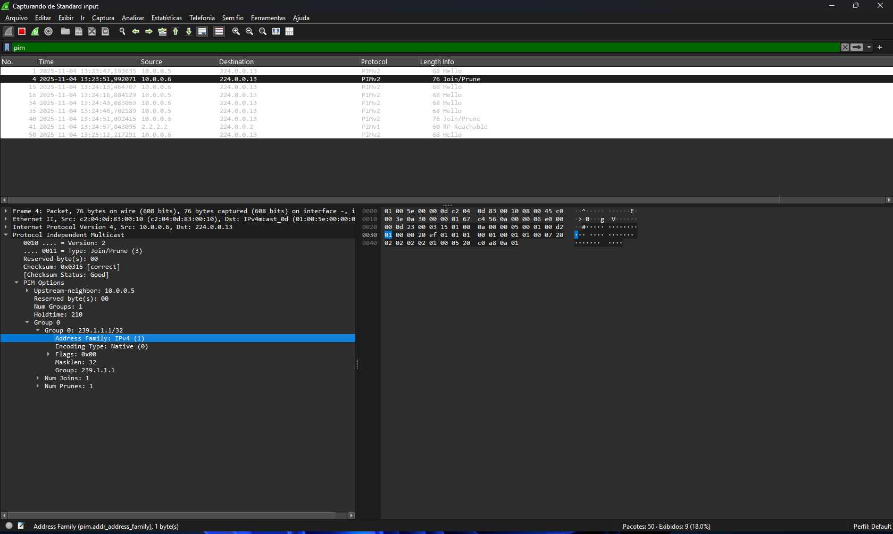

# Índice

- [Índice](#índice)
  - [06 - Exemplo Prático - PIM Sparse Mode com RP manual](#06---exemplo-prático---pim-sparse-mode-com-rp-manual)
  - [🧾 Introdução](#-introdução)
  - [🎯 Objetivo do Laboratório](#-objetivo-do-laboratório)
  - [🌐 Explicação do Cenário](#-explicação-do-cenário)
  - [🧠 Entendendo o papel do RP (Rendezvous Point)](#-entendendo-o-papel-do-rp-rendezvous-point)
    - [🔹 Como o RP atua](#-como-o-rp-atua)
  - [🌳 Formação da Árvore Multicast no PIM-SM](#-formação-da-árvore-multicast-no-pim-sm)
    - [🔁 Passo a passo simplificado](#-passo-a-passo-simplificado)
  - [✳️ Resumo conceitual](#️-resumo-conceitual)
  - [🌐 Topologia do Laboratório](#-topologia-do-laboratório)
    - [🔧 Endereçamento e Funções](#-endereçamento-e-funções)
    - [🧭 Lógica do Cenário](#-lógica-do-cenário)
    - [🧪 Testes Preliminares](#-testes-preliminares)
    - [Onde o PIM deve ser ativado](#onde-o-pim-deve-ser-ativado)
  - [🌀 Observação importante sobre as Loopbacks](#-observação-importante-sobre-as-loopbacks)
  - [📘 No nosso cenário](#-no-nosso-cenário)
  - [🧩 Configurando o RP manual](#-configurando-o-rp-manual)
    - [🔧 Escolha do RP](#-escolha-do-rp)
  - [3️⃣ Comandos de Configuração – RP Manual (PIM Sparse Mode)](#3️⃣-comandos-de-configuração--rp-manual-pim-sparse-mode)
    - [💡 A pegadinha do nome “RP Manual”](#-a-pegadinha-do-nome-rp-manual)
    - [⚙️ Comando principal](#️-comando-principal)
  - [3️⃣ Ativando o Protocolo PIM Sparse Mode](#3️⃣-ativando-o-protocolo-pim-sparse-mode)
    - [🧱 Exemplo prático (R01)](#-exemplo-prático-r01)
    - [🧠 Entendendo o Papel do Designated Router (DR) no PIM Sparse Mode com RP Manual](#-entendendo-o-papel-do-designated-router-dr-no-pim-sparse-mode-com-rp-manual)
    - [🔍 O que o DR realmente faz](#-o-que-o-dr-realmente-faz)
    - [⚙️ Como o DR é escolhido](#️-como-o-dr-é-escolhido)
    - [💬 Entendendo as Mensagens PIM Hello no PIM Sparse Mode (RP Manual)](#-entendendo-as-mensagens-pim-hello-no-pim-sparse-mode-rp-manual)
    - [🧩 Funções das Mensagens Hello](#-funções-das-mensagens-hello)
    - [⚙️ Estrutura das Mensagens PIM Hello](#️-estrutura-das-mensagens-pim-hello)
    - [🔍 Exemplo de Mensagens Hello em Ação](#-exemplo-de-mensagens-hello-em-ação)
  - [⚙️ Configurando o Rendezvous Point Manual (PIM Sparse Mode)](#️-configurando-o-rendezvous-point-manual-pim-sparse-mode)
    - [🧩 1️⃣ Escolha do RP e justificativa](#-1️⃣-escolha-do-rp-e-justificativa)
    - [🧰 2️⃣ Comandos de configuração](#-2️⃣-comandos-de-configuração)
    - [💬 3️⃣ Comportamento do domínio PIM-SM com RP manual](#-3️⃣-comportamento-do-domínio-pim-sm-com-rp-manual)
    - [🔬 4️⃣ Captura e observação via Wireshark](#-4️⃣-captura-e-observação-via-wireshark)
    - [🧾 5️⃣ Validação da configuração](#-5️⃣-validação-da-configuração)
  - [🧩 Troubleshooting – PIM Sparse Mode (RP Manual)](#-troubleshooting--pim-sparse-mode-rp-manual)
    - [1️⃣ Falha de vizinhança PIM](#1️⃣-falha-de-vizinhança-pim)
    - [2️⃣ RP inacessível ou incorreto](#2️⃣-rp-inacessível-ou-incorreto)
    - [3️⃣ Grupos IGMP não aparecem](#3️⃣-grupos-igmp-não-aparecem)
    - [4️⃣ Flags da tabela multicast](#4️⃣-flags-da-tabela-multicast)
    - [5️⃣ Falta de tráfego multicast](#5️⃣-falta-de-tráfego-multicast)
    - [📘 Tabela de Comandos – Referência Rápida](#-tabela-de-comandos--referência-rápida)
    - [🏁 Conclusão](#-conclusão)
  - [📘 Tabela de Comandos](#-tabela-de-comandos)
    - [R01 – Mapping Agent (MA)](#r01--mapping-agent-ma)
    - [📗 R02 – Candidate RP (C-RP)](#-r02--candidate-rp-c-rp)
    - [📙 R03 – Roteador de Trânsito (PIM-SM Participant)](#-r03--roteador-de-trânsito-pim-sm-participant)
    - [📒 R04 – Roteador com Receptor Multicast (Host02)](#-r04--roteador-com-receptor-multicast-host02)
    - [📕 R05 – Roteador com Host Não Inscrito (Host03)](#-r05--roteador-com-host-não-inscrito-host03)
    - [🖥️ SERVER – Fonte Multicast (Sender)](#️-server--fonte-multicast-sender)
    - [💻 HOST02 – Receptor Multicast](#-host02--receptor-multicast)
    - [🖥️ HOST03 – Host Não Inscrito](#️-host03--host-não-inscrito)

## 06 - Exemplo Prático - PIM Sparse Mode com RP manual 

## 🧾 Introdução

Este laboratório foi desenvolvido como parte do meu estudo para a certificação **Cisco CCNP ENCOR (350-401)**, cobrindo o item **3.3.d – Multicast Protocols** do blueprint oficial.  
O objetivo é compreender, de forma prática e aplicada, o funcionamento do protocolo **PIM Sparse Mode (PIM-SM)** em um ambiente Cisco simulado, analisando sua lógica de distribuição seletiva e controlada de tráfego multicast.  
  
Diferente do **PIM Dense Mode**, onde o tráfego é inicialmente inundado na rede (“flood and prune”), o **PIM Sparse Mode** utiliza um **Rendezvous Point (RP)** — um ponto central responsável por interligar as fontes multicast aos receptores interessados.  
Neste cenário, o RP será **definido manualmente**, o que nos permite compreender o funcionamento fundamental do PIM-SM **sem depender de mecanismos automatizados** como Auto-RP ou Bootstrap Router (BSR).  
  
Este estudo tem caráter prático e didático, mostrando como o PIM-SM forma suas árvores multicast (*Shared Tree* e *Shortest Path Tree*) e como as mensagens IGMP e PIM trabalham em conjunto para entregar os fluxos apenas onde são necessários.  
  
---
  
## 🎯 Objetivo do Laboratório  
  
Demonstrar o funcionamento do protocolo **PIM Sparse Mode (PIM-SM)** com definição **manual de RP**, observando na prática como ocorre:

- A formação da **árvore compartilhada (*,G*)** baseada no RP manual.  
- A transição para a **árvore de menor caminho (*S,G*)** conforme o fluxo multicast é estabelecido.  
- O processo de **verificação do caminho reverso (RPF)** em cada roteador.  
- A operação conjunta entre **PIM-SM** e o **OSPF**, garantindo o encaminhamento multicast sobre uma infraestrutura unicast estável.  
  
O laboratório busca reforçar o entendimento de como o RP centraliza o controle da distribuição multicast, tornando o tráfego mais eficiente e previsível — um conceito essencial em redes corporativas de médio e grande porte.  
  
---
  
## 🌐 Explicação do Cenário  

O ambiente já possui o **roteamento unicast completo via OSPF**, permitindo concentrar o foco exclusivamente no **roteamento multicast**.  
  
  

A topologia conta com **oito roteadores Cisco**, dos quais três simulam hosts (servidor e receptores).  
Nos demais, foi configurado o **OSPF** para garantir conectividade IP total entre todas as sub-redes antes da ativação do PIM-SM.  

Neste laboratório:  

- O roteador **R02** atua como **Rendezvous Point (RP)** definido manualmente, com o endereço **2.2.2.2**.  
- O roteador **R01** abriga o **servidor multicast**, responsável por enviar o fluxo para o grupo **239.1.1.1**.  
- O roteador **R04** representa a LAN do **receptor multicast (Host02)**, que envia relatórios IGMP de inscrição no grupo.  
- Os roteadores **R03** e **R05** apenas encaminham o tráfego multicast entre as redes.  
- O **Host03**, conectado a R05, **não participa do grupo multicast**, servindo como referência para observar a ausência de tráfego em segmentos sem inscritos.  

O **RP manual** é configurado em todos os roteadores PIM-SM com o comando:

```ios
ip pim rp-address 2.2.2.2
```

## 🧠 Entendendo o papel do RP (Rendezvous Point)

O **Rendezvous Point (RP)** é o elemento central do protocolo **PIM Sparse Mode (PIM-SM)**.  
Ele funciona como um **ponto de encontro** entre **as fontes multicast (senders)** e **os receptores (receivers)**, responsável por iniciar a árvore compartilhada (*,G*).

### 🔹 Como o RP atua

- As **fontes** registram-se com o RP quando começam a enviar tráfego multicast.  
- Os **receptores** (via IGMP) enviam *joins* que também seguem em direção ao RP.  
- O RP conecta esses dois lados, formando a **Shared Tree (*,G)**.  
- Quando o tráfego começa a fluir, os roteadores podem migrar para o caminho mais curto (**Shortest Path Tree – SPT**), otimizando o fluxo direto entre fonte e receptor.

👉 **Resumo rápido:**  
O RP é necessário apenas no **modo Sparse**, pois é ele que evita o flood de tráfego — o multicast só é encaminhado para quem realmente solicitou participar.

---

## 🌳 Formação da Árvore Multicast no PIM-SM

Diferente do PIM Dense Mode, o **PIM Sparse Mode não faz flood automático**.  
O tráfego multicast **só flui quando há um receptor inscrito** no grupo, e esse processo começa pelo **IGMP Join**.

### 🔁 Passo a passo simplificado

1. O **Host receptor** (ex: 192.168.20.1) envia um **IGMP Join** para o grupo 239.1.1.1.  
2. O **roteador de borda (Designated Router – DR)** aprende que há um receptor interessado.  
3. O DR verifica quem é o RP configurado (neste lab, 2.2.2.2 via `ip pim rp-address`).  
4. O DR então envia um **PIM Join** em direção ao RP, seguindo o caminho unicast.  
5. Cada roteador no caminho cria uma entrada (*,G) na tabela multicast, preparando o caminho até o RP.  
6. Quando o **servidor multicast (192.168.10.1)** começa a transmitir, o roteador da fonte (source DR) envia um **PIM Register** diretamente ao RP.  
7. O RP conecta as duas pontas — a fonte e os receptores — iniciando o fluxo multicast.  
8. Após o tráfego ser estabelecido, os roteadores podem migrar para a **SPT**, criando um caminho direto entre a fonte e o receptor.

---

## ✳️ Resumo conceitual

| **Elemento**              | **Função**                                                                 |
|---------------------------|----------------------------------------------------------------------------|
| **RP (Rendezvous Point)** | Ponto central que conecta fontes e receptores no modo Sparse               |
| **IGMP Join**             | Solicitação feita pelo host para participar de um grupo multicast          |
| **PIM Join**              | Mensagem enviada pelo roteador em direção ao RP                            |
| **PIM Register**          | Mensagem enviada pelo roteador da fonte para registrar o fluxo junto ao RP |
| **(*,G)**                 | Árvore compartilhada baseada no RP                                         |
| **(S,G)**                 | Árvore otimizada (Shortest Path Tree), direta da fonte até o receptor      |

---

📘 **Observação:**  
Neste laboratório, o RP é **configurado manualmente** com o comando abaixo em todos os roteadores PIM-SM:

```ios
ip pim rp-address 2.2.2.2
```

## 🌐 Topologia do Laboratório

A topologia deste laboratório é composta por **cinco roteadores principais (R01 a R05)** e **três hosts simulados** (Server, Host02 e Host03).  
Os hosts são roteadores Cisco configurados de forma simplificada, simulando PCs — com apenas endereçamento IP e adesão a grupos multicast via **IGMP**.  

O protocolo **OSPF** fornece a base unicast para conectividade entre todos os roteadores, enquanto o **PIM Sparse Mode (PIM-SM)** é responsável pelo tráfego multicast.  
Diferente do laboratório anterior, aqui o **Rendezvous Point (RP)** é configurado **manualmente**, oferecendo total controle sobre a topologia e simplificando a análise do fluxo multicast.

---

### 🔧 Endereçamento e Funções

| **Dispositivo** | **Interface** | **Endereço IP / Máscara**  | **Função / Conexão**                                |
|-----------------|---------------|----------------------------|-----------------------------------------------------|
| **R01**         | Loopback0     | 1.1.1.1 /32                | Router-ID OSPF                                      |
|                 | Fa0/0         | 192.168.10.254 /24         | LAN do Server — gateway multicast                   |
|                 | Fa0/1         | 10.0.0.1 /30               | Link com R02 (PIM + OSPF)                           |
|                 | Fa1/0         | 10.0.0.18 /30              | Link com R05 (PIM + OSPF)                           |
| **R02**         | Loopback0     | 2.2.2.2 /32                | **Rendezvous Point (RP)**                           |
|                 | Fa0/0         | 10.0.0.2 /30               | Link com R01 (PIM + OSPF)                           |
|                 | Fa1/0         | 10.0.0.5 /30               | Link com R03 (PIM + OSPF)                           |
| **R03**         | Loopback0     | 3.3.3.3 /32                | Router-ID OSPF                                      |
|                 | Fa0/0         | 10.0.0.6 /30               | Link com R02 (PIM + OSPF)                           |
|                 | Fa1/0         | 10.0.0.9 /30               | Link com R04 (PIM + OSPF)                           |
| **R04**         | Loopback0     | 4.4.4.4 /32                | Router-ID OSPF                                      |
|                 | Fa0/0         | 10.0.0.10 /30              | Link com R03 (PIM + OSPF)                           |
|                 | Fa1/0         | 10.0.0.13 /30              | Link com R05 (PIM + OSPF)                           |
|                 | Fa1/1         | 192.168.20.254 /24         | LAN do Host02 — gateway multicast                   |
| **R05**         | Loopback0     | 5.5.5.5 /32                | Router-ID OSPF                                      |
|                 | Fa0/0         | 10.0.0.14 /30              | Link com R04 (PIM + OSPF)                           |
|                 | Fa1/0         | 10.0.0.17 /30              | Link com R01 (PIM + OSPF)                           |
|                 | Fa0/1         | 192.168.30.254 /24         | LAN do Host03 — gateway sem IGMP join               |
| **Server**      | Fa0/0         | 192.168.10.1 /24           | Fonte multicast (sender)                            |
| **Host02**      | Fa0/0         | 192.168.20.1 /24           | Receptor multicast (`ip igmp join-group 239.1.1.1`) |
| **Host03**      | Fa0/0         | 192.168.30.1 /24           | Host não inscrito (sem join IGMP)                   |

---

### 🧭 Lógica do Cenário

- O **Server (192.168.10.1)** envia tráfego multicast para o grupo **239.1.1.1**.  
- Apenas o **Host02 (192.168.20.1)** envia **IGMP Join**, solicitando participação no grupo.  
- O **Host03** permanece fora do grupo, servindo como comparação para redes sem receptores.  
- O **R02 (2.2.2.2)** atua como **Rendezvous Point manual**, configurado em todos os roteadores com:

```ios
  ip pim rp-address 2.2.2.2
```

- O RPF (Reverse Path Forwarding) valida o caminho reverso até a fonte, garantindo que o tráfego siga a rota correta segundo o OSPF.
- Após a criação da árvore compartilhada (,G), os roteadores podem comutar automaticamente para a árvore de menor custo (SPT – Shortest Path Tree).

### 🧪 Testes Preliminares

Antes de iniciar o multicast, é essencial confirmar que a conectividade IP (via OSPF) está funcional em toda a topologia.
O teste de ping entre os roteadores confirma o roteamento unicast:  


Cada roteador possui uma Loopback usada como Router-ID OSPF, conforme a tabela abaixo:  
  
| Roteador | Loopback |
|----------|----------|
| R01      | 1.1.1.1  |
| R02      | 2.2.2.2  |
| R03      | 3.3.3.3  |
| R04      | 4.4.4.4  |
 |R05      | 5.5.5.5  |

Com isso, podemos ver que todos os hosts se alcançam e se comunicam. Como demonstrado no exemplo anterior, essa é tabela de roteamento, porém ela não faz a comunicação multicast.    
  
⚙️ **Ativando o Roteamento Multicast**  
  
Habilite o roteamento multicast globalmente:  
  
>R01(config)#ip multicast-routing  
  
Valide o status:  

```ios
R01#show ip multicast  
  Multicast Routing: enabled  
  Multicast Multipath: disabled  
  Multicast Route limit: No limit  
  Multicast Triggered RPF check: enabled  
  Multicast Fallback group mode: Sparse  
  Multicast DVMRP Interoperability: disabled  
  Number of multicast boundaries configured with filter-autorp option: 0  
R01#  
```

Após ativar, o próximo passo é habilitar o **PIM Sparse Mode** nas interfaces adequadas.

### Onde o PIM deve ser ativado
  
O PIM-SM só deve ser habilitado nas interfaces que participam efetivamente do domínio multicast — ou seja, onde há interconexão entre roteadores, fonte multicast ou receptores **IGMP**.  
  
Ativar o PIM em interfaces desnecessárias não causa falha, mas torna o ambiente **menos previsível em topologias maiores.**  
Portanto, siga esta regra prática:  

✅ **Resumo da regra prática para PIM-SM**  

| Situação                           | PIM deve ser ativado?    | Motivo                                                         |
|------------------------------------|--------------------------|----------------------------------------------------------------|
| Interface entre roteadores         | ✅ Sim                   | Necessário para formar vizinhança PIM e propagar joins/prunes  |
| Interface com host receptor (IGMP) | ✅ Sim                   | Permite que o roteador DR receba e encaminhe IGMP Reports      |
| Interface com fonte multicast      | ✅ Sim                   | Permite que o roteador DR da fonte envie PIM Register ao RP    |
| Interface Loopback usada como RP   | ✅ Sim                   | O RP precisa estar ativo no domínio PIM                        |
| Loopback apenas como Router-ID     | ⚙️ Opcional              | Apenas usada como origem lógica dos pacotes PIM                |

## 🌀 Observação importante sobre as Loopbacks

No **PIM Sparse Mode com RP manual**, as interfaces **Loopback** ganham um papel mais direto e previsível.  

- Se a Loopback for usada como endereço do **Rendezvous Point (RP)** (definido manualmente com o comando `ip pim rp-address <loopback>`), o **PIM deve estar habilitado nela**.  
- Se ela for usada apenas como **Router-ID** do OSPF ou PIM, **não há necessidade de ativar o PIM** nessa interface.  

💡 **Boa prática:**  
Mesmo que o laboratório utilize um único RP definido manualmente, é recomendável habilitar o **`ip pim sparse-mode`** em todas as interfaces de **Loopback** — assim garantimos consistência e simplificamos o processo de verificação e troubleshooting.

---
  
## 📘 No nosso cenário

Neste laboratório, o PIM será ativado em todas as interfaces que fazem parte do **domínio multicast**, incluindo:  

- Todas as interfaces **ponto a ponto entre roteadores** (R01–R02, R02–R03, R03–R04, R04–R05 e R05–R01);  
- Interfaces conectadas às **LANs dos hosts** (Server, Host02 e Host03);  
- E as **Loopbacks**, com atenção especial para aquela que atuará como endereço do RP.

🔹 **Funções práticas das Loopbacks:**

- Se usadas **apenas como Router-ID do OSPF**, o PIM é opcional;
- Se usadas como **endereço do RP**, o PIM é obrigatório;
- Como boa prática, neste cenário, o **PIM será ativado em todas as Loopbacks**.

---

## 🧩 Configurando o RP manual

Diferente do **Auto-RP da Cisco**, o método **manual** exige que o administrador defina explicitamente qual roteador será o **Rendezvous Point (RP)**, e que essa informação seja configurada em todos os roteadores do domínio PIM-SM.  

Esse método é simples, direto e **independe de anúncios multicast adicionais** (como os grupos 224.0.1.39 e 224.0.1.40 usados pelo Auto-RP).  
Ele é ideal para **laboratórios, topologias pequenas** ou ambientes controlados onde o RP é fixo.

---

### 🔧 Escolha do RP

No nosso cenário, o **R01** será o **RP manual**.  
Utilizaremos sua **Loopback0 (1.1.1.1)** como endereço de referência, pois é uma interface lógica estável e sempre alcançável via OSPF.

```ios
R01(config)# ip pim sparse-mode
R01(config)# ip pim rp-address 1.1.1.1
```

Agora, o mesmo comando deve ser replicado em todos os demais roteadores do domínio PIM-SM:  

```ios
R02(config)# ip pim rp-address 1.1.1.1
R03(config)# ip pim rp-address 1.1.1.1
R04(config)# ip pim rp-address 1.1.1.1
R05(config)# ip pim rp-address 1.1.1.1
```

💡 **Importante:**  
  
O endereço informado deve ser alcançável via unicast (OSPF).  
Isso garante que as mensagens PIM Register e PIM Join consigam chegar até o RP sem depender de broadcast ou flooding.  
  
🧠 **Vantagens do RP manual**  

| Vantagem            | Descrição                                                                      |
|-------------------- |--------------------------------------------------------------------------------|
| 🎯 Simplicidade    | Fácil de configurar e visualizar em laboratórios ou topologias pequenas.       |
| 🔒 Controle total  | O administrador define explicitamente qual roteador será o RP.                 |
| 🧩 Previsibilidade | Todos os roteadores sabem de antemão qual é o RP, sem depender de anúncios.    |
| 🧱 Estabilidade    | Não há troca dinâmica de RP, evitando mudanças inesperadas.                    |  

⚙️ **Resumo conceitual**

- O **Rendezvous Point (RP)** é o ponto central da **árvore compartilhada (*,G)**;
- Os **roteadores receptores (DRs)** enviam PIM Joins em direção ao RP;
- Os roteadores das fontes **(senders)** enviam PIM Register diretamente ao RP;
- Após o fluxo inicial, ocorre a migração automática para a **SPT (Shortest Path Tree)**, otimizando o caminho.

✅ **Verificação básica**  
  
Após a configuração, podemos validar o aprendizado do RP com o comando:  

```ios
R03# show ip pim rp mapping
Group: 224.0.0.0/4, RP: 1.1.1.1, Info source: static
```
  
O campo **“Info source: static”** confirma que o RP foi configurado manualmente e está ativo no domínio multicast.  

🧭 **Conclusão dessa etapa**
  
Com o RP definido manualmente, eliminamos a dependência de mecanismos proprietários e tornamos o processo mais previsível.  
Esse tipo de configuração é ideal para ambientes de estudo, validação de conceito (PoC) ou cenários corporativos estáticos.  
  
Nos próximos passos, partiremos para os testes práticos de tráfego multicast, analisando a formação da **árvore (*,G)** e a posterior comutação para a **SPT (S,G)**.  

## 3️⃣ Comandos de Configuração – RP Manual (PIM Sparse Mode)

### 💡 A pegadinha do nome “RP Manual”

Apesar do modo **PIM Sparse Mode (PIM-SM)** parecer complexo, a configuração manual do **Rendezvous Point (RP)** é, na verdade, **simples e direta** — porém, **depende 100% da configuração do administrador**.  
Diferente do **Auto-RP**, aqui **não existe eleição ou anúncio automático**: o endereço do RP é informado explicitamente em cada roteador do domínio multicast.  

🧠 **Analogia simples — pense como um ponto de encontro fixo:**  

- Em vez de eleger um RP automaticamente, **o administrador escolhe um roteador específico** (ex: R02) para atuar como RP.  
- Todos os roteadores do domínio são **instruídos manualmente** a encaminhar os joins em direção a esse endereço.  
- É como combinar previamente:  
  > “Todo mundo que quiser participar do grupo multicast, encontra o RP no endereço 2.2.2.2.”

---

### ⚙️ Comando principal

O comando usado em todos os roteadores é:

```ios
ip pim rp-address <endereço_RP>
```

💡 **Exemplo do laboratório:**
No nosso cenário, o **R02 (2.2.2.2) foi definido como o Rendezvous Point**.  
Logo, em todos os roteadores do domínio PIM-SM (R01 a R05), configuramos:

```ios
ip pim rp-address 2.2.2.2
```

🧱 **Definição dos Papéis no Laboratório**

| Função                                 | Roteador             | Endereço | Justificativa                                                              |
|----------------------------------------|----------------------|----------|----------------------------------------------------------------------------|
| Rendezvous Point (RP)                  | R02                  | 2.2.2.2  | Roteador central na topologia, com boa conectividade e posição estratégica |
| Demais Roteadores (R01, R03, R04, R05) | Participantes PIM-SM | —        | Encaminham joins e registros diretamente para o RP definido                |
  
🧩 **Funcionamento resumido do RP Manual**  

1. O roteador R02 (RP) aguarda registros **PIM Register das fontes multicast**.
2. Os receptores (via IGMP Join) fazem com que os DRs (Designated Routers) enviem **PIM Join até o endereço 2.2.2.2**.
3. Cada roteador cria entradas **(*,G)** na tabela multicast, indicando o caminho até o RP.
4. Assim que o fluxo é estabelecido, pode ocorrer a mudança para a **SPT (Shortest Path Tree)**, permitindo o caminho direto entre fonte e receptor.

👉 Resumo final:  

> O RP Manual é o método mais previsível e estável para laboratórios e ambientes controlados.  
> Ele dispensa anúncios multicast de Auto-RP, reduz complexidade e permite observar com clareza o funcionamento do PIM Sparse Mode, desde a descoberta de fontes até a comutação para a árvore SPT.  

## 3️⃣ Ativando o Protocolo PIM Sparse Mode

Agora que entendemos a lógica do **PIM Sparse Mode** e definimos o **RP manual**, vamos ativar o protocolo em todas as interfaces que participam do domínio multicast — ou seja, **todas as interfaces conectadas entre roteadores e sub-redes dos hosts**.  
  
Nos roteadores **R01 a R05**, aplicamos o comando `ip pim sparse-mode` nas interfaces de roteamento.  

---

### 🧱 Exemplo prático (R01)
  
Primeiro, verificamos as interfaces ativas no roteador:  
  
```ios
R01#show ip interface brief
Interface                  IP-Address      OK? Method Status                Protocol
FastEthernet0/0            192.168.10.254  YES NVRAM  up                    up
FastEthernet0/1            10.0.0.1        YES NVRAM  up                    up
FastEthernet1/0            10.0.0.18       YES NVRAM  up                    up
Loopback0                  1.1.1.1         YES NVRAM  up                    up
```

Em seguida, ativamos o PIM Sparse Mode em cada uma delas:  

```ios
R01(config)#interface f0/0
R01(config-if)#ip pim sparse-mode
*Mar  1 02:00:05.663: %PIM-5-DRCHG: DR change from neighbor 0.0.0.0 to 192.168.10.254 on interface FastEthernet0/0

R01(config)#interface f0/1
R01(config-if)#ip pim sparse-mode
*Mar  1 02:00:20.615: %PIM-5-DRCHG: DR change from neighbor 0.0.0.0 to 10.0.0.1 on interface FastEthernet0/1

R01(config)#interface f1/0
R01(config-if)#ip pim sparse-mode
*Mar  1 02:00:36.563: %PIM-5-DRCHG: DR change from neighbor 0.0.0.0 to 10.0.0.18 on interface FastEthernet1/0

R01(config)#interface loopback0
R01(config-if)#ip pim sparse-mode
*Mar  1 00:18:25.859: %PIM-5-DRCHG: DR change from neighbor 0.0.0.0 to 1.1.1.1 on interface Loopback0
```

Essas mensagens **%PIM-5-DRCHG** indicam que o roteador se elegeu Designated Router (DR) em cada rede — o primeiro sinal de que o PIM está ativo e operante.  

---

🧩 **Verificando a Tabela de Roteamento Multicast**  
  
Após ativar o PIM, podemos observar a tabela de roteamento multicast:  

```ios
R01#show ip mroute
IP Multicast Routing Table
Flags: D - Dense, S - Sparse, B - Bidir Group, s - SSM Group, C - Connected,
       L - Local, P - Pruned, R - RP-bit set, F - Register flag,
       T - SPT-bit set, J - Join SPT, M - MSDP created entry,
       X - Proxy Join Timer Running, A - Candidate for MSDP Advertisement,
       U - URD, I - Received Source Specific Host Report,
       Z - Multicast Tunnel, z - MDT-data group sender,
       Y - Joined MDT-data group, y - Sending to MDT-data group
Outgoing interface flags: H - Hardware switched, A - Assert winner
Timers: Uptime/Expires
Interface state: Interface, Next-Hop or VCD, State/Mode
```

Neste momento, a tabela ainda exibe apenas grupos internos (como 224.0.0.x), usados para comunicação entre roteadores PIM.  
Isso é esperado, pois ainda não há fontes ou receptores multicast ativos — o domínio PIM está inicializado, mas sem tráfego de grupo.  

🧠 **Conclusão desta etapa**  
  
Com o PIM Sparse Mode ativado em todas as interfaces:  

- Os roteadores agora trocam mensagens PIM Hello e formam vizinhanças PIM.
- O domínio multicast está pronto para receber registros de fontes e joins de receptores.
- O próximo passo será verificar a formação das vizinhanças e confirmar se todos os roteadores conhecem o RP manual (2.2.2.2).
  
🔍 **Nota: nesta etapa, ainda não realizamos captura de pacotes, pois o tráfego multicast de controle é mínimo.**

### 🧠 Entendendo o Papel do Designated Router (DR) no PIM Sparse Mode com RP Manual

Ao habilitarmos o **PIM Sparse Mode** nas interfaces, cada rede local (LAN) que possui mais de um roteador precisa definir **quem será o “porta-voz” daquele segmento** no domínio multicast.  
Esse roteador é conhecido como **Designated Router (DR)** — e é ele quem interage diretamente com o **Rendezvous Point (RP)** e com os **hosts multicast**.

Mesmo em ambientes com **RP configurado manualmente**, a escolha do **DR** continua acontecendo de forma **automática** entre os roteadores participantes do PIM.

---

### 🔍 O que o DR realmente faz

O **DR** é o roteador que “fala pela rede local” dentro do domínio multicast.  
Ele tem duas funções principais:

| Situação                                   | Responsabilidade do DR |
|--------------------------------------------|------------------------|
| **Rede com receptores (hosts multicast)**  | Recebe as mensagens **IGMP Report** dos hosts interessados e envia **PIM Join** em direção ao **RP configurado manualmente** (2.2.2.2). |
| **Rede com fontes multicast (servidores)** | Detecta o tráfego multicast local e envia **PIM Register** diretamente ao RP, para que o grupo seja conhecido por todo o domínio. |

Assim, o DR é o **elo entre os dispositivos de borda e o RP**, garantindo que o tráfego multicast seja distribuído de forma controlada e sem redundância.

---

### ⚙️ Como o DR é escolhido

A eleição do DR acontece **automaticamente** entre os roteadores PIM de uma mesma rede.    
Não há comandos específicos para isso — o processo faz parte do protocolo.  

🔸 **Critério de escolha:**  
  
- O roteador com o **maior endereço IP ativo** na interface vence.  
- Se houver empate (raro), usa-se o **Router-ID PIM** (normalmente o da Loopback) para desempatar.
  
🔸 **Exemplo real do log:**  
  
```ios
*Mar  1 02:00:36.563: %PIM-5-DRCHG: DR change from neighbor 0.0.0.0 to 10.0.0.18 on interface FastEthernet1/0
```

🔹 **Como interpretar:**  
  
- A mensagem indica que houve mudança de DR na interface FastEthernet1/0.
- O roteador 10.0.0.18 foi eleito o novo Designated Router.
- O endereço 0.0.0.0 mostra que não havia DR anterior — ou seja, essa foi a primeira eleição no segmento.

🚫 **PIM não tem BDR**  
  
Diferente do OSPF, o PIM não utiliza Backup Designated Router (BDR).  
Existe somente um DR por rede multicast.  
  
Se o DR atual deixar de enviar mensagens PIM Hello (por padrão, a cada 30 segundos), os demais roteadores percebem a ausência e elegem automaticamente o próximo com maior IP ativo, sem afetar o funcionamento do domínio multicast.  

🧭 **Resumo prático**

| Item                         | PIM Dense Mode            | PIM Sparse Mode (RP Manual) |
|------------------------------|---------------------------|-----------------------------|
| DR existe?                   | Sim, mas papel secundário | ✅ Sim, papel essencial    |
| BDR existe?                  | ❌ Não                   | ❌ Não                      |
| Flood de tráfego             | ✅ Sim                   | ❌ Não                      |
| Comunicação com RP           | ❌ Não usa RP            | ✅ Sim, via DR              |
| Envio de PIM Join / Register | Todos enviam             | ✅ Apenas o DR envia        |  

🧩 **Conclusão desta etapa**  
  
No PIM Sparse Mode com RP manual, o Designated Router (DR) é quem organiza a comunicação multicast de forma inteligente e eficiente.  
Ele centraliza o envio dos joins e registers, evitando duplicidade de tráfego e garantindo que o RP (2.2.2.2) receba apenas informações consolidadas de cada rede.  
  
> 🔍 Nesta etapa ainda não faremos captura de pacotes, pois o objetivo é compreender a função do DR e validar a formação das vizinhanças PIM. As análises de fluxo serão feitas mais adiante, quando o multicast estiver ativo.

### 💬 Entendendo as Mensagens PIM Hello no PIM Sparse Mode (RP Manual)

As mensagens **PIM Hello** são o ponto de partida de toda a comunicação entre roteadores PIM dentro do domínio multicast.  
São elas que permitem que os roteadores **se descubram, troquem informações e mantenham a vizinhança ativa** — algo fundamental para o funcionamento do **PIM Sparse Mode**, independentemente de o RP ser configurado manualmente ou via Auto-RP.

Assim que ativamos o PIM nas interfaces, os roteadores começam automaticamente a enviar mensagens Hello para o endereço **224.0.0.13**, estabelecendo a base da comunicação multicast de controle.

---

### 🧩 Funções das Mensagens Hello

| Função                         | Descrição                                                                           |
|--------------------------------|-------------------------------------------------------------------------------------|
| **Descoberta de vizinhos PIM** | Permite que roteadores na mesma LAN se reconheçam e formem uma vizinhança PIM.      |
| **Manutenção da vizinhança**   | Mantém os roteadores ativos trocando Hellos periodicamente (a cada 30 segundos).    |
| **Eleição do DR**              | Define qual roteador atuará como **Designated Router (DR)** no segmento local.      |
| **Troca de parâmetros**        | Anuncia capacidades e temporizadores, como DR Priority e Holdtime.                  |
| **Detecção de falhas**         | Se o roteador parar de enviar Hellos dentro do tempo limite, é considerado inativo. |

Essas funções garantem que o domínio PIM permaneça estável, sincronizado e pronto para enviar mensagens **Join** e **Register** ao RP.  

---

### ⚙️ Estrutura das Mensagens PIM Hello

Cada mensagem Hello contém um conjunto de opções negociadas entre os roteadores vizinhos.  
Esses parâmetros definem como o PIM opera no segmento.  

| Campo              | Descrição                                                                 | Valor típico                           |
|--------------------|---------------------------------------------------------------------------|----------------------------------------|
| **Type**           | Tipo da mensagem PIM (**Hello = 0x00**)                                   | 0x00                                   |
| **Holdtime**       | Tempo máximo para considerar o vizinho ativo sem novos Hellos             | 105 segundos (3,5 × intervalo)         |
| **DR Priority**    | Prioridade do roteador na eleição de DR                                   | 1 (padrão Cisco)                       |
| **Generation ID**  | Identificador único do roteador; muda quando o roteador é reiniciado      | Valor aleatório                        |
| **Hello Interval** | Intervalo entre Hellos enviados                                           | 30 segundos (padrão Cisco)             |
| **PIM Mode**       | Indica o modo de operação do protocolo                                    | Sparse (modo atual do laboratório)     |

Esses valores garantem que todos os roteadores dentro do mesmo segmento PIM operem com parâmetros compatíveis.  
  
---
  
### 🔍 Exemplo de Mensagens Hello em Ação
  
Após ativar o **PIM Sparse Mode** nas interfaces, os roteadores trocam Hellos e formam automaticamente suas vizinhanças.  
As mensagens de log indicam tanto o recebimento de Hellos válidos quanto as mudanças de DR:  

```ios
*Mar  1 02:00:05.663: %PIM-5-DRCHG: DR change from neighbor 0.0.0.0 to 192.168.10.254 on interface FastEthernet0/0
*Mar  1 02:00:20.615: %PIM-5-DRCHG: DR change from neighbor 0.0.0.0 to 10.0.0.1 on interface FastEthernet0/1
*Mar  1 02:00:36.563: %PIM-5-DRCHG: DR change from neighbor 0.0.0.0 to 10.0.0.18 on interface FastEthernet1/0
```

🧠 **Interpretação:**

- O roteador recebeu Hellos válidos e estabeleceu vizinhança PIM.
- Com base nos parâmetros trocados, o PIM realizou a eleição automática de DR para cada interface.
- O endereço que aparece após “to” representa o novo DR naquele segmento.

🧭 **Resumo Prático**

| Ação / Evento                             | Tipo de Mensagem  | Destino    | TTL | Finalidade                           |
|-------------------------------------------|-------------------|------------|-----|--------------------------------------|
| Descoberta e manutenção de vizinhos       | Hello             | 224.0.0.13 | 1   | Mantém a vizinhança PIM ativa        |
| Eleição de DR                             | Hello             | 224.0.0.13 | 1   | Define o roteador responsável na LAN |
| Detecção de falha                         | Ausência de Hello | —          | —   | Remove vizinho inativo               |

🧩 **Conclusão desta etapa**

> As mensagens PIM Hello são o primeiro sinal de vida do protocolo multicast.
> Elas estabelecem a vizinhança, permitem a eleição de DR e garantem que o domínio PIM esteja sincronizado antes mesmo do tráfego multicast começar a fluir.

## ⚙️ Configurando o Rendezvous Point Manual (PIM Sparse Mode)

Agora que o **PIM Sparse Mode (PIM-SM)** está habilitado em todas as interfaces, o domínio multicast já pode operar com um **Rendezvous Point (RP)** definido manualmente.  
Nesse modo, **não há eleição nem anúncios automáticos** — o administrador define **explicitamente** qual roteador será o RP e informa esse endereço a todos os demais roteadores do domínio multicast.  

🧠 **Analogia simples — ponto de encontro fixo**  

Pense que os roteadores são pessoas espalhadas em uma cidade.  
O RP é o **ponto de encontro combinado** — todos sabem de antemão para onde devem ir.  
Não há “votação” nem anúncio automático:  
> “Se quiser participar do grupo multicast, envie o join para o RP 2.2.2.2.”

---

### 🧩 1️⃣ Escolha do RP e justificativa

| Função                                     | Roteador             | Loopback usada | Justificativa técnica                                                                        |
|--------------------------------------------|----------------------|----------------|----------------------------------------------------------------------------------------------|
| **Rendezvous Point (RP)**                  | **R02**              | **2.2.2.2**    | Centralizado no domínio PIM, boa conectividade e caminho reduzido até as sub-redes multicast |
| **Demais roteadores (R01, R03, R04, R05)** | Participantes PIM-SM | —              | Encaminham joins e registros diretamente para o RP configurado manualmente                   |

📌 **Regras práticas (Cisco e CCNP):**  
  
- O RP precisa estar **sempre acessível via rota unicast**.  
- Todas as interfaces (inclusive loopbacks) que participam do domínio PIM devem ter o **PIM Sparse Mode** habilitado.  
- A **loopback do RP** deve ter o **PIM ativo**, pois ela é o ponto lógico usado na árvore multicast (*,G).

---

### 🧰 2️⃣ Comandos de configuração

➡️ **No roteador R02 (RP):**

```ios
R02(config)#interface loopback0
R02(config-if)#ip pim sparse-mode
```

➡️ Nos demais roteadores (R01, R03, R04, R05):  

```ios
R(config)#ip pim rp-address 2.2.2.2
```

🔎 **Explicação:**  

- **ip pim sparse-mode**: ativa o PIM-SM na interface (necessário em todas que participam da topologia).
- **ip pim rp-address 2.2.2.2**: informa manualmente o endereço do RP para todo o domínio multicast.

🧠 **Boa prática:**  

Para laboratórios, é comum usar o loopback do RP (2.2.2.2) como endereço fixo, evitando problemas se a interface física cair.  
  
### 💬 3️⃣ Comportamento do domínio PIM-SM com RP manual

Com o RP configurado manualmente:  

- O roteador DR (Designated Router) de cada rede onde há receptores IGMP envia mensagens **PIM Join** em direção ao RP.
- O RP (R02) recebe mensagens **PIM Register** das fontes multicast.
- A árvore inicial é criada como uma **Shared Tree (*,G)** com o RP como raiz.
- Assim que o tráfego começa, os roteadores podem mudar para a **Shortest Path Tree (S,G)** para otimizar o fluxo.

### 🔬 4️⃣ Captura e observação via Wireshark

Após ativar o PIM Sparse Mode e definir o RP manual, é possível observar os padrões de comunicação multicast entre os roteadores.  
A captura deve ser feita em qualquer interface que participe do PIM (por exemplo, um enlace entre R01 e R02).  

🧩 **O que você verá no tráfego:**

| Tipo de Mensagem       | Protocolo        | Função                                              | Observação                           |
|------------------------|------------------|-----------------------------------------------------|--------------------------------------|
| PIM Hello              | PIMv2 (Type 0)   | Descoberta de vizinhos PIM                          | TTL = 1, destino 224.0.0.13          |
| PIM Register           | PIMv2 (Type 1)   | Enviado pela DR da fonte até o RP                   | Contém o endereço da fonte multicast |
| PIM Join/Prune         | PIMv2 (Type 3/4) | Solicitação de entrada ou saída de grupos multicast | TTL = 1, destino 224.0.0.13          |
| IGMP Membership Report | IGMPv2           | Indica que um host quer receber o grupo multicast   | TTL = 1, destino 224.0.0.22          |

💡 **Filtro Wireshark recomendado:**

```Whireshark
pim || igmp || ip.dst == 224.0.0.13
```

  

### 🧾 5️⃣ Validação da configuração

🔹 Verificar vizinhos PIM

```ios
R01#show ip pim neighbor
PIM Neighbor Table
Neighbor Address     Interface           Uptime/Expires    Ver   DR Prio/Mode
10.0.0.2             Fa0/1               00:10:23/00:01:33 v2    1 / Sparse
10.0.0.18            Fa1/0               00:08:44/00:01:21 v2    1 / Sparse
```

✅ Todos os roteadores devem ver seus vizinhos diretos com modo “Sparse”.  
  
🔹 Verificar o RP configurado manualmente  

```ios
R01#show ip pim rp mapping
PIM Group-to-RP Mappings
Group(s) 224.0.0.0/4
  RP 2.2.2.2 (?), Static
    Info source: static
```

✅ A saída mostra que o RP foi definido manualmente e é o 2.2.2.2 (R02).  
  
🔹 Verificar tabela multicast

```ios
R01#show ip mroute
(*, 239.1.1.1), 00:01:23/00:02:36, RP 2.2.2.2, flags: SJCL
  Incoming interface: FastEthernet0/1, RPF nbr 10.0.0.2
  Outgoing interface list:
    FastEthernet0/0, Forward/Sparse
```

✅ Confirma a árvore (*,G) estabelecida com o RP como raiz.  
  
🔹 Verificar grupos IGMP nos hosts

```ios
HOST02#show ip igmp groups
Group Address    Interface          Uptime    Expires   Last Reporter
239.1.1.1        FastEthernet0/0    00:02:11  00:02:37  192.168.20.1
```

🎯 **Conclusão desta etapa**

O modo **PIM Sparse Mode com RP manual** fornece total controle sobre o ponto de encontro multicast.  
É o método ideal para laboratórios, ambientes pequenos ou controlados, e para entender visualmente a formação das **árvores (*,G) e (S,G).**
Além disso, elimina dependências de mecanismos **proprietários como o Auto-RP**, tornando o comportamento mais **previsível e didático**.

## 🧩 Troubleshooting – PIM Sparse Mode (RP Manual)

Nesta seção, vamos revisar como diagnosticar **falhas comuns no PIM Sparse Mode** e validar a comunicação entre **fonte, RP e receptores**.  
O foco aqui é entender **onde o tráfego multicast pode parar** e **como detectar o ponto de falha**.  

---

### 1️⃣ Falha de vizinhança PIM

Se o comando abaixo não mostrar vizinhos, **nenhuma troca PIM ocorrerá**.

```ios
show ip pim neighbor
```

🧭 **Verifique:**

- Se o PIM está ativo (ip pim sparse-mode) nas interfaces dos dois lados.
- Se não há ACLs bloqueando o grupo 224.0.0.13 (usado pelos Hellos PIM).
- Se a interface está no mesmo domínio IP.

✅ Dica: use o Wireshark e filtre:

```whireshark
pim && ip.dst == 224.0.0.13
```

Se você não visualizar pacotes PIM Hello, a vizinhança não se formará.

### 2️⃣ RP inacessível ou incorreto

Se o RP estiver configurado errado ou inalcançável, os roteadores não conseguirão formar a árvore multicast.  

```ios
show ip pim rp mapping
```

🔍 **Sinais do problema:**

- RP incorreto ou ausente na saída.
- Grupos (*,G) não aparecem na tabela multicast.

✅ **Soluções:**  

Corrija o endereço com:  

```ios
ip pim rp-address 2.2.2.2
```

Teste a conectividade unicast com ping 2.2.2.2.  

### 3️⃣ Grupos IGMP não aparecem

Se o host multicast (receptor) não aparece no roteador local:  

```ios
show ip igmp groups
```

🔍 Sinais do problema:

Nenhum grupo listado na LAN.

O DR (Designated Router) não cria entrada (*,G) no show ip mroute.

✅ **Soluções:**

- Verifique se o host realmente fez **join-group.**
- Confira se a interface está no modo **PIM Sparse Mode**.
- Teste IGMP no Wireshark:

```whireshark
igmp && ip.dst == 224.0.0.22
```

### 4️⃣ Flags da tabela multicast

O comando abaixo mostra a árvore multicast e o estado de cada fluxo:  

| Flag | Significado | Descrição                                            |
|------|-------------|------------------------------------------------------|
| S    | Sparse      | Grupo opera em modo Sparse Mode                      |
| J    | Join        | Houve solicitação de join para o grupo               |
| C    | Connected   | Há receptores conectados à interface                 |
| L    | Local       | Fonte multicast está diretamente conectada           |
| T    | SPT         | Árvore do tipo Shortest Path Tree (fonte → receptor) |
| P    | Pruned      | Ramo foi removido da árvore (sem receptores ativos)  |

✅ **Exemplo prático:**

```ios
(*, 239.1.1.1), 00:01:23/00:02:36, RP 2.2.2.2, flags: SJCL
  Incoming interface: FastEthernet0/1, RPF nbr 10.0.0.2
  Outgoing interface list:
    FastEthernet0/0, Forward/Sparse
```

**Interpretação:**  

O roteador aprendeu o **RP manualmente (2.2.2.2)**, há **receptores conectados (C)** e a interface de saída está encaminhando o fluxo.

### 5️⃣ Falta de tráfego multicast

Mesmo com PIM e IGMP funcionando, pode não haver fluxo real se o servidor multicast não estiver enviando pacotes.  

✅ **Verifique:**

- Se o servidor (192.168.10.1) está transmitindo para o grupo correto (239.1.1.1).
- Se o roteador DR da LAN da fonte envia mensagens PIM Register ao RP.

  

  

### 📘 Tabela de Comandos – Referência Rápida

Abaixo estão os comandos essenciais utilizados no laboratório **PIM Sparse Mode com RP Manual**.  

| Categoria                      | Comando                        | Descrição                                                 |
|----------------------------- --|--------------------------------|-----------------------------------------------------------|  
| Ativar multicast globalmente   | `ip multicast-routing`         | Habilita o roteamento multicast no roteador               |
| Ativar PIM-SM em uma interface | `ip pim sparse-mode`           | Habilita o PIM Sparse Mode na interface                   |
| Definir RP manual              | `ip pim rp-address 2.2.2.2`    | Define o RP manualmente para todo o domínio PIM           |
| Verificar vizinhos PIM         | `show ip pim neighbor`         | Exibe as adjacências PIM formadas                         |
| Verificar RP configurado       | `show ip pim rp mapping`       | Mostra o RP em uso (manual ou dinâmico)                   |
| Verificar tabela multicast     | `show ip mroute`               | Exibe grupos **(*,G) e (S,G)** com suas interfaces ativas |
| Verificar grupos IGMP          | `show ip igmp groups`          | Lista os grupos multicast ativos em interfaces locais     |
| Verificar interfaces PIM       | `show ip pim interface`        | Mostra em quais interfaces o PIM-SM está habilitado       |
| Testar conectividade até o RP  | `ping 2.2.2.2`                 | Testa caminho unicast entre roteadores e o RP             |
| Monitorar pacotes multicast    | `debug ip pim / debug ip igmp` |	Mostra em tempo real as mensagens PIM e IGMP              |

### 🏁 Conclusão

Com esta última etapa, o laboratório PIM Sparse Mode com RP manual está oficialmente concluído ✅  

Foram abordados:  

- Conceitos fundamentais do PIM-SM.
- Configuração completa dos roteadores Cisco.
- Validação funcional com show e Wireshark.
- Diagnóstico prático de falhas (troubleshooting).

💡 Este cenário fornece uma base sólida para estudos avançados, como:  

- Comutação para Shortest Path Tree (SPT).
- Comparativo com Auto-RP e Bootstrap Router (BSR).
- Integração multicast em ambientes corporativos ou de streaming IP.

## 📘 Tabela de Comandos

### R01 – Mapping Agent (MA)

| **Seção**                | **Comando / Configuração**                                                                     | **Descrição**                                            |
|--------------------------|------------------------------------------------------------------------------------------------|----------------------------------------------------------|
| **Global**               | `ip multicast-routing`                                                                         | Habilita o roteamento multicast globalmente              |
|                          | `ip pim autorp listener`                                                                       | Permite escutar mensagens Auto-RP em interfaces não PIM  |
|                          | `ip pim send-rp-discovery Loopback0 scope 16`                                                  | Define R01 como **Mapping Agent (MA)** no domínio PIM-SM |
| **Interface Loopback0**  | `ip address 1.1.1.1 255.255.255.255`<br>`ip pim sparse-mode`                                   | Identificação do roteador e ativação PIM na Loopback     |
| **Fa0/0 (LAN Server)**   | `ip address 192.168.10.254 255.255.255.0`<br>`ip pim sparse-mode`<br>`ip ospf network point-to-point` | Gateway do servidor multicast                     |
| **Fa0/1 (Link com R02)** | `ip address 10.0.0.1 255.255.255.252`<br>`ip pim sparse-mode`<br>`ip ospf network point-to-point`     | Conexão P2P com R02                               |
| **Fa1/0 (Link com R05)** | `ip address 10.0.0.18 255.255.255.252`<br>`ip pim sparse-mode`<br>`ip ospf network point-to-point`    | Conexão P2P com R05                               |
| **OSPF**                 | `router ospf 100`<br>`router-id 1.1.1.1`<br>`network 1.1.1.1 0.0.0.0 area 0`<br>`network 10.0.0.0 0.0.0.3 area 0`<br>`network 10.0.0.16 0.0.0.3 area 0`<br>`network 192.168.10.0 0.0.0.255 area 0`                                                                                      | Configuração OSPF para conectividade unicast      |
| **Função no Auto-RP**    | **Mapping Agent (MA)**                                                      | Responsável por ouvir anúncios e distribuir o RP ativo (grupo 224.0.1.39)  | 

### 📗 R02 – Candidate RP (C-RP)

| **Seção**                | **Comando / Configuração**                                                                        | **Descrição**                                      |
|--------------------------|---------------------------------------------------------------------------------------------------|----------------------------------------------------|
| **Global**               | `ip multicast-routing`                                                                            | Habilita o roteamento multicast globalmente        |
|                          | `ip pim autorp listener`                                                                | Permite escutar anúncios Auto-RP mesmo em interfaces não PIM |
|                          | `ip pim send-rp-announce Loopback0 scope 16`                                                      | Define R02 como **Candidate RP (C-RP)**            |
| **Interface Loopback0**  | `ip address 2.2.2.2 255.255.255.255`<br>`ip pim sparse-mode`                                      | Identificação e habilitação PIM                    |
| **Fa0/1 (Link com R01)** | `ip address 10.0.0.2 255.255.255.252`<br>`ip pim sparse-mode`<br>`ip ospf network point-to-point` | Conexão P2P com R01                                |
| **Fa1/0 (Link com R03)** | `ip address 10.0.0.5 255.255.255.252`<br>`ip pim sparse-mode`<br>`ip ospf network point-to-point` | Conexão P2P com R03                                |
| **OSPF**                 | `router ospf 100`<br>`router-id 2.2.2.2`<br>`network 2.2.2.2 0.0.0.0 area 0`<br>`network 10.0.0.0 0.0.0.3 area 0`<br>`network 10.0.0.4 0.0.0.3 area 0` | Configuração OSPF unicast |
| **Função no Auto-RP**    | **Candidate RP (C-RP)**                                                                | Envia anúncios para o grupo 224.0.1.40, oferecendo-se como RP |

### 📙 R03 – Roteador de Trânsito (PIM-SM Participant)

| **Seção**                | **Comando / Configuração**                                                                        | **Descrição**                                         |
|--------------------------|---------------------------------------------------------------------------------------------------|-------------------------------------------------------|
| **Global**               | `ip multicast-routing`                                                                            | Habilita o roteamento multicast globalmente           |
|                          | `ip pim autorp listener`                                                                        | Permite escutar mensagens Auto-RP em interfaces não PIM |
| **Interface Loopback0**  | `ip address 3.3.3.3 255.255.255.255`<br>`ip pim sparse-mode`                                      | Identificação do roteador e ativação do PIM           |
| **Fa0/0 (Link com R04)** | `ip address 10.0.0.9 255.255.255.252`<br>`ip pim sparse-mode`<br>`ip ospf network point-to-point` | Conexão P2P com R04                                   |
| **Fa1/0 (Link com R02)** | `ip address 10.0.0.6 255.255.255.252`<br>`ip pim sparse-mode`<br>`ip ospf network point-to-point` | Conexão P2P com R02                                   |
| **OSPF**                 | `router ospf 100`<br>`router-id 3.3.3.3`<br>`network 3.3.3.3 0.0.0.0 area 0`<br>`network 10.0.0.4 0.0.0.3 area 0`<br>`network 10.0.0.8 0.0.0.3 area 0`   | Configuração OSPF para roteamento unicast |
| **Função no Auto-RP**    | **Participante do domínio PIM-SM**                                                  | Aprende automaticamente o RP via grupo 224.0.1.39 (Auto-RP Mapping) |

### 📒 R04 – Roteador com Receptor Multicast (Host02)

| **Seção**                | **Comando / Configuração**                                                                         | **Descrição**                                        |
|--------------------------|----------------------------------------------------------------------------------------------------|------------------------------------------------------|
| **Global**               | `ip multicast-routing`                                                                             | Habilita o roteamento multicast globalmente          |
|                          | `ip pim autorp listener`                                                                           | Permite escutar anúncios Auto-RP                     |
| **Interface Loopback0**  | `ip address 4.4.4.4 255.255.255.255`<br>`ip pim sparse-mode`                                       | Identificação lógica e ativação do PIM               |
| **Fa0/0 (Link com R03)** | `ip address 10.0.0.10 255.255.255.252`<br>`ip pim sparse-mode`<br>`ip ospf network point-to-point` | Conexão P2P com R03                                  |
| **Fa0/1 (Link com R05)** | `ip address 10.0.0.13 255.255.255.252`<br>`ip pim sparse-mode`<br>`ip ospf network point-to-point` | Conexão P2P com R05                                  |
| **Fa1/0 (LAN Host02)**   | `ip address 192.168.20.254 255.255.255.0`<br>`ip pim sparse-mode`                              | Interface que conecta o host receptor multicast (Host02) |
| **OSPF**                 | `router ospf 100`<br>`router-id 4.4.4.4`<br>`network 4.4.4.4 0.0.0.0 area 0`<br>`network 10.0.0.8 0.0.0.3 area 0`<br>`network 10.0.0.12 0.0.0.3 area 0`<br>`network 192.168.20.0 0.0.0.255 area 0` | Configuração OSPF para conectividade completa |
| **Função no Auto-RP**    | **Participante com receptor multicast** |                          Recebe grupos via IGMP Join (Host02 – 239.1.1.1) e encaminha PIM Join em direção ao RP |

### 📕 R05 – Roteador com Host Não Inscrito (Host03)

| **Seção**               | **Comando / Configuração**                                                                            | **Descrição**                                      |
|-------------------------|-------------------------------------------------------------------------------------------------------|----------------------------------------------------|
| **Global**              | `ip multicast-routing`                                                                                | Habilita o roteamento multicast globalmente        |
|                         | `ip pim autorp listener`                                                                              | Permite escutar mensagens Auto-RP nas interfaces   |
| **Interface Loopback0** | `ip address 5.5.5.5 255.255.255.255`<br>`ip pim sparse-mode`                                          | Identificação do roteador e ativação do PIM        |
| **Fa0/0 (LAN Host03)**  | `ip address 192.168.30.254 255.255.255.0`<br>`ip pim sparse-mode`<br>`ip ospf network point-to-point` | Interface conectada ao Host03 (não inscrito em grupos multicast) |
| **Fa0/1 (Link com R04)** | `ip address 10.0.0.14 255.255.255.252`<br>`ip pim sparse-mode`<br>`ip ospf network point-to-point`   | Conexão P2P com R04                                |
| **Fa1/0 (Link com R01)** | `ip address 10.0.0.17 255.255.255.252`<br>`ip pim sparse-mode`<br>`ip ospf network point-to-point`   | Conexão P2P com R01                                |
| **OSPF**                 | `router ospf 100`<br>`router-id 5.5.5.5`<br>`network 5.5.5.5 0.0.0.0 area 0`<br>`network 10.0.0.12 0.0.0.3 area 0`<br>`network 10.0.0.16 0.0.0.3 area 0`<br>`network 192.168.30.0 0.0.0.255 area 0` | Configuração OSPF para conectividade total |
| **Função no Auto-RP**    | **Participante PIM-SM (sem receptor multicast)**                                     | Atua apenas como roteador de passagem; não há IGMP Join em sua LAN |

### 🖥️ SERVER – Fonte Multicast (Sender)

| **Seção**               | **Comando / Configuração**                                                | **Descrição**                                                         |
|-------------------------|---------------------------------------------------------------------------|-----------------------------------------------------------------------|
| **Global**              | `ip multicast-routing`                                                    | Habilita o roteamento multicast no servidor                           |
| **Fa0/0 (LAN com R01)** | `ip address 192.168.10.1 255.255.255.0`<br>`ip igmp join-group 239.1.1.1` | Interface do servidor multicast; envia tráfego para o grupo 239.1.1.1 |
| **Rota padrão**         | `ip route 0.0.0.0 0.0.0.0 192.168.10.254`                                 | Define R01 como gateway padrão (Designated Router da LAN do servidor) |
| **Função no cenário**   | **Fonte multicast (S = 192.168.10.1)**                     | Envia tráfego multicast para o grupo 239.1.1.1; origem do fluxo multicast no domínio |

### 💻 HOST02 – Receptor Multicast

| **Seção**                         | **Comando / Configuração**                                                | **Descrição**                                                        |
|-----------------------------------|---------------------------------------------------------------------------|----------------------------------------------------------------------|
| **Interface Fa0/0 (LAN com R04)** | `ip address 192.168.20.1 255.255.255.0`<br>`ip igmp join-group 239.1.1.1` | Host inscrito no grupo multicast 239.1.1.1 (receptor)                |
| **Rota padrão**                   | `ip route 0.0.0.0 0.0.0.0 192.168.20.254`                                 | Define R04 como gateway padrão                                       |
| **Função no cenário**             | **Receptor Multicast (Receiver)**             | Envia relatórios IGMP (Join) para o grupo 239.1.1.1, solicitando participação no fluxo multicast |

### 🖥️ HOST03 – Host Não Inscrito

| **Seção**                         | **Comando / Configuração**                | **Descrição**                                                                                       |
|-----------------------------------|-------------------------------------------|-----------------------------------------------------------------------------------------------------|
| **Interface Fa0/0 (LAN com R05)** | `ip address 192.168.30.1 255.255.255.0`   | Host não inscrito em grupos multicast                                                               |
| **Rota padrão**                   | `ip route 0.0.0.0 0.0.0.0 192.168.30.254` | Define R05 como gateway padrão                                                                      |
| **Função no cenário**             | **Host sem participação multicast** | Serve como referência para uma rede sem receptores (verificação do comportamento do PIM-SM sem IGMP Join) |
