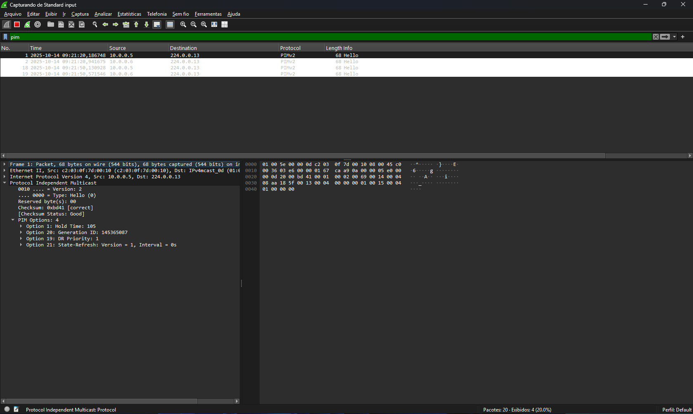
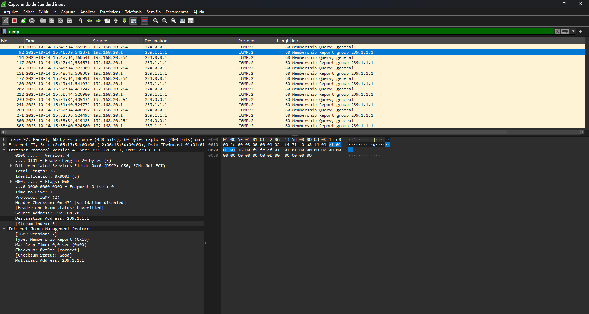
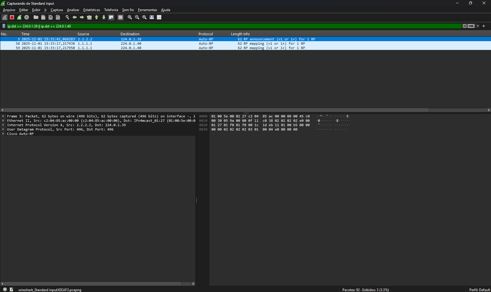
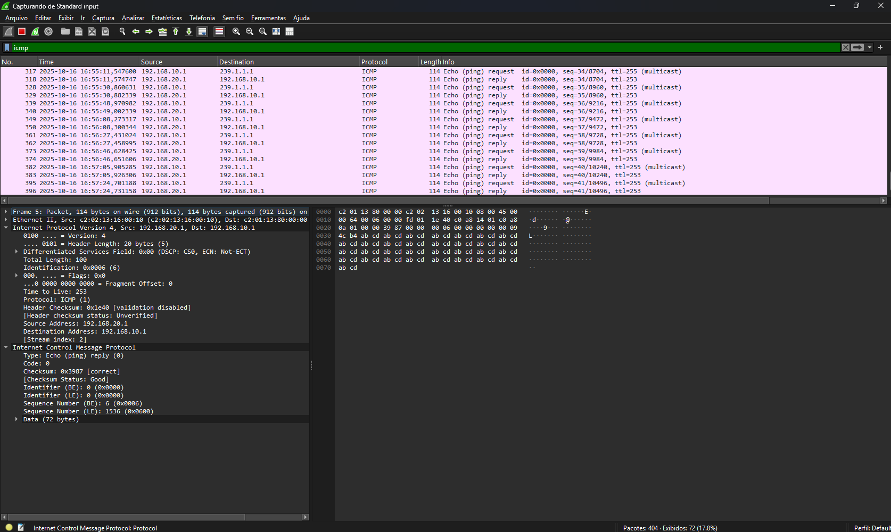
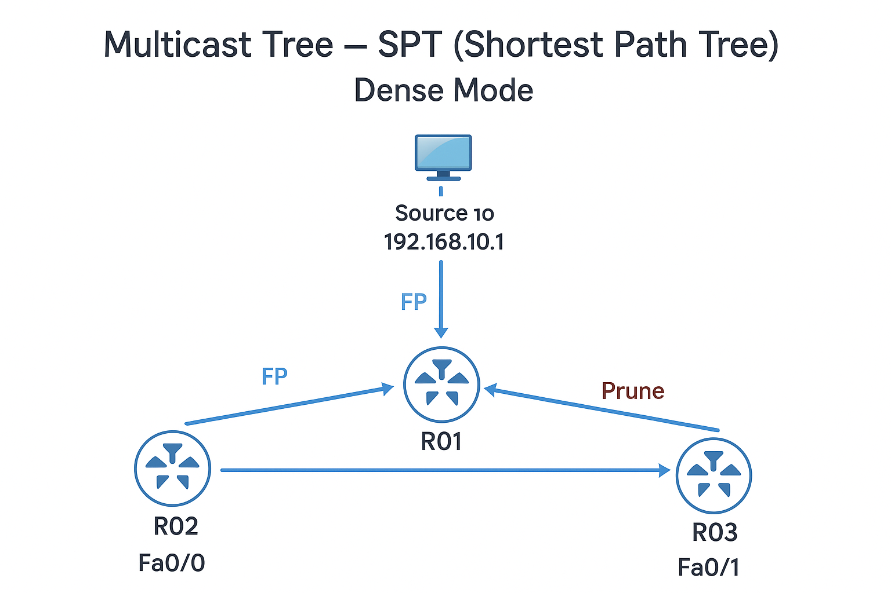
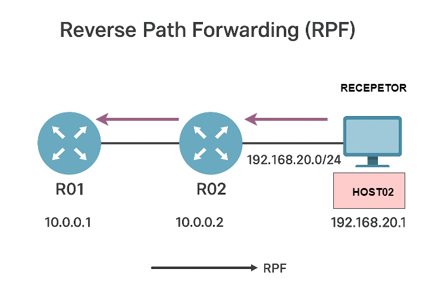
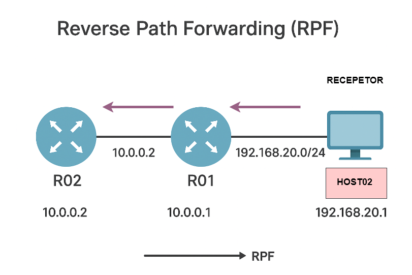

# Índice

- [Índice](#índice)
  - [05 - Exemplo Prático - PIM Sparse Mode](#05---exemplo-prático---pim-sparse-mode)
  - [🧾 Introdução](#-introdução)
  - [🎯 Objetivo do Laboratório](#-objetivo-do-laboratório)
    - [Explicação do Cenário](#explicação-do-cenário)
      - [**O que é o RP (Rendezvous Point)**](#o-que-é-o-rp-rendezvous-point)
      - [🧩 1️⃣ O papel do grupo 224.0.1.40 (Auto-RP Announcement)](#-1️⃣-o-papel-do-grupo-2240140-auto-rp-announcement)
      - [🌳 2️⃣ PIM Sparse Mode — como nasce a árvore multicast](#-2️⃣-pim-sparse-mode--como-nasce-a-árvore-multicast)
      - [🔹 3️⃣ O papel do IGMP Join](#-3️⃣-o-papel-do-igmp-join)
      - [🔀 4️⃣ Do IGMP para o RP: como o Join “descobre o caminho”](#-4️⃣-do-igmp-para-o-rp-como-o-join-descobre-o-caminho)
      - [🛰️ 5️⃣ Agora entra a fonte (source)](#️-5️⃣-agora-entra-a-fonte-source)
  - [🌐 Topologia do Laboratório](#-topologia-do-laboratório)
    - [Testes Preliminares](#testes-preliminares)
    - [Onde o PIM deve ser ativado](#onde-o-pim-deve-ser-ativado)
    - [📘 No nosso cenário](#-no-nosso-cenário)
  - [🧩 Como funciona o Auto-RP da Cisco](#-como-funciona-o-auto-rp-da-cisco)
  - [1️⃣ Os dois papéis do Auto-RP](#1️⃣-os-dois-papéis-do-auto-rp)
  - [2️⃣ Comunicação entre eles](#2️⃣-comunicação-entre-eles)
  - [🧠 Como o domínio decide quem será o RP](#-como-o-domínio-decide-quem-será-o-rp)
  - [3️⃣ Comandos de configuração (modo Auto-RP)](#3️⃣-comandos-de-configuração-modo-auto-rp)
    - [💡 A pegadinha do nome “Auto-RP”](#-a-pegadinha-do-nome-auto-rp)
  - [Ativando o protocolo PIM Sparse Mode](#ativando-o-protocolo-pim-sparse-mode)
    - [🧠 Entendendo a Eleição do Designated Router (DR) no PIM Sparse Mode](#-entendendo-a-eleição-do-designated-router-dr-no-pim-sparse-mode)
  - [Função do DR no PIM Dense Mode](#função-do-dr-no-pim-dense-mode)
    - [Contexto: Por que o PIM precisa de um DR?](#contexto-por-que-o-pim-precisa-de-um-dr)
    - [Processo de Eleição do DR no PIM Dense Mode](#processo-de-eleição-do-dr-no-pim-dense-mode)
    - [Função prática do DR no PIM Dense Mode](#função-prática-do-dr-no-pim-dense-mode)
    - [Resumo rápido](#resumo-rápido)
  - [Endereço Multicast 224.0.0.13](#endereço-multicast-2240013)
    - [Revisão](#revisão)
    - [Resumo prático](#resumo-prático)
  - [Explicação da Tabela de roteamento multicast](#explicação-da-tabela-de-roteamento-multicast)
    - [Realizando Join Group](#realizando-join-group)
  - [🌳 Visão geral da Árvore Multicast (PIM Dense Mode)](#-visão-geral-da-árvore-multicast-pim-dense-mode)
  - [Comportamento de cada roteador](#comportamento-de-cada-roteador)
  - [Formação da Árvore Multicast](#formação-da-árvore-multicast)
    - [RPF - Reverse Path Forwarding](#rpf---reverse-path-forwarding)
  - [Troubleshooting Multicast Pim Dense-Mode](#troubleshooting-multicast-pim-dense-mode)
  - [Resumo de Comandos Multicast (PIM Dense Mode)](#resumo-de-comandos-multicast-pim-dense-mode)
    - [🔹 Etapa 1 – Configuração Inicial](#-etapa-1--configuração-inicial)
    - [🔹 Etapa 2 – Configuração Complementar (Unicast)](#-etapa-2--configuração-complementar-unicast)
    - [🔹 Etapa 3 – Verificações Iniciais](#-etapa-3--verificações-iniciais)
    - [🔹 Etapa 4 – Análise e Diagnóstico Avançado](#-etapa-4--análise-e-diagnóstico-avançado)
    - [🔹 Etapa 5 – Troubleshooting (Comandos de Diagnóstico)](#-etapa-5--troubleshooting-comandos-de-diagnóstico)
    - [🧠 Dica Final](#-dica-final)
  - [💡 Aplicações Práticas do Multicast](#-aplicações-práticas-do-multicast)
  - [🧩 O que aprendemos com este laboratório](#-o-que-aprendemos-com-este-laboratório)

## 05 - Exemplo Prático - PIM Sparse Mode  

## 🧾 Introdução

Este laboratório demonstra o funcionamento do **roteamento multicast em modo PIM Sparse Mode**, simulando um ambiente Cisco onde apenas hosts interessados recebem o fluxo de dados.  
Diferente do PIM Dense Mode, agora o protocolo utiliza Rendezvous Points (RP) — pontos centrais de encontro entre fontes e receptores.  
Essa mudança altera completamente o comportamento do PIM, tornando o tráfego mais controlado e escalável. Então vamos demonstrar isso de forma prática.  

## 🎯 Objetivo do Laboratório

Este laboratório tem como objetivo compreender o funcionamento do protocolo **PIM Sparse Mode (PIM-SM) e a formação das árvores multicast — a Shared Tree (baseada no RP) e a SPT (Shortest Path Tree)**, em um ambiente Cisco simulado.  
Agora vamos observar na prática o comportamento dos roteadores durante a **eleição de RP**, a formação da **árvore multicast** e a **verificação do caminho reverso (RPF)**, utilizando uma topologia simples com 8 roteadores e hosts simulados.  
Ao longo dos testes, são analisadas as tabelas multicast, os grupos IGMP e os eventos de roteamento dinâmico, demonstrando como o multicast opera sobre uma infraestrutura unicast baseada em OSPF.  

### Explicação do Cenário

Como dito anteriormente, nosso cenário já tem o roteamento pronto e funcional para podermos dar o foco no processo da comunicação **multicast**.  

  

Nesse cenário estamos utilizando **oito roteadores**.  

Então vamos manter a lógica anterior, vamos utilizar **três roteadores disfarçados de hosts**, e por isso não realizaremos muitas configurações neles.  

Nos demais roteadores, que estão interligados entre si, foi configurado apenas o protocolo de roteamento dinâmico **OSPF**, garantindo que todas as redes já possuam **conectividade IP completa** antes de ativarmos o multicast.  

Diferente do **PIM Dense Mode** agora temos a figura do **Rendezvous Point**.  Ao configurar o PIM em modo Sparse, os roteadores passam a escutar os **grupos 224.0.1.39 e 224.0.1.40, utilizados pelo Auto-RP — um mecanismo proprietário da Cisco** para descoberta automática de Rendezvous Points.  
Esses grupos ficam prontos para uso assim que algum roteador for configurado como Candidate RP e outro como Mapping Agent.  

#### **O que é o RP (Rendezvous Point)**  

- O Rendezvous Point (RP) é um ponto central usado apenas pelo PIM Sparse Mode (PIM-SM).  
- Ele funciona como um "ponto de encontro" entre fontes (senders) e receptores (receivers) multicast.
- Todas as fontes primeiro registram-se com o RP, e os receptores enviam joins até o RP.
- Isso cria a árvore compartilhada (*,G).
- Depois, o tráfego pode mudar para a árvore por fonte (S,G), mais otimizada.
  
👉 **Resumo:** o RP é essencial somente no modo Sparse, porque nesse modo o tráfego não é floodado.

#### 🧩 1️⃣ O papel do grupo 224.0.1.40 (Auto-RP Announcement)

✅ O grupo 224.0.1.40 é usado para anunciar automaticamente quem serão os Rendezvous Points (RPs) no domínio PIM-SM.  
  
Mas há **duas entidades** envolvidas nesse processo Auto-RP da Cisco: 

| Função              | Grupo Multicast | Descrição                                                                                                         |
|---------------------|-----------------|-------------------------------------------------------------------------------------------------------------------|
| Candidate RP (C-RP) | 224.0.1.40      | Envia anúncios periódicos dizendo **"posso atuar como RP"**                                                       |
| Mapping Agent (MA)  | 224.0.1.39      | Escuta os anúncios dos C-RPs e escolhe quem será o RP final — depois distribui o mapeamento a todos os roteadores |

Então sim, 224.0.1.40 serve para descobrir os RPs automaticamente, substituindo a configuração manual, mas somente no PIM Sparse Mode.

No Dense Mode, esses grupos aparecem, mas não têm função ativa — são apenas “ouvidos” por compatibilidade.

#### 🌳 2️⃣ PIM Sparse Mode — como nasce a árvore multicast

No Sparse Mode, não há flood and prune, então o multicast não se propaga automaticamente.  
  
👉 O tráfego só flui se houver um receptor que peça explicitamente para participar — e esse pedido começa com o IGMP Join.  

#### 🔹 3️⃣ O papel do IGMP Join

Vamos supor o cenário:

- O Host envia IGMP Join 239.1.1.1
- O roteador local (chamado de Designated Router – DR) recebe esse IGMP Report.

Mas agora vem a dúvida-chave:  
  
**“Como o roteador sabe para onde enviar o join, se ele não faz flood?”**  
  
Excelente 👇  

#### 🔀 4️⃣ Do IGMP para o RP: como o Join “descobre o caminho”

Quando um host envia um IGMP Join, o roteador de borda (DR – Designated Router) aprende que há um receptor interessado.  
A partir daí, o DR precisa descobrir quem é o RP responsável por aquele grupo.  
  
**Exemplo:** o host 192.168.20.2 envia um Join para o grupo 239.1.1.1, e o DR encaminha o PIM Join em direção ao RP 1.1.1.1 seguindo a rota unicast.  
  
- O Host envia IGMP Join → o roteador (DR) aprende que tem um receptor interessado no grupo 239.1.1.1.
- O DR consulta sua tabela PIM:
  “Quem é o RP responsável pelo grupo 239.1.1.1?”
- Essa informação vem de:
  - ip pim rp-address x.x.x.x, ou
  - Auto-RP (224.0.1.39/40), ou
  - BSR (Bootstrap Router).
- O DR então envia uma mensagem PIM Join em direção ao RP, seguindo a rota unicast até ele (sem flood).
  
**🔁 Isso é o ponto crucial:**  
👉 O Join é roteado unicast até o RP, não é floodado.  
  
Cada roteador no caminho cria uma entrada (*,G) na tabela multicast:  

- “Existe um receptor interessado no grupo 239.1.1.1”
- “O tráfego deve ser encaminhado nessa direção caso apareça”.
  
Quando o RP recebe esse Join, ele sabe:

- “Tenho receptores interessados no grupo G”.
  
#### 🛰️ 5️⃣ Agora entra a fonte (source)

Quando um servidor multicast (ex: 192.168.10.1) começa a enviar tráfego para 239.1.1.1:

- O roteador mais próximo da fonte (chamado source DR) envia uma mensagem PIM Register diretamente ao RP (unicast).
- Essa mensagem carrega o tráfego ou anuncia a existência da fonte.
  
O RP aprende:  

- “A fonte S está enviando para o grupo G.”
- O RP então conecta as duas pontas (S e os receptores).
- Ele cria o fluxo (*,G) e (S,G).
- O tráfego multicast começa a fluir da fonte até o RP, e do RP até os receptores.
- Depois que o tráfego é estabelecido, o roteador receptor pode migrar para a SPT (Shortest Path Tree), formando um caminho direto até a fonte, sem depender do RP.

## 🌐 Topologia do Laboratório

A topologia utilizada neste laboratório é composta por cinco roteadores principais (R01, R02, R03, R04 e R05) e três hosts simulados (Server, Host02 e Host03).  
Os hosts são roteadores Cisco “disfarçados” de PCs, configurados apenas com endereços IP e adesão a grupos multicast via IGMP.  
O protocolo **OSPF** é utilizado para prover conectividade unicast entre todos os roteadores, enquanto o **PIM Sparse Mode (PIM-SM)** foi configurado para o tráfego multicast, com uso inicial do Auto-RP para eleição automática do Rendezvous Point (RP).

**🔧 Endereçamento e Funções**  

| **Dispositivo** | **Interface** | **Endereço IP / Máscara Rede** | **Conexão Função**                                    |
|-----------------|---------------|--------------------------------|-------------------------------------------------------|
| R01             | Loopback0     | 1.1.1.1 /32                    | Identificação / Router-ID OSPF                        |
|                 | Fa0/0         | 192.168.10.254 /24             | LAN do Server - Gateway multicast para Server         |
|                 | Fa0/1         | 10.0.0.1 /30                   | Link com R02 PIM + OSPF                               |
|                 | Fa1/0         | 10.0.0.18 /30                  | Link com R05 PIM + OSPF                               |
| R02             | Loopback0     | 2.2.2.2 /32                    | Identificação / Router-ID OSPF                        |
|                 | Fa0/0         | 10.0.0.2 /30                   | Link com R01 PIM + OSPF                               |
|                 | Fa1/0         | 10.0.0.5 /30                   | Link com R03 PIM + OSPF                               |
| R03             | Loopback0     | 3.3.3.3 /32                    | Identificação / Router-ID OSPF                        |
|                 | Fa0/0         | 10.0.0.6 /30                   | Link com R02 PIM + OSPF                               |
|                 | Fa1/0         | 10.0.0.9 /30                   | Link com R04 PIM + OSPF                               |
| R04             | Loopback0     | 4.4.4.4 /32                    | Identificação / Router-ID OSPF                        |
|                 | Fa0/0         | 10.0.0.10 /30                  | Link com R03 PIM + OSPF                               |
|                 | Fa1/0         | 10.0.0.13 /30                  | Link com R05 PIM + OSPF                               |
|                 | Fa1/1         | 192.168.20.254 /24             | LAN do Host02 - Gateway multicast para Host02         |
| R05             | Loopback0     | 5.5.5.5 /32                    | Identificação / Router-ID OSPF                        |
|                 | Fa0/0         | 10.0.0.14 /30                  | Link com R04 PIM + OSPF                               |
|                 | Fa1/0         | 10.0.0.17 /30                  | Link com R01 PIM + OSPF                               |
|                 | Fa0/1         | 192.168.30.254 /24             | LAN do Host03 Gateway multicast para Host03           |
| Server          | Fa0/0         | 192.168.10.1 /24               | LAN com R01 Fonte multicast (sender)                  |
| Host02          | Fa0/0         | 192.168.20.1 /24               | LAN com R04 Receptor multicast (join-group 239.1.1.1) |
| Host03          | Fa0/0         | 192.168.30.1 /24               | LAN com R05 Host não inscrito (sem join IGMP)         |

**🧭 Resumo da Lógica**  

- O Server (192.168.10.1) envia tráfego multicast para o grupo 239.1.1.1.
- Apenas o Host02 (192.168.20.1) envia IGMP Join solicitando adesão ao grupo 239.1.1.1.
- O Host03 (192.168.30.1) não participa, servindo como referência para áreas sem receptores.
- O PIM Sparse Mode depende de um Rendezvous Point (RP) — no primeiro momento, selecionado automaticamente via Auto-RP (grupos 224.0.1.39 e 224.0.1.40).
- O roteador designado como RP será o ponto de encontro entre a fonte (Server) e os receptores (Host02).
- O RPF (Reverse Path Forwarding) é utilizado para validar o caminho de retorno até a fonte multicast com base na tabela OSPF.

Após a formação inicial da árvore compartilhada (*,G) via RP, os roteadores podem comutar para a árvore de menor custo (SPT – Shortest Path Tree), estabelecendo o caminho direto entre fonte e receptores.

### Testes Preliminares

Como feito no exemplo anterior, vamos realizar um teste de comunicação entre todos os equipamentos com o ping só para garantir a comunicação.  
**OBS:** nos roteadores eu configurei interfaces de LOOPABCK. Então R01 tem o ip 1.1.1.1 /32, R02 tem o ip 2.2.2.2 /32, R03 tem o ip 3.3.3.3 /32, R04 4.4.4.4/32 e R05 5.5.5.5/32 .  


Com isso, podemos ver que todos os hosts se alcançam e se comunicam. Mas o mais importante é observer a a tabela de roteamento para podermos entender um conceito simples.  
  
Agora a primeira coisa que precisamos ativar é o **roteamento multicast** no equipamento.  
  
>R01(config)#ip multicast-routing  
  
Só para confirmar, vamos verificar o roteamento multicast.  

```ios
R01#show ip multicast  
  Multicast Routing: enabled  
  Multicast Multipath: disabled  
  Multicast Route limit: No limit  
  Multicast Triggered RPF check: enabled  
  Multicast Fallback group mode: Sparse  
  Multicast DVMRP Interoperability: disabled  
  Number of multicast boundaries configured with filter-autorp option: 0  
R01#  
```

**ONS:** Agora que temos o roteamento multicast ativo, precisamos ativar o protocolo **PIM**. Esse protocolo deve ser ativado nas interfaces onde a comunicação ira ocorrer. Então, repetir o processo de R01 a R05.

### Onde o PIM deve ser ativado

No modo **Sparse Mode (PIM-SM)**, o tráfego multicast não é floodado automaticamente — ele só percorre interfaces onde existe interesse explícito (IGMP Join) ou onde há necessidade de alcançar o **Rendezvous Point (RP)**.  
  
👉 Portanto, o PIM deve ser ativado em todas as interfaces que participam do domínio multicast, ou seja:

- **Interfaces entre roteadores PIM vizinhos** (para formar a árvore multicast e permitir a troca de mensagens PIM Join/Prune);
- **Interfaces conectadas a redes com fontes (senders) ou receptores (receivers) multicast**;
- **Interfaces de loopback**, quando utilizadas como endereço do RP ou como Router-ID PIM.

✅ **Resumo da regra prática para PIM-SM**  

| Situação                           | PIM deve ser ativado?    | Motivo                                                         |
|------------------------------------|--------------------------|----------------------------------------------------------------|
| Interface entre roteadores         | ✅ Sim                   | Necessário para formar vizinhança PIM e propagar joins/prunes  |
| Interface com host receptor (IGMP) | ✅ Sim                   | Permite que o roteador DR receba e encaminhe IGMP Reports      |
| Interface com fonte multicast      | ✅ Sim                   | Permite que o roteador DR da fonte envie PIM Register ao RP    |
| Interface Loopback usada como RP   | ✅ Sim                   | O RP precisa estar ativo no domínio PIM                        |
| Loopback apenas como Router-ID     | ⚙️ Opcional              | Apenas usada como origem lógica dos pacotes PIM                |  

🌀 Observação importante sobre as Loopbacks

No PIM Sparse Mode, a Loopback pode ter uma função mais relevante do que no Dense Mode:

- Se ela for usada como endereço do RP (definido manualmente com **ip pim rp-address** <loopback>), o PIM deve estar habilitado nela.
- Se for usada apenas como **Router-ID do OSPF/PIM, não há necessidade de ativar PIM nela**.
  
💡 Em geral, em laboratórios e ambientes de estudo, é prática comum habilitar o PIM apenas nas interfaces físicas e na loopback do RP.

### 📘 No nosso cenário

Vamos ativar o PIM em todas as interfaces de roteadores que fazem parte do domínio multicast, incluindo:  

- Todas as interfaces ponto a ponto entre roteadores (R01–R02, R02–R03, R03–R04, R04–R05, R05–R01);
- Interfaces conectadas às LANs dos hosts (Server, Host02 e Host03).
- Apenas as interfaces de Loopback serão avaliadas conforme sua função:
  - Se forem usadas apenas como identificação OSPF, não precisam de PIM;
  - Se forem usadas como RP, devem ter PIM ativo.

Antes de ativarmos, é importante compreender o conceito de eleição dos **Rendezvous Point (RP)**, ou o **Auto RP**.  

## 🧩 Como funciona o Auto-RP da Cisco

O Auto-RP é um mecanismo proprietário da Cisco que automatiza a descoberta e distribuição de RPs dentro de um domínio **PIM Sparse Mode**.

Em vez de configurar manualmente o comando **ip pim rp-address** em todos os roteadores, o Auto-RP usa dois papéis principais e dois grupos multicast reservados para distribuir essa informação automaticamente.

## 1️⃣ Os dois papéis do Auto-RP

| Função        | Sigla    | Responsabilidade                                                          | Grupo Multicast Utilizado |
|---------------|----------|---------------------------------------------------------------------------|---------------------------|
| Candidate RP  | **C-RP** | Anuncia-se como potencial RP para determinados grupos multicast           | **224.0.1.40**            |
| Mapping Agent | **MA**   | Escuta os anúncios dos C-RPs, escolhe o RP final e distribui o mapeamento | **224.0.1.39**            |  

## 2️⃣ Comunicação entre eles

O Candidate RP envia mensagens Auto-RP Announcement (anúncio) para o grupo 224.0.1.40, dizendo:  

- 🗣️ “Eu posso ser o RP para os grupos **224.0.0.0 – 239.255.255.255**”.  

O Mapping Agent (MA) se inscreve nesse grupo **224.0.1.40 (via PIM/IGMP)** e escuta todos os anúncios.  
Ele então escolhe um ou mais RPs válidos e repassa essa informação para todos os roteadores PIM do domínio via grupo **224.0.1.39**, através da mensagem Auto-RP Mapping.  
  
Todos os roteadores escutam o **224.0.1.39** e, assim, aprendem qual é o RP ativo para cada grupo multicast.

## 🧠 Como o domínio decide quem será o RP

O Mapping Agent é quem escolhe o RP com base nos anúncios que recebe.  
A seleção normalmente segue critérios simples:  

- Todos os **C-RPs** válidos são incluídos na tabela de mapeamento.
- Cada grupo multicast pode ter um **RP diferente** (dependendo do range anunciado).

Se houver mais de um C-RP para o mesmo grupo, o MA usa o endereço IP mais alto como critério de desempate.  

💡 **Em laboratório, normalmente deixamos apenas um Mapping Agent e um ou dois Candidate RPs — assim dá pra ver a eleição e o tráfego de anúncios claramente.**

## 3️⃣ Comandos de configuração (modo Auto-RP)

### 💡 A pegadinha do nome “Auto-RP”

Apesar do nome “Auto-RP” sugerir que tudo é automático, ele não é totalmente automático.  
O que o Auto-RP automatiza é a descoberta e distribuição do RP dentro do domínio PIM-SM — ou seja, os roteadores aprendem automaticamente quem é o RP sem precisar do comando manual ip pim rp-address.  
Mas para isso acontecer, alguém precisa gerar e propagar essa informação — e é aí que entram os dois papéis:  

- **Candidate RP (C-RP)** → quem “se oferece” para ser RP.
- **Mapping Agent (MA)** → quem “ouve”, escolhe e anuncia o vencedor.

**OBS:** Esses papéis devem ser definidos manualmente pelo administrador.  
  
🧠 **Analogia simples (pensa como uma eleição)**  
  
Imagine que o domínio PIM é uma cidade:  

- Vários roteadores podem se candidatar a prefeito **(Candidate RP)**.
- Mas precisa ter um cartório eleitoral **(Mapping Agent)** que receba as candidaturas e divulgue quem foi eleito para toda a cidade.

👉 **O processo de votação e divulgação é automático — mas os papéis são definidos manualmente**.  
Sem pelo menos **um Mapping Agent e um Candidate RP**, não há eleição alguma.  
  
📊 **O que é automático e o que é manual**  

| Ação                               | Automático? | Quem decide                 |
|------------------------------------|-------------|-----------------------------|
| Escolher quem é Candidate RP       | ❌ Não      | Administrador              |
| Escolher quem é Mapping Agent      | ❌ Não      | Administrador              |
| Eleger o RP (entre os candidatos)  | ✅ Sim      | Mapping Agent              |
| Distribuir o mapeamento para todos | ✅ Sim      | Mapping Agent              |
| Aprender o RP e atualizar a tabela | ✅ Sim      | Todos os roteadores PIM-SM |

🧱 **Em projeto real (ou laboratório bem documentado)**
  
Essa escolha deve ser feita pela pelo administrador e precisa estar no projeto.  
No nosso caso, com cinco roteadores, uma topologia em anel e um laboratório educacional, uma boa prática é:  

| Função                 | Roteador             | Justificativa                                                        |
|------------------------|----------------------|----------------------------------------------------------------------|
| Mapping Agent          | R01                  | Está próximo da fonte multicast (Server) e tem conectividade central |
| Candidate RP           | R02                  | Está no meio do domínio PIM, facilita convergência                   |
| Demais (R03, R04, R05) | Participantes PIM-SM | Aprendem o RP automaticamente via 224.0.1.39                         |  

⚙️ **O que o Auto-RP faz automaticamente**  
  
Depois que você define quem é C-RP e MA:  

- O **C-RP** envia anúncios PIM Auto-RP para **224.0.1.40**.
- O **MA** escuta, escolhe o RP e envia o mapeamento para **224.0.1.39**.

Todos os roteadores escutam 224.0.1.39 e aprendem:  

- “Para o grupo 239.1.1.1, o RP é 2.2.2.2”.
- Se o C-RP cair, o MA detecta a ausência dos anúncios e remove o RP do mapeamento.

👉 **Ou seja: a distribuição e manutenção são automáticas, mas a existência do MA e do C-RP depende de você configurá-los.**

## Ativando o protocolo PIM Sparse Mode

Agora que entendemos a lógica, vamos ativar o protocolo em todas as interfaces que participam do multicast nos roteadores, de R01 a R05.

```ios
R01#show ip int br
Interface                  IP-Address      OK? Method Status                Protocol
FastEthernet0/0            192.168.10.254  YES NVRAM  up                    up
FastEthernet0/1            10.0.0.1        YES NVRAM  up                    up
FastEthernet1/0            10.0.0.18       YES NVRAM  up                    up
Loopback0                  1.1.1.1         YES NVRAM  up                    up
R01#conf t
Enter configuration commands, one per line.  End with CNTL/Z.
R01(config)#int f0/0
R01(config-if)#ip pim sparse-mode
R01(config-if)#
*Mar  1 02:00:05.663: %PIM-5-DRCHG: DR change from neighbor 0.0.0.0 to 192.168.10.254 on interface FastEthernet0/0
R01(config-if)#int f0/1
R01(config-if)#ip pim sparse-mode
R01(config-if)#
*Mar  1 02:00:20.615: %PIM-5-DRCHG: DR change from neighbor 0.0.0.0 to 10.0.0.1 on interface FastEthernet0/1
R01(config-if)#int f1/0
R01(config-if)#ip pim sparse-mode
R01(config-if)#
*Mar  1 02:00:36.563: %PIM-5-DRCHG: DR change from neighbor 0.0.0.0 to 10.0.0.18 on interface FastEthernet1/0
R01(config-if)#
```

Agora que o **PIM Sparse-Mode** foi ativado, vamos analisar a tabela de **roteamento multicast:**

```ios
R01#show ip mrout
IP Multicast Routing Table
Flags: D - Dense, S - Sparse, B - Bidir Group, s - SSM Group, C - Connected,
       L - Local, P - Pruned, R - RP-bit set, F - Register flag,
       T - SPT-bit set, J - Join SPT, M - MSDP created entry,
       X - Proxy Join Timer Running, A - Candidate for MSDP Advertisement,
       U - URD, I - Received Source Specific Host Report,
       Z - Multicast Tunnel, z - MDT-data group sender,
       Y - Joined MDT-data group, y - Sending to MDT-data group
Outgoing interface flags: H - Hardware switched, A - Assert winner
 Timers: Uptime/Expires
 Interface state: Interface, Next-Hop or VCD, State/Mode

(*, 224.0.1.40), 00:15:57/00:02:04, RP 0.0.0.0, flags: DCL
  Incoming interface: Null, RPF nbr 0.0.0.0
  Outgoing interface list:
    FastEthernet0/0, Forward/Sparse, 00:15:57/00:02:04

R01#
```

Então eu realizei uma captura de pacotes na interface F0/0 de R01.  

  

Então podemos verificar que o grupo **224.0.1.40** foi ativado.  

### 🧠 Entendendo a Eleição do Designated Router (DR) no PIM Sparse Mode

Quando ativamos o **PIM Sparse Mode** nas interfaces, cada rede multicast (LAN) com mais de um roteador participante precisa escolher um roteador responsável por interagir com os hosts locais e com o **RP (Rendezvous Point)**.  
Esse roteador é chamado de **Designated Router (DR).**  
  
🔍 **O que é o DR**  
  
O Designated Router tem duas funções principais:  

| Situação                               | Função do DR                                                                                     |
|----------------------------------------|--------------------------------------------------------------------------------------------------|
| Lado dos receptores (hosts multicast)  | Recebe mensagens IGMP Report dos hosts interessados e envia mensagens PIM Join em direção ao RP. |
| Lado das fontes (servidores multicast) | Detecta tráfego multicast local e envia PIM Register diretamente ao RP.                          |  

⚙️ **Como ocorre a eleição do DR**  
  
A eleição do DR é feita automaticamente entre todos os roteadores PIM que compartilham a mesma rede multicast.  

🔸 Critério de eleição:  
  
- O roteador com o maior endereço IP ativo na interface vence a eleição.
- Em caso de empate (endereços iguais, o que é raro), o endereço de Router-ID PIM (geralmente a Loopback) é usado como desempate.

🔸 Exemplo real do log:  

```ios
*Mar  1 02:00:36.563: %PIM-5-DRCHG: DR change from neighbor 0.0.0.0 to 10.0.0.18 on interface FastEthernet1/0
```

🔹 **Interpretação:**  

- Houve uma mudança de **DR** na interface FastEthernet1/0.
- O roteador **10.0.0.18** foi eleito como o novo Designated Router.
- O endereço **0.0.0.0** indica que antes não havia DR definido (primeira eleição).  
  
🚫 **Não existe BDR no PIM**
  
Diferente do **OSPF, o PIM não possui Backup Designated Router (BDR)**.  
Somente um DR é responsável pela rede.  
  
Se o DR atual falhar, os demais roteadores detectam a ausência de mensagens **PIM Hello (por padrão a cada 30 segundos)** e realizam uma nova eleição automaticamente.  
O roteador com o próximo IP mais alto assume o papel de DR sem interrupção perceptível no domínio multicast.  
  
🧭 **Resumo prático**

| Item                         | PIM Dense Mode             | PIM Sparse Mode          |
|------------------------------|----------------------------|--------------------------|
| DR existe?                   | Sim, mas é pouco relevante | ✅ Sim, papel essencial |
| BDR existe?                  | ❌ Não                     | ❌ Não                  |
| Flood de tráfego             | ✅ Sim                     | ❌ Não                  |
| Comunicação com RP           | ❌ Não usa RP              | ✅ Sim, feita pelo DR   |
| Envio de PIM Join / Register | Todos enviam               | Apenas o DR envia        |

Então podemos observar esse comportamento através da captura de pacotes onde o Whireshark foi ativado na interface F0/0 de R01.  


-------------------------------------------------------------------------


Agora que ativamos o **PIM DENSE-MODE** podemos observar que nos é exibida uma mensagem de aviso (log nível 5)  
  
***Mar  1 03:54:21.635: %PIM-5-DRCHG: DR change from neighbor 0.0.0.0 to 192.168.10.254 on interface FastEthernet1/0**  
  
Essa mensagem se dá por conta do processo de eleição do **DR (Designated Router)**. Apesar dessa mensagem gerar uma dúvida, isso não tem nada a ver com o protocolo OSPF. Apenas ocorre uma coincidência nas nomenclaturas: **DR (Designated Router)** pois nos dois protocolos é mesma nomenclatura.  

## Função do DR no PIM Dense Mode

No PIM Dense Mode, a comunicação multicast funciona com o método Flood and Prune:

- Inicialmente, o tráfego multicast é enviado para todos os roteadores PIM;
- Os roteadores que não têm receptores interessados enviam mensagens Prune, pedindo para parar de receber o fluxo.
- O Designated Router é quem:
- Inicia o envio do fluxo multicast para a LAN;
- Coordena a poda (prune) quando não há interesse local;
- Evita duplicação de pacotes multicast quando há mais de um roteador conectado à mesma rede.  

### Contexto: Por que o PIM precisa de um DR?  

Em uma rede multiacesso (como um segmento Ethernet), podem existir vários roteadores PIM conectados à mesma sub-rede.  
Quando um host multicast envia tráfego para um grupo (ex: 239.1.1.1), todos os roteadores PIM na LAN recebem esse tráfego.  

- Se todos eles repassassem o fluxo multicast ao mesmo tempo, haveria duplicação de pacotes e loops.  
  
Por isso, o PIM precisa eleger um único roteador que será responsável por reencaminhar o tráfego multicast na LAN — esse é o Designated Router (DR).  

### Processo de Eleição do DR no PIM Dense Mode

A eleição é baseada nas mensagens PIM Hello, trocadas periodicamente entre os roteadores.

🔹 **Etapa 1 — Envio de mensagens Hello**

Todos os roteadores PIM em uma interface enviam mensagens Hello periodicamente (a cada 30 segundos por padrão).  
Essas mensagens contêm informações como:  

- IP da interface de origem
- Prioridade do DR (DR Priority)
- Temporizador de Hello  

O comando **debug ip pim ou show ip pim interface** permite ver esses parâmetros.

🔹 **Etapa 2 — Comparação dos parâmetros**

Ao receber Hellos dos vizinhos, cada roteador compara sua prioridade com as dos outros:  

- Maior prioridade vence.
- Por padrão, o valor é 1 em todos os roteadores.

Pode ser alterado com:  

> interface FastEthernet0/0
> ip pim dr-priority <valor>  

🔹 **Etapa 3 — Eleição e anúncio do DR**

Quando um roteador identifica que ele possui a maior prioridade (ou maior IP em empate), ele se declara DR.  
O Cisco IOS registra isso com mensagens como:  

> %PIM-5-DRCHG: DR change from neighbor 0.0.0.0 to 192.168.10.254 on interface FastEthernet1/0

📘 Interpretação:  

- O campo from neighbor 0.0.0.0 indica que não havia DR anterior.
- O novo DR é o roteador cujo IP é 192.168.10.254 (o próprio).  

🔹 **Etapa 4 — Manutenção do DR**  

Enquanto o DR estiver ativo e enviando Hellos, os outros roteadores não tentam assumir o papel.  
Se o DR parar de enviar Hellos (por falha, interface down ou perda de conectividade), os demais roteadores detectam a ausência e refazem a eleição automaticamente.  

### Função prática do DR no PIM Dense Mode

O DR atua como ponto central para:  

- Registrar as fontes (quando há hosts multicast na LAN).
- Enviar os pacotes multicast iniciais no modo flood.
- Responder a mensagens IGMP vindas dos hosts receptores. 

Ou seja, o DR é quem fala com os hosts (via IGMP) e com os outros roteadores (via PIM).  

**🔍 Exemplo prático**

Imagine três roteadores PIM ligados à mesma rede 192.168.10.0/24:

| Roteador | IP da Interface | Prioridade PIM |
|----------|-----------------|----------------|
| R1       | 192.168.10.1    |       1        |
| R2       | 192.168.10.2    |       1        |
| R3       | 192.168.10.3    |       5        |

➡️ Resultado:  

O R3 será o Designated Router, pois tem maior prioridade (5).  
Se R3 cair, a eleição é refeita: o DR passa a ser R2 (maior IP entre os restantes).  

### Resumo rápido

| Etapa | Descrição                                                  |
|-------|------------------------------------------------------------|
| 1️⃣    | Todos enviam mensagens PIM Hello                           |
| 2️⃣    | Comparam prioridade (dr-priority)                          |
| 3️⃣    | Empate → vence o maior IP da interface                     |
| 4️⃣    | Roteador vencedor se torna o DR                            |
| 5️⃣    | DR é responsável pelo tráfego multicast e comunicação IGMP |
| 6️⃣    | Se o DR falhar → nova eleição automática                   |

Agora vamos confirmar isso com o **Whireshark** Vamos ligar ele na interface de R01 que está ligada ao nosso HOST01 (SERVER) e vamos procurar pelas mensagens Hello do protocolo PIM.  

  

Como podemos ver, a mensagem **Hello** é originada do IP 192.168.0.254, que é o IP do nosso SERVER com origem para **224.0.0.13**  

## Endereço Multicast 224.0.0.13

| Campo               | Valor                                              |
|---------------------|----------------------------------------------------|
| Endereço IPv4       | 224.0.0.13                                         |
| Nome reservado      | ALL-PIM-ROUTERS                                    |
| Protocolo associado | Protocol Independent Multicast (PIM)               |
| Escopo              | Local-link (não é roteável)                        |
| Função              | Comunicação entre roteadores PIM no mesmo segmento |  

E dentro do pacote:  

- Option 19: DR Priority: 1
- Option 20: Generation ID: 488683522
- Option 21: State-Refresh: Version = 1, Interval = 0s

Essas opções são usadas justamente para o processo de eleição do DR e detecção de vizinhos.  

**🔍 O papel do endereço 224.0.0.13 em resumo**  

| Função                           | Descrição                                                                                                          |
|----------------------------------|--------------------------------------------------------------------------------------------------------------------|
| Descoberta de vizinhos           | Os roteadores PIM enviam Hellos para 224.0.0.13 e escutam nesse grupo para saber quem mais está no mesmo segmento. |
| Eleição de DR                    | As mensagens Hello trocadas via 224.0.0.13 contêm o campo de prioridade que define quem será o DR.                 |
| Troca de informações de controle | Outras mensagens PIM (Join/Prune, Assert, Register Stop, etc.) também usam esse grupo.                             |
| Escopo local (não roteável)      | Pacotes para 224.0.0.13 nunca saem da rede local — são sempre TTL=1.                                               |  

### Revisão

A tabela abaixo mostra outros endereços multicast da faixa 224.0.0.x, usados por protocolos de roteamento e gerenciamento:

| Endereço   | Nome                  | Usado por                 |
|------------|-----------------------|---------------------------|
| 224.0.0.1  | All Hosts             | Todos os hosts multicast  |
| 224.0.0.2  | All Routers           | Todos os roteadores       |
| 224.0.0.5  | All OSPF Routers      | OSPF                      |
| 224.0.0.6  | OSPF DR/BDR Routers   | OSPF                      |
| 224.0.0.9  | RIPng Routers         | RIPng                     |
| 224.0.0.10 | EIGRP Routers         | EIGRP                     |
| 224.0.0.13 | All PIM Routers       | PIMv2                     |
| 224.0.0.18 | VRRP Routers          | VRRP                      |  

### Resumo prático

🔹 Quem envia: todo roteador com ip pim dense-mode (ou sparse, etc.) ativo em uma interface.  
🔹 Quem recebe: todos os roteadores PIM do mesmo segmento (escutando 224.0.0.13).  
🔹 TTL = 1: os pacotes nunca são roteados.  

Usado para:

- Descoberta de vizinhos PIM
- Eleição de DR
- Comunicação de controle  

Agora que entendemos, o inicio do processo, vamos analisar a tabela de roteamento multicast. Aqui é importante que esse é o ponto de criação de nossa árvore multicast.  
O comando fica:  

> R01#show ip mroute  

E o resultado é a saída:  

```ios
 IP Multicast Routing Table
 Flags: D - Dense, S - Sparse, B - Bidir Group, s - SSM Group, C - Connected,  
       L - Local, P - Pruned, R - RP-bit set, F - Register flag,  
       T - SPT-bit set, J - Join SPT, M - MSDP created entry,  
       X - Proxy Join Timer Running, A - Candidate for MSDP Advertisement,  
       U - URD, I - Received Source Specific Host Report,  
       Z - Multicast Tunnel, z - MDT-data group sender,  
       Y - Joined MDT-data group, y - Sending to MDT-data group  
 Outgoing interface flags: H - Hardware switched, A - Assert winner  
 Timers: Uptime/Expires  
 Interface state: Interface, Next-Hop or VCD, State/Mode  
  
 (*, 224.0.1.40), 00:00:20/00:02:40, RP 0.0.0.0, flags: DCL  
  Incoming interface: Null, RPF nbr 0.0.0.0  
  Outgoing interface list:  
    FastEthernet0/0, Forward/Dense, 00:00:20/00:00:00  
  
 R01#  
```

## Explicação da Tabela de roteamento multicast

Como essa tabela é diferente da tabela de roteamento tradicional, vamos analisar suas entradas.  

🔹 Linha principal:  

```ios
(*, 224.0.1.40), 00:00:20/00:02:40, RP 0.0.0.0, flags: DCL 
```

- (*, 224.0.1.40) → É uma entrada (*,G), ou seja, “para qualquer origem (*), grupo 224.0.1.40”.  
Isso indica que qualquer fonte enviando para esse grupo será tratada por essa entrada (é o estado compartilhado).  
  
- 00:00:20/00:02:40 → Tempo desde que a entrada foi criada (uptime) e quanto tempo falta para expirar (expire time).  
  
- RP 0.0.0.0 → O RP (Rendezvous Point) é 0.0.0.0 porque o modo é PIM Dense Mode, que não usa RP (só o Sparse Mode usa RP).  
  
- flags: DCL  

Cada letra indica um estado:

  D → Dense-mode entry

  C → Connected (a origem está diretamente conectada)

  L → Local (o roteador faz parte do grupo — ou recebeu IGMP localmente)  

🔹 Próxima parte:  

```ios
Incoming interface: Null, RPF nbr 0.0.0.0  
```

- **Incoming interface: Null** → Ainda não há uma origem (S,G) conhecida enviando tráfego multicast. Ou seja, o roteador conhece o grupo, mas não sabe ainda de onde vem o fluxo.  
- **RPF nbr 0.0.0.0** → O Reverse Path Forwarding neighbor (vizinho RPF) não está definido, pois ainda não há rota multicast para a origem.  

🔹 Saídas (onde o tráfego será enviado):  

```ios
Outgoing interface list:  
  FastEthernet0/0, Forward/Dense, 00:00:20/00:00:00  
```

- O tráfego multicast (quando chegar) será encaminhado pela interface FastEthernet0/0.  
- Forward/Dense → indica que o tráfego será reenviado (forwarded) no modo dense-mode.  
- Timers → mostram há quanto tempo o estado está ativo e quando expira.  

💡 **Em outras palavras:**  
O roteador R01 está participando do grupo 224.0.1.40, aprendeu via IGMP local, ainda não recebeu tráfego multicast, mas já sabe por onde reenviar quando ele aparecer.  
  
**224.0.1.40 — Cisco RP-Announce (Auto-RP Announcement) - Grupo proprietário da Cisco**  

Esse endereço é usado pelo protocolo Cisco Auto-RP, que faz parte do PIM (Protocol Independent Multicast), modo Sparse.  
Mesmo que você esteja usando Dense Mode, os roteadores Cisco ainda escutam alguns grupos multicast padrão (como o 224.0.1.40), especialmente se o PIM estiver ativado — por isso ele aparece na tabela.  

🔹 **Função do grupo 224.0.1.40**  
  
- Utilizado por Candidatos a RP (Rendezvous Point) para anunciar suas informações a todos os roteadores.  
- Em outras palavras, roteadores que querem ser RP enviam suas mensagens de anúncio (RP-Announce) para o grupo 224.0.1.40.  
  
🔹 **Complemento: o 224.0.1.39**
  
- Esse é o outro grupo relacionado:  
224.0.1.39 — Cisco RP-Discovery (Auto-RP Discovery)  
É usado pelos roteadores para descobrir quem são os RPs disponíveis.  
Ou seja, os Mapping Agents escutam 224.0.1.40 e enviam informações no 224.0.1.39.  
  
**📘 Resumo prático**  

| Grupo      |Função                       | Descrição                                        |
|------------|-----------------------------|--------------------------------------------------|
| 224.0.0.13 | PIM Hello                   | Troca de mensagens entre roteadores PIM vizinhos |
| 224.0.1.39 | Auto-RP Discovery           | Distribui mapeamentos RP para os roteadores      |
| 224.0.1.40 | Auto-RP Announcement        | Roteadores candidatos a RP anunciam sua função   |
| 224.0.0.x  | Multicast de link-local     | Não roteável (apenas dentro do segmento local)   |
| 224.0.1.x  | Multicast global (roteável) | Pode atravessar roteadores                       |  

Para verificarmos em quais interfaces foram configurados o protocolo PIm, vamos executar o comando:

```ios
R01#show ip pim interface

Address          Interface                Ver/   Nbr    Query  DR     DR
                                          Mode   Count  Intvl  Prior
10.0.0.1         FastEthernet0/0          v2/D   0      30     1      10.0.0.1
10.0.0.9         FastEthernet0/1          v2/D   0      30     1      10.0.0.9
192.168.10.254   FastEthernet1/0          v2/D   0      30     1      192.168.10.254
R01#
```

Agora que demos o inicio da criação da nossa árvore, precisamos fazer as mesmas configurações nos outros roteadores R02 e R03.  
Vamos acessar R02 agora e aplicar os mesmos comandos nas interfaces.  

```ios
R02#conf t
R02(config)#ip multicast-routing
R02(config)#int f0/0
R02(config-if)#ip pim dense-mode
R02(config-if)#
*Mar  1 00:13:15.155: %PIM-5-DRCHG: DR change from neighbor 0.0.0.0 to 10.0.0.2 on interface FastEthernet0/0
R02(config-if)#int f0/1
R02(config-if)#ip pim dense-mode
R02(config-if)#
*Mar  1 00:13:36.107: %PIM-5-DRCHG: DR change from neighbor 0.0.0.0 to 192.168.20.254 on interface FastEthernet0/1
R02(config-if)#int f1/0
R02(config-if)#ip pim dense-mode
*Mar  1 00:13:44.023: %PIM-5-NBRCHG: neighbor 10.0.0.1 UP on interface FastEthernet0/0
R02(config-if)#
*Mar  1 00:13:53.055: %PIM-5-DRCHG: DR change from neighbor 0.0.0.0 to 10.0.0.5 on interface FastEthernet1/0
R02(config-if)#
```

Agora podemos notar que agora o roteador já conseguiu formar vizinhos. Isso é mostrado nas mensagens de log exibidas:  

```ios
*Mar  1 00:13:15.155: %PIM-5-DRCHG: DR change from neighbor 0.0.0.0 to 10.0.0.2 on interface FastEthernet0/0
```

Com isso já conseguimos verificar em R01 e R02 os vizinhos.  

- R01  

```ios
R01>ena
R01#show ip pim neighbor
PIM Neighbor Table
Mode: B - Bidir Capable, DR - Designated Router, N - Default DR Priority,
      S - State Refresh Capable
Neighbor          Interface                Uptime/Expires    Ver   DR
Address                                                            Prio/Mode
10.0.0.2          FastEthernet0/0          00:04:57/00:01:43 v2    1 / DR S
R01#
```
  
- R02  

```ios
R02#show ip pim neighbor
PIM Neighbor Table
Mode: B - Bidir Capable, DR - Designated Router, N - Default DR Priority,
      S - State Refresh Capable
Neighbor          Interface                Uptime/Expires    Ver   DR
Address                                                            Prio/Mode
10.0.0.1          FastEthernet0/0          00:06:02/00:01:37 v2    1 / S
R02#
```  

Vamos também analisar a tabela de roteamento multicast em R02.  

```ios
R02#show ip mroute
IP Multicast Routing Table
Flags: D - Dense, S - Sparse, B - Bidir Group, s - SSM Group, C - Connected,
       L - Local, P - Pruned, R - RP-bit set, F - Register flag,
       T - SPT-bit set, J - Join SPT, M - MSDP created entry,
       X - Proxy Join Timer Running, A - Candidate for MSDP Advertisement,
       U - URD, I - Received Source Specific Host Report,
       Z - Multicast Tunnel, z - MDT-data group sender,
       Y - Joined MDT-data group, y - Sending to MDT-data group
Outgoing interface flags: H - Hardware switched, A - Assert winner
 Timers: Uptime/Expires
 Interface state: Interface, Next-Hop or VCD, State/Mode

(*, 224.0.1.40), 00:07:59/00:02:54, RP 0.0.0.0, flags: DCL
  Incoming interface: Null, RPF nbr 0.0.0.0
  Outgoing interface list:
    FastEthernet0/0, Forward/Dense, 00:07:59/00:00:00

R02#
```

Podemos notar que a tabela é bem parecida com a do roteador R01. Ainda não configuramos R03 e nem iniciamos a comunicação.  
Vamos analisar o tráfego com o Whireshark. Então vamos analisar o tráfego em R02 na porta f0/0, que está ligada a R01.  

  

Analisando a saída, podemos observar agora que jpa temos pacotes hello sendo enviados de R01 para R02.  

Portanto, agora vamos configurar o mesmo em R03.  

```ios
R03#conf t
Enter configuration commands, one per line.  End with CNTL/Z.
R03(config)#ip multicast-routing
R03(config)#int f0/0
R03(config-if)#ip pim dense-mode
R03(config-if)#
*Mar  1 00:34:46.935: %PIM-5-DRCHG: DR change from neighbor 0.0.0.0 to 192.168.30.254 on interface FastEthernet0/0
R03(config-if)#int f0/1
R03(config-if)#ip pim dense-mode
R03(config-if)#
*Mar  1 00:34:58.567: %PIM-5-NBRCHG: neighbor 10.0.0.9 UP on interface FastEthernet0/1
*Mar  1 00:34:59.883: %PIM-5-DRCHG: DR change from neighbor 0.0.0.0 to 10.0.0.10 on interface FastEthernet0/1
R03(config-if)#int f1/0
R03(config-if)#ip pim dense-mode
R03(config-if)#
*Mar  1 00:35:10.395: %PIM-5-NBRCHG: neighbor 10.0.0.5 UP on interface FastEthernet1/0
*Mar  1 00:35:11.831: %PIM-5-DRCHG: DR change from neighbor 0.0.0.0 to 10.0.0.6 on interface FastEthernet1/0
R03(config-if)#
```  

Vamos verificar as configurações.  

- Tabela de roteamento multicast
  
```ios
R03#show ip mroute
IP Multicast Routing Table
Flags: D - Dense, S - Sparse, B - Bidir Group, s - SSM Group, C - Connected,
       L - Local, P - Pruned, R - RP-bit set, F - Register flag,
       T - SPT-bit set, J - Join SPT, M - MSDP created entry,
       X - Proxy Join Timer Running, A - Candidate for MSDP Advertisement,
       U - URD, I - Received Source Specific Host Report,
       Z - Multicast Tunnel, z - MDT-data group sender,
       Y - Joined MDT-data group, y - Sending to MDT-data group
Outgoing interface flags: H - Hardware switched, A - Assert winner
 Timers: Uptime/Expires
 Interface state: Interface, Next-Hop or VCD, State/Mode

(*, 224.0.1.40), 00:02:15/00:02:04, RP 0.0.0.0, flags: DCL
  Incoming interface: Null, RPF nbr 0.0.0.0
  Outgoing interface list:
    FastEthernet1/0, Forward/Dense, 00:01:51/00:00:00
    FastEthernet0/1, Forward/Dense, 00:02:03/00:00:00
    FastEthernet0/0, Forward/Dense, 00:02:15/00:00:00

R03#
```

- Vizinhos PIM  

```ios
R03#show ip pim neighbor
PIM Neighbor Table
Mode: B - Bidir Capable, DR - Designated Router, N - Default DR Priority,
      S - State Refresh Capable
Neighbor          Interface                Uptime/Expires    Ver   DR
Address                                                            Prio/Mode
10.0.0.9          FastEthernet0/1          00:02:52/00:01:19 v2    1 / S
10.0.0.5          FastEthernet1/0          00:02:40/00:01:31 v2    1 / S
R03#
```

Vamos analisar o tráfego com o Whireshark que é aplicando na interface f1/0 de R03, ligado ao route R02.

  

### Realizando Join Group

Agora temos que pensar assim, até aqui temos as inteligências da nossa árvore, mas não temos os interessados. No exemplo, para demonstrar o comportamento de **flood and prune**, vamos dizer que iremos transmitir nosso fluxo de SERVER até o HOST2. Portanto nossa árvore passa entre os roteadores R01, R02 e R03, mas os "galhos" (que são os hosts interessados no fluxo) só estão em R01 e R02.  
Para tanto, vamos escolher o endereço **239.1.1.1** que um endereço de grupo multicast semelhante a rf1918, ou seja, só tem escopo local. Também precisamos configurar nos hosts para eles façam o **join para o grupo**.  
No nosso exemplo, precisamos entrar somente no HOST02 e na interface f0/0, que é a que está ligada ao roteador R02 vamos executar o comando o seguinte comando:  

```ios
host02#conf t
host02(config)#int f0/0
host02(config-if)#ip igmp join-group 239.1.1.1
```

Agora vamos fazer a captura no whireshark dessa porta para analisar o comportamento.  



Quem adiciona o Host ao grupo **multicast 239.1.1.1** é o protocolo **igmp**. Então se analisarmos na saída, vemos que temos o endereço de ip 192.168.20.1, que é o endereço IPv4 do Host02 para o destino 239.1.1.1. Ou seja nesse momento ele ingressa no grupo 239.1.1.1. Então todos os hosts que estão nesse grupo vão começar a escutar toda o trefego desse grupo, mas o restante dos hosts irão ser podados da "conversa". Só que também podemos ver que além do grupo 239.1.1.1 existe um outro, o 224.0.0.1  

  

Aqui quem está enviando é o roteador multicast (192.168.20.254), não o host.  
Esse pacote é um IGMP General Query, enviado periodicamente pelo Querier (o roteador PIM/IGMP responsável pela rede local) para o endereço 224.0.0.1 — que é o grupo “todos os hosts multicast-capable”. Esse é um endereço padrão IPv4 multicast reservado pelo IANA, usado para todos os dispositivos multicast na rede local.  
  
👉 Portanto, qualquer host ou roteador multicast deve escutar esse endereço.

**E por que o campo “Multicast Address” aparece como 0.0.0.0?**  

Isso acontece apenas nas mensagens de Query (e nunca nos Reports).  
  
**Explicação:**
  
Quando o campo “Multicast Address” = 0.0.0.0, o roteador está dizendo:  

- “Este é um General Query, quero saber quais grupos multicast estão ativos nesta sub-rede”.

Quando o campo mostra um grupo específico (ex: 239.1.1.1), então é um:

- “Group-Specific Query”, pedindo apenas sobre aquele grupo.

Resumindo o fluxo completo:  

| Tipo de pacote                  | Origem                    | Destino                   | Multicast Address | Função                                                          |
|---------------------------------|---------------------------|---------------------------|-------------------|-----------------------------------------------------------------|
| IGMP Membership Query (general) | Roteador (192.168.20.254) | 224.0.0.1                 | 0.0.0.0	          | Pergunta a todos os hosts: “quem está inscrito em algum grupo?” |
| IGMP Membership Report          | Host (192.168.20.1)       | 239.1.1.1                 | 239.1.1.1         | O host responde: “eu quero participar do grupo 239.1.1.1”       |

Agora, vamos voltar em R02 e analisar novamente nossa tabela de roteamento multicast.  

```ios
R02#show ip mroute
IP Multicast Routing Table
Flags: D - Dense, S - Sparse, B - Bidir Group, s - SSM Group, C - Connected,
       L - Local, P - Pruned, R - RP-bit set, F - Register flag,
       T - SPT-bit set, J - Join SPT, M - MSDP created entry,
       X - Proxy Join Timer Running, A - Candidate for MSDP Advertisement,
       U - URD, I - Received Source Specific Host Report,
       Z - Multicast Tunnel, z - MDT-data group sender,
       Y - Joined MDT-data group, y - Sending to MDT-data group
Outgoing interface flags: H - Hardware switched, A - Assert winner
 Timers: Uptime/Expires
 Interface state: Interface, Next-Hop or VCD, State/Mode

(*, 239.1.1.1), 00:00:12/00:02:47, RP 0.0.0.0, flags: DC
  Incoming interface: Null, RPF nbr 0.0.0.0
  Outgoing interface list:
    FastEthernet1/0, Forward/Dense, 00:00:12/00:00:00
    FastEthernet0/1, Forward/Dense, 00:00:12/00:00:00
    FastEthernet0/0, Forward/Dense, 00:00:12/00:00:00

(*, 224.0.1.40), 00:01:52/00:02:08, RP 0.0.0.0, flags: DCL
  Incoming interface: Null, RPF nbr 0.0.0.0
  Outgoing interface list:
    FastEthernet1/0, Forward/Dense, 00:01:52/00:00:00
    FastEthernet0/0, Forward/Dense, 00:01:53/00:00:00

R02#
```  

Aqui podemos notar que agora apareceu uma segunda entrada:  

```ios
(*, 239.1.1.1), 00:00:12/00:02:47, RP 0.0.0.0, flags: DC
  Incoming interface: Null, RPF nbr 0.0.0.0
  Outgoing interface list:
    FastEthernet1/0, Forward/Dense, 00:00:12/00:00:00
    FastEthernet0/1, Forward/Dense, 00:00:12/00:00:00
    FastEthernet0/0, Forward/Dense, 00:00:12/00:00:00
```

Isso confirma que agora o host fez o join no  **grupo 239.1.1.1**. Se observarmos também veremos que temos a flag **DC**, ou seja, **D - Dense C - Connected**, que nos diz que o hoste está conectado a interface e o Pim está ativo no modo Dense.  
Cabe aqui uma breve explicação do desse modo. Como dito anteriormente, o **PIM Dense - Mode**, tem o comportamento de **Flood e Prune**. Mas o que isso realmente quer dizer?  
Bem, o Pim nesse modo é mais adotado por sua facilidade na configuração porém, mesmo que a rede não esteja sendo utilizada, como ele tem que fazer um **flood**, nesse momento a bada está sendo consumida pois o protocolo precisa verificar em quais portas que o tráfego multicast irá passar e quais portas possuem hosts interessados. È por isso que ele faz o flood, mas isso pode ser considerado um pouco de desperdício de banda e, por esse motivo, não é o modo de atuação do PIM mais efetivo.  

Até aqui temos quase tudo pronto. Porém nos falta uma fonte real para transmissão de dados em multicast. Para tanto, vamos acesso o nosso host apelidado de **SERVER** e vamos realizar um ping para o grupo **239.1.1.1**.  

```ios
server#ping ip 239.1.1.1 ?
  data      specify data pattern
  df-bit    enable do not fragment bit in IP header
  repeat    specify repeat count
  size      specify datagram size
  source    specify source address or name
  timeout   specify timeout interval
  validate  validate reply data
  <cr>

server#ping ip 239.1.1.1 repeat 10000

Type escape sequence to abort.
Sending 10000, 100-byte ICMP Echos to 239.1.1.1, timeout is 2 seconds:
...
Reply to request 3 from 192.168.20.1, 20 ms
Reply to request 4 from 192.168.20.1, 84 ms
Reply to request 5 from 192.168.20.1, 132 ms
Reply to request 6 from 192.168.20.1, 84 ms
Reply to request 7 from 192.168.20.1, 88 ms
Reply to request 8 from 192.168.20.1, 96 ms
Reply to request 9 from 192.168.20.1, 112 ms
Reply to request 10 from 192.168.20.1, 124 ms
Reply to request 11 from 192.168.20.1, 120 ms
Reply to request 12 from 192.168.20.1, 192 ms
Reply to request 13 from 192.168.20.1, 92 ms
Reply to request 14 from 192.168.20.1, 124 ms
Reply to request 15 from 192.168.20.1, 136 ms
Reply to request 16 from 192.168.20.1, 84 ms
Reply to request 17 from 192.168.20.1, 100 ms
....
```

Agora podemos ter certeza de que nossa configuração funcionou. Podemos reparar que ao executar um **echo request** para o grupo **239.1.1.1** quem retornou o **echo reply** foi o host interessado com o ip **192.168.20.1**  

Vamos realizar uma captura do Whireshark na **interface f1/0 de entrada de R01**

  
  
Porém vamos analisar a tabela de roteamento multicast nos roteadores para ver como ficou a situação.  

**R01**  

```ios
R01#show ip mroute
IP Multicast Routing Table
Flags: D - Dense, S - Sparse, B - Bidir Group, s - SSM Group, C - Connected,
       L - Local, P - Pruned, R - RP-bit set, F - Register flag,
       T - SPT-bit set, J - Join SPT, M - MSDP created entry,
       X - Proxy Join Timer Running, A - Candidate for MSDP Advertisement,
       U - URD, I - Received Source Specific Host Report,
       Z - Multicast Tunnel, z - MDT-data group sender,
       Y - Joined MDT-data group, y - Sending to MDT-data group
Outgoing interface flags: H - Hardware switched, A - Assert winner
 Timers: Uptime/Expires
 Interface state: Interface, Next-Hop or VCD, State/Mode

(*, 239.1.1.1), 00:08:20/stopped, RP 0.0.0.0, flags: D
  Incoming interface: Null, RPF nbr 0.0.0.0
  Outgoing interface list:
    FastEthernet0/1, Forward/Dense, 00:08:20/00:00:00
    FastEthernet0/0, Forward/Dense, 00:08:20/00:00:00

(192.168.10.1, 239.1.1.1), 00:08:20/00:02:44, flags: T
  Incoming interface: FastEthernet1/0, RPF nbr 0.0.0.0
  Outgoing interface list:
    FastEthernet0/0, Forward/Dense, 00:08:21/00:00:00
    FastEthernet0/1, Prune/Dense, 00:01:54/00:01:05

(*, 224.0.1.40), 00:25:28/00:02:32, RP 0.0.0.0, flags: DCL
  Incoming interface: Null, RPF nbr 0.0.0.0
  Outgoing interface list:
    FastEthernet0/1, Forward/Dense, 00:25:26/00:00:00
    FastEthernet0/0, Forward/Dense, 00:25:28/00:00:00

R01#
```

1️⃣ A primeira entrada **(*, 239.1.1.1), 00:08:20/stopped, RP 0.0.0.0, flags: D** nos diz assim:  

- **(*,239.1.1.1)** → indica uma entrada do tipo “shared tree”, ou seja, qualquer origem (representada por *) que envie tráfego para o grupo 239.1.1.1 será encaminhada conforme esta rota.
- **Incoming interface: Null, RPF nbr 0.0.0.0** → significa que o roteador ainda não aprendeu uma origem específica para esse grupo. Ele apenas sabe que o grupo existe, mas não há uma interface de entrada definida.
- **Outgoing interface list:** mostra as interfaces que devem encaminhar o tráfego multicast desse grupo.
  - **FastEthernet0/1, Forward/Dense** → interface encaminhando o tráfego normalmente (modo PIM Dense).
  - **FastEthernet0/0, Forward/Dense** → mesma função, também participando do encaminhamento.
A flag D confirma que o grupo está sendo tratado no modo PIM Dense Mode.  
  
2️⃣ A segunda entrada é **(192.168.10.1, 239.1.1.1), 00:08:20/00:02:44, flags: T**

- Aqui temos uma entrada (S,G), ou seja, uma origem (S) específica — 192.168.10.1 — enviando tráfego ao grupo 239.1.1.1.
- **Incoming interface: FastEthernet1/0, RPF nbr 0.0.0.0** → indica que o roteador recebe o tráfego multicast dessa origem pela interface Fa1/0, conforme a checagem RPF (Reverse Path Forwarding).
- **Outgoing interface list:**
  - **FastEthernet0/0, Forward/Dense** → tráfego está sendo reenviado por essa interface.
  - **FastEthernet0/1, Prune/Dense** → essa interface foi podada (pruned), o que significa que o roteador vizinho dessa interface não tem receptores interessados no grupo 239.1.1.1.
O flag **T (SPT-bit set)** mostra que essa entrada pertence à árvore de caminho mais curto (Shortest Path Tree) — o roteador já conhece a origem e está enviando o tráfego diretamente por ela.  

3️⃣ A terceira entrada é **(*, 224.0.1.40), 00:25:28/00:02:32, RP 0.0.0.0, flags: DCL**  
Esse grupo 224.0.1.40 é utilizado por protocolos de descoberta (exemplo: NTP multicast ou mensagens de serviço), não sendo um grupo criado manualmente pelo administrador.

- **(*,224.0.1.40)** indica que qualquer origem pode enviar pacotes para esse grupo.  
- **Incoming interface: Null** → não há uma origem específica conhecida, apenas a detecção de que o grupo está ativo.
- **Outgoing interface list:**
  - **FastEthernet0/1, Forward/Dense**
  - **FastEthernet0/0, Forward/Dense**
Ambas as interfaces estão propagando o tráfego do grupo **224.0.1.40** no modo Dense.  
  
Os flags **DCL** indicam:

- **D** → Dense mode
- **C** → Conectado localmente (há hosts na LAN associados a esse grupo)
- **L** → O próprio roteador participa desse grupo (escuta localmente)

📘 **Resumo conceitual:**

Agora podemos ver a formação de nossa árvore múlticast.  

- Entradas (*,G) representam grupos multicast conhecidos, mas ainda sem origem definida.
- Entradas (S,G) representam grupos que já têm uma origem identificada enviando tráfego.
- As interfaces em “Forward” participam do encaminhamento multicast.
- As interfaces em “Prune” não participam, pois não há receptores downstream.
- Flags como D, C, L, T ajudam a entender o estado do grupo e o modo de operação do PIM.

---

**R02**  

```ios
R02#show ip mroute
IP Multicast Routing Table
Flags: D - Dense, S - Sparse, B - Bidir Group, s - SSM Group, C - Connected,
       L - Local, P - Pruned, R - RP-bit set, F - Register flag,
       T - SPT-bit set, J - Join SPT, M - MSDP created entry,
       X - Proxy Join Timer Running, A - Candidate for MSDP Advertisement,
       U - URD, I - Received Source Specific Host Report,
       Z - Multicast Tunnel, z - MDT-data group sender,
       Y - Joined MDT-data group, y - Sending to MDT-data group
Outgoing interface flags: H - Hardware switched, A - Assert winner
 Timers: Uptime/Expires
 Interface state: Interface, Next-Hop or VCD, State/Mode

(*, 239.1.1.1), 00:26:19/stopped, RP 0.0.0.0, flags: DC
  Incoming interface: Null, RPF nbr 0.0.0.0
  Outgoing interface list:
    FastEthernet1/0, Forward/Dense, 00:26:19/00:00:00
    FastEthernet0/1, Forward/Dense, 00:26:19/00:00:00
    FastEthernet0/0, Forward/Dense, 00:26:19/00:00:00

(192.168.10.1, 239.1.1.1), 00:10:53/00:02:42, flags: T
  Incoming interface: FastEthernet0/0, RPF nbr 10.0.0.1
  Outgoing interface list:
    FastEthernet0/1, Forward/Dense, 00:10:54/00:00:00
    FastEthernet1/0, Prune/Dense, 00:01:16/00:01:43

(*, 224.0.1.40), 00:28:00/00:02:05, RP 0.0.0.0, flags: DCL
  Incoming interface: Null, RPF nbr 0.0.0.0
  Outgoing interface list:
    FastEthernet1/0, Forward/Dense, 00:27:59/00:00:00
    FastEthernet0/0, Forward/Dense, 00:28:00/00:00:00

R02#
```

Em R02, temos três entradas na tabela multicast, semelhantes às do roteador R01, porém com algumas diferenças no papel do roteador e nas interfaces envolvidas.  

**1️⃣ Entrada: (*, 239.1.1.1), 00:26:19/stopped, RP 0.0.0.0, flags: DC**  

- **(*,239.1.1.1)** → representa uma rota genérica para o grupo multicast 239.1.1.1.  
Aqui, o asterisco (*) indica que o roteador ainda não tem uma origem específica (S) definida, mas já reconhece que o grupo existe.  
- **Incoming interface: Null, RPF nbr 0.0.0.0** → o roteador ainda não determinou a interface de entrada do tráfego multicast (ou seja, ainda não recebeu fluxo de nenhuma origem para este grupo).
- **Outgoing interface list:**
  - **FastEthernet1/0, Forward/Dense**
  - **FastEthernet0/1, Forward/Dense**
  - **FastEthernet0/0, Forward/Dense**
    Todas as interfaces estão em estado Forward, indicando que o roteador está encaminhando o tráfego multicast do grupo 239.1.1.1 nessas interfaces.  
    O flag **DC** significa:  
    - **D** → o grupo está operando em Dense Mode.
    - **C** → há hosts diretamente conectados a uma das interfaces do roteador que participam do grupo 239.1.1.1 (ou seja, há receptores IGMP ativos).  

**2️⃣ Entrada: (192.168.10.1, 239.1.1.1), 00:10:53/00:02:42, flags: T**
  
- Aqui temos uma entrada (S,G), ou seja, o roteador conhece a origem 192.168.10.1 que está enviando tráfego multicast para o grupo 239.1.1.1.
  - **Incoming interface: FastEthernet0/0, RPF nbr 10.0.0.1**
  Isso mostra que o tráfego multicast está sendo recebido pela interface **Fa0/0, e o vizinho RPF (Reverse Path Forwarding)** para essa origem é 10.0.0.1 — ou seja, o próximo roteador no caminho de retorno até a origem.
- **Outgoing interface list:**
  - **FastEthernet0/1, Forward/Dense** → essa interface está encaminhando o tráfego multicast do grupo.
  - **FastEthernet1/0, Prune/Dense** → o roteador poda (prune) o tráfego nessa interface porque não há receptores interessados a jusante (downstream).
    O **flag T** indica que esta rota pertence à árvore de caminho mais curto **(SPT – Shortest Path Tree)**, o que significa que o tráfego flui diretamente da origem 192.168.10.1 até os destinos, sem depender de um RP (Rendezvous Point).  
  
**3️⃣ Entrada: (*, 224.0.1.40), 00:28:00/00:02:05, RP 0.0.0.0, flags: DCL**
  
- Essa é uma entrada para o grupo **224.0.1.40**, que é um endereço multicast reservado para protocolos de controle e descoberta, como NTP (Network Time Protocol).
- **(*,224.0.1.40)** indica que o grupo é conhecido, mas sem origem específica.
- **Incoming interface: Null** → o roteador ainda não recebeu tráfego específico para o grupo.
  - **Outgoing interface list:**
    - **FastEthernet1/0, Forward/Dense**
    - **FastEthernet0/0, Forward/Dense**
      Ambas as interfaces estão encaminhando o tráfego multicast desse grupo.
      Os flags **DCL** significam:
      - **D** → Dense Mode
      - **C** → Conectado (há hosts escutando localmente)
      - **L** → Local (o próprio roteador participa desse grupo internamente, como listener)  
  
**📘 Resumo técnico do R02:**

- O R02 atua como roteador de trânsito (intermediário) entre a origem do tráfego multicast (192.168.10.1) e outros roteadores com receptores IGMP ativos.
- Ele recebe o fluxo pela interface Fa0/0 (do R01) e repassa pela Fa0/1, enquanto a Fa1/0 foi podada, indicando ausência de receptores naquele segmento.
- O grupo 239.1.1.1 está ativo e operando normalmente em PIM Dense Mode, com propagação automática e pruning dinâmico.
- O grupo 224.0.1.40 está sendo tratado internamente, refletindo a presença de serviços de controle (ex: NTP multicast).

---

**R03**  

```ios
R03#show ip mroute
IP Multicast Routing Table
Flags: D - Dense, S - Sparse, B - Bidir Group, s - SSM Group, C - Connected,
       L - Local, P - Pruned, R - RP-bit set, F - Register flag,
       T - SPT-bit set, J - Join SPT, M - MSDP created entry,
       X - Proxy Join Timer Running, A - Candidate for MSDP Advertisement,
       U - URD, I - Received Source Specific Host Report,
       Z - Multicast Tunnel, z - MDT-data group sender,
       Y - Joined MDT-data group, y - Sending to MDT-data group
Outgoing interface flags: H - Hardware switched, A - Assert winner
 Timers: Uptime/Expires
 Interface state: Interface, Next-Hop or VCD, State/Mode

(*, 239.1.1.1), 00:11:35/stopped, RP 0.0.0.0, flags: D
  Incoming interface: Null, RPF nbr 0.0.0.0
  Outgoing interface list:
    FastEthernet1/0, Forward/Dense, 00:11:35/00:00:00
    FastEthernet0/1, Forward/Dense, 00:11:35/00:00:00

(192.168.10.1, 239.1.1.1), 00:01:56/00:01:11, flags: PT
  Incoming interface: FastEthernet0/1, RPF nbr 10.0.0.9
  Outgoing interface list:
    FastEthernet1/0, Prune/Dense, 00:01:58/00:01:02, A

(*, 224.0.1.40), 00:28:41/00:02:17, RP 0.0.0.0, flags: DCL
  Incoming interface: Null, RPF nbr 0.0.0.0
  Outgoing interface list:
    FastEthernet1/0, Forward/Dense, 00:28:11/00:00:00
    FastEthernet0/1, Forward/Dense, 00:28:12/00:00:00
    FastEthernet0/0, Forward/Dense, 00:28:41/00:00:00

R03#
```

Em R03, temos novamente três entradas na tabela multicast. Vamos detalhar cada uma delas:

- **1️⃣ Entrada (*, 239.1.1.1)**
- **(*,239.1.1.1)** indica que qualquer fonte pode enviar tráfego para o grupo 239.1.1.1.
  Essa é a árvore compartilhada (shared tree) do grupo, usada em modo PIM Dense Mode.
- **Incoming interface: Null** significa que ainda não há uma interface específica de entrada; o roteador apenas conhece o grupo.
- **Outgoing interfaces:**
  **FastEthernet1/0 e FastEthernet0/1** estão encaminhando o tráfego multicast no modo Forward/Dense, ou seja, o roteador está reenviando o tráfego para essas interfaces até que algum vizinho envie uma mensagem Prune.  
  
- **2️⃣ Entrada (192.168.10.1, 239.1.1.1)**
- Esta é uma **entrada (S,G)** — ou seja, uma associação entre uma fonte (192.168.10.1) e um grupo (239.1.1.1).
- **Incoming interface: FastEthernet0/1** mostra que o tráfego multicast chega em R03 vindo da interface FastEthernet0/1, que tem como vizinho R02 (RPF neighbor 10.0.0.9).
- **Outgoing interface list:**
  - **FastEthernet1/0** está em estado Prune/Dense, o que significa que não há receptores ativos atrás dessa interface, e R03 notificou o roteador anterior para interromper o envio por esse caminho.
  - O flag **“A”** indica que esta interface venceu o processo de PIM Assert, garantindo que apenas um roteador (o Assert Winner) encaminhe tráfego no segmento compartilhado, evitando duplicação de pacotes multicast.

- **3️⃣ Entrada (*, 224.0.1.40)**
- Este é um grupo de controle, usado por protocolos de roteamento (no caso, Cisco RP/Auto-RP Discovery).
  Ele não é um grupo de dados multicast comum, e sim usado para troca de mensagens entre roteadores.
- **Incoming interface: Null** indica que não há uma origem específica, pois o tráfego desse grupo é interno à infraestrutura de roteamento.
- **Outgoing interfaces:**
  Todas as interfaces **(FastEthernet1/0, FastEthernet0/1 e FastEthernet0/0)** estão em estado Forward/Dense, o que é esperado — todos os roteadores multicast participam da divulgação de mensagens do grupo 224.0.1.40.

**📘 Resumo geral:**  

- No roteador R03, vemos claramente a propagação do fluxo multicast originado em 192.168.10.1 (localizado em R01).
- O tráfego chega a R03 pela interface FastEthernet0/1, é avaliado pelo algoritmo de Reverse Path Forwarding (RPF) e depois é podado (Pruned) nas interfaces onde não existem receptores.
- O grupo 224.0.1.40 permanece ativo em todas as interfaces por ser essencial para o controle do PIM Dense Mode.  

## 🌳 Visão geral da Árvore Multicast (PIM Dense Mode)

🔹 Topologia resumida  

```text
[Host Fonte 192.168.10.1]
         │
      (Fa1/0)
        R01
       /   \
 (Fa0/0)   (Fa0/1)
     |        |
    R02------R03
```

🔹 Grupo multicast utilizado: **239.1.1.1**

- A fonte (192.168.10.1) está em R01, que inicia o envio de pacotes multicast para o grupo 239.1.1.1.
- Os roteadores estão operando em PIM Dense Mode, que segue a filosofia “flood and prune” — ou seja:
  O tráfego multicast é floodado (inundado) por todas as interfaces PIM habilitadas.
  Os roteadores que não possuem receptores para aquele grupo enviam mensagens Prune, cortando o tráfego por aquelas interfaces.  
  
Assim, forma-se automaticamente uma árvore de distribuição otimizada que cobre apenas os caminhos com receptores.

## Comportamento de cada roteador

🟢 **R01 (Fonte)**

- A fonte 192.168.10.1 envia multicast para o grupo 239.1.1.1.
- R01 é o primeiro roteador da árvore, iniciando o flooding pelas interfaces Fa0/0 e Fa0/1.
- As entradas (192.168.10.1, 239.1.1.1) mostram que o tráfego sai de R01 pelas duas interfaces, alcançando R02 e R03.
- Nenhum prune é aplicado aqui, pois ele é o ponto de origem (root) da árvore.

🟢 **R02 (Intermediário)**

- Recebe tráfego multicast de R01 (por Fa0/0).
- Encaminha o tráfego pela interface Fa0/1 em direção a R03.
- A interface Fa1/0 foi podada (Prune) porque não há hosts interessados nesse grupo.
- Assim, R02 atua como roteador intermediário, repassando apenas o tráfego necessário para R03.

🟢 **R03 (Folha da árvore)**

- Recebe o tráfego multicast de R02 (Fa0/1).
- Verifica que não há receptores ativos (nenhum host solicitou o grupo 239.1.1.1).
- Envia uma mensagem Prune para R02, cortando o tráfego nessa interface.
- **Resultado:** R03 não encaminha mais pacotes para nenhuma interface downstream.

## Formação da Árvore Multicast

- A árvore formada é chamada de SPT — Shortest Path Tree (Árvore de Menor Caminho), também conhecida como Árvore por Fonte (Source Tree).
  Ela é representada pelo par **(S,G)**, onde:
  - **S** = endereço IP da fonte (neste caso, 192.168.10.1)
  - **G** = endereço do grupo multicast (239.1.1.1)
- O nome **“Shortest Path Tree”** vem do fato de que o PIM utiliza o RPF (Reverse Path Forwarding) para garantir que cada roteador receba os pacotes multicast pelo caminho mais curto até a fonte, evitando loops.  

  

Esse é o resultado da nossa árvore.

### RPF - Reverse Path Forwarding  

**RPF (Reverse Path Forwarding)** é o mecanismo usado pelo roteador para garantir que o tráfego multicast está vindo pela interface correta, ou seja, pelo caminho reverso até a origem da fonte.  

👉 Regra simples:
**Um roteador aceita um pacote multicast somente se ele chegar pela interface usada para alcançar o remetente (fonte) no sentido unicast.**
Se o pacote chegar por outra interface → é descartado (falha de RPF).  

🔹 Em resumo:

- Verifica se o caminho até a fonte é coerente.
- Evita loops no tráfego multicast.
- Baseia-se na tabela de roteamento unicast.  

Então vamos acessar cada roteador para verificarmos o funcionamento do RPF.  
Como mencionado anteriormente, o multicast é um serviço que atua sobre uma estrutura de roteamento unicast já funcional.  
Como foi escolhido o protocolo OSPF para a configuração do roteamento dinâmico, vamos analisar os eventos do RPF e observar que aparecem entradas relacionadas ao OSPF nesses eventos.  

**R01**  

```ios
R01#show ip rpf events
Last 15 triggered multicast RPF check events

RPF backoff delay: 500 msec
RPF maximum delay: 5 sec

DATE/TIME             BACKOFF    PROTOCOL   EVENT         RPF CHANGES
Mar 1 00:00:34.815    500 msec   PIM        Nbr UP          0
Mar 1 00:00:21.163    500 msec   OSPF       Route UP        0
Mar 1 00:00:11.163    500 msec   OSPF       Route UP        0
Mar 1 00:00:08.663    500 msec   PIM        Nbr UP          0
Mar 1 00:00:06.063    500 msec   Connected  Route UP        0
```  

O comando **show ip rpf events** mostra o histórico de verificações RPF acionadas por alterações na tabela de roteamento.

**Campos principais:**  

- **DATE/TIME**: momento em que o evento ocorreu.
- **PROTOCOL**: protocolo que gerou a mudança (ex: OSPF, PIM, Connected).
- **EVENT**: tipo de atualização (ex: Route UP, Nbr UP).
- **RPF CHANGES**: indica se houve mudança efetiva na interface de RPF (0 = nenhuma alteração).

**Em resumo:**  

Cada linha representa um gatilho que fez o roteador rever seu caminho reverso.  
Mudanças em rotas OSPF, vizinhanças PIM ou interfaces conectadas podem disparar novas verificações RPF — garantindo que o tráfego multicast continue vindo pela interface correta.

```ios
R01#show ip rpf 192.168.20.1
RPF information for ? (192.168.20.1)
  RPF interface: FastEthernet0/0
  RPF neighbor: ? (10.0.0.2)
  RPF route/mask: 192.168.20.0/24
  RPF type: unicast (ospf 100)
  RPF recursion count: 0
  Doing distance-preferred lookups across tables
R01#
```

Como o único host interessado no tráfego multicast está na rede **192.168.20.0/24**, representado pelo endereço **192.168.20.1**, foi executado o comando **show ip rpf** para verificar o caminho inverso até esse destino. Esse comando permite validar se o roteador possui uma rota válida e coerente para alcançar o destino multicast, garantindo que o tráfego seja encaminhado apenas se vier pela interface correta — ou seja, aquela apontada pelo **RPF (Reverse Path Forwarding)**.  
  
No resultado, o roteador R01 mostra que o caminho de retorno para o host 192.168.20.1 é pela interface FastEthernet0/0, tendo como vizinho RPF o endereço 10.0.0.2, aprendido via OSPF. Isso confirma que o tráfego multicast proveniente desse vizinho será aceito por estar conforme a tabela de roteamento unicast.  
  
O IP 192.168.20.1 foi escolhido por ser o host receptor do grupo multicast, mas qualquer endereço dentro da sub-rede 192.168.20.0/24 poderia ser utilizado para fins de verificação — o importante é que ele pertença à rede do destino multicast e possua rota válida no roteamento unicast.  

Visualmente, o RPF de R01 01 fica assim:  

  

---  

**R02**  

```ios
R02#show ip rpf events
Last 15 triggered multicast RPF check events

RPF backoff delay: 500 msec
RPF maximum delay: 5 sec

DATE/TIME             BACKOFF    PROTOCOL   EVENT         RPF CHANGES
Mar 1 00:00:20.763    500 msec   OSPF       Route UP        0
Mar 1 00:00:06.663    1 sec      PIM        Nbr UP          0
Mar 1 00:00:05.263    500 msec   Connected  Route UP        0

R02#show ip rpf 192.168.20.1
RPF information for ? (192.168.20.1)
  RPF interface: FastEthernet0/1
  RPF neighbor: ? (192.168.20.1) - directly connected
  RPF route/mask: 192.168.20.0/24
  RPF type: unicast (connected)
  RPF recursion count: 0
  Doing distance-preferred lookups across tables
R02#
```

Visualmente, o RPF de R01 01 fica assim:  



---  

**R03**  

```ios
R03#show ip rpf events
Last 15 triggered multicast RPF check events

RPF backoff delay: 500 msec
RPF maximum delay: 5 sec

DATE/TIME             BACKOFF    PROTOCOL   EVENT         RPF CHANGES
Mar 1 00:00:35.651    500 msec   PIM        Nbr UP          0
Mar 1 00:00:21.351    500 msec   OSPF       Route UP        0
Mar 1 00:00:06.251    500 msec   Connected  Route UP        0

R03#show ip rpf 192.168.20.1
RPF information for ? (192.168.20.1)
  RPF interface: FastEthernet1/0
  RPF neighbor: ? (10.0.0.5)
  RPF route/mask: 192.168.20.0/24
  RPF type: unicast (ospf 100)
  RPF recursion count: 0
  Doing distance-preferred lookups across tables
R03#
```  

Visualmente, o RPF de R01 01 fica assim:  


## Troubleshooting Multicast Pim Dense-Mode
 
Durante a configuração e testes do PIM Dense Mode, algumas situações comuns podem impedir a formação correta da árvore multicast. Abaixo estão os principais sintomas, suas causas e soluções observadas no laboratório.

| Sintoma                                       | Possível causa                                         | Solução aplicada                           | Verificação                    |
|-----------------------------------------------|--------------------------------------------------------|--------------------------------------------|------------------------------------|
| Nenhum roteador encaminha tráfego multicast   | Falta do comando `ip multicast-routing` no modo global | Ativado o comando em todos os roteadores   | `show ip mroute` deve exibir entradas do grupo |
| Roteadores não formam vizinhança PIM          | Interface sem `ip pim dense-mode`                      | Habilitado PIM nas interfaces interligadas | `show ip pim neighbor` deve listar vizinhos |
| Host não recebe tráfego multicast             | Host sem `ip igmp join-group`                          | Aplicado `ip igmp join-group 239.1.1.1` na interface | Wireshark mostra IGMP Membership Report |
| Interface marcada como “Pruned” indevidamente | Ausência de receptores downstream                      | Verificado com `show ip igmp groups`       | O prune é esperado nesse caso |
| Falha de RPF | Rota incorreta no OSPF ou sem rota para a origem | Ajustado OSPF e rotas de retorno | `show ip rpf <ip>` deve indicar a interface correta |

## Resumo de Comandos Multicast (PIM Dense Mode)

Este resumo apresenta os principais comandos utilizados no laboratório, desde a configuração inicial até as verificações e diagnósticos.  
As tabelas estão organizadas de forma progressiva para facilitar o estudo e a aplicação prática.  

---  

### 🔹 Etapa 1 – Configuração Inicial

| **Comando** | **Descrição** | **Onde aplicar** |
|--------------|---------------|------------------|
| `ip multicast-routing` | Habilita o roteamento multicast no roteador. Sem ele, o tráfego multicast não é encaminhado entre interfaces. | Em **todos os roteadores** que participam do domínio multicast. |
| `interface <nome>`<br>`ip pim dense-mode` | Ativa o protocolo PIM no modo **Dense Mode** na interface, permitindo flood e prune de tráfego multicast. | Em todas as **interfaces interligadas entre roteadores** e nas **interfaces LAN** conectadas a hosts multicast. |
| `interface <nome>`<br>`ip igmp join-group <grupo>` | Faz a interface aderir a um grupo multicast específico (simula um host receptor). | Apenas nos **hosts** (roteadores disfarçados de PCs) que representam receptores multicast, ex.: `ip igmp join-group 239.1.1.1`. |
| `interface <nome>`<br>`no ip igmp join-group <grupo>` | Remove a associação da interface ao grupo multicast. | No **host receptor**, quando se deseja encerrar a participação no grupo. |
| `ip pim autorp listener` *(opcional)* | Permite ouvir anúncios Auto-RP mesmo sem RP configurado, útil em laboratórios híbridos. | Global (opcional). |

---  

### 🔹 Etapa 2 – Configuração Complementar (Unicast)

| **Comando** | **Descrição** | **Onde aplicar** |
|--------------|---------------|------------------|
| `router ospf <processo>` | Inicia o processo OSPF, responsável pela conectividade unicast entre os roteadores. | Em **todos os roteadores**. |
| `network <rede> <wildcard> area 0` | Define as interfaces participantes do OSPF. | Em todas as interfaces backbone (área 0). |
| `interface <nome>`<br>`ip address <ip> <máscara>` | Configura o endereço IP da interface. | Em **todas as interfaces ativas** entre roteadores e hosts. |

---  

### 🔹 Etapa 3 – Verificações Iniciais

| **Comando** | **Descrição** | **Onde aplicar** |
|--------------|---------------|------------------|
| `show ip route` | Exibe a tabela de roteamento unicast, confirmando conectividade OSPF. | Em todos os roteadores multicast. |
| `show ip pim interface` | Lista as interfaces com PIM habilitado, modo (Dense/Sparse) e status operacional. | Em todos os roteadores. |
| `show ip pim neighbor` | Mostra os vizinhos PIM descobertos e o estado da adjacência. | Em todas as interfaces PIM interligadas. |
| `show ip igmp groups` | Mostra os grupos multicast dos quais o roteador (ou host) participa. | Em hosts receptores e nos roteadores diretamente conectados a eles. |
| `show ip igmp interface` | Exibe as configurações e parâmetros IGMP da interface (modo, timers e versão). | Nas interfaces que atendem hosts multicast. |

---  

### 🔹 Etapa 4 – Análise e Diagnóstico Avançado

| **Comando** | **Descrição** | **Onde aplicar** |
|--------------|---------------|------------------|
| `show ip mroute` | Exibe a tabela de roteamento multicast com os grupos ativos, interfaces de entrada e saída. | Em qualquer roteador PIM. |
| `show ip mroute <grupo>` | Filtra a tabela multicast para um grupo específico. | Em qualquer roteador PIM. |
| `show ip rpf <endereço>` | Mostra o caminho reverso usado pelo RPF até a fonte ou destino especificado. | Em qualquer roteador participante. |
| `show ip rpf events` | Exibe eventos que causaram novas verificações RPF (ex: OSPF Route Up, PIM Neighbor Up). | Em qualquer roteador multicast. |
| `debug ip pim events` | Mostra eventos de vizinhança, flood e prune do PIM em tempo real. | Em roteadores multicast (apenas em lab). |
| `debug ip pim join-prune` | Exibe mensagens PIM Join e Prune trocadas entre roteadores. | Em roteadores de trânsito. |
| `debug ip igmp` | Mostra mensagens IGMP enviadas e recebidas pela interface. | Em roteadores conectados a hosts multicast. |

---

### 🔹 Etapa 5 – Troubleshooting (Comandos de Diagnóstico)

| **Comando** | **Verifica / Soluciona** | **Descrição prática** |
|--------------|--------------------------|------------------------|
| `show ip mroute count` | Estatísticas de pacotes multicast | Permite ver se o tráfego está sendo realmente encaminhado. |
| `clear ip mroute` | Reinicia a tabela multicast | Útil para limpar estados antigos durante testes. |
| `clear ip pim neighbor` | Reinicia a relação PIM | Força a reeleição de DR e atualização de adjacências. |
| `ping <grupo> repeat 100 source <ip>` | Gera tráfego multicast (teste de fluxo) | Usado para simular o envio de pacotes multicast a partir da fonte. |
| `show ip ospf neighbor` | Verifica adjacências OSPF | Confirma se há conectividade unicast antes de testar multicast. |
| `show interfaces | include up` | Checa estado das interfaces | Garante que todas as interfaces estão operacionais antes do teste. |
| `show logging | include PIM` | Exibe logs relacionados ao PIM | Permite confirmar mensagens de prune, flood e DR election. |

---

### 🧠 Dica Final

- Sempre confirme a conectividade **unicast** antes de testar o **multicast**.  
- Lembre-se: o PIM **depende da tabela de roteamento unicast** para construir a árvore multicast (SPT).  
- Use `show ip rpf` para validar o caminho reverso até o receptor ou origem — ele é o **coração do multicast funcional**.  
- Execute os comandos de debug **com cautela** — utilize apenas em ambiente de laboratório.

---

## 💡 Aplicações Práticas do Multicast

O roteamento multicast é amplamente utilizado em diversos cenários reais que exigem distribuição eficiente de dados para múltiplos destinos, como:

- 🎥 **Transmissões de vídeo ao vivo e IPTV**, onde um único fluxo é distribuído simultaneamente a vários espectadores.  
- 📞 **Aplicações de voz e videoconferência (VoIP e WebRTC)**, que dependem de baixa latência e envio otimizado.  
- 📊 **Sistemas de monitoramento e telemetria**, que coletam dados em tempo real de múltiplos dispositivos.  
- 🧠 **Ambientes de simulação e ensino**, como laboratórios virtuais, onde múltiplos hosts precisam receber o mesmo conteúdo de forma sincronizada.  
- 🌐 **Protocolos de roteamento dinâmico**, como OSPF e EIGRP, que também utilizam endereços multicast internamente para troca de informações.

Essas aplicações reforçam a importância de entender e dominar o multicast — tecnologia essencial para redes modernas e de alta performance.

## 🧩 O que aprendemos com este laboratório

Com este experimento, foi possível visualizar de forma prática como o **multicast utiliza a infraestrutura unicast existente** para distribuir tráfego de forma eficiente apenas aos hosts interessados.  
Observamos o comportamento do **PIM Dense Mode**, que inicialmente envia o fluxo a todos os roteadores (flood) e, em seguida, otimiza a árvore de distribuição com mensagens **Prune**.  
Também analisamos a importância do **RPF (Reverse Path Forwarding)**, responsável por garantir que o tráfego chegue pela interface correta e evitar loops.  
Por fim, reforçamos o papel dos protocolos **IGMP** (para associação dos hosts) e **OSPF** (para suporte unicast), consolidando o entendimento de como a árvore multicast é formada, mantida e validada em um ambiente Cisco.
