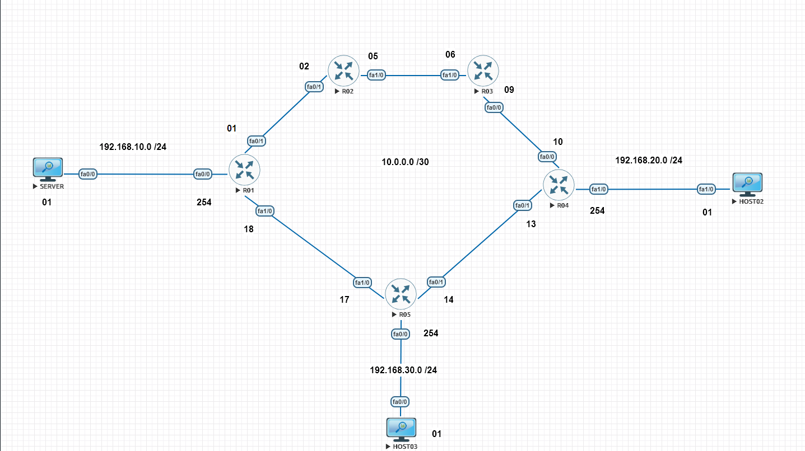
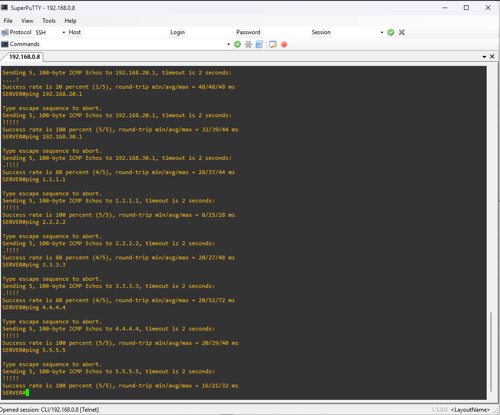
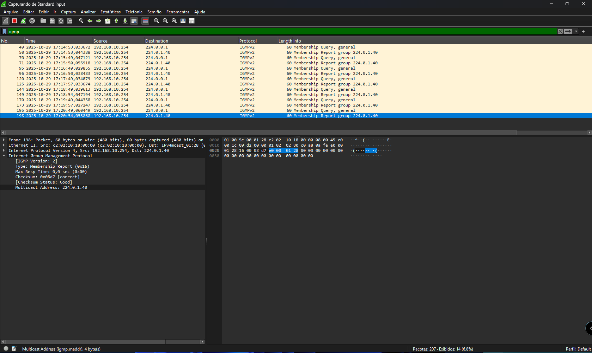
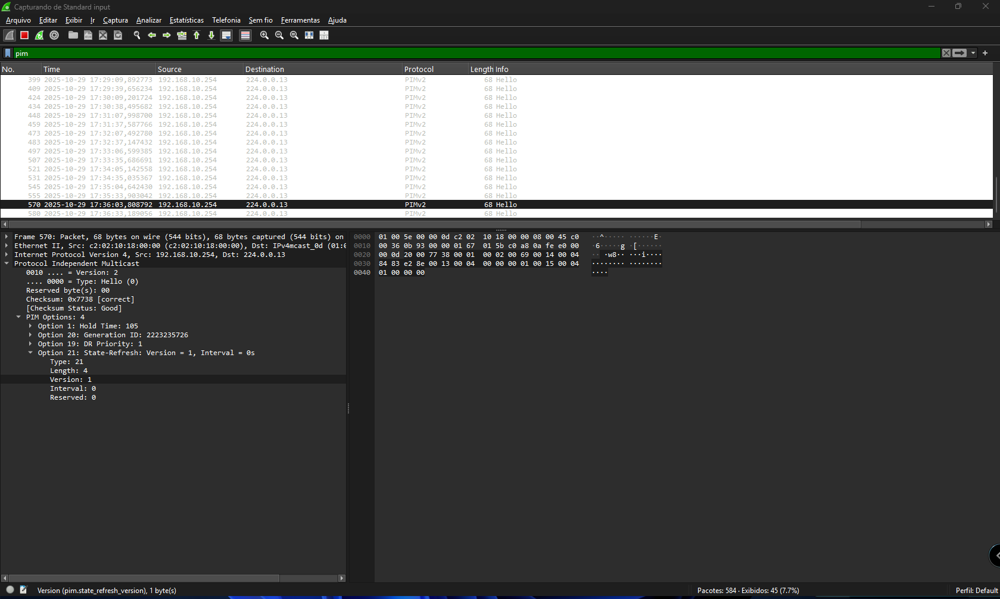
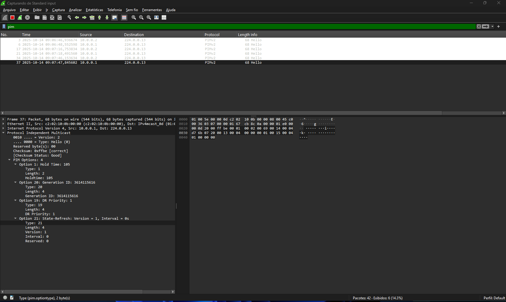

# Índice

- [Índice](#índice)
  - [05 - Exemplo Prático - PIM Sparse Mode](#05---exemplo-prático---pim-sparse-mode)
  - [🧾 Introdução](#-introdução)
  - [🎯 Objetivo do Laboratório](#-objetivo-do-laboratório)
    - [Explicação do Cenário](#explicação-do-cenário)
      - [**O que é o RP (Rendezvous Point)**](#o-que-é-o-rp-rendezvous-point)
      - [🧩 1️⃣ O papel do grupo 224.0.1.40 (Auto-RP Announcement)](#-1️⃣-o-papel-do-grupo-2240140-auto-rp-announcement)
      - [🌳 2️⃣ PIM Sparse Mode — como nasce a árvore multicast](#-2️⃣-pim-sparse-mode--como-nasce-a-árvore-multicast)
      - [🔹 3️⃣ O papel do IGMP Join](#-3️⃣-o-papel-do-igmp-join)
      - [🔀 4️⃣ Do IGMP para o RP: como o Join “descobre o caminho”](#-4️⃣-do-igmp-para-o-rp-como-o-join-descobre-o-caminho)
      - [🛰️ 5️⃣ Agora entra a fonte (source)](#️-5️⃣-agora-entra-a-fonte-source)
  - [🌐 Topologia do Laboratório](#-topologia-do-laboratório)
    - [Testes Preliminares](#testes-preliminares)
    - [Onde o PIM deve ser ativado](#onde-o-pim-deve-ser-ativado)
    - [📘 No nosso cenário](#-no-nosso-cenário)
  - [🧩 Como funciona o Auto-RP da Cisco](#-como-funciona-o-auto-rp-da-cisco)
  - [1️⃣ Os dois papéis do Auto-RP](#1️⃣-os-dois-papéis-do-auto-rp)
  - [2️⃣ Comunicação entre eles](#2️⃣-comunicação-entre-eles)
  - [🧠 Como o domínio decide quem será o RP](#-como-o-domínio-decide-quem-será-o-rp)
  - [3️⃣ Comandos de configuração (modo Auto-RP)](#3️⃣-comandos-de-configuração-modo-auto-rp)
    - [💡 A pegadinha do nome “Auto-RP”](#-a-pegadinha-do-nome-auto-rp)
  - [Ativando o protocolo PIM Sparse Mode](#ativando-o-protocolo-pim-sparse-mode)
    - [🧠 Entendendo a Eleição do Designated Router (DR) no PIM Sparse Mode](#-entendendo-a-eleição-do-designated-router-dr-no-pim-sparse-mode)
    - [💬 Entendendo as Mensagens PIM Hello](#-entendendo-as-mensagens-pim-hello)
    - [⚙️ Configurando o Candidate RP e o Mapping Agent (Auto-RP)](#️-configurando-o-candidate-rp-e-o-mapping-agent-auto-rp)

## 05 - Exemplo Prático - PIM Sparse Mode  

## 🧾 Introdução

Este laboratório demonstra o funcionamento do **roteamento multicast em modo PIM Sparse Mode**, simulando um ambiente Cisco onde apenas hosts interessados recebem o fluxo de dados.  
Diferente do PIM Dense Mode, agora o protocolo utiliza Rendezvous Points (RP) — pontos centrais de encontro entre fontes e receptores.  
Essa mudança altera completamente o comportamento do PIM, tornando o tráfego mais controlado e escalável. Então vamos demonstrar isso de forma prática.  

## 🎯 Objetivo do Laboratório

Este laboratório tem como objetivo compreender o funcionamento do protocolo **PIM Sparse Mode (PIM-SM) e a formação das árvores multicast — a Shared Tree (baseada no RP) e a SPT (Shortest Path Tree)**, em um ambiente Cisco simulado.  
Agora vamos observar na prática o comportamento dos roteadores durante a **eleição de RP**, a formação da **árvore multicast** e a **verificação do caminho reverso (RPF)**, utilizando uma topologia simples com 8 roteadores e hosts simulados.  
Ao longo dos testes, são analisadas as tabelas multicast, os grupos IGMP e os eventos de roteamento dinâmico, demonstrando como o multicast opera sobre uma infraestrutura unicast baseada em OSPF.  

### Explicação do Cenário

Como dito anteriormente, nosso cenário já tem o roteamento pronto e funcional para podermos dar o foco no processo da comunicação **multicast**.  

  

Nesse cenário estamos utilizando **oito roteadores**.  

Então vamos manter a lógica anterior, vamos utilizar **três roteadores disfarçados de hosts**, e por isso não realizaremos muitas configurações neles.  

Nos demais roteadores, que estão interligados entre si, foi configurado apenas o protocolo de roteamento dinâmico **OSPF**, garantindo que todas as redes já possuam **conectividade IP completa** antes de ativarmos o multicast.  

Diferente do **PIM Dense Mode** agora temos a figura do **Rendezvous Point**.  Ao configurar o PIM em modo Sparse, os roteadores passam a escutar os **grupos 224.0.1.39 e 224.0.1.40, utilizados pelo Auto-RP — um mecanismo proprietário da Cisco** para descoberta automática de Rendezvous Points.  
Esses grupos ficam prontos para uso assim que algum roteador for configurado como Candidate RP e outro como Mapping Agent.  

#### **O que é o RP (Rendezvous Point)**  

- O Rendezvous Point (RP) é um ponto central usado apenas pelo PIM Sparse Mode (PIM-SM).  
- Ele funciona como um "ponto de encontro" entre fontes (senders) e receptores (receivers) multicast.
- Todas as fontes primeiro registram-se com o RP, e os receptores enviam joins até o RP.
- Isso cria a árvore compartilhada (*,G).
- Depois, o tráfego pode mudar para a árvore por fonte (S,G), mais otimizada.
  
👉 **Resumo:** o RP é essencial somente no modo Sparse, porque nesse modo o tráfego não é floodado.

#### 🧩 1️⃣ O papel do grupo 224.0.1.40 (Auto-RP Announcement)

✅ O grupo 224.0.1.40 é usado para anunciar automaticamente quem serão os Rendezvous Points (RPs) no domínio PIM-SM.  
  
Mas há **duas entidades** envolvidas nesse processo Auto-RP da Cisco: 

| Função              | Grupo Multicast | Descrição                                                                                                         |
|---------------------|-----------------|-------------------------------------------------------------------------------------------------------------------|
| Candidate RP (C-RP) | 224.0.1.40      | Envia anúncios periódicos dizendo **"posso atuar como RP"**                                                       |
| Mapping Agent (MA)  | 224.0.1.39      | Escuta os anúncios dos C-RPs e escolhe quem será o RP final — depois distribui o mapeamento a todos os roteadores |

Então sim, 224.0.1.40 serve para descobrir os RPs automaticamente, substituindo a configuração manual, mas somente no PIM Sparse Mode.

No Dense Mode, esses grupos aparecem, mas não têm função ativa — são apenas “ouvidos” por compatibilidade.

#### 🌳 2️⃣ PIM Sparse Mode — como nasce a árvore multicast

No Sparse Mode, não há flood and prune, então o multicast não se propaga automaticamente.  
  
👉 O tráfego só flui se houver um receptor que peça explicitamente para participar — e esse pedido começa com o IGMP Join.  

#### 🔹 3️⃣ O papel do IGMP Join

Vamos supor o cenário:

- O Host envia IGMP Join 239.1.1.1
- O roteador local (chamado de Designated Router – DR) recebe esse IGMP Report.

Mas agora vem a dúvida-chave:  
  
**“Como o roteador sabe para onde enviar o join, se ele não faz flood?”**  
  
Excelente 👇  

#### 🔀 4️⃣ Do IGMP para o RP: como o Join “descobre o caminho”

Quando um host envia um IGMP Join, o roteador de borda (DR – Designated Router) aprende que há um receptor interessado.  
A partir daí, o DR precisa descobrir quem é o RP responsável por aquele grupo.  
  
**Exemplo:** o host 192.168.20.2 envia um Join para o grupo 239.1.1.1, e o DR encaminha o PIM Join em direção ao RP 1.1.1.1 seguindo a rota unicast.  
  
- O Host envia IGMP Join → o roteador (DR) aprende que tem um receptor interessado no grupo 239.1.1.1.
- O DR consulta sua tabela PIM:
  “Quem é o RP responsável pelo grupo 239.1.1.1?”
- Essa informação vem de:
  - ip pim rp-address x.x.x.x, ou
  - Auto-RP (224.0.1.39/40), ou
  - BSR (Bootstrap Router).
- O DR então envia uma mensagem PIM Join em direção ao RP, seguindo a rota unicast até ele (sem flood).
  
**🔁 Isso é o ponto crucial:**  
👉 O Join é roteado unicast até o RP, não é floodado.  
  
Cada roteador no caminho cria uma entrada (*,G) na tabela multicast:  

- “Existe um receptor interessado no grupo 239.1.1.1”
- “O tráfego deve ser encaminhado nessa direção caso apareça”.
  
Quando o RP recebe esse Join, ele sabe:

- “Tenho receptores interessados no grupo G”.
  
#### 🛰️ 5️⃣ Agora entra a fonte (source)

Quando um servidor multicast (ex: 192.168.10.1) começa a enviar tráfego para 239.1.1.1:

- O roteador mais próximo da fonte (chamado source DR) envia uma mensagem PIM Register diretamente ao RP (unicast).
- Essa mensagem carrega o tráfego ou anuncia a existência da fonte.
  
O RP aprende:  

- “A fonte S está enviando para o grupo G.”
- O RP então conecta as duas pontas (S e os receptores).
- Ele cria o fluxo (*,G) e (S,G).
- O tráfego multicast começa a fluir da fonte até o RP, e do RP até os receptores.
- Depois que o tráfego é estabelecido, o roteador receptor pode migrar para a SPT (Shortest Path Tree), formando um caminho direto até a fonte, sem depender do RP.

## 🌐 Topologia do Laboratório

A topologia utilizada neste laboratório é composta por cinco roteadores principais (R01, R02, R03, R04 e R05) e três hosts simulados (Server, Host02 e Host03).  
Os hosts são roteadores Cisco “disfarçados” de PCs, configurados apenas com endereços IP e adesão a grupos multicast via IGMP.  
O protocolo **OSPF** é utilizado para prover conectividade unicast entre todos os roteadores, enquanto o **PIM Sparse Mode (PIM-SM)** foi configurado para o tráfego multicast, com uso inicial do Auto-RP para eleição automática do Rendezvous Point (RP).

**🔧 Endereçamento e Funções**  

| **Dispositivo** | **Interface** | **Endereço IP / Máscara Rede** | **Conexão Função**                                    |
|-----------------|---------------|--------------------------------|-------------------------------------------------------|
| R01             | Loopback0     | 1.1.1.1 /32                    | Identificação / Router-ID OSPF                        |
|                 | Fa0/0         | 192.168.10.254 /24             | LAN do Server - Gateway multicast para Server         |
|                 | Fa0/1         | 10.0.0.1 /30                   | Link com R02 PIM + OSPF                               |
|                 | Fa1/0         | 10.0.0.18 /30                  | Link com R05 PIM + OSPF                               |
| R02             | Loopback0     | 2.2.2.2 /32                    | Identificação / Router-ID OSPF                        |
|                 | Fa0/0         | 10.0.0.2 /30                   | Link com R01 PIM + OSPF                               |
|                 | Fa1/0         | 10.0.0.5 /30                   | Link com R03 PIM + OSPF                               |
| R03             | Loopback0     | 3.3.3.3 /32                    | Identificação / Router-ID OSPF                        |
|                 | Fa0/0         | 10.0.0.6 /30                   | Link com R02 PIM + OSPF                               |
|                 | Fa1/0         | 10.0.0.9 /30                   | Link com R04 PIM + OSPF                               |
| R04             | Loopback0     | 4.4.4.4 /32                    | Identificação / Router-ID OSPF                        |
|                 | Fa0/0         | 10.0.0.10 /30                  | Link com R03 PIM + OSPF                               |
|                 | Fa1/0         | 10.0.0.13 /30                  | Link com R05 PIM + OSPF                               |
|                 | Fa1/1         | 192.168.20.254 /24             | LAN do Host02 - Gateway multicast para Host02         |
| R05             | Loopback0     | 5.5.5.5 /32                    | Identificação / Router-ID OSPF                        |
|                 | Fa0/0         | 10.0.0.14 /30                  | Link com R04 PIM + OSPF                               |
|                 | Fa1/0         | 10.0.0.17 /30                  | Link com R01 PIM + OSPF                               |
|                 | Fa0/1         | 192.168.30.254 /24             | LAN do Host03 Gateway multicast para Host03           |
| Server          | Fa0/0         | 192.168.10.1 /24               | LAN com R01 Fonte multicast (sender)                  |
| Host02          | Fa0/0         | 192.168.20.1 /24               | LAN com R04 Receptor multicast (join-group 239.1.1.1) |
| Host03          | Fa0/0         | 192.168.30.1 /24               | LAN com R05 Host não inscrito (sem join IGMP)         |

**🧭 Resumo da Lógica**  

- O Server (192.168.10.1) envia tráfego multicast para o grupo 239.1.1.1.
- Apenas o Host02 (192.168.20.1) envia IGMP Join solicitando adesão ao grupo 239.1.1.1.
- O Host03 (192.168.30.1) não participa, servindo como referência para áreas sem receptores.
- O PIM Sparse Mode depende de um Rendezvous Point (RP) — no primeiro momento, selecionado automaticamente via Auto-RP (grupos 224.0.1.39 e 224.0.1.40).
- O roteador designado como RP será o ponto de encontro entre a fonte (Server) e os receptores (Host02).
- O RPF (Reverse Path Forwarding) é utilizado para validar o caminho de retorno até a fonte multicast com base na tabela OSPF.

Após a formação inicial da árvore compartilhada (*,G) via RP, os roteadores podem comutar para a árvore de menor custo (SPT – Shortest Path Tree), estabelecendo o caminho direto entre fonte e receptores.

### Testes Preliminares

Como feito no exemplo anterior, vamos realizar um teste de comunicação entre todos os equipamentos com o ping só para garantir a comunicação.  
**OBS:** nos roteadores eu configurei interfaces de LOOPABCK. Então R01 tem o ip 1.1.1.1 /32, R02 tem o ip 2.2.2.2 /32, R03 tem o ip 3.3.3.3 /32, R04 4.4.4.4/32 e R05 5.5.5.5/32 .  



Com isso, podemos ver que todos os hosts se alcançam e se comunicam. Mas o mais importante é observer a a tabela de roteamento para podermos entender um conceito simples.  
  
Agora a primeira coisa que precisamos ativar é o **roteamento multicast** no equipamento.  
  
>R01(config)#ip multicast-routing  
  
Só para confirmar, vamos verificar o roteamento multicast.  

```ios
R01#show ip multicast  
  Multicast Routing: enabled  
  Multicast Multipath: disabled  
  Multicast Route limit: No limit  
  Multicast Triggered RPF check: enabled  
  Multicast Fallback group mode: Sparse  
  Multicast DVMRP Interoperability: disabled  
  Number of multicast boundaries configured with filter-autorp option: 0  
R01#  
```

**ONS:** Agora que temos o roteamento multicast ativo, precisamos ativar o protocolo **PIM**. Esse protocolo deve ser ativado nas interfaces onde a comunicação ira ocorrer. Então, repetir o processo de R01 a R05.

### Onde o PIM deve ser ativado

No modo **Sparse Mode (PIM-SM)**, o tráfego multicast não é floodado automaticamente — ele só percorre interfaces onde existe interesse explícito (IGMP Join) ou onde há necessidade de alcançar o **Rendezvous Point (RP)**.  
  
👉 Portanto, o PIM deve ser ativado em todas as interfaces que participam do domínio multicast, ou seja:

- **Interfaces entre roteadores PIM vizinhos** (para formar a árvore multicast e permitir a troca de mensagens PIM Join/Prune);
- **Interfaces conectadas a redes com fontes (senders) ou receptores (receivers) multicast**;
- **Interfaces de loopback**, quando utilizadas como endereço do RP ou como Router-ID PIM.

✅ **Resumo da regra prática para PIM-SM**  

| Situação                           | PIM deve ser ativado?    | Motivo                                                         |
|------------------------------------|--------------------------|----------------------------------------------------------------|
| Interface entre roteadores         | ✅ Sim                   | Necessário para formar vizinhança PIM e propagar joins/prunes  |
| Interface com host receptor (IGMP) | ✅ Sim                   | Permite que o roteador DR receba e encaminhe IGMP Reports      |
| Interface com fonte multicast      | ✅ Sim                   | Permite que o roteador DR da fonte envie PIM Register ao RP    |
| Interface Loopback usada como RP   | ✅ Sim                   | O RP precisa estar ativo no domínio PIM                        |
| Loopback apenas como Router-ID     | ⚙️ Opcional              | Apenas usada como origem lógica dos pacotes PIM                |  

🌀 Observação importante sobre as Loopbacks

No PIM Sparse Mode, a Loopback pode ter uma função mais relevante do que no Dense Mode:

- Se ela for usada como endereço do RP (definido manualmente com **ip pim rp-address** <loopback>), o PIM deve estar habilitado nela.
- Se for usada apenas como **Router-ID do OSPF/PIM, não há necessidade de ativar PIM nela**.
  
💡 Em geral, em laboratórios e ambientes de estudo, é prática comum habilitar o PIM apenas nas interfaces físicas e na loopback do RP.

### 📘 No nosso cenário

Vamos ativar o PIM em todas as interfaces de roteadores que fazem parte do domínio multicast, incluindo:  

- Todas as interfaces ponto a ponto entre roteadores (R01–R02, R02–R03, R03–R04, R04–R05, R05–R01);
- Interfaces conectadas às LANs dos hosts (Server, Host02 e Host03).
- Apenas as interfaces de Loopback serão avaliadas conforme sua função:
  - Se forem usadas apenas como identificação OSPF, não precisam de PIM;
  - Se forem usadas como RP, devem ter PIM ativo.

Antes de ativarmos, é importante compreender o conceito de eleição dos **Rendezvous Point (RP)**, ou o **Auto RP**.  

## 🧩 Como funciona o Auto-RP da Cisco

O Auto-RP é um mecanismo proprietário da Cisco que automatiza a descoberta e distribuição de RPs dentro de um domínio **PIM Sparse Mode**.

Em vez de configurar manualmente o comando **ip pim rp-address** em todos os roteadores, o Auto-RP usa dois papéis principais e dois grupos multicast reservados para distribuir essa informação automaticamente.

## 1️⃣ Os dois papéis do Auto-RP

| Função        | Sigla    | Responsabilidade                                                          | Grupo Multicast Utilizado |
|---------------|----------|---------------------------------------------------------------------------|---------------------------|
| Candidate RP  | **C-RP** | Anuncia-se como potencial RP para determinados grupos multicast           | **224.0.1.40**            |
| Mapping Agent | **MA**   | Escuta os anúncios dos C-RPs, escolhe o RP final e distribui o mapeamento | **224.0.1.39**            |  

## 2️⃣ Comunicação entre eles

O Candidate RP envia mensagens Auto-RP Announcement (anúncio) para o grupo 224.0.1.40, dizendo:  

- 🗣️ “Eu posso ser o RP para os grupos **224.0.0.0 – 239.255.255.255**”.  

O Mapping Agent (MA) se inscreve nesse grupo **224.0.1.40 (via PIM/IGMP)** e escuta todos os anúncios.  
Ele então escolhe um ou mais RPs válidos e repassa essa informação para todos os roteadores PIM do domínio via grupo **224.0.1.39**, através da mensagem Auto-RP Mapping.  
  
Todos os roteadores escutam o **224.0.1.39** e, assim, aprendem qual é o RP ativo para cada grupo multicast.

## 🧠 Como o domínio decide quem será o RP

O Mapping Agent é quem escolhe o RP com base nos anúncios que recebe.  
A seleção normalmente segue critérios simples:  

- Todos os **C-RPs** válidos são incluídos na tabela de mapeamento.
- Cada grupo multicast pode ter um **RP diferente** (dependendo do range anunciado).

Se houver mais de um C-RP para o mesmo grupo, o MA usa o endereço IP mais alto como critério de desempate.  

💡 **Em laboratório, normalmente deixamos apenas um Mapping Agent e um ou dois Candidate RPs — assim dá pra ver a eleição e o tráfego de anúncios claramente.**

## 3️⃣ Comandos de configuração (modo Auto-RP)

### 💡 A pegadinha do nome “Auto-RP”

Apesar do nome “Auto-RP” sugerir que tudo é automático, ele não é totalmente automático.  
O que o Auto-RP automatiza é a descoberta e distribuição do RP dentro do domínio PIM-SM — ou seja, os roteadores aprendem automaticamente quem é o RP sem precisar do comando manual ip pim rp-address.  
Mas para isso acontecer, alguém precisa gerar e propagar essa informação — e é aí que entram os dois papéis:  

- **Candidate RP (C-RP)** → quem “se oferece” para ser RP.
- **Mapping Agent (MA)** → quem “ouve”, escolhe e anuncia o vencedor.

**OBS:** Esses papéis devem ser definidos manualmente pelo administrador.  
  
🧠 **Analogia simples (pensa como uma eleição)**  
  
Imagine que o domínio PIM é uma cidade:  

- Vários roteadores podem se candidatar a prefeito **(Candidate RP)**.
- Mas precisa ter um cartório eleitoral **(Mapping Agent)** que receba as candidaturas e divulgue quem foi eleito para toda a cidade.

👉 **O processo de votação e divulgação é automático — mas os papéis são definidos manualmente**.  
Sem pelo menos **um Mapping Agent e um Candidate RP**, não há eleição alguma.  
  
📊 **O que é automático e o que é manual**  

| Ação                               | Automático? | Quem decide                 |
|------------------------------------|-------------|-----------------------------|
| Escolher quem é Candidate RP       | ❌ Não      | Administrador              |
| Escolher quem é Mapping Agent      | ❌ Não      | Administrador              |
| Eleger o RP (entre os candidatos)  | ✅ Sim      | Mapping Agent              |
| Distribuir o mapeamento para todos | ✅ Sim      | Mapping Agent              |
| Aprender o RP e atualizar a tabela | ✅ Sim      | Todos os roteadores PIM-SM |

🧱 **Em projeto real (ou laboratório bem documentado)**
  
Essa escolha deve ser feita pela pelo administrador e precisa estar no projeto.  
No nosso caso, com cinco roteadores, uma topologia em anel e um laboratório educacional, uma boa prática é:  

| Função                 | Roteador             | Justificativa                                                        |
|------------------------|----------------------|----------------------------------------------------------------------|
| Mapping Agent          | R01                  | Está próximo da fonte multicast (Server) e tem conectividade central |
| Candidate RP           | R02                  | Está no meio do domínio PIM, facilita convergência                   |
| Demais (R03, R04, R05) | Participantes PIM-SM | Aprendem o RP automaticamente via 224.0.1.39                         |  

⚙️ **O que o Auto-RP faz automaticamente**  
  
Depois que você define quem é C-RP e MA:  

- O **C-RP** envia anúncios PIM Auto-RP para **224.0.1.40**.
- O **MA** escuta, escolhe o RP e envia o mapeamento para **224.0.1.39**.

Todos os roteadores escutam 224.0.1.39 e aprendem:  

- “Para o grupo 239.1.1.1, o RP é 2.2.2.2”.
- Se o C-RP cair, o MA detecta a ausência dos anúncios e remove o RP do mapeamento.

👉 **Ou seja: a distribuição e manutenção são automáticas, mas a existência do MA e do C-RP depende de você configurá-los.**

## Ativando o protocolo PIM Sparse Mode

Agora que entendemos a lógica, vamos ativar o protocolo em todas as interfaces que participam do multicast nos roteadores, de R01 a R05.

```ios
R01#show ip int br
Interface                  IP-Address      OK? Method Status                Protocol
FastEthernet0/0            192.168.10.254  YES NVRAM  up                    up
FastEthernet0/1            10.0.0.1        YES NVRAM  up                    up
FastEthernet1/0            10.0.0.18       YES NVRAM  up                    up
Loopback0                  1.1.1.1         YES NVRAM  up                    up
R01#conf t
Enter configuration commands, one per line.  End with CNTL/Z.
R01(config)#int f0/0
R01(config-if)#ip pim sparse-mode
R01(config-if)#
*Mar  1 02:00:05.663: %PIM-5-DRCHG: DR change from neighbor 0.0.0.0 to 192.168.10.254 on interface FastEthernet0/0
R01(config-if)#int f0/1
R01(config-if)#ip pim sparse-mode
R01(config-if)#
*Mar  1 02:00:20.615: %PIM-5-DRCHG: DR change from neighbor 0.0.0.0 to 10.0.0.1 on interface FastEthernet0/1
R01(config-if)#int f1/0
R01(config-if)#ip pim sparse-mode
R01(config-if)#
*Mar  1 02:00:36.563: %PIM-5-DRCHG: DR change from neighbor 0.0.0.0 to 10.0.0.18 on interface FastEthernet1/0
R01(config-if)#
```

Agora que o **PIM Sparse-Mode** foi ativado, vamos analisar a tabela de **roteamento multicast:**

```ios
R01#show ip mrout
IP Multicast Routing Table
Flags: D - Dense, S - Sparse, B - Bidir Group, s - SSM Group, C - Connected,
       L - Local, P - Pruned, R - RP-bit set, F - Register flag,
       T - SPT-bit set, J - Join SPT, M - MSDP created entry,
       X - Proxy Join Timer Running, A - Candidate for MSDP Advertisement,
       U - URD, I - Received Source Specific Host Report,
       Z - Multicast Tunnel, z - MDT-data group sender,
       Y - Joined MDT-data group, y - Sending to MDT-data group
Outgoing interface flags: H - Hardware switched, A - Assert winner
 Timers: Uptime/Expires
 Interface state: Interface, Next-Hop or VCD, State/Mode

(*, 224.0.1.40), 00:15:57/00:02:04, RP 0.0.0.0, flags: DCL
  Incoming interface: Null, RPF nbr 0.0.0.0
  Outgoing interface list:
    FastEthernet0/0, Forward/Sparse, 00:15:57/00:02:04

R01#
```

Então eu realizei uma captura de pacotes na interface F0/0 de R01.  

  

Então podemos verificar que o grupo **224.0.1.40** foi ativado.  

### 🧠 Entendendo a Eleição do Designated Router (DR) no PIM Sparse Mode

Quando ativamos o **PIM Sparse Mode** nas interfaces, cada rede multicast (LAN) com mais de um roteador participante precisa escolher um roteador responsável por interagir com os hosts locais e com o **RP (Rendezvous Point)**.  
Esse roteador é chamado de **Designated Router (DR).**  
  
🔍 **O que é o DR**  
  
O Designated Router tem duas funções principais:  

| Situação                               | Função do DR                                                                                     |
|----------------------------------------|--------------------------------------------------------------------------------------------------|
| Lado dos receptores (hosts multicast)  | Recebe mensagens IGMP Report dos hosts interessados e envia mensagens PIM Join em direção ao RP. |
| Lado das fontes (servidores multicast) | Detecta tráfego multicast local e envia PIM Register diretamente ao RP.                          |  

⚙️ **Como ocorre a eleição do DR**  
  
A eleição do DR é feita automaticamente entre todos os roteadores PIM que compartilham a mesma rede multicast.  

🔸 Critério de eleição:  
  
- O roteador com o maior endereço IP ativo na interface vence a eleição.
- Em caso de empate (endereços iguais, o que é raro), o endereço de Router-ID PIM (geralmente a Loopback) é usado como desempate.

🔸 Exemplo real do log:  

```ios
*Mar  1 02:00:36.563: %PIM-5-DRCHG: DR change from neighbor 0.0.0.0 to 10.0.0.18 on interface FastEthernet1/0
```

🔹 **Interpretação:**  

- Houve uma mudança de **DR** na interface FastEthernet1/0.
- O roteador **10.0.0.18** foi eleito como o novo Designated Router.
- O endereço **0.0.0.0** indica que antes não havia DR definido (primeira eleição).  
  
🚫 **Não existe BDR no PIM**
  
Diferente do **OSPF, o PIM não possui Backup Designated Router (BDR)**.  
Somente um DR é responsável pela rede.  
  
Se o DR atual falhar, os demais roteadores detectam a ausência de mensagens **PIM Hello (por padrão a cada 30 segundos)** e realizam uma nova eleição automaticamente.  
O roteador com o próximo IP mais alto assume o papel de DR sem interrupção perceptível no domínio multicast.  
  
🧭 **Resumo prático**

| Item                         | PIM Dense Mode             | PIM Sparse Mode          |
|------------------------------|----------------------------|--------------------------|
| DR existe?                   | Sim, mas é pouco relevante | ✅ Sim, papel essencial |
| BDR existe?                  | ❌ Não                     | ❌ Não                  |
| Flood de tráfego             | ✅ Sim                     | ❌ Não                  |
| Comunicação com RP           | ❌ Não usa RP              | ✅ Sim, feita pelo DR   |
| Envio de PIM Join / Register | Todos enviam               | Apenas o DR envia        |

Então podemos observar esse comportamento através da captura de pacotes onde o Whireshark foi ativado na interface F0/0 de R01.  



### 💬 Entendendo as Mensagens PIM Hello

As mensagens PIM Hello são a base de toda a comunicação entre roteadores PIM dentro de um domínio multicast.  
Elas são trocadas periodicamente entre roteadores vizinhos, mantêm a vizinhança ativa, e também controlam a eleição do Designated Router (DR).  
  
🧩 **Funções das mensagens Hello**  

| Função                     | Descrição                                                                                |
|----------------------------|------------------------------------------------------------------------------------------|
| Descoberta de vizinhos PIM | Permite que roteadores PIM na mesma rede LAN se reconheçam.                              |
| Eleição do DR              | Define qual roteador será o Designated Router na LAN.                                    |
| Troca de parâmetros        | Informa temporizadores, prioridade de DR e capacidade de recursos (ex: Join suppression).|
| Detecção de falhas         | Se um roteador parar de enviar Hellos dentro do Holdtime, é considerado inativo.         |  
  
⚙️ **Estrutura das mensagens Hello**  
  
Cada mensagem PIM Hello contém um cabeçalho com parâmetros negociados entre os roteadores.  
  
| Campo          | Descrição                                                                 | Valor típico                           |
|----------------|---------------------------------------------------------------------------|----------------------------------------|
| Type           | Tipo de mensagem **PIM (Hello = 0x00)**                                   | **0x00**                               |
| Holdtime       | Tempo máximo que um roteador considera o vizinho ativo sem receber Hellos | **105 segundos (3,5 × período Hello)** |
| DR Priority    | Define a prioridade do roteador na eleição de DR                          | **1 (padrão)**                         |
| Generation ID  | Identificador único do roteador, muda quando o roteador reinicia          | Valor aleatório                        |
| Hello Interval | Tempo entre Hellos enviados                                               | **30 segundos (padrão Cisco)**         |
| PIM Mode       | Indica se é Sparse, Dense ou **Bidir**                                    | Sparse (modo atual do laboratório)     |  

💡 Esses parâmetros podem ser visualizados diretamente no Wireshark, no campo “PIM Hello Options”.  
  
🔍**Exemplo de troca de mensagens Hello**
  
Após ativar o PIM Sparse Mode nas interfaces, os roteadores começam a trocar mensagens Hello automaticamente:

```ios
*Mar  1 02:00:05.663: %PIM-5-DRCHG: DR change from neighbor 0.0.0.0 to 192.168.10.254 on interface FastEthernet0/0
*Mar  1 02:00:20.615: %PIM-5-DRCHG: DR change from neighbor 0.0.0.0 to 10.0.0.1 on interface FastEthernet0/1
*Mar  1 02:00:36.563: %PIM-5-DRCHG: DR change from neighbor 0.0.0.0 to 10.0.0.18 on interface FastEthernet1/0
```

👉 **Esses logs indicam que o roteador recebeu um Hello válido de 10.0.0.1 e estabeleceu a vizinhança PIM.**  
Logo após, a eleição de DR é feita com base nos campos DR Priority e IP Address.  
  
🧭 **Resumo prático**  

| Ação                                    | Tipo de mensagem    | Destino    | TTL | Finalidade                  |
|-----------------------------------------|---------------------|------------|-----|-----------------------------|
| Troca de informações entre vizinhos PIM | Hello               | 224.0.0.13 | 1   | Manter vizinhança ativa     |
| Eleição do DR                           | Hello               | 224.0.0.13 | 1   | Eleger roteador responsável |
| Detecção de falha de vizinho            | Timeout (sem Hello) | —          | —   | Remover roteador inativo    |

### ⚙️ Configurando o Candidate RP e o Mapping Agent (Auto-RP)

Agora que o PIM Sparse Mode está ativo em todas as interfaces, o domínio multicast já está pronto para eleger o Rendezvous Point (RP).  
Como estamos utilizando o Auto-RP da Cisco, precisamos definir manualmente quem será o Candidate RP (C-RP) e quem atuará como Mapping Agent (MA).  

🔹 Lembrando:  
  
- O Candidate RP anuncia-se ao grupo **224.0.1.40** dizendo: “posso ser o RP”.
- O Mapping Agent escuta esses anúncios e envia o mapeamento final para todos os roteadores via grupo **224.0.1.39**.  

🧩 1️⃣ **Escolha dos equipamentos**  
  
Para este laboratório:  
  
| Função        | Roteador | Loopback usada | Justificativa técnica                                                             |
|---------------|----------|----------------|-----------------------------------------------------------------------------------|
| Candidate RP  | R02      | 2.2.2.2        | Está centralizado no domínio PIM, ideal para convergência                         |
| Mapping Agent | R01      | 1.1.1.1        | Próximo à fonte multicast (Server), reduz latência para distribuição dos anúncios |  

Assim, os roteadores R01 e R02 passam a desempenhar papéis complementares no processo de descoberta do RP.  

🎯 **Sobre as Interfaces Loopback**  
  
No PIM Sparse Mode, a loopback pode exercer dois papéis distintos:

- Apenas identificação lógica do roteador — usada como Router-ID ou origem de sessões OSPF/PIM.
- Endereço lógico de RP (Rendezvous Point) — usada como ponto central da árvore multicast.

👉 **Só o segundo caso exige que o PIM esteja ativo na loopback.**

🧩 **Regra prática (Cisco e CCNP)**

| Função da Loopback                                         | Precisa ativar PIM? | Motivo                                                                                             |
|------------------------------------------------------------|---------------------|----------------------------------------------------------------------------------------------------|
| Loopback usada como RP (Candidate RP)                      | ✅ Sim       | O RP precisa participar ativamente do domínio PIM para enviar/receber mensagens Register, Join e Auto-RP  |
| Loopback usada como Mapping Agent   | ✅ Sim (recomendado)               | Embora o MA só envie anúncios Auto-RP, a interface é usada como origem das mensagens PIM (para 224.0.1.39) |
| Loopback usada apenas como Router-ID (OSPF, identificação) | ❌ Não              | Ela não participa do encaminhamento multicast nem troca mensagens PIM.                             |
| Loopback em roteadores comuns (não-RP, não-MA)             | ❌ Não              | Não há função multicast direta associada a ela.                                                   |  

💬 **Em resumo**  

- Ative o PIM-SM nas loopbacks **apenas do Candidate RP e do Mapping Agent**.
- As demais loopbacks podem ficar sem PIM, já que não fazem parte do processo de descoberta nem da árvore multicast.
- Isso torna o ambiente mais limpo e evita sobrecarga desnecessária no plano de controle.  
  
🧰 2️⃣ **Comandos de configuração**  
  
➡️ No R02 (Candidate RP):  

```ios
R02(config)#ip pim send-rp-announce loopback0 scope 16 group-list 1
R02(config)#access-list 1 permit 224.0.0.0 15.255.255.255
```

🔎 **Explicação:**
  
- **send-rp-announce**: indica que o roteador R02 será Candidate RP.
- **loopback0**: define o endereço 2.2.2.2 como IP de identificação do RP.
- **scope 16**: limita o alcance dos anúncios ao domínio local PIM.
- **group-list 1**: especifica o intervalo de grupos multicast para os quais o RP é válido (aqui, todo o range padrão).  

➡️ No R01 (Mapping Agent):  

```ios
R01(config)#int lo0
R01(config-if)#ip pim sparse-mode
R01(config-if)#
*Mar  1 00:18:25.859: %PIM-5-DRCHG: DR change from neighbor 0.0.0.0 to 1.1.1.1 on interface Loopback0
R01(config-if)#exit
R01(config)#ip pim send-rp-discovery loopback 0 scope 16
R01(config)#
```

🔎 **Explicação:**

- **send-rp-discovery**: indica que R01 atuará como Mapping Agent (MA).
- Ele escutará os anúncios dos **C-RPs (via 224.0.1.40) e redistribuirá os mapeamentos (via 224.0.1.39)**.  

3️⃣ **Captura e observação via Wireshark**  

🧩 **Contexto da captura**  

Como não temos como realizar capturas de pacotes em interfaces loopback, vou escolher utilizar qualquer uma das interfaces para verificarmos o comportamento dos pacotes.  

**Entendendo o que você quer capturar**  
  
Há três tipos principais de mensagens que vão aparecer entre R01 e R02 logo após a configuração:  

| Tipo      | Protocolo        | Propósito                  | Observação                                 |                             |
|-----------|------------------|----------------------------|--------------------------------------------|-----------------------------|
| PIM Hello | PIMv2 (Type 0)   | Descoberta e eleição de DR                                              | TTL = 1, destino 224.0.0.13 |
| Auto-RP   | Announcement     | PIMv2 (Type 13) - Candidate RP se anuncia (R02 → 224.0.1.40)            | Proprietário Cisco          |
| Auto-RP   | Discovery        | PIMv2 (Type 13) - Mapping Agent divulga o mapeamento (R01 → 224.0.1.39) | Proprietário Cisco          | 

Para capturar tudo que interessa agora — Hellos, Auto-RP, e IGMP futuramente — use este filtro único e combinado:

```whiresahrk
pim || igmp || ip.dst == 224.0.1.39 || ip.dst == 224.0.1.40
````

  

Como podemos observar, temos as mensagens de Auto-RP comprovando o funcionamento do Candidate RP e do Mapping Agent.  
  
Mas para validar, vamos entrar em R01 e R02 e digitar o comando **show ip pim rp mapping**.  
  
**R01**  

```ios
R01#show ip pim rp mapping
PIM Group-to-RP Mappings
This system is an RP-mapping agent (Loopback0)

Group(s) 224.0.0.0/4
  RP 2.2.2.2 (?), v2v1
    Info source: 2.2.2.2 (?), elected via Auto-RP
         Uptime: 00:09:18, expires: 00:02:39
R01#
```

**R02**  

```ios
R02#show ip pim rp mapping
PIM Group-to-RP Mappings
This system is an RP (Auto-RP)

Group(s) 224.0.0.0/4
  RP 2.2.2.2 (?), v2v1
    Info source: 1.1.1.1 (?), elected via Auto-RP
         Uptime: 00:46:15, expires: 00:02:21
R02#
```

