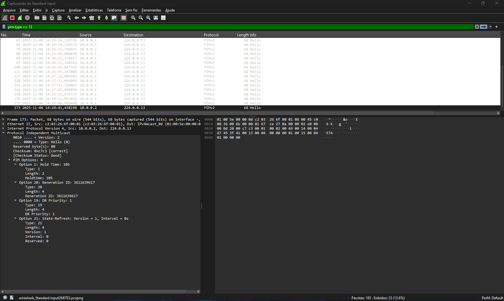

# Índice

- [Índice](#índice)
  - [08 - Exemplo Pratico - Pim Sparse Mode com Bootstrap Router IETF](#08---exemplo-pratico---pim-sparse-mode-com-bootstrap-router-ietf)
  - [🧾 Introdução](#-introdução)
  - [🎯 Objetivo do Laboratório](#-objetivo-do-laboratório)
    - [Explicação do Cenário](#explicação-do-cenário)
      - [**O que é o RP (Rendezvous Point)**](#o-que-é-o-rp-rendezvous-point)
      - [🧩 1️⃣ O papel do Bootstrap Router (BSR)](#-1️⃣-o-papel-do-bootstrap-router-bsr)
      - [🌳 2️⃣ O comportamento do PIM Sparse Mode](#-2️⃣-o-comportamento-do-pim-sparse-mode)
      - [🔹 3️⃣ O papel do IGMP Join](#-3️⃣-o-papel-do-igmp-join)
      - [🔀 4️⃣ Como o DR encontra o RP correto](#-4️⃣-como-o-dr-encontra-o-rp-correto)
      - [🛰️ 5️⃣ Quando a fonte começa a transmitir](#️-5️⃣-quando-a-fonte-começa-a-transmitir)
  - [🌐 Topologia do Laboratório](#-topologia-do-laboratório)
    - [Testes Preliminares](#testes-preliminares)
    - [Onde o PIM deve ser ativado](#onde-o-pim-deve-ser-ativado)
    - [📘 No nosso cenário](#-no-nosso-cenário)
  - [🧩 Como funciona o Auto-RP da Cisco](#-como-funciona-o-auto-rp-da-cisco)
  - [1️⃣ Os dois papéis do Auto-RP](#1️⃣-os-dois-papéis-do-auto-rp)
  - [2️⃣ Comunicação entre eles](#2️⃣-comunicação-entre-eles)
  - [🧠 Como o domínio decide quem será o RP](#-como-o-domínio-decide-quem-será-o-rp)
  - [3️⃣ Comandos de configuração (modo Auto-RP)](#3️⃣-comandos-de-configuração-modo-auto-rp)
    - [💡 A pegadinha do nome “Auto-RP”](#-a-pegadinha-do-nome-auto-rp)
  - [Ativando o protocolo PIM Sparse Mode](#ativando-o-protocolo-pim-sparse-mode)
    - [🧠 Entendendo a Eleição do Designated Router (DR) no PIM Sparse Mode](#-entendendo-a-eleição-do-designated-router-dr-no-pim-sparse-mode)
    - [💬 Entendendo as Mensagens PIM Hello](#-entendendo-as-mensagens-pim-hello)
    - [⚙️ Configurando o Candidate RP e o Mapping Agent (Auto-RP)](#️-configurando-o-candidate-rp-e-o-mapping-agent-auto-rp)
  - [Quando o Server entra na jogada](#quando-o-server-entra-na-jogada)
    - [🌳 Formação da Árvore Multicast (\*,G) — A Shared Tree](#-formação-da-árvore-multicast-g--a-shared-tree)
    - [⚡ Migração para a Shortest Path Tree (SPT)](#-migração-para-a-shortest-path-tree-spt)
    - [🧩 Propagação das mensagens Auto-RP — O papel do ip pim autorp listener](#-propagação-das-mensagens-auto-rp--o-papel-do-ip-pim-autorp-listener)
  - [🌳 Formação da Árvore Multicast — do IGMP Join ao PIM Register](#-formação-da-árvore-multicast--do-igmp-join-ao-pim-register)
    - [🧩 1️⃣ O início de tudo: o IGMP Join](#-1️⃣-o-início-de-tudo-o-igmp-join)
    - [🛰️ 2️⃣ O papel do DR (Designated Router)](#️-2️⃣-o-papel-do-dr-designated-router)
    - [⚙️ 3️⃣ O nascimento da árvore compartilhada (\*,G)](#️-3️⃣-o-nascimento-da-árvore-compartilhada-g)
    - [📡 4️⃣ A fonte começa a transmitir — PIM Register](#-4️⃣-a-fonte-começa-a-transmitir--pim-register)
    - [🔁 5️⃣ RP conecta as pontas e inicia o fluxo](#-5️⃣-rp-conecta-as-pontas-e-inicia-o-fluxo)
    - [⚙️ 6️⃣ A transição para a Árvore de Caminho Mais Curto (SPT)](#️-6️⃣-a-transição-para-a-árvore-de-caminho-mais-curto-spt)
    - [✅ Conclusão](#-conclusão)
  - [🧰 Validação e Troubleshooting do PIM Sparse Mode](#-validação-e-troubleshooting-do-pim-sparse-mode)
    - [1️⃣ Verificar os vizinhos PIM — show ip pim neighbor](#1️⃣-verificar-os-vizinhos-pim--show-ip-pim-neighbor)
    - [2️⃣ Confirmar o RP ativo — show ip pim rp mapping](#2️⃣-confirmar-o-rp-ativo--show-ip-pim-rp-mapping)
    - [3️⃣ Verificar os grupos IGMP — show ip igmp groups](#3️⃣-verificar-os-grupos-igmp--show-ip-igmp-groups)
    - [4️⃣ Validar a tabela de rotas multicast — show ip mroute](#4️⃣-validar-a-tabela-de-rotas-multicast--show-ip-mroute)
    - [5️⃣ Confirmar o RPF — show ip rpf](#5️⃣-confirmar-o-rpf--show-ip-rpf)
    - [6️⃣ Confirmar a recepção de tráfego multicast](#6️⃣-confirmar-a-recepção-de-tráfego-multicast)
    - [🧭 7️⃣ Diagnóstico rápido de problemas comuns](#-7️⃣-diagnóstico-rápido-de-problemas-comuns)
  - [🧾 Resumo Final — Fluxo do PIM Sparse Mode](#-resumo-final--fluxo-do-pim-sparse-mode)
  - [✅ Conclusão](#-conclusão-1)
  - [📘 Tabela de Comandos](#-tabela-de-comandos)
    - [R01 – Mapping Agent (MA)](#r01--mapping-agent-ma)
    - [📗 R02 – Candidate RP (C-RP)](#-r02--candidate-rp-c-rp)
    - [📙 R03 – Roteador de Trânsito (PIM-SM Participant)](#-r03--roteador-de-trânsito-pim-sm-participant)
    - [📒 R04 – Roteador com Receptor Multicast (Host02)](#-r04--roteador-com-receptor-multicast-host02)
    - [📕 R05 – Roteador com Host Não Inscrito (Host03)](#-r05--roteador-com-host-não-inscrito-host03)
    - [🖥️ SERVER – Fonte Multicast (Sender)](#️-server--fonte-multicast-sender)
    - [💻 HOST02 – Receptor Multicast](#-host02--receptor-multicast)
    - [🖥️ HOST03 – Host Não Inscrito](#️-host03--host-não-inscrito)

## 08 - Exemplo Pratico - Pim Sparse Mode com Bootstrap Router IETF  

## 🧾 Introdução

Este laboratório foi desenvolvido como parte do meu estudo para a certificação Cisco **CCNP ENCOR (350-401)**.  
O objetivo é compreender, de forma prática, o funcionamento do protocolo **PIM Sparse Mode (PIM-SM)** e sua aplicação em redes corporativas que exigem **distribuição eficiente e controlada de dados multicast**.  
  
Aqui demonstro o funcionamento do **roteamento multicast em modo PIM Sparse Mode**, simulando um ambiente Cisco onde apenas hosts interessados recebem o fluxo de dados.  
Diferente do PIM Dense Mode, o PIM-SM utiliza **Rendezvous Points (RP)** — pontos centrais de encontro entre fontes e receptores — para construir as árvores multicast de forma otimizada.  
  
Neste laboratório, substituímos o mecanismo **Auto-RP (proprietário Cisco)** pelo **Bootstrap Router (BSR)**, que é o **padrão definido pelo IETF (RFC 5059)** para descoberta e distribuição automática de RPs dentro de um domínio PIM-SM.  
O BSR elimina a dependência de grupos multicast proprietários (224.0.1.39 e 224.0.1.40) e realiza a eleição e divulgação dos RPs de forma totalmente integrada ao próprio protocolo PIM.  
  
💡 Embora o laboratório utilize apenas roteadores Cisco, o conceito e o funcionamento do **BSR são universais e compatíveis com ambientes multivendor**, já que seguem o padrão aberto do IETF.  
Isso torna o aprendizado aplicável a qualquer fabricante que implemente o **PIM-SM com suporte ao BSR**, como Juniper, Arista, Huawei, Nokia, entre outros.  
  
[IETF (RFC 5059)](https://datatracker.ietf.org/doc/html/rfc5059)  
  
## 🎯 Objetivo do Laboratório

O objetivo deste laboratório é compreender o funcionamento do **PIM Sparse Mode (PIM-SM)** e a formação das árvores multicast — a **Shared Tree** (baseada no RP) e a **Shortest Path Tree (SPT)** — utilizando o mecanismo **Bootstrap Router (BSR)** para descoberta automática do RP.  

Durante os testes, iremos observar:

- Como o domínio PIM realiza a **eleição do BSR** e dos **Candidate RPs**;
- Como as mensagens **Bootstrap** e **Candidate-RP-Advertisement** são trocadas;
- A **formação da árvore multicast** e a **validação do RPF (Reverse Path Forwarding)**;
- E como o PIM-SM opera sobre uma infraestrutura unicast previamente estabelecida com OSPF.

Assim, este laboratório demonstra na prática o funcionamento completo do PIM-SM em conformidade com o padrão **IETF**, destacando o papel do BSR na automação, interoperabilidade e escalabilidade de redes multicast.

### Explicação do Cenário

Como dito anteriormente, nosso cenário já tem o roteamento pronto e funcional para podermos dar o foco no processo da comunicação **multicast**.  

  

Nesse cenário estamos utilizando **oito roteadores**.  

Então vamos manter a lógica anterior, iremos utilizar **três roteadores disfarçados de hosts**, e por isso não realizaremos muitas configurações neles.  

Nos demais roteadores, que estão interligados entre si, foi configurado apenas o protocolo de roteamento dinâmico **OSPF**, garantindo que todas as redes já possuam **conectividade IP completa** antes de ativarmos o multicast.  

Diferente do **PIM Dense Mode** agora temos a figura do **Rendezvous Point**.  Ao configurar o PIM em modo Sparse, os roteadores passam a escutar os **grupos 224.0.1.39 e 224.0.1.40, utilizados pelo Auto-RP — um mecanismo proprietário da Cisco** para descoberta automática de Rendezvous Points.  
Esses grupos ficam prontos para uso assim que algum roteador for configurado como Candidate RP e outro como Mapping Agent.  

#### **O que é o RP (Rendezvous Point)**  

- O Rendezvous Point (RP) é um ponto central usado apenas pelo PIM Sparse Mode (PIM-SM).  
- Ele funciona como um "ponto de encontro" entre fontes (senders) e receptores (receivers) multicast.
- Todas as fontes primeiro registram-se com o RP, e os receptores enviam joins até o RP.
- Isso cria a árvore compartilhada (*,G).
- Depois, o tráfego pode mudar para a árvore por fonte (S,G), mais otimizada.
  
👉 **Resumo:** o RP é essencial somente no modo Sparse, porque nesse modo o tráfego não é floodado.


#### 🧩 1️⃣ O papel do Bootstrap Router (BSR)

✅ O **Bootstrap Router (BSR)** é o mecanismo **padrão IETF (RFC 5059)** para **descoberta e distribuição automática dos Rendezvous Points (RPs)** dentro de um domínio PIM-SM.  
  
Ele substitui o **Auto-RP** (proprietário da Cisco), removendo a necessidade dos grupos multicast **224.0.1.39** e **224.0.1.40**.  
Em vez disso, o BSR realiza todo o processo de **eleição e anúncio de RPs** por meio de mensagens PIM nativas, tornando a solução **multivendor e interoperável**.  
  
No BSR, existem duas funções principais:  

| Função                    | Descrição                                                                                                                    |
|---------------------------|------------------------------------------------------------------------------------------------------------------------------|
| **Candidate RP (C-RP)**   | Roteador que se oferece para atuar como RP para determinados grupos multicast.                                               |
| **Candidate BSR (C-BSR)** | Roteador que coordena o processo, recolhe anúncios dos C-RPs e distribui as informações finais aos demais roteadores PIM-SM. |
  
Após a eleição, o **BSR ativo** envia periodicamente mensagens do tipo **Bootstrap** para todo o domínio, informando quais RPs estão disponíveis e quais grupos eles atendem.  
Com isso, os roteadores aprendem automaticamente o mapeamento (*Group → RP*) sem intervenção manual.  

---

#### 🌳 2️⃣ O comportamento do PIM Sparse Mode
  
O **PIM Sparse Mode** trabalha sob o princípio da economia: ele **não envia tráfego multicast até que haja um receptor interessado**.  
Isso o torna ideal para redes grandes ou ambientes corporativos, onde o consumo de banda precisa ser controlado.  
  
Em vez de inundar o domínio com tráfego (como ocorre no Dense Mode), o PIM-SM constrói **árvores de distribuição seletivas** — chamadas **Shared Trees** — baseadas no RP.  
Essas árvores crescem sob demanda, acompanhando os roteadores onde os receptores estão conectados.  
  
---
  
#### 🔹 3️⃣ O papel do IGMP Join
  
Os receptores, representados aqui pelos hosts multicast, sinalizam interesse em participar de um grupo através do **IGMP (Internet Group Management Protocol)**.  
O host envia uma mensagem **IGMP Membership Report (Join)** ao roteador local, conhecido como **Designated Router (DR)**.  
  
O DR, ao receber esse pedido, entende que há um receptor desejando participar do grupo — por exemplo, **239.1.1.1** — e aciona o processo PIM para buscar o tráfego correspondente.  
  
---
  
#### 🔀 4️⃣ Como o DR encontra o RP correto  
  
O Designated Router precisa descobrir **quem é o RP responsável** pelo grupo solicitado.  
Essa informação pode ser aprendida de três formas:  

- Por configuração estática (`ip pim rp-address`);  
- Por mecanismos proprietários como o **Auto-RP**;  
- Ou, neste laboratório, por meio do **Bootstrap Router (BSR)**.
  
Com base nesse conhecimento, o DR envia um **PIM Join** em direção ao RP — **seguindo a rota unicast normal**, sem flood.  
Cada roteador no caminho cria uma entrada **(*,G)** na tabela multicast, registrando que existe interesse ativo naquele grupo.  
  
Dessa forma, o domínio PIM constrói gradualmente uma árvore lógica (*,G) que conecta todos os receptores ao RP, aguardando o surgimento de uma fonte.  
  
---
  
#### 🛰️ 5️⃣ Quando a fonte começa a transmitir  
  
Assim que a fonte (por exemplo, o servidor 192.168.10.1) inicia o envio de pacotes multicast para o grupo 239.1.1.1, o roteador mais próximo dela — chamado **Source DR** — envia uma **mensagem PIM Register** diretamente ao RP.  
Essa mensagem pode conter o tráfego encapsulado ou apenas um aviso de que há uma nova fonte ativa.  
  
O RP, ao receber esse registro, associa a fonte ao grupo multicast e conecta as duas pontas:  

- Fontes → RP → Receptores.  

O fluxo de tráfego multicast passa então a percorrer a **árvore compartilhada (*,G)**.  
Com o tempo, os roteadores próximos aos receptores podem optar por **migrar para a Shortest Path Tree (SPT)**, formando um caminho direto até a fonte — eliminando a necessidade do RP no encaminhamento de dados.  
  
---
  
👉 **Resumo:**  
O **Bootstrap Router (BSR)** fornece um método padronizado, automático e **compatível com qualquer fabricante** para distribuição de RPs em domínios PIM-SM.  
Ele garante que todos os roteadores conheçam o RP correto para cada grupo, permitindo a construção dinâmica das árvores multicast com eficiência, escalabilidade e interoperabilidade.  

---

Alterar Daqui

---

## 🌐 Topologia do Laboratório

A topologia utilizada neste laboratório é composta por cinco roteadores principais (R01, R02, R03, R04 e R05) e três hosts simulados (Server, Host02 e Host03).  
Os hosts são roteadores Cisco “disfarçados” de PCs, configurados apenas com endereços IP e adesão a grupos multicast via IGMP.  
O protocolo **OSPF** é utilizado para prover conectividade unicast entre todos os roteadores, enquanto o **PIM Sparse Mode (PIM-SM)** foi configurado para o tráfego multicast, com uso inicial do Auto-RP para eleição automática do Rendezvous Point (RP).

**🔧 Endereçamento e Funções**  

| **Dispositivo** | **Interface** | **Endereço IP / Máscara Rede** | **Conexão Função**                                    |
|-----------------|---------------|--------------------------------|-------------------------------------------------------|
| R01             | Loopback0     | 1.1.1.1 /32                    | Identificação / Router-ID OSPF                        |
|                 | Fa0/0         | 192.168.10.254 /24             | LAN do Server - Gateway multicast para Server         |
|                 | Fa0/1         | 10.0.0.1 /30                   | Link com R02 PIM + OSPF                               |
|                 | Fa1/0         | 10.0.0.18 /30                  | Link com R05 PIM + OSPF                               |
| R02             | Loopback0     | 2.2.2.2 /32                    | Identificação / Router-ID OSPF                        |
|                 | Fa0/0         | 10.0.0.2 /30                   | Link com R01 PIM + OSPF                               |
|                 | Fa1/0         | 10.0.0.5 /30                   | Link com R03 PIM + OSPF                               |
| R03             | Loopback0     | 3.3.3.3 /32                    | Identificação / Router-ID OSPF                        |
|                 | Fa0/0         | 10.0.0.6 /30                   | Link com R02 PIM + OSPF                               |
|                 | Fa1/0         | 10.0.0.9 /30                   | Link com R04 PIM + OSPF                               |
| R04             | Loopback0     | 4.4.4.4 /32                    | Identificação / Router-ID OSPF                        |
|                 | Fa0/0         | 10.0.0.10 /30                  | Link com R03 PIM + OSPF                               |
|                 | Fa1/0         | 10.0.0.13 /30                  | Link com R05 PIM + OSPF                               |
|                 | Fa1/1         | 192.168.20.254 /24             | LAN do Host02 - Gateway multicast para Host02         |
| R05             | Loopback0     | 5.5.5.5 /32                    | Identificação / Router-ID OSPF                        |
|                 | Fa0/0         | 10.0.0.14 /30                  | Link com R04 PIM + OSPF                               |
|                 | Fa1/0         | 10.0.0.17 /30                  | Link com R01 PIM + OSPF                               |
|                 | Fa0/1         | 192.168.30.254 /24             | LAN do Host03 Gateway multicast para Host03           |
| Server          | Fa0/0         | 192.168.10.1 /24               | LAN com R01 Fonte multicast (sender)                  |
| Host02          | Fa0/0         | 192.168.20.1 /24               | LAN com R04 Receptor multicast (join-group 239.1.1.1) |
| Host03          | Fa0/0         | 192.168.30.1 /24               | LAN com R05 Host não inscrito (sem join IGMP)         |

**🧭 Resumo da Lógica**  

- O Server (192.168.10.1) envia tráfego multicast para o grupo 239.1.1.1.
- Apenas o Host02 (192.168.20.1) envia IGMP Join solicitando adesão ao grupo 239.1.1.1.
- O Host03 (192.168.30.1) não participa, servindo como referência para áreas sem receptores.
- O PIM Sparse Mode depende de um Rendezvous Point (RP) — no primeiro momento, selecionado automaticamente via Auto-RP (grupos 224.0.1.39 e 224.0.1.40).
- O roteador designado como RP será o ponto de encontro entre a fonte (Server) e os receptores (Host02).
- O RPF (Reverse Path Forwarding) é utilizado para validar o caminho de retorno até a fonte multicast com base na tabela OSPF.

Após a formação inicial da árvore compartilhada (*,G) via RP, os roteadores podem comutar para a árvore de menor custo (SPT – Shortest Path Tree), estabelecendo o caminho direto entre fonte e receptores.

### Testes Preliminares

Como feito no exemplo anterior, vamos realizar um teste de comunicação entre todos os equipamentos com o ping só para garantir a comunicação.  
**OBS:** nos roteadores eu configurei interfaces de LOOPABCK. Então R01 tem o ip 1.1.1.1 /32, R02 tem o ip 2.2.2.2 /32, R03 tem o ip 3.3.3.3 /32, R04 4.4.4.4/32 e R05 5.5.5.5/32 .  


Com isso, podemos ver que todos os hosts se alcançam e se comunicam. Como demonstrado no exemplo anterior, essa é tabela de roteamento, porém ela não faz a comunicação multicast.    
  
Agora a primeira coisa que precisamos ativar é o **roteamento multicast** no equipamento.  
  
>R01(config)#ip multicast-routing  
  
Só para confirmar, vamos verificar o roteamento multicast.  

```ios
R01#show ip multicast  
  Multicast Routing: enabled  
  Multicast Multipath: disabled  
  Multicast Route limit: No limit  
  Multicast Triggered RPF check: enabled  
  Multicast Fallback group mode: Sparse  
  Multicast DVMRP Interoperability: disabled  
  Number of multicast boundaries configured with filter-autorp option: 0  
R01#  
```

**ONS:** Agora que temos o roteamento multicast ativo, precisamos ativar o protocolo **PIM**. Esse protocolo deve ser ativado nas interfaces onde a comunicação ira ocorrer. Então, repetir o processo de R01 a R05.

### Onde o PIM deve ser ativado

No modo **Sparse Mode (PIM-SM)**, o tráfego multicast não é floodado automaticamente — ele só percorre interfaces onde existe interesse explícito (IGMP Join) ou onde há necessidade de alcançar o **Rendezvous Point (RP)**.  
  
👉 Portanto, o PIM deve ser ativado em todas as interfaces que participam do domínio multicast, ou seja:

- **Interfaces entre roteadores PIM vizinhos** (para formar a árvore multicast e permitir a troca de mensagens PIM Join/Prune);
- **Interfaces conectadas a redes com fontes (senders) ou receptores (receivers) multicast**;
- **Interfaces de loopback**, quando utilizadas como endereço do RP ou como Router-ID PIM.

✅ **Resumo da regra prática para PIM-SM**  

| Situação                           | PIM deve ser ativado?    | Motivo                                                         |
|------------------------------------|--------------------------|----------------------------------------------------------------|
| Interface entre roteadores         | ✅ Sim                   | Necessário para formar vizinhança PIM e propagar joins/prunes  |
| Interface com host receptor (IGMP) | ✅ Sim                   | Permite que o roteador DR receba e encaminhe IGMP Reports      |
| Interface com fonte multicast      | ✅ Sim                   | Permite que o roteador DR da fonte envie PIM Register ao RP    |
| Interface Loopback usada como RP   | ✅ Sim                   | O RP precisa estar ativo no domínio PIM                        |
| Loopback apenas como Router-ID     | ⚙️ Opcional              | Apenas usada como origem lógica dos pacotes PIM                |  

🌀 Observação importante sobre as Loopbacks

No PIM Sparse Mode, a Loopback pode ter uma função mais relevante do que no Dense Mode:

- Se ela for usada como endereço do RP (definido manualmente com **ip pim rp-address** <loopback>), o PIM deve estar habilitado nela.
- Se for usada apenas como **Router-ID do OSPF/PIM, não há necessidade de ativar PIM nela**.
  
💡 Em geral, em laboratórios e ambientes de estudo, é prática comum habilitar o PIM apenas nas interfaces físicas e na loopback do RP. Porém como **boa prática**, iremos ativar o protocolo **pim sparse-mode** em todas as interfaces loopbacks.  

### 📘 No nosso cenário

Vamos ativar o PIM em todas as interfaces de roteadores que fazem parte do domínio multicast, incluindo:  

- Todas as interfaces ponto a ponto entre roteadores (R01–R02, R02–R03, R03–R04, R04–R05, R05–R01);
- Interfaces conectadas às LANs dos hosts (Server, Host02 e Host03).
- Apenas as interfaces de Loopback serão avaliadas conforme sua função:
  - Se forem usadas apenas como identificação OSPF, não precisam de PIM;
  - Se forem usadas como RP, devem ter PIM ativo.
  - Como boas práticas, vamos ativar o protocolo PIM em todas as interfaces loopabacks.  

Antes de ativarmos, é importante compreender o conceito de eleição dos **Rendezvous Point (RP)**, ou o **Auto RP**.  

## 🧩 Como funciona o Auto-RP da Cisco

O Auto-RP é um mecanismo proprietário da Cisco que automatiza a descoberta e distribuição de RPs dentro de um domínio **PIM Sparse Mode**.

Em vez de configurar manualmente o comando **ip pim rp-address** em todos os roteadores, o Auto-RP usa dois papéis principais e dois grupos multicast reservados para distribuir essa informação automaticamente.

## 1️⃣ Os dois papéis do Auto-RP

| Função        | Sigla    | Responsabilidade                                                          | Grupo Multicast Utilizado |
|---------------|----------|---------------------------------------------------------------------------|---------------------------|
| Candidate RP  | **C-RP** | Anuncia-se como potencial RP para determinados grupos multicast           | **224.0.1.40**            |
| Mapping Agent | **MA**   | Escuta os anúncios dos C-RPs, escolhe o RP final e distribui o mapeamento | **224.0.1.39**            |  

## 2️⃣ Comunicação entre eles

O Candidate RP envia mensagens Auto-RP Announcement (anúncio) para o grupo 224.0.1.40, dizendo:  

- 🗣️ “Eu posso ser o RP para os grupos **224.0.0.0 – 239.255.255.255**”.  

O Mapping Agent (MA) se inscreve nesse grupo **224.0.1.40 (via PIM/IGMP)** e escuta todos os anúncios.  
Ele então escolhe um ou mais RPs válidos e repassa essa informação para todos os roteadores PIM do domínio via grupo **224.0.1.39**, através da mensagem Auto-RP Mapping.  
  
Todos os roteadores escutam o **224.0.1.39** e, assim, aprendem qual é o RP ativo para cada grupo multicast.

## 🧠 Como o domínio decide quem será o RP

O Mapping Agent é quem escolhe o RP com base nos anúncios que recebe.  
A seleção normalmente segue critérios simples:  

- Todos os **C-RPs** válidos são incluídos na tabela de mapeamento.
- Cada grupo multicast pode ter um **RP diferente** (dependendo do range anunciado).

Se houver mais de um C-RP para o mesmo grupo, o MA usa o endereço IP mais alto como critério de desempate.  

💡 **Em laboratório, normalmente deixamos apenas um Mapping Agent e um ou dois Candidate RPs — assim dá pra ver a eleição e o tráfego de anúncios claramente.**

## 3️⃣ Comandos de configuração (modo Auto-RP)

### 💡 A pegadinha do nome “Auto-RP”

Apesar do nome “Auto-RP” sugerir que tudo é automático, ele não é totalmente automático.  
O que o Auto-RP automatiza é a descoberta e distribuição do RP dentro do domínio PIM-SM — ou seja, os roteadores aprendem automaticamente quem é o RP sem precisar do comando manual ip pim rp-address.  
Mas para isso acontecer, alguém precisa gerar e propagar essa informação — e é aí que entram os dois papéis:  

- **Candidate RP (C-RP)** → quem “se oferece” para ser RP.
- **Mapping Agent (MA)** → quem “ouve”, escolhe e anuncia o vencedor.

**OBS:** Esses papéis devem ser definidos manualmente pelo administrador.  
  
🧠 **Analogia simples (pensa como uma eleição)**  
  
Imagine que o domínio PIM é uma cidade:  

- Vários roteadores podem se candidatar a prefeito **(Candidate RP)**.
- Mas precisa ter um cartório eleitoral **(Mapping Agent)** que receba as candidaturas e divulgue quem foi eleito para toda a cidade.

👉 **O processo de votação e divulgação é automático — mas os papéis são definidos manualmente**.  
Sem pelo menos **um Mapping Agent e um Candidate RP**, não há eleição alguma.  
  
📊 **O que é automático e o que é manual**  

| Ação                               | Automático? | Quem decide                 |
|------------------------------------|-------------|-----------------------------|
| Escolher quem é Candidate RP       | ❌ Não      | Administrador              |
| Escolher quem é Mapping Agent      | ❌ Não      | Administrador              |
| Eleger o RP (entre os candidatos)  | ✅ Sim      | Mapping Agent              |
| Distribuir o mapeamento para todos | ✅ Sim      | Mapping Agent              |
| Aprender o RP e atualizar a tabela | ✅ Sim      | Todos os roteadores PIM-SM |

🧱 **Em projeto real (ou laboratório bem documentado)**
  
Essa escolha deve ser feita pela pelo administrador e precisa estar no projeto.  
No nosso caso, com cinco roteadores, uma topologia em anel e um laboratório educacional, uma boa prática é:  

| Função                 | Roteador             | Justificativa                                                        |
|------------------------|----------------------|----------------------------------------------------------------------|
| Mapping Agent          | R01                  | Está próximo da fonte multicast (Server) e tem conectividade central |
| Candidate RP           | R02                  | Está no meio do domínio PIM, facilita convergência                   |
| Demais (R03, R04, R05) | Participantes PIM-SM | Aprendem o RP automaticamente via 224.0.1.39                         |  

⚙️ **O que o Auto-RP faz automaticamente**  
  
Depois que você define quem é C-RP e MA:  

- O **C-RP** envia anúncios PIM Auto-RP para **224.0.1.40**.
- O **MA** escuta, escolhe o RP e envia o mapeamento para **224.0.1.39**.

Todos os roteadores escutam 224.0.1.39 e aprendem:  

- “Para o grupo 239.1.1.1, o RP é 2.2.2.2”.
- Se o C-RP cair, o MA detecta a ausência dos anúncios e remove o RP do mapeamento.

👉 **Ou seja: a distribuição e manutenção são automáticas, mas a existência do MA e do C-RP depende de você configurá-los.**

## Ativando o protocolo PIM Sparse Mode

Agora que entendemos a lógica, vamos ativar o protocolo em todas as interfaces que participam do multicast nos roteadores, de R01 a R05.

```ios
R01#show ip int br
Interface                  IP-Address      OK? Method Status                Protocol
FastEthernet0/0            192.168.10.254  YES NVRAM  up                    up
FastEthernet0/1            10.0.0.1        YES NVRAM  up                    up
FastEthernet1/0            10.0.0.18       YES NVRAM  up                    up
Loopback0                  1.1.1.1         YES NVRAM  up                    up
R01#conf t
Enter configuration commands, one per line.  End with CNTL/Z.
R01(config)#int f0/0
R01(config-if)#ip pim sparse-mode
R01(config-if)#
*Mar  1 02:00:05.663: %PIM-5-DRCHG: DR change from neighbor 0.0.0.0 to 192.168.10.254 on interface FastEthernet0/0
R01(config-if)#int f0/1
R01(config-if)#ip pim sparse-mode
R01(config-if)#
*Mar  1 02:00:20.615: %PIM-5-DRCHG: DR change from neighbor 0.0.0.0 to 10.0.0.1 on interface FastEthernet0/1
R01(config-if)#int f1/0
R01(config-if)#ip pim sparse-mode
R01(config-if)#
*Mar  1 02:00:36.563: %PIM-5-DRCHG: DR change from neighbor 0.0.0.0 to 10.0.0.18 on interface FastEthernet1/0
R01(config-if)#
R01(config-if)#int l0/0
R01(config-if)#ip pim sparse-mode
*Mar  1 00:18:25.859: %PIM-5-DRCHG: DR change from neighbor 0.0.0.0 to 1.1.1.1 on interface Loopback0
```

Agora que o **PIM Sparse-Mode** foi ativado, vamos analisar a tabela de **roteamento multicast:**

```ios
R01#show ip mrout
IP Multicast Routing Table
Flags: D - Dense, S - Sparse, B - Bidir Group, s - SSM Group, C - Connected,
       L - Local, P - Pruned, R - RP-bit set, F - Register flag,
       T - SPT-bit set, J - Join SPT, M - MSDP created entry,
       X - Proxy Join Timer Running, A - Candidate for MSDP Advertisement,
       U - URD, I - Received Source Specific Host Report,
       Z - Multicast Tunnel, z - MDT-data group sender,
       Y - Joined MDT-data group, y - Sending to MDT-data group
Outgoing interface flags: H - Hardware switched, A - Assert winner
 Timers: Uptime/Expires
 Interface state: Interface, Next-Hop or VCD, State/Mode

(*, 224.0.1.40), 00:15:57/00:02:04, RP 0.0.0.0, flags: DCL
  Incoming interface: Null, RPF nbr 0.0.0.0
  Outgoing interface list:
    FastEthernet0/0, Forward/Sparse, 00:15:57/00:02:04

R01#
```

Então eu realizei uma captura de pacotes na interface F0/0 de R01.  

  

Então podemos verificar que o grupo **224.0.1.40** foi ativado.  

### 🧠 Entendendo a Eleição do Designated Router (DR) no PIM Sparse Mode

Quando ativamos o **PIM Sparse Mode** nas interfaces, cada rede multicast (LAN) com mais de um roteador participante precisa escolher um roteador responsável por interagir com os hosts locais e com o **RP (Rendezvous Point)**.  
Esse roteador é chamado de **Designated Router (DR).**  
  
🔍 **O que é o DR**  
  
O Designated Router tem duas funções principais:  

| Situação                               | Função do DR                                                                                     |
|----------------------------------------|--------------------------------------------------------------------------------------------------|
| Lado dos receptores (hosts multicast)  | Recebe mensagens IGMP Report dos hosts interessados e envia mensagens PIM Join em direção ao RP. |
| Lado das fontes (servidores multicast) | Detecta tráfego multicast local e envia PIM Register diretamente ao RP.                          |  

⚙️ **Como ocorre a eleição do DR**  
  
A eleição do DR é feita automaticamente entre todos os roteadores PIM que compartilham a mesma rede multicast.  

🔸 Critério de eleição:  
  
- O roteador com o maior endereço IP ativo na interface vence a eleição.
- Em caso de empate (endereços iguais, o que é raro), o endereço de Router-ID PIM (geralmente a Loopback) é usado como desempate.

🔸 Exemplo real do log:  

```ios
*Mar  1 02:00:36.563: %PIM-5-DRCHG: DR change from neighbor 0.0.0.0 to 10.0.0.18 on interface FastEthernet1/0
```

🔹 **Interpretação:**  

- Houve uma mudança de **DR** na interface FastEthernet1/0.
- O roteador **10.0.0.18** foi eleito como o novo Designated Router.
- O endereço **0.0.0.0** indica que antes não havia DR definido (primeira eleição).  
  
🚫 **Não existe BDR no PIM**
  
Diferente do **OSPF, o PIM não possui Backup Designated Router (BDR)**.  
Somente um DR é responsável pela rede.  
  
Se o DR atual falhar, os demais roteadores detectam a ausência de mensagens **PIM Hello (por padrão a cada 30 segundos)** e realizam uma nova eleição automaticamente.  
O roteador com o próximo IP mais alto assume o papel de DR sem interrupção perceptível no domínio multicast.  
  
🧭 **Resumo prático**

| Item                         | PIM Dense Mode             | PIM Sparse Mode          |
|------------------------------|----------------------------|--------------------------|
| DR existe?                   | Sim, mas é pouco relevante | ✅ Sim, papel essencial |
| BDR existe?                  | ❌ Não                     | ❌ Não                  |
| Flood de tráfego             | ✅ Sim                     | ❌ Não                  |
| Comunicação com RP           | ❌ Não usa RP              | ✅ Sim, feita pelo DR   |
| Envio de PIM Join / Register | Todos enviam               | Apenas o DR envia        |

Então podemos observar esse comportamento através da captura de pacotes onde o Whireshark foi ativado na interface F0/0 de R01.  


### 💬 Entendendo as Mensagens PIM Hello

As mensagens PIM Hello são a base de toda a comunicação entre roteadores PIM dentro de um domínio multicast.  
Elas são trocadas periodicamente entre roteadores vizinhos, mantêm a vizinhança ativa, e também controlam a eleição do Designated Router (DR).  
  
🧩 **Funções das mensagens Hello**  

| Função                     | Descrição                                                                                |
|----------------------------|------------------------------------------------------------------------------------------|
| Descoberta de vizinhos PIM | Permite que roteadores PIM na mesma rede LAN se reconheçam.                              |
| Eleição do DR              | Define qual roteador será o Designated Router na LAN.                                    |
| Troca de parâmetros        | Informa temporizadores, prioridade de DR e capacidade de recursos (ex: Join suppression).|
| Detecção de falhas         | Se um roteador parar de enviar Hellos dentro do Holdtime, é considerado inativo.         |  
  
⚙️ **Estrutura das mensagens Hello**  
  
Cada mensagem PIM Hello contém um cabeçalho com parâmetros negociados entre os roteadores.  
  
| Campo          | Descrição                                                                 | Valor típico                           |
|----------------|---------------------------------------------------------------------------|----------------------------------------|
| Type           | Tipo de mensagem **PIM (Hello = 0x00)**                                   | **0x00**                               |
| Holdtime       | Tempo máximo que um roteador considera o vizinho ativo sem receber Hellos | **105 segundos (3,5 × período Hello)** |
| DR Priority    | Define a prioridade do roteador na eleição de DR                          | **1 (padrão)**                         |
| Generation ID  | Identificador único do roteador, muda quando o roteador reinicia          | Valor aleatório                        |
| Hello Interval | Tempo entre Hellos enviados                                               | **30 segundos (padrão Cisco)**         |
| PIM Mode       | Indica se é Sparse, Dense ou **Bidir**                                    | Sparse (modo atual do laboratório)     |  

💡 Esses parâmetros podem ser visualizados diretamente no Wireshark, no campo “PIM Hello Options”.  
  
🔍**Exemplo de troca de mensagens Hello**
  
Após ativar o PIM Sparse Mode nas interfaces, os roteadores começam a trocar mensagens Hello automaticamente:

```ios
*Mar  1 02:00:05.663: %PIM-5-DRCHG: DR change from neighbor 0.0.0.0 to 192.168.10.254 on interface FastEthernet0/0
*Mar  1 02:00:20.615: %PIM-5-DRCHG: DR change from neighbor 0.0.0.0 to 10.0.0.1 on interface FastEthernet0/1
*Mar  1 02:00:36.563: %PIM-5-DRCHG: DR change from neighbor 0.0.0.0 to 10.0.0.18 on interface FastEthernet1/0
*Mar  1 00:18:25.859: %PIM-5-DRCHG: DR change from neighbor 0.0.0.0 to 1.1.1.1 on interface Loopback0
```

👉 **Esses logs indicam que o roteador recebeu um Hello válido de 10.0.0.1 e estabeleceu a vizinhança PIM.**  
Logo após, a eleição de DR é feita com base nos campos DR Priority e IP Address.  
  
🧭 **Resumo prático**  

| Ação                                    | Tipo de mensagem    | Destino    | TTL | Finalidade                  |
|-----------------------------------------|---------------------|------------|-----|-----------------------------|
| Troca de informações entre vizinhos PIM | Hello               | 224.0.0.13 | 1   | Manter vizinhança ativa     |
| Eleição do DR                           | Hello               | 224.0.0.13 | 1   | Eleger roteador responsável |
| Detecção de falha de vizinho            | Timeout (sem Hello) | —          | —   | Remover roteador inativo    |

### ⚙️ Configurando o Candidate RP e o Mapping Agent (Auto-RP)

Agora que o PIM Sparse Mode está ativo em todas as interfaces, o domínio multicast já está pronto para eleger o Rendezvous Point (RP).  
Como estamos utilizando o Auto-RP da Cisco, precisamos definir manualmente quem será o Candidate RP (C-RP) e quem atuará como Mapping Agent (MA).  

🔹 Lembrando:  
  
- O Candidate RP anuncia-se ao grupo **224.0.1.40** dizendo: “posso ser o RP”.
- O Mapping Agent escuta esses anúncios e envia o mapeamento final para todos os roteadores via grupo **224.0.1.39**.  

🧩 1️⃣ **Escolha dos equipamentos**  
  
Para este laboratório:  
  
| Função        | Roteador | Loopback usada | Justificativa técnica                                                             |
|---------------|----------|----------------|-----------------------------------------------------------------------------------|
| Candidate RP  | R02      | 2.2.2.2        | Está centralizado no domínio PIM, ideal para convergência                         |
| Mapping Agent | R01      | 1.1.1.1        | Próximo à fonte multicast (Server), reduz latência para distribuição dos anúncios |  

Assim, os roteadores R01 e R02 passam a desempenhar papéis complementares no processo de descoberta do RP.  

🎯 **Sobre as Interfaces Loopback**  
  
No PIM Sparse Mode, a loopback pode exercer dois papéis distintos:

- Apenas identificação lógica do roteador — usada como Router-ID ou origem de sessões OSPF/PIM.
- Endereço lógico de RP (Rendezvous Point) — usada como ponto central da árvore multicast.

👉 **Só o segundo caso exige que o PIM esteja ativo na loopback.**

🧩 **Regra prática (Cisco e CCNP)**

| Função da Loopback                                         | Precisa ativar PIM? | Motivo                                                                                             |
|------------------------------------------------------------|---------------------|----------------------------------------------------------------------------------------------------|
| Loopback usada como RP (Candidate RP)                      | ✅ Sim       | O RP precisa participar ativamente do domínio PIM para enviar/receber mensagens Register, Join e Auto-RP  |
| Loopback usada como Mapping Agent   | ✅ Sim (recomendado)               | Embora o MA só envie anúncios Auto-RP, a interface é usada como origem das mensagens PIM (para 224.0.1.39) |
| Loopback usada apenas como Router-ID (OSPF, identificação) | ❌ Não              | Ela não participa do encaminhamento multicast nem troca mensagens PIM.                             |
| Loopback em roteadores comuns (não-RP, não-MA)             | ❌ Não              | Não há função multicast direta associada a ela.                                                   |  

💬 **Em resumo**  

- Ative o PIM-SM nas loopbacks **apenas do Candidate RP e do Mapping Agent**.
- As demais loopbacks podem ficar sem PIM, já que não fazem parte do processo de descoberta nem da árvore multicast.
- Por recomendações de boas práticas, vamos **sempre** ativar o protocolo **PIM em todas as interfaces LOOPBACKS**.  
  
🧰 2️⃣ **Comandos de configuração**  
  
➡️ No R02 (Candidate RP):  

```ios
R02(config)#ip pim send-rp-announce loopback0 scope 16
```

**OBS:** podemos também utilizar **acls** junto a esse comando por questões de segurança limitando os grupos que vão receber o anuncio.  

```ios
R02(config)#ip pim send-rp-announce loopback0 scope 16 group-list 1
R02(config)#access-list 1 permit 224.0.0.0 15.255.255.255
```

🔎 **Explicação:**
  
- **send-rp-announce**: indica que o roteador R02 será Candidate RP.
- **loopback0**: define o endereço 2.2.2.2 como IP de identificação do RP.
- **scope 16**: limita o alcance dos anúncios ao domínio local PIM.
- **group-list 1**: especifica o intervalo de grupos multicast para os quais o RP é válido (aqui, todo o range padrão).  

➡️ No R01 (Mapping Agent):  

```ios
R01(config)#int lo0
R01(config)#ip pim send-rp-discovery loopback 0 scope 16
R01(config)#
```

🔎 **Explicação:**

- **send-rp-discovery**: indica que R01 atuará como Mapping Agent (MA).
- Ele escutará os anúncios dos **C-RPs (via 224.0.1.40) e redistribuirá os mapeamentos (via 224.0.1.39)**.  

3️⃣ **Captura e observação via Wireshark**  

🧩 **Contexto da captura**  

Como não temos como realizar capturas de pacotes em interfaces loopback, vou escolher utilizar qualquer uma das interfaces para verificarmos o comportamento dos pacotes.  

**Entendendo o que você quer capturar**  
  
Há três tipos principais de mensagens que vão aparecer entre R01 e R02 logo após a configuração:  

| Tipo      | Protocolo        | Propósito                                                               | Observação                  |
|-----------|------------------|-------------------------------------------------------------------------|-----------------------------|
| PIM Hello | PIMv2 (Type 0)   | Descoberta e eleição de DR                                              | TTL = 1, destino 224.0.0.13 |
| Auto-RP   | Announcement     | PIMv2 (Type 13) - Candidate RP se anuncia (R02 → 224.0.1.40)            | Proprietário Cisco          |
| Auto-RP   | Discovery        | PIMv2 (Type 13) - Mapping Agent divulga o mapeamento (R01 → 224.0.1.39) | Proprietário Cisco          |  

Para capturar tudo que interessa agora — Hellos, Auto-RP, e IGMP futuramente — use este filtro único e combinado:

```whiresahrk
pim || igmp || ip.dst == 224.0.1.39 || ip.dst == 224.0.1.40
````

  

Como podemos observar, temos as mensagens de Auto-RP comprovando o funcionamento do Candidate RP e do Mapping Agent.  
  
Mas para validar, vamos entrar em R01 e R02 e digitar o comando **show ip pim rp mapping**.  
  
**R01**  

```ios
R01#show ip pim rp mapping
PIM Group-to-RP Mappings
This system is an RP-mapping agent (Loopback0)

Group(s) 224.0.0.0/4
  RP 2.2.2.2 (?), v2v1
    Info source: 2.2.2.2 (?), elected via Auto-RP
         Uptime: 00:09:18, expires: 00:02:39
R01#
```

**R02**  

```ios
R02#show ip pim rp mapping
PIM Group-to-RP Mappings
This system is an RP (Auto-RP)

Group(s) 224.0.0.0/4
  RP 2.2.2.2 (?), v2v1
    Info source: 1.1.1.1 (?), elected via Auto-RP
         Uptime: 00:46:15, expires: 00:02:21
R02#
```
  
🧩 **Quando o RP é realmente utilizado no PIM Sparse Mode**  

Até este ponto, configuramos o **Candidate RP (R02) e o Mapping Agent (R01)**, e já confirmamos no Wireshark a troca de mensagens Auto-RP entre os grupos 224.0.1.39 e 224.0.1.40.
Mas se executarmos agora comandos como **show ip pim rp mapping ou show ip mroute**, é possível que ainda não vejamos nenhuma entrada ativa.  
  
Isso é completamente normal e faz parte do comportamento do **PIM Sparse Mode.**  

🎯 **Por que isso acontece?**  
  
O **PIM Sparse Mode** é um protocolo orientado à demanda — ou seja, ele só cria árvores multicast quando há receptores interessados em um grupo.  
Diferente do PIM Dense Mode (que flooda o tráfego por todo o domínio), o PIM-SM permanece “em silêncio” até que alguém demonstre interesse.  
  
💡 Em outras palavras:  
  
> Nenhum host interessado = Nenhum Join PIM = Nenhum RP consultado.
  
🔍 **Entendendo o fluxo lógico**
  
| Etapa | Ação                                                  | Resultado                                                               |
|-------|------------------------------------------------------|---------------------------------------------------------------------------|
| 1️⃣   | Candidate RP e Mapping Agent são configurados         | O domínio multicast conhece o RP, mas ninguém o consulta ainda           |
| 2️⃣   | Um host envia IGMP Join para um grupo (ex: 239.1.1.1) | O roteador local (DR) registra o interesse e envia PIM Join até o RP     |
| 3️⃣   | O RP recebe o Join                                    | A árvore (*,G) começa a ser formada                                      |
| 4️⃣   | Uma fonte (Server) envia tráfego multicast            | O roteador da fonte envia PIM Register ao RP                             |
| 5️⃣   | O tráfego flui pela árvore e chega aos receptores     | O domínio multicast torna-se ativo e as tabelas PIM/mroute são populadas |  
  
🧠 **O papel do DR nesse processo**
  
O **Designated Router (DR)** é o primeiro roteador a perceber o interesse do host.  
Vamos dizer que agora o Host02 esteja interessado na comunicação multicast. Então precisamos colocar ele no grupo **239.1.1.1**. Antes vamos entrar em **R04**, que é o roteador mais próximo. Vamos digitar:  

```ios
R04#debug ip igmp
IGMP debugging is on
R04#
```

Agora vamos entrar em Host02 e fazer o **join-goup**  

```ios
HOST02(config)#int f0/0
Host02(config)#ip igmp join-group 239.1.1.1
```

E voltando a **R04** podemos observar a mensagem:

```ios
R04#
*Mar  1 02:05:04.899: IGMP(0): Received v2 Query on FastEthernet0/0 from 10.0.0.9
*Mar  1 02:05:04.903: IGMP(0): Set report delay time to 0.9 seconds for 224.0.1.40 on FastEthernet0/0
*Mar  1 02:05:05.511: IGMP(0): Send v2 general Query on FastEthernet1/0
R04#
*Mar  1 02:05:06.511: IGMP(0): Send v2 Report for 224.0.1.40 on FastEthernet0/0
*Mar  1 02:05:06.511: IGMP(0): Received v2 Report on FastEthernet0/0 from 10.0.0.10 for 224.0.1.40
*Mar  1 02:05:06.511: IGMP(0): Received Group record for group 224.0.1.40, mode 2 from 10.0.0.10 for 0 sources
*Mar  1 02:05:06.515: IGMP(0): Updating EXCLUDE group timer for 224.0.1.40
*Mar  1 02:05:06.515: IGMP(0): MRT Add/Update FastEthernet0/0 for (*,224.0.1.40) by 0
*Mar  1 02:05:06.515: IGMP(0): Send v2 general Query on FastEthernet0/1
R04#
*Mar  1 02:05:41.019: IGMP(0): Received v2 Report on FastEthernet1/0 from 192.168.20.1 for 239.1.1.1
*Mar  1 02:05:41.023: IGMP(0): Received Group record for group 239.1.1.1, mode 2 from 192.168.20.1 for 0 sources
*Mar  1 02:05:41.023: IGMP(0): WAVL Insert group: 239.1.1.1 interface: FastEthernet1/0Successful
*Mar  1 02:05:41.027: IGMP(0): Switching to EXCLUDE mode for 239.1.1.1 on FastEthernet1/0
*Mar  1 02:05:41.027: IGMP(0): Updating EXCLUDE group timer for 239.1.1.1
*Mar  1 02:05:41.027: IGMP(0): MRT Add/Update FastEthernet1/0 for (*,239.1.1.1) by 0
R04#
```

o DR (R04) aprende que existe um receptor interessado e então envia uma mensagem PIM Join em direção ao RP — seguindo o caminho unicast mais curto até ele (RPF).  
Nesse momento, a árvore compartilhada **(Shared Tree, representada por (*,G))** começa a nascer.  

## Quando o Server entra na jogada

**OBS:** como o nosso servidor é um Router disfarçado de PC, precisamos inserir ele no grupo **239.1.1.1**. Mas em ambientes reais, como em aplicativos que nem o **Vlc Player**, também devemos fazer isso porém somente na aplicação e não computador. Em sistemas operacionais Linux podemos colocar o sistema no grupo, mas ai vai depender da necessidade de cada aplicação que formos utilizar.  

```ios
SERVER(config)#int f0/0
SERVER(config-if)#ip igmp join-group 239.1.1.1
SERVER(config-if)#
```  
  
Quando o Server (192.168.10.1) inicia o envio de tráfego para o mesmo grupo:  

```ios
SERVER#ping 239.1.1.1

Type escape sequence to abort.
Sending 1, 100-byte ICMP Echos to 239.1.1.1, timeout is 2 seconds:

Reply to request 0 from 192.168.10.1, 8 ms
SERVER#
```

o roteador da fonte (DR da LAN do Server) envia uma mensagem PIM Register (unicast) ao RP informando que há uma fonte ativa para o grupo G.  
Assim o RP agora conhece:

- a fonte (S) que transmite,
- e os receptores que já haviam solicitado o grupo.
- O RP conecta as duas pontas e inicia o fluxo multicast.

### 🌳 Formação da Árvore Multicast (*,G) — A Shared Tree

Até agora configuramos e validamos o Mapping Agent (R01) e o Candidate RP (R02).  
Os anúncios Auto-RP estão funcionando, e todos os roteadores do domínio já sabem que o **RP responsável é o 2.2.2.2**.
Mas a árvore multicast ainda não existe — porque **o PIM Sparse Mode só age quando há interesse (IGMP Join)**.  
  
Agora que o Host02 (192.168.20.1) entrou no grupo 239.1.1.1, o roteador R04 (que é o Designated Router da LAN) envia uma mensagem PIM Join em direção ao RP 2.2.2.2, seguindo a rota unicast mais curta aprendida via OSPF.  
  
👉 Esse Join cria o primeiro ramo da árvore compartilhada (*,G), onde “*” representa todas as fontes possíveis e “G” é o grupo 239.1.1.1.  
  
🔍 Validando a árvore inicial

Podemos visualizar essa árvore parcial com o comando:  

```ios
R04#show ip mroute 239.1.1.1
```

Exemplo de saída esperada:  

```ios
(*, 239.1.1.1), 00:00:28/00:02:31, RP 2.2.2.2, flags: SJCL
  Incoming interface: FastEthernet0/0, RPF nbr 10.0.0.9
  Outgoing interface list:
    FastEthernet1/0, Forward/Sparse, 00:00:28/00:02:31
```
  
🧠 **Analisando a saída**:

- **(*,G)** indica que é uma entrada da árvore compartilhada, ainda sem fonte específica.
- O **RP 2.2.2.2** mostra que o roteador já conhece quem é o ponto central.
- A interface de saída (FastEthernet1/0) é a que conecta o receptor (Host02).  
  
🚀 **Quando o Servidor Inicia o Tráfego**  

Quando o **Server (192.168.10.1)** começa a enviar tráfego para o grupo **239.1.1.1**, o roteador **R01 (Designated Router da LAN do Server)** percebe a transmissão multicast local e envia uma mensagem PIM Register diretamente ao **RP (2.2.2.2)**.  

Esse registro informa:  

- a fonte **(S = 192.168.10.1);**
- o grupo **(G = 239.1.1.1).**
  
O RP então cria uma nova entrada (S,G) em sua tabela de roteamento multicast e conecta as duas pontas da comunicação:

- os receptores já conhecidos **(via Join de R04)**;
- e a fonte recém-descoberta **(via Register de R01)**.
  
🔎 **Verificação prática**  
  
No RP (R02):

```ios
R02#show ip mroute 239.1.1.1
```

Saída esperada:  

```ios
(*, 239.1.1.1), 00:01:12/00:02:54, RP 2.2.2.2, flags: SJCL
  Incoming interface: FastEthernet0/0, RPF nbr 10.0.0.1
  Outgoing interface list:
    FastEthernet0/1, Forward/Sparse, 00:01:12/00:02:54

(S, 239.1.1.1), 00:00:35/00:02:34, Source 192.168.10.1, flags: SJ
  Incoming interface: FastEthernet0/0, RPF nbr 10.0.0.1
  Outgoing interface list:
    FastEthernet0/1, Forward/Sparse, 00:00:35/00:02:34
```

💡 **Resumo do que aconteceu:**

1. O receptor **(Host02) gerou o Join → criou-se o (*,G)**.
2. A fonte (Server) enviou tráfego → **gerou o Register e criou-se o (S,G).**
3. O RP ligou as duas pontas → **o tráfego multicast começou a fluir**.  

### ⚡ Migração para a Shortest Path Tree (SPT)

Depois que o tráfego estabiliza, o roteador receptor (R04) pode perceber que existe um caminho mais curto diretamente até a fonte (192.168.10.1), sem precisar passar pelo RP.
Nesse momento ele envia um novo **PIM Join (S,G)** direto em direção à fonte, e o tráfego passa a seguir o **SPT (Shortest Path Tree)**.

O RP continua existindo, mas apenas como ponto de referência — o tráfego em si agora flui pelo caminho otimizado.  

### 🧩 Propagação das mensagens Auto-RP — O papel do ip pim autorp listener

Até aqui configuramos o Candidate RP (R02) e o Mapping Agent (R01), garantindo que as mensagens Auto-RP Announcement (224.0.1.40) e Auto-RP Discovery (224.0.1.39) estejam sendo geradas.

Mas existe um detalhe fundamental:  
➡️ **Como os demais roteadores do domínio PIM-SM vão receber essas mensagens se ainda não sabem quem é o RP?**

É aqui que entra o comando mágico:  

```ios
ip pim autorp listener
```

🧠 **O paradoxo do “Ovo e da Galinha”**  
  
O comportamento do PIM-SM gera um impasse curioso:  
  
| Situação                                                                                                                                  | Explicação                                |
|-------------------------------------------------------------------------------------------------------------------------------------------|-------------------------------------------|
| 🐣 Para conhecer o RP, o roteador precisa receber as mensagens Auto-RP (224.0.1.39 / 224.0.1.40).                                        | ✅ Essas mensagens informam quem é o RP.  |
| 🐔 Mas para encaminhar as mensagens Auto-RP, o roteador precisa já conhecer o RP (pois o tráfego multicast em Sparse Mode depende dele). | 🚫 Ou seja, sem RP conhecido, as mensagens Auto-RP não chegam. |  

💡 Esse impasse é conhecido como o **“paradoxo do ovo e da galinha”** no PIM-SM:  
  
> O roteador precisa do RP para aprender quem é o RP.  
  
🔍 **Como o comando resolve o problema**
  
Ao aplicar o comando:  

```ios
ip pim autorp listener
```
  
o roteador temporariamente trata os grupos 224.0.1.39 e 224.0.1.40 como se estivessem em modo Dense Mode.  

👉 **Isso permite que as mensagens Auto-RP sejam floodadas por toda a rede, garantindo que todos os roteadores PIM-SM aprendam o RP — mesmo antes da árvore multicast existir.**  
  
Assim, o domínio PIM se inicializa corretamente e as futuras mensagens **(Join, Register, Prune)** passam a fluir de forma normal e otimizada **(Sparse)**.  

⚙️ **Onde aplicar o ip pim autorp listener**  
  
O comando deve ser ativado em todos os roteadores do domínio PIM-SM que não sejam o RP nem o Mapping Agent.  
Na prática, você pode aplicá-lo em todos os roteadores sem causar problemas — é até recomendado em laboratórios. Então vamos aplicar em todos os roteadores.  
  
🔧 **Exemplo prático:**

```ios
R01(config)#ip pim autorp listener
R02(config)#ip pim autorp listener
R03(config)#ip pim autorp listener
R04(config)#ip pim autorp listener
R05(config)#ip pim autorp listener
```

💡 **Isso garante que os roteadores de trânsito e os roteadores de borda possam receber as mensagens 224.0.1.39 e 224.0.1.40.**  

🧪 **Como validar o funcionamento**  
  
Após aplicar o comando, você poderá observar que os roteadores intermediários começam a receber e processar as mensagens Auto-RP.  
Use o comando:  

```ios
show ip pim rp mapping
```  
  
Se o listener estiver ativo e a propagação funcionando, todos os roteadores devem exibir algo como:  

```ios
R01#show ip pim rp mapping
PIM Group-to-RP Mappings
This system is an RP-mapping agent (Loopback0)

Group(s) 224.0.0.0/4
  RP 2.2.2.2 (?), v2v1
    Info source: 2.2.2.2 (?), elected via Auto-RP
         Uptime: 00:21:25, expires: 00:02:33
R01#
```  

🧰 **Captura no Wireshark**  
  
Para confirmar a propagação das mensagens Auto-RP, realize a captura nas interfaces de trânsito entre o Mapping Agent **(R01)** e os roteadores intermediários **(R03, R04)**.  
  
Locais sugeridos para captura:

| Equipamento                  | Interface      | Motivo
|------------------------------|----------------|----------------------------------------------------------------------|
| R01 (Mapping Agent)          | Fa0/1          | Origem das mensagens Auto-RP Discovery (224.0.1.39)                  |
| R02 (Candidate RP)           | Fa0/0          | Envio dos anúncios Auto-RP Announce (224.0.1.40)                     |
| R03 (roteador intermediário) | Fa0/0 ou Fa0/1 | Validação de que os pacotes Auto-RP estão atravessando o domínio PIM |
| R04 (DR do Host)             | Fa0/0          | Verificar se o listener permitiu o recebimento das mensagens Auto-RP |  

**Filtro recomendado:**  

```whireshark
ip.dst == 224.0.1.39 || ip.dst == 224.0.1.40
```
  
🔍 **O que observar:**
  
| Tipo de mensagem            | Origem  | Destino                  | Descrição                                                         |
|-----------------------------|---------|--------------------------|-------------------------------------------------------------------|
| Auto-RP Announcement        | R02     | 224.0.1.40               | R02 anuncia-se como RP candidato                                  |
| Auto-RP Discovery           | R01     | 224.0.1.39               | R01 (Mapping Agent) distribui o mapeamento do RP                  |
| Encaminhamento via Listener | R03/R04 | 224.0.1.39 ou 224.0.1.40 | Indica que o listener está retransmitindo os pacotes pelo domínio |  

**R01 - Interface F0/1**  

  

**R02 - Interface F1/0**  

  

**R03 - Interface F0/0**  

  

**R04 - Interface F0/0**  

  

✅ **Conclusão**

O comando **ip pim autorp listener** é indispensável para inicializar corretamente um domínio PIM Sparse Mode que utiliza Auto-RP.  
  
Ele garante que:

- Todos os roteadores aprendam quem é o RP (resolvendo o paradoxo do ovo e da galinha);
- As mensagens Auto-RP (224.0.1.39 e 224.0.1.40) cheguem a todos os pontos da rede;
- O domínio PIM esteja sincronizado antes da formação da árvore multicast (*,G) e (S,G).
  
💡 **Resumo rápido:**  
  
Sem o autorp listener, roteadores distantes do Mapping Agent podem nunca aprender o RP, e o multicast simplesmente não se forma.  

## 🌳 Formação da Árvore Multicast — do IGMP Join ao PIM Register  
  
Com o domínio PIM Sparse Mode devidamente sincronizado e todos os roteadores já conhecendo o Rendezvous Point (RP) através do Auto-RP e do autorp listener, finalmente podemos observar a formação da árvore multicast.  
  
Essa é a parte mais visual e importante do laboratório, pois mostra o fluxo completo de como uma sessão multicast é criada e otimizada.  
  
### 🧩 1️⃣ O início de tudo: o IGMP Join

A comunicação multicast só é iniciada quando há um receptor interessado.  
Sem receptores, nenhum tráfego é enviado — esse é o grande diferencial do modo Sparse Mode.  
  
O processo começa no host (no nosso caso, um roteador simulando um PC) que deseja receber o fluxo multicast.  

📍 Comando no HOST02:

```ios
interface FastEthernet0/0
 ip igmp join-group 239.1.1.1
```  

- Esse comando simula o **IGMP Report** (mensagem enviada pelos hosts para participar de um grupo multicast).
- O roteador conectado ao host (chamado de Designated **Router – DR**) registra essa informação e sabe que há um receptor interessado em **239.1.1.1**.

### 🛰️ 2️⃣ O papel do DR (Designated Router)

O DR é o primeiro roteador no caminho que “ouve” o IGMP Join do host.  
Ao receber o pedido, ele precisa fazer com que o tráfego chegue até esse receptor — mas como ele faz isso?  
  
Como o PIM Sparse Mode não faz flood, o DR precisa “subir” até o Rendezvous Point (RP).  

👉 Então o DR consulta a tabela PIM e verifica quem é o RP responsável pelo grupo 239.1.1.1, informação aprendida via Auto-RP:  

```ios
show ip pim rp mapping
```

- Se o RP for, por exemplo, 2.2.2.2 (R02), o DR enviará uma mensagem PIM Join na direção do RP, utilizando a rota unicast normal (via OSPF).  
  
### ⚙️ 3️⃣ O nascimento da árvore compartilhada (*,G)

Durante o caminho até o RP, cada roteador cria uma entrada na tabela multicast, indicando que há um receptor interessado naquele grupo.  
Essas entradas têm o formato:  

```ios
(*, 239.1.1.1)
```

O asterisco (*) indica que o receptor ainda não conhece a fonte — ele está apenas interessado no grupo.  

- Esse caminho reverso é conhecido como Shared Tree, ou árvore compartilhada.  
  
✅ **Agora o RP já sabe que há receptores interessados no grupo 239.1.1.1.**  

Você pode verificar essa estrutura com o comando:  

```ios
show ip mroute 239.1.1.1
```

Exemplo em R03:  

```ios
R03#show ip mroute 239.1.1.1
IP Multicast Routing Table
Flags: D - Dense, S - Sparse, B - Bidir Group, s - SSM Group, C - Connected,
       L - Local, P - Pruned, R - RP-bit set, F - Register flag,
       T - SPT-bit set, J - Join SPT, M - MSDP created entry,
       X - Proxy Join Timer Running, A - Candidate for MSDP Advertisement,
       U - URD, I - Received Source Specific Host Report,
       Z - Multicast Tunnel, z - MDT-data group sender,
       Y - Joined MDT-data group, y - Sending to MDT-data group
Outgoing interface flags: H - Hardware switched, A - Assert winner
 Timers: Uptime/Expires
 Interface state: Interface, Next-Hop or VCD, State/Mode

(*, 239.1.1.1), 01:18:31/00:02:42, RP 2.2.2.2, flags: SF
  Incoming interface: FastEthernet1/0, RPF nbr 10.0.0.5
  Outgoing interface list:
    FastEthernet0/0, Forward/Sparse, 01:18:31/00:02:42

R03#
```

### 📡 4️⃣ A fonte começa a transmitir — PIM Register

Agora, o servidor multicast (R01) começa a enviar tráfego para o grupo **239.1.1.1.**  
  
O roteador diretamente conectado à fonte (também um DR) detecta que está recebendo tráfego multicast sem receptores ainda conhecidos.  
Para resolver isso, ele encapsula o tráfego dentro de uma mensagem PIM Register e envia diretamente ao RP (R02), via unicast.  
  
💡 **Essa é a primeira etapa da comunicação — o RP “descobre” a fonte.**  

### 🔁 5️⃣ RP conecta as pontas e inicia o fluxo

O RP agora conhece dois lados:

- **As fontes (S)** — aprendidas via mensagens PIM Register.
- **Os receptores (R)** — aprendidos via mensagens PIM Join.
  
Ele então conecta essas duas informações e cria as entradas:  

```ios
(S, 239.1.1.1)
(*, 239.1.1.1)
```

A partir desse momento, o RP começa a reenviar o tráfego multicast pela árvore compartilhada (*,G) até o DR do receptor.
Os pacotes multicast fluem normalmente até o host.

✅ **O multicast agora está funcional!**  

### ⚙️ 6️⃣ A transição para a Árvore de Caminho Mais Curto (SPT)

Após o fluxo se estabilizar, o roteador receptor percebe que há um caminho mais direto entre ele e a fonte (sem passar pelo RP).  
  
Então, ele envia um novo PIM Join diretamente em direção à fonte, criando a árvore SPT (Shortest Path Tree).
A árvore agora passa a ser baseada em **(S,G)**, e o RP deixa de encaminhar esse tráfego.  
  
Esse comportamento otimiza o caminho e reduz o delay, criando a estrutura:  

```ios
(S, 239.1.1.1)
```

Então vamos no SERVER e realizar um ping para o grupo 239.1.1.1  

```ios
SERVER#ping 239.1.1.1 repeat 100
```  

Em R01 execute o comando:  

```ios
SERVER#ping 239.1.1.1 repeat 100

Type escape sequence to abort.
Sending 100, 100-byte ICMP Echos to 239.1.1.1, timeout is 2 seconds:

Reply to request 0 from 192.168.10.1, 4 ms
Reply to request 0 from 192.168.20.1, 176 ms
Reply to request 1 from 192.168.10.1, 4 ms
Reply to request 1 from 192.168.20.1, 128 ms
Reply to request 2 from 192.168.10.1, 4 ms
Reply to request 2 from 192.168.20.1, 112 ms
Reply to request 3 from 192.168.10.1, 4 ms
Reply to request 3 from 192.168.20.1, 116 ms
Reply to request 4 from 192.168.10.1, 4 ms
Reply to request 4 from 192.168.20.1, 132 ms
Reply to request 5 from 192.168.10.1, 4 ms
Reply to request 5 from 192.168.20.1, 120 ms
Reply to request 6 from 192.168.10.1, 4 ms
Reply to request 6 from

...saída omitida...
```  
  
```ios
R01#show ip mroute 239.1.1.1
IP Multicast Routing Table
Flags: D - Dense, S - Sparse, B - Bidir Group, s - SSM Group, C - Connected,
       L - Local, P - Pruned, R - RP-bit set, F - Register flag,
       T - SPT-bit set, J - Join SPT, M - MSDP created entry,
       X - Proxy Join Timer Running, A - Candidate for MSDP Advertisement,
       U - URD, I - Received Source Specific Host Report,
       Z - Multicast Tunnel, z - MDT-data group sender,
       Y - Joined MDT-data group, y - Sending to MDT-data group
Outgoing interface flags: H - Hardware switched, A - Assert winner
 Timers: Uptime/Expires
 Interface state: Interface, Next-Hop or VCD, State/Mode

(*, 239.1.1.1), 01:58:37/stopped, RP 2.2.2.2, flags: SJCF
  Incoming interface: FastEthernet0/1, RPF nbr 10.0.0.2
  Outgoing interface list:
    FastEthernet0/0, Forward/Sparse, 01:58:37/00:02:32

(192.168.10.1, 239.1.1.1), 00:00:16/00:03:17, flags: FT
  Incoming interface: FastEthernet0/0, RPF nbr 0.0.0.0, Registering
  Outgoing interface list:
    FastEthernet1/0, Forward/Sparse, 00:00:17/00:03:12
    FastEthernet0/1, Forward/Sparse, 00:00:17/00:03:12

R01#  
```  

### ✅ Conclusão

O PIM Sparse Mode constrói a árvore multicast de forma inteligente e otimizada, somente quando há receptores interessados.  
O processo completo ocorre em três fases:  

| Etapa                                               | Descrição                            |
|-----------------------------------------------------|--------------------------------------|
| 1️⃣ Descoberta e sincronização (Auto-RP + Listener) | Define o RP e garante o domínio PIM   |
| 2️⃣ Formação da Shared Tree (*,G)                   | Ligação dos receptores ao RP          |
| 3️⃣ Transição para SPT (S,G)                        | Ligação direta entre receptor e fonte |  

## 🧰 Validação e Troubleshooting do PIM Sparse Mode

Após configurar todo o domínio PIM-SM, habilitar o Auto-RP (com Listener) e realizar os joins multicast, é hora de validar a formação da árvore multicast e confirmar se o tráfego está fluindo corretamente.  
    
Esta é a parte final e mais importante do laboratório — onde garantimos que cada elemento **(IGMP, PIM, RP e RPF)** está operando de forma integrada.

### 1️⃣ Verificar os vizinhos PIM — show ip pim neighbor

O primeiro passo é garantir que os roteadores realmente formaram vizinhança PIM nas interfaces corretas.  
  
📍 Execute em todos os roteadores:  

```ios
show ip pim neighbor
```

📘 **Saída esperada:**  

```ios
PIM Neighbor Table
Neighbor Address     Interface          Uptime/Expires    Ver/Mode
10.0.0.2             FastEthernet0/0    00:02:13/00:01:46 v2/Sparse
10.0.0.6             FastEthernet0/1    00:02:10/00:01:50 v2/Sparse
```

🔍 **Interpretação:**

- Todos os vizinhos devem aparecer em modo Sparse.
- Se não houver vizinhos, revise o comando ip pim sparse-mode nas interfaces.
- Sem vizinhança, o PIM não forma a árvore multicast.  

### 2️⃣ Confirmar o RP ativo — show ip pim rp mapping

O próximo passo é verificar se todos os roteadores aprenderam quem é o RP através do Auto-RP.  
  
📍 Execute em cada roteador:  

```ios
show ip pim rp mapping
```

📘 **Saída esperada**:  

```ios
Group(s) 224.0.0.0/4
  RP 2.2.2.2 (?), v2
    Info source: 1.1.1.1 (?), via Auto-RP
    Uptime: 00:00:42, expires: 00:01:17
```  

🔍 **Interpretação:**  
  
- O campo RP mostra o IP do Candidate RP (R02).
- Info source mostra o Mapping Agent (R01).
- O campo via Auto-RP confirma que o aprendizado foi feito automaticamente.
- Se aparecer “No RP mapping information”, o problema é na propagação das mensagens Auto-RP → verifique ip pim autorp listener.  

### 3️⃣ Verificar os grupos IGMP — show ip igmp groups

Agora, valide se os hosts realmente aderiram ao grupo multicast.  

📍 No roteador conectado ao Host02:  

```ios
show ip igmp groups
```

📘 **Saída esperada:**
  
```ios
Group Address    Interface       Uptime    Expires   Last Reporter   Group Mode
239.1.1.1        FastEthernet1/0 00:02:18  00:02:05  192.168.20.1    IGMPv2
```

🔍 **Interpretação:**  

- O endereço 239.1.1.1 confirma que o host se juntou ao grupo.
- O roteador local atua como Designated Router (DR).
- Se o grupo não aparecer, o host não enviou IGMP Join → revise ip igmp join-group 239.1.1.1.  

### 4️⃣ Validar a tabela de rotas multicast — show ip mroute

Este é o comando mais importante do laboratório .  
Ele mostra como o roteador está encaminhando o tráfego multicast.  

📍 Execute em todos os roteadores do caminho:  

```ios
show ip mroute 239.1.1.1
```

📘 **Saída esperada (Shared Tree ativa):**  

```ios
(*, 239.1.1.1), uptime: 00:00:56, RP 2.2.2.2, flags: SJCL
  Incoming interface: Null, RPF nbr 0.0.0.0
  Outgoing interface list:
    FastEthernet1/0, Forward/Sparse, 00:00:52/00:02:08
```

📘 **Após a fonte começar a transmitir:**  

```ios
(S, 239.1.1.1), uptime: 00:00:31, flags: T
  Incoming interface: FastEthernet0/1, RPF nbr 10.0.0.9
  Outgoing interface list:
    FastEthernet1/0, Forward/Sparse, 00:00:27/00:02:32
```

🔍 **Interpretação:**  

| Campo               | Significado                                |
|---------------------|--------------------------------------------|
| (*,G)               | Árvore compartilhada (receptores → RP)     |
| (S,G)               | Árvore específica (fonte → receptores)     |
| RP                  | Endereço do Rendezvous Point               |
| Incoming interface  | Caminho reverso até a fonte (RPF)          |
| Outgoing interfaces | Interfaces pelas quais o tráfego é enviado |  

💡 **Se a entrada (S,G) aparecer, significa que o SPT (Shortest Path Tree) foi formado com sucesso.**  

### 5️⃣ Confirmar o RPF — show ip rpf

O **Reverse Path Forwarding (RPF)** garante que o tráfego multicast está sendo recebido pelo caminho correto de volta à fonte.

📍 Execute no roteador receptor (por exemplo, R04):  

```ios
show ip rpf 192.168.10.1
```

📘 **Saída esperada:**  

```ios
RPF information for ? (192.168.10.1)
  RPF interface: FastEthernet0/0
  RPF neighbor: 10.0.0.1
  RPF route/mask: 10.0.0.0/30
  RPF type: unicast
  RPF recursion count: 0
```  

🔍 **Interpretação:**

- O RPF deve apontar para o roteador correto no caminho até a fonte.  
- Se o RPF falhar, o tráfego não será encaminhado — o roteador descarta o pacote multicast.  

### 6️⃣ Confirmar a recepção de tráfego multicast

Por fim, envie tráfego da fonte (Server / R01) para o grupo 239.1.1.1 e verifique se os receptores o recebem.  
  
📍 **No Server (R01):**  

```ios
ping 239.1.1.1 repeat 5
```

📍 **No Host02:**  

```ios
debug ip mpacket
```

📘 **Saída esperada:**

```ios
00:00:24: IP multicast packet received from 192.168.10.1 (239.1.1.1), 28 bytes
```
  
✅ Se o host receber o pacote multicast, o laboratório está 100% funcional.  

### 🧭 7️⃣ Diagnóstico rápido de problemas comuns

| Sintoma                                  | Causa provável                 | Solução                                         |
|------------------------------------------|--------------------------------|-------------------------------------------------|
| show ip pim rp mapping vazio             | Mensagens Auto-RP não propagam | Adicione ip pim autorp listener                 |
| show ip mroute sem (*,G)                 | Nenhum IGMP Join recebido      | Verifique o join-group no host                  |
| Tráfego chega ao RP, mas não ao receptor | Falha de RPF                   | Verifique show ip rpf e tabela de rotas unicast |
| Pacotes “Malformed” no Wireshark         | Captura truncada               | Aumente Snaplen para 65535                      |
| DR incorreto no domínio LAN              | Vizinhança PIM instável        | Verifique show ip pim neighbor e prioridade DR  |  

## 🧾 Resumo Final — Fluxo do PIM Sparse Mode

| Etapa | Descrição                       | Comando de validação      |
|-------|---------------------------------|---------------------------|
| 1️⃣   | Formação das vizinhanças PIM     | show ip pim neighbor     |
| 2️⃣   | Descoberta do RP (Auto-RP)       | show ip pim rp mapping   |
| 3️⃣   | Adesão do host ao grupo          | show ip igmp groups      |
| 4️⃣   | Criação da Shared Tree (*,G)     | show ip mroute           |
| 5️⃣   | Registro da fonte (PIM Register) | show ip mroute no RP     |
| 6️⃣   | Transição para SPT (S,G)         | show ip mroute + flags T |
| 7️⃣   | Validação do RPF                 | show ip rpf <source>     |  

## ✅ Conclusão
  
Com esses testes, você conclui a validação completa do PIM Sparse Mode, cobrindo:

- Eleição e distribuição do RP (Auto-RP + Listener)
- Formação da árvore multicast (*,G → S,G)
- Confirmação de IGMP, PIM, RPF e fluxo multicast ativo

## 📘 Tabela de Comandos

### R01 – Mapping Agent (MA)

| **Seção**                | **Comando / Configuração**                                                                     | **Descrição**                                            |
|--------------------------|------------------------------------------------------------------------------------------------|----------------------------------------------------------|
| **Global**               | `ip multicast-routing`                                                                         | Habilita o roteamento multicast globalmente              |
|                          | `ip pim autorp listener`                                                                       | Permite escutar mensagens Auto-RP em interfaces não PIM  |
|                          | `ip pim send-rp-discovery Loopback0 scope 16`                                                  | Define R01 como **Mapping Agent (MA)** no domínio PIM-SM |
| **Interface Loopback0**  | `ip address 1.1.1.1 255.255.255.255`<br>`ip pim sparse-mode`                                   | Identificação do roteador e ativação PIM na Loopback     |
| **Fa0/0 (LAN Server)**   | `ip address 192.168.10.254 255.255.255.0`<br>`ip pim sparse-mode`<br>`ip ospf network point-to-point` | Gateway do servidor multicast                     |
| **Fa0/1 (Link com R02)** | `ip address 10.0.0.1 255.255.255.252`<br>`ip pim sparse-mode`<br>`ip ospf network point-to-point`     | Conexão P2P com R02                               |
| **Fa1/0 (Link com R05)** | `ip address 10.0.0.18 255.255.255.252`<br>`ip pim sparse-mode`<br>`ip ospf network point-to-point`    | Conexão P2P com R05                               |
| **OSPF**                 | `router ospf 100`<br>`router-id 1.1.1.1`<br>`network 1.1.1.1 0.0.0.0 area 0`<br>`network 10.0.0.0 0.0.0.3 area 0`<br>`network 10.0.0.16 0.0.0.3 area 0`<br>`network 192.168.10.0 0.0.0.255 area 0`                                                                                      | Configuração OSPF para conectividade unicast      |
| **Função no Auto-RP**    | **Mapping Agent (MA)**                                                      | Responsável por ouvir anúncios e distribuir o RP ativo (grupo 224.0.1.39)  | 

### 📗 R02 – Candidate RP (C-RP)

| **Seção**                | **Comando / Configuração**                                                                        | **Descrição**                                      |
|--------------------------|---------------------------------------------------------------------------------------------------|----------------------------------------------------|
| **Global**               | `ip multicast-routing`                                                                            | Habilita o roteamento multicast globalmente        |
|                          | `ip pim autorp listener`                                                                | Permite escutar anúncios Auto-RP mesmo em interfaces não PIM |
|                          | `ip pim send-rp-announce Loopback0 scope 16`                                                      | Define R02 como **Candidate RP (C-RP)**            |
| **Interface Loopback0**  | `ip address 2.2.2.2 255.255.255.255`<br>`ip pim sparse-mode`                                      | Identificação e habilitação PIM                    |
| **Fa0/1 (Link com R01)** | `ip address 10.0.0.2 255.255.255.252`<br>`ip pim sparse-mode`<br>`ip ospf network point-to-point` | Conexão P2P com R01                                |
| **Fa1/0 (Link com R03)** | `ip address 10.0.0.5 255.255.255.252`<br>`ip pim sparse-mode`<br>`ip ospf network point-to-point` | Conexão P2P com R03                                |
| **OSPF**                 | `router ospf 100`<br>`router-id 2.2.2.2`<br>`network 2.2.2.2 0.0.0.0 area 0`<br>`network 10.0.0.0 0.0.0.3 area 0`<br>`network 10.0.0.4 0.0.0.3 area 0` | Configuração OSPF unicast |
| **Função no Auto-RP**    | **Candidate RP (C-RP)**                                                                | Envia anúncios para o grupo 224.0.1.40, oferecendo-se como RP |

### 📙 R03 – Roteador de Trânsito (PIM-SM Participant)

| **Seção**                | **Comando / Configuração**                                                                        | **Descrição**                                         |
|--------------------------|---------------------------------------------------------------------------------------------------|-------------------------------------------------------|
| **Global**               | `ip multicast-routing`                                                                            | Habilita o roteamento multicast globalmente           |
|                          | `ip pim autorp listener`                                                                        | Permite escutar mensagens Auto-RP em interfaces não PIM |
| **Interface Loopback0**  | `ip address 3.3.3.3 255.255.255.255`<br>`ip pim sparse-mode`                                      | Identificação do roteador e ativação do PIM           |
| **Fa0/0 (Link com R04)** | `ip address 10.0.0.9 255.255.255.252`<br>`ip pim sparse-mode`<br>`ip ospf network point-to-point` | Conexão P2P com R04                                   |
| **Fa1/0 (Link com R02)** | `ip address 10.0.0.6 255.255.255.252`<br>`ip pim sparse-mode`<br>`ip ospf network point-to-point` | Conexão P2P com R02                                   |
| **OSPF**                 | `router ospf 100`<br>`router-id 3.3.3.3`<br>`network 3.3.3.3 0.0.0.0 area 0`<br>`network 10.0.0.4 0.0.0.3 area 0`<br>`network 10.0.0.8 0.0.0.3 area 0`   | Configuração OSPF para roteamento unicast |
| **Função no Auto-RP**    | **Participante do domínio PIM-SM**                                                  | Aprende automaticamente o RP via grupo 224.0.1.39 (Auto-RP Mapping) |

### 📒 R04 – Roteador com Receptor Multicast (Host02)

| **Seção**                | **Comando / Configuração**                                                                         | **Descrição**                                        |
|--------------------------|----------------------------------------------------------------------------------------------------|------------------------------------------------------|
| **Global**               | `ip multicast-routing`                                                                             | Habilita o roteamento multicast globalmente          |
|                          | `ip pim autorp listener`                                                                           | Permite escutar anúncios Auto-RP                     |
| **Interface Loopback0**  | `ip address 4.4.4.4 255.255.255.255`<br>`ip pim sparse-mode`                                       | Identificação lógica e ativação do PIM               |
| **Fa0/0 (Link com R03)** | `ip address 10.0.0.10 255.255.255.252`<br>`ip pim sparse-mode`<br>`ip ospf network point-to-point` | Conexão P2P com R03                                  |
| **Fa0/1 (Link com R05)** | `ip address 10.0.0.13 255.255.255.252`<br>`ip pim sparse-mode`<br>`ip ospf network point-to-point` | Conexão P2P com R05                                  |
| **Fa1/0 (LAN Host02)**   | `ip address 192.168.20.254 255.255.255.0`<br>`ip pim sparse-mode`                              | Interface que conecta o host receptor multicast (Host02) |
| **OSPF**                 | `router ospf 100`<br>`router-id 4.4.4.4`<br>`network 4.4.4.4 0.0.0.0 area 0`<br>`network 10.0.0.8 0.0.0.3 area 0`<br>`network 10.0.0.12 0.0.0.3 area 0`<br>`network 192.168.20.0 0.0.0.255 area 0` | Configuração OSPF para conectividade completa |
| **Função no Auto-RP**    | **Participante com receptor multicast** |                          Recebe grupos via IGMP Join (Host02 – 239.1.1.1) e encaminha PIM Join em direção ao RP |

### 📕 R05 – Roteador com Host Não Inscrito (Host03)

| **Seção**               | **Comando / Configuração**                                                                            | **Descrição**                                      |
|-------------------------|-------------------------------------------------------------------------------------------------------|----------------------------------------------------|
| **Global**              | `ip multicast-routing`                                                                                | Habilita o roteamento multicast globalmente        |
|                         | `ip pim autorp listener`                                                                              | Permite escutar mensagens Auto-RP nas interfaces   |
| **Interface Loopback0** | `ip address 5.5.5.5 255.255.255.255`<br>`ip pim sparse-mode`                                          | Identificação do roteador e ativação do PIM        |
| **Fa0/0 (LAN Host03)**  | `ip address 192.168.30.254 255.255.255.0`<br>`ip pim sparse-mode`<br>`ip ospf network point-to-point` | Interface conectada ao Host03 (não inscrito em grupos multicast) |
| **Fa0/1 (Link com R04)** | `ip address 10.0.0.14 255.255.255.252`<br>`ip pim sparse-mode`<br>`ip ospf network point-to-point`   | Conexão P2P com R04                                |
| **Fa1/0 (Link com R01)** | `ip address 10.0.0.17 255.255.255.252`<br>`ip pim sparse-mode`<br>`ip ospf network point-to-point`   | Conexão P2P com R01                                |
| **OSPF**                 | `router ospf 100`<br>`router-id 5.5.5.5`<br>`network 5.5.5.5 0.0.0.0 area 0`<br>`network 10.0.0.12 0.0.0.3 area 0`<br>`network 10.0.0.16 0.0.0.3 area 0`<br>`network 192.168.30.0 0.0.0.255 area 0` | Configuração OSPF para conectividade total |
| **Função no Auto-RP**    | **Participante PIM-SM (sem receptor multicast)**                                     | Atua apenas como roteador de passagem; não há IGMP Join em sua LAN |

### 🖥️ SERVER – Fonte Multicast (Sender)

| **Seção**               | **Comando / Configuração**                                                | **Descrição**                                                         |
|-------------------------|---------------------------------------------------------------------------|-----------------------------------------------------------------------|
| **Global**              | `ip multicast-routing`                                                    | Habilita o roteamento multicast no servidor                           |
| **Fa0/0 (LAN com R01)** | `ip address 192.168.10.1 255.255.255.0`<br>`ip igmp join-group 239.1.1.1` | Interface do servidor multicast; envia tráfego para o grupo 239.1.1.1 |
| **Rota padrão**         | `ip route 0.0.0.0 0.0.0.0 192.168.10.254`                                 | Define R01 como gateway padrão (Designated Router da LAN do servidor) |
| **Função no cenário**   | **Fonte multicast (S = 192.168.10.1)**                     | Envia tráfego multicast para o grupo 239.1.1.1; origem do fluxo multicast no domínio |

### 💻 HOST02 – Receptor Multicast

| **Seção**                         | **Comando / Configuração**                                                | **Descrição**                                                        |
|-----------------------------------|---------------------------------------------------------------------------|----------------------------------------------------------------------|
| **Interface Fa0/0 (LAN com R04)** | `ip address 192.168.20.1 255.255.255.0`<br>`ip igmp join-group 239.1.1.1` | Host inscrito no grupo multicast 239.1.1.1 (receptor)                |
| **Rota padrão**                   | `ip route 0.0.0.0 0.0.0.0 192.168.20.254`                                 | Define R04 como gateway padrão                                       |
| **Função no cenário**             | **Receptor Multicast (Receiver)**             | Envia relatórios IGMP (Join) para o grupo 239.1.1.1, solicitando participação no fluxo multicast |

### 🖥️ HOST03 – Host Não Inscrito

| **Seção**                         | **Comando / Configuração**                | **Descrição**                                                                                       |
|-----------------------------------|-------------------------------------------|-----------------------------------------------------------------------------------------------------|
| **Interface Fa0/0 (LAN com R05)** | `ip address 192.168.30.1 255.255.255.0`   | Host não inscrito em grupos multicast                                                               |
| **Rota padrão**                   | `ip route 0.0.0.0 0.0.0.0 192.168.30.254` | Define R05 como gateway padrão                                                                      |
| **Função no cenário**             | **Host sem participação multicast** | Serve como referência para uma rede sem receptores (verificação do comportamento do PIM-SM sem IGMP Join) |
