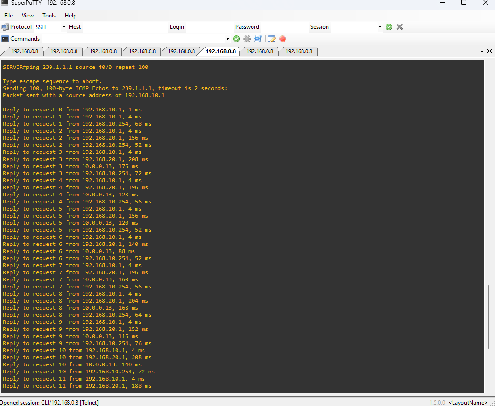
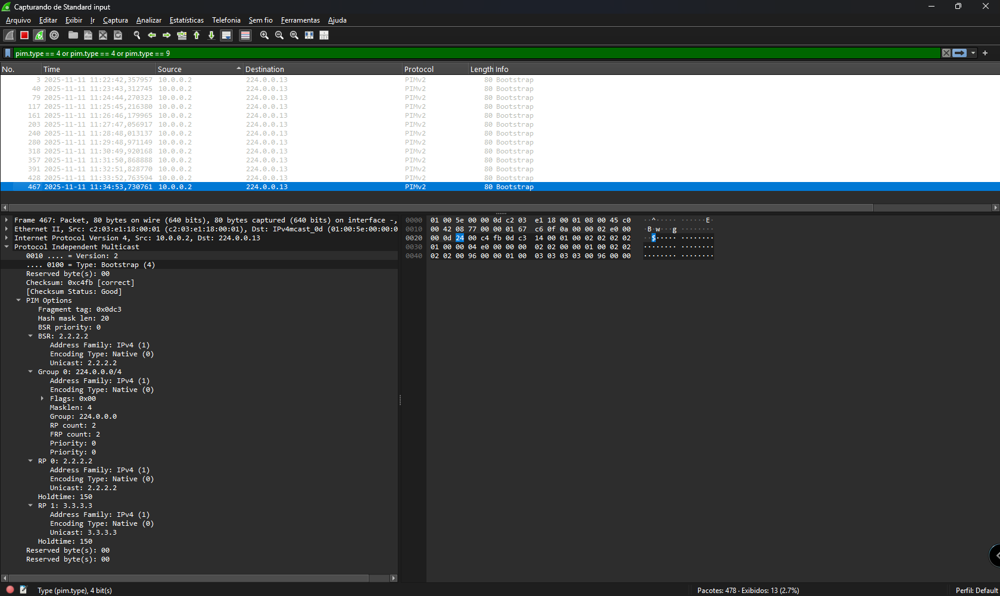

# Índice

- [Índice](#índice)
  - [09 - Exemplo Pratico - SSM (Source-Specific Multicast) e IGMP v3](#09---exemplo-pratico---ssm-source-specific-multicast-e-igmp-v3)
  - [🧾 Introdução](#-introdução)
  - [🎯 Objetivo do Laboratório](#-objetivo-do-laboratório)
    - [🧠 Explicação do Cenário](#-explicação-do-cenário)
    - [🌐 Do PIM-SM ao Source-Specific Multicast (SSM)](#-do-pim-sm-ao-source-specific-multicast-ssm)
    - [🧩 1️⃣ Fontes e Receptores no Cenário](#-1️⃣-fontes-e-receptores-no-cenário)
    - [🧭 Estrutura do Roteamento](#-estrutura-do-roteamento)
    - [📡 Grupos Multicast e Fontes Definidas](#-grupos-multicast-e-fontes-definidas)
    - [🧩 Conclusão](#-conclusão)
    - [🛰️ O que muda no SSM (Source-Specific Multicast)](#️-o-que-muda-no-ssm-source-specific-multicast)
      - [🌳 1️⃣ O comportamento do PIM-SSM](#-1️⃣-o-comportamento-do-pim-ssm)
      - [🔹 2️⃣ O papel do IGMPv3](#-2️⃣-o-papel-do-igmpv3)
      - [🔀 3️⃣ Como o DR encontra a fonte (S)](#-3️⃣-como-o-dr-encontra-a-fonte-s)
      - [🛰️ 4️⃣ Quando a fonte começa a transmitir](#️-4️⃣-quando-a-fonte-começa-a-transmitir)
      - [📡 5️⃣ Vantagens do SSM sobre o PIM-SM](#-5️⃣-vantagens-do-ssm-sobre-o-pim-sm)
  - [🌐 Topologia do Laboratório](#-topologia-do-laboratório)
    - [🔍 Testes Preliminares](#-testes-preliminares)
    - [🌍 Onde o PIM deve ser ativado](#-onde-o-pim-deve-ser-ativado)
    - [🧩 Principais diferenças do SSM em relação ao PIM-SM](#-principais-diferenças-do-ssm-em-relação-ao-pim-sm)
    - [📘 Onde o PIM deve ser ativado no SSM](#-onde-o-pim-deve-ser-ativado-no-ssm)
    - [💡 Observação sobre as fontes multicast](#-observação-sobre-as-fontes-multicast)
    - [🔹 Exemplo com IGMPv3](#-exemplo-com-igmpv3)
    - [⚙️ Nosso cenário SSM com IGMPv3](#️-nosso-cenário-ssm-com-igmpv3)
    - [📡 Papel do IGMPv3 no SSM](#-papel-do-igmpv3-no-ssm)
    - [🔁 Funcionamento geral do SSM](#-funcionamento-geral-do-ssm)
    - [🧱 No nosso laboratório](#-no-nosso-laboratório)
  - [⚙️ Ativando o protocolo PIM-SSM (Source-Specific Multicast)](#️-ativando-o-protocolo-pim-ssm-source-specific-multicast)
    - [🔧 Configuração do PIM-SSM](#-configuração-do-pim-ssm)
  - [🧩 Eleição do Designated Router (DR)](#-eleição-do-designated-router-dr)
  - [💬 Mensagens PIM Hello](#-mensagens-pim-hello)
    - [⚙️ Configurando o PIM-SSM (Source-Specific Multicast)](#️-configurando-o-pim-ssm-source-specific-multicast)
    - [🧩 1️⃣ Definindo o intervalo de endereços SSM](#-1️⃣-definindo-o-intervalo-de-endereços-ssm)
    - [🧭 2️⃣ Habilitando o IGMPv3 nos roteadores](#-2️⃣-habilitando-o-igmpv3-nos-roteadores)
    - [🧰 3️⃣ Associando hosts e fontes multicast](#-3️⃣-associando-hosts-e-fontes-multicast)
    - [🧪 5️⃣ Captura e análise via Wireshark](#-5️⃣-captura-e-análise-via-wireshark)
  - [✅ 4️⃣ Ativando o Receptor (IGMP Join) — R04](#-4️⃣-ativando-o-receptor-igmp-join--r04)
    - [✅ Configuração do IGMP Join em R04](#-configuração-do-igmp-join-em-r04)
  - [✅ 5️⃣ Observando a Formação da Árvore (\*,G)](#-5️⃣-observando-a-formação-da-árvore-g)
  - [✅ 6️⃣ Ativando a Fonte Multicast — R01/Server](#-6️⃣-ativando-a-fonte-multicast--r01server)
  - [✅ 7️⃣ Confirmando a Convergência do Domínio PIM-SM](#-7️⃣-confirmando-a-convergência-do-domínio-pim-sm)
  - [🧠 O papel do DR no processo multicast (com PIM-SM e Bootstrap Router)](#-o-papel-do-dr-no-processo-multicast-com-pim-sm-e-bootstrap-router)
  - [🚀 Quando o Servidor Inicia o Tráfego](#-quando-o-servidor-inicia-o-tráfego)
  - [⚙️ Simulando a Falha do RP Principal e a Ativação do RP Backup](#️-simulando-a-falha-do-rp-principal-e-a-ativação-do-rp-backup)
    - [🧠 **Objetivo do teste**](#-objetivo-do-teste)
    - [1️⃣ **Identificando o RP atual**](#1️⃣-identificando-o-rp-atual)
  - [⚙️ Simulando a Falha do RP Principal e a Ativação do RP Backup](#️-simulando-a-falha-do-rp-principal-e-a-ativação-do-rp-backup-1)
    - [🧠 **Objetivo do teste**](#-objetivo-do-teste-1)
    - [1️⃣ **Identificando o RP atual**](#1️⃣-identificando-o-rp-atual-1)
    - [2️⃣ Simulando a falha do RP principal](#2️⃣-simulando-a-falha-do-rp-principal)
    - [3️⃣ Monitorando a eleição via Debug](#3️⃣-monitorando-a-eleição-via-debug)
    - [4️⃣ Confirmando o novo RP ativo](#4️⃣-confirmando-o-novo-rp-ativo)
    - [5️⃣ Restaurando o RP principal](#5️⃣-restaurando-o-rp-principal)
    - [💡 Conclusão](#-conclusão-1)
  - [🧩 O que aprendemos com este laboratório](#-o-que-aprendemos-com-este-laboratório)
    - [🎯 Principais aprendizados](#-principais-aprendizados)
    - [💡 Conclusões gerais](#-conclusões-gerais)
  - [🧩 O que aprendemos com este laboratório](#-o-que-aprendemos-com-este-laboratório-1)
    - [🎯 Principais aprendizados](#-principais-aprendizados-1)
    - [💡 Conclusões gerais](#-conclusões-gerais-1)
  - [🗺️ Mapa conceitual do fluxo PIM-SM com BSR](#️-mapa-conceitual-do-fluxo-pim-sm-com-bsr)
  - [📘 Tabela de Comandos](#-tabela-de-comandos)
    - [🖥️ R01 – BSR Primário e DR da LAN do Servidor](#️-r01--bsr-primário-e-dr-da-lan-do-servidor)
    - [📗 R02 – Candidate RP e BSR Secundário](#-r02--candidate-rp-e-bsr-secundário)
    - [📙 R03 – Candidate RP Secundário](#-r03--candidate-rp-secundário)
    - [📒 R04 – DR do Segmento do Host02](#-r04--dr-do-segmento-do-host02)
    - [📕 R05 – Roteador de trânsito com Host Não Inscrito (Host03)](#-r05--roteador-de-trânsito-com-host-não-inscrito-host03)
    - [🖥️ SERVER – Fonte Multicast (Sender)](#️-server--fonte-multicast-sender)
    - [💻 HOST02 – Receptor Multicast](#-host02--receptor-multicast)
    - [🖥️ HOST03 – Host Não Inscrito](#️-host03--host-não-inscrito)

## 09 - Exemplo Pratico - SSM (Source-Specific Multicast) e IGMP v3

## 🧾 Introdução

Este laboratório foi desenvolvido como parte do meu estudo para a certificação Cisco **CCNP ENCOR (350-401)**.  
O objetivo é compreender, de forma prática, o funcionamento do **Source-Specific Multicast (SSM)** e sua integração com o **IGMPv3**, explorando como esses protocolos permitem o controle preciso sobre as fontes de tráfego multicast em uma rede corporativa.  

O **SSM** representa uma evolução do modelo tradicional **PIM Sparse Mode (PIM-SM)**.  
Enquanto o PIM-SM utiliza um **Rendezvous Point (RP)** como ponto central para conectar fontes e receptores, o **SSM elimina completamente a necessidade do RP**, permitindo que os receptores indiquem **explicitamente qual fonte (S) desejam receber** para um determinado grupo multicast (G).  

Dessa forma, o modelo **SSM (Source, Group)** — representado pela notação **(S,G)** — garante maior **eficiência, segurança e simplicidade operacional**, já que o tráfego multicast é entregue apenas aos hosts que solicitam dados de uma fonte específica.  

💡 O **SSM é suportado por meio do IGMPv3**, que introduz novos tipos de mensagens capazes de especificar a origem desejada do fluxo multicast.  
Ao contrário do IGMPv1/v2, que apenas informavam interesse em um grupo (G), o IGMPv3 permite que os hosts definam quais fontes (S) devem ou não ser aceitas para esse grupo, viabilizando o comportamento SSM.  

O laboratório a seguir demonstra como configurar e validar o **SSM com PIM Sparse Mode e IGMPv3** em roteadores Cisco, observando a construção da árvore multicast diretamente da fonte até o receptor, sem dependência de RP.

## 🎯 Objetivo do Laboratório

O objetivo deste laboratório é compreender o funcionamento do **Source-Specific Multicast (SSM)** e o papel do **IGMPv3** na seleção de fontes multicast específicas.  

Durante os testes, iremos observar:

- Como o **PIM-SM** opera no modo **SSM**, sem uso de RP;
- Como o **IGMPv3** permite que o receptor declare interesse em uma fonte específica (S) e grupo (G);
- A formação da **árvore direta (Shortest Path Tree - SPT)** entre a fonte e o receptor;
- O comportamento das tabelas **mroute** e o processo de **RPF (Reverse Path Forwarding)**;
- E a entrega eficiente do fluxo multicast apenas aos receptores inscritos no par (S,G).

Assim, este laboratório demonstra na prática como o **SSM simplifica o roteamento multicast**, melhora o controle de assinaturas e aumenta a escalabilidade em ambientes modernos, alinhando-se às recomendações do **IETF (RFC 4607)**.

📘 [IETF RFC 4607 – Source-Specific Multicast for IP](https://datatracker.ietf.org/doc/html/rfc4607)

### 🧠 Explicação do Cenário

Como mencionado anteriormente, nosso cenário já possui **roteamento unicast totalmente funcional** (via OSPF), permitindo que o foco agora seja o **tráfego multicast baseado em SSM (Source-Specific Multicast)**.  

  

Neste laboratório, utilizamos **cinco roteadores Cisco (R01 a R05)**, além de **três hosts simulados** (SERVER, SERVER02 e HOSTS) que representam as **fontes e receptores multicast**.  
Os hosts são configurados apenas com **endereçamento IP e IGMPv3**, sem participar de roteamento dinâmico.  
Os roteadores intermediários executam **OSPF**, garantindo a convergência e a conectividade IP entre todas as sub-redes antes da ativação do PIM-SSM.

---

### 🌐 Do PIM-SM ao Source-Specific Multicast (SSM)

Diferente do **PIM Sparse Mode tradicional (PIM-SM)**, que depende de um **Rendezvous Point (RP)** para interligar fontes e receptores, o **SSM (Source-Specific Multicast)** elimina completamente o uso de RP.  
No modelo **(S,G)**, o receptor declara explicitamente de qual **fonte (S)** deseja receber o tráfego multicast associado a um determinado **grupo (G)**.

Esse método simplifica a operação e aumenta a segurança, pois:

- Apenas as fontes autorizadas transmitem o fluxo;
- O tráfego multicast é entregue **somente** aos receptores que expressaram interesse explícito em (S,G);
- Não há necessidade de configuração manual de RP nem de mecanismos como Auto-RP ou BSR.

O **SSM** é implementado em conjunto com o **IGMPv3**, que introduz a capacidade de inscrição seletiva em fontes.  
Assim, os hosts podem escolher exatamente de quais fontes desejam receber tráfego multicast — algo impossível nas versões anteriores (IGMPv1/v2).

---

### 🧩 1️⃣ Fontes e Receptores no Cenário

Neste cenário, temos **duas fontes multicast** e **um receptor**, distribuídos nas seguintes redes:

| Função         | Dispositivo | Rede/Sub-rede        | Interface  | Endereço IP        | Descrição                                      |
|----------------|-------------|----------------------|------------|--------------------|------------------------------------------------|
| **Fonte 1**    | SERVER      | 192.168.10.0/24      | fa0/0      | 192.168.10.1       | Envia tráfego multicast para o grupo 232.1.1.1 |
| **Fonte 2**    | SERVER02    | 192.168.40.0/24      | fa0/0      | 192.168.40.1       | Envia tráfego multicast para o grupo 232.2.2.2 |
| **Receptor 1** | HOST02      | 192.168.20.0/24      | fa0/0      | 192.168.20.1       | Participa de grupos multicast via IGMPv3       |
| **Receptor 2** | HOST03      | 192.168.30.0/24      | fa0/0      | 192.168.30.1       | Participa de grupos multicast via IGMPv3       |
| **Receptor 3** | (opcional)  | —                    | —          | —                  | Pode ser adicionado em qualquer outra sub-rede |

---

### 🧭 Estrutura do Roteamento

Todos os roteadores (R01 a R05) fazem parte de uma **única área OSPF (Área 0)**, garantindo o roteamento unicast completo antes da ativação do PIM.  
As redes de backbone e interconexão seguem o seguinte mapeamento:

| Link Ponto-a-Ponto | Rede / Máscara | Interface Local | Interface Remota |
|--------------------|----------------|-----------------|------------------|
| R01 – R02          | 10.0.0.0/30    | Fa0/1 (R01)     | Fa1/0 (R02)      |
| R02 – R03          | 10.0.0.4/30    | Fa1/0 (R02)     | Fa1/0 (R03)      |
| R03 – R04          | 10.0.0.8/30    | Fa0/0 (R03)     | Fa0/0 (R04)      |
| R04 – R05          | 10.0.0.12/30   | Fa0/1 (R04)     | Fa0/1 (R05)      |
| R05 – R01          | 10.0.0.16/30   | Fa1/0 (R05)     | Fa1/0 (R01)      |

---

### 📡 Grupos Multicast e Fontes Definidas

No SSM, cada receptor escolhe explicitamente a fonte de interesse, conforme a tabela abaixo:

| Grupo Multicast | Fonte (S)        | Descrição                                   | Receptores Interessados      |
|-----------------|------------------|---------------------------------------------|------------------------------|
| 232.1.1.1       | 192.168.10.1     | Tráfego multicast gerado pelo SERVER        | HOST02 e HOST03              |
| 232.2.2.2       | 192.168.40.1     | Tráfego multicast gerado pelo SERVER02      | HOST02 (exemplo)             |

Dessa forma, o domínio PIM forma **árvores diretas (Shortest Path Trees)** de cada receptor até sua fonte específica, eliminando qualquer dependência de RP.

---

### 🧩 Conclusão

Com esse modelo, o laboratório demonstra como o **SSM e IGMPv3** tornam o roteamento multicast mais previsível, seguro e escalável.  
A eliminação do RP e o uso explícito de (S,G) simplificam o controle de fluxos, tornando o ambiente ideal para **streaming, replicação de dados e aplicações em tempo real**.

### 🛰️ O que muda no SSM (Source-Specific Multicast)

Diferente do modelo **PIM Sparse Mode tradicional (PIM-SM)**, que depende de um **Rendezvous Point (RP)** para conectar fontes e receptores, o **SSM (Source-Specific Multicast)** elimina totalmente a necessidade de um ponto central de encontro.  

No SSM, o receptor informa explicitamente **qual fonte (S)** deseja ouvir, junto com o **grupo multicast (G)** — formando o par **(S,G)**.  
Isso simplifica o roteamento multicast e aumenta a segurança, já que **somente fluxos de fontes autorizadas** são encaminhados.  

Em outras palavras:

- O receptor diz: “quero receber o grupo **G = 232.1.1.1** vindo da fonte **S = 192.168.10.1**”;  
- O roteador local cria a rota (S,G) e forma a **árvore de distribuição direta (Shortest Path Tree)** até a fonte;  
- Nenhum RP, BSR ou Auto-RP é necessário.  

---

#### 🌳 1️⃣ O comportamento do PIM-SSM

O **PIM-SSM** segue o mesmo princípio de economia de banda do PIM-SM: **somente interfaces com receptores interessados** participam da árvore multicast.  
A diferença é que o **SSM trabalha sempre em modo por fonte (S,G)** — sem precisar construir árvores compartilhadas (*,G).  

Assim, o PIM inicia diretamente o caminho entre o receptor e a fonte específica, garantindo:

- **Baixa latência** (sem RP intermediário);  
- **Caminho otimizado** (SPT desde o início);  
- **Menos processamento e estado multicast** nos roteadores.  

---

#### 🔹 2️⃣ O papel do IGMPv3

O **IGMPv3** é essencial para o funcionamento do **SSM**.  
Ele introduz o conceito de **inscrição seletiva**, permitindo que um host indique explicitamente de qual fonte deseja receber o tráfego multicast.  

O processo funciona assim:

1. O host envia uma mensagem **IGMPv3 Membership Report**, informando o par **(S,G)** de interesse;  
2. O roteador diretamente conectado ao host (conhecido como **Designated Router – DR**) registra esse interesse;  
3. O DR, por sua vez, envia uma mensagem **PIM Join (S,G)** diretamente em direção à fonte **S**, utilizando a rota unicast normal para encontrá-la.  

Dessa forma, a árvore multicast é formada de forma **direta, seletiva e eficiente**.  

---

#### 🔀 3️⃣ Como o DR encontra a fonte (S)

No modelo SSM, **não há descoberta de RP** nem mensagens Bootstrap.  
O **Designated Router (DR)** usa sua **tabela de roteamento unicast** (aprendida via OSPF, no caso deste laboratório) para alcançar a fonte.  

Quando o DR recebe um pedido IGMPv3 indicando:

```ios
(S,G) = (192.168.10.1, 232.1.1.1)
```

ele simplesmente consulta sua rota para `192.168.10.1` e envia o **PIM Join (S,G)** seguindo esse caminho.  
Os roteadores intermediários criam entradas **(S,G)** em suas tabelas multicast, estabelecendo o caminho reverso até a fonte.  

---

#### 🛰️ 4️⃣ Quando a fonte começa a transmitir

Quando a fonte — por exemplo, o servidor `192.168.10.1` — envia pacotes multicast para `232.1.1.1`, os roteadores no caminho reconhecem o fluxo e o associam à árvore (S,G) existente.  
Os receptores que solicitaram esse fluxo começam imediatamente a receber os pacotes.  

Não há necessidade de registros, mensagens encapsuladas ou intermediação por RP.  
Todo o processo é **automático e direto**, pois o **PIM-SSM** já conhece exatamente quem é a fonte e quem são os receptores interessados.  

---

#### 📡 5️⃣ Vantagens do SSM sobre o PIM-SM

| Aspecto                     | PIM Sparse Mode (tradicional)        | Source-Specific Multicast (SSM)           |
|-----------------------------|--------------------------------------|-------------------------------------------|
| Dependência de RP           | Sim                                  | ❌ Não                                   |
| Tipo de árvore inicial      | Compartilhada (*,G)                  | Direta (S,G)                              |
| Controle sobre as fontes    | Limitado                             | Total — receptor escolhe a fonte          |
| Mensagens adicionais        | PIM Register, Bootstrap, RP-Adv      | Nenhuma (apenas PIM Join/Prune)           |
| Versão IGMP necessária      | IGMPv2                               | IGMPv3                                    |
| Segurança e escalabilidade  | Moderada                             | Alta — menos estados e fluxos indevidos   |

---

👉 **Resumo:**  
O **SSM (Source-Specific Multicast)** representa a evolução natural do multicast em redes IP.  
Ele remove completamente a complexidade do RP e do BSR, simplificando a operação e melhorando o desempenho.  
Em conjunto com o **IGMPv3**, o SSM fornece uma arquitetura **mais segura, previsível e escalável** — ideal para **aplicações de streaming, replicação de dados e videoconferência**.

## 🌐 Topologia do Laboratório

A topologia deste laboratório é composta por **cinco roteadores principais (R01 a R05)** e **quatro hosts simulados (Server, Server02, Host02 e Host03)**.  
Os hosts são roteadores Cisco configurados de forma simplificada, apenas com IP e participação em grupos multicast via IGMPv3, simulando o comportamento de dispositivos finais.  

O protocolo **OSPF** garante a conectividade unicast entre todos os roteadores, enquanto o **PIM-SSM (Source-Specific Multicast)** é utilizado para o roteamento multicast.  
Diferente dos modos Dense ou Sparse tradicionais, o **SSM elimina completamente a necessidade de um RP (Rendezvous Point)**.  
Neste modelo, o tráfego multicast é estabelecido diretamente entre **fonte (S)** e **receptor (G)**, criando pares (S,G) sem passar por um ponto central de encontro.  

---

**🔧 Endereçamento e Funções**  

| **Dispositivo** | **Interface** | **Endereço IP / Máscara Rede** | **Conexão / Função**                                            |
|-----------------|---------------|--------------------------------|-----------------------------------------------------------------|
| **R01**         | Loopback0     | 1.1.1.1 /32                    | Identificação / Router-ID OSPF                                  |
|                 | Fa0/0         | 192.168.10.254 /24             | LAN do Server — Gateway multicast                               |
|                 | Fa0/1         | 10.0.0.1 /30                   | Link com R02 — PIM + OSPF                                       |
|                 | Fa1/0         | 10.0.0.18 /30                  | Link com R05 — PIM + OSPF                                       |
| **R02**         | Loopback0     | 2.2.2.2 /32                    | Identificação / Router-ID OSPF                                  |
|                 | Fa0/0         | 10.0.0.2 /30                   | Link com R01 — PIM + OSPF                                       |
|                 | Fa1/0         | 10.0.0.5 /30                   | Link com R03 — PIM + OSPF                                       |
| **R03**         | Loopback0     | 3.3.3.3 /32                    | Identificação / Router-ID OSPF                                  |
|                 | Fa0/0         | 10.0.0.6 /30                   | Link com R02 — PIM + OSPF                                       |
|                 | Fa1/0         | 10.0.0.9 /30                   | Link com R04 — PIM + OSPF                                       |
| **R04**         | Loopback0     | 4.4.4.4 /32                    | Identificação / Router-ID OSPF                                  |
|                 | Fa0/0         | 10.0.0.10 /30                  | Link com R03 — PIM + OSPF                                       |
|                 | Fa1/0         | 10.0.0.13 /30                  | Link com R05 — PIM + OSPF                                       |
|                 | Fa1/1         | 192.168.20.254 /24             | LAN do Host02 — Gateway multicast                               |
| **R05**         | Loopback0     | 5.5.5.5 /32                    | Identificação / Router-ID OSPF                                  |
|                 | Fa0/0         | 10.0.0.14 /30                  | Link com R04 — PIM + OSPF                                       |
|                 | Fa1/0         | 10.0.0.17 /30                  | Link com R01 — PIM + OSPF                                       |
|                 | Fa0/1         | 192.168.30.254 /24             | LAN do Host03 — Gateway multicast                               |
| **Server**      | Fa0/0         | 192.168.10.1 /24               | Fonte multicast (sender)                                        |
| **Server02**    | Fa0/0         | 192.168.40.1 /24               | Fonte multicast (sender)                                        |
| **Host02**      | Fa0/0         | 192.168.20.1 /24               | Receptor multicast (IGMPv3 join para (192.168.10.1, 239.1.1.1)) |
| **Host03**      | Fa0/0         | 192.168.30.1 /24               | Host sem participação (sem join IGMP)                           |

---

**🧭 Resumo da Lógica**  

- O **Server (192.168.10.1)** é a **fonte multicast** (S) e envia tráfego para o grupo **239.1.1.1 (G)**.  
- O **Server02 (192.168.40.1)** é a **fonte multicast02** (S) e envia tráfego para o grupo **239.1.1.2 (G)**.
- O **Host02 (192.168.20.1)** participa utilizando **IGMPv3**, solicitando explicitamente o fluxo **(192.168.10.1, 239.1.1.1)**.  
- O **Host03 (192.168.30.1)** não envia join, simulando uma rede sem interesse multicast.  
- O protocolo **PIM-SSM** é ativado em todas as interfaces participantes do domínio multicast (LANs e links de roteamento).  
- Os **roteadores não utilizam RP nem BSR**, pois no SSM o DR do receptor envia diretamente o **PIM Join (S,G)** na direção da fonte.  
- O **RPF (Reverse Path Forwarding)** assegura que o caminho de retorno até a fonte siga o melhor trajeto aprendido via OSPF.  

Assim, o laboratório demonstra a operação do **Source-Specific Multicast**, onde o encaminhamento multicast é estabelecido **somente entre fonte e receptor interessados**, sem dependência de mecanismos centralizados de controle.

---

### 🔍 Testes Preliminares

Antes de ativar o multicast, é importante confirmar a **conectividade unicast** entre todos os dispositivos.  

Cada roteador possui uma **interface de Loopback** usada como **Router-ID** no OSPF:  

- R01 → 1.1.1.1/32  
- R02 → 2.2.2.2/32  
- R03 → 3.3.3.3/32  
- R04 → 4.4.4.4/32  
- R05 → 5.5.5.5/32  

Após o OSPF estar operacional, verifique a conectividade com **ping entre todas as loopbacks**.


Se todos os roteadores se alcançam, a infraestrutura unicast está pronta.  
Lembre-se: o **PIM-SSM** depende de uma **base unicast funcional** para realizar o **RPF check**.

---

Agora podemos ativar o **roteamento multicast** globalmente:

```ios
R01(config)#ip multicast-routing
```

Confirme que o recurso foi habilitado:  

```ios
R01#show ip multicast
  Multicast Routing: enabled
  Multicast Multipath: disabled
  Multicast Route limit: No limit
  Multicast Triggered RPF check: enabled
  Multicast Fallback group mode: Sparse
  Multicast DVMRP Interoperability: disabled
```
  
Com o roteamento multicast ativo, o próximo passo é habilitar o protocolo PIM nas interfaces participantes (LANs e links entre roteadores).  
Repita esse processo de R01 a R05, garantindo que todas as interfaces de roteamento participem do domínio **PIM-SSM**.  

### 🌍 Onde o PIM deve ser ativado

No modo **Source-Specific Multicast (PIM-SSM)**, o tráfego multicast é encaminhado **somente para receptores que solicitam explicitamente uma fonte e um grupo multicast** — ou seja, o modelo baseia-se na relação **(S,G)**, onde **S = Source** e **G = Group**.  
  
Diferente do **PIM-SM tradicional**, o SSM **não utiliza Rendezvous Point (RP)** nem Bootstrap Router (BSR).  
O roteamento multicast é direto entre os receptores e as fontes conhecidas, simplificando o domínio multicast e eliminando pontos de falha.

---

### 🧩 Principais diferenças do SSM em relação ao PIM-SM

| Característica                    | PIM Sparse Mode (SM)                              | PIM Source-Specific Multicast (SSM)                  |
|-----------------------------------|---------------------------------------------------|------------------------------------------------------|
| Tipo de árvore                    | (*,G) e (S,G)                                     | Somente (S,G)                                        |
| Necessita de RP?                  | ✅ Sim                                           | ❌ Não                                               |
| Mecanismo de descoberta de fontes | RP/BSR (ou Auto-RP)                               | IGMPv3 (relato direto do receptor sobre a fonte)     |
| Complexidade de configuração      | Maior (eleição de RP, failover, distribuição)     | Menor (sem RP, sem Bootstrap)                        |
| Tempo de convergência             | Moderado                                          | Muito rápido — a árvore é criada direto com a fonte  |

---

### 📘 Onde o PIM deve ser ativado no SSM

Embora o SSM dispense RP e Bootstrap, o PIM ainda precisa ser **ativado nas interfaces que participam do encaminhamento multicast**, garantindo que as mensagens PIM **Join/Prune** sejam trocadas corretamente entre roteadores.  

✅ **Ative o PIM Sparse Mode (modo SSM)** nas seguintes interfaces:

| Situação                           | PIM deve ser ativado? | Motivo                                                                 |
|------------------------------------|-----------------------|------------------------------------------------------------------------|
| Interface entre roteadores         | ✅ Sim               | Necessário para formar adjacências PIM e propagar as árvores (S,G)     |
| Interface com host receptor (IGMP) | ✅ Sim               | Permite ao DR receber IGMPv3 Reports com a fonte específica            |
| Interface com fonte multicast      | ✅ Sim               | O DR da fonte inicia o fluxo multicast diretamente para os receptores  |
| Loopback apenas como Router-ID     | ⚙️ Opcional          | Pode ser omitido, usada apenas para identificação OSPF                 |

---

### 💡 Observação sobre as fontes multicast

No SSM, as **fontes (senders)** não precisam registrar-se em nenhum RP.  
O tráfego flui diretamente das interfaces onde as fontes estão localizadas para as interfaces com receptores que enviaram *IGMPv3 Reports* solicitando explicitamente aquele fluxo.  

Isso elimina a dependência de mecanismos como **Register/Join** e simplifica o plano de controle multicast.  
  
Em um ambiente SSM (Source-Specific Multicast), o receptor não apenas informa o grupo multicast (G) que deseja receber, mas também as fontes específicas (S) das quais aceita tráfego.  
Essa característica é o que diferencia o IGMPv3 das versões anteriores, permitindo o chamado Source Filtering.  
  
No caso deste laboratório, há duas fontes ativas — SERVER e SERVER02 — enviando tráfego simultaneamente, ambas destinadas, por exemplo, ao mesmo grupo multicast **239.1.1.1**.  
  
Cada receptor pode então escolher:

- **Ouvir somente uma das fontes** (por exemplo, apenas o SERVER);
- **Ouvir as duas fontes simultaneamente** (SERVER e SERVER02);
- **Ou filtrar fontes indesejadas, mesmo que transmitam no mesmo grupo**.  
  
### 🔹 Exemplo com IGMPv3

Se o Host02 quiser receber tráfego das duas fontes, ele enviará um IGMPv3 Membership Report com dois pares (S,G):  

| Fonte (S)    | Grupo (G) | Descrição                     |
|--------------|-----------|-------------------------------|
| 192.168.10.1 | 239.1.1.1 | Fluxo proveniente do SERVER   |
| 192.168.40.1 | 239.1.1.1 | Fluxo proveniente do SERVER02 |

O roteador conectado ao **Host02 (o Designated Router)** registra ambos os pares e aciona o processo PIM-SSM, construindo **duas árvores independentes (S,G)** — uma para cada fonte.  
Dessa forma, o tráfego chega de cada servidor por caminhos otimizados, conforme o **RPF (Reverse Path Forwarding) determinado pelo OSPF.**  
  
💡 **Em resumo:**  
O SSM com IGMPv3 oferece controle total ao receptor sobre quais fontes deseja ouvir, permitindo topologias com múltiplos senders e eliminando completamente a dependência de um Rendezvous Point (RP).  

🎯 **Situação**

Você tem:  

- Server01 (192.168.10.10) transmitindo para o grupo **239.1.1.1**
- Server02 (192.168.40.10) transmitindo também **para o mesmo grupo 239.1.1.1 (ou pode ser outro, não importa)**
- Host01 quer receber **os dois fluxos multicast, um de cada servidor**.

🧠 **Como o SSM trata isso?**  

O **IGMPv3** trabalha com a relação **(S,G) — Source e Group.**  
Isso significa que cada fonte representa um fluxo separado, mesmo que **o grupo (G) seja o mesmo**.  
  
Então o Host01 vai enviar **dois IGMPv3 Reports**, um para cada fonte, assim:  

| Fluxo | Fonte (S)               | Grupo (G)  | Tipo de IGMPv3 Report |
|-------|-------------------------|------------|-----------------------|
| 1️⃣   | 192.168.10.10 (Server01) | 239.1.1.1  | INCLUDE (S,G)         |
| 2️⃣   | 192.168.40.10 (Server02) | 239.1.1.1  | INCLUDE (S,G)         |

🔁 **O que acontece no roteador (Designated Router)**  

- O roteador conectado ao Host01 recebe dois IGMPv3 Reports.
- Ele cria duas entradas separadas na sua tabela de multicast:
  - **(192.168.10.10, 239.1.1.1)**
  - **(192.168.40.10, 239.1.1.1)**
- O roteador envia duas mensagens **PIM Join (S,G)** em direção a cada fonte.
- **Duas árvores independentes (S,G)** são criadas — uma para cada fonte.
- O tráfego de ambas as fontes chega até o Host01, misturado no mesmo **grupo multicast (G), mas com origem diferente (S)**.

🔎 **Visualmente:**  

```text
         (S1,G) 192.168.10.10 → 239.1.1.1
         (S2,G) 192.168.40.10 → 239.1.1.1
               │
               ▼
          [Roteador DR]
               │
               ▼
             [Host01]
```
  
O Host01 vai receber dois fluxos simultâneos:  

- Um vindo da árvore (192.168.10.10, 239.1.1.1)
- Outro vindo da árvore (192.168.40.10, 239.1.1.1)

🧩 **E se o Host01 quiser apenas uma das fontes?**

Ele simplesmente envia um único IGMPv3 Report:  

```ios
INCLUDE { 239.1.1.1 : 192.168.10.10 }
```

🚫 **E se ele quiser bloquear uma das fontes?**

O IGMPv3 permite o **EXCLUDE mode**, em que o host pode dizer:  
  
> “Quero o grupo 239.1.1.1, mas exclua o tráfego vindo de 192.168.40.10.”

Isso é útil em cenários de redundância (duas fontes transmitindo o mesmo conteúdo).  
Mas no nosso laboratório, normalmente usamos INCLUDE mode, porque é o padrão simples do SSM.  

💬 **Resumo final**  

| Caso                      | IGMPv3 Report                                        | Resultado                           |
|---------------------------|------------------------------------------------------|-------------------------------------|
| Host quer apenas Server01 | INCLUDE { 239.1.1.1 : 192.168.10.10 }                | Recebe só o fluxo do Server01       |
| Host quer apenas Server02 | INCLUDE { 239.1.1.1 : 192.168.40.10 }                | Recebe só o fluxo do Server02       |
| Host quer os dois         | INCLUDE { 239.1.1.1 : 192.168.10.10, 192.168.40.10 } | Recebe ambos os fluxos              |
| Host quer excluir um      | EXCLUDE { 239.1.1.1 : 192.168.40.10 }                | Recebe o grupo, mas ignora Server02 |

👉 **Em resumo:**

- No SSM, cada (S,G) é uma sessão multicast independente.
- O receptor pode selecionar, combinar ou excluir fontes de forma totalmente controlada, e o roteador cria uma árvore separada por fluxo (S,G).

### ⚙️ Nosso cenário SSM com IGMPv3

Nosso laboratório foi expandido para incluir **duas fontes multicast distintas**:

| Fonte       | Roteador conectado | Sub-rede             | Grupo multicast utilizado (exemplo)  |
|-------------|--------------------|----------------------|--------------------------------------|
| **SERVER**  | R01                | 192.168.10.0/24      | 239.1.1.1                            |
| **SERVER02**| R03                | 192.168.40.0/24      | 239.2.2.2                            |

Os receptores multicast (hosts simulados) enviam **mensagens IGMPv3** especificando exatamente qual fonte desejam escutar.  
Por exemplo, um host pode ingressar no grupo `239.1.1.1` proveniente de `192.168.10.10`, enquanto outro pode escutar o grupo `239.2.2.2` proveniente de `192.168.40.10`.

---

### 📡 Papel do IGMPv3 no SSM

O **IGMPv3** é fundamental para o funcionamento do SSM, pois ele introduz o conceito de **Source Filtering**, permitindo que um receptor defina **quais fontes deseja (INCLUDE mode)** ou **quais não deseja (EXCLUDE mode)**.  

No nosso caso, todos os receptores utilizam **INCLUDE mode**, ou seja, solicitam explicitamente o fluxo multicast de uma ou mais fontes conhecidas.

| Tipo de Mensagem                | Descrição                                                                        |
|---------------------------------|----------------------------------------------------------------------------------|
| **Membership Report (INCLUDE)** | Informa ao roteador local (Designated Router) o grupo e a(s) fonte(s) desejadas. |
| **Leave Group**                 | Indica que o host não quer mais receber o tráfego daquele grupo/fonte.           |

---

### 🔁 Funcionamento geral do SSM

1. O **receptor** envia um **IGMPv3 Report** informando o grupo e a fonte (S,G) desejada.  
2. O roteador de borda (Designated Router) cria a árvore SSM diretamente para a fonte — **sem RP**.  
3. O tráfego multicast é encaminhado da **fonte** ao **receptor** pela árvore (S,G).  
4. Se o receptor deixar o grupo, o roteador envia **PIM Prune (S,G)**, encerrando o fluxo.  

---

### 🧱 No nosso laboratório

O SSM será ativado em todos os roteadores e interfaces relevantes:

- **Entre os roteadores R01 a R05**, formando o domínio PIM-SSM;  
- **Nas interfaces LAN** conectadas às fontes multicast (**Server** e **Server02**);  
- **Nas interfaces LAN** conectadas aos receptores (Host02 e Host03);  
- **Nas Loopbacks**, apenas como *Router-ID* para OSPF (sem necessidade de PIM).  

Com isso, teremos um domínio totalmente funcional de **PIM-SSM com IGMPv3**, suportando múltiplas fontes e fluxos multicast independentes, sem depender de RP, Bootstrap ou Auto-RP.

---

🧩 **Resumo prático**

| Elemento                     | Função no cenário                                |
|------------------------------|--------------------------------------------------|
| **Server (192.168.10.10)**   | Fonte multicast principal (grupo 239.1.1.1)      |
| **Server02 (192.168.40.10)** | Segunda fonte multicast (grupo 239.2.2.2)        |
| **Host02 / Host03**          | Receptores multicast (enviam IGMPv3 Reports)     |
| **Roteadores R01–R05**       | Encaminham tráfego multicast via PIM-SSM         |
| **OSPF**                     | Mantém conectividade unicast entre os roteadores |
| **Sem RP / Sem BSR**         | O SSM elimina esses componentes completamente    |

---

💬 **Conclusão**

O uso de **SSM com IGMPv3** traz uma abordagem mais simples, escalável e segura para multicast.  
Cada receptor escolhe exatamente **de qual fonte** receberá o tráfego, eliminando a necessidade de RP, reduzindo o overhead de controle e tornando o comportamento multicast totalmente determinístico.

## ⚙️ Ativando o protocolo PIM-SSM (Source-Specific Multicast)

Com o ambiente unicast devidamente funcional e as bases teóricas sobre o **SSM e o IGMPv3** já estabelecidas, é hora de ativar o **PIM-SSM** nos roteadores do domínio multicast.  
O objetivo agora é permitir que cada receptor solicite fluxos específicos com base nas **fontes (S)** de interesse, sem depender de **Rendezvous Points (RP)** nem de mensagens Bootstrap.

Diferente do modelo anterior (PIM-SM com Bootstrap), o SSM é totalmente **direcionado por demanda**: o tráfego multicast só é estabelecido quando o receptor envia um **IGMPv3 Membership Report (S,G)** informando explicitamente de qual servidor deseja receber.

---

### 🔧 Configuração do PIM-SSM

O PIM precisa ser habilitado em todas as interfaces que transportarão tráfego multicast, tanto nas **LANs com fontes e receptores**, quanto nos **links entre roteadores**.

```ios
R01#show ip int br
Interface                  IP-Address      OK? Method Status                Protocol
FastEthernet0/0            192.168.10.254  YES NVRAM  up                    up
FastEthernet0/1            10.0.0.1        YES NVRAM  up                    up
FastEthernet1/0            10.0.0.18       YES NVRAM  up                    up
Loopback0                  1.1.1.1         YES NVRAM  up                    up

R01#conf t
Enter configuration commands, one per line.  End with CNTL/Z.

R01(config)#int f0/0
R01(config-if)#ip pim sparse-mode
*Mar  1 02:00:05.663: %PIM-5-DRCHG: DR change from neighbor 0.0.0.0 to 192.168.10.254 on interface FastEthernet0/0

R01(config)#int f0/1
R01(config-if)#ip pim sparse-mode
*Mar  1 02:00:20.615: %PIM-5-DRCHG: DR change from neighbor 0.0.0.0 to 10.0.0.1 on interface FastEthernet0/1

R01(config)#int f1/0
R01(config-if)#ip pim sparse-mode
*Mar  1 02:00:36.563: %PIM-5-DRCHG: DR change from neighbor 0.0.0.0 to 10.0.0.18 on interface FastEthernet1/0

R01(config)#int lo0
R01(config-if)#ip pim sparse-mode
*Mar  1 00:18:25.859: %PIM-5-DRCHG: DR change from neighbor 0.0.0.0 to 1.1.1.1 on interface Loopback0
```

Após a configuração, o roteador passa a participar ativamente do domínio multicast, trocando mensagens PIM Hello e identificando vizinhos diretamente conectados.  
  
✅ **Verificação do roteamento multicast**
  
Para confirmar que o roteamento multicast está operacional:  

```ios
R01#show ip multicast
  Multicast Routing: enabled
  Multicast Multipath: disabled
  Multicast Route limit: No limit
  Multicast Triggered RPF check: enabled
  Multicast Fallback group mode: Sparse
  Multicast DVMRP Interoperability: disabled
```

E a tabela de rotas multicast:  

```ios
R01#show ip mrout
IP Multicast Routing Table
Flags: D - Dense, S - Sparse, B - Bidir Group, s - SSM Group, C - Connected,
       L - Local, P - Pruned, R - RP-bit set, F - Register flag,
       T - SPT-bit set, J - Join SPT, M - MSDP created entry,
       X - Proxy Join Timer Running, A - Candidate for MSDP Advertisement,
       U - URD, I - Received Source Specific Host Report,
       Z - Multicast Tunnel, z - MDT-data group sender,
       Y - Joined MDT-data group, y - Sending to MDT-data group
Outgoing interface flags: H - Hardware switched, A - Assert winner
Timers: Uptime/Expires
Interface state: Interface, Next-Hop or VCD, State/Mode

(*, 224.0.0.0), 00:10:57/00:02:04, RP 0.0.0.0, flags: SCL
  Incoming interface: Null, RPF nbr 0.0.0.0
  Outgoing interface list:
    FastEthernet0/0, Forward/Sparse, 00:10:57/00:02:04
```

💡 **Dica:**
Em um domínio **S**SM, as entradas (S,G)** só aparecerão quando um **host IGMPv3** manifestar interesse em uma fonte específica.  
Não existem mensagens **Bootstrap, nem anúncios de RP.** O controle é completamente descentralizado e guiado pelas solicitações **IGMPv3 dos receptores.**  
  
## 🧩 Eleição do Designated Router (DR)

O **Designated Router (DR)** é o roteador responsável por interagir com os hosts de uma **LAN multicast.**  
Ele recebe os relatórios IGMPv3, interpreta os pares (S,G) e envia mensagens PIM Join diretamente em direção à fonte indicada.  
A eleição do DR acontece automaticamente entre os roteadores PIM conectados à mesma rede local.  

**Critérios de eleição:**

- O roteador com o maior endereço IP ativo na LAN é eleito DR;
- Se ele falhar, outro roteador assume o papel após o timeout dos Hellos (30 segundos, por padrão).

💡 **Essa eleição ocorre de forma transparente, sem necessidade de configuração manual.**

## 💬 Mensagens PIM Hello

As mensagens **PIM Hello** são o primeiro passo para o estabelecimento de vizinhanças PIM.  
Elas são enviadas periodicamente no grupo **224.0.0.13 (PIM Routers) com TTL 1,** e permitem que os roteadores descubram vizinhos ativos, negociem parâmetros e mantenham a topologia multicast estável.  
  
Essas mensagens também informam o modo de operação **(SSM)**, a prioridade do DR e o holdtime de vizinhança.  

⚙️ **Funções principais das mensagens Hello**  

| Função                 | Descrição                                                                          |
|------------------------|------------------------------------------------------------------------------------|
| Descoberta de vizinhos | Roteadores PIM trocam Hellos para identificar dispositivos ativos na mesma LAN.    |
| Troca de parâmetros    | Define tempo de expiração, prioridade de DR e modo de operação.                    |
| Monitoramento          | Se um vizinho deixa de enviar Hellos dentro do holdtime, é removido da tabela PIM. |

---

🧩 **Estrutura simplificada da mensagem Hello**  

| Campo          | Função                                                  | Valor típico |
|----------------|---------------------------------------------------------|--------------|
| Type           | Tipo da mensagem PIM (Hello = 0x00)                     | 0x00         |
| Holdtime       | Tempo máximo de inatividade antes da remoção do vizinho | 105 s        |
| DR Priority    | Prioridade do Designated Router (maior vence)           | 1 (padrão)   |
| Generation ID  | Valor aleatório que muda a cada boot                    | Aleatório    |
| Hello Interval | Tempo entre Hellos consecutivos                         | 30 s         |

💡 **Dica:**
Use o Wireshark com o filtro **pim.type == 0** para observar essas mensagens em tempo real.  
  
🔍 **Exemplo de log da eleição do DR**

Logo após ativar o PIM-SSM, o log do roteador mostrará a eleição automática do Designated Router:  

```ios
*Mar  1 02:00:36.563: %PIM-5-DRCHG: DR change from neighbor 0.0.0.0 to 10.0.0.18 on interface FastEthernet1/0
```
  
👉 Isso indica que o roteador 10.0.0.18 foi eleito DR na interface FastEthernet1/0, responsável por processar os relatórios IGMPv3 dos hosts.  
  
👏 **Mas ainda existe eleição do DR?**  

👉 Sim, o PIM-SSM (Source-Specific Multicast) ainda tem eleição de Designated Router (DR) — mas com uma diferença importante no papel funcional dele.  

Vamos detalhar didaticamente:  

- ⚙️ O DR existe no SSM, mas faz menos coisas que no PIM-SM
- Mesmo no SSM, quando há mais de um roteador conectado à mesma LAN multicast, o protocolo PIM precisa eleger um único roteador responsável por representar aquela LAN.
- Esse roteador eleito é o Designated Router (DR).
  
🔹 **Por que ele ainda é necessário?**

Porque o DR é quem recebe os relatórios **IGMPv3 (Membership Reports)** dos hosts na LAN e toma as decisões iniciais de multicast:

- Ele interpreta os pares (S,G) recebidos dos hosts;
- Gera as entradas correspondentes na tabela multicast;
- E envia mensagens PIM Join (S,G) diretamente em direção à fonte (S).

📊 **Diferença prática entre PIM-SM e PIM-SSM quanto ao DR**  

| Função                          | PIM Sparse Mode (com RP)                 | PIM-SSM (com IGMPv3)           |
|---------------------------------|------------------------------------------|--------------------------------|
| Receber IGMP                    | Sim                                      | Sim                            |
| Enviar PIM Join                 | Sim — mas em direção ao RP               | Sim — direto para a fonte (S)  |
| Enviar PIM Register             | Sim — envia registros encapsulados ao RP | ❌ Não existe registro no SSM  |
| Descobrir RP / BSR              | Sim                                      | ❌ Não aplicável               |
| Participa na árvore (*,G)       | Sim                                      | ❌ Só (S,G)                    |
| Eleição entre roteadores na LAN | Sim                                      | Sim                            |

💡 **Resumo prático**  
  
Mesmo no SSM, quando há dois ou mais roteadores em uma mesma LAN (por exemplo, R1 e R2 ligados ao mesmo segmento onde está o Host01), um deles precisa ser o DR.
Isso evita que múltiplos roteadores enviem PIM Joins duplicados para a mesma fonte.  

➡️ Portanto:

- O processo de eleição do DR permanece igual: **o roteador com maior IP ativo vence**;
- O tráfego de eleição usa as **mesmas mensagens PIM Hello com o campo DR Priority**;
- A diferença é que o DR não interage com RP, e sim diretamente com as fontes informadas nos **relatórios IGMPv3**.  
  
🧭 **Conclusão**  
  
- O DR existe e é eleito automaticamente no PIM-SSM.
- Mas ele não envia PIM Register nem usa RP/BSR.
- Sua única função é processar IGMPv3 dos hosts locais e iniciar os PIM Join (S,G) diretamente em direção à fonte.

---

Alterar daqui

---

### ⚙️ Configurando o PIM-SSM (Source-Specific Multicast)

Agora que o **PIM** está ativo em todas as interfaces, podemos configurar o domínio multicast para operar em **Source-Specific Multicast (SSM)** — modo no qual **não há Rendezvous Point (RP)** nem mensagens Bootstrap.  
O tráfego multicast flui diretamente da **fonte (S)** para os **receptores interessados (G)**, conforme indicado pelas mensagens **IGMPv3**.

Diferente do **PIM Sparse Mode tradicional (PIM-SM)**, que utiliza RPs para coordenar o fluxo, o **SSM** utiliza **pares (*S,G*)** formados dinamicamente, garantindo simplicidade, segurança e menor dependência de controle.

---

### 🧩 1️⃣ Definindo o intervalo de endereços SSM

Por padrão, as redes Cisco utilizam o intervalo **232.0.0.0/8** para o **Source-Specific Multicast (SSM)**, conforme definido pelo IANA (RFC 4607).  
Ainda assim, é boa prática **declarar explicitamente o range SSM** para evitar ambiguidade entre grupos tradicionais (*,G*) e específicos (*S,G*).

➡️ **Comando no modo global:**

```ios
R01(config)#ip pim ssm range 232.0.0.0 255.0.0.0
```

💡 **Explicação:**  

- Define o bloco de endereços que será tratado como SSM;
- Qualquer grupo dentro de **232.0.0.0/8** será gerenciado sem RP;
- Isso permite que o roteador processe **joins específicos (S,G) vindos via IGMPv3**.
  
---

### 🧭 2️⃣ Habilitando o IGMPv3 nos roteadores

O IGMPv3 é fundamental para o funcionamento do SSM, pois ele permite que os receptores especifiquem as fontes (S) das quais desejam receber tráfego.  
Sem IGMPv3, o roteador não reconhece solicitações do tipo (S,G).  

➡️ Comando por interface LAN conectada aos hosts receptores:  

```ios
R04(config)#int fa1/1
R04(config-if)#ip igmp version 3
```

Faça o mesmo nas interfaces onde há receptores multicast (ex.: R04 e R05).  

💡 **Dica:**
Mesmo que alguns roteadores suportem IGMPv3 por padrão, é recomendado forçar a versão explicitamente para evitar incompatibilidades.  

---

### 🧰 3️⃣ Associando hosts e fontes multicast

Neste laboratório, temos duas fontes e um ou mais receptores:

| Dispositivo | Função             | IP           | Grupo (G)                            |
|-------------|--------------------|--------------|--------------------------------------|
| Server01    | Fonte multicast #1 | 192.168.10.1 | 232.1.1.1                            |
| Server02    | Fonte multicast #2 | 192.168.40.1 | 232.1.1.1                            |
| Host02      | Receptor multicast | 192.168.20.1 | (S,G) Join para Server01 e Server02  |
| Host03      | Host sem interesse | 192.168.30.1 | —                                    |

📘 **Comando de Join nos receptores (simulados com roteadores Cisco):**  

```ios
Host02(config)#int fa0/0
Host02(config-if)#ip igmp join-group 232.1.1.1 source 192.168.10.1
Host02(config-if)#ip igmp join-group 232.1.1.1 source 192.168.40.1
```

Exemplo de saída esperada:  

```ios
(192.168.10.1, 232.1.1.1), 00:00:38/00:02:22, flags: sT
  Incoming interface: FastEthernet0/0, RPF nbr 10.0.0.2
  Outgoing interface list:
    FastEthernet1/1, Forward/Sparse, 00:00:38/00:02:22

(192.168.40.1, 232.1.1.1), 00:00:40/00:02:20, flags: sT
  Incoming interface: FastEthernet0/0, RPF nbr 10.0.0.5
  Outgoing interface list:
    FastEthernet1/1, Forward/Sparse, 00:00:40/00:02:20
```

💡 **Observe:**

- As entradas aparecem no **formato (S,G) — indicando a árvore por fonte**;
- Não há nenhuma **linha (,G), pois o SSM não utiliza RP**;
- O campo flags: **sT confirma o modo Source-Specific ativo**.

### 🧪 5️⃣ Captura e análise via Wireshark

📌 **Local ideal para captura:**  

Interface entre R04 e o Host02, onde ocorrem os IGMPv3 Membership Reports.  
  
📌 **Filtro recomendado:**  

```whiresahrk
igmp.type == 0x22
```

💡 **Explicação:**

- **0x22** identifica mensagens **IGMPv3 Membership Report**;
- Dentro dessas mensagens, é possível observar **os pares (S,G) solicitados**;  
- Verifique os endereços das **fontes (192.168.10.1 e 192.168.40.1)** listados como Source Addresses.
  
📸 **Captura real:**  
  
As mensagens IGMPv3 confirmam que o Host02 requisitou fluxos multicast apenas das fontes autorizadas, validando o funcionamento do SSM com múltiplas fontes simultâneas.  

🧠 **Resumo**

| Função                  | Protocolo / Comando                  | Observação técnica                              |
|-------------------------|--------------------------------------|-------------------------------------------------|
| Definir range SSM       | ip pim ssm range 232.0.0.0 255.0.0.0 | Ativa o modo Source-Specific para o bloco 232/8 |
| Ativar IGMPv3           | ip igmp version 3                    | Necessário para joins específicos (S,G)         |
| Associar receptor (S,G) | ip igmp join-group <G> source <S>    | Simula associação IGMPv3                        |
| Verificar rotas         | show ip mroute                       | Mostra entradas (S,G) no domínio multicast      |
| Capturar tráfego        | Filtro igmp.type == 0x22             | Exibe os Membership Reports IGMPv3              |

Com isso, o domínio multicast está completamente operacional em modo SSM, e o tráfego das fontes Server01 e Server02 será entregue somente aos hosts que enviarem joins IGMPv3 (S,G).  

--- 

Alterar Daqui

---

✅ **Validando a eleição REAL do BSR**
  
Somente um roteador pode ser o Bootstrap Router ativo.  
Mesmo que você configure múltiplos candidatos (como R01 e R02), o domínio escolhe apenas um.  

Para saber quem venceu a eleição, utilize:  

```ios
show ip pim bsr-router
```

O que observar na saída:  
  
| Campo                     | Significado                                       |
|---------------------------|---------------------------------------------------|
| Bootstrap router address  | IP da loopback do BSR eleito                      |
| Priority                  | Maior prioridade vence (se empate, maior IP)      |
| Hash mask length          | Fator usado na seleção determinística de RPs      |
| Next bootstrap message in | Temporização, prova de que a eleição está ativa   |

Então vamos executar em **R01**  

```ios
R01#show ip pim bsr-router
PIMv2 Bootstrap information
  BSR address: 2.2.2.2 (?)
  Uptime:      00:59:23, BSR Priority: 0, Hash mask length: 20
  Expires:     00:01:37
This system is a candidate BSR
  Candidate BSR address: 1.1.1.1, priority: 0, hash mask length: 30
R01#
```

✅ Se a saída mostrar R01 → R01 venceu  
✅ Se mostrar R02 → R02 venceu  
🎯 Esse é o único comando que revela o BSR real.  
  
✅ Interpretando o campo Hash Mask Length  
  
O campo Hash Mask Length é um dos elementos centrais do BSR, e quase ninguém explica direito.  
  
📌 **O que é o Hash Mask Length?**
  
O **Hash Mask Length** define como o domínio PIM distribui grupos multicast entre múltiplos RPs em cenários com dois ou mais RP Candidates.  
  
💡 Em outras palavras:  

- O Hash Mask é um “peso” usado para calcular qual RP será responsável por qual range de grupos.

🤓 **Como funciona internamente?**

- Para cada grupo multicast (ex: 239.1.1.1),
- O roteador aplica um cálculo hash no endereço do grupo,
- Usa o Hash Mask Length para reduzir o resultado,
- E esse valor final aponta para um RP específico.
  
✅ Com dois C-RPs (como R02 e R03), os grupos podem ser distribuídos entre eles.  
✅ Se apenas um RP existir, ele recebe todos os grupos.  
✅ Se o BSR mudar, o hash continua garantindo determinismo e estabilidade.  
  
📌 **Regra geral:**

- **Hash Mask Length maior** → distribuição mais granular
- **Hash Mask Length menor** → clusters maiores de grupos atribuídos ao mesmo RP  
  
Você provavelmente verá algo assim na mensagem capturada:  

```ios
Hash mask len: 20
```

🎯 **Significa:**  
> “Use os primeiros 20 bits do resultado do hash para decidir qual RP será usado.”
  
✅ **Confirmando o mapeamento no domínio**
  
Após analisar a captura, também podemos confirmar as decisões do BSR usando:

```ios
show ip pim rp mapping
```

Essa saída revela:  

- Qual RP está ativo
- A origem da informação (Bootstrap)
- Lista completa de RP-Candidates
- Tempo restante até expirar a eleição

Em nosso exemplo, vamos executar em R01:  

```ios
R01#show ip pim rp mapping
PIM Group-to-RP Mappings

Group(s) 224.0.0.0/4
  RP 2.2.2.2 (?), v2
    Info source: 2.2.2.2 (?), via bootstrap, priority 0, holdtime 150
         Uptime: 01:10:37, expires: 00:01:48
  RP 3.3.3.3 (?), v2
    Info source: 2.2.2.2 (?), via bootstrap, priority 0, holdtime 150
         Uptime: 01:09:54, expires: 00:01:32
R01#
```

Esta saída mostra que o domínio PIM-SM aprendeu dois ***Candidate RPs* (2.2.2.2 e 3.3.3.3)** através das mensagens de **Bootstrap**, indicando que o BSR está funcionando corretamente.  
Ambos os RPs são válidos para o range **224.0.0.0/4 e possuem prioridade 0**. Os timers de *uptime* e *expires* confirmam que as informações estão sendo atualizadas periodicamente pelo BSR.  

🧠 **Quando o RP realmente começa a participar?**  
  
Mesmo com BSR + RP Candidates funcionando, nada entra na tabela multicast ainda, porque o PIM-SM é orientado à demanda:  

- Sem IGMP Join → Sem árvore multicast → Sem uso do RP
- Somente quando Host02 enviar IGMP join para 239.1.1.1, o DR (R04):
  - cria o entry (*,G)
  - envia PIM Join até o RP
  - inicia a árvore compartilhada
  - e o fluxo multicast começa a ser construído
  
Depois disso:  

- O Server envia tráfego
- R01/R02 envia PIM Register ao RP
- RP conecta fonte a receptores
- A SPT pode surgir
- **show ip mroute passa a exibir (S,G) e (*,G)**

## ✅ 4️⃣ Ativando o Receptor (IGMP Join) — R04

Agora que o domínio PIM-SM já conhece o BSR, o RP principal (R02) e o RP backup (R03), podemos finalmente ativar **o primeiro receptor multicast real**.  
No PIM Sparse Mode, este é o momento em que tudo começa a acontecer: sem IGMP Join, a rede permanece silenciosa.

No nosso cenário, **o host interessado está conectado ao R04**, portanto R04 atuará como DR (Designated Router) da LAN 192.168.20.0/24.

### ✅ Configuração do IGMP Join em R04

```ios
R04(config)#interface FastEthernet1/1
R04(config-if)#ip igmp join-group 239.1.1.1
```

✅ **Confirmando que o IGMP Join foi processado**  

```ios
R04#show ip igmp groups
```

Saída em R04:  

```ios
R04#show ip igmp groups
IGMP Connected Group Membership
Group Address    Interface                Uptime    Expires   Last Reporter   Group Accounted
239.1.1.1        FastEthernet1/0          00:46:15  00:02:50  192.168.20.254
224.0.1.40       Loopback0                00:56:17  00:02:58  4.4.4.4
R04#
```

Isso confirma que existe um receptor na rede e que o R04 está participando do domínio multicast como DR desta LAN.  

## ✅ 5️⃣ Observando a Formação da Árvore (*,G)

Assim que R04 registra o interesse pelo grupo, ele envia **PIM Join na direção do RP (2.2.2.2)**.  
O RP passa a saber que existe um receptor interessado.  

No RP (R02):  

```ios
R02#show ip mroute 239.1.1.1
```

Saída típica:

```ios
R02#show ip mroute 239.1.1.1
IP Multicast Routing Table
Flags: D - Dense, S - Sparse, B - Bidir Group, s - SSM Group, C - Connected,
       L - Local, P - Pruned, R - RP-bit set, F - Register flag,
       T - SPT-bit set, J - Join SPT, M - MSDP created entry,
       X - Proxy Join Timer Running, A - Candidate for MSDP Advertisement,
       U - URD, I - Received Source Specific Host Report,
       Z - Multicast Tunnel, z - MDT-data group sender,
       Y - Joined MDT-data group, y - Sending to MDT-data group
Outgoing interface flags: H - Hardware switched, A - Assert winner
 Timers: Uptime/Expires
 Interface state: Interface, Next-Hop or VCD, State/Mode

(*, 239.1.1.1), 00:48:42/00:03:04, RP 2.2.2.2, flags: S
  Incoming interface: Null, RPF nbr 0.0.0.0
  Outgoing interface list:
    FastEthernet1/0, Forward/Sparse, 00:48:42/00:03:04

R02#
```
  
✅ Isto indica que a Shared Tree (*,G) está sendo criada corretamente.  
✅ O RP já sabe que há um receptor atrás de R04.  
✅ O PIM Join percorreu o caminho R04 → R03 → R02.  

## ✅ 6️⃣ Ativando a Fonte Multicast — R01/Server
  
Com o receptor ativo, agora precisamos da fonte para iniciar o tráfego.  
O servidor multicast está conectado ao R01 (192.168.10.0/24).  

No Server:  

```ios
Server(config)#interface FastEthernet0/0
Server(config-if)#ip igmp static-group 239.1.1.1
```

Em R01 também precisamos fazer o join-grpup na interface **F0/0** que está ligada no server.

```ios
R01(config)#int f0/0
R01(config-if)#ip igmp join-group 239.1.1.1
```

Em seguida, verifique no R01:

```ios
R01#show ip mroute 239.1.1.1
IP Multicast Routing Table
Flags: D - Dense, S - Sparse, B - Bidir Group, s - SSM Group, C - Connected,
       L - Local, P - Pruned, R - RP-bit set, F - Register flag,
       T - SPT-bit set, J - Join SPT, M - MSDP created entry,
       X - Proxy Join Timer Running, A - Candidate for MSDP Advertisement,
       U - URD, I - Received Source Specific Host Report,
       Z - Multicast Tunnel, z - MDT-data group sender,
       Y - Joined MDT-data group, y - Sending to MDT-data group
Outgoing interface flags: H - Hardware switched, A - Assert winner
 Timers: Uptime/Expires
 Interface state: Interface, Next-Hop or VCD, State/Mode

(*, 239.1.1.1), 00:00:05/00:02:54, RP 2.2.2.2, flags: SJCL
  Incoming interface: FastEthernet0/1, RPF nbr 10.0.0.2
  Outgoing interface list:
    FastEthernet0/0, Forward/Sparse, 00:00:05/00:02:54

R01#
```
  
✅ Agora temos a árvore de origem (S,G).  
✅ O tráfego está fluindo R01 → R02 → R03 → R04 → Host.  
✅ O PIM Register já foi enviado do DR da fonte para o RP.  

## ✅ 7️⃣ Confirmando a Convergência do Domínio PIM-SM

Neste ponto, todo o domínio multicast está ativo.  
Execute nos roteadores principais:  

📌 **R01, R02, R03, R04 e R05**

```ios
show ip mroute 239.1.1.1
show ip pim rp mapping
show ip pim neighbor
```
  
O que você deve ver:  
  
- Entradas (*,G) em todo o domínio
- Entrada (S,G) começando no R01 e propagando para o RP
- RPF correto em cada salto
- Interfaces corretas listadas na OIL (Outgoing Interface List)
  - RP ativo = R02
  - RP candidato backup = R03
  
✅ Neste ponto, a rede multicast está totalmente funcional  
✅ O tráfego está fluindo corretamente  
✅ A Shared Tree (*,G) e a Source Tree (S,G) estão construídas  
✅ Estamos prontos para testar falhas do RP  

## 🧠 O papel do DR no processo multicast (com PIM-SM e Bootstrap Router)

O **Designated Router (DR)** é o primeiro roteador a detectar o interesse de um host por um grupo multicast.  
No nosso cenário, o **Host02**, conectado à interface **FastEthernet1/0 de R04**, será o receptor interessado no grupo **239.1.1.1**.  

Para observar o comportamento do IGMP e a atuação do DR, vamos habilitar o debug no **R04**:

```ios
R04#debug ip igmp
IGMP debugging is on
R04#
```

Agora, no **Host02**, adicionamos o host ao grupo multicast:  

```ios
HOST02(config)#int f0/0
HOST02(config-if)#ip igmp join-group 239.1.1.1
```

Voltando ao **R04**, podemos observar o roteador detectando o join do host e criando a entrada multicast local:  

```ios
R04#
*Mar  1 00:02:01.643: IGMP(0): Received v2 Query on FastEthernet0/0 from 10.0.0.9
R04#
*Mar  1 00:02:05.567: IGMP(0): Send v2 general Query on FastEthernet0/1
*Mar  1 00:02:06.567: IGMP(0): Send v2 general Query on FastEthernet1/0
*Mar  1 00:02:06.567: IGMP(0): Set report delay time to 2.4 seconds for 239.1.1.1 on FastEthernet1/0
R04#
*Mar  1 00:02:07.575: IGMP(0): Send v2 general Query on Loopback0
*Mar  1 00:02:07.575: IGMP(0): Set report delay time to 7.9 seconds for 224.0.1.40 on Loopback0
R04#
*Mar  1 00:02:09.579: IGMP(0): Send v2 Report for 239.1.1.1 on FastEthernet1/0
*Mar  1 00:02:09.579: IGMP(0): Received v2 Report on FastEthernet1/0 from 192.168.20.254 for 239.1.1.1
*Mar  1 00:02:09.583: IGMP(0): Received Group record for group 239.1.1.1, mode 2 from 192.168.20.254 for 0 sources
*Mar  1 00:02:09.583: IGMP(0): Updating EXCLUDE group timer for 239.1.1.1
*Mar  1 00:02:09.583: IGMP(0): MRT Add/Update FastEthernet1/0 for (*,239.1.1.1) by 0
R04#
*Mar  1 00:02:15.579: IGMP(0): Send v2 Report for 224.0.1.40 on Loopback0
*Mar  1 00:02:15.579: IGMP(0): Received v2 Report on Loopback0 from 4.4.4.4 for 224.0.1.40
*Mar  1 00:02:15.583: IGMP(0): Received Group record for group 224.0.1.40, mode 2 from 4.4.4.4 for 0 sources
*Mar  1 00:02:15.583: IGMP(0): Updating EXCLUDE group timer for 224.0.1.40
*Mar  1 00:02:15.583: IGMP(0): MRT Add/Update Loopback0 for (*,224.0.1.40) by 0
*Mar  1 00:02:15.583: IGMP(0): Received v2 Report on Loopback0 from 4.4.4.4 for 224.0.1.40
*Mar  1 00:02:15.583: IGMP(0): Received Group record for group 224.0.1.40, mode 2 from 4.4.4.4 for 0 sources
R04#
*Mar  1 00:02:15.583: IGMP(0): Updating EXCLUDE group timer for 224.0.1.40
*Mar  1 00:02:15.583: IGMP(0): MRT Add/Update Loopback0 for (*,224.0.1.40) by 0
```

O **R04, atuando como Designated Router (DR)** da rede local, aprendeu que há um receptor interessado no grupo 239.1.1.1.  
A partir daí, ele envia uma mensagem **PIM Join em direção ao RP eleito via Bootstrap Router (BSR)**, seguindo o melhor caminho unicast (RPF) até o RP.  
  
Neste momento, começa a se formar a árvore compartilhada, representada como **(*,G), onde “*” significa “todas as fontes possíveis” e “G” é o grupo multicast (239.1.1.1)**.  
  
💡 **Quando a fonte (Server) entra na comunicação**
  
Nosso Server (192.168.10.1), conectado à LAN de R01, será a fonte multicast.  
Como o servidor é um roteador disfarçado de PC, simularemos o envio de tráfego com um join-group e um ping multicast.  

```ios
SERVER(config)#int f0/0
SERVER(config-if)#ip igmp join-group 239.1.1.1
SERVER#ping 239.1.1.1
```

Ao enviar o tráfego multicast, o roteador da fonte **(DR da LAN do Server, no caso o R01)** gera uma mensagem PIM Register unicast para o RP — informando que existe uma fonte ativa enviando para o **grupo G.**  

O **RP (eleito pelo BSR)** passa então a conhecer:  

- A **fonte (S)** que envia para o grupo;
- Os receptores que solicitaram o grupo.
- O RP conecta as duas pontas e o tráfego multicast começa a fluir no domínio.

🌳 **Formação da Árvore Multicast (*,G) — A Shared Tree**

Até este ponto, já temos:  

- O **R01** como Bootstrap Router (BSR) ativo;
- O **R02** e o R03 como Candidate RPs (RP principal e backup);
- Todos os roteadores do domínio conhecem o RP eleito via mensagens Bootstrap.
  
Quando o **Host02 (192.168.20.1) se inscreve no grupo 239.1.1.1**, o R04 (DR da LAN) envia um PIM Join em direção ao RP (2.2.2.2), seguindo a rota unicast aprendida via OSPF.  
  
🔹 Assim nasce a primeira árvore multicast, a **Shared Tree (*,G)**, que conecta os receptores ao RP.  
  
Podemos confirmar a criação dessa árvore em R04:  

```ios
R04#show ip mroute 239.1.1.1
```

Saída

```ios
IP Multicast Routing Table
Flags: D - Dense, S - Sparse, B - Bidir Group, s - SSM Group, C - Connected,
       L - Local, P - Pruned, R - RP-bit set, F - Register flag,
       T - SPT-bit set, J - Join SPT, M - MSDP created entry,
       X - Proxy Join Timer Running, A - Candidate for MSDP Advertisement,
       U - URD, I - Received Source Specific Host Report,
       Z - Multicast Tunnel, z - MDT-data group sender,
       Y - Joined MDT-data group, y - Sending to MDT-data group
Outgoing interface flags: H - Hardware switched, A - Assert winner
 Timers: Uptime/Expires
 Interface state: Interface, Next-Hop or VCD, State/Mode

(*, 239.1.1.1), 00:10:09/00:02:00, RP 2.2.2.2, flags: SJCL
  Incoming interface: FastEthernet0/0, RPF nbr 10.0.0.9
  Outgoing interface list:
    FastEthernet1/0, Forward/Sparse, 00:10:09/00:02:00
```

🧠 **Análise da saída:**

- **(*,G)** → entrada da árvore compartilhada (ainda sem fonte específica).
- **RP 2.2.2.2** → indica o RP eleito via Bootstrap Router.
- **Incoming interface** → interface usada para alcançar o RP (via RPF).
- **Outgoing interface list** → interface que conduz o tráfego até o receptor (Host02).
  
💬 **Conclusão até aqui**  
  
- O domínio multicast já tem um **RP dinâmico** aprendido via Bootstrap Router.
- O **R04 (DR)** estabeleceu a **árvore (*,G)** em direção ao RP.
- O **Server (R01) e o Host02 (R04)** agora participam ativamente do **grupo 239.1.1.1.**
- O próximo passo será observar a migração para a árvore SPT (Shortest Path Tree) — quando o tráfego passa a fluir diretamente entre a fonte e os receptores, sem depender do RP.
 
## 🚀 Quando o Servidor Inicia o Tráfego

Quando o **Server (192.168.10.1)** começa a enviar tráfego multicast para o grupo **239.1.1.1**, o roteador **R01 (Designated Router da LAN do Server)** detecta esse fluxo e envia uma mensagem **PIM Register** diretamente ao **RP eleito (2.2.2.2)** — que foi aprendido dinamicamente via **Bootstrap Router (BSR)**.  

Esse registro informa:  

- A **fonte (S = 192.168.10.1)**  
- O **grupo (G = 239.1.1.1)**  
  
O RP, ao receber o *Register*, cria uma nova entrada **(S,G)** na sua tabela multicast e conecta as duas pontas da comunicação:  

- os receptores que já haviam enviado o **PIM Join** (R04 → RP);  
- e a fonte recém-descoberta (R01 → RP).  

🔎 **Verificação prática**

No **RP (R02)**, podemos validar com:

```ios
R02#show ip mroute 239.1.1.1
```

Saída esperada  

```ìos
(*, 239.1.1.1), 00:01:12/00:02:54, RP 2.2.2.2, flags: SJCL
  Incoming interface: FastEthernet0/0, RPF nbr 10.0.0.1
  Outgoing interface list:
    FastEthernet0/1, Forward/Sparse, 00:01:12/00:02:54

(S, 239.1.1.1), 00:00:35/00:02:34, Source 192.168.10.1, flags: SJ
  Incoming interface: FastEthernet0/0, RPF nbr 10.0.0.1
  Outgoing interface list:
    FastEthernet0/1, Forward/Sparse, 00:00:35/00:02:34
```

💡 **Resumo do que aconteceu:**  

1. O receptor **(Host02)** enviou o Join → criou-se o **(*,G)**.
2. A fonte **(Server)** enviou tráfego → gerou o Register e criou o **(S,G)**.
3. O **RP** uniu as duas pontas → o tráfego multicast começou a fluir.

---

⚡ **Migração para a Shortest Path Tree (SPT)**  

Depois que o tráfego multicast estabiliza, o roteador receptor **(R04)** pode identificar que existe um caminho mais curto diretamente até a fonte **(192.168.10.1)**, sem precisar passar pelo RP.  
  
Nesse momento, ele envia um novo **PIM Join (S,G)** em direção à fonte, e o tráfego passa a seguir pela **SPT (Shortest Path Tree)** — a árvore mais eficiente e direta entre a fonte e os receptores.  

O RP continua existindo, mas agora apenas como referência para novos receptores que entrarem no grupo.  
O tráfego ativo flui diretamente pela SPT, reduzindo latência e uso de recursos na rede.  

---

🧩 **Propagação e Aprendizado do RP no PIM-SM com Bootstrap Router**

Diferente do **Auto-RP (proprietário Cisco)**, o Bootstrap Router (BSR) segue o padrão IETF RFC 5059 e dispensa grupos multicast especiais como 224.0.1.39 e 224.0.1.40.  
Em vez disso, o BSR distribui as informações de Candidate RPs usando mensagens **Bootstrap (PIM Type 4)**, enviadas em modo unicast hop-by-hop entre roteadores PIM.  

🔹 **Em resumo:**  
  
- O **BSR (em nosso caso o R01)** é responsável por divulgar quem são os Candidate RPs e qual deles foi eleito para cada grupo.
- Os **Candidate RPs (R02 e R03**) enviam anúncios **C-RP Advertisement (PIM Type 9) para o BSR**.
- O **BSR** processa essas mensagens, decide o RP ativo, e repassa a todos os roteadores PIM-SM do domínio.

💡 **Isso elimina a necessidade do comando ip pim autorp listener, que só existe em ambientes Auto-RP (Cisco Proprietário).**  
  
✅ **Validação do funcionamento do BSR**
  
Após configurar o domínio multicast com o BSR e os Candidate RPs, todos os roteadores aprendem automaticamente quem é o RP ativo.  
Podemos validar de duas formas principais:  
  
1️⃣ **Exibir o RP aprendido**  
  
```ios
R04#show ip pim rp mapping
```

Saída esperada:

```ios
PIM Group-to-RP Mappings

Group(s) 224.0.0.0/4
  RP 2.2.2.2 (?), v2
    Info source: 1.1.1.1 (?), via bootstrap, priority 0, holdtime 150
         Uptime: 00:11:22, expires: 00:02:33
  RP 3.3.3.3 (?), v2
    Info source: 1.1.1.1 (?), via bootstrap, priority 0, holdtime 150
         Uptime: 00:11:10, expires: 00:02:30
```

2️⃣ **Validar o Bootstrap Router ativo**  

```ios
R04#show ip pim bsr-router
```

Saída esperada:  

```ios
PIMv2 Bootstrap information
  BSR address: 1.1.1.1 (?), priority: 10, hash mask length: 30
  Candidate RPs:
    2.2.2.2, group prefix: 224.0.0.0/4, priority: 0, holdtime: 150
    3.3.3.3, group prefix: 224.0.0.0/4, priority: 0, holdtime: 150
```

🧠 **Como interpretar o campo Hash Mask Length**
  
O campo Hash Mask Length é usado pelo BSR para determinar qual RP será escolhido quando há vários Candidate RPs que cobrem o mesmo intervalo de grupos.  
Ele funciona como um "filtro de seleção" — quanto menor o valor, maior o agrupamento de grupos multicast sob o mesmo RP.  

| Hash Mask | Significado prático                           | Efeito                    |
|-----------|-----------------------------------------------|---------------------------|
| 0         | Todos os grupos usam o mesmo RP               | Menor granularidade       |
| 30        | Cada RP pode atender faixas menores de grupos | Maior equilíbrio de carga |
  
💡 **Em laboratórios simples, o valor padrão (30) é suficiente. Em redes grandes, ajustar o hash mask permite balancear grupos multicast entre múltiplos RPs.**  
  
🔍 **Captura de mensagens Bootstrap no Wireshark**  
  
Para visualizar a troca de mensagens entre os roteadores no domínio, use o filtro:  

```Whireshark
pim.type == 4 or pim.type == 9
```

- **Type 4:** Mensagens Bootstrap (enviadas pelo BSR)
- **Type 9:** Candidate RP Advertisements (enviadas pelos RPs candidatos)
  
Com isso, é possível ver no Wireshark as mensagens de eleição e distribuição do RP, confirmando que o domínio PIM-SM com BSR está operacional.  
  
Então vamos realizar um teste de ping no servrpara o **grupo 239.1.1.1**. Ai poderemos observar quem irá responder.  

  

Feito isso, podemos realizar a captura via whireshark em R01 para analsiarmos as mensagens.  

  

💬 **Conclusão**

- O tráfego multicast agora flui endereçando o RP dinâmico (via BSR).
- Os receptores e fontes se conectam automaticamente através da árvore compartilhada (*,G).
- O domínio migra para a árvore otimizada (S,G), eliminando dependência do RP para o fluxo ativo.
- O Bootstrap Router (BSR) garante que a eleição e redistribuição dos RPs sejam automáticas e interoperáveis entre diferentes fabricantes.

---

Alterar Daqui

---

## ⚙️ Simulando a Falha do RP Principal e a Ativação do RP Backup

Agora que o domínio multicast já está totalmente estabelecido e os roteadores conhecem o RP principal e o RP backup, vamos validar na prática o comportamento de **falha e convergência automática** do PIM Sparse Mode com **Bootstrap Router (BSR)**.  

---

### 🧠 **Objetivo do teste**

Verificar se, quando o **RP principal (R02)** se torna indisponível, o **Candidate BSR (R01)** é capaz de redistribuir o mapeamento e promover o **RP secundário (R03)** de forma automática e transparente para o domínio multicast.  

---

### 1️⃣ **Identificando o RP atual**

Antes de simular a falha, confirme quem está atuando como RP no momento.  
Podemos verificar em qualquer roteador do domínio (ex: R04):  

```ios
R04#show ip pim rp mapping
PIM Group-to-RP Mappings

Group(s) 224.0.0.0/4
  RP 2.2.2.2 (?), v2
    Info source: 1.1.1.1 (?), via bootstrap, priority 0, holdtime 150
         Uptime: 00:10:21, expires: 00:02:12
  RP 3.3.3.3 (?), v2
    Info source: 1.1.1.1 (?), via bootstrap, priority 0, holdtime 150
         Uptime: 00:09:54, expires: 00:01:58
```

## ⚙️ Simulando a Falha do RP Principal e a Ativação do RP Backup

Agora que o domínio multicast já está totalmente estabelecido e os roteadores conhecem o RP principal e o RP backup, vamos validar na prática o comportamento de **falha e convergência automática** do PIM Sparse Mode com **Bootstrap Router (BSR)**.

---

### 🧠 **Objetivo do teste**

Verificar se, quando o **RP principal (R02)** se torna indisponível, o **Candidate BSR (R01)** é capaz de redistribuir o mapeamento e promover o **RP secundário (R03)** de forma automática e transparente para o domínio multicast.

---

### 1️⃣ **Identificando o RP atual**

Antes de simular a falha, confirme quem está atuando como RP no momento.  
Podemos verificar em qualquer roteador do domínio (ex: R04):

```ios
R04#show ip pim rp mapping
PIM Group-to-RP Mappings

Group(s) 224.0.0.0/4
  RP 2.2.2.2 (?), v2
    Info source: 1.1.1.1 (?), via bootstrap, priority 0, holdtime 150
         Uptime: 00:10:21, expires: 00:02:12
  RP 3.3.3.3 (?), v2
    Info source: 1.1.1.1 (?), via bootstrap, priority 0, holdtime 150
         Uptime: 00:09:54, expires: 00:01:58
```

➡️ Aqui vemos que o RP ativo é o 2.2.2.2 (R02) e o RP de backup é o 3.3.3.3 (R03).

### 2️⃣ Simulando a falha do RP principal

Para simular a indisponibilidade do RP principal, basta desligar a interface loopback que representa o IP 2.2.2.2:  

```ios
R02(config)#interface loopback0
R02(config-if)#shutdown
```

🔎 **Alternativa:** também é possível desligar o link que conecta R02 ao domínio PIM (ex: Fa0/1), caso queira simular uma falha de conectividade em vez de falha lógica.  

### 3️⃣ Monitorando a eleição via Debug

No Candidate BSR (R01), ative os debugs para observar o processo de reeleição:  

```ios
R01#debug ip pim bsr
```  

Saída esperada:  

```ios
R01#debug ip pim bsr
PIM-BSR debugging is on
R01#
*Mar  1 01:41:52.779: PIM-BSR(0): 2.2.2.2 bootstrap forwarded on Loopback0
*Mar  1 01:41:52.779: PIM-BSR(0): 2.2.2.2 bootstrap forwarded on FastEthernet0/0
*Mar  1 01:41:52.783: PIM-BSR(0): 2.2.2.2 bootstrap forwarded on FastEthernet1/0
*Mar  1 01:41:52.787: PIM-BSR(0): bootstrap on non-RPF path Loopback0
R01#
*Mar  1 01:44:03.303: PIM-BSR(0) BSR 2.2.2.2 expired
*Mar  1 01:44:04.251: PIM-BSR(0): RP-set for 224.0.0.0/4
*Mar  1 01:44:04.251: PIM-BSR(0):   RP(1) 2.2.2.2, holdtime 150 sec priority 0
*Mar  1 01:44:04.255: PIM-BSR(0):   RP(2) 3.3.3.3, holdtime 150 sec priority 0
*Mar  1 01:44:04.255: PIM-BSR(0): Bootstrap message for 1.1.1.1 originated
R01#
*Mar  1 01:44:07.615: PIM-BSR(0):  RP 3.3.3.3, 1 Group Prefixes, Priority 0, Holdtime 150
R01#
*Mar  1 01:44:23.203: PIM-BSR(0): Mapping (224.0.0.0/4, RP:2.2.2.2) with holdtime 150 expired on BSR
*Mar  1 01:44:23.203: PIM-BSR(0): RP-set for 224.0.0.0/4
*Mar  1 01:44:23.203: PIM-BSR(0):   RP(1) 2.2.2.2, holdtime 0 sec priority 0
*Mar  1 01:44:23.203: PIM-BSR(0):   RP(2) 3.3.3.3, holdtime 150 sec priority 0
*Mar  1 01:44:23.203: PIM-BSR(0): Bootstrap message for 1.1.1.1 originated
R01#
```

💡 **Interpretação:** o BSR detecta que o RP anterior não respondeu dentro do holdtime e promove automaticamente o RP backup.

### 4️⃣ Confirmando o novo RP ativo

Após alguns segundos (dependendo dos temporizadores PIM), podemos confirmar a nova eleição:  

```ios
R04#show ip pim rp mapping
```

Saída:  

```ios
R04#show ip pim rp mapping
PIM Group-to-RP Mappings

Group(s) 224.0.0.0/4
  RP 3.3.3.3 (?), v2
    Info source: 1.1.1.1 (?), via bootstrap, priority 0, holdtime 150
         Uptime: 03:53:30, expires: 00:01:40
R04#
```
  
➡️ O domínio agora reconhece o R03 (3.3.3.3) como o novo RP ativo.  
  
### 5️⃣ Restaurando o RP principal

Após validar o failover, podemos reativar o RP principal (R02):  

```ios
R02(config)#interface loopback0
R02(config-if)#no shutdown
```

Logo após o retorno, o BSR volta a anunciar o R02 como RP preferencial, e o domínio converge novamente sem perda de sessões multicast.  

🧩 **Resumo prático**  

| Etapa | Ação                                             | Efeito no Domínio                                     |
|-------|--------------------------------------------------|-------------------------------------------------------|
| 1️⃣   | Derrubar Loopback0 do RP principal (R02)         | RP 3.3.3.3 (R03) é promovido automaticamente           |
| 2️⃣   | Monitorar com debug ip pim bsr e debug ip pim rp | É possível observar o processo de reeleição            |
| 3️⃣   | Consultar show ip pim rp mapping                 | Mostra o novo RP ativo                                 |
| 4️⃣   | Reativar Loopback0 no R02                        | O RP principal reassume o controle após reconvergência |  

### 💡 Conclusão

Esse teste confirma o comportamento esperado do PIM Sparse Mode com Bootstrap Router (BSR):

- A eleição e a substituição de RPs acontecem automaticamente, sem intervenção manual.
- O Candidate BSR garante a continuidade do domínio multicast.
- Nenhum tráfego é interrompido, comprovando a alta disponibilidade do plano de controle PIM-SM.

## 🧩 O que aprendemos com este laboratório

Neste laboratório, exploramos em profundidade o funcionamento do **PIM Sparse Mode (PIM-SM)** com **Bootstrap Router (BSR)** — o método padrão **IETF** para descoberta e eleição dinâmica de **Rendezvous Points (RPs)** em domínios multicast.

Ao longo das etapas, observamos o comportamento real do protocolo em um ambiente controlado, analisando desde o processo de descoberta até a formação das árvores de distribuição multicast.  

---

### 🎯 Principais aprendizados

| Tópico                            | Conceito-chave                                                                                                                                   |
|-----------------------------------|--------------------------------------------------------------------------------------------------------------------------------------------------|
| **Ativação do domínio multicast** | O roteamento multicast é habilitado com `ip multicast-routing`, e o PIM Sparse Mode deve ser ativado em todas as interfaces participantes.       |
| **Bootstrap Router (BSR)**        | É o mecanismo responsável por distribuir as informações dos RPs candidatos e garantir a redundância de forma padronizada (IETF).                 |
| **Candidate RP e BSR**            | O RP principal (R02) e o backup (R03) foram configurados com `ip pim rp-candidate`, enquanto o R01 foi definido como `bsr-candidate`, centralizando a eleição. |
| **Troca de mensagens PIM**        | Capturamos e analisamos as mensagens **Hello**, **Bootstrap** e **RP-Set**, que mantêm a estrutura e o estado do domínio PIM-SM.                 |
| **Eleição automática de RP**      | Validamos que o domínio multicast elege o RP ativo com base nas informações do BSR, garantindo alta disponibilidade.                             |
| **Função do Designated Router (DR)** | O DR atua como ponto de entrada/saída do tráfego multicast, sendo responsável pelos IGMP Joins e PIM Registers.                               |
| **Criação das Árvores Multicast** | Entendemos a formação das árvores **(*,G)** (Shared Tree) e **(S,G)** (Shortest Path Tree), com transição automática para o caminho mais eficiente. |
| **Failover entre RPs**            | Demonstramos que, em caso de falha do RP principal, o BSR promove o RP backup automaticamente, sem interrupção perceptível no tráfego.           |
| **Monitoramento e validação**     | Utilizamos comandos como `show ip pim rp mapping`, `show ip mroute`, e `debug ip pim bsr` para confirmar cada etapa da operação.                 |

---

### 💡 Conclusões gerais

- O **PIM-SM com BSR** elimina a dependência de mecanismos proprietários como o Auto-RP, tornando o ambiente **multivendor e interoperável**.  
- A separação entre **BSR**, **RP** e **DR** garante uma arquitetura **modular, resiliente e escalável**.  
- A propagação de informações via **mensagens Bootstrap** permite que qualquer roteador no domínio saiba, de forma dinâmica e automática, quem são os RPs ativos.  
- A partir do momento em que há **hosts interessados (IGMP Joins)** e **fontes enviando tráfego**, o domínio multicast se torna operacional e totalmente dinâmico.  

---

📘 **Resumo final:**  
> Este laboratório consolida o entendimento completo do PIM Sparse Mode moderno — desde o plano de controle (BSR e RP election) até o plano de dados (Shared Tree e Shortest Path Tree) — e prepara a base para ambientes multicast escaláveis e interoperáveis.

---

## 🧩 O que aprendemos com este laboratório

Neste laboratório, exploramos em profundidade o funcionamento do **PIM Sparse Mode (PIM-SM)** com **Bootstrap Router (BSR)** — o método padrão **IETF** para descoberta e eleição dinâmica de **Rendezvous Points (RPs)** em domínios multicast.

Ao longo das etapas, observamos o comportamento real do protocolo em um ambiente controlado, analisando desde o processo de descoberta até a formação das árvores de distribuição multicast.  

---

### 🎯 Principais aprendizados

| Tópico | Conceito-chave |
|--------|----------------|
| **Ativação do domínio multicast** | O roteamento multicast é habilitado com `ip multicast-routing`, e o PIM Sparse Mode deve ser ativado em todas as interfaces participantes. |
| **Bootstrap Router (BSR)** | É o mecanismo responsável por distribuir as informações dos RPs candidatos e garantir a redundância de forma padronizada (IETF). |
| **Candidate RP e BSR** | O RP principal (R02) e o backup (R03) foram configurados com `ip pim rp-candidate`, enquanto o R01 foi definido como `bsr-candidate`, centralizando a eleição. |
| **Troca de mensagens PIM** | Capturamos e analisamos as mensagens **Hello**, **Bootstrap** e **RP-Set**, que mantêm a estrutura e o estado do domínio PIM-SM. |
| **Eleição automática de RP** | Validamos que o domínio multicast elege o RP ativo com base nas informações do BSR, garantindo alta disponibilidade. |
| **Função do Designated Router (DR)** | O DR atua como ponto de entrada/saída do tráfego multicast, sendo responsável pelos IGMP Joins e PIM Registers. |
| **Criação das Árvores Multicast** | Entendemos a formação das árvores **(*,G)** (Shared Tree) e **(S,G)** (Shortest Path Tree), com transição automática para o caminho mais eficiente. |
| **Failover entre RPs** | Demonstramos que, em caso de falha do RP principal, o BSR promove o RP backup automaticamente, sem interrupção perceptível no tráfego. |
| **Monitoramento e validação** | Utilizamos comandos como `show ip pim rp mapping`, `show ip mroute`, e `debug ip pim bsr` para confirmar cada etapa da operação. |

---

### 💡 Conclusões gerais

- O **PIM-SM com BSR** elimina a dependência de mecanismos proprietários como o Auto-RP, tornando o ambiente **multivendor e interoperável**.  
- A separação entre **BSR**, **RP** e **DR** garante uma arquitetura **modular, resiliente e escalável**.  
- A propagação de informações via **mensagens Bootstrap** permite que qualquer roteador no domínio saiba, de forma dinâmica e automática, quem são os RPs ativos.  
- A partir do momento em que há **hosts interessados (IGMP Joins)** e **fontes enviando tráfego**, o domínio multicast se torna operacional e totalmente dinâmico.  

---

📘 **Resumo final:**  
> Este laboratório consolida o entendimento completo do PIM Sparse Mode moderno — desde o plano de controle (BSR e RP election) até o plano de dados (Shared Tree e Shortest Path Tree) — e prepara a base para ambientes multicast escaláveis e interoperáveis.

---

## 🗺️ Mapa conceitual do fluxo PIM-SM com BSR

```text
┌────────────────────────────┐
│        Fase 1: Setup       │
│────────────────────────────│
│ • ip multicast-routing     │
│ • ip pim sparse-mode       │
│ • Configuração do BSR/RP   │
└──────────────┬─────────────┘
               │
               ▼
┌────────────────────────────┐
│   Fase 2: Descoberta RP    │
│────────────────────────────│
│ • C-RPs anunciam-se ao BSR │
│ • BSR distribui RP-Set     │
│ • Todos aprendem o RP ativo│
└──────────────┬─────────────┘
               │
               ▼
┌────────────────────────────┐
│  Fase 3: Interesse (IGMP)  │
│────────────────────────────│
│ • Host envia IGMP Join     │
│ • DR registra interesse    │
│ • Envia PIM Join → RP      │
└──────────────┬─────────────┘
               │
               ▼
┌────────────────────────────────┐
│ Fase 4: Tráfego e Registro     │
│────────────────────────────────│
│ • Fonte envia multicast        │
│ • DR da fonte envia Register   │
│ • RP conecta fonte e receptores│
└──────────────┬─────────────────┘
               │
               ▼
┌─────────────────────────────────────┐
│ Fase 5: Otimização (SPT)            │
│─────────────────────────────────────│
│ • DRs detectam caminho mais curto   │
│ • Envio direto da fonte ao receptor │
│ • RP mantém apenas referência lógica│
└─────────────────────────────────────┘
```


## 📘 Tabela de Comandos

### 🖥️ R01 – BSR Primário e DR da LAN do Servidor

| **Seção**           | **Comando / Configuração**                                                                          | **Descrição**                                            |
|---------------------|-----------------------------------------------------------------------------------------------------|----------------------------------------------------------|
| **Global**          | `ip multicast-routing`                                                                              | Habilita o roteamento multicast                          |
| **Global**          | `ip pim bsr-candidate Loopback0 30`                                                                 | Define R01 como **BSR Candidate** (hash-mask 30)         |
| **Loopback0**       | `ip address 1.1.1.1 255.255.255.255`<br>`ip pim sparse-mode`                                        | Loopback usada como Router-ID e origem das mensagens PIM |
| **FastEthernet0/0** | `ip address 192.168.10.254 255.255.255.0`<br>`ip pim sparse-mode`<br>`ip igmp join-group 239.1.1.1` | Conexão com o Server; participa do grupo 239.1.1.1       |
| **FastEthernet0/1** | `ip address 10.0.0.1 255.255.255.252`<br>`ip pim sparse-mode`                                       | Link P2P com R02 — domínio PIM ativo                     |
| **FastEthernet1/0** | `ip address 10.0.0.18 255.255.255.252`<br>`ip pim sparse-mode`                                      | Link P2P com R05 — participa do domínio PIM              |
| **OSPF**            | `router ospf 100`<br>`router-id 1.1.1.1`<br>`network 192.168.10.0 0.0.0.255 area 0`<br>`network 10.0.0.0 0.0.0.3 area 0`<br>`network 10.0.0.16 0.0.0.3 area 0` | Garante conectividade unicast/ RPF para PIM |
| **Função**          | —                                                                                                   | R01 atua como **BSR principal** e DR da LAN do Server.   |

### 📗 R02 – Candidate RP e BSR Secundário

| **Seção**           | **Comando / Configuração**                                                                                     | **Descrição**                                 |
|---------------------|----------------------------------------------------------------------------------------------------------------|-----------------------------------------------|
| **Global**          | `ip multicast-routing`                                                                                         | Habilita o roteamento multicast               |
| **Global**          | `ip pim bsr-candidate Loopback0 20`                                                         | Define R02 como **BSR Candidate** (hash-mask 20) — menor que R01 |
| **Global**          | `ip pim rp-candidate Loopback0 group-list 1`                                                          | Define R02 como **Candidate RP** para o `group-list 1` |
| **ACL**             | `access-list 1 permit 224.0.0.0 15.255.255.255`                                                            | ACL usada pelo `group-list 1` (cobre 224.0.0.0/4) |
| **Loopback0**       | `ip address 2.2.2.2 255.255.255.255`<br>`ip pim sparse-mode`                                                   | Endereço lógico do Candidate RP               |
| **FastEthernet0/1** | `ip address 10.0.0.2 255.255.255.252`<br>`ip pim sparse-mode`                                                  | Link P2P com R01                              |
| **FastEthernet1/0** | `ip address 10.0.0.5 255.255.255.252`<br>`ip pim sparse-mode`                                                  | Link P2P com R03                              |
| **OSPF**        | `router ospf 100`<br>`router-id 2.2.2.2`<br>`network 10.0.0.0 0.0.0.3 area 0`<br>`network 10.0.0.4 0.0.0.3 area 0` | Garante conectividade unicast/ RPF para PIM   |
| **Função**      | —                                                                                             | R02 atua como **Candidate RP** primário e BSR secundário / backup. |

### 📙 R03 – Candidate RP Secundário

| **Seção**           | **Comando / Configuração**                                                                                       | **Descrição**                               |
|---------------------|------------------------------------------------------------------------------------------------------------------|---------------------------------------------|
| **Global**          | `ip multicast-routing`                                                                                           | Habilita o roteamento multicast             |
| **Global**          | `ip pim rp-candidate Loopback0 group-list 1`                                                                     | Define R03 como **Candidate RP secundário** |
| **ACL**             | `access-list 1 permit 224.0.0.0 15.255.255.255`                                       | Define o range de grupos multicast que o RP pode atender (224.0.0.0/4) |
| **Loopback0**       | `ip address 3.3.3.3 255.255.255.255`<br>`ip pim sparse-mode`                                                         | Endereço lógico usado como RP de backup |
| **FastEthernet0/0** | `ip address 10.0.0.9 255.255.255.252`<br>`ip pim sparse-mode`                                                    | Link P2P com R04 — participa do domínio PIM |
| **FastEthernet1/0** | `ip address 10.0.0.6 255.255.255.252`<br>`ip pim sparse-mode`                                                    | Link P2P com R02 — participa do domínio PIM |
| **OSPF**            | `router ospf 100`<br>`router-id 3.3.3.3`<br>`network 10.0.0.4 0.0.0.3 area 0`<br>`network 10.0.0.8 0.0.0.3 area 0`  | Garante conectividade unicast para o RPF |
| **Função**          | —                                                           | Atua como **RP de backup** no domínio PIM-SM com BSR, assumindo caso o RP principal (R02) falhe. |

### 📒 R04 – DR do Segmento do Host02

| **Seção**           | **Comando / Configuração**                                                                          | **Descrição**                                            |
|---------------------|-----------------------------------------------------------------------------------------------------|----------------------------------------------------------|
| **Global**          | `ip multicast-routing`                                                                              | Habilita o roteamento multicast                          |
| **Loopback0**       | `ip address 4.4.4.4 255.255.255.255`<br>`ip pim sparse-mode`                                        | Identificação lógica e Router-ID do roteador             |
| **FastEthernet0/0** | `ip address 10.0.0.10 255.255.255.252`<br>`ip pim sparse-mode`                                      | Link P2P com R03 — domínio PIM ativo                     |
| **FastEthernet0/1** | `ip address 10.0.0.13 255.255.255.252`<br>`ip pim sparse-mode`                                      | Link P2P com R05 — domínio PIM ativo                     |
| **FastEthernet1/0** | `ip address 192.168.20.254 255.255.255.0`<br>`ip pim sparse-mode`<br>`ip igmp join-group 239.1.1.1` | Interface conectada ao Host02 (receptor multicast)       |
| **OSPF**            | `router ospf 100`<br>`router-id 4.4.4.4`<br>`network 192.168.20.0 0.0.0.255 area 0`<br>`network 10.0.0.8 0.0.0.3 area 0`<br>`network 10.0.0.12 0.0.0.3 area 0` | Garante conectividade unicast / RPF |
| **Função**          | — | Atua como **Designated Router (DR)** para o segmento do Host02, responsável por processar IGMP Reports e enviar PIM Join em direção ao RP. |

### 📕 R05 – Roteador de trânsito com Host Não Inscrito (Host03)

| **Seção**           | **Comando / Configuração**                                        | **Descrição**                                                                              |
|---------------------|-------------------------------------------------------------------|--------------------------------------------------------------------------------------------|
| **Global**          | `ip multicast-routing`                                            | Habilita o roteamento multicast                                                            |
| **Loopback0**       | `ip address 5.5.5.5 255.255.255.255`<br>`ip pim sparse-mode`      | Identificação lógica e Router-ID                                                           |
| **FastEthernet0/0** | `ip address 192.168.30.254 255.255.255.0`<br>`ip pim sparse-mode` | Interface de acesso para o segmento de borda                                               |
| **FastEthernet0/1** | `ip address 10.0.0.14 255.255.255.252`<br>`ip pim sparse-mode`    | Link P2P com R04 — participa do domínio PIM                                                |
| **FastEthernet1/0** | `ip address 10.0.0.17 255.255.255.252`<br>`ip pim sparse-mode`    | Link P2P com R01 — participa do domínio PIM                                                |
| **OSPF**            | `router ospf 100`<br>`router-id 5.5.5.5`<br>`network 192.168.30.0 0.0.0.255 area 0`<br>`network 10.0.0.12 0.0.0.3 area 0`<br>`network 10.0.0.16 0.0.0.3 area 0` | Mantém conectividade unicast e suporta o RPF |
| **Função**          | —                                                                 | Atua como **roteador de trânsito** dentro do domínio PIM-SM, garantindo conectividade entre os segmentos do receptor (R04) e da fonte (R01/SERVER). |

### 🖥️ SERVER – Fonte Multicast (Sender)

| **Seção**               | **Comando / Configuração**                                                | **Descrição**                                                         |
|-------------------------|---------------------------------------------------------------------------|-----------------------------------------------------------------------|
| **Global**              | `ip multicast-routing`                                                    | Habilita o roteamento multicast no servidor                           |
| **Fa0/0 (LAN com R01)** | `ip address 192.168.10.1 255.255.255.0`<br>`ip igmp join-group 239.1.1.1` | Interface do servidor multicast; envia tráfego para o grupo 239.1.1.1 |
| **Rota padrão**         | `ip route 0.0.0.0 0.0.0.0 192.168.10.254`                                 | Define R01 como gateway padrão (Designated Router da LAN do servidor) |
| **Função no cenário**   | **Fonte multicast (S = 192.168.10.1)**                     | Envia tráfego multicast para o grupo 239.1.1.1; origem do fluxo multicast no domínio |

### 💻 HOST02 – Receptor Multicast

| **Seção**                         | **Comando / Configuração**                                                | **Descrição**                                                        |
|-----------------------------------|---------------------------------------------------------------------------|----------------------------------------------------------------------|
| **Interface Fa0/0 (LAN com R04)** | `ip address 192.168.20.1 255.255.255.0`<br>`ip igmp join-group 239.1.1.1` | Host inscrito no grupo multicast 239.1.1.1 (receptor)                |
| **Rota padrão**                   | `ip route 0.0.0.0 0.0.0.0 192.168.20.254`                                 | Define R04 como gateway padrão                                       |
| **Função no cenário**             | **Receptor Multicast (Receiver)**             | Envia relatórios IGMP (Join) para o grupo 239.1.1.1, solicitando participação no fluxo multicast |

### 🖥️ HOST03 – Host Não Inscrito

| **Seção**                         | **Comando / Configuração**                | **Descrição**                                                                                       |
|-----------------------------------|-------------------------------------------|-----------------------------------------------------------------------------------------------------|
| **Interface Fa0/0 (LAN com R05)** | `ip address 192.168.30.1 255.255.255.0`   | Host não inscrito em grupos multicast                                                               |
| **Rota padrão**                   | `ip route 0.0.0.0 0.0.0.0 192.168.30.254` | Define R05 como gateway padrão                                                                      |
| **Função no cenário**             | **Host sem participação multicast** | Serve como referência para uma rede sem receptores (verificação do comportamento do PIM-SM sem IGMP Join) |
