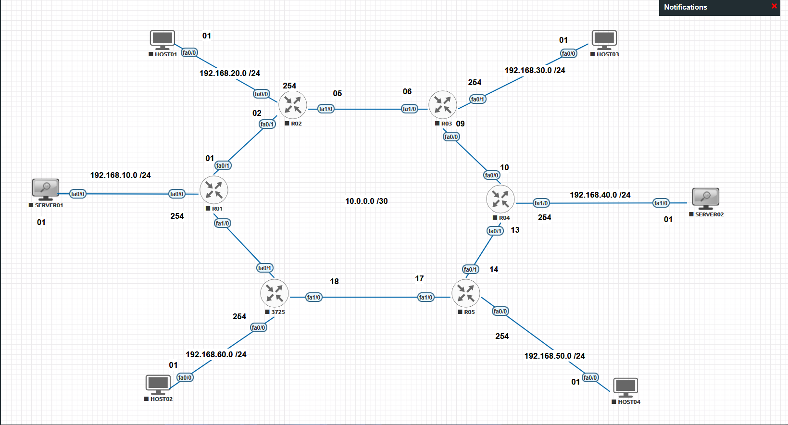
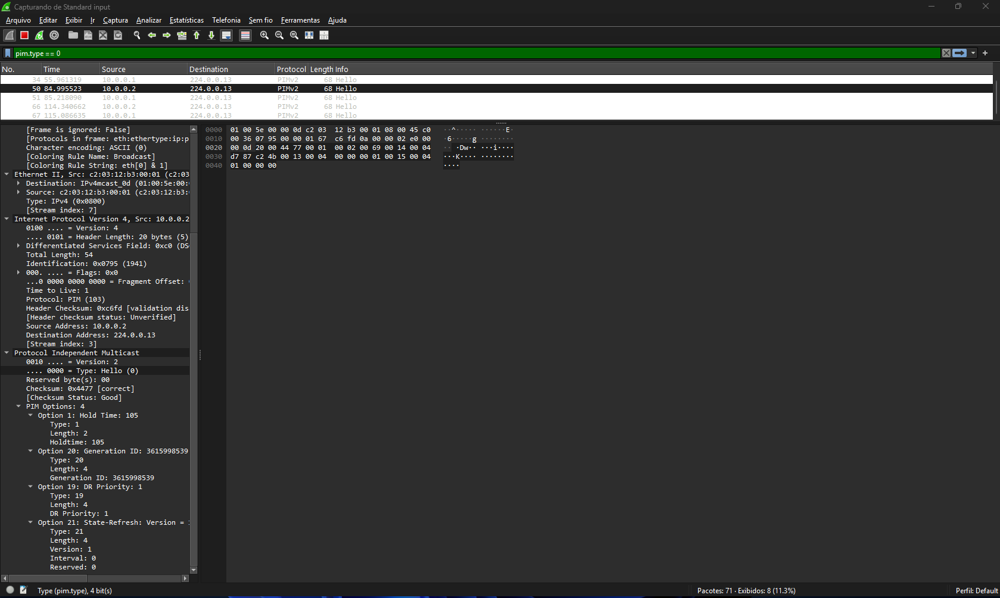

# Índice

- [Índice](#índice)
  - [11 - Exemplo Prático - Multicast Inter domínios com MSDP (Multicast Source Discovery Protocol)](#11---exemplo-prático---multicast-inter-domínios-com-msdp-multicast-source-discovery-protocol)
  - [🧾 Introdução](#-introdução)
  - [🌐 O problema: multicast além de um único domínio](#-o-problema-multicast-além-de-um-único-domínio)
  - [🔄 Onde o MSDP entra nessa arquitetura](#-onde-o-msdp-entra-nessa-arquitetura)
  - [🎯 Escopo deste laboratório](#-escopo-deste-laboratório)
  - [🎯 Objetivo do Laboratório](#-objetivo-do-laboratório)
  - [📚 O que você vai aprender](#-o-que-você-vai-aprender)
    - [💼 Relevância prática](#-relevância-prática)
  - [🧠 Explicação do Cenário](#-explicação-do-cenário)
  - [🌐 Multicast em múltiplos domínios com PIM-SM](#-multicast-em-múltiplos-domínios-com-pim-sm)
  - [🔄 O papel do MSDP no cenário](#-o-papel-do-msdp-no-cenário)
  - [🧩 1️⃣ Fontes e Receptores no Cenário](#-1️⃣-fontes-e-receptores-no-cenário)
    - [🧭 Estrutura do Roteamento](#-estrutura-do-roteamento)
    - [📡 Grupos Multicast no PIM Bidirectional](#-grupos-multicast-no-pim-bidirectional)
    - [🧩 Conclusão](#-conclusão)
    - [🛰️ O que muda no PIM Bidirectional (BIDIR)](#️-o-que-muda-no-pim-bidirectional-bidir)
      - [🔹 1️⃣ O papel do IGMP no PIM BIDIR](#-1️⃣-o-papel-do-igmp-no-pim-bidir)
      - [🔀 2️⃣ Designated Forwarder (DF) e prevenção de loops](#-2️⃣-designated-forwarder-df-e-prevenção-de-loops)
      - [🛰️ 3️⃣ Quando as fontes começam a transmitir](#️-3️⃣-quando-as-fontes-começam-a-transmitir)
      - [📡 4️⃣ Vantagens do PIM BIDIR sobre o PIM-SM tradicional](#-4️⃣-vantagens-do-pim-bidir-sobre-o-pim-sm-tradicional)
  - [🌐 Topologia do Laboratório](#-topologia-do-laboratório)
    - [🔧 Endereçamento e Funções](#-endereçamento-e-funções)
    - [📡 Grupos Multicast no PIM Bidirectional - resumo](#-grupos-multicast-no-pim-bidirectional---resumo)
    - [🔍 Testes Preliminares](#-testes-preliminares)
  - [🚀 Ativação do Roteamento Multicast](#-ativação-do-roteamento-multicast)
    - [🧩 Principais Diferenças do PIM BIDIR em Relação ao PIM-SM](#-principais-diferenças-do-pim-bidir-em-relação-ao-pim-sm)
    - [🌍 Onde o PIM Deve Ser Ativado](#-onde-o-pim-deve-ser-ativado)
    - [💡 Observação Sobre as Fontes Multicast](#-observação-sobre-as-fontes-multicast)
    - [🔁 O que acontece no roteador (Designated Router – DR)](#-o-que-acontece-no-roteador-designated-router--dr)
    - [🌳 Construção da Árvore Multicast](#-construção-da-árvore-multicast)
    - [🧩 Limitações Intencionais do Modelo](#-limitações-intencionais-do-modelo)
    - [📊 Matriz de Comportamento: Host vs. Fontes](#-matriz-de-comportamento-host-vs-fontes)
  - [⚙️ Ativando o roteamento multicast](#️-ativando-o-roteamento-multicast)
  - [⚙️ Ativando o protocolo PIM Bidirectional (PIM-BIDIR)](#️-ativando-o-protocolo-pim-bidirectional-pim-bidir)
    - [🔧 Configuração do PIM-BIDIR](#-configuração-do-pim-bidir)
      - [Exemplo – Ativando o PIM nas interfaces do R01](#exemplo--ativando-o-pim-nas-interfaces-do-r01)
  - [🧩 Eleição do Designated Router (DR) no PIM-BIDIR](#-eleição-do-designated-router-dr-no-pim-bidir)
    - [⚙️ Critérios de eleição do DR](#️-critérios-de-eleição-do-dr)
  - [💬 Mensagens PIM Hello no PIM-BIDIR](#-mensagens-pim-hello-no-pim-bidir)
    - [⚙️ Funções principais das mensagens Hello](#️-funções-principais-das-mensagens-hello)
    - [🧩 Estrutura simplificada da mensagem PIM Hello](#-estrutura-simplificada-da-mensagem-pim-hello)
  - [🔍 Exemplo de log da eleição do DR](#-exemplo-de-log-da-eleição-do-dr)
  - [🧭 Surgimento do Designated Forwarder (DF) no PIM-BIDIR](#-surgimento-do-designated-forwarder-df-no-pim-bidir)
  - [📊 Comparação clara: DR × DF no PIM-BIDIR](#-comparação-clara-dr--df-no-pim-bidir)
  - [🧪 Identificação do Designated Router (DR) no Domínio PIM](#-identificação-do-designated-router-dr-no-domínio-pim)
  - [⚙️ Como o DR é eleito neste estágio](#️-como-o-dr-é-eleito-neste-estágio)
  - [🔍 Comandos para identificar o DR](#-comandos-para-identificar-o-dr)
    - [0️⃣ Verificar em que interfaces o PIM está ativado](#0️⃣-verificar-em-que-interfaces-o-pim-está-ativado)
    - [1️⃣ Verificar vizinhança PIM](#1️⃣-verificar-vizinhança-pim)
    - [2️⃣ Verificar logs de eleição do DR em tempo real](#2️⃣-verificar-logs-de-eleição-do-dr-em-tempo-real)
    - [3️⃣ Confirmar a interface LAN envolvida](#3️⃣-confirmar-a-interface-lan-envolvida)
    - [🧠 Evidência via captura de pacotes (Wireshark)](#-evidência-via-captura-de-pacotes-wireshark)
    - [✅ Conclusão deste estágio do laboratório](#-conclusão-deste-estágio-do-laboratório)
  - [🔄 Transição para PIM BIDIR (Bidirectional PIM)](#-transição-para-pim-bidir-bidirectional-pim)
    - [🎯 Características fundamentais do PIM BIDIR](#-características-fundamentais-do-pim-bidir)
    - [🧭 DR x DF — Comparação Conceitual](#-dr-x-df--comparação-conceitual)
  - [📘 PIM BIDIR — Configuração do RP e Eleição do DF](#-pim-bidir--configuração-do-rp-e-eleição-do-df)
    - [Introdução do papel DF (Designated Forwarder)](#introdução-do-papel-df-designated-forwarder)
    - [🧩 1️⃣ Configurando o Rendezvous Point (RP) BIDIR](#-1️⃣-configurando-o-rendezvous-point-rp-bidir)
    - [🧩 2️⃣ Associando grupos multicast ao RP em modo BIDIR](#-2️⃣-associando-grupos-multicast-ao-rp-em-modo-bidir)
    - [📌 Nota Importante sobre a Configuração do RP](#-nota-importante-sobre-a-configuração-do-rp)
    - [🧠 3️⃣ DR x DF — Papéis distintos no PIM BIDIR](#-3️⃣-dr-x-df--papéis-distintos-no-pim-bidir)
    - [📊 Comparação prática: DR x DF](#-comparação-prática-dr-x-df)
    - [📌 Nota sobre compatibilidade de IOS](#-nota-sobre-compatibilidade-de-ios)
    - [📘 Referência ao padrão IETF (RFC)](#-referência-ao-padrão-ietf-rfc)
  - [Escopo dos Grupos Multicast no Domínio PIM BIDIR](#escopo-dos-grupos-multicast-no-domínio-pim-bidir)
    - [📋 Grupos Multicast Utilizados no Laboratório](#-grupos-multicast-utilizados-no-laboratório)
  - [Mudanças no Plano de Controle Multicast: SPT vs (\*,G)](#mudanças-no-plano-de-controle-multicast-spt-vs-g)
    - [🔄 PIM Sparse-Mode Tradicional (Referência)](#-pim-sparse-mode-tradicional-referência)
    - [🔁 PIM BIDIR – Plano de Controle Simplificado](#-pim-bidir--plano-de-controle-simplificado)
    - [🧠 Implicações no Plano de Controle](#-implicações-no-plano-de-controle)
    - [🔍 Observação do Estado Multicast (Pré-tráfego)](#-observação-do-estado-multicast-pré-tráfego)
  - [3️⃣ Designated Forwarder (DF) no PIM BIDIR — Conceito e Observação no LAB](#3️⃣-designated-forwarder-df-no-pim-bidir--conceito-e-observação-no-lab)
    - [🔄 Por que o DR não é suficiente no PIM BIDIR](#-por-que-o-dr-não-é-suficiente-no-pim-bidir)
    - [🧠 Conceito do Designated Forwarder (DF)](#-conceito-do-designated-forwarder-df)
    - [🧩 Separação entre DR e DF](#-separação-entre-dr-e-df)
  - [🔎 Observação do Ambiente PIM BIDIR (LAB)](#-observação-do-ambiente-pim-bidir-lab)
    - [📌 Verificação das Interfaces PIM](#-verificação-das-interfaces-pim)
  - [Eleição do Designated Forwarder (DF) no PIM BIDIR](#eleição-do-designated-forwarder-df-no-pim-bidir)
    - [🧠 Conceito de Eleição do DF no PIM BIDIR](#-conceito-de-eleição-do-df-no-pim-bidir)
    - [📌 Critério de Eleição do DF](#-critério-de-eleição-do-df)
    - [🧭 Designated Forwarder (DF) por enlace no cenário do laboratório](#-designated-forwarder-df-por-enlace-no-cenário-do-laboratório)
      - [📌 DF eleito por trecho](#-df-eleito-por-trecho)
    - [🔀 Direção do tráfego no PIM BIDIR: upstream e downstream](#-direção-do-tráfego-no-pim-bidir-upstream-e-downstream)
      - [🔺 Tráfego Upstream (em direção ao RP)](#-tráfego-upstream-em-direção-ao-rp)
      - [🔻 Tráfego Downstream (a partir do RP)](#-tráfego-downstream-a-partir-do-rp)
    - [🧠 Por que o tráfego “volta” a partir do RP?](#-por-que-o-tráfego-volta-a-partir-do-rp)
    - [🔍 Verificação do Caminho RPF até o RP](#-verificação-do-caminho-rpf-até-o-rp)
    - [🧠 O que esse comando realmente mostra](#-o-que-esse-comando-realmente-mostra)
    - [🔎 Determinação do DF (Análise da Métrica Unicast)](#-determinação-do-df-análise-da-métrica-unicast)
  - [IGMP / Receptores Multicast](#igmp--receptores-multicast)
    - [🧠 Papel do IGMP no PIM BIDIR](#-papel-do-igmp-no-pim-bidir)
    - [🖥️ Topologia dos Receptores](#️-topologia-dos-receptores)
    - [🔧 Configuração do IGMP nas Interfaces de Acesso](#-configuração-do-igmp-nas-interfaces-de-acesso)
    - [🖥️ Simulação dos Hosts Receptores](#️-simulação-dos-hosts-receptores)
    - [🔍 Verificação dos Receptores no Roteador](#-verificação-dos-receptores-no-roteador)
    - [🔍 Verificação do Estado Multicast no PIM](#-verificação-do-estado-multicast-no-pim)
  - [Fontes Multicast – Cenário Many-to-Many](#fontes-multicast--cenário-many-to-many)
    - [🧠 Conceito de Many-to-Many no PIM BIDIR](#-conceito-de-many-to-many-no-pim-bidir)
    - [🖥️ Topologia das Fontes](#️-topologia-das-fontes)
    - [Ajuste de Topologia — Fontes e Receptores no PIM BIDIR](#ajuste-de-topologia--fontes-e-receptores-no-pim-bidir)
    - [🎥 Configuração das Fontes Multicast (Many-to-Many)](#-configuração-das-fontes-multicast-many-to-many)
    - [🧠 Considerações sobre IGMP em Laboratórios BIDIR](#-considerações-sobre-igmp-em-laboratórios-bidir)
    - [🟦 Configuração dos Servidores (Fontes)](#-configuração-dos-servidores-fontes)
      - [🟦 Server02](#-server02)
    - [🟩 Server03](#-server03)
    - [Realizando testes - Simulando fluxo nos servidores](#realizando-testes---simulando-fluxo-nos-servidores)
  - [🛠️ Troubleshooting (PIM BIDIR)](#️-troubleshooting-pim-bidir)
  - [🧩 O que aprendemos com este laboratório (PIM BIDIR)](#-o-que-aprendemos-com-este-laboratório-pim-bidir)
  - [🎯 Principais aprendizados](#-principais-aprendizados)
  - [💡 Conclusões gerais](#-conclusões-gerais)
  - [🗺️ Fluxo conceitual do PIM BIDIR (\*,G)](#️-fluxo-conceitual-do-pim-bidir-g)
  - [📘 Tabela de Comandos](#-tabela-de-comandos)
    - [🖥️ Função — R01 atua como Designated Forwarder (DF) no domínio PIM BIDIR](#️-função--r01-atua-como-designated-forwarder-df-no-domínio-pim-bidir)
    - [📘 R02 — Roteador de Núcleo / Intermediário do Domínio PIM BIDIR](#-r02--roteador-de-núcleo--intermediário-do-domínio-pim-bidir)
    - [📙 R03 — DF da LAN dos Hosts + Roteador de Trânsito no Domínio PIM BIDIR](#-r03--df-da-lan-dos-hosts--roteador-de-trânsito-no-domínio-pim-bidir)
    - [📒 R04 — DF da LAN do Host02 + Roteador de Trânsito no Domínio PIM BIDIR](#-r04--df-da-lan-do-host02--roteador-de-trânsito-no-domínio-pim-bidir)
    - [📕 R05 — DF da LAN do Host03 + Roteador de Trânsito no Domínio PIM BIDIR](#-r05--df-da-lan-do-host03--roteador-de-trânsito-no-domínio-pim-bidir)
    - [🖥️ SERVER03 — Fonte Multicast no Domínio PIM BIDIR](#️-server03--fonte-multicast-no-domínio-pim-bidir)
    - [🖥️ SERVER02 — Fonte Multicast no Domínio PIM BIDIR](#️-server02--fonte-multicast-no-domínio-pim-bidir)
    - [💻 HOST02 — Receptor Multicast no Domínio PIM BIDIR](#-host02--receptor-multicast-no-domínio-pim-bidir)
    - [🖥️ HOST03 — Receptor Multicast no Domínio PIM BIDIR](#️-host03--receptor-multicast-no-domínio-pim-bidir)

## 11 - Exemplo Prático - Multicast Inter domínios com MSDP (Multicast Source Discovery Protocol)

## 🧾 Introdução

Em ambientes corporativos de pequeno e médio porte, o multicast costuma operar de forma simples e previsível. Uma fonte envia tráfego para um grupo multicast, os receptores interessados se associam a esse grupo e o encaminhamento ocorre normalmente dentro de um único domínio multicast, geralmente controlado por um único Rendezvous Point (RP).  
  
À medida que a rede cresce, esse modelo passa a apresentar limitações. Organizações com múltiplos domínios administrativos, datacenters distribuídos ou redes segmentadas por requisitos operacionais frequentemente adotam RPs independentes em cada domínio multicast. Embora o multicast continue funcionando localmente em cada domínio, a descoberta de fontes multicast entre domínios distintos deixa de ocorrer de forma automática.  
  
Na prática, isso significa que uma aplicação multicast ativa em um domínio pode se tornar invisível para receptores localizados em outro, mesmo existindo conectividade IP plena entre as redes. Essa limitação não está relacionada ao transporte do tráfego multicast em si, mas à ausência de um mecanismo que permita a troca de informações sobre fontes multicast entre diferentes RPs.  
  
O Multicast Source Discovery Protocol (MSDP) foi projetado exatamente para resolver esse cenário. O MSDP permite que RPs pertencentes a domínios multicast distintos compartilhem informações sobre fontes multicast ativas, viabilizando a comunicação multicast entre domínios independentes, sem alterar o funcionamento interno do PIM Sparse Mode (PIM-SM).  
  
Este laboratório foi desenvolvido como parte do meu estudo para a certificação Cisco CCNP ENCOR (350-401) e tem como objetivo demonstrar, de forma prática, como o MSDP é utilizado para interconectar domínios multicast baseados em PIM-SM, refletindo situações reais encontradas em redes corporativas distribuídas.  
  
---
  
## 🌐 O problema: multicast além de um único domínio

Dentro de um único domínio multicast, o PIM-SM utiliza o RP como ponto central para a descoberta inicial de fontes e a construção das árvores multicast. Esse modelo funciona de forma eficiente enquanto todos os roteadores participantes compartilham o mesmo RP.  
  
Entretanto, quando diferentes partes da rede utilizam RPs distintos, cada domínio multicast passa a operar de forma isolada. Fontes multicast registradas em um domínio não são automaticamente conhecidas por RPs de outros domínios, impedindo que receptores remotos descubram e recebam esse tráfego.  
  
Esse tipo de cenário é comum em ambientes corporativos reais, especialmente em redes distribuídas geograficamente, ambientes com múltiplos datacenters ou organizações que segmentam suas redes por critérios administrativos ou de segurança.  

---

## 🔄 Onde o MSDP entra nessa arquitetura

O MSDP atua como um mecanismo de intercâmbio de informações entre RPs pertencentes a domínios multicast distintos. Por meio do estabelecimento de sessões MSDP, os RPs passam a trocar mensagens de anúncio de fontes multicast, conhecidas como Source-Active (SA).  
  
É importante destacar que o MSDP não transporta tráfego multicast. Seu papel é exclusivamente informativo: ele permite que um RP saiba da existência de fontes multicast em outros domínios. A partir dessa informação, o próprio PIM-SM se encarrega de estabelecer os fluxos multicast necessários para atender os receptores interessados.  
  
Dessa forma, o MSDP viabiliza a comunicação multicast inter-domínios mantendo a independência operacional de cada domínio multicast e preservando a arquitetura baseada em RPs locais.

---

## 🎯 Escopo deste laboratório

Este laboratório simula um ambiente multicast composto por múltiplos domínios PIM-SM interconectados por meio do MSDP, com foco nos seguintes aspectos:

- Separação lógica de domínios multicast, cada um com seu próprio RP;
- Estabelecimento de sessões MSDP entre RPs de domínios distintos;
- Descoberta de fontes multicast remotas por meio de mensagens SA;
- Distribuição de tráfego multicast entre domínios independentes;
- Validação operacional do funcionamento do MSDP e do PIM-SM em conjunto.

O cenário foi mantido intencionalmente simples para facilitar o entendimento do fluxo de controle e de dados, sem perder aderência a situações encontradas em ambientes corporativos reais.

---

## 🎯 Objetivo do Laboratório

O objetivo deste laboratório é compreender como o Multicast Source Discovery Protocol (MSDP) permite a comunicação multicast entre domínios PIM-SM distintos, preservando a autonomia de cada domínio multicast e seus respectivos RPs.

Durante os testes, serão observados:

- O comportamento do PIM-SM dentro de cada domínio multicast;
- O papel do RP como fronteira lógica do domínio multicast;
- O funcionamento das sessões MSDP entre RPs;
- O processo de anúncio e aprendizado de fontes multicast remotas;
- A construção e validação dos fluxos multicast entre domínios distintos.

Com isso, o laboratório demonstra como o MSDP resolve limitações arquiteturais do multicast tradicional em ambientes distribuídos, mantendo previsibilidade, escalabilidade e clareza operacional.

---

## 📚 O que você vai aprender

- Como estruturar domínios multicast independentes utilizando PIM-SM;
- Como definir e validar RPs distintos em cada domínio multicast;
- Como configurar e verificar sessões MSDP entre RPs;
- Como analisar o processo de descoberta de fontes multicast inter-domínios;
- Como validar o encaminhamento multicast utilizando comandos de verificação do PIM e do MSDP;
- Como correlacionar decisões de design multicast com cenários reais de redes corporativas.

### 💼 Relevância prática

Em ambientes corporativos distribuídos, o multicast raramente se limita a um único domínio de rede. Organizações com múltiplos datacenters, redes segmentadas por critérios administrativos ou ambientes geograficamente dispersos frequentemente adotam **domínios multicast independentes**, cada um com seu próprio **Rendezvous Point (RP)**.  
  
Nesses cenários, embora o multicast funcione corretamente dentro de cada domínio PIM-SM, a **descoberta de fontes multicast entre domínios distintos não ocorre de forma automática**. Essa limitação impacta diretamente aplicações corporativas que dependem da distribuição eficiente de dados multicast entre diferentes partes da organização.  
  
O **Multicast Source Discovery Protocol (MSDP)** é amplamente utilizado nesses ambientes para viabilizar a comunicação multicast entre domínios independentes, permitindo que **RPs distintos compartilhem informações sobre fontes multicast ativas**, sem comprometer a autonomia operacional de cada domínio.  
  
Casos comuns de uso incluem:
  
- Ambientes corporativos com múltiplos datacenters
- Redes segmentadas por domínios administrativos
- Aplicações multicast distribuídas
- Infraestruturas legadas que utilizam PIM-SM com RPs distintos

---

## 🧠 Explicação do Cenário
  
O cenário deste laboratório já possui o roteamento unicast totalmente funcional por meio do **OSPF**, garantindo conectividade IP completa entre todas as sub-redes. Essa etapa é fundamental, pois o correto funcionamento do multicast depende diretamente da convergência do plano unicast.  
  
A topologia física em anel foi mantida propositalmente para demonstrar que a **separação de domínios multicast é lógica**, e não física. Embora todos os roteadores estejam interconectados, o ambiente foi segmentado em **dois domínios multicast independentes**, cada um com seu próprio RP.  
  

  
Neste laboratório, utilizamos cinco roteadores Cisco (R01 a R05), responsáveis pelo encaminhamento unicast e multicast, e um conjunto de hosts que representam **fontes e receptores multicast distribuídos em domínios distintos**.  
  
Os hosts são configurados exclusivamente com **endereçamento IP e IGMP (tipicamente IGMPv2)**, sem participação em protocolos de roteamento dinâmico, refletindo o comportamento esperado de dispositivos finais em ambientes multicast reais.  
  
Os roteadores intermediários executam **PIM Sparse Mode (PIM-SM)**, com **RPs estáticos distintos para cada domínio multicast**, e sessões **MSDP estabelecidas exclusivamente entre os RPs**, permitindo a troca de informações sobre fontes multicast ativas entre os domínios.  
  
---
  
## 🌐 Multicast em múltiplos domínios com PIM-SM
  
Dentro de cada domínio multicast, o **PIM Sparse Mode (PIM-SM)** opera de forma tradicional, utilizando o RP como ponto central para a descoberta inicial de fontes multicast e a construção das árvores multicast.  
  
Cada domínio multicast mantém sua própria lógica de controle, incluindo:  
  
- RP dedicado;
- Processos independentes de registro de fontes;  
- Construção local das árvores multicast (*,G) e (S,G).
  
Sem o uso do MSDP, esses domínios operariam de forma isolada, impossibilitando que receptores de um domínio descubram fontes multicast localizadas em outro.  
  
---

## 🔄 O papel do MSDP no cenário

O **MSDP** atua como um mecanismo de intercâmbio de informações entre os **Rendezvous Points (RPs)** de domínios multicast distintos. Por meio de sessões MSDP, os RPs trocam mensagens **Source-Active (SA)**, informando a existência de fontes multicast ativas em seus respectivos domínios.
  
É importante destacar que:
  
- O MSDP **não transporta tráfego multicast**;
- O tráfego multicast continua sendo encaminhado diretamente pelos mecanismos do PIM-SM;
- O MSDP atua exclusivamente no **plano de controle**, viabilizando a descoberta de fontes remotas.
  
A partir das informações recebidas via MSDP, cada RP passa a conhecer fontes multicast externas ao seu domínio, permitindo que os receptores locais estabeleçam os fluxos multicast necessários.  
  
---
  
## 🧩 1️⃣ Fontes e Receptores no Cenário

Neste cenário, as **fontes e receptores multicast estão distribuídos em domínios multicast distintos**, caracterizando um ambiente típico de **multicast inter-domínios com MSDP**.  
  
Cada fonte é registrada localmente em seu domínio multicast, enquanto os receptores utilizam **IGMP** para expressar interesse em grupos multicast. A descoberta das fontes remotas ocorre por meio da troca de mensagens **SA** entre os RPs.  

| Função         | Dispositivo | Rede/Sub-rede   | Interface | Endereço IP     | Descrição                                                   |
|----------------|-------------|-----------------|-----------|-----------------|-------------------------------------------------------------|
| **Fonte 1**    | SERVER01    | 192.168.10.0/24 | fa0/0     | 192.168.10.1    | Fonte multicast localizada no Domínio 01                    |
| **Fonte 2**    | SERVER02    | 192.168.40.0/24 | fa0/0     | 192.168.40.1    | Fonte multicast localizada no Domínio 02                    |
| **Receptor 1** | HOST02      | 192.168.20.0/24 | fa0/0     | 192.168.20.1    | Receptor multicast no Domínio 01                            |
| **Receptor 2** | HOST03      | 192.168.60.0/24 | fa0/0     | 192.168.60.1    | Receptor multicast no Domínio 01                            |
| **Receptor 3** | HOST04      | 192.168.30.0/24 | fa0/0     | 192.168.30.1    | Receptor multicast no Domínio 02                            |
| **Receptor 4** | HOST05      | 192.168.50.0/24 | fa0/0     | 192.168.50.1    | Receptor multicast no Domínio 02                            |

---

ALterar Daqui

---

### 🧭 Estrutura do Roteamento

Todos os roteadores (**R01 a R05**) participam de uma **única área OSPF (Área 0)**, garantindo conectividade unicast completa antes da ativação do multicast.  
  
Essa conectividade é essencial para:

- Construção da árvore compartilhada **(*,G)**;
- Funcionamento do **Rendezvous Point (RP)** como raiz lógica;
- Eleição correta do **Designated Forwarder (DF)** em cada enlace.  
  
| Link Ponto-a-Ponto | Rede / Máscara | Interface Local | Interface Remota |
|--------------------|----------------|-----------------|------------------|
| R01 – R02          | 10.0.0.0/30    | Fa0/1 (R01)     | Fa1/0 (R02)      |
| R02 – R03          | 10.0.0.4/30    | Fa1/0 (R02)     | Fa1/0 (R03)      |
| R03 – R04          | 10.0.0.8/30    | Fa0/0 (R03)     | Fa0/0 (R04)      |
| R04 – R05          | 10.0.0.12/30   | Fa0/1 (R04)     | Fa0/1 (R05)      |
| R05 – R01          | 10.0.0.16/30   | Fa1/0 (R05)     | Fa1/0 (R01)      |

---

### 📡 Grupos Multicast no PIM Bidirectional

Abaixo, o grupo configurado para este laboratório. Note que, independentemente do número de fontes, o estado na tabela mroute permanecerá consolidado.

| Grupo Multicast | Modelo PIM | Comportamento Esperado                                                     |
|-----------------|------------|----------------------------------------------------------------------------|
| 239.1.1.1       | (*,G)      | Fluxo bidirecional via árvore compartilhada; sem criação de estados (S,G). |

### 🧩 Conclusão

Este laboratório demonstra a **eficiência do PIM Bidirectional (BIDIR)** em reduzir drasticamente a complexidade da rede multicast. Ao consolidar o encaminhamento em **uma única árvore (∗,G) e eliminar a transição para SPT**, o protocolo oferece uma operação mais enxuta e estável. É a solução padrão para redes de larga escala que exigem baixa latência e alta previsibilidade, como sistemas de controle distribuído e plataformas do setor financeiro.

---

### 🛰️ O que muda no PIM Bidirectional (BIDIR)
  
#### 🔹 1️⃣ O papel do IGMP no PIM BIDIR

No **PIM BIDIR**, os hosts utilizam **IGMP (tipicamente IGMPv2)** apenas para **informar interesse em um grupo multicast (G)**.  
  
Diferente do SSM:  
  
- Os hosts **não especificam fontes**;
- Não existe o conceito de inscrição (S,G);
- A decisão de encaminhamento é feita exclusivamente no domínio PIM.
  
O roteador diretamente conectado ao host (**Designated Router – DR**) registra o interesse no grupo e passa a participar da árvore compartilhada (*,G).  

---

#### 🔀 2️⃣ Designated Forwarder (DF) e prevenção de loops

Como o tráfego multicast no BIDIR pode fluir **em ambas as direções** ao longo da árvore compartilhada, o protocolo utiliza o conceito de **Designated Forwarder (DF)**.  
  
O **DF** é eleito em cada enlace multicast e é responsável por:  

- Decidir qual roteador pode encaminhar tráfego multicast naquele segmento;
- Evitar loops e duplicação de pacotes;
- Garantir encaminhamento consistente em ambientes com múltiplas fontes.
  
A eleição do DF é baseada em métricas unicast em direção ao RP.  
  
---
  
#### 🛰️ 3️⃣ Quando as fontes começam a transmitir
  
Quando uma ou mais fontes passam a enviar tráfego para um determinado grupo multicast:  
  
- O tráfego é imediatamente encaminhado pela **árvore compartilhada (*,G)**;
- Não há registro, encapsulamento ou redirecionamento para o RP;
- Todos os receptores inscritos no grupo recebem os fluxos multicast.
  
O comportamento é **simétrico e contínuo**, independentemente do número de fontes ativas.  
  
---
  
#### 📡 4️⃣ Vantagens do PIM BIDIR sobre o PIM-SM tradicional

| Aspecto                    | PIM Sparse Mode (tradicional) | PIM Bidirectional (BIDIR) |
|----------------------------|-------------------------------|---------------------------|
| Tipo de árvore             | (*,G) + (S,G)                 | Apenas (*,G)              |
| SPT Switching              | Sim                           | ❌ Não                    |
| Estado multicast           | Elevado em muitos fluxos      | Reduzido                  |
| Dependência do RP          | Funcional                     | Apenas lógica             |
| Encapsulamento (Register)  | Sim                           | ❌ Não                    |
| Escalabilidade             | Moderada                      | Alta                      |
| Modelo de comunicação      | One-to-many                   | Many-to-many              |

---

👉 **Resumo:**  
O **PIM Bidirectional (BIDIR)** é projetado para cenários multicast **de larga escala e múltiplas fontes**, onde previsibilidade, simplicidade e estabilidade são mais importantes do que a otimização individual de caminhos.  
Ao eliminar o **SPT Switching** e manter todo o domínio baseado em **uma única árvore compartilhada (*,G)**, o BIDIR se torna uma solução robusta e eficiente para ambientes corporativos e críticos.

## 🌐 Topologia do Laboratório

Este laboratório simula um cenário enterprise de multicast **many-to-many**, comum em ambientes financeiros, sistemas de colaboração em tempo real e plataformas de replicação distribuída.  
  
O objetivo é demonstrar, de forma prática e didática, o funcionamento do **PIM Bidirectional (PIM BIDIR)**, destacando sua arquitetura baseada em **árvore compartilhada (*,G)**, a ausência de **SPT Switching** e o papel do **Rendezvous Point como raiz lógica** da topologia multicast.  

A topologia deste laboratório é composta por **cinco roteadores principais (R01 a R05)** e **quatro hosts simulados (Server, Server02, Host02 e Host03)**.  
Os hosts são roteadores Cisco configurados de forma simplificada, apenas com **endereçamento IP** e **participação em grupos multicast via IGMP (tipicamente IGMPv2)**, simulando o comportamento de dispositivos finais.

O protocolo **OSPF** garante a conectividade unicast entre todos os roteadores, enquanto o **PIM Bidirectional (BIDIR)** é utilizado para o roteamento multicast.  
Diferente do **PIM Sparse Mode tradicional**, o **PIM BIDIR** utiliza **uma única árvore compartilhada (*,G)** para todos os fluxos multicast, **sem criação de estados (S,G)** e **sem SPT Switching**.

Neste modelo, múltiplas **fontes e receptores** compartilham o mesmo grupo multicast, caracterizando um ambiente **many-to-many**, no qual o tráfego flui **bidirecionalmente** ao longo da árvore, com o **Rendezvous Point (RP)** atuando apenas como **raiz lógica** do domínio multicast.

---

### 🔧 Endereçamento e Funções

| **Dispositivo** | **Interface** | **Endereço IP / Máscara** | **Conexão / Função**                                 |
|-----------------|---------------|---------------------------|------------------------------------------------------|
| **R01**         | Loopback0     | 1.1.1.1 /32               | Identificação / Router-ID OSPF                       |
|                 | Fa0/0         | 192.168.10.254 /24        | LAN do Server — Gateway multicast                    |
|                 | Fa0/1         | 10.0.0.1 /30              | Link com R02 — PIM BIDIR + OSPF                      |
|                 | Fa1/0         | 10.0.0.18 /30             | Link com R05 — PIM BIDIR + OSPF                      |
| **R02**         | Loopback0     | 2.2.2.2 /32               | Identificação / Router-ID OSPF                       |
|                 | Fa0/0         | 10.0.0.2 /30              | Link com R01 — PIM BIDIR + OSPF                      |
|                 | Fa1/0         | 10.0.0.5 /30              | Link com R03 — PIM BIDIR + OSPF                      |
| **R03**         | Loopback0     | 3.3.3.3 /32               | Identificação / Router-ID OSPF                       |
|                 | Fa0/0         | 10.0.0.6 /30              | Link com R02 — PIM BIDIR + OSPF                      |
|                 | Fa1/0         | 10.0.0.9 /30              | Link com R04 — PIM BIDIR + OSPF                      |
| **R04**         | Loopback0     | 4.4.4.4 /32               | Identificação / Router-ID OSPF                       |
|                 | Fa0/0         | 10.0.0.10 /30             | Link com R03 — PIM BIDIR + OSPF                      |
|                 | Fa1/0         | 10.0.0.13 /30             | Link com R05 — PIM BIDIR + OSPF                      |
|                 | Fa1/1         | 192.168.20.254 /24        | LAN do Host02 — Gateway multicast                    |
| **R05**         | Loopback0     | 5.5.5.5 /32               | Identificação / Router-ID OSPF                       |
|                 | Fa0/0         | 10.0.0.14 /30             | Link com R04 — PIM BIDIR + OSPF                      |
|                 | Fa1/0         | 10.0.0.17 /30             | Link com R01 — PIM BIDIR + OSPF                      |
|                 | Fa0/1         | 192.168.30.254 /24        | LAN do Host03 — Gateway multicast                    |
| **Server**      | Fa0/0         | 192.168.10.1 /24          | Fonte multicast                                      |
| **Server02**    | Fa0/0         | 192.168.40.1 /24          | Fonte multicast                                      |
| **Host02**      | Fa0/0         | 192.168.20.1 /24          | Receptor multicast (IGMP (*,G))                      |
| **Host03**      | Fa0/0         | 192.168.30.1 /24          | Receptor multicast (IGMP (*,G))                      |

---

### 📡 Grupos Multicast no PIM Bidirectional - resumo

No **PIM BIDIR**, os grupos multicast utilizam exclusivamente o modelo **(*,G)**.  
Os hosts **não escolhem fontes específicas** e todos os emissores podem enviar tráfego para o mesmo grupo multicast.

Neste laboratório, será utilizado o seguinte grupo:

| Grupo Multicast | Modelo | Descrição                                          |
|-----------------|--------|----------------------------------------------------|
| 239.1.1.1       | (*,G)  | Grupo multicast compartilhado por múltiplas fontes |

📌 **Observações importantes:**

- Não há uso de endereços SSM (232/8);
- Não existem inscrições (S,G);
- Não ocorre SPT Switching;
- O encaminhamento é controlado pelo **Designated Forwarder (DF)** em cada enlace;
- O **RP atua apenas como raiz lógica** da árvore compartilhada.

Esse comportamento reflete fielmente o funcionamento do **PIM Bidirectional (BIDIR)** em ambientes **many-to-many**, priorizando **simplicidade, previsibilidade e escalabilidade**.

---

**🧭 Resumo da Lógica**  

- O **Server (192.168.10.1)** atua como **fonte multicast**, enviando tráfego para o **grupo multicast 239.1.1.1 (G)**.  
- O **Server02 (192.168.40.1)** também atua como **fonte multicast**, enviando tráfego para o **mesmo grupo multicast 239.1.1.1 (G)**.  
- O **Host02 (192.168.20.1)** participa do domínio multicast utilizando **IGMP (tipicamente IGMPv2)**, inscrevendo-se no **grupo multicast (*,G)**.  
- O **Host03 (192.168.30.1)** participa do domínio multicast utilizando **IGMP (tipicamente IGMPv2)**, inscrevendo-se no **grupo multicast (*,G)**.  
- O protocolo **PIM Bidirectional (BIDIR)** é ativado em todas as interfaces participantes do domínio multicast (LANs e links de roteamento).  
- Os **roteadores utilizam um Rendezvous Point (RP)**, que atua **apenas como raiz lógica da árvore compartilhada**, sem receber ou encapsular tráfego multicast.  
- O encaminhamento do tráfego multicast é controlado pelo **Designated Forwarder (DF)** em cada enlace, evitando loops e duplicações.  
- O **RPF (Reverse Path Forwarding)** é utilizado para validar o encaminhamento multicast com base na **melhor rota unicast em direção ao RP**, aprendida via OSPF.  

Assim, o laboratório demonstra a operação do **PIM Bidirectional (BIDIR)**, no qual múltiplas fontes e múltiplos receptores compartilham uma **única árvore multicast (*,G)**, sem criação de estados **(S,G)** e **sem SPT Switching**, priorizando simplicidade, previsibilidade e escalabilidade.

---

### 🔍 Testes Preliminares

Antes de ativar o multicast, é essencial confirmar a **conectividade unicast** entre todos os dispositivos.

Cada roteador possui uma **interface Loopback** utilizada como **Router-ID** no OSPF:

- R01 → 1.1.1.1/32  
- R02 → 2.2.2.2/32  
- R03 → 3.3.3.3/32  
- R04 → 4.4.4.4/32  
- R05 → 5.5.5.5/32  

Após o OSPF estar operacional, valide a conectividade com **ping entre todas as loopbacks**.


Se todos os roteadores se alcançam, a infraestrutura unicast está pronta para o multicast.  
Lembre-se: o **PIM BIDIR** depende de uma **base unicast funcional** para a correta construção da árvore compartilhada e para o processo de **eleição do Designated Forwarder (DF)**.

---

## 🚀 Ativação do Roteamento Multicast  
  
Agora podemos ativar o **roteamento multicast** globalmente:

```ios
R01(config)#ip multicast-routing
```

Confirme que o recurso foi habilitado:  

```ios
R01#show ip multicast
  Multicast Routing: enabled
  Multicast Multipath: disabled
  Multicast Route limit: No limit
  Multicast Triggered RPF check: enabled
  Multicast Fallback group mode: Sparse
  Multicast DVMRP Interoperability: disabled
```
  
Com o roteamento multicast ativo, o próximo passo é habilitar o **PIM Bidirectional (BIDIR)** nas interfaces participantes (LANs e links entre roteadores).  
Esse procedimento deve ser repetido de R01 a R05, garantindo que todas as interfaces de roteamento façam parte do domínio **PIM BIDIR**.  

---

### 🧩 Principais Diferenças do PIM BIDIR em Relação ao PIM-SM  

| Característica            | PIM Sparse Mode (tradicional) | PIM Bidirectional (BIDIR)  |
|---------------------------|-------------------------------|----------------------------|
| Tipo de árvore            | (*,G) e (S,G)                 | Apenas (*,G)               |
| SPT Switching             | Sim                           | ❌ Não                     |
| Encapsulamento (Register) | Sim                           | ❌ Não                     |
| Uso do RP                 | Dados passam pelo RP          | RP é apenas raiz lógica    |
| Estado multicast          | Elevado                       | Reduzido                   |
| Modelo de comunicação     | One-to-many                   | Many-to-many               |
| Escalabilidade            | Moderada                      | Alta                       |

---

### 🌍 Onde o PIM Deve Ser Ativado

No PIM Bidirectional **(BIDIR)**, o tráfego multicast é encaminhado por meio de uma única **árvore compartilhada (*,G)**, utilizada simultaneamente por **múltiplas fontes e múltiplos receptores**.  
  
Diferente do PIM-SM tradicional e do SSM, o **BIDIR**:

- Não cria estados **(S,G)**;
- Não realiza **SPT Switching**;
- Não encapsula tráfego multicast;
- Utiliza o **Rendezvous Point (RP) apenas como raiz lógica da árvore**.  
  
Apesar disso, o PIM deve ser ativado em todas as interfaces que participam do domínio multicast, garantindo a troca correta de mensagens PIM Join/Prune (*,G) e a eleição adequada do Designated Forwarder (DF).  

✅ **Interfaces onde o PIM deve ser ativado**

| Situação                           | PIM deve ser ativado? | Motivo                                                 |
|------------------------------------|-----------------------|--------------------------------------------------------|
| Interface entre roteadores         | ✅ Sim                | Construção da árvore (*,G) e troca de mensagens PIM    |
| Interface com host receptor (IGMP) | ✅ Sim                | Registro de interesse no grupo multicast               |
| Interface com fonte multicast      | ✅ Sim                | Inserção correta do tráfego multicast na árvore (*,G)  |
| Loopback apenas como Router-ID     | ⚙️ Opcional           | Usada apenas para identificação OSPF                   |

---

### 💡 Observação Sobre as Fontes Multicast

No **PIM Bidirectional (BIDIR)**, as fontes operam de forma simplificada, sem a necessidade de sinalização complexa com o RP:

- **Sem PIM Register:** O tráfego não é encapsulado; é inserido diretamente na árvore compartilhada (*,G) pelo roteador conectado à fonte.
- **Controle via DF:** O encaminhamento é gerido pelo *Designated Forwarder* (DF) de cada enlace, garantindo um caminho livre de loops.
- **Fluxo Unificado:** Todas as fontes que enviam tráfego para o mesmo grupo compartilham a mesma árvore, eliminando a criação de estados (S,G) individuais.

No contexto deste laboratório, os servidores **SERVER02 e SERVER03** transmitem simultaneamente para o grupo **239.1.1.1**. Diferente do modelo SSM que vimos anteriormente, aqui o receptor não filtra fontes; ele aceita qualquer tráfego destinado ao grupo, simplificando drasticamente o plano de controle da rede.

---

🎯 **Situação**

Você tem:  
  
- **Server02 (192.168.40.01)** transmitindo tráfego multicast  
- **Server03 (192.168.50.01)** transmitindo tráfego multicast  
- Ambos transmitem para **o mesmo grupo multicast (G)**, por exemplo **239.1.1.1**
- **Host02 e Host03** querem receber **todo o tráfego multicast desse grupo**, independentemente de qual servidor seja a fonte
  
Esse cenário representa um modelo clássico **many-to-many**, ideal para **PIM Bidirectional (BIDIR)**.

---

🧠 **Como o PIM BIDIR trata isso?**

No **PIM Bidirectional**, o encaminhamento multicast **não é baseado em (S,G)**.  
Ele utiliza **exclusivamente a árvore compartilhada (*,G)**.

Isso significa que:

- O **host não escolhe fontes**
- Não existe controle por origem
- Todas as fontes que transmitem para o grupo **compartilham a mesma árvore multicast**

O **IGMP (v2 ou v3)** é usado **apenas para sinalizar interesse no grupo (G)**.

---

📩 **Sinalização do Host (IGMP)**

O **Host02 e Host03** enviam **um único IGMP Report**, informando que deseja participar do grupo multicast:

```text
IGMP Report (*, 239.1.1.1)
```  

📩 **Sinalização do Host (IGMP)**

No **PIM BIDIR**, **não há INCLUDE (S,G)** nem qualquer tipo de **seleção de fonte**.  
Os hosts simplesmente sinalizam interesse **no grupo multicast (G)**.

> “Quero receber o grupo **239.1.1.1**.”

---

🔁 **O que acontece no roteador (Designated Router – DR)**

- O **roteador04** conectado ao **Host02** recebe o **IGMP Join para o grupo (G)**  
- Ele cria **uma única entrada multicast (*,G)** na sua tabela  
- O **roteador04** envia **PIM Join (*,G)** na direção do **Rendezvous Point (RP)**  
- Ao mesmo tempo, o **roteador05** recebe o  **IGMP Join para o grupo (G)**
- Ele cria **uma única entrada multicast (*,G)** na sua tabela  
- O **roteador05** envia **PIM Join (*,G)** na direção do **Rendezvous Point (RP)**

⚠️ **Importante**  
No **PIM BIDIR**, o **RP é apenas a raiz lógica da árvore multicast**.  
Ele:

- ❌ Não recebe tráfego  
- ❌ Não realiza encapsulamento  
- ❌ Não participa do caminho de dados  

---

🌳 **Construção da Árvore Multicast**

- Uma **única árvore (*,G)** é construída para o grupo **239.1.1.1**
- Essa árvore é usada **simultaneamente por todas as fontes e todos os receptores**
- **Não ocorre**:
  - ❌ SPT Switching  
  - ❌ Criação de árvores (S,G)  
  - ❌ PIM Register  

O tráfego multicast entra na árvore pelo **roteador conectado à fonte**, respeitando o papel do **Designated Forwarder (DF)** em cada enlace.

### 🔁 O que acontece no roteador (Designated Router – DR)

Quando os receptores manifestam interesse no conteúdo, o processo de sinalização ocorre da seguinte forma:

- **Roteador04 (DR do Host02):** Recebe o **IGMP Join** para o grupo (G), cria uma entrada multicast **(*,G)** e envia um **PIM Join (*,G)** em direção ao RP.
- **Roteador05 (DR do Host03):** Recebe o **IGMP Join** para o grupo (G), cria uma entrada multicast **(*,G)** e também envia um **PIM Join (*,G)** em direção ao RP.

⚠️ **Importante: O Papel do RP no PIM BIDIR**
Diferente do PIM-SM, aqui o RP é estritamente a **raiz lógica** da árvore:

- ❌ **Sem Mensagens de Register:** As fontes não encapsulam tráfego para o RP.
- ❌ **Sem Ponto de Encontro de Dados:** O RP não precisa "desencapsular" pacotes; ele apenas define o ponto central para a eleição do **DF (Designated Forwarder)**.
- ❌ **Caminho Nativo:** O tráfego flui nativamente pela árvore assim que a fonte começa a transmitir.

---

### 🌳 Construção da Árvore Multicast

Diferente de outros modos PIM, o BIDIR estabelece uma estrutura única:

- **Árvore Única:** Uma única árvore compartilhada **(*,G)** é construída para o grupo (ex: 239.1.1.1).
- **Uso Simultâneo:** Essa árvore atende todas as fontes e todos os receptores ao mesmo tempo.
- **Eficiência de Plano de Controle:**
  - ❌ **Não ocorre SPT Switching:** O tráfego nunca migra para árvores (S,G).
  - ❌ **Sem Estados (S,G):** A tabela mroute permanece limpa e escalável.
  - ❌ **Encaminhamento via DF:** O tráfego entra e sai da árvore respeitando a eleição do **Designated Forwarder** em cada link, o que previne loops bidirecionais.

---

🔎 **Visualmente**

```text

    ┌──────────────────────────┐    ┌──────────────────────────┐
    │ SERVER02 (192.168.40.1)  │    │ SERVER03 (192.168.50.1)  │
    └──────────────────────────┘    └──────────────────────────┘
                │                            │
                └─────────────┬──────────────┘
                              │
                              ▼
                 ┌────────────────────────────┐             
                 │ Árvore Compartilhada (*,G) │
                 └────────────────────────────┘             
                              │
                              ▼
                     ┌───────────────────┐
                     │ RP – Raiz Lógica  │
                     └───────────────────┘
                              │
                     ┌───────────────────┐         
                     │    Roteador DR    │
                     └───────────────────┘    
                              │
                              ▼
                      ┌───────────────┐
                      │     Host02    │
                      └───────────────┘
```  

O **Host02 (e demais receptores)** recebe todo o tráfego do **grupo 239.1.1.1* de forma agregada. No PIM BIDIR, a rede trata o grupo **como um canal único*: se o SERVER02 e o SERVER03 estiverem transmitindo, o **receptor recebe ambos sem distinção**.

---

### 🧩 Limitações Intencionais do Modelo

Muitos administradores tentam aplicar filtros de origem no BIDIR, mas é preciso entender que:

- Seleção de Fonte: O Host não pode escolher receber apenas do SERVER02. O IGMPv2 não possui campos para origem e o PIM BIDIR não cria estados (S,G).
- Bloqueio de Fonte: Não é possível bloquear uma fonte específica na rede. O BIDIR assume que o controle de conteúdo deve ser feito na camada de aplicação.

Se o seu projeto exige que o receptor escolha ou bloqueie fontes específicas, o modelo correto é o **PIM SSM (Source-Specific Multicast).**

### 📊 Matriz de Comportamento: Host vs. Fontes

| Intenção do Receptor   | IGMP Join enviado | Resultado no PIM BIDIR                |
|------------------------|-------------------|---------------------------------------|
| Quer apenas SERVER02   | Join (*,G)        | Recebe SERVER02 e SERVER03 (Agregado) |
| Quer apenas SERVER03   | Join (*,G)        | Recebe SERVER02 e SERVER03 (Agregado) |
| Quer ambas as fontes   | Join (*,G)        | Recebe todo o fluxo do grupo          |
| Quer excluir uma fonte | Não suportado     | Recebe todo o tráfego do grupo        |
  
👉 **Em resumo:**  

- No PIM Bidirectional, o controle é feito apenas por grupo (*,G).
- Não existe seleção, exclusão ou combinação de fontes no nível da rede.
- Todos os fluxos pertencentes ao grupo multicast são encaminhados pela mesma árvore.
  
---

⚙️ **Nosso cenário PIM BIDIR**  

Para validar este comportamento, utilizaremos as seguintes fontes:

| Fonte    | Gateway (DR)   | Sub-rede        | Grupo Multicast  |
|----------|----------------|-----------------|------------------|
| SERVER02 | R03            | 192.168.40.0/24 | 239.1.1.1        |
| SERVER03 | R02            | 192.168.50.0/24 | 239.1.1.1        |

Comportamento esperado: Assim que os receptores ingressarem no grupo 239.1.1.1, eles passarão a receber os fluxos de ambos os servidores. A verificação via **show ip mroute** mostrará apenas a entrada (*,G), confirmando que não há caminhos dedicados por fonte.  
  
📡 **Papel do IGMP no PIM BIDIR**  
  
No PIM BIDIR, o IGMP é utilizado somente para sinalizar interesse no grupo multicast (G).

- Não existe INCLUDE (S,G)
- Não existe EXCLUDE (S,G)
- Não há Source Filtering

| Tipo de Mensagem IGMP | Descrição                                                                 |
|-----------------------|---------------------------------------------------------------------------|
| Membership Report     | Informa ao roteador local que o host deseja receber o grupo multicast (G) |
| Leave Group           | Indica que o host não quer mais receber o tráfego do grupo                |

O IGMP não controla origem no modelo Bidirectional.  
  
🔁 **Funcionamento geral do PIM BIDIR**  
  
1. O receptor envia um IGMP Join solicitando apenas o grupo multicast (G).
2. O roteador de borda (Designated Router) cria uma entrada (*,G) na tabela multicast.
3. O roteador envia PIM Join (*,G) em direção ao Rendezvous Point (RP).
4. Uma única árvore multicast compartilhada (*,G) é construída.
5. Todas as fontes injetam tráfego nessa árvore, e todos os receptores recebem.
  
Não ocorre:  

- SPT Switching
- Criação de árvores (S,G)
- PIM Register
- Encapsulamento de tráfego no RP
  
🧱 **No nosso laboratório**
  
O PIM Bidirectional será ativado em todos os roteadores e interfaces relevantes:  

- Entre os roteadores R01 a R05, formando o domínio PIM BIDIR
- Nas interfaces LAN conectadas às fontes multicast (SERVER02 e SERVER03)
- Nas interfaces LAN conectadas aos receptores (Host02 e Host03)
- Nas Loopbacks, apenas como Router-ID para OSPF
- O Rendezvous Point (RP) é configurado manualmente e atua como raiz lógica da árvore, sem receber ou encaminhar tráfego multicast.

🧩 **Resumo prático**  
  
| Elemento                 | Função no cenário                                 |
|--------------------------|---------------------------------------------------|
| SERVER (192.168.10.01)   | Fonte multicast (grupo 239.1.1.1)                 |
| SERVER02 (192.168.40.01) | Segunda fonte multicast (mesmo grupo)             |
| Host02 / Host03          | Receptores multicast (Join apenas por grupo)      |
| Roteadores R01–R05       | Encaminham tráfego via PIM BIDIR                  |
| OSPF                     | Mantém conectividade unicast (base para RPF)      |
| RP                       | Raiz lógica da árvore (*,G), sem tráfego de dados |

💬 **Conclusão**  

O **PIM Bidirectional (BIDIR)** oferece uma arquitetura multicast simples, previsível e altamente escalável, ideal para **cenários many-to-many**.  
Ao utilizar **uma única árvore compartilhada (*,G)**, o modelo elimina a complexidade de múltiplas árvores por fonte, dispensa SPT Switching e reduz drasticamente o estado multicast nos roteadores.  

O controle por origem não faz parte do modelo — todo o tráfego pertencente ao grupo é encaminhado igualmente.  
Esse comportamento torna o PIM BIDIR especialmente adequado para ambientes como sistemas financeiros, replicação distribuída, colaboração em tempo real e aplicações com múltiplos produtores simultâneos.  

## ⚙️ Ativando o roteamento multicast

O roteamento multicast deve ser ativado em todos os roteador em modo global com o comando:

```ios
R01(config)#ip multicast-routing
```

✅ **Verificação do roteamento multicast**  
  
Para confirmar que o roteamento multicast está ativo:

```ios  
R01#show ip multicast
Multicast Routing: enabled
Multicast Multipath: disabled
Multicast Route limit: No limit
Multicast Triggered RPF check: enabled
Multicast Fallback group mode: Sparse
Multicast DVMRP Interoperability: disabled
```

E a tabela de rotas multicast:

```ios
R01#show ip mroute
IP Multicast Routing Table
Flags: D - Dense, S - Sparse, B - Bidir Group, s - SSM Group, C - Connected,
       L - Local, P - Pruned, R - RP-bit set, F - Register flag,
       T - SPT-bit set, J - Join SPT
...
(*, 224.0.1.40), 00:12:34/00:02:25, RP 1.1.1.1, flags: BSR
  Incoming interface: FastEthernet0/1, RPF nbr 10.0.0.2
  Outgoing interface list:
    FastEthernet0/0, Forward/Bidir, 00:12:34/00:02:25
```

💡 **Dica Importante:**
Em um domínio PIM-BIDIR, somente **entradas (*,G) são criadas**.  
Não existem **estados (S,G)**, nem comutação para **SPT**.  
O **RP** atua como **referência lógica**, e o tráfego multicast flui de forma **bidirecional** ao longo da árvore compartilhada, garantindo **escalabilidade e simplicidade em ambientes many-to-many.**  

A entrada **(*,224.0.1.40)** representa tráfego de controle do PIM e aparece independentemente de fontes ou receptores. Entradas **(,239.x.x.x)** só são criadas quando há interesse explícito via IGMP ou tráfego multicast ativo, especialmente em cenários PIM-BIDIR.  

## ⚙️ Ativando o protocolo PIM Bidirectional (PIM-BIDIR)

Com o ambiente **unicast totalmente operacional** e os conceitos de **multicast many-to-many** já estabelecidos, é hora de ativar o **PIM Bidirectional (PIM-BIDIR)** nos roteadores do domínio multicast.

Este modelo é indicado para cenários em que **múltiplas fontes e múltiplos receptores** participam simultaneamente de um mesmo grupo multicast, como em ambientes financeiros, colaboração em tempo real e aplicações distribuídas.

Diferente do **PIM-SSM**, onde os receptores solicitam explicitamente pares **(S,G)** via **IGMPv3**, o **PIM-BIDIR** trabalha exclusivamente com **(*,G)** e utiliza um **Rendezvous Point (RP)** estável como ponto lógico central para o encaminhamento do tráfego.

No BIDIR:

- Não há construção de **Shortest Path Tree (SPT)**  
- Não existem mensagens **PIM Register**
- O tráfego flui **bidirecionalmente** em direção ao RP ao longo de uma **árvore compartilhada**

---

### 🔧 Configuração do PIM-BIDIR

O PIM deve ser habilitado em **todas as interfaces que transportarão tráfego multicast**, incluindo:

- LANs com **fontes e receptores**
- Links **entre roteadores**
- Interfaces envolvidas no caminho até o **RP**

> ⚠️ **Importante:** Para que o PIM-BIDIR funcione corretamente, o **RP deve estar previamente configurado como BIDIR** em todos os roteadores do domínio multicast.

#### Exemplo – Ativando o PIM nas interfaces do R01

```ios
R01#show ip int br
Interface                  IP-Address      OK? Method Status                Protocol
FastEthernet0/0            192.168.10.254  YES NVRAM  up                    up
FastEthernet0/1            10.0.0.1        YES NVRAM  up                    up
FastEthernet1/0            10.0.0.18       YES NVRAM  up                    up
Loopback0                  1.1.1.1         YES NVRAM  up                    up

R01#conf t
Enter configuration commands, one per line.  End with CNTL/Z.

R01(config)#int f0/0
R01(config-if)#ip pim sparse-mode
*Mar  1 02:00:05.663: %PIM-5-DRCHG: DR change from neighbor 0.0.0.0 to 192.168.10.254 on interface FastEthernet0/0

R01(config)#int f0/1
R01(config-if)#ip pim sparse-mode
*Mar  1 02:00:20.615: %PIM-5-DRCHG: DR change from neighbor 0.0.0.0 to 10.0.0.1 on interface FastEthernet0/1

R01(config)#int f1/0
R01(config-if)#ip pim sparse-mode
*Mar  1 02:00:36.563: %PIM-5-DRCHG: DR change from neighbor 0.0.0.0 to 10.0.0.18 on interface FastEthernet1/0

R01(config)#int lo0
R01(config-if)#ip pim sparse-mode
*Mar  1 00:18:25.859: %PIM-5-DRCHG: DR change from neighbor 0.0.0.0 to 1.1.1.1 on interface Loopback0
```

Após essa configuração, o roteador passa a participar do domínio multicast BIDIR, trocando mensagens **PIM Hello**, elegendo **Designated Routers (DR)** nas LANs e encaminhando tráfego multicast ao longo da **árvore compartilhada (*,G).**  
  
📌 **OBS**: Este procedimento deve ser repetido em todos os roteadores do domínio multicast (R01 a R05).  
  
⚠️ **Nota:** Embora o PIM BIDIR seja habilitado globalmente neste IOS apenas após o comando `ip pim bidir-enable`, a ativação inicial do ip pim sparse-mode é apresentada primeiro para manter a progressão conceitual do protocolo.

## 🧩 Eleição do Designated Router (DR) no PIM-BIDIR

Mesmo no **PIM Bidirectional (PIM-BIDIR)**, o **Designated Router (DR)** continua existindo e sendo eleito em cada **LAN multicast com hosts**.

O DR é o roteador responsável por representar aquela LAN dentro do domínio multicast, atuando como ponto de interconexão entre os **hosts IGMP** e a **árvore multicast (*,G)**.

No PIM-BIDIR, o DR:

- Recebe relatórios **IGMP (*,G)** dos hosts
- Cria estado multicast **(*,G)** local
- Encaminha o interesse do grupo em direção ao **Rendezvous Point (RP BIDIR)**
- **Não interpreta pares (S,G)**
- **Não envia mensagens PIM Register**
- **Não constrói Shortest Path Tree (SPT)**

A eleição do DR ocorre automaticamente entre os roteadores PIM conectados à mesma LAN.

### ⚙️ Critérios de eleição do DR

- O roteador com o **maior endereço IP ativo na LAN** é eleito DR;
- Em caso de falha, um novo DR é eleito após o **timeout das mensagens PIM Hello** (30 segundos por padrão).

💡 **Essa eleição ocorre de forma transparente e não requer configuração manual.**

---

## 💬 Mensagens PIM Hello no PIM-BIDIR

As mensagens **PIM Hello** são utilizadas para o estabelecimento e manutenção de vizinhanças PIM.  
Elas são enviadas periodicamente ao grupo **224.0.0.13 (PIM Routers)** com **TTL 1**, garantindo que apenas roteadores na mesma LAN participem da vizinhança.

Essas mensagens são responsáveis por:

- Descobrir roteadores PIM vizinhos
- Negociar parâmetros operacionais
- Eleger o **Designated Router (DR)** por segmento LAN

No **PIM-BIDIR**, as mensagens Hello **não sinalizam fontes**, **não criam estados (S,G)** e **não iniciam SPTs**.  
Elas mantêm exclusivamente o **plano de controle multicast**.

### ⚙️ Funções principais das mensagens Hello

| Função                     | Descrição                                                                  |
|----------------------------|----------------------------------------------------------------------------|
| Descoberta de vizinhos     | Identifica roteadores PIM ativos na mesma LAN                              |
| Troca de parâmetros        | Define holdtime, prioridade de DR e capacidades PIM                        |
| Eleição do DR              | Permite a escolha automática do DR por segmento LAN                        |
| Monitoramento              | Remove vizinhos inativos após o tempo de holdtime                          |

---

### 🧩 Estrutura simplificada da mensagem PIM Hello

| Campo           | Função                                                  | Valor típico |
|-----------------|---------------------------------------------------------|--------------|
| Type            | Tipo da mensagem PIM (Hello = 0x00)                     | 0x00         |
| Holdtime        | Tempo máximo sem Hellos antes de remover o vizinho      | 105 s        |
| DR Priority     | Prioridade do DR (maior vence)                          | 1 (padrão)   |
| Generation ID   | Identificador que muda a cada reboot                    | Aleatório    |
| Hello Interval  | Intervalo entre mensagens Hello                         | 30 s         |

💡 **Dica:**  
Use o Wireshark com o filtro **`pim.type == 0`** para observar as mensagens PIM Hello em tempo real.

---

## 🔍 Exemplo de log da eleição do DR

```ios
*Mar  1 02:00:36.563: %PIM-5-DRCHG: DR change from neighbor 0.0.0.0 to 10.0.0.18 on interface FastEthernet1/0
```
  
👉 O roteador **10.0.0.18** foi eleito Designated Router na interface FastEthernet1/0, passando **a representar aquela LAN no domínio multicast BIDIR.**  
  
## 🧭 Surgimento do Designated Forwarder (DF) no PIM-BIDIR

Além do **DR, o PIM-BIDIR** introduz um novo papel exclusivo: **o Designated Forwarder (DF)**.  
  
**O DF não substitui o DR.**  
Eles coexistem e atuam em pontos diferentes da topologia, resolvendo problemas distintos.  

O **Designated Forwarder (DF)** é responsável por controlar **o encaminhamento efetivo do tráfego multicast em cada enlace entre roteadores, evitando loops em uma árvore bidirecional (*,G)**.  

A eleição do DF:  

- Ocorre por enlace, e não por LAN de hosts
- É baseada no RPF em direção ao RP
- Define qual roteador pode encaminhar tráfego multicast naquele link

## 📊 Comparação clara: DR × DF no PIM-BIDIR

| Característica              | Designated Router (DR)    | Designated Forwarder (DF)  |
|-----------------------------|---------------------------|----------------------------|
| Existe no PIM-BIDIR         | ✅ Sim                    | ✅ Sim                    |
| Onde atua                   | LAN com hosts             | Enlaces entre roteadores   |
| Interage com hosts          | ✅ Sim                    | ❌ Não                    |
| Recebe IGMP                 | ✅ Sim                    | ❌ Não                    |
| Tipo de estado multicast    | (*,G)                     | (*,G)                      |
| Base da eleição             | Maior IP / prioridade     | RPF em direção ao RP       |
| Encaminha tráfego multicast | ❌ Não (controle apenas)  | ✅ Sim                    |
| Evita loops                 | ❌ Não                    | ✅ Sim                    |

💡 **Resumo conceitual importante:**  
No **PIM-BIDIR, o Designated Router (DR)** continua sendo o ponto de entrada da LAN multicast, enquanto o **Designated Forwarder (DF) é o mecanismo que garante encaminhamento bidirecional sem loops na árvore compartilhada (*,G)**.

## 🧪 Identificação do Designated Router (DR) no Domínio PIM

Até este ponto do laboratório, **nenhuma configuração explícita de DR ou DF foi realizada**.  
Foram aplicados apenas os comandos:

- `ip multicast-routing`
- `ip pim sparse-mode` nas interfaces

Mesmo assim, o **Designated Router (DR)** já é automaticamente eleito em cada segmento LAN multicast.

Isso ocorre porque:

- A **eleição do DR é implícita**
- Baseia-se exclusivamente nas **mensagens PIM Hello**
- Não depende de RP, SSM ou BIDIR configurado

---

## ⚙️ Como o DR é eleito neste estágio

Em qualquer LAN com dois ou mais roteadores PIM:

1. Todos enviam **PIM Hello** para o grupo `224.0.0.13`
2. Os Hellos carregam:
   - Endereço IP da interface
   - DR Priority (default = 1)
3. O roteador com o **maior IP ativo na LAN** é eleito **DR**

📌 **Nenhum comando adicional é necessário.**

---

## 🔍 Comandos para identificar o DR

### 0️⃣ Verificar em que interfaces o PIM está ativado

```ios
R01#show ip pim interface

Address          Interface                Ver/   Nbr    Query  DR     DR
                                          Mode   Count  Intvl  Prior
192.168.10.254   FastEthernet0/0          v2/S   0      30     1      192.168.10.254
10.0.0.1         FastEthernet0/1          v2/S   1      30     1      10.0.0.2
10.0.0.18        FastEthernet1/0          v2/S   1      30     1      10.0.0.18
R01#
```

### 1️⃣ Verificar vizinhança PIM

```ios
R01#show ip pim neighbor
PIM Neighbor Table
Mode: B - Bidir Capable, DR - Designated Router, N - Default DR Priority,
      S - State Refresh Capable
Neighbor          Interface                Uptime/Expires    Ver   DR
Address                                                            Prio/Mode
10.0.0.2          FastEthernet0/1          00:05:29/00:01:40 v2    1 / DR S
10.0.0.17         FastEthernet1/0          00:05:29/00:01:40 v2    1 / S
R01#
```

### 2️⃣ Verificar logs de eleição do DR em tempo real

```ios
R01#terminal monitor

%PIM-5-DRCHG: DR change from neighbor 0.0.0.0 to 10.0.0.2 on interface FastEthernet0/1
```

### 3️⃣ Confirmar a interface LAN envolvida

```ios
R01#show ip pim neighbor
PIM Neighbor Table
Mode: B - Bidir Capable, DR - Designated Router, N - Default DR Priority,
      S - State Refresh Capable
Neighbor          Interface                Uptime/Expires    Ver   DR
Address                                                            Prio/Mode
10.0.0.17         FastEthernet1/0          00:04:13/00:01:27 v2    1 / S
10.0.0.2          FastEthernet0/1          00:03:54/00:01:15 v2    1 / DR S
  
R01#show ip int br
Interface                  IP-Address      OK? Method Status                Protocol
FastEthernet0/0            192.168.10.254  YES NVRAM  up                    up
FastEthernet0/1            10.0.0.1        YES NVRAM  up                    up
FastEthernet1/0            10.0.0.18       YES NVRAM  up                    up
Loopback0                  1.1.1.1         YES NVRAM  up                    up
R01#
```

### 🧠 Evidência via captura de pacotes (Wireshark)

Vamos entrar em R01 e ativar a captura de pacotes na Interface **FastEthernet0/1** com o seguinte filtro:  

```Whireshark
pim.type == 0
```



### ✅ Conclusão deste estágio do laboratório

- O DR já existe, mesmo sem configuração manual
- A eleição ocorre automaticamente via PIM Hello

O DR é válido para:

- Receber mensagens IGMP
- Representar a LAN no domínio multicast
- Servir como base para os próximos passos (RP e DF)

🚧 **Importante:**
Neste momento não existe DF, pois:

- O RP BIDIR ainda não foi configurado
- O DF só surge em cenários PIM-BIDIR, após a definição do RP

💡 **Resumo prático — DR no contexto atual do laboratório**

Mesmo no SSM, quando há dois ou mais roteadores em uma mesma LAN (por exemplo, R1 e R2 ligados ao mesmo segmento onde está o Host01), um deles precisa atuar como **Designated Router (DR)**.

Isso evita que múltiplos roteadores processem relatórios IGMP e enviem **PIM Joins duplicados** para o mesmo grupo multicast.

➡️ Portanto, neste estágio do laboratório:

- O **DR existe e é eleito automaticamente**;
- O critério de eleição permanece:
  - maior **DR Priority** (se configurada)
  - ou maior **endereço IP ativo na interface**;
- A eleição ocorre por meio das **mensagens PIM Hello**;
- No **SSM**, o DR:
  - **não interage com RP**;
  - **não envia PIM Register**;
  - processa diretamente os **relatórios IGMPv2** e inicia **joins (S,G)** rumo à fonte.

🧭 **Conclusão deste estágio**

- Até aqui, o laboratório opera com **DR**, não com DF.
- O comportamento observado é consistente com **PIM Sparse Mode + SSM**.
- A introdução de **DF só ocorre quando habilitarmos PIM BIDIR**, o que será feito a seguir.

## 🔄 Transição para PIM BIDIR (Bidirectional PIM)

Até este ponto, o laboratório operou com **PIM Sparse Mode tradicional** e **SSM**, onde o **Designated Router (DR)** é responsável por processar IGMP e iniciar os joins multicast.  
  
A partir de agora, o cenário será estendido para **PIM BIDIR**, um modelo projetado para ambientes **many-to-many**, no qual **múltiplas fontes e múltiplos receptores** coexistem de forma simultânea e dinâmica.  

---

### 🎯 Características fundamentais do PIM BIDIR

No **PIM BIDIR**:

- O **Rendezvous Point (RP)** é **obrigatório**;
- Não existem árvores (*S,G*) nem SPT;
- Todo o tráfego flui por uma **árvore compartilhada (*,G*) bidirecional**;
- Não há PIM Register;
- O papel do **DR muda** e surge um novo conceito: o **Designated Forwarder (DF)**.

⚠️ **Importante:**  
Mesmo em PIM BIDIR, o **DR ainda existe**, pois ele é um conceito **por LAN** e relacionado ao **IGMP**.  
Porém, **para o tráfego bidirecional em direção ao RP**, quem manda é o **DF**.  

---

### 🧭 DR x DF — Comparação Conceitual

| Função     | DR (Designated Router)        | DF (Designated Forwarder)        |
|------------|-------------------------------|----------------------------------|
| Existe em  | PIM-SM, SSM, BIDIR            | **Somente em PIM BIDIR**         |
| Escopo     | LAN local                     | LAN local em relação ao RP       |
| Eleição    | Maior prioridade / maior IP   | Métrica de caminho até o RP      |
| Atua sobre | IGMP e joins                  | Encaminhamento de tráfego BIDIR  |
| Usa RP     | Não (SSM) / parcialmente (SM) | **Sim (obrigatório)**            |

👉 Em PIM BIDIR:

- Pode existir **um DR e outro DF na mesma LAN**
- Eles **não precisam ser o mesmo roteador**

---

## 📘 PIM BIDIR — Configuração do RP e Eleição do DF

🚦 **Transição do laboratório para PIM BIDIR**  

A partir deste ponto, o laboratório passa a operar exclusivamente em **PIM Sparse Mode Bidirectional (PIM BIDIR).**  

📌 **Características do PIM BIDIR:**

- Modelo (*,G) — não existem entradas (S,G)
- Uso obrigatório de Rendezvous Point (RP)
- Não há PIM Register
- Não há SPT

### Introdução do papel DF (Designated Forwarder)

DR e DF coexistem, com funções distintas

👉 **Observação:** agora vamos entrar em todos os roteadores e ativar o protocolo **PIM** em **SPARSE-MODE** em todas as interface **loopback**:

### 🧩 1️⃣ Configurando o Rendezvous Point (RP) BIDIR

Neste laboratório, o R01 será o RP, utilizando a Loopback0 como endereço lógico.  

📍 **Configuração da Loopback do RP**

```ios
R01(config)#int lo0
R01(config-if)#ip pim sparse-mode
R01(config-if)#
*Mar  1 02:10:41.083: %PIM-5-DRCHG: DR change from neighbor 0.0.0.0 to 1.1.1.1 on interface Loopback0
R01(config-if)#
```

📌 **A ativação do PIM na loopback garante:**  

- Participação correta no domínio multicast
- Cálculo consistente de RPF
- Eleição adequada do DF nos enlaces BIDIR

### 🧩 2️⃣ Associando grupos multicast ao RP em modo BIDIR

```ios
R01(config)#ip pim rp-address 1.1.1.1 bidir
```

👉 **Observação:** aqui cabe uma pequena ressalva sobre o comando. Observe a saída:  

```ios
R01(config)#ip pim rp-address 1.1.1.1 ?
  <1-99>       Access-list reference for group
  <1300-1999>  Access-list reference for group (expanded range)
  WORD         IP Named Standard Access list
  override     Overrides dynamically learnt RP mappings
  <cr>

R01(config)#
```

Se analisarmos as opções na configuração do **RP BIDIR** podemos pensar que a palavra bidir é uma acl e que depois teremos que configurá-la.  
Na realidade, por escolha de projeto, o **IOS** implementou a palava **bidir** como uma palavra *especial*.  
no IOS clássico o bidir é implementado internamente como uma ACL implícita.
Mesmo quando você não define nenhuma ACL, o IOS cria uma ACL lógica chamada bidir para representar:  
  
> “este RP é BIDIR para todos os grupos”
  
Por isso o comando mostra como ACL, mesmo não sendo uma ACL configurável por você.  
  
Quando você executa:

```ios
R01(config)#ip pim rp-address 1.1.1.1 bidir
```

Você está dizendo ao IOS:
  
> “Associe o RP 1.1.1.1 a todos os grupos multicast usando PIM Bidirectional”
  
No modelo interno do IOS, todo mapeamento RP ↔ grupo precisa estar ligado a um filtro de grupos.

Para confirmar, podemos executar o comando e observar a saída:  

```ios
R01#show ip access-lists
Standard IP access list bidir
R01#
```

📌 **Importante:**

A palavra-chave **bidir** ativa o comportamento **PIM BIDIR**  
Sem ela, o domínio operaria como **PIM Sparse Mode tradicional**  

Então o IOS já faz a associação do grupo somente onde temos o **RP configurado**. Observe a saída:

```ios
R01#show ip pim rp mapping
PIM Group-to-RP Mappings

Acl: bidir, Static
    RP: 1.1.1.1 (?)
```

👉 **Observação:** O **(?)** significa apenas:

>“Este RP está associado a grupos BIDIR, mas o IOS não exibe o range porque ele não está vinculado a uma ACL explícita.”

É possível também se configurar a ACL para escolher os grupos que vão fazer parte do BIDIR.  

Então, vamos analisar o **RP** configurado em **R01** para termos certeza de que ficou correto:  

```ios
R01#show ip pim rp
Group: 224.0.1.40, RP: 1.1.1.1, next RP-reachable in 00:01:27
R01#
```

### 📌 Nota Importante sobre a Configuração do RP

Neste laboratório, o RP (Rendezvous Point) foi configurado manualmente apenas no roteador R01 utilizando o comando:

```plaintext
ip pim rp-address 1.1.1.1 bidir
```

Em ambientes **PIM-SM e PIM Bidirectional, todos os roteadores participantes do domínio multicast precisam conhecer o RP**, pois os PIM Join do tipo (*,G) gerados a partir das mensagens IGMP dos clientes devem ser encaminhados até o RP para a correta construção do estado multicast.  
  
Caso apenas o RP conheça a si próprio, os roteadores intermediários não terão como encaminhar os PIM Join corretamente, o que inviabiliza o funcionamento adequado do multicast em um cenário real.  

Neste laboratório, essa configuração foi mantida de forma simplificada e centralizada com fins exclusivamente didáticos. Em ambientes de produção, o RP deve ser configurado em todos os roteadores do domínio multicast ou distribuído por mecanismos como **Auto-RP ou BSR**.

Este laboratório utiliza a configuração manual de RP com o objetivo de simplificar o entendimento do funcionamento do PIM Bidirectional e do papel do Rendezvous Point na construção do estado multicast `(*,G)`.  
  
Mecanismos de redundância e failover de RP, como os obtidos por meio de Auto-RP ou BSR, não fazem parte do escopo deste cenário. Em laboratórios anteriores, esses mecanismos já foram explorados, incluindo o uso de Candidate-RP e a reconvergência automática do domínio multicast em caso de falha do RP principal.  
  
Dessa forma, a ausência de eleição ou failover automático neste laboratório é uma decisão intencional, focada na clareza conceitual do PIM BIDIR com RP estático, e não uma limitação do protocolo ou da arquitetura multicast.  

### 🧠 3️⃣ DR x DF — Papéis distintos no PIM BIDIR
  
🔹 **Designated Router (DR)**  
  
- Eleito por LAN
- Interage com hosts IGMP
- Representa a LAN no domínio multicast
- Sempre existe, independentemente do modo PIM
  
🔹 **Designated Forwarder (DF)**  
  
- Exclusivo do PIM BIDIR
- Eleito por interface em direção ao RP
- Decide qual roteador encaminha tráfego multicast para o RP
- Evita loops e tráfego duplicado
  
📌 **Um roteador pode ser DR e DF simultaneamente, ou apenas um deles.**  

### 📊 Comparação prática: DR x DF

| Característica       | DR                     | DF                       |
|----------------------|------------------------|--------------------------|
| Escopo               | LAN                    | Interface rumo ao RP     |
| Eleição              | Maior IP / DR Priority | Melhor RPF para o RP     |
| Relacionado a IGMP   | ✅ Sim                | ❌ Não                   |
| Relacionado ao RP    | ❌ Não                |  ✅ Sim                  |
| Existe fora do BIDIR | ✅ Sim                | ❌ Não                   |
| Função principal     | Representar hosts      | Encaminhar tráfego ao RP |

### 📌 Nota sobre compatibilidade de IOS

Neste laboratório é utilizado **Cisco IOS 12.4(15)T**, onde o PIM Bidirectional é habilitado **globalmente** via `ip pim bidir-enable`, seguindo o comportamento específico desta versão do IOS.  
  
Para o funcionamento correto, devemos habilitar o comando em todos os roteadores.  
Logo após, vamos confirmar com o Whireshark. Vamos entrar em R01, na interface fastethernet0/0 e realizar a captura com o seguinte filtro:

```whireshark
pim.type == 0
```


Agora podemos notar que aparce o campo: **Option 22: Bidirecional Capable** que confirma que BIDIR agora está ativo.

### 📘 Referência ao padrão IETF (RFC)

O comportamento descrito neste laboratório segue o padrão definido pela **[RFC 5015 — Bidirectional Protocol Independent Multicast (BIDIR-PIM)](https://www.rfc-editor.org/rfc/rfc5015.html)**, publicada pelo IETF.

Essa RFC especifica o funcionamento do PIM Bidirectional, incluindo:

- O uso exclusivo de árvores compartilhadas (*,G);
- A ausência de estados (S,G) e de transição para SPT;
- O papel permanente do Rendezvous Point (RP);
- A introdução do **Designated Forwarder (DF)** como mecanismo de prevenção de loops e controle do fluxo multicast.

As observações e validações realizadas neste laboratório estão alinhadas com o comportamento descrito na RFC, considerando também as particularidades de implementação do **Cisco IOS 12.4T**, onde o suporte ao BIDIR requer habilitação global.

## Escopo dos Grupos Multicast no Domínio PIM BIDIR

Neste laboratório, o RP foi configurado em modo BIDIR utilizando o comando:

```plaintext
ip pim rp-address 1.1.1.1 bidir
```

Esta configuração tem um impacto importante no escopo dos grupos multicast do ambiente.  

⚠️ **Impacto do bidir no IOS 12.4T**  
  
Embora o **PIM BIDIR** seja conceitualmente aplicado por grupo multicast, a implementação do IOS 12.4T trata o comando bidir como um comportamento global.  
  
Como resultado:

- Todos os grupos multicast definidos no laboratório passam a operar em modo BIDIR
- Não existe associação seletiva de grupos via ACL quando o parâmetro bidir é utilizado
- Todo o domínio multicast passa a utilizar exclusivamente árvores compartilhadas (*,G)
  
📌 Ou seja, ao ativar o RP em **modo BIDIR**, o roteador considera **implicitamente todos os grupos multicast como pertencentes ao domínio BIDIR**.  

### 📋 Grupos Multicast Utilizados no Laboratório

Para fins didáticos, os seguintes grupos multicast são utilizados neste ambiente:  
  
**239.1.1.1**  
  
(outros grupos podem existir conforme o cenário, e também serão tratados como BIDIR)  
  
Todos esses grupos:

- Operam em modo PIM BIDIR
- Não criam estados (S,G)
- Não realizam transição para SPT
  
🎯 **Grupo Selecionado para Análise do Laboratório**  
  
Embora todos os grupos multicast estejam operando em modo BIDIR, este laboratório irá focar no grupo:  

Grupo multicast: **239.1.1.1**  
  
Este grupo será utilizado para:

- Geração de tráfego multicast
- Observação da árvore (*,G)
- Análise do papel do DF (Designated Forwarder)
- Validação do comportamento many-to-many do PIM BIDIR
  
Os conceitos apresentados a seguir se aplicam igualmente a qualquer outro grupo multicast neste domínio.  

## Mudanças no Plano de Controle Multicast: SPT vs (*,G)

Com o RP configurado em modo BIDIR, o comportamento do **plano de controle multicast** passa a ser significativamente diferente do PIM Sparse-Mode tradicional.  
Este item tem como objetivo esclarecer **o que muda internamente no protocolo**, antes da introdução de receptores, fontes ou tráfego multicast.  

---

### 🔄 PIM Sparse-Mode Tradicional (Referência)

No PIM Sparse-Mode convencional, o fluxo multicast segue, de forma simplificada, o seguinte processo:  
  
1. Receptores enviam mensagens **IGMP Join**
2. O roteador DR cria uma árvore compartilhada **(*,G)** em direção ao RP
3. Quando uma fonte começa a transmitir:
   - O DR da fonte envia mensagens **Register** ao RP
4. Após a validação do tráfego:
   - O receptor pode migrar para uma árvore **(S,G)** (Shortest Path Tree – SPT)

📌 Neste modelo:

- O RP é o ponto inicial do tráfego
- Estados (*,G) e (S,G) coexistem
- O tráfego pode deixar de passar pelo RP após a transição para SPT

---

### 🔁 PIM BIDIR – Plano de Controle Simplificado

No PIM BIDIR, esse comportamento é **intencionalmente simplificado**.  
  
Quando o RP é configurado em modo BIDIR:

- ❌ Não existe processo de **Register**
- ❌ Não são criados estados **(S,G)**
- ❌ Não ocorre transição para **SPT**
- ❌ O RP não atua como ponto obrigatório de entrada do tráfego
  
Em vez disso:  

- ✔️ Todo o domínio multicast utiliza **apenas árvores compartilhadas (*,G)**
- ✔️ Fontes e receptores utilizam a **mesma árvore bidirecional**
- ✔️ O tráfego pode fluir em **ambas as direções** na árvore
  
📌 O estado (*,G) passa a ser o **único estado multicast válido** no domínio BIDIR.
  
---

### 🧠 Implicações no Plano de Controle
  
As principais implicações desse modelo são:

- 🔹 Redução significativa do número de estados multicast
- 🔹 Eliminação da lógica de transição (*,G) → (S,G)
- 🔹 Previsibilidade no caminho do tráfego
- 🔹 Melhor escalabilidade em cenários many-to-many
  
Este comportamento torna o PIM BIDIR particularmente adequado para ambientes onde:

- Múltiplas fontes transmitem simultaneamente
- O volume de estados (S,G) seria proibitivo
- A simplicidade do controle-plane é prioritária

---

### 🔍 Observação do Estado Multicast (Pré-tráfego)

Antes da introdução de receptores e fontes, é esperado que:  
  
- A tabela multicast **não contenha estados ativos**, ou
- Apresente apenas entradas (*,G) **sem tráfego associado**
  
O comando abaixo pode ser utilizado para observação inicial:

```plaintext
R01# show ip mroute
```

📌 **Nesta fase**:

- Não devem existir entradas (S,G)
- Qualquer estado observado será exclusivamente do tipo **(*,G)**
- Este comportamento é consistente com o funcionamento do PIM BIDIR e servirá de base para os próximos passos do laboratório.

## 3️⃣ Designated Forwarder (DF) no PIM BIDIR — Conceito e Observação no LAB

Com o RP configurado em modo BIDIR e o plano de controle operando exclusivamente com estados (*,G), o PIM BIDIR introduz o papel do **Designated Forwarder (DF)**.

Este item apresenta:

- O **conceito do DF**
- Sua **função no encaminhamento multicast**
- E a **observação prática do ambiente**, ainda **sem analisar a eleição do DF**, que será tratada no próximo item.

---

### 🔄 Por que o DR não é suficiente no PIM BIDIR

No PIM Sparse-Mode tradicional, o **Designated Router (DR)** é responsável por encaminhar o tráfego multicast das fontes para o RP.

No entanto, em cenários **many-to-many**:

- Múltiplas fontes podem existir no mesmo segmento
- Múltiplos roteadores podem ter caminho válido até o RP
- Permitir múltiplos encaminhamentos upstream causaria **loops e duplicação de tráfego**

Por esse motivo, o PIM BIDIR **não utiliza o DR para encaminhamento upstream**.

---

### 🧠 Conceito do Designated Forwarder (DF)

O **Designated Forwarder (DF)** é o roteador responsável por:  
  
- Encaminhar tráfego multicast **upstream** na árvore (*,G)
- Garantir que **apenas um roteador por segmento** envie tráfego em direção ao RP-tree
- Prevenir loops multicast em árvores bidirecionais
  
📌 Características importantes do DF:

- É exclusivo do **PIM BIDIR**
- Atua apenas no encaminhamento upstream
- É eleito **por interface**
- Independe do DR tradicional
  
---
  
### 🧩 Separação entre DR e DF

Mesmo que um roteador seja DR em uma interface, isso **não implica** que ele será o DF naquele segmento.

| Papel | Protocolo       | Função                        |
|-------|-----------------|-------------------------------|
| DR    | PIM Sparse-Mode | Register, SPT                 |
| DF    | PIM BIDIR       | Encaminhamento upstream (*,G) |

---

## 🔎 Observação do Ambiente PIM BIDIR (LAB)
  
Antes da introdução de receptores e fontes multicast, já é possível **validar o ambiente necessário para a atuação do DF**, observando o plano de controle PIM.  
  
### 📌 Verificação das Interfaces PIM

```plaintext
R01#show ip pim interface

Address          Interface                Ver/   Nbr    Query  DR     DR
                                          Mode   Count  Intvl  Prior
1.1.1.1          Loopback0                v2/S   0      30     1      1.1.1.1
192.168.10.254   FastEthernet0/0          v2/S   0      30     1      192.168.10.254
10.0.0.1         FastEthernet0/1          v2/S   1      30     1      10.0.0.2
10.0.0.18        FastEthernet1/0          v2/S   1      30     1      10.0.0.18
R01#
```
  
📌 Neste ponto:  
  
- Todas as interfaces já são candidatas à função de DF
- Nenhuma eleição foi ainda analisada
  
📌 **Verificação das Vizinhanças PIM**

```ios
R01#show ip pim neighbor
PIM Neighbor Table
Mode: B - Bidir Capable, DR - Designated Router, N - Default DR Priority,
      S - State Refresh Capable
Neighbor          Interface                Uptime/Expires    Ver   DR
Address                                                            Prio/Mode
10.0.0.2          FastEthernet0/1          01:00:19/00:01:27 v2    1 / DR B S
10.0.0.17         FastEthernet1/0          01:00:19/00:01:26 v2    1 / B S
R01#
```
  
📌 **Sem vizinhança PIM:**

- Não há eleição de DF
- Não há encaminhamento multicast BIDIR
  
📌 **Estado do LAB Neste Momento**
  
Neste estágio do laboratório:

- O RP BIDIR já está definido
- O plano de controle opera apenas com estados (*,G)
- O papel do DF já é conceitualmente necessário
- O ambiente PIM está pronto para a eleição do DF
- Ainda não existe tráfego multicast ativo  

## Eleição do Designated Forwarder (DF) no PIM BIDIR

Com o ambiente PIM BIDIR devidamente preparado, o próximo passo é **analisar como ocorre a eleição do Designated Forwarder (DF)** em cada segmento da rede.  

Neste item, o foco é:  

- Entender **como o DF é determinado**
- Relacionar a eleição do DF com o **RPF em direção ao RP**
- Identificar **qual roteador atua como DF em cada segmento**

Neste momento do laboratório, **ainda não existem fontes nem receptores multicast ativos**.  
Toda a análise é feita exclusivamente no **plano de controle**.

---

### 🧠 Conceito de Eleição do DF no PIM BIDIR

No PIM BIDIR, a eleição do **Designated Forwarder (DF)** ocorre **por segmento de rede** (interface compartilhada) e tem como objetivo definir **qual roteador será responsável por encaminhar o tráfego multicast upstream em direção ao RP**.  
  
📌 Diferente do PIM Sparse tradicional, **não existe SPT** no BIDIR.  
Todo o tráfego utiliza exclusivamente a árvore compartilhada (*,G).

---

### 📌 Critério de Eleição do DF

A eleição do DF é baseada **exclusivamente no caminho RPF em direção ao RP**, seguindo esta lógica:  

1. **Melhor caminho unicast até o RP**
   - Determinado pela tabela de roteamento unicast (OSPF neste laboratório)
2. **Menor métrica unicast até o RP**
3. **Endereço IP como critério de desempate**

📌 O roteador que possuir o **menor custo unicast até o RP** será eleito **DF naquele segmento**.  

> Importante:  
> Um roteador pode ser DF em uma interface e **não ser DF em outra**, dependendo do caminho até o RP.

---

### 🧭 Designated Forwarder (DF) por enlace no cenário do laboratório

No **PIM Bidirectional (BIDIR)**, a eleição do **Designated Forwarder (DF)** ocorre **por enlace (trecho)**, e não globalmente no domínio multicast.  
Isso significa que **em cada link entre dois roteadores PIM**, apenas **um deles será responsável por encaminhar o tráfego multicast naquele segmento**, evitando loops e duplicações.

A eleição do DF é baseada exclusivamente no **caminho unicast até o Rendezvous Point (RP)**, utilizando os seguintes critérios:

1. **Menor métrica unicast (OSPF) até o RP**
2. Em caso de empate, **maior endereço IP do roteador**

---

#### 📌 DF eleito por trecho

No cenário deste laboratório, o **Rendezvous Point (RP)** está configurado como **1.1.1.1 (Loopback do R01)**.  
A eleição do **Designated Forwarder (DF)** ocorre **independentemente em cada enlace**, sempre com base no **menor custo unicast (OSPF) até o RP**.  

A tabela abaixo resume, por enlace, **quem é o DF**, **o motivo da eleição** e **como o tráfego multicast se comporta em relação ao RP**.

| Enlace           | DF Eleito | Motivo da Eleição                                | Tráfego Upstream (→ RP)  | Tráfego Downstream (← RP)  |
|------------------|-----------|--------------------------------------------------|--------------------------|----------------------------|
| R02 ↔ R03        | R02       | Menor métrica OSPF até o RP (1.1.1.1)            | R02 → R03 → RP           | RP → R03 → R02             |
| R03 ↔ R04        | R03       | Menor métrica OSPF até o RP                      | R03 → RP                 | RP → R03 → R04             |
| R04 ↔ R05        | R04       | Menor custo unicast até o RP                     | R04 → R03 → RP           | RP → R03 → R04 → R05       |

📌 **Observações importantes**:

- Apenas o **DF de cada enlace** é autorizado a encaminhar tráfego multicast naquele segmento.
- O **tráfego upstream** sempre ocorre **em direção ao RP**, representando a inserção da fonte na árvore (*,G).
- O **tráfego downstream** ocorre **a partir do RP**, seguindo as interfaces com estado (*,G) criado via **PIM Join**.
- A eleição do DF é **independente da direção do tráfego** e pode ser recalculada automaticamente em caso de falha de link ou alteração de métrica unicast.

---

### 🔀 Direção do tráfego no PIM BIDIR: upstream e downstream

No **PIM BIDIR**, o conceito de direção de tráfego é sempre **relativo ao RP**, que atua como **raiz lógica da árvore compartilhada (*,G)**.

#### 🔺 Tráfego Upstream (em direção ao RP)

- Ocorre quando **uma fonte multicast começa a transmitir**
- O tráfego é encaminhado **em direção ao RP**
- Apenas o **DF de cada enlace** está autorizado a encaminhar esse tráfego
- Esse mecanismo garante que **o fluxo suba pela árvore sem loops**

👉 **Esse é o tráfego de inserção do multicast na árvore (*,G)**.

---

#### 🔻 Tráfego Downstream (a partir do RP)

Uma vez que o tráfego multicast **atinge logicamente o RP**, ele passa a ser encaminhado **para fora da árvore**, seguindo as **interfaces que possuem interesse registrado (*,G)**.

Esse encaminhamento ocorre porque:

- Os roteadores que possuem receptores enviaram **PIM Join (*,G)** em direção ao RP
- Isso cria um caminho de retorno baseado em **RPF (Reverse Path Forwarding)**
- O tráfego multicast é então replicado e enviado **pelas interfaces RPF válidas**

👉 **Esse é o tráfego de distribuição multicast para os receptores**, caracterizando o fluxo **downstream**.

---

### 🧠 Por que o tráfego “volta” a partir do RP?

Embora o **RP não receba nem encaminhe dados diretamente**, ele define a **orientação lógica da árvore multicast**.

No BIDIR:

- O **upstream** garante que todas as fontes injetem tráfego de forma consistente
- O **downstream** garante que os receptores recebam o tráfego corretamente
- O **DF controla ambos os sentidos**, sempre baseado no caminho unicast até o RP

Esse modelo permite que **múltiplas fontes e múltiplos receptores** compartilhem a mesma árvore multicast (*,G), mantendo **simplicidade, previsibilidade e ausência de loops**.

---

### 🔍 Verificação do Caminho RPF até o RP

O primeiro comando utilizado na análise é:

```plaintext
show ip rpf 1.1.1.1
```

📌 **Neste laboratório, o endereço 1.1.1.1 corresponde ao RP configurado.**

### 🧠 O que esse comando realmente mostra

O comando **show ip rpf** não exibe métricas nem declara explicitamente quem é o DF.  
Ele responde apenas à seguinte pergunta:  

> “Por qual interface e vizinho este roteador encaminharia tráfego multicast em direção ao RP?”
  
Ou seja, ele mostra:  

- Interface RPF em direção ao RP
- Next-hop (vizinho RPF)

**R01**  

```ios
R01#show ip rpf 1.1.1.1
RPF information for ? (1.1.1.1)
  RPF interface: Loopback0
  RPF neighbor: ? (1.1.1.1) - directly connected
  RPF route/mask: 1.1.1.1/32
  RPF type: unicast (connected)
  RPF recursion count: 0
  Doing distance-preferred lookups across tables
R01#
```

**R02**  

```ios
R02#show ip rpf 1.1.1.1
RPF information for ? (1.1.1.1)
  RPF interface: FastEthernet0/1
  RPF neighbor: ? (10.0.0.1)
  RPF route/mask: 1.1.1.1/32
  RPF type: unicast (ospf 100)
  RPF recursion count: 0
  Doing distance-preferred lookups across tables
R02#
```

**R03**  

```ios
R03#show ip rpf 1.1.1.1
RPF information for ? (1.1.1.1)
  RPF interface: FastEthernet1/0
  RPF neighbor: ? (10.0.0.5)
  RPF route/mask: 1.1.1.1/32
  RPF type: unicast (ospf 100)
  RPF recursion count: 0
  Doing distance-preferred lookups across tables
R03#
```

**R04**  

```ios
R04#show ip rpf 1.1.1.1
RPF information for ? (1.1.1.1)
  RPF interface: FastEthernet0/1
  RPF neighbor: ? (10.0.0.14)
  RPF route/mask: 1.1.1.1/32
  RPF type: unicast (ospf 100)
  RPF recursion count: 0
  Doing distance-preferred lookups across tables
R04#
```

**R05**  

```ios
R05#show ip rpf 1.1.1.1
RPF information for ? (1.1.1.1)
  RPF interface: FastEthernet1/0
  RPF neighbor: ? (10.0.0.18)
  RPF route/mask: 1.1.1.1/32
  RPF type: unicast (ospf 100)
  RPF recursion count: 0
  Doing distance-preferred lookups across tables
R05#
```
  
📌 **Esta saída não indica diretamente quem é o DF, apenas confirma por onde o tráfego multicast seguirá em direção ao RP.**

---

### 🔎 Determinação do DF (Análise da Métrica Unicast)

Como o **DF é escolhido com base na menor métrica unicast até o RP**, é necessário analisar a tabela de roteamento unicast.  
Para isso, deve-se executar o seguinte comando em cada roteador do segmento:

```ios
show ip route 1.1.1.1
```

🔍 **O que observar na saída**

- Protocolo de roteamento utilizado (OSPF)
- Custo/métrica até o RP
- Interface de saída

**R01**  

```ios
R01#show ip route 1.1.1.1
Routing entry for 1.1.1.1/32
  Known via "connected", distance 0, metric 0 (connected, via interface)
  Routing Descriptor Blocks:
  * directly connected, via Loopback0
      Route metric is 0, traffic share count is 1

R01#
```

**R02**  

```ios
R02#show ip route 1.1.1.1
Routing entry for 1.1.1.1/32
  Known via "ospf 100", distance 110, metric 11, type intra area
  Last update from 10.0.0.1 on FastEthernet0/1, 02:50:46 ago
  Routing Descriptor Blocks:
  * 10.0.0.1, from 1.1.1.1, 02:50:46 ago, via FastEthernet0/1
      Route metric is 11, traffic share count is 1

R02#
```

**R03**  

```ios
R03#show ip route 1.1.1.1
Routing entry for 1.1.1.1/32
  Known via "ospf 100", distance 110, metric 12, type intra area
  Last update from 10.0.0.5 on FastEthernet1/0, 02:51:30 ago
  Routing Descriptor Blocks:
  * 10.0.0.5, from 1.1.1.1, 02:51:30 ago, via FastEthernet1/0
      Route metric is 12, traffic share count is 1

R03#
```

**R04**  

```ios
R04#show ip route 1.1.1.1
Routing entry for 1.1.1.1/32
  Known via "ospf 100", distance 110, metric 12, type intra area
  Last update from 10.0.0.14 on FastEthernet0/1, 02:52:50 ago
  Routing Descriptor Blocks:
  * 10.0.0.14, from 1.1.1.1, 02:52:50 ago, via FastEthernet0/1
      Route metric is 12, traffic share count is 1

R04#
```

**R05**  

```ios
R05#show ip route 1.1.1.1
Routing entry for 1.1.1.1/32
  Known via "ospf 100", distance 110, metric 2, type intra area
  Last update from 10.0.0.18 on FastEthernet1/0, 02:55:31 ago
  Routing Descriptor Blocks:
  * 10.0.0.18, from 1.1.1.1, 02:55:31 ago, via FastEthernet1/0
      Route metric is 2, traffic share count is 1

R05#
```

Com base na análise da tabela de roteamento unicast, observa-se que o R01 apresenta a **menor métrica OSPF** até o RP (1.1.1.1).  
  
📌 No IOS, a eleição do DF utiliza a **métrica unicast** (`route metric`) resultante do cálculo SPF, e não o *cost* individual de interfaces.
  
Dessa forma, o R01 é considerado o **Designated Forwarder (DF)** no segmento analisado.  

📌 O roteador que apresentar o menor custo OSPF até o RP será o Designated Forwarder (DF) naquele segmento.  
📌 Caso dois roteadores tenham custos idênticos, o endereço IP será utilizado como critério de desempate.  
📌 Observação Importante sobre o IOS 12.4T  
  
**No IOS 12.4T:**  
  
- Não existe comando que exiba explicitamente o DF
- O comando show ip pim interface não indica o papel de DF

A identificação do DF é feita por dedução, com base:

- no RPF em direção ao RP
- na métrica unicast (OSPF)

📌 Esse comportamento é esperado e faz parte das limitações das implementações mais antigas do IOS.  

## IGMP / Receptores Multicast

Com o RP BIDIR configurado e o DF já implicitamente eleito em cada segmento, o próximo passo do laboratório é a **introdução de receptores multicast**.  

Neste item, o objetivo é:

- Ativar **IGMP** nas redes de acesso
- Simular **hosts receptores**
- Verificar a criação dos estados (*,G) no domínio PIM BIDIR
- Confirmar que **nenhum SPT é criado**
  
📌 Neste momento, **ainda não existem fontes multicast ativas**.  
A análise continua focada no **plano de controle**, agora com participação do IGMP.  

---

### 🧠 Papel do IGMP no PIM BIDIR

O IGMP (Internet Group Management Protocol) é utilizado pelos **hosts** para informar aos roteadores que desejam **receber tráfego de um grupo multicast**.  

No contexto do PIM BIDIR:

- O IGMP **não dispara SPT**
- O roteador de acesso envia **Join (*,G)** em direção ao RP
- Toda a árvore multicast permanece **bidirecional e compartilhada**
  
📌 A presença de receptores é o que inicia a formação da árvore (*,G).  

---

### 🖥️ Topologia dos Receptores

Neste laboratório, os receptores estão conectados às redes de acesso, por exemplo:

- **HOST02** → conectado ao R04
- **HOST03** → conectado ao R05
  
Grupo multicast utilizado no cenário:

- **239.1.1.1**

---

### 🔧 Configuração do IGMP nas Interfaces de Acesso

Nas interfaces que conectam os hosts receptores, é necessário garantir que o IGMP esteja ativo.  
No IOS, o IGMP é habilitado automaticamente ao configurar PIM, mas o comando pode ser explicitado para fins didáticos.  

📌 Configurar R04 e R05 (interface de acesso):

**R04**  
  
```ios
R04(config)# interface FastEthernet1/0
R04(config-if)# ip pim sparse-mode
R04(config-if)# ip igmp version 2
```

**R05**  

```ios
R05(config)#interface fastEthernet 0/0
R05(config-if)#ip pim sparse-mode
R05(config-if)#ip igmp version 2
```

**OBS:** só foi demonstrado nas interfaces de acesso de R04 e R05, mas por motivos de padronização o mesmo procedimento também dever ser feito em todos os demais roteadores para que todos utilizem a mesma versão de **IGMPv2**.

### 🖥️ Simulação dos Hosts Receptores

Nos hosts, é iniciado o ingresso no grupo multicast.  

📌 Configurar em Host02 e Host03:  

**Host02**  

```ios
HOST02(config)#int f0/0
HOST02(config-if)#ip igmp
HOST02(config-if)#ip igmp join-group 239.1.1.1
```

**Host03**  

```ios
HOST03(config)#int f0/0
HOST03(config-if)#ip igmpp
HOST03(config-if)#ip igmp join-group 239.1.1.1
```

### 🔍 Verificação dos Receptores no Roteador

Após os hosts ingressarem no grupo, deve-se verificar se o roteador reconheceu os receptores IGMP.  

```ios
show ip igmp groups
```

Agora vamos checar os grupos em R04 e R05.  

**R04**  

```ios
R04#show ip igmp groups
IGMP Connected Group Membership
Group Address    Interface                Uptime    Expires   Last Reporter   Group Accounted
239.1.1.1        FastEthernet1/0          00:00:38  00:02:26  192.168.20.1
224.0.1.40       Loopback0                04:28:34  00:02:34  4.4.4.4
R04#
```
  
**R05**  

```ios
R05#show ip igmp groups
IGMP Connected Group Membership
Group Address    Interface                Uptime    Expires   Last Reporter   Group Accounted
239.1.1.1        FastEthernet0/0          00:07:18  00:02:41  192.168.30.1
224.0.1.40       Loopback0                04:28:53  00:02:35  5.5.5.5
R05#
```
  
📌 Essa saída confirma:  

- Existência de receptores
- Interface de acesso associada ao grupo
- Grupo multicast ativo no roteador

### 🔍 Verificação do Estado Multicast no PIM

Com receptores ativos, o domínio PIM BIDIR passa a manter estados (*,G).

**R04**  

```ios
R04#show ip mroute
IP Multicast Routing Table
Flags: D - Dense, S - Sparse, B - Bidir Group, s - SSM Group, C - Connected,
       L - Local, P - Pruned, R - RP-bit set, F - Register flag,
       T - SPT-bit set, J - Join SPT, M - MSDP created entry,
       X - Proxy Join Timer Running, A - Candidate for MSDP Advertisement,
       U - URD, I - Received Source Specific Host Report,
       Z - Multicast Tunnel, z - MDT-data group sender,
       Y - Joined MDT-data group, y - Sending to MDT-data group
Outgoing interface flags: H - Hardware switched, A - Assert winner
 Timers: Uptime/Expires
 Interface state: Interface, Next-Hop or VCD, State/Mode

(*, 239.1.1.1), 00:21:03/00:02:48, RP 0.0.0.0, flags: SJC
  Incoming interface: Null, RPF nbr 0.0.0.0
  Outgoing interface list:
    FastEthernet1/0, Forward/Sparse, 00:19:33/00:02:48

(*, 224.0.1.40), 04:47:28/00:02:43, RP 0.0.0.0, flags: DCL
  Incoming interface: Null, RPF nbr 0.0.0.0
  Outgoing interface list:
    Loopback0, Forward/Sparse, 04:47:28/00:02:43

R04#
```

**R05**  

```ios
R05#show ip mroute
IP Multicast Routing Table
Flags: D - Dense, S - Sparse, B - Bidir Group, s - SSM Group, C - Connected,
       L - Local, P - Pruned, R - RP-bit set, F - Register flag,
       T - SPT-bit set, J - Join SPT, M - MSDP created entry,
       X - Proxy Join Timer Running, A - Candidate for MSDP Advertisement,
       U - URD, I - Received Source Specific Host Report,
       Z - Multicast Tunnel, z - MDT-data group sender,
       Y - Joined MDT-data group, y - Sending to MDT-data group
Outgoing interface flags: H - Hardware switched, A - Assert winner
 Timers: Uptime/Expires
 Interface state: Interface, Next-Hop or VCD, State/Mode

(*, 239.1.1.1), 00:40:14/00:02:49, RP 0.0.0.0, flags: SJC
  Incoming interface: Null, RPF nbr 0.0.0.0
  Outgoing interface list:
    FastEthernet0/0, Forward/Sparse, 00:26:03/00:02:49

(*, 224.0.1.40), 04:47:38/00:02:54, RP 0.0.0.0, flags: DCL
  Incoming interface: Null, RPF nbr 0.0.0.0
  Outgoing interface list:
    Loopback0, Forward/Sparse, 04:47:38/00:02:54

R05#
```
  
📌 **Pontos importantes da saída:**

- Presença apenas de estados (*,G)
- Flag B indicando modo BIDIR
- Nenhum estado (S,G) criado

## Fontes Multicast – Cenário Many-to-Many

Com os receptores multicast já ativos e a árvore compartilhada (*,G) formada no domínio PIM BIDIR, o próximo passo do laboratório é a **introdução das fontes multicast**.

Neste item, o objetivo é:

- Ativar **múltiplas fontes multicast**
- Demonstrar o comportamento **many-to-many**
- Confirmar que o tráfego utiliza **exclusivamente a árvore (*,G)**
- Validar que **não há criação de estados (S,G)**
  
📌 Diferente do PIM Sparse tradicional, **qualquer roteador pode ser fonte** em um ambiente BIDIR, sem depender de SPT.  

---

### 🧠 Conceito de Many-to-Many no PIM BIDIR

No PIM BIDIR:

- Não existe distinção rígida entre **fonte** e **receptor**
- Qualquer nó pode atuar como **fonte e receptor simultaneamente**
- O tráfego multicast:
  - Sobe em direção ao RP via DF
  - É distribuído pela árvore compartilhada (*,G)

📌 Todas as fontes utilizam a **mesma árvore bidirecional**.

---

### 🖥️ Topologia das Fontes

Neste laboratório, serão utilizadas **duas fontes multicast**:

- **SERVER02** → conectado ao **R03**
- **SERVER03** → conectado ao **R02**

Grupo multicast utilizado:

- **239.1.1.1**

Ambos os hosts:

- Enviam tráfego para o mesmo grupo
- Operam de forma simultânea (many-to-many)

### Ajuste de Topologia — Fontes e Receptores no PIM BIDIR

Para que o comportamento do PIM Bidirectional seja corretamente demonstrado, foi necessário ajustar a posição das fontes multicast no laboratório.

Inicialmente, o **Server01** estava conectado diretamente ao **R01**, que atua como **Rendezvous Point (RP)**. Embora a comunicação multicast funcione nesse cenário, essa topologia não evidencia adequadamente o funcionamento do **tráfego upstream no PIM BIDIR**, uma vez que a fonte está local ao RP, eliminando a necessidade de encaminhamento bidirecional no core da rede.

Para demonstrar corretamente o modelo **many-to-many** e a construção dinâmica da tabela **mroute** com tráfego upstream e downstream, o laboratório foi ajustado da seguinte forma:

- **Fontes multicast:**
  - **Server02**, conectado ao **R03**
  - **Server03**, conectado ao **R02**

- **Receptores multicast:**
  - **Host02**, conectado ao **R04**
  - **Host03**, conectado ao **R05**

O **Server01**, conectado ao **R01**, permanece no diagrama apenas como referência topológica e **não é utilizado como fonte de tráfego multicast neste laboratório**.

Esse ajuste garante que o tráfego multicast atravesse múltiplos roteadores, permitindo a observação clara do comportamento do **PIM BIDIR**, incluindo o papel do **Designated Forwarder (DF)**, a criação de entradas **(*,G)** e a validação do fluxo bidirecional na rede.


  
Essa separação garante a visualização correta do **encaminhamento upstream e downstream**, bem como da atuação do **Designated Forwarder (DF)** nos segmentos BIDIR.  

---

### 🎥 Configuração das Fontes Multicast (Many-to-Many)

Neste ponto do laboratório, inicia-se a simulação de **fontes multicast many-to-many**, característica fundamental do **PIM BIDIR**.

⚠️ **Observação importante sobre o cenário**  
Embora exista um **Server01 conectado diretamente ao R01 (RP)**, ele **não será utilizado como fonte de tráfego multicast** neste laboratório.  
Uma fonte conectada diretamente ao RP não permite observar corretamente o comportamento **upstream bidirecional**, pois não há encaminhamento real em direção ao RP.

---

### 🧠 Considerações sobre IGMP em Laboratórios BIDIR

Em ambientes reais, **fontes multicast não executam IGMP join-group**.  
O envio de tráfego multicast é iniciado diretamente pela aplicação, enquanto **IGMP é utilizado exclusivamente pelos receptores**.  
  
Entretanto, como neste laboratório os servidores são **roteadores Cisco simulando hosts**, não existe uma aplicação multicast real (como VLC, ffmpeg ou encoders de vídeo).  
  
📌 Por esse motivo:

- **Não utilizamos `ip igmp join-group` nos servidores**
- Utilizamos **ping para endereços multicast** apenas para **simular a geração de tráfego**
- O IGMPv2 é configurado nas interfaces para manter consistência com o cenário

---

### 🟦 Configuração dos Servidores (Fontes)

Nos servidores simulados, apenas garantimos o uso do **IGMPv2** na interface conectada ao roteador de acesso.

#### 🟦 Server02

```ios
interface FastEthernet0/0
 ip igmp version 2
```

### 🟩 Server03

```ios
interface FastEthernet0/0
 ip igmp version 2
```

Cada servidor atuará como **fonte multicast independente**, representando aplicações distintas em um ambiente **many-to-many**.

### Realizando testes - Simulando fluxo nos servidores

Agora vamos entrar em **Server03** e executar:

`ping 239.1.1.1 repeat 1000 size 1500 source Fa0/0`  
  
Demos entrar em **Server02** e executar também:  

`ping 239.1.1.1 repeat 1000 size 1500 source Fa0/0`  
  
Devemos ter uma saída assim:  

**Server03**  

```ios
SERVER03#ping 239.1.1.1 repeat 1000 size 1500 source Fa0/0

Type escape sequence to abort.
Sending 1000, 1500-byte ICMP Echos to 239.1.1.1, timeout is 2 seconds:
Packet sent with a source address of 192.168.50.1
....
Reply to request 4 from 192.168.20.1, 24 ms
Reply to request 4 from 192.168.30.1, 52 ms
Reply to request 5 from 192.168.30.1, 104 ms
Reply to request 5 from 192.168.20.1, 144 ms
Reply to request 6 from 192.168.30.1, 128 ms
Reply to request 6 from 192.168.20.1, 164 ms
Reply to request 7 from 192.168.30.1, 112 ms
Reply to request 7 from 192.168.20.1, 148 ms
```

**SERVER02**.  

```ios
SERVER02#ping 239.1.1.1 repeat 1000 size 1500 source Fa0/0

Type escape sequence to abort.
Sending 1000, 1500-byte ICMP Echos to 239.1.1.1, timeout is 2 seconds:
Packet sent with a source address of 192.168.40.1
.
Reply to request 1 from 192.168.20.1, 72 ms
Reply to request 1 from 192.168.30.1, 84 ms
Reply to request 2 from 192.168.20.1, 112 ms
Reply to request 2 from 192.168.30.1, 148 ms
Reply to request 3 from 192.168.30.1, 120 ms
Reply to request 3 from 192.168.20.1, 156 ms
Reply to request 4 from 192.168.20.1, 120 ms
Reply to request 4 from 192.168.30.1, 156 ms
Reply to request 5 from 192.168.20.1, 120 ms
Reply to request 5 from 192.168.30.1, 156 ms
Reply to request 6 from 192.168.20.1, 164 ms
Reply to request 6 from 192.168.30.1, 200 ms
Reply to request 7 from 192.168.20.1, 132 ms
Reply to request 7 from 192.168.30.1, 200 ms
Reply to request 8 from 192.168.20.1, 112 ms
Reply to request 8 from 192.168.30.1, 148 ms
```

## 🛠️ Troubleshooting (PIM BIDIR)

| **Sintoma**                       | **Causa Provável**                       | **Comandos de Verificação** | **Correção / Observação**                                      |
|-----------------------------------|------------------------------------------|-----------------------------|----------------------------------------------------------------|
| **Não aparecem entradas (*,G) no  |                                          |                             |                                                                |
| `show ip mroute`**                | Não há receptores IGMP                   | `show ip igmp groups`       | Verificar se os hosts realizaram join no grupo                 |
|                                   | PIM não habilitado na interface          | `show ip pim interface`     | Ativar `ip pim sparse-mode` na interface                       |
|                                   | RP BIDIR não configurado                 | `show ip pim rp`            | Configurar `ip pim rp-address <RP> bidir`                      |
| **Grupo aparece como “stopped”**  | Não há tráfego multicast ativo           | `show ip mroute count`      | Gerar tráfego multicast (ping multicast)                       |
|                                   | Apenas join, sem envio                   | `show ip igmp groups`       | Confirmar que existe fonte transmitindo                        |
| **Tráfego multicast não atravessa o enlace** | Roteador não é o DF do segmento | `show ip pim interface`     | Verificar eleição do DF (custo até o RP)                     |
|                                   | Métrica até o RP maior que o vizinho     | `show ip route <RP>`        | Ajustar custo IGP                                              |
| **Tráfego não chega ao RP**       | Falha de RPF em direção ao RP            | `show ip rpf <RP>`          | Corrigir roteamento unicast até o RP                           |
|                                   | Rota inconsistente                       | `show ip route`             | Garantir convergência do IGP                                   |
| **Sem vizinhos PIM**              | Interface incorreta ou PIM ausente       | `show ip pim neighbor`      | Habilitar PIM na interface correta                             |
|                                   | Problema de camada 2 / adjacência        | `show ip ospf interface`    | Verificar estado L2/L3                                         |
| **Host não recebe tráfego multicast** | Host não realizou join IGMP          | `show ip igmp groups`       | Verificar configuração do host                                 |
|                                   | Interface de saída não eleita DF         | `show ip pim interface`     | Confirmar DF no segmento                                       |
| **Ping multicast responde apenas localmente** | **Comportamento esperado** no ICMP multicast | —  | Ping multicast é usado **apenas para gerar tráfego**, não para resposta |

## 🧩 O que aprendemos com este laboratório (PIM BIDIR)

Neste laboratório exploramos o funcionamento do **Protocol Independent Multicast – Bidirectional (PIM BIDIR)**, um modelo de multicast **many-to-many**, amplamente utilizado em ambientes enterprise que exigem **alta escalabilidade** e **baixo estado de controle** nos roteadores.  
  
Diferente do PIM-SM tradicional, o PIM BIDIR elimina o uso de árvores específicas por fonte (S,G), mantendo apenas **árvores compartilhadas (*,G)** ancoradas em um **Rendezvous Point (RP)** lógico. Nesse modelo, tanto fontes quanto receptores utilizam a mesma infraestrutura de distribuição multicast, sem a criação de Shortest Path Trees (SPT).  
  
---
  
## 🎯 Principais aprendizados

| Tópico                         | Conceito-chave                                                                                                      |
|--------------------------------|---------------------------------------------------------------------------------------------------------------------|
| RP como ponto lógico           | No PIM BIDIR, o RP atua como referência lógica da árvore (*,G), sem participação direta no encaminhamento de dados. |
| Apenas entradas (*,G)          | O domínio multicast mantém somente estados (*,G), reduzindo drasticamente o consumo de memória e CPU.               |
| Ausência de SPT                | Não ocorre migração para Shortest Path Tree, garantindo previsibilidade e simplicidade operacional.                 |
| Eleição de DF por enlace       | Em cada segmento multicast, apenas o **Designated Forwarder (DF)** encaminha tráfego em direção ao RP.              |
| Critério de eleição do DF      | O DF é eleito com base no **menor custo unicast até o RP**, e, em caso de empate, pelo **maior endereço IP**.       |
| RPF em direção ao RP           | A verificação de RPF ocorre sempre no sentido do RP, e não da fonte, como em PIM-SM clássico.                       |
| IGMP como mecanismo de join    | Hosts utilizam IGMP para sinalizar interesse no grupo (G), sem especificação de fonte.                              |
| Tráfego many-to-many           | Múltiplas fontes e múltiplos receptores podem coexistir de forma eficiente no mesmo grupo multicast.                |
| Testes com tráfego simulado    | O ping multicast foi utilizado apenas como **gerador de tráfego**, não como teste de reachability.                  |

---

## 💡 Conclusões gerais

- O **PIM BIDIR** é ideal para cenários **many-to-many**, como colaboração em tempo real, aplicações financeiras e replicação distribuída.
- A utilização exclusiva de **árvores (*,G)** reduz drasticamente o estado de controle nos roteadores do domínio multicast.
- A **eleição do DF por enlace** garante encaminhamento consistente e evita loops, mesmo com múltiplas fontes ativas.
- A ausência de SPT e de processos de Register simplifica o plano de controle e melhora a escalabilidade.
- Em ambientes de laboratório, a geração de tráfego via ping multicast é suficiente para validar o funcionamento da árvore (*,G) e do encaminhamento bidirecional.

## 🗺️ Fluxo conceitual do PIM BIDIR (*,G)

```text
┌────────────────────────────────────┐
│ 1. Host envia IGMP Join para (G)   │
│    (sem especificar fonte)         │
└───────────────┬────────────────────┘
                │
                ▼
┌────────────────────────────────────┐
│ 2. DR recebe o Join IGMP           │
│    e registra interesse no grupo   │
└───────────────┬────────────────────┘
                │
                ▼
┌────────────────────────────────────┐
│ 3. Roteador verifica RPF           │
│    em direção ao RP                │
└───────────────┬────────────────────┘
                │
                ▼
┌────────────────────────────────────┐
│ 4. Eleição do DF por enlace        │
│    (menor custo até o RP)          │
└───────────────┬────────────────────┘
                │
                ▼
┌────────────────────────────────────┐
│ 5. DF encaminha tráfego            │
│    multicast (*,G) em direção ao RP│
└───────────────┬────────────────────┘
                │
                ▼
┌────────────────────────────────────┐
│ 6. Árvore (*,G) é compartilhada    │
│    por fontes e receptores         │
└────────────────────────────────────┘
```

## 📘 Tabela de Comandos

### 🖥️ Função — R01 atua como Designated Forwarder (DF) no domínio PIM BIDIR

| **Seção**           | **Comando / Configuração**                | **Descrição**                                                          |
|---------------------|-------------------------------------------|------------------------------------------------------------------------|
| **Global**          | `ip multicast-routing`                    | Habilita o roteamento multicast no roteador                            |
| **Global**          | `ip pim bidir-enable`                     | Ativa globalmente o modo PIM Bidirectional                             |
| **Global**          | `ip pim rp-address 1.1.1.1 bidir`         | Define o RP lógico do domínio PIM BIDIR                                |
| **Loopback0**       | `ip address 1.1.1.1 255.255.255.255`      | Router-ID e endereço lógico do RP                                      |
|                     | `ip pim sparse-mode`                      | Habilita PIM na interface                                              |
| **FastEthernet0/0** | `ip address 192.168.10.254 255.255.255.0` | Interface LAN dos servidores (hosts e possíveis fontes multicast)      |
|                     | `ip pim sparse-mode`                      | Participa do domínio PIM BIDIR                                         |
| **FastEthernet0/1** | `ip address 10.0.0.1 255.255.255.252`     | Link P2P com R02                                                       |
|                     | `ip pim sparse-mode`                      | Participa do domínio PIM BIDIR                                         |
| **FastEthernet1/0** | `ip address 10.0.0.18 255.255.255.252`    | Link P2P com R05                                                       |
|                     | `ip pim sparse-mode`                      | Participa do domínio PIM BIDIR                                         |
| **OSPF**            | `router ospf 100`                         | Processo IGP para convergência unicast                                 |
|                     | `router-id 1.1.1.1`                       | Router-ID do OSPF                                                      |
|                     | `network 1.1.1.1 0.0.0.0 area 0`          | Ativa OSPF na Loopback (RP lógico)                                     |
|                     | `network 10.0.0.0 0.0.0.3 area 0`         | Ativa OSPF no enlace com R02                                           |
|                     | `network 10.0.0.16 0.0.0.3 area 0`        | Ativa OSPF no enlace com R05                                           |
|                     | `network 192.168.10.0 0.0.0.255 area 0`   | Ativa OSPF na LAN dos servidores                                       |

### 📘 R02 — Roteador de Núcleo / Intermediário do Domínio PIM BIDIR

| **Seção**           | **Comando / Configuração**                | **Descrição**                                                         |
|---------------------|-------------------------------------------|-----------------------------------------------------------------------|
| **Global**          | `ip multicast-routing`                    | Habilita o roteamento multicast no roteador                           |
| **Global**          | `ip pim bidir-enable`                     | Ativa globalmente o modo PIM Bidirectional                             |
| **Global**          | `ip pim rp-address 1.1.1.1 bidir`         | Define o RP lógico do domínio PIM BIDIR                                |
| **Loopback0**       | `ip address 2.2.2.2 255.255.255.255`      | Router-ID e identificação lógica do roteador                           |
|                     | `ip pim sparse-mode`                      | Habilita PIM na interface                                              |
| **FastEthernet0/0** | `ip address 192.168.50.254 255.255.255.0` | Interface LAN local (participa do domínio multicast)                   |
|                     | `ip pim sparse-mode`                      | Participa do domínio PIM BIDIR                                         |
| **FastEthernet0/1** | `ip address 10.0.0.2 255.255.255.252`     | Link P2P com R01                                                       |
|                     | `ip pim sparse-mode`                      | Participa do domínio PIM BIDIR                                         |
| **FastEthernet1/0** | `ip address 10.0.0.5 255.255.255.252`     | Link P2P com R03                                                       |
|                     | `ip pim sparse-mode`                      | Participa do domínio PIM BIDIR                                         |
| **OSPF**            | `router ospf 100`                         | Processo IGP para convergência unicast                                 |
|                     | `router-id 2.2.2.2`                       | Router-ID do processo OSPF                                             |
|                     | `network 2.2.2.2 0.0.0.0 area 0`          | Ativa OSPF na Loopback                                                 |
|                     | `network 10.0.0.0 0.0.0.3 area 0`         | Ativa OSPF no enlace com R01                                           |
|                     | `network 10.0.0.4 0.0.0.3 area 0`         | Ativa OSPF no enlace com R03                                           |
|                     | `network 192.168.50.0 0.0.0.255 area 0`   | Ativa OSPF na LAN local                                                |

### 📙 R03 — DF da LAN dos Hosts + Roteador de Trânsito no Domínio PIM BIDIR

| **Seção**           | **Comando / Configuração**                | **Descrição**                                                         |
|---------------------|-------------------------------------------|-----------------------------------------------------------------------|
| **Global**          | `ip multicast-routing`                    | Habilita o roteamento multicast no roteador                           |
| **Global**          | `ip pim bidir-enable`                     | Ativa globalmente o modo PIM Bidirectional                             |
| **Global**          | `ip pim rp-address 1.1.1.1 bidir`         | Define o RP lógico do domínio PIM BIDIR                                |
| **Loopback0**       | `ip address 3.3.3.3 255.255.255.255`      | Router-ID e identificação lógica do roteador                           |
|                     | `ip pim sparse-mode`                      | Habilita PIM na interface                                              |
| **FastEthernet0/0** | `ip address 10.0.0.9 255.255.255.252`     | Link P2P com R04 – trânsito no domínio multicast                       |
|                     | `ip pim sparse-mode`                      | Participa do domínio PIM BIDIR                                         |
| **FastEthernet0/1** | `ip address 192.168.40.254 255.255.255.0` | LAN dos hosts multicast                                                |
|                     | `ip pim sparse-mode`                      | Participa do domínio PIM BIDIR (DF eleito por custo até o RP)          |
| **FastEthernet1/0** | `ip address 10.0.0.6 255.255.255.252`     | Link P2P com R02                                                       |
|                     | `ip pim sparse-mode`                      | Participa do domínio PIM BIDIR                                         |
| **OSPF**            | `router ospf 100`                         | Processo IGP para convergência unicast                                 |
|                     | `router-id 3.3.3.3`                       | Router-ID do processo OSPF                                             |
|                     | `network 3.3.3.3 0.0.0.0 area 0`          | Ativa OSPF na Loopback                                                 |
|                     | `network 10.0.0.4 0.0.0.3 area 0`         | Ativa OSPF no enlace com R02                                           |
|                     | `network 10.0.0.8 0.0.0.3 area 0`         | Ativa OSPF no enlace com R04                                           |
|                     | `network 192.168.40.0 0.0.0.255 area 0`   | Ativa OSPF na LAN dos hosts                                            |
| **Função**          | —                                         | **DF da LAN dos hosts** + **roteador de trânsito PIM BIDIR**           |

### 📒 R04 — DF da LAN do Host02 + Roteador de Trânsito no Domínio PIM BIDIR

| **Seção**           | **Comando / Configuração**                | **Descrição**                                                         |
|---------------------|-------------------------------------------|-----------------------------------------------------------------------|
| **Global**          | `ip multicast-routing`                    | Habilita o roteamento multicast no roteador                           |
| **Global**          | `ip pim bidir-enable`                     | Ativa globalmente o modo PIM Bidirectional                             |
| **Global**          | `ip pim rp-address 1.1.1.1 bidir`         | Define o RP lógico do domínio PIM BIDIR                                |
| **Loopback0**       | `ip address 4.4.4.4 255.255.255.255`      | Router-ID e identificação lógica do roteador                           |
|                     | `ip pim sparse-mode`                      | Habilita PIM na interface                                              |
| **FastEthernet0/0** | `ip address 10.0.0.10 255.255.255.252`    | Link P2P com R03 – trânsito no domínio multicast                       |
|                     | `ip pim sparse-mode`                      | Participa do domínio PIM BIDIR                                         |
| **FastEthernet0/1** | `ip address 10.0.0.13 255.255.255.252`    | Link P2P com R05 – trânsito no domínio multicast                       |
|                     | `ip pim sparse-mode`                      | Participa do domínio PIM BIDIR                                         |
| **FastEthernet1/0** | `ip address 192.168.20.254 255.255.255.0` | LAN do Host02                                                          |
|                     | `ip pim sparse-mode`                      | Participa do domínio PIM BIDIR (DF eleito por custo até o RP)          |
| **OSPF**            | `router ospf 100`                         | Processo IGP para convergência unicast                                 |
|                     | `router-id 4.4.4.4`                       | Router-ID do processo OSPF                                             |
|                     | `network 4.4.4.4 0.0.0.0 area 0`          | Ativa OSPF na Loopback                                                 |
|                     | `network 10.0.0.8 0.0.0.3 area 0`         | Ativa OSPF no enlace com R03                                           |
|                     | `network 10.0.0.12 0.0.0.3 area 0`        | Ativa OSPF no enlace com R05                                           |
|                     | `network 192.168.20.0 0.0.0.255 area 0`   | Ativa OSPF na LAN do Host02                                            |
| **Função**          | —                                         | **DF da LAN do Host02** + **roteador de trânsito PIM BIDIR**           |

### 📕 R05 — DF da LAN do Host03 + Roteador de Trânsito no Domínio PIM BIDIR

| **Seção**           | **Comando / Configuração**                | **Descrição**                                                         |
|---------------------|-------------------------------------------|-----------------------------------------------------------------------|
| **Global**          | `ip multicast-routing`                    | Habilita o roteamento multicast                                       |
| **Global**          | `ip pim bidir-enable`                     | Ativa globalmente o modo PIM Bidirectional                             |
| **Global**          | `ip pim rp-address 1.1.1.1 bidir`         | Define o RP lógico do domínio PIM BIDIR                                |
| **Loopback0**       | `ip address 5.5.5.5 255.255.255.255`      | Router-ID e identificação lógica do roteador                           |
|                     | `ip pim sparse-mode`                      | Habilita PIM na interface                                              |
| **FastEthernet0/0** | `ip address 192.168.30.254 255.255.255.0` | LAN do Host03                                                          |
|                     | `ip pim sparse-mode`                      | Participa do domínio PIM BIDIR (DF eleito por custo até o RP)          |
| **FastEthernet0/1** | `ip address 10.0.0.14 255.255.255.252`    | Link P2P com R04 – trânsito no domínio multicast                       |
|                     | `ip pim sparse-mode`                      | Participa do domínio PIM BIDIR                                         |
| **FastEthernet1/0** | `ip address 10.0.0.17 255.255.255.252`    | Link P2P com R01 – caminho em direção ao RP                            |
|                     | `ip pim sparse-mode`                      | Participa do domínio PIM BIDIR                                         |
| **OSPF**            | `router ospf 100`                         | Processo IGP para convergência unicast                                 |
|                     | `router-id 5.5.5.5`                       | Router-ID do processo OSPF                                             |
|                     | `network 5.5.5.5 0.0.0.0 area 0`          | Ativa OSPF na Loopback                                                 |
|                     | `network 10.0.0.12 0.0.0.3 area 0`        | Ativa OSPF no enlace com R04                                           |
|                     | `network 10.0.0.16 0.0.0.3 area 0`        | Ativa OSPF no enlace com R01                                           |
|                     | `network 192.168.30.0 0.0.0.255 area 0`   | Ativa OSPF na LAN do Host03                                            |
| **Função**          | —                                         | **DF da LAN do Host03** + **roteador de trânsito PIM BIDIR**           |

### 🖥️ SERVER03 — Fonte Multicast no Domínio PIM BIDIR

| **Seção**             | **Comando / Configuração**                 | **Descrição**                                                          |
|-----------------------|--------------------------------------------|------------------------------------------------------------------------|
| **FastEthernet0/0**   | `ip address 192.168.50.1 255.255.255.0`    | Interface conectada ao roteador de acesso ao domínio multicast         |
| **Rota Padrão**       | `ip route 0.0.0.0 0.0.0.0 FastEthernet0/0` | Envia todo o tráfego unicast ao roteador adjacente                     |
| **Função no cenário** | —                                          | Atua como **fonte multicast**, enviando tráfego para grupos (*,G)      |
| **Observação**        | —                                          | O servidor **não executa PIM ou IGMP** — apenas gera tráfego multicast |

📌 **Nota:**  

- Em PIM Bidirectional, a fonte multicast não estabelece estados (S,G).
- O tráfego é encaminhado através de uma árvore compartilhada (*,G), com o RP atuando como ponto lógico de referência do domínio multicast.

### 🖥️ SERVER02 — Fonte Multicast no Domínio PIM BIDIR

| **Seção**             | **Comando / Configuração**                 | **Descrição**                                                                 |
|-----------------------|--------------------------------------------|-------------------------------------------------------------------------------|
| **FastEthernet0/0**   | `ip address 192.168.40.1 255.255.255.0`    | Interface conectada ao R03 — origem do tráfego multicast                      |
| **Rota padrão**       | `ip route 0.0.0.0 0.0.0.0 192.168.40.254`  | Define R03 como gateway padrão para encaminhamento IP                         |
| **Função no cenário** | —                                          | Atua como **fonte multicast**, enviando tráfego para grupos (*,G)             |
| **Observação**        | —                                          | O servidor **não executa PIM nem IGMP** — apenas gera tráfego multicast       |

📌 **Nota:**  

- Em PIM Bidirectional, as fontes multicast não constroem estados (S,G).
- O tráfego é encaminhado por uma árvore compartilhada (*,G), utilizando o RP apenas como referência lógica para o domínio multicast.

### 💻 HOST02 — Receptor Multicast no Domínio PIM BIDIR

| **Seção**               | **Comando / Configuração**              | **Descrição**                                                              |
|-------------------------|------------------------------------------|---------------------------------------------------------------------------|
| **Fa1/0 (LAN com R04)** | `ip address 192.168.20.1 255.255.255.0` | Host conectado à LAN do R04                                                |
|                         | `ip igmp join-group 239.1.1.1`           | Inscrição no grupo multicast (G) — modelo (*,G)                           |
| **Rota padrão**         | `ip route 0.0.0.0 0.0.0.0 FastEthernet1/0` | Encaminha tráfego via R04 (DR da LAN)                                   |
| **Função no cenário**   | —                                        | Atua como **receptor multicast** em ambiente **PIM Bidirectional**        |

📌 **Nota:**  

- Em PIM Bidirectional, os receptores utilizam IGMP para sinalizar interesse apenas no grupo multicast (G). Não há seleção explícita de fontes, e o encaminhamento ocorre através de uma árvore compartilhada (*,G), com base no RP e no DF eleito por enlace.

### 🖥️ HOST03 — Receptor Multicast no Domínio PIM BIDIR

| **Seção**                        | **Comando / Configuração**               | **Descrição**                                                                 |
|----------------------------------|------------------------------------------|-------------------------------------------------------------------------------|
| **Fa0/0 (LAN com R05)**          | `ip address 192.168.30.1 255.255.255.0`  | Host conectado à LAN do R05                                                   |
|                                  | `ip igmp join-group 239.1.1.1`           | Inscrição no grupo multicast (G) — modelo (*,G)                               |
| **Rota padrão**                  | `ip route 0.0.0.0 0.0.0.0 192.168.30.254`| Encaminha tráfego via R05 (DR da LAN)                                         |
| **Função no cenário**            | —                                        | Atua como **receptor multicast** em ambiente **PIM Bidirectional**            |

📌 **Observação:**  

- Em PIM Bidirectional, múltiplos receptores podem se inscrever no mesmo grupo (G) em diferentes pontos da topologia. O tráfego multicast é replicado ao longo da árvore compartilhada (*,G), com base no RP e no DF eleito por enlace, independentemente da localização da fonte.
