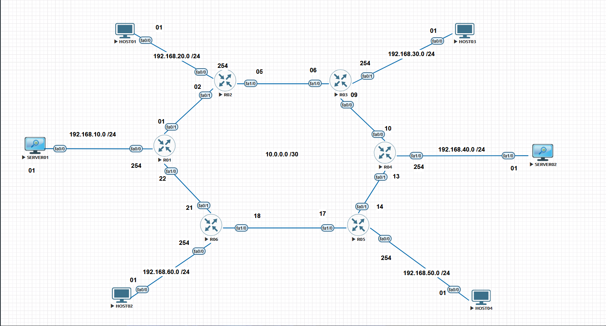
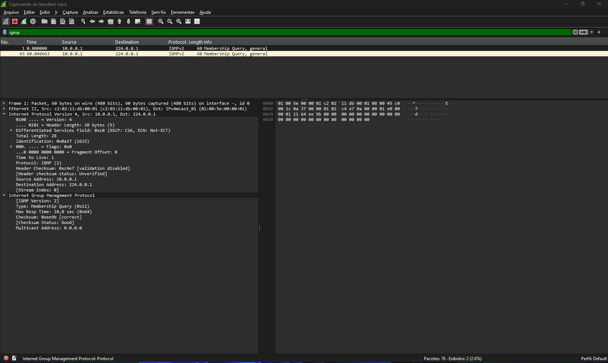

# Índice

- [Índice](#índice)
  - [12 - Exemplo Prático - Multicast Inter domínios com MSDP (Multicast Source Discovery Protocol) - Parte 02](#12---exemplo-prático---multicast-inter-domínios-com-msdp-multicast-source-discovery-protocol---parte-02)
  - [🧾 Introdução](#-introdução)
  - [🌐 O problema: multicast além de um único domínio](#-o-problema-multicast-além-de-um-único-domínio)
  - [🔄 Onde o MSDP entra nessa arquitetura](#-onde-o-msdp-entra-nessa-arquitetura)
  - [🎯 Escopo deste laboratório](#-escopo-deste-laboratório)
  - [🎯 Objetivo do Laboratório](#-objetivo-do-laboratório)
  - [📚 O que você vai aprender](#-o-que-você-vai-aprender)
    - [💼 Relevância prática](#-relevância-prática)
  - [🧠 Explicação do Cenário](#-explicação-do-cenário)
  - [🌐 Multicast em múltiplos domínios com PIM-SM](#-multicast-em-múltiplos-domínios-com-pim-sm)
  - [🔄 O papel do MSDP no cenário](#-o-papel-do-msdp-no-cenário)
  - [🧩 1️⃣ Fontes e Receptores no Cenário](#-1️⃣-fontes-e-receptores-no-cenário)
    - [🧭 Estrutura do Roteamento](#-estrutura-do-roteamento)
    - [📡 Grupos Multicast no cenário com MSDP](#-grupos-multicast-no-cenário-com-msdp)
    - [🧩 Conclusão](#-conclusão)
    - [🛰️ O que muda ao introduzir o MSDP no ambiente multicast](#️-o-que-muda-ao-introduzir-o-msdp-no-ambiente-multicast)
      - [🔹 1️⃣ O papel do IGMP em ambientes com MSDP](#-1️⃣-o-papel-do-igmp-em-ambientes-com-msdp)
      - [🔀 2️⃣ MSDP e a troca de informações entre RPs](#-2️⃣-msdp-e-a-troca-de-informações-entre-rps)
      - [🛰️ 3️⃣ Quando as fontes começam a transmitir](#️-3️⃣-quando-as-fontes-começam-a-transmitir)
      - [📡 4️⃣ Vantagens do PIM-SM com MSDP](#-4️⃣-vantagens-do-pim-sm-com-msdp)
  - [🌐 Topologia do Laboratório](#-topologia-do-laboratório)
    - [🖼️ Topologia Lógica – Domínios Multicast e RPs](#️-topologia-lógica--domínios-multicast-e-rps)
    - [🔧 Endereçamento e Funções](#-endereçamento-e-funções)
    - [📡 Grupos Multicast no cenário com MSDP – resumo](#-grupos-multicast-no-cenário-com-msdp--resumo)
    - [🧭 Resumo da Lógica](#-resumo-da-lógica)
  - [🧠 O que é um Domínio Multicast?](#-o-que-é-um-domínio-multicast)
    - [🔹 Um grupo multicast pode existir em mais de um domínio?](#-um-grupo-multicast-pode-existir-em-mais-de-um-domínio)
    - [🔹 O que acontece sem MSDP?](#-o-que-acontece-sem-msdp)
    - [🔹 Onde o MSDP entra nesse modelo?](#-onde-o-msdp-entra-nesse-modelo)
    - [🧠 Decisão de Design: Dois Domínios Multicast e RPs Distribuídos](#-decisão-de-design-dois-domínios-multicast-e-rps-distribuídos)
      - [🔹 Por que dois domínios multicast?](#-por-que-dois-domínios-multicast)
      - [🔹 Justificativa da escolha dos RPs](#-justificativa-da-escolha-dos-rps)
      - [🔹 Benefício didático da abordagem](#-benefício-didático-da-abordagem)
    - [🔍 Testes Preliminares](#-testes-preliminares)
  - [🚀 Ativação do Roteamento Multicast](#-ativação-do-roteamento-multicast)
  - [🌐 Papel do PIM Sparse Mode no Contexto do MSDP](#-papel-do-pim-sparse-mode-no-contexto-do-msdp)
  - [🔄 PIM-SM Tradicional vs PIM-SM com MSDP](#-pim-sm-tradicional-vs-pim-sm-com-msdp)
  - [🌍 Onde o PIM Deve Ser Ativado](#-onde-o-pim-deve-ser-ativado)
    - [✅ Interfaces onde o PIM-SM deve ser ativado](#-interfaces-onde-o-pim-sm-deve-ser-ativado)
    - [💡 Observação Sobre as Fontes Multicast (PIM-SM + MSDP)](#-observação-sobre-as-fontes-multicast-pim-sm--msdp)
    - [🔄 O que acontece no roteador (Designated Router – DR)](#-o-que-acontece-no-roteador-designated-router--dr)
    - [🌳 Construção da Árvore Multicast Inter-domínio](#-construção-da-árvore-multicast-inter-domínio)
    - [🧩 Vantagens Técnicas do MSDP](#-vantagens-técnicas-do-msdp)
    - [📊 Matriz de Comportamento: Host vs. Fontes (Inter-domínio)](#-matriz-de-comportamento-host-vs-fontes-inter-domínio)
    - [⚙️ Nosso cenário Multicast MSDP](#️-nosso-cenário-multicast-msdp)
    - [🔁 Funcionamento Geral do MSDP](#-funcionamento-geral-do-msdp)
    - [🧱 No nosso laboratório](#-no-nosso-laboratório)
  - [⚙️ Ativando o Roteamento Multicast](#️-ativando-o-roteamento-multicast)
    - [✅ Verificação do Roteamento Multicast](#-verificação-do-roteamento-multicast)
    - [📊 Tabela de Rotas Multicast (Estado Inicial)](#-tabela-de-rotas-multicast-estado-inicial)
    - [⚙️ Ativando o PIM Sparse Mode (PIM-SM)](#️-ativando-o-pim-sparse-mode-pim-sm)
    - [🔧 Onde o PIM Sparse Mode Deve Ser Ativado](#-onde-o-pim-sparse-mode-deve-ser-ativado)
  - [🧩 Eleição do Designated Router (DR) no PIM Sparse Mode](#-eleição-do-designated-router-dr-no-pim-sparse-mode)
    - [⚙️ Critérios de eleição do DR](#️-critérios-de-eleição-do-dr)
  - [💬 Mensagens PIM Hello no PIM Sparse Mode](#-mensagens-pim-hello-no-pim-sparse-mode)
    - [⚙️ Funções principais das mensagens Hello](#️-funções-principais-das-mensagens-hello)
    - [🧩 Estrutura simplificada da mensagem PIM Hello](#-estrutura-simplificada-da-mensagem-pim-hello)
  - [🔍 Exemplo de log da eleição do DR](#-exemplo-de-log-da-eleição-do-dr)
  - [🧭 Papel do DR no Contexto do MSDP](#-papel-do-dr-no-contexto-do-msdp)
  - [🧪 Identificação do Designated Router (DR) no Domínio PIM-SM](#-identificação-do-designated-router-dr-no-domínio-pim-sm)
  - [⚙️ Como o DR é eleito neste estágio](#️-como-o-dr-é-eleito-neste-estágio)
  - [🔍 Comandos para identificar o DR](#-comandos-para-identificar-o-dr)
    - [0️⃣ Verificar em quais interfaces o PIM está ativo](#0️⃣-verificar-em-quais-interfaces-o-pim-está-ativo)
    - [1️⃣ Verificar a vizinhança PIM](#1️⃣-verificar-a-vizinhança-pim)
    - [2️⃣ Verificar logs de eleição do DR em tempo real](#2️⃣-verificar-logs-de-eleição-do-dr-em-tempo-real)
    - [3️⃣ Confirmar a interface LAN envolvida](#3️⃣-confirmar-a-interface-lan-envolvida)
  - [✅ Conclusão deste estágio do laboratório](#-conclusão-deste-estágio-do-laboratório)
  - [🧭 Conexão com o próximo estágio](#-conexão-com-o-próximo-estágio)
  - [🔄 Transição para Multicast com Múltiplos Domínios (PIM-SM + MSDP)](#-transição-para-multicast-com-múltiplos-domínios-pim-sm--msdp)
    - [🎯 O que muda a partir da configuração dos RPs](#-o-que-muda-a-partir-da-configuração-dos-rps)
    - [🧭 Próximo passo: interconexão entre domínios](#-próximo-passo-interconexão-entre-domínios)
    - [🧠 3️⃣ Designated Router (DR) no PIM Sparse Mode](#-3️⃣-designated-router-dr-no-pim-sparse-mode)
    - [📊 Papel do DR no PIM Sparse Mode](#-papel-do-dr-no-pim-sparse-mode)
  - [🧭 Introdução de Múltiplos RPs — Criação de Domínios Multicast](#-introdução-de-múltiplos-rps--criação-de-domínios-multicast)
  - [🧩 4️⃣ Configuração dos Rendezvous Points (RPs)](#-4️⃣-configuração-dos-rendezvous-points-rps)
    - [📍 Domínio Multicast 1](#-domínio-multicast-1)
    - [📍 Domínio Multicast 2](#-domínio-multicast-2)
    - [🔧 Configuração do RP no R01](#-configuração-do-rp-no-r01)
    - [🔧 Configuração do RP no R04](#-configuração-do-rp-no-r04)
  - [📍 Definição dos RPs por Domínio Multicast](#-definição-dos-rps-por-domínio-multicast)
    - [🟦 Domínio Multicast A](#-domínio-multicast-a)
    - [🟩 Domínio Multicast B](#-domínio-multicast-b)
    - [📋 Associação de RPs nos roteadores](#-associação-de-rps-nos-roteadores)
  - [Validação do Isolamento entre Domínios Multicast (Pré-MSDP)](#validação-do-isolamento-entre-domínios-multicast-pré-msdp)
    - [📌 Preparação: Simulação de Receptores via IGMP](#-preparação-simulação-de-receptores-via-igmp)
    - [📋 Interfaces configuradas com IGMP Join](#-interfaces-configuradas-com-igmp-join)
    - [Resultados esperados:](#resultados-esperados)
    - [🎯 Objetivo Didático do Passo](#-objetivo-didático-do-passo)
  - [⚠️ Observação Importante — Log `%MROUTE-3-NO_PIM_NBR` durante a convergência](#️-observação-importante--log-mroute-3-no_pim_nbr-durante-a-convergência)
  - [🧠 Interpretação correta do log](#-interpretação-correta-do-log)
  - [🎯 Ponto didático essencial](#-ponto-didático-essencial)
  - [⚠️ Observação Importante2 — Log `%PIM-6-INVALID_RP_JOIN`](#️-observação-importante2--log-pim-6-invalid_rp_join)
  - [🧠 O que esse log realmente significa](#-o-que-esse-log-realmente-significa)
    - [🔀 Por que o log aparece em um roteador e não em outro?](#-por-que-o-log-aparece-em-um-roteador-e-não-em-outro)
  - [🎯 Ponto didático fundamental](#-ponto-didático-fundamental)
    - [Exemplo no nosso Laboratório](#exemplo-no-nosso-laboratório)
  - [1️⃣ Validação do Tráfego Multicast por Domínio (Pré-MSDP)](#1️⃣-validação-do-tráfego-multicast-por-domínio-pré-msdp)
  - [2️⃣ Geração de Tráfego Multicast no Domínio A](#2️⃣-geração-de-tráfego-multicast-no-domínio-a)
  - [3️⃣ Validação da Recepção nos Receptores do Domínio A](#3️⃣-validação-da-recepção-nos-receptores-do-domínio-a)
  - [4️⃣ Confirmação do Isolamento do Domínio B](#4️⃣-confirmação-do-isolamento-do-domínio-b)
  - [5️⃣ Análise via Captura de Pacotes (Wireshark)](#5️⃣-análise-via-captura-de-pacotes-wireshark)
  - [6️⃣ Conclusão do Estágio Pré-MSDP](#6️⃣-conclusão-do-estágio-pré-msdp)
  - [Mudanças no Plano de Controle Multicast — Introdução ao MSDP](#mudanças-no-plano-de-controle-multicast--introdução-ao-msdp)
  - [🔄 Limitação do Modelo Atual (Sem MSDP)](#-limitação-do-modelo-atual-sem-msdp)
  - [🧠 Papel do MSDP no Plano de Controle Multicast](#-papel-do-msdp-no-plano-de-controle-multicast)
  - [🔗 Relação entre MSDP e PIM](#-relação-entre-msdp-e-pim)
  - [🔍 Observação do Estado do LAB (Pré-MSDP)](#-observação-do-estado-do-lab-pré-msdp)
  - [🚦 Ponto de Controle do Laboratório](#-ponto-de-controle-do-laboratório)
  - [Próxima Etapa — Configuração do MSDP](#próxima-etapa--configuração-do-msdp)
  - [Configuração do MSDP — Interligando os Domínios Multicast](#configuração-do-msdp--interligando-os-domínios-multicast)
  - [🧠 Visão Lógica do MSDP no LAB](#-visão-lógica-do-msdp-no-lab)
  - [⚙️ Configuração Básica do MSDP](#️-configuração-básica-do-msdp)
    - [📌 Configuração no RP do Domínio Multicast A (R02)](#-configuração-no-rp-do-domínio-multicast-a-r02)
    - [📌 Configuração no RP do Domínio Multicast B (R05)](#-configuração-no-rp-do-domínio-multicast-b-r05)
    - [🔍 Validação da Sessão MSDP](#-validação-da-sessão-msdp)
  - [📡 Geração de Tráfego Multicast (Fonte Ativa)](#-geração-de-tráfego-multicast-fonte-ativa)
  - [🔎 Validação da Descoberta de Fontes via MSDP](#-validação-da-descoberta-de-fontes-via-msdp)
    - [📥 Entrega do Tráfego Multicast entre Domínios](#-entrega-do-tráfego-multicast-entre-domínios)
    - [🧪 Comandos de Verificação Final](#-comandos-de-verificação-final)
    - [✅ Estado Final do Laboratório](#-estado-final-do-laboratório)
  - [📌 Comportamento Observado: Host03 não responde a pings interdomínio](#-comportamento-observado-host03-não-responde-a-pings-interdomínio)
  - [🧠 Análise Técnica do Comportamento](#-análise-técnica-do-comportamento)
  - [🔁 O que ocorre na prática entre os domínios](#-o-que-ocorre-na-prática-entre-os-domínios)
    - [🔹 Domínio A → Domínio B](#-domínio-a--domínio-b)
    - [🔹 Domínio B → Domínio A](#-domínio-b--domínio-a)
  - [🧩 Relação com o estado (\*,G) `stopped`](#-relação-com-o-estado-g-stopped)
  - [⚠️ Conclusão Técnica](#️-conclusão-técnica)
  - [🎯 Implicação de Arquitetura](#-implicação-de-arquitetura)
  - [🔍 Evidência do Sentido do Fluxo Multicast via RPF (Root Path Forwarding)](#-evidência-do-sentido-do-fluxo-multicast-via-rpf-root-path-forwarding)
  - [📌 Análise de RPF no R02](#-análise-de-rpf-no-r02)
    - [🔹 RPF em direção ao RP do Domínio A (2.2.2.2)](#-rpf-em-direção-ao-rp-do-domínio-a-2222)
    - [🔹 RPF em direção ao RP do Domínio B (5.5.5.5)](#-rpf-em-direção-ao-rp-do-domínio-b-5555)
    - [🚫 Impacto Direto no Host03](#-impacto-direto-no-host03)
    - [📌 Formalização da limitação do PIM Sparse Mode](#-formalização-da-limitação-do-pim-sparse-mode)
  - [Validar que o MSDP está funcional, mas não resolve o problema](#validar-que-o-msdp-está-funcional-mas-não-resolve-o-problema)
    - [MSDP operacional no plano de controle](#msdp-operacional-no-plano-de-controle)
    - [Mensagens SA (Source-Active) no contexto do MSDP](#mensagens-sa-source-active-no-contexto-do-msdp)
    - [Principais campos de uma mensagem SA](#principais-campos-de-uma-mensagem-sa)
    - [Captura das mensagens SA no Wireshark](#captura-das-mensagens-sa-no-wireshark)
    - [SA anunciadas corretamente, mas sem impacto no forwarding](#sa-anunciadas-corretamente-mas-sem-impacto-no-forwarding)
    - [O problema não é controle-plane, e sim data-plane / modelo de forwarding](#o-problema-não-é-controle-plane-e-sim-data-plane--modelo-de-forwarding)
  - [Fechamento da Parte 01 — Consolidação do Cenário](#fechamento-da-parte-01--consolidação-do-cenário)
  - [Transição para a Parte 02 — Evolução do Design](#transição-para-a-parte-02--evolução-do-design)
  - [Evolução do Design](#evolução-do-design)
  - [🛠️ Troubleshooting — PIM Sparse Mode + MSDP](#️-troubleshooting--pim-sparse-mode--msdp)
    - [Consideração final de troubleshooting](#consideração-final-de-troubleshooting)
  - [🧩 O que aprendemos com este laboratório (PIM Sparse Mode + MSDP)](#-o-que-aprendemos-com-este-laboratório-pim-sparse-mode--msdp)
  - [🎯 Principais aprendizados](#-principais-aprendizados)
  - [💡 Conclusões gerais](#-conclusões-gerais)
  - [🗺️ Fluxo conceitual do MSDP (PIM Sparse Mode)](#️-fluxo-conceitual-do-msdp-pim-sparse-mode)
  - [📘 Tabela de Comandos](#-tabela-de-comandos)
    - [🖥️ Função — R01 no plano de dados PIM Sparse Mode com RP fora do domínio local](#️-função--r01-no-plano-de-dados-pim-sparse-mode-com-rp-fora-do-domínio-local)
    - [📘 R02 — Rendezvous Point (RP) do Domínio Multicast A](#-r02--rendezvous-point-rp-do-domínio-multicast-a)
    - [📙 R03 — Roteador de Trânsito no Domínio Multicast (PIM Sparse Mode + MSDP)](#-r03--roteador-de-trânsito-no-domínio-multicast-pim-sparse-mode--msdp)
    - [📒 R04 — Roteador de Acesso aos Hosts + Roteador de Trânsito no Domínio Multicast (PIM Sparse Mode + MSDP)](#-r04--roteador-de-acesso-aos-hosts--roteador-de-trânsito-no-domínio-multicast-pim-sparse-mode--msdp)
    - [📕 R05 — Rendezvous Point (RP) do Domínio Multicast + Roteador de Trânsito (PIM Sparse Mode + MSDP)](#-r05--rendezvous-point-rp-do-domínio-multicast--roteador-de-trânsito-pim-sparse-mode--msdp)
    - [📗 R06 — Roteador de Acesso aos Hosts + Roteador de Trânsito (PIM Sparse Mode)](#-r06--roteador-de-acesso-aos-hosts--roteador-de-trânsito-pim-sparse-mode)
    - [🖥️ SERVER01 — Fonte Multicast no Domínio Multicast (PIM Sparse Mode + MSDP)](#️-server01--fonte-multicast-no-domínio-multicast-pim-sparse-mode--msdp)
    - [🖥️ SERVER02 — Fonte Multicast no Domínio Multicast (PIM Sparse Mode + MSDP)](#️-server02--fonte-multicast-no-domínio-multicast-pim-sparse-mode--msdp)
    - [💻 HOST01 — Receptor Multicast no Domínio Multicast (PIM Sparse Mode + MSDP)](#-host01--receptor-multicast-no-domínio-multicast-pim-sparse-mode--msdp)
    - [💻 HOST02 — Receptor Multicast no Domínio Multicast (PIM Sparse Mode + MSDP)](#-host02--receptor-multicast-no-domínio-multicast-pim-sparse-mode--msdp)
    - [💻 HOST03 — Receptor Multicast no Domínio Multicast (PIM Sparse Mode + MSDP)](#-host03--receptor-multicast-no-domínio-multicast-pim-sparse-mode--msdp)
    - [💻 HOST04 — Receptor Multicast no Domínio Multicast (PIM Sparse Mode + MSDP)](#-host04--receptor-multicast-no-domínio-multicast-pim-sparse-mode--msdp)
    - [🔚 Encerramento da Parte 01 e Transição para a Parte 02](#-encerramento-da-parte-01-e-transição-para-a-parte-02)

## 12 - Exemplo Prático - Multicast Inter domínios com MSDP (Multicast Source Discovery Protocol) - Parte 02

## 🧾 Introdução

Em ambientes corporativos de pequeno e médio porte, o multicast costuma operar de forma simples e previsível. Uma fonte envia tráfego para um grupo multicast, os receptores interessados se associam a esse grupo e o encaminhamento ocorre normalmente dentro de um único domínio multicast, geralmente controlado por um único Rendezvous Point (RP).  
  
À medida que a rede cresce, esse modelo passa a apresentar limitações. Organizações com múltiplos domínios administrativos, datacenters distribuídos ou redes segmentadas por requisitos operacionais frequentemente adotam RPs independentes em cada domínio multicast. Embora o multicast continue funcionando localmente em cada domínio, a descoberta de fontes multicast entre domínios distintos deixa de ocorrer de forma automática.  
  
Na prática, isso significa que uma aplicação multicast ativa em um domínio pode se tornar invisível para receptores localizados em outro, mesmo existindo conectividade IP plena entre as redes. Essa limitação não está relacionada ao transporte do tráfego multicast em si, mas à ausência de um mecanismo que permita a troca de informações sobre fontes multicast entre diferentes RPs.  
  
O Multicast Source Discovery Protocol (MSDP) foi projetado exatamente para resolver esse cenário. O MSDP permite que RPs pertencentes a domínios multicast distintos compartilhem informações sobre fontes multicast ativas, viabilizando a comunicação multicast entre domínios independentes, sem alterar o funcionamento interno do PIM Sparse Mode (PIM-SM).  
  
Este laboratório foi desenvolvido como parte do meu estudo para a certificação Cisco CCNP ENCOR (350-401) e tem como objetivo demonstrar, de forma prática, como o MSDP é utilizado para interconectar domínios multicast baseados em PIM-SM, refletindo situações reais encontradas em redes corporativas distribuídas.  
  
---
  
## 🌐 O problema: multicast além de um único domínio

Dentro de um único domínio multicast, o PIM-SM utiliza o RP como ponto central para a descoberta inicial de fontes e a construção das árvores multicast. Esse modelo funciona de forma eficiente enquanto todos os roteadores participantes compartilham o mesmo RP.  
  
Entretanto, quando diferentes partes da rede utilizam RPs distintos, cada domínio multicast passa a operar de forma isolada. Fontes multicast registradas em um domínio não são automaticamente conhecidas por RPs de outros domínios, impedindo que receptores remotos descubram e recebam esse tráfego.  
  
Esse tipo de cenário é comum em ambientes corporativos reais, especialmente em redes distribuídas geograficamente, ambientes com múltiplos datacenters ou organizações que segmentam suas redes por critérios administrativos ou de segurança.  

---

## 🔄 Onde o MSDP entra nessa arquitetura

O MSDP atua como um mecanismo de intercâmbio de informações entre RPs pertencentes a domínios multicast distintos. Por meio do estabelecimento de sessões MSDP, os RPs passam a trocar mensagens de anúncio de fontes multicast, conhecidas como Source-Active (SA).  
  
É importante destacar que o MSDP não transporta tráfego multicast. Seu papel é exclusivamente informativo: ele permite que um RP saiba da existência de fontes multicast em outros domínios. A partir dessa informação, o próprio PIM-SM se encarrega de estabelecer os fluxos multicast necessários para atender os receptores interessados.  
  
Dessa forma, o MSDP viabiliza a comunicação multicast inter-domínios mantendo a independência operacional de cada domínio multicast e preservando a arquitetura baseada em RPs locais.

---

## 🎯 Escopo deste laboratório

Este laboratório simula um ambiente multicast composto por múltiplos domínios PIM-SM interconectados por meio do MSDP, com foco nos seguintes aspectos:

- Separação lógica de domínios multicast, cada um com seu próprio RP;
- Estabelecimento de sessões MSDP entre RPs de domínios distintos;
- Descoberta de fontes multicast remotas por meio de mensagens SA;
- Distribuição de tráfego multicast entre domínios independentes;
- Validação operacional do funcionamento do MSDP e do PIM-SM em conjunto.

O cenário foi mantido intencionalmente simples para facilitar o entendimento do fluxo de controle e de dados, sem perder aderência a situações encontradas em ambientes corporativos reais.

---

## 🎯 Objetivo do Laboratório

O objetivo deste laboratório é compreender como o Multicast Source Discovery Protocol (MSDP) permite a comunicação multicast entre domínios PIM-SM distintos, preservando a autonomia de cada domínio multicast e seus respectivos RPs.

Durante os testes, serão observados:

- O comportamento do PIM-SM dentro de cada domínio multicast;
- O papel do RP como fronteira lógica do domínio multicast;
- O funcionamento das sessões MSDP entre RPs;
- O processo de anúncio e aprendizado de fontes multicast remotas;
- A construção e validação dos fluxos multicast entre domínios distintos.

Com isso, o laboratório demonstra como o MSDP resolve limitações arquiteturais do multicast tradicional em ambientes distribuídos, mantendo previsibilidade, escalabilidade e clareza operacional.

---

## 📚 O que você vai aprender

- Como estruturar domínios multicast independentes utilizando PIM-SM;
- Como definir e validar RPs distintos em cada domínio multicast;
- Como configurar e verificar sessões MSDP entre RPs;
- Como analisar o processo de descoberta de fontes multicast inter-domínios;
- Como validar o encaminhamento multicast utilizando comandos de verificação do PIM e do MSDP;
- Como correlacionar decisões de design multicast com cenários reais de redes corporativas.

### 💼 Relevância prática

Em ambientes corporativos distribuídos, o multicast raramente se limita a um único domínio de rede. Organizações com múltiplos datacenters, redes segmentadas por critérios administrativos ou ambientes geograficamente dispersos frequentemente adotam **domínios multicast independentes**, cada um com seu próprio **Rendezvous Point (RP)**.  
  
Nesses cenários, embora o multicast funcione corretamente dentro de cada domínio PIM-SM, a **descoberta de fontes multicast entre domínios distintos não ocorre de forma automática**. Essa limitação impacta diretamente aplicações corporativas que dependem da distribuição eficiente de dados multicast entre diferentes partes da organização.  
  
O **Multicast Source Discovery Protocol (MSDP)** é amplamente utilizado nesses ambientes para viabilizar a comunicação multicast entre domínios independentes, permitindo que **RPs distintos compartilhem informações sobre fontes multicast ativas**, sem comprometer a autonomia operacional de cada domínio.  
  
Casos comuns de uso incluem:
  
- Ambientes corporativos com múltiplos datacenters
- Redes segmentadas por domínios administrativos
- Aplicações multicast distribuídas
- Infraestruturas legadas que utilizam PIM-SM com RPs distintos

---

## 🧠 Explicação do Cenário
  
O cenário deste laboratório já possui o roteamento unicast totalmente funcional por meio do **OSPF**, garantindo conectividade IP completa entre todas as sub-redes. Essa etapa é fundamental, pois o correto funcionamento do multicast depende diretamente da convergência do plano unicast.  
  
A topologia física em anel foi mantida propositalmente para demonstrar que a **separação de domínios multicast é lógica**, e não física. Embora todos os roteadores estejam interconectados, o ambiente foi segmentado em **dois domínios multicast independentes**, cada um com seu próprio RP.  
  

  
Neste laboratório, utilizamos cinco roteadores Cisco (R01 a R05), responsáveis pelo encaminhamento unicast e multicast, e um conjunto de hosts que representam **fontes e receptores multicast distribuídos em domínios distintos**.  
  
Os hosts são configurados exclusivamente com **endereçamento IP e IGMP (tipicamente IGMPv2)**, sem participação em protocolos de roteamento dinâmico, refletindo o comportamento esperado de dispositivos finais em ambientes multicast reais.  
  
Os roteadores intermediários executam **PIM Sparse Mode (PIM-SM)**, com **RPs estáticos distintos para cada domínio multicast**, e sessões **MSDP estabelecidas exclusivamente entre os RPs**, permitindo a troca de informações sobre fontes multicast ativas entre os domínios.  
  
---
  
## 🌐 Multicast em múltiplos domínios com PIM-SM
  
Dentro de cada domínio multicast, o **PIM Sparse Mode (PIM-SM)** opera de forma tradicional, utilizando o RP como ponto central para a descoberta inicial de fontes multicast e a construção das árvores multicast.  
  
Cada domínio multicast mantém sua própria lógica de controle, incluindo:  
  
- RP dedicado;
- Processos independentes de registro de fontes;  
- Construção local das árvores multicast (*,G) e (S,G).
  
Sem o uso do MSDP, esses domínios operariam de forma isolada, impossibilitando que receptores de um domínio descubram fontes multicast localizadas em outro.  
  
---

## 🔄 O papel do MSDP no cenário

O **MSDP** atua como um mecanismo de intercâmbio de informações entre os **Rendezvous Points (RPs)** de domínios multicast distintos. Por meio de sessões MSDP, os RPs trocam mensagens **Source-Active (SA)**, informando a existência de fontes multicast ativas em seus respectivos domínios.
  
É importante destacar que:
  
- O MSDP **não transporta tráfego multicast**;
- O tráfego multicast continua sendo encaminhado diretamente pelos mecanismos do PIM-SM;
- O MSDP atua exclusivamente no **plano de controle**, viabilizando a descoberta de fontes remotas.
  
A partir das informações recebidas via MSDP, cada RP passa a conhecer fontes multicast externas ao seu domínio, permitindo que os receptores locais estabeleçam os fluxos multicast necessários.  
  
---
  
## 🧩 1️⃣ Fontes e Receptores no Cenário

Neste cenário, as **fontes e receptores multicast estão distribuídos em domínios multicast distintos**, caracterizando um ambiente típico de **multicast inter-domínios com MSDP**.  
  
Cada fonte é registrada localmente em seu domínio multicast, enquanto os receptores utilizam **IGMP** para expressar interesse em grupos multicast. A descoberta das fontes remotas ocorre por meio da troca de mensagens **SA** entre os RPs.  

| Função         | Dispositivo | Rede/Sub-rede   | Interface | Endereço IP     | Descrição                                                   |
|----------------|-------------|-----------------|-----------|-----------------|-------------------------------------------------------------|
| **Fonte 1**    | SERVER01    | 192.168.10.0/24 | fa0/0     | 192.168.10.1    | Fonte multicast localizada no Domínio 01                    |
| **Fonte 2**    | SERVER02    | 192.168.40.0/24 | fa0/0     | 192.168.40.1    | Fonte multicast localizada no Domínio 02                    |
| **Receptor 1** | HOST02      | 192.168.20.0/24 | fa0/0     | 192.168.20.1    | Receptor multicast no Domínio 01                            |
| **Receptor 2** | HOST03      | 192.168.60.0/24 | fa0/0     | 192.168.60.1    | Receptor multicast no Domínio 01                            |
| **Receptor 3** | HOST04      | 192.168.30.0/24 | fa0/0     | 192.168.30.1    | Receptor multicast no Domínio 02                            |
| **Receptor 4** | HOST05      | 192.168.50.0/24 | fa0/0     | 192.168.50.1    | Receptor multicast no Domínio 02                            |

### 🧭 Estrutura do Roteamento

Todos os roteadores (**R01 a R05**) participam de uma **única área OSPF (Área 0)**, garantindo conectividade unicast completa antes da ativação do multicast.  
  
Essa etapa é proposital e fundamental, pois tanto o **PIM Sparse Mode (PIM-SM)** quanto o **MSDP** dependem diretamente do roteamento unicast para:  
  
- Cálculo correto do **RPF (Reverse Path Forwarding)**;
- Encaminhamento eficiente do tráfego multicast;
- Estabelecimento e manutenção das **sessões MSDP entre os RPs**;
- Convergência previsível em cenários de falha.
  
Neste laboratório, o OSPF fornece a base estável sobre a qual o controle multicast é construído, refletindo práticas comuns em ambientes corporativos reais.  
  
| Link Ponto-a-Ponto | Rede / Máscara | Interface Local | Interface Remota |
|--------------------|----------------|-----------------|------------------|
| R01 – R02          | 10.0.0.0/30    | Fa0/1 (R01)     | Fa0/1 (R02)      |
| R02 – R03          | 10.0.0.4/30    | Fa1/0 (R02)     | Fa1/0 (R03)      |
| R03 – R04          | 10.0.0.8/30    | Fa0/0 (R03)     | Fa0/0 (R04)      |
| R04 – R05          | 10.0.0.12/30   | Fa0/1 (R04)     | Fa0/1 (R05)      |
| R05 – R06          | 10.0.0.16/30   | Fa1/0 (R05)     | Fa1/0 (R06)      |
| R06 – R01          | 10.0.0.20/30   | Fa1/0 (R06)     | Fa1/0 (R01)      |

---

### 📡 Grupos Multicast no cenário com MSDP

Neste laboratório, os grupos multicast são utilizados em um **ambiente PIM Sparse Mode tradicional**, com **Rendezvous Points distintos por domínio multicast**.  
  
Cada domínio mantém seu próprio controle multicast local, enquanto o **MSDP permite a descoberta de fontes multicast remotas**, sem a necessidade de um RP único para toda a rede.  

| Grupo Multicast | Modelo PIM    | Comportamento Esperado                                                                                             |
|-----------------|---------------|--------------------------------------------------------------------------------------------------------------------|
| 239.1.1.1       | (*,G) / (S,G) | Registro inicial no RP local, descoberta de fontes remotas via MSDP e criação de estados (S,G) conforme necessário |

Nesse modelo, o estado multicast pode evoluir de (*,G) para (S,G), dependendo do fluxo, da topologia e do comportamento da rede, refletindo o funcionamento clássico do PIM-SM em ambientes corporativos.  

---

### 🧩 Conclusão

Este laboratório demonstra como o **MSDP complementa o PIM Sparse Mode** em ambientes com **múltiplos domínios multicast independentes**, permitindo que fontes localizadas em diferentes partes da rede sejam descobertas sem comprometer a autonomia de cada domínio.  
  
A separação lógica de domínios multicast, aliada à troca controlada de informações entre RPs, oferece uma solução escalável e amplamente adotada em redes corporativas de médio e grande porte, especialmente em cenários com múltiplos datacenters ou segmentação administrativa.  
  
---

### 🛰️ O que muda ao introduzir o MSDP no ambiente multicast

#### 🔹 1️⃣ O papel do IGMP em ambientes com MSDP

Os hosts continuam utilizando **IGMP (tipicamente IGMPv2)** exclusivamente para **expressar interesse em grupos multicast (G)**.  

Do ponto de vista do host:  

- Não há conhecimento de domínios multicast;
- Não há interação direta com MSDP;
- O comportamento é idêntico a um ambiente PIM-SM tradicional.
  
Toda a complexidade associada à descoberta de fontes remotas é tratada no **plano de controle dos roteadores**, de forma transparente para os dispositivos finais.  

---

#### 🔀 2️⃣ MSDP e a troca de informações entre RPs

O **MSDP** estabelece sessões TCP entre **Rendezvous Points de domínios multicast distintos**, permitindo a troca de mensagens **Source-Active (SA)**.  

Essas mensagens informam:

- Qual fonte multicast está ativa;
- Para qual grupo multicast ela transmite;
- Em qual domínio multicast essa fonte se encontra.

Com base nessas informações, cada RP pode iniciar os processos necessários para permitir que receptores locais recebam tráfego multicast proveniente de fontes remotas.  

---

#### 🛰️ 3️⃣ Quando as fontes começam a transmitir

Quando uma fonte multicast inicia a transmissão em seu domínio local:  

- O tráfego é inicialmente registrado no **RP local**;
- O RP anuncia a existência dessa fonte aos demais RPs por meio de **mensagens SA do MSDP**;
- Receptores em outros domínios passam a conhecer a fonte e podem construir os fluxos multicast necessários utilizando o PIM-SM.

É importante destacar que o **tráfego multicast em si não atravessa as sessões MSDP**. Apenas informações de controle são trocadas entre os RPs.

---

#### 📡 4️⃣ Vantagens do PIM-SM com MSDP

| Aspecto                     | PIM-SM sem MSDP              | PIM-SM com MSDP                  |
|-----------------------------|------------------------------|----------------------------------|
| Descoberta de fontes remotas| ❌ Não                       | ✅ Sim                          |
| Domínios multicast          | Único                        | Múltiplos domínios independentes |
| Dependência de RP único     | Alta                         | Reduzida                         |
| Escalabilidade              | Limitada em redes grandes    | Alta                             |
| Uso em múltiplos datacenters| Pouco flexível               | Amplamente utilizado             |
| Plano de controle           | Local                        | Distribuído entre RPs            |

---

👉 **Resumo:**  
O uso do **MSDP** permite que redes multicast baseadas em **PIM Sparse Mode** evoluam para arquiteturas **distribuídas e escaláveis**, sem exigir a centralização total do controle multicast.  
Essa abordagem é especialmente relevante em ambientes corporativos reais, onde autonomia, previsibilidade e interoperabilidade são fatores decisivos de design.  

## 🌐 Topologia do Laboratório

Este laboratório simula um cenário enterprise de multicast baseado em **múltiplos domínios multicast independentes**, arquitetura comum em ambientes corporativos com **segmentação administrativa**, **múltiplos datacenters** ou **crescimento orgânico da rede**.  
  
O objetivo é demonstrar, de forma prática e progressiva, o funcionamento do **PIM Sparse Mode (PIM-SM)** em conjunto com o **Multicast Source Discovery Protocol (MSDP)**, evidenciando:  
  
- A separação lógica de **domínios multicast**;
- O papel do **Rendezvous Point (RP)** em cada domínio;
- A troca de informações de fontes multicast entre domínios via **MSDP**.
  
A topologia deste laboratório é composta por **seis roteadores principais (R01 a R06)** e **seis hosts simulados (Server01, Server02, Host01, Host02, Host03 e Host04)**.  
Os hosts são roteadores Cisco configurados de forma simplificada, apenas com **endereçamento IP** e **participação em grupos multicast via IGMP (tipicamente IGMPv2)**, simulando o comportamento de dispositivos finais em ambientes reais.  
  
O protocolo **OSPF** garante a conectividade unicast entre todos os roteadores, enquanto o **PIM Sparse Mode (PIM-SM)** é utilizado para o roteamento multicast dentro de cada domínio.  
O **MSDP** é empregado para permitir que **fontes multicast localizadas em um domínio sejam descobertas por outros domínios**, sem a necessidade de um RP único para toda a rede.  
  
Neste modelo, cada domínio multicast mantém sua própria árvore compartilhada (*,G), enquanto o MSDP atua exclusivamente no **plano de controle**, trocando informações sobre fontes ativas entre os RPs.  
  
---
  
### 🖼️ Topologia Lógica – Domínios Multicast e RPs
  
A figura abaixo representa a **topologia lógica multicast**, destacando:
  
- A divisão da rede em **domínios multicast distintos**;
- O **Rendezvous Point (RP)** de cada domínio;
- As **sessões MSDP** estabelecidas entre os RPs.
  
> 📌 Esta visão lógica é essencial para compreender o papel do MSDP e a separação entre o plano de dados multicast e o plano de controle.
  
<!-- Inserir imagem da topologia lógica multicast com domínios e RPs -->

  
  ---

### 🔧 Endereçamento e Funções

| **Dispositivo** | **Interface** | **Endereço IP / Máscara** | **Conexão / Função**                                      |
|-----------------|---------------|---------------------------|-----------------------------------------------------------|
| **R01**         | Loopback0     | 1.1.1.1 /32               | Router-ID OSPF                                            |
|                 | Fa0/0         | 192.168.10.254 /24        | LAN do Server01 — Gateway multicast                       |
|                 | Fa0/1         | 10.0.0.1 /30              | Link com R02 — PIM-SM + OSPF                              |
|                 | Fa1/0         | 10.0.0.22 /30             | Link com R06 — PIM-SM + OSPF                              |
| **R02**         | Loopback0     | 2.2.2.2 /32               | Router-ID OSPF / RP do Domínio Multicast A                |
|                 | Fa0/0         | 192.168.20.254 /24        | LAN do Host01 — Gateway multicast                         |
|                 | Fa0/1         | 10.0.0.2 /30              | Link com R01 — PIM-SM + OSPF                              |
|                 | Fa1/0         | 10.0.0.5 /30              | Link com R03 — PIM-SM + OSPF                              |
| **R03**         | Loopback0     | 3.3.3.3 /32               | Router-ID OSPF                                            |
|                 | Fa1/0         | 10.0.0.6 /30              | Link com R02 — PIM-SM + OSPF                              |
|                 | Fa0/1         | 192.168.30.254 /24        | LAN do Host03 — Gateway multicast                         |
|                 | Fa0/0         | 10.0.0.9 /30              | Link com R04 — PIM-SM + OSPF                              |
| **R04**         | Loopback0     | 4.4.4.4 /32               | Router-ID OSPF                                            |
|                 | Fa0/0         | 10.0.0.10 /30             | Link com R03 — PIM-SM + OSPF                              |
|                 | Fa1/0         | 192.168.40.254 /24        | LAN do Server02 — Gateway multicast                       |
|                 | Fa0/1         | 10.0.0.13 /30             | Link com R05 — PIM-SM + OSPF                              |
| **R05**         | Loopback0     | 5.5.5.5 /32               | Router-ID OSPF / RP do Domínio Multicast B                |
|                 | Fa0/0         | 192.168.50.254 /24        | LAN do Host04 — Gateway multicast                         |
|                 | Fa0/1         | 10.0.0.14 /30             | Link com R04 — PIM-SM + OSPF                              |
|                 | Fa1/0         | 10.0.0.17 /30             | Link com R06 — PIM-SM + OSPF                              |
| **R06**         | Loopback0     | 6.6.6.6 /32               | Router-ID OSPF                                            |
|                 | Fa0/0         | 192.168.60.254 /24        | LAN do Host02 — Gateway multicast                         |
|                 | Fa0/1         | 10.0.0.21 /30             | Link com R01 — PIM-SM + OSPF                              |
|                 | Fa1/0         | 10.0.0.18 /30             | Link com R05 — PIM-SM + OSPF                              |
| **Server01**    | Fa0/0         | 192.168.10.1 /24          | Fonte multicast — Domínio Multicast A                     |
| **Server02**    | Fa0/0         | 192.168.40.1 /24          | Fonte multicast — Domínio Multicast B                     |
| **Host01**      | Fa0/0         | 192.168.20.1 /24          | Receptor multicast via IGMP (*,G)                         |
| **Host02**      | Fa0/0         | 192.168.60.1 /24          | Receptor multicast via IGMP (*,G)                         |
| **Host03**      | Fa0/0         | 192.168.30.1 /24          | Receptor multicast via IGMP (*,G)                         |
| **Host04**      | Fa0/0         | 192.168.50.1 /24          | Receptor multicast via IGMP (*,G)                         |

---

### 📡 Grupos Multicast no cenário com MSDP – resumo

Neste laboratório, os grupos multicast utilizam o **modelo clássico do PIM Sparse Mode**, com evolução dinâmica do estado multicast conforme o fluxo de tráfego.

| Grupo Multicast | Modelo           | Descrição                                                             |
|-----------------|------------------|-----------------------------------------------------------------------|
| 239.1.1.1       | (*,G) → (S,G)    | Registro no RP local e descoberta de fontes remotas via MSDP          |

📌 **Observações importantes:**

- Não é utilizado SSM (232/8);
- O tráfego multicast é inicialmente associado à árvore compartilhada (*,G);
- Estados (S,G) podem ser criados conforme o fluxo e o comportamento da rede;
- O MSDP é utilizado apenas para **descoberta de fontes**, não para transporte de dados;
- O RP atua como ponto de controle inicial do domínio multicast.

---

### 🧭 Resumo da Lógica

- O **Server01 (192.168.10.1)** atua como **fonte multicast** no **Domínio Multicast A**, enviando tráfego para o grupo **239.1.1.1**.
- O **Server02 (192.168.40.1)** atua como **fonte multicast** no **Domínio Multicast B**, utilizando o mesmo grupo multicast.
- O **Host01 (192.168.20.1)** participa do domínio multicast por meio de **IGMP (*,G)**.
- Os **Host02 (192.168.60.1)**, **Host03 (192.168.30.1)** e **Host04 (192.168.50.1)** também se inscrevem no grupo multicast utilizando **IGMP (*,G)**.
- O **R01** atua como **Rendezvous Point (RP)** do **Domínio Multicast A**.
- O **R05** atua como **Rendezvous Point (RP)** do **Domínio Multicast B**.
- Os RPs estabelecem **sessões MSDP**, permitindo a **troca de informações sobre fontes multicast ativas** entre os domínios.
- O tráfego multicast é encaminhado via **PIM Sparse Mode (PIM-SM)** dentro de cada domínio, com validação **RPF baseada na tabela unicast aprendida via OSPF**.

Dessa forma, o laboratório demonstra como o **MSDP permite a interconexão de múltiplos domínios multicast independentes**, mantendo a autonomia de cada domínio e possibilitando a comunicação multicast entre **fontes e receptores distribuídos**, sem a necessidade de um RP global.

## 🧠 O que é um Domínio Multicast?

Antes de avançar para a configuração do MSDP, é importante esclarecer um conceito fundamental que costuma gerar confusão: **o que exatamente é um domínio multicast**.

Um **domínio multicast** não é definido por uma sub-rede, por uma área de roteamento ou por um trecho físico da topologia.  
Na prática, um domínio multicast é composto por **todos os roteadores que compartilham a mesma visão de fontes multicast**, controlada por um **Rendezvous Point (RP)** comum.

Em outras palavras, pertencem ao mesmo domínio multicast os roteadores que:

- Utilizam o **mesmo RP** para um determinado conjunto de grupos multicast;
- Constroem árvores multicast baseadas nesse RP;
- Possuem conhecimento apenas das fontes aprendidas **localmente** dentro desse domínio.

Cada domínio multicast opera de forma **independente**, mesmo que exista conectividade IP plena entre eles.

---

### 🔹 Um grupo multicast pode existir em mais de um domínio?

Sim — e isso é **normal e esperado** em cenários reais.

O **endereço do grupo multicast (G)**, como por exemplo **239.1.1.1**, é apenas um identificador lógico.  
Ele **não pertence a um domínio específico**.

Isso significa que:

- O mesmo grupo multicast pode existir em **múltiplos domínios multicast**;
- Cada domínio pode ter **suas próprias fontes** transmitindo para esse grupo;
- Sem um mecanismo de interconexão, os domínios **não compartilham informações sobre essas fontes**.

No contexto deste laboratório, tanto o **Domínio Multicast A** quanto o **Domínio Multicast B** utilizam o **mesmo grupo multicast**, porém com **RPs distintos** e **fontes independentes**.

---

### 🔹 O que acontece sem MSDP?

Sem o MSDP:

- Cada RP conhece apenas as fontes **do seu próprio domínio**;
- Receptores de um domínio **não recebem tráfego** de fontes localizadas em outro;
- O multicast funciona localmente, mas **não de forma inter-domínio**.

Essa limitação não está relacionada ao PIM em si, mas à **ausência de troca de informações entre RPs**.

---

### 🔹 Onde o MSDP entra nesse modelo?

O **Multicast Source Discovery Protocol (MSDP)** é o mecanismo que permite que **RPs de domínios distintos compartilhem informações sobre fontes multicast ativas**.

Com o MSDP:

- Os RPs trocam mensagens **Source-Active (SA)**;
- Cada domínio passa a conhecer fontes ativas de outros domínios;
- Os receptores podem receber tráfego multicast **independentemente do domínio onde a fonte está localizada**.

O MSDP **não transporta tráfego multicast** e **não unifica os domínios**.  
Ele atua exclusivamente no **plano de controle**, permitindo que o PIM-SM funcione de forma inter-domínio.

---

📌 **Resumo prático**

- Domínio multicast = conjunto de roteadores controlados por um mesmo RP  
- Um mesmo grupo multicast pode existir em vários domínios  
- Sem MSDP, os domínios são isolados  
- Com MSDP, os domínios compartilham informações sobre fontes  
- O encaminhamento multicast continua sendo responsabilidade do PIM-SM  

Essa separação de responsabilidades é a base para o funcionamento do multicast em ambientes corporativos de grande escala.

### 🧠 Decisão de Design: Dois Domínios Multicast e RPs Distribuídos

Para fins didáticos e de clareza conceitual, este laboratório foi estruturado com **dois domínios multicast distintos**, denominados **Domínio Multicast A** e **Domínio Multicast B**, cada um operando de forma **independente**, com seu próprio **Rendezvous Point (RP)**.  
  
Essa decisão não é apenas uma simplificação do cenário, mas uma **escolha arquitetural intencional**, alinhada tanto com o **blueprint do CCNP ENCOR (350-401)** quanto com práticas encontradas em ambientes corporativos reais.  
  
#### 🔹 Por que dois domínios multicast?

Utilizar apenas **dois domínios multicast** permite que o laboratório foque claramente no **papel do MSDP**, sem introduzir complexidade desnecessária logo no início.  
Com essa abordagem, torna-se mais fácil observar:
  
- A **autonomia de cada domínio multicast**, com controle local de RP;
- O comportamento do **PIM Sparse Mode (PIM-SM)** dentro de cada domínio;
- A função do **MSDP como mecanismo de interconexão entre domínios**, e não como parte do encaminhamento de dados;
- A troca de informações sobre **fontes multicast ativas (SA – Source-Active)** entre RPs.
  
Esse modelo reflete cenários reais onde **domínios administrativos diferentes**, sites distintos ou regiões geográficas independentes precisam compartilhar tráfego multicast **sem abrir mão do controle local**.  

#### 🔹 Justificativa da escolha dos RPs
  
Os **Rendezvous Points foram posicionados de forma distribuída**, conforme o diagrama lógico do laboratório:
  
- **R01** atua como **RP do Domínio Multicast A**;
- **R05** atua como **RP do Domínio Multicast B**.

Essa distribuição permite visualizar claramente:

- O funcionamento do **RP como ponto de controle do domínio multicast**, e não como elemento centralizador global;
- A necessidade do **MSDP para interligar domínios multicast distintos**, cada um com seu próprio RP;
- A troca de informações MSDP ocorrendo **exclusivamente entre os RPs**, sem impacto direto no encaminhamento do tráfego multicast.
  
Além disso, a escolha de RPs em roteadores distintos reforça o conceito de **desacoplamento entre domínios**, evitando a falsa impressão de que o multicast depende de um único RP global.

#### 🔹 Benefício didático da abordagem

Ao limitar o cenário a **dois domínios multicast**, o laboratório mantém:

- **Alta clareza visual**
- **Facilidade de reprodução**
- **Foco no conceito central do MSDP**
- **Base sólida para futuras expansões**, como múltiplos peers MSDP, filtros SA ou cenários de redundância

Essa progressão torna o laboratório acessível para quem está iniciando no multicast avançado, sem perder relevância técnica para profissionais mais experientes.

### 🔍 Testes Preliminares

Antes de qualquer configuração multicast, é fundamental validar que a **infraestrutura unicast está plenamente funcional**.  
No contexto do **PIM Sparse Mode (PIM-SM)** e do **MSDP**, todo o controle e validação de encaminhamento multicast depende diretamente da **tabela de roteamento unicast**.

Cada roteador possui uma **interface Loopback**, utilizada como **Router-ID do OSPF** e como **identificador lógico estável** para o domínio:

- R01 → 1.1.1.1/32  
- R02 → 2.2.2.2/32  
- R03 → 3.3.3.3/32  
- R04 → 4.4.4.4/32  
- R05 → 5.5.5.5/32  
- R06 → 6.6.6.6/32  

Com o **OSPF convergido**, valide a conectividade realizando **ping entre todas as loopbacks**.


Se todos os roteadores se alcançam via unicast, a base necessária para o funcionamento do **PIM-SM e do MSDP** está garantida.

📌 **Importante:**  
No modelo PIM-SM com MSDP, **falhas de conectividade unicast impactam diretamente**:

- o cálculo de **RPF (Reverse Path Forwarding)**;
- o encaminhamento multicast;
- e a troca de informações de fontes ativas (**Source-Active – SA**) entre os RPs.

---

## 🚀 Ativação do Roteamento Multicast

Com a conectividade unicast validada, o próximo passo é habilitar o **roteamento multicast globalmente** em todos os roteadores participantes do laboratório.

```ios
R01(config)#ip multicast-routing
```

Verifique se o recurso foi habilitado corretamente:

```ios
R01#show ip multicast
  Multicast Routing: enabled
  Multicast Multipath: disabled
  Multicast Route limit: No limit
  Multicast Triggered RPF check: enabled
  Multicast Fallback group mode: Sparse
  Multicast DVMRP Interoperability: disabled
```

A partir deste ponto, os roteadores estão aptos a participar de domínios multicast baseados em **PIM Sparse Mode (PIM-SM)**.  

---

## 🌐 Papel do PIM Sparse Mode no Contexto do MSDP

Neste laboratório, o **PIM Sparse Mode (PIM-SM)** é utilizado **dentro de cada domínio multicast**, enquanto o MSDP é responsável por **interligar os domínios.**  

Cada domínio multicast possui:

- seu próprio **Rendezvous Point (RP)**;
- sua própria árvore multicast (*,G);
- controle local sobre fontes e receptores.

O **MSDP não substitui o PIM**, nem participa do encaminhamento de dados.  
Seu papel é **exclusivamente de controle**, permitindo que os RPs compartilhem informações sobre **fontes multicast ativas**.  

## 🔄 PIM-SM Tradicional vs PIM-SM com MSDP

| Característica             | PIM-SM isolado      | PIM-SM com MSDP     |
|----------------------------|---------------------|---------------------|
| Domínios multicast         | Único               | Múltiplos           |
| Rendezvous Point           | Local               | Local por domínio   |
| Compartilhamento de fontes | ❌ Não              | ✅ Sim (via MSDP)  |
| Encaminhamento multicast   | PIM-SM              | PIM-SM              |
| Troca de informações SA    | ❌ Não              | ✅ Sim (entre RPs) |
| Escopo de controle         | Limitado ao domínio | Inter - domínios    |

## 🌍 Onde o PIM Deve Ser Ativado

No modelo **PIM Sparse Mode com MSDP**, o PIM continua sendo responsável pelo **encaminhamento multicast dentro de cada domínio**.  
Por isso, ele deve ser ativado em todas as interfaces que participam do transporte multicast.  

### ✅ Interfaces onde o PIM-SM deve ser ativado

| Situação                           | PIM deve ser ativado? | Motivo                                                                   |
|------------------------------------|-----------------------|--------------------------------------------------------------------------|
| Interface entre roteadores         | ✅ Sim               | Construção da árvore multicast e troca de mensagens PIM                   |
| Interface com host receptor (IGMP) | ✅ Sim               | Registro de interesse nos grupos multicast                                |
| Interface com fonte multicast      | ✅ Sim               | Inserção do tráfego multicast na árvore                                   |
| Loopback usada como Router-ID      | ❌ Não               | Utilizada apenas para identificação e sessões de controle (MSDP/OSPF)     |

**📌 Observação importante:**  

Embora as Loopbacks não participem do encaminhamento multicast, elas são fundamentais para:  

- identificação dos RPs;
- estabelecimento das sessões MSDP;
- estabilidade do controle multicast.

### 💡 Observação Sobre as Fontes Multicast (PIM-SM + MSDP)

Neste laboratório, o encaminhamento multicast **dentro de cada domínio** é realizado utilizando **PIM Sparse Mode (PIM-SM)**, enquanto o **MSDP** é responsável por permitir o compartilhamento de informações sobre **fontes multicast ativas** entre **múltiplos domínios multicast**.  
  
Diferente do PIM Bidirectional, no **PIM-SM tradicional** o comportamento das fontes envolve uma etapa explícita de sinalização com o **Rendezvous Point (RP)**.  
  
Principais pontos:

- **Uso de PIM Register:**  
  O primeiro roteador conectado à fonte encapsula o tráfego multicast em mensagens **PIM Register** e o envia ao RP do domínio.  
- **Criação de estado (S,G):**  
  O RP aprende a existência da fonte e pode criar estados específicos por origem, dependendo do fluxo.  
- **Separação entre controle e dados:**  
  A sinalização inicial ocorre via Register, mas o tráfego de dados passa a fluir de forma otimizada após a convergência.  
  
No contexto do **MSDP**, essas informações sobre fontes ativas **não ficam restritas a um único domínio multicast**.
  
---

🎯 **Situação do Laboratório**

Neste cenário, temos:  

- **Server01 (192.168.10.01)** atuando como fonte multicast em um domínio  
- **Server02 (192.168.40.01)** atuando como fonte multicast em outro domínio  
- Ambos transmitem para o **mesmo grupo multicast (G)**, por exemplo **239.1.1.1**
- **Host01, Host02, Host03 e Host04** desejam receber **todo o tráfego multicast do grupo**, independentemente do domínio onde a fonte está localizada
  
Esse cenário representa um **ambiente multi-domínio multicast**, típico de redes corporativas maiores ou ambientes interconectados entre provedores.

---

🧠 **Como o PIM-SM + MSDP trata esse cenário?**

Dentro de **cada domínio multicast**:  

- O PIM-SM opera normalmente, utilizando:
  - árvores compartilhadas (*,G)
  - e, quando necessário, árvores específicas (S,G)
- O **RP local** aprende as fontes através de mensagens **PIM Register**

Entre **domínios diferentes**:  
  
- O **MSDP** permite que os **RPs troquem informações de fontes ativas (SA – Source-Active)**.
- Quando um RP aprende uma nova fonte via MSDP, ele pode:
  - criar estado (*,G) localmente
  - e permitir que os receptores daquele domínio recebam tráfego de fontes externas
  
📌 **Importante:**  
O MSDP **não transporta tráfego multicast**.  
Ele transporta apenas **informações de controle sobre fontes**, permitindo que o PIM-SM faça o encaminhamento corretamente.  

---

📩 **Sinalização do Host (IGMP)**

Os **Host01, Host02, Host03 e Host04** utilizam **IGMP** para sinalizar interesse **no grupo multicast**, sem referência direta à origem:

```text
IGMP Report (*, 239.1.1.1)
```

Esse comportamento é consistente com o modelo **ASM (Any-Source Multicast)**, onde:  

- o host solicita o grupo (G)
- o RP decide quais fontes são válidas
- o MSDP permite que fontes de outros domínios sejam conhecidas
  
📌 **Resumo Conceitual**  

- Hosts não escolhem fontes
- Fontes são aprendidas via PIM Register (local) e **MSDP SA messages (remoto)**
- O PIM-SM é responsável pelo encaminhamento
- O MSDP atua exclusivamente no plano de controle
- O receptor recebe tráfego de todas as fontes ativas do grupo, inclusive de outros domínios multicast

### 🔄 O que acontece no roteador (Designated Router – DR)

Quando os receptores manifestam interesse no conteúdo, o processo de sinalização ocorre da seguinte forma dentro do domínio PIM-SM:  

- **Roteador04 (DR do Host02):** Recebe o **IGMP Join** para o grupo (G), cria uma entrada multicast **(*,G)** e envia um **PIM Join (*,G)** em direção ao seu **RP Local**.
- **Roteador05 (DR do Host03):** Recebe o **IGMP Join** para o grupo (G), cria uma entrada multicast **(*,G)** e também envia um **PIM Join (*,G)** em direção ao seu **RP Local**.  
  
⚠️ **Importante: O Papel do MSDP na Descoberta de Fontes**  
Diferente do PIM-SM isolado, onde o RP só conhece fontes do seu próprio domínio, o MSDP expande essa visão:  

- ✅ **Sessões TCP (Porta 639):** Os RPs de domínios diferentes estabelecem uma conexão confiável para trocar informações.
- ✅ **Mensagens Source-Active (SA):** Quando uma fonte começa a transmitir no Domínio A, o RP local informa aos seus peers MSDP (RPs de outros domínios) sobre a existência dessa fonte (S,G).  
- ✅ **Caminho Inter-domínio:** Assim que o RP do receptor recebe o anúncio SA, ele pode iniciar a construção da árvore (S,G) em direção à fonte no domínio remoto.
  
---
  
### 🌳 Construção da Árvore Multicast Inter-domínio
  
No modelo MSDP com PIM-SM, a estrutura da árvore é dinâmica e segmentada:  
  
- **Árvore Compartilhada (*,G):** É mantida dentro de cada domínio, conectando os receptores aos seus respectivos RPs locais.
- **Árvore de Caminho Curto (SPT):** Ao descobrir a fonte via MSDP, o tráfego flui através de árvores **(S,G)**, permitindo o roteamento multicast entre diferentes sistemas autônomos ou domínios.
- **Eficiência e Controle:**
  - ✅ **Sinalização via PIM Register:** As fontes continuam usando o processo de registro no RP local.
  - ✅ **Visibilidade Total:** Diferente do BIDIR, aqui a tabela `mroute` exibe as origens específicas (S,G), permitindo auditoria e filtros precisos.
  - ✅ **Independência de Domínio:** Falhas no RP de um domínio não derrubam o tráfego multicast interno de outros domínios.

---

🔎 **Visualmente (Fluxo MSDP)**

```text
      Domínio A (Fonte)                     Domínio B (Receptor)
    ┌───────────────────┐                   ┌───────────────────┐
    │  FONTE ATIVA (S)  │                   │  RECEPTOR (H)     │
    └────────┬──────────┘                   └─────────┬─────────┘
             │                                        │
             ▼                                        ▼
    ┌───────────────────┐      Sessão TCP     ┌───────────────────┐
    │     RP LOCAL A    │ <────────────────>  │     RP LOCAL B    │
    │  (Anuncia SA)     │      Porta 639      │  (Recebe SA)      │
    └───────────────────┘                     └───────────────────┘
             ▲                                      │
             │ PIM Register                         │ PIM Join (*,G)
             │                                      ▼
    ┌───────────────────┐                    ┌───────────────────┐
    │    Roteador DR    │                    │    Roteador DR    │
    └───────────────────┘                    └───────────────────┘
```

### 🧩 Vantagens Técnicas do MSDP

- **Escalabilidade**: Permite que cada domínio tenha sua própria política de RP.
- **Filtros de Origem**: Suporta IGMPv3 e políticas de segurança baseadas no IP da fonte.
- **Descoberta Dinâmica**: Automatiza a comunicação entre ilhas multicast independentes.

### 📊 Matriz de Comportamento: Host vs. Fontes (Inter-domínio)

| Intenção do Receptor   | IGMP Join enviado | Resultado com MSDP + PIM-SM             |
|------------------------|-------------------|-----------------------------------------|
| Quer apenas SERVER01   | Join (S1, G)      | Recebe apenas fluxo do Domínio A        |
| Quer apenas SERVER02   | Join (S2, G)      | Recebe apenas fluxo do Domínio B        |
| Quer ambas as fontes   | Join (*, G)       | Recebe fluxos via RPs interconectados   |
| Quer filtrar fontes    | Suportado (SSM)   | Controle granular por IP de origem      |

👉 **Em resumo:** - No MSDP, o controle é feito no nível de **(S,G)** através das mensagens **Source-Active (SA)**.

- Diferente do BIDIR, existe seleção, exclusão e isolamento de fontes.
- O RP de cada domínio decide quais fontes "vazar" para os peers vizinhos via sessão TCP.

---

### ⚙️ Nosso cenário Multicast MSDP

Para validar a interoperabilidade, as fontes estão isoladas em domínios distintos:

| Fonte    | Gateway (DR)   | Domínio Multicast | Grupo Multicast  |
|----------|----------------|-------------------|------------------|
| SERVER01 | R01            | **Domínio A**     | 239.1.1.1        |
| SERVER02 | R04            | **Domínio B**     | 239.1.1.1        |

**Comportamento esperado:** Quando os receptores ingressarem no grupo, o RP local consultará o seu **SA-Cache**. Se houver um Peer MSDP ativo, ele aprenderá a origem remota. A verificação via `show ip mroute` exibirá entradas **(S,G)**, confirmando que o tráfego é roteado pela árvore de caminho mais curto (SPT) entre os domínios.

📡 **Papel do IGMP no Contexto MSDP**

No modelo de domínios interconectados, o IGMP (preferencialmente v3) permite o filtro de origens:

| Tipo de Mensagem IGMP | Função no Modelo MSDP                                                     |
|-----------------------|---------------------------------------------------------------------------|
| **Membership Report** | Sinaliza ao DR local o interesse no grupo ou fonte específica.            |
| **Source Filtering**  | Permite que o host aceite ou bloqueie fontes vindas de domínios remotos.  |

---

### 🔁 Funcionamento Geral do MSDP

1. A **Fonte** começa a transmitir no Domínio A.
2. O **RP do Domínio A** cria uma mensagem **Source-Active (SA)**.
3. O RP envia essa mensagem via **TCP (porta 639)** para o RP do Domínio B.
4. O **RP do Domínio B** verifica se tem receptores interessados em (*,G).
5. Se houver interessados, o RP do Domínio B cria um estado **(S,G)** e busca o tráfego na fonte original.

---

### 🧱 No nosso laboratório

O protocolo MSDP será o "elo" entre os domínios PIM-SM:

- **R01 e R05:** Atuarão como os **MSDP Peers** (Pontos de interconexão).
- **Independência de RP:** R01 é o RP do Domínio A; R05 é o RP do Domínio B.
- **Plano de Controle:** As mensagens SA garantem que o Host no domínio B saiba que o Server no domínio A está "vivo".

🧩 **Resumo Prático dos Componentes**  

| Elemento                 | Função no Cenário                                 |
|--------------------------|---------------------------------------------------|
| SERVER01 (192.168.10.1)  | Fonte no Domínio A                                |
| SERVER02 (192.168.40.1)  | Fonte no Domínio B                                |
| RPs (R01 e R05)          | Estabelecem a adjacência MSDP (TCP 639)           |
| OSPF / BGP               | Base Unicast para o fechamento das sessões TCP    |

## ⚙️ Ativando o Roteamento Multicast

O primeiro passo para qualquer ambiente multicast é habilitar o **roteamento multicast globalmente** em todos os roteadores que participarão dos domínios multicast.

Esse comando **não ativa nenhum protocolo multicast específico**, apenas habilita o plano de controle multicast no equipamento.

```ios
R01(config)#ip multicast-routing
```

### ✅ Verificação do Roteamento Multicast

Para confirmar que o roteamento multicast está ativo:  

```ios
R01#show ip multicast
Multicast Routing: enabled
Multicast Multipath: disabled
Multicast Route limit: No limit
Multicast Triggered RPF check: enabled
Multicast Fallback group mode: Sparse
Multicast DVMRP Interoperability: disabled
```

Neste ponto, o roteador está pronto para operar multicast, mas ainda não participa de nenhum domínio multicast, pois nenhum protocolo PIM foi ativado.  

### 📊 Tabela de Rotas Multicast (Estado Inicial)

Antes da ativação do PIM, a tabela multicast contém apenas entradas de controle e grupos reservados, como:

```ios
R01#show ip mroute
IP Multicast Routing Table
Flags: D - Dense, S - Sparse, s - SSM Group, C - Connected,
       L - Local, P - Pruned, R - RP-bit set, F - Register flag,
       T - SPT-bit set, J - Join SPT
...
(*, 224.0.1.40), 00:12:34/00:02:25, RP 1.1.1.1, flags: BSR
```

💡 **Observação Importante**  

A entrada **(*,224.0.1.40)** representa tráfego de controle multicast utilizado por protocolos como **PIM e BSR.**  
Ela aparece independentemente da existência de fontes ou receptores e não representa tráfego de aplicações multicast.  
  
Entradas para grupos como **239.x.x.x** só surgirão quando houver:

- interesse explícito via IGMP
- ou fontes multicast ativas no domínio

---

### ⚙️ Ativando o PIM Sparse Mode (PIM-SM)

Com a infraestrutura unicast totalmente funcional e o roteamento multicast habilitado, o próximo passo é ativar o **PIM Sparse Mode (PIM-SM)**.  
  
O PIM-SM é o modo adequado para cenários com:

- múltiplos domínios multicast
- RPs independentes por domínio
- integração via MSDP
- troca de informações de fontes (S,G)
  
Neste laboratório, cada domínio multicast opera de forma autônoma com seu Rendezvous Point (RP) local, enquanto o MSDP permite a troca de informações sobre fontes ativas entre os domínios.  

---

### 🔧 Onde o PIM Sparse Mode Deve Ser Ativado

O PIM-SM deve ser habilitado em **todas as interfaces que transportam tráfego multicast**, incluindo:

- LANs com fontes multicast
- LANs com receptores (IGMP)
- Links entre roteadores
- Interfaces no caminho até o RP
  
> ⚠️ **Importante:**
> O PIM Sparse Mode não funciona corretamente sem um RP configurado.  
> O RP deve estar definido antes da ativação efetiva do multicast de aplicações.  

🧪 **Exemplo – Ativando o PIM-SM nas Interfaces do R01**

```ios
R01#show ip int br
Interface                  IP-Address      OK? Method Status                Protocol
FastEthernet0/0            192.168.10.254  YES NVRAM  up                    up
FastEthernet0/1            10.0.0.1        YES NVRAM  up                    up
FastEthernet1/0            10.0.0.18       YES NVRAM  up                    up
Loopback0                  1.1.1.1         YES NVRAM  up                    up

R01#conf t
Enter configuration commands, one per line.  End with CNTL/Z.

R01(config)#interface FastEthernet0/0
R01(config-if)#ip pim sparse-mode
*Mar  1 02:00:05.663: %PIM-5-DRCHG: DR change from neighbor 0.0.0.0 to 192.168.10.254 on interface FastEthernet0/0

R01(config)#interface FastEthernet0/1
R01(config-if)#ip pim sparse-mode
*Mar  1 02:00:20.615: %PIM-5-DRCHG: DR change from neighbor 0.0.0.0 to 10.0.0.1 on interface FastEthernet0/1

R01(config)#interface FastEthernet1/0
R01(config-if)#ip pim sparse-mode
*Mar  1 02:00:36.563: %PIM-5-DRCHG: DR change from neighbor 0.0.0.0 to 10.0.0.18 on interface FastEthernet1/0

R01(config)#interface Loopback0
R01(config-if)#ip pim sparse-mode
```

Após essa configuração, o roteador passa a:

- Trocar mensagens PIM Hello
- Eleger Designated Routers (DR) nas LANs
- Construir árvores (*,G) em direção ao RP
- Registrar fontes multicast por meio de PIM Register
- Preparar o ambiente para a troca de fontes via MSDP
  
📌 **Observação:**  
Este procedimento deve ser repetido em todos os roteadores pertencentes a cada domínio multicast, ou seja, de **R01 a R06**.

## 🧩 Eleição do Designated Router (DR) no PIM Sparse Mode

No **PIM Sparse Mode (PIM-SM)**, o **Designated Router (DR)** é um elemento fundamental do funcionamento do multicast, especialmente em **LANs com hosts** (fontes e/ou receptores).

O **DR** é o roteador responsável por representar aquela LAN dentro do domínio multicast, atuando como ponto de interconexão entre os **hosts IGMP** e a infraestrutura **PIM-SM**.

No PIM-SM, o DR:

- Recebe relatórios **IGMP (*,G)** dos hosts receptores
- Encapsula tráfego multicast em **PIM Register** quando conectado a uma fonte
- Envia **Register messages** em direção ao **Rendezvous Point (RP)** do domínio
- Cria e mantém estados **(*,G)** e **(S,G)** conforme o fluxo multicast evolui
- Participa do processo de **SPT Switching**, quando aplicável

A eleição do DR ocorre automaticamente entre os roteadores PIM conectados à mesma LAN.

### ⚙️ Critérios de eleição do DR

- O roteador com o **maior endereço IP ativo na LAN** é eleito DR;
- Em caso de falha, um novo DR é eleito após o **timeout das mensagens PIM Hello** (30 segundos por padrão).

💡 **Essa eleição ocorre de forma transparente e não requer configuração manual.**

---

## 💬 Mensagens PIM Hello no PIM Sparse Mode

As mensagens **PIM Hello** são utilizadas para o estabelecimento e manutenção de vizinhanças PIM.  
Elas são enviadas periodicamente ao grupo **224.0.0.13 (PIM Routers)** com **TTL 1**, garantindo que apenas roteadores na mesma LAN participem da vizinhança.

Essas mensagens são responsáveis por:

- Descobrir roteadores PIM vizinhos
- Negociar parâmetros operacionais
- Eleger o **Designated Router (DR)** por segmento LAN
- Manter o plano de controle multicast ativo

No **PIM Sparse Mode**, as mensagens Hello **não transportam informações sobre fontes ou grupos**, mas são essenciais para o correto funcionamento do protocolo.

### ⚙️ Funções principais das mensagens Hello

| Função                     | Descrição                                                                  |
|----------------------------|----------------------------------------------------------------------------|
| Descoberta de vizinhos     | Identifica roteadores PIM ativos na mesma LAN                              |
| Troca de parâmetros        | Define holdtime, prioridade de DR e capacidades PIM                        |
| Eleição do DR              | Permite a escolha automática do DR por segmento LAN                        |
| Monitoramento              | Remove vizinhos inativos após o tempo de holdtime                          |

---

### 🧩 Estrutura simplificada da mensagem PIM Hello

| Campo           | Função                                                  | Valor típico |
|-----------------|---------------------------------------------------------|--------------|
| Type            | Tipo da mensagem PIM (Hello = 0x00)                     | 0x00         |
| Holdtime        | Tempo máximo sem Hellos antes de remover o vizinho      | 105 s        |
| DR Priority     | Prioridade do DR (maior vence)                          | 1 (padrão)   |
| Generation ID   | Identificador que muda a cada reboot                    | Aleatório    |
| Hello Interval  | Intervalo entre mensagens Hello                         | 30 s         |

💡 **Dica:**  
Use o Wireshark com o filtro **`pim.type == 0`** para observar as mensagens PIM Hello em tempo real.

---

## 🔍 Exemplo de log da eleição do DR

```ios
*Mar  1 02:00:36.563: %PIM-5-DRCHG: DR change from neighbor 0.0.0.0 to 192.168.10.254 on interface FastEthernet0/0
```

👉 **O roteador 192.168.10.254 foi eleito Designated Router na LAN conectada à interface FastEthernet0/0, passando a representar aquela rede no domínio multicast PIM-SM.**

## 🧭 Papel do DR no Contexto do MSDP

Em cenários com múltiplos domínios multicast interconectados via MSDP, o papel do DR **permanece estritamente local ao domínio PIM-SM**.  
  
O DR:

- Encapsula tráfego multicast das fontes locais em PIM Register
- Entrega essas informações ao Rendezvous Point (RP) do domínio
- Não participa diretamente do MSDP
  
Já o MSDP **opera exclusivamente entre os RPs**, trocando **mensagens Source-Active (SA)** para anunciar a existência de fontes multicast entre domínios distintos.  
  
💡 **Resumo conceitual importante:** 
No modelo **PIM Sparse Mode + MSDP**, o **DR cuida da relação com hosts e fontes locais**, enquanto o **RP concentra o controle multicast do domínio e a troca de informações entre domínios via MSDP**.  

## 🧪 Identificação do Designated Router (DR) no Domínio PIM-SM

Até este ponto do laboratório, **nenhuma configuração explícita de Designated Router (DR)** foi realizada.  
Foram aplicados apenas os comandos básicos de multicast:

- `ip multicast-routing`
- `ip pim sparse-mode` nas interfaces participantes

Mesmo assim, o **Designated Router (DR)** já é automaticamente eleito em cada **segmento LAN multicast**.

Isso ocorre porque:

- A **eleição do DR é implícita**
- Baseia-se exclusivamente nas **mensagens PIM Hello**
- Independe de RP, MSDP ou fontes multicast ativas

---

## ⚙️ Como o DR é eleito neste estágio

Em qualquer LAN onde dois ou mais roteadores executam **PIM Sparse Mode**:

1. Todos enviam **PIM Hello** para o grupo `224.0.0.13`
2. Os Hellos carregam:
   - Endereço IP da interface
   - DR Priority (padrão = 1)
3. O roteador com o **maior endereço IP ativo na LAN** é eleito **Designated Router**

📌 **Nenhum comando adicional é necessário.**

---

## 🔍 Comandos para identificar o DR

### 0️⃣ Verificar em quais interfaces o PIM está ativo

```ios
R01#show ip pim interface

Address          Interface                Ver/   Nbr    Query  DR     DR
                                          Mode   Count  Intvl  Prior
192.168.10.254   FastEthernet0/0          v2/S   0      30     1      192.168.10.254
10.0.0.1         FastEthernet0/1          v2/S   1      30     1      10.0.0.2
10.0.0.18        FastEthernet1/0          v2/S   1      30     1      10.0.0.18
R01#
```

### 1️⃣ Verificar a vizinhança PIM

```ios
R01#show ip pim neighbor
PIM Neighbor Table
Mode: DR - Designated Router, N - Default DR Priority,
      S - State Refresh Capable
Neighbor          Interface                Uptime/Expires    Ver   DR
Address                                                            Prio/Mode
10.0.0.2          FastEthernet0/1          00:05:29/00:01:40 v2    1 / DR S
10.0.0.17         FastEthernet1/0          00:05:29/00:01:40 v2    1 / S
R01#
```

👉 **Neste exemplo, o roteador 10.0.0.2 é o DR no enlace FastEthernet0/1.**  

### 2️⃣ Verificar logs de eleição do DR em tempo real

```ios
R01#terminal monitor

%PIM-5-DRCHG: DR change from neighbor 0.0.0.0 to 10.0.0.2 on interface FastEthernet0/1
```

### 3️⃣ Confirmar a interface LAN envolvida

```ios
R01#show ip int brief
Interface                  IP-Address      OK? Method Status                Protocol
FastEthernet0/0            192.168.10.254  YES NVRAM  up                    up
FastEthernet0/1            10.0.0.1        YES NVRAM  up                    up
FastEthernet1/0            10.0.0.18       YES NVRAM  up                    up
Loopback0                  1.1.1.1         YES NVRAM  up                    up
R01#
```

🧠 **Evidência via captura de pacotes (Wireshark)**

Para observar a eleição do DR no plano de controle multicast, inicie uma captura na interface FastEthernet0/1 e utilize o filtro:  

```Whireshark

pim.type == 0

```

Essa captura permite visualizar:

- Mensagens PIM Hello
- Parâmetros negociados
- Presença de múltiplos roteadores PIM na mesma LAN

## ✅ Conclusão deste estágio do laboratório

Neste ponto do laboratório:

- O Designated Router (DR) já existe
- A eleição ocorre automaticamente via PIM Hello
- Nenhuma configuração manual de DR é necessária

O DR é responsável por:

- Receber mensagens IGMP dos hosts
- Representar a LAN no domínio PIM Sparse Mode
- Encapsular tráfego multicast de fontes locais em PIM Register, quando aplicável
- Enviar essas informações ao Rendezvous Point (RP) do domínio
  
🚧 **Importante:**

- Não existe Designated Forwarder (DF) neste cenário
- DF é exclusivo do PIM Bidirectional (BIDIR) e não se aplica ao PIM-SM
- O laboratório, até aqui, opera exclusivamente com PIM Sparse Mode

## 🧭 Conexão com o próximo estágio

Com o funcionamento do DR validado, o próximo passo do laboratório será:

- Definir e configurar o Rendezvous Point (RP) em cada domínio multicast
- Entender como o RP centraliza o controle multicast no PIM-SM
- Introduzir o MSDP, permitindo a troca de informações de fontes entre múltiplos domínios multicast

Este encadeamento reflete exatamente o que ocorre em ambientes enterprise reais, onde o controle multicast é construído de forma incremental e previsível.

## 🔄 Transição para Multicast com Múltiplos Domínios (PIM-SM + MSDP)

Até este ponto, o laboratório **não possuía domínios multicast definidos**.

Embora o roteamento multicast (`ip multicast-routing`) e o **PIM Sparse Mode** já estivessem habilitados nas interfaces, **nenhum Rendezvous Point (RP) havia sido configurado**, o que significa que:

- Não existia um domínio multicast funcional
- Não havia árvores (*,G) construídas
- O papel do PIM limitava-se à eleição de DRs e manutenção de vizinhança

A definição de um **domínio multicast** ocorre somente a partir da configuração de um **RP**.

---

### 🎯 O que muda a partir da configuração dos RPs

A partir da configuração de **dois RPs distintos**, o laboratório passa a ter:

- **Dois domínios multicast independentes**
- Cada domínio controlado por seu próprio RP
- Fontes e receptores inicialmente limitados ao seu domínio local

Essa separação é intencional e tem fins didáticos claros:  
permitir a observação do comportamento multicast **entre domínios distintos**, sem fundi-los em um único domínio lógico.

---

### 🧭 Próximo passo: interconexão entre domínios

Com os domínios multicast agora definidos, surge a necessidade de permitir que:

- Fontes de um domínio sejam conhecidas por outro
- O mesmo grupo multicast (G) possa ser utilizado em ambos os domínios

Essa função não é realizada pelo PIM.

➡️ Para isso, será introduzido o **MSDP (Multicast Source Discovery Protocol)**, que opera **exclusivamente entre os RPs**, permitindo a troca de informações sobre fontes multicast ativas.

### 🧠 3️⃣ Designated Router (DR) no PIM Sparse Mode

Neste estágio do laboratório, o ambiente opera exclusivamente com **PIM Sparse Mode tradicional**, sem PIM BIDIR e sem MSDP configurado.

Portanto, **existe apenas um papel de eleição relacionado ao PIM neste momento: o Designated Router (DR)**.

🔹 **Designated Router (DR)**  

- É eleito **por segmento LAN**
- Interage diretamente com os **hosts IGMP**
- Representa aquela LAN dentro do **domínio multicast**
- É responsável por:
  - Processar **IGMP Reports**
  - Iniciar **PIM Join (*,G)** em direção ao RP
- Sempre existe quando há mais de um roteador PIM na mesma LAN

📌 **Importante:**  
O conceito de **Designated Forwarder (DF)** **não existe** em PIM Sparse Mode tradicional.  
O DF é exclusivo do **PIM Bidirectional**, que **não faz parte deste estágio do laboratório**.

---

### 📊 Papel do DR no PIM Sparse Mode

| Característica         | DR (Designated Router) |
|------------------------|------------------------|
| Escopo                 | LAN local              |
| Eleição                | Maior IP / DR Priority |
| Interage com IGMP      | ✅ Sim                 |
| Envia PIM Join         | ✅ Sim (*,G)           |
| Relacionado ao RP      | ✅ Sim                 |
| Existe fora do BIDIR   | ✅ Sim                 |
| Encaminha tráfego      | ❌ Não diretamente     |

O DR atua **exclusivamente no plano de controle**, iniciando a construção da árvore multicast em direção ao **Rendezvous Point (RP)**.

---

## 🧭 Introdução de Múltiplos RPs — Criação de Domínios Multicast

A partir deste ponto, o laboratório deixa de operar com **um único domínio multicast** e passa a trabalhar com **múltiplos domínios**, cada um associado a um **Rendezvous Point distinto**.

📌 **Conceito fundamental:**

> Em PIM Sparse Mode, **cada RP define um domínio multicast lógico**.

Isso significa que:

- Fontes registram-se no **RP do seu domínio**
- Receptores enviam joins para o **RP correspondente**
- **Não existe compartilhamento de informações de fontes entre RPs** neste estágio

⚠️ **Sem MSDP, os domínios são isolados.**

---

## 🧩 4️⃣ Configuração dos Rendezvous Points (RPs)

Neste laboratório, serão configurados **dois RPs distintos**, criando **dois domínios multicast independentes**.

### 📍 Domínio Multicast 1

- **RP:** R02  
- **Endereço lógico:** Loopback0 — `2.2.2.2`

### 📍 Domínio Multicast 2

- **RP:** R05  
- **Endereço lógico:** Loopback0 — `5.5.5.5`

Cada RP será responsável pelo controle multicast **apenas dos grupos associados ao seu domínio**.

---

### 🔧 Configuração do RP no R01

```ios
R01(config)#interface loopback0
R01(config-if)#ip pim sparse-mode
R01(config)#ip pim rp-address 2.2.2.2
```

### 🔧 Configuração do RP no R04

```ios
R04(config)#interface loopback0
R04(config-if)#ip pim sparse-mode
R04(config)#ip pim rp-address 5.5.5.5
```

---

📌 **Observação Importante sobre Distribuição do RP**  

Em ambientes reais, todos os roteadores do domínio multicast precisam conhecer todos os RPs, para que os **PIM Join (*,G)** sejam encaminhados corretamente.  
Neste laboratório, essa associação será mantida manual e explícita, com fins exclusivamente didáticos.  
Mecanismos automáticos como **Auto-RP ou BSR** não fazem parte do escopo deste cenário.  

## 📍 Definição dos RPs por Domínio Multicast

Antes de interligar os domínios multicast utilizando MSDP, é fundamental garantir que cada roteador pertença **explicitamente a apenas um domínio multicast**.

Neste laboratório, cada domínio é definido pelo **Rendezvous Point (RP)** conhecido pelos roteadores que o compõem.

### 🟦 Domínio Multicast A

- RP: **R02 (2.2.2.2)**
- Roteadores participantes: **R01, R02, R06**

### 🟩 Domínio Multicast B

- RP: **R05 (5.5.5.5)**
- Roteadores participantes: **R03, R04, R05**

### 📋 Associação de RPs nos roteadores

| Roteador | Domínio Multicast | Comando configurado              |
|----------|-------------------|----------------------------------|
| R01      | Domínio A         | `ip pim rp-address 2.2.2.2`      |
| R02      | Domínio A (RP)    | `ip pim rp-address 2.2.2.2`      |
| R06      | Domínio A         | `ip pim rp-address 2.2.2.2`      |
| R03      | Domínio B         | `ip pim rp-address 5.5.5.5`      |
| R04      | Domínio B         | `ip pim rp-address 5.5.5.5`      |
| R05      | Domínio B (RP)    | `ip pim rp-address 5.5.5.5`      |

Neste ponto do laboratório, os domínios multicast **ainda são completamente independentes**.  
  
Nenhum tráfego multicast atravessa entre eles, mesmo que:

- O grupo multicast seja o mesmo
- O endereço de origem seja idêntico

A interligação entre os domínios será realizada **exclusivamente** por meio do **MSDP**, no próximo passo do laboratório.

---

🧠 **Situação Atual do Laboratório**

Neste ponto do laboratório:

- Existem dois domínios multicast distintos
- Cada domínio possui seu próprio RP
  
O DR:
  
- Processa IGMP
- Envia joins (*,G) ao RP correspondente
- Não existe troca de informações entre os domínios
- Uma fonte registrada em um RP não é conhecida pelo outro

🚧 **Essa limitação é intencional.**  

Ela será resolvida na próxima etapa com a introdução do MSDP (Multicast Source Discovery Protocol), permitindo a troca de informações de fontes entre RPs distintos.

## Validação do Isolamento entre Domínios Multicast (Pré-MSDP)

Antes de qualquer configuração de **MSDP**, é fundamental comprovar que os **domínios multicast estão totalmente isolados** entre si.  
Neste ponto do laboratório, **ainda não existe troca de informações de fontes multicast entre os RPs**, portanto:

- O **Domínio Multicast A** deve aprender **apenas** fontes locais ao seu domínio
- O **Domínio Multicast B** deve aprender **apenas** fontes locais ao seu domínio
- Nenhum RP deve ter conhecimento de fontes pertencentes ao outro domínio

Este passo é **obrigatório** para validar que o comportamento observado após o MSDP será, de fato, resultado da interligação entre domínios — e não de uma configuração incorreta prévia.

---

### 📌 Preparação: Simulação de Receptores via IGMP

Para gerar estado multicast no domínio e permitir a criação das árvores (*,G), é necessário simular a presença de **receptores multicast**.  
Neste laboratório, isso será feito diretamente nos roteadores de acesso, utilizando o comando:

```ios
ip igmp join-group 239.1.1.1
```

O comando deve ser aplicado **nas interfaces conectadas às redes de hosts/receptores**, conforme a topologia definida.  

---

### 📋 Interfaces configuradas com IGMP Join

| Roteador | Interface        | Comando                        |
|----------|------------------|--------------------------------|
| R02      | FastEthernet0/0  | `ip igmp join-group 239.1.1.1` |
| R06      | FastEthernet0/0  | `ip igmp join-group 239.1.1.1` |
| R03      | FastEthernet0/1  | `ip igmp join-group 239.1.1.1` |
| R05      | FastEthernet0/0  | `ip igmp join-group 239.1.1.1` |
| Host01   | FastEthernet0/0  | `ip igmp join-group 239.1.1.1` |
| Host02   | FastEthernet0/0  | `ip igmp join-group 239.1.1.1` |
| Host03   | FastEthernet0/0  | `ip igmp join-group 239.1.1.1` |
| Host04   | FastEthernet0/0  | `ip igmp join-group 239.1.1.1` |

Essas interfaces representam os pontos onde existem receptores multicast nos dois domínios.

🔎 **Geração de Tráfego Multicast**  
  
Com os joins IGMP ativos, gere tráfego multicast somente no Domínio Multicast A, a partir da fonte correspondente (SERVER do domínio A), utilizando o método já adotado no laboratório (ex.: ping multicast).  

```ios
ping 239.1.1.1 repeat 1000 size 1500 source Fa0/0
```

🔍 **Verificações Obrigatórias (Pré-MSDP)**  

Execute os comandos abaixo nos roteadores e, principalmente, nos RPs:  

```ios
show ip mroute
show ip pim rp
```

### Resultados esperados:

O **RP 2.2.2.2 (Domínio A)**:

- Aprende as fontes multicast do Domínio A
- Cria entradas (*,G) para o grupo 239.1.1.1
  
O **RP 5.5.5.5 (Domínio B)**:

- Não aprende nenhuma fonte do Domínio A
- Não cria estado multicast relacionado ao grupo gerado no Domínio A
  
Da mesma forma, ao repetir o teste no Domínio B, o Domínio A não deve apresentar qualquer estado multicast relacionado às fontes do Domínio B.  

### 🎯 Objetivo Didático do Passo

Este passo comprova, de forma prática, que:

- Rendezvous Point não é um conceito global
- Cada RP define o limite lógico de um domínio multicast
- Sem MSDP, não existe troca de informações de fontes entre domínios
- O isolamento multicast é o comportamento esperado e correto por design
  
Somente após essa validação é seguro avançar para a configuração do MSDP, garantindo clareza conceitual e evitando interpretações incorretas durante a análise do laboratório.  

## ⚠️ Observação Importante — Log `%MROUTE-3-NO_PIM_NBR` durante a convergência

Durante a validação do isolamento entre os domínios multicast (pré-MSDP), pode ser observado, em alguns roteadores, o seguinte log:

```ios
*Mar  1 00:00:07.991: %MROUTE-3-NO_PIM_NBR: There is no PIM neighbor on this IDB: FastEthernet1/0 -Process= "PIM Process"
```

## 🧠 Interpretação correta do log

Este comportamento não indica erro de configuração e pode ou não ocorrer, dependendo da ordem e do tempo de inicialização dos roteadores no laboratório.  
  
O log ocorre quando:

- Um evento multicast (IGMP Join ou PIM Join) é processado;
- O **plano de controle PIM** já iniciou a troca de mensagens Hello;
- Porém, **o plano de dados multicast ainda não possui um vizinho PIM plenamente válido** naquele exato instante.
  
Mesmo que o comando show ip pim neighbor exiba vizinhos ativos, o encaminhamento multicast (MROUTE) pode ainda não estar completamente convergido.  

## 🎯 Ponto didático essencial

- O **PIM Hello** estabelece vizinhança no **plano de controle**;
- O **MROUTE depende de RPF**, RP válido e estado multicast coerente;
- Durante a convergência inicial, pode existir um descompasso temporário entre esses planos.
  
📌 **Após a estabilização da vizinhança PIM e do estado multicast, o log não volta a aparecer e não afeta o funcionamento do laboratório.**
  
Este comportamento é esperado em ambientes reais e laboratoriais, especialmente em cenários com:

- Múltiplos domínios multicast
- RPs distintos
- Inicialização simultânea dos roteadores
- Configuração pré-MSDP

## ⚠️ Observação Importante2 — Log `%PIM-6-INVALID_RP_JOIN`

Durante a validação do isolamento entre os domínios multicast (pré-MSDP), pode ser observado o seguinte log em alguns roteadores:

```ios
*Mar  1 03:08:41.807: %PIM-6-INVALID_RP_JOIN: Received (*, 239.1.1.1) Join from 10.0.0.6 for invalid RP 5.5.5.5
```

## 🧠 O que esse log realmente significa

Este log não indica erro de configuração e é esperado em um cenário com múltiplos domínios multicast e RPs distintos.  
  
Ele indica que:

- Um **PIM Join (*,G)* foi recebido;
- O Join referencia um *RP diferente daquele configurado localmente**;
- O roteador **descarta corretamente esse Join** por ele não pertencer ao seu domínio multicast.

📌 Em outras palavras:  
  
> “Recebi um Join para o grupo 239.1.1.1, mas ele aponta para um RP que não faz parte do meu domínio multicast.”

### 🔀 Por que o log aparece em um roteador e não em outro?

- Esse comportamento não depende do domínio multicast, e sim do caminho que o PIM Join percorre na topologia.
- O PIM Join sempre segue o caminho RPF em direção ao RP de origem
- Apenas os roteadores no caminho desse Join verão o log
- Roteadores fora desse caminho não recebem o Join e, portanto, não geram o log

📌 **Isso explica por que:**  

- R02 pode exibir o log;
- R03, R05 ou R06 podem não exibir nada;
- O comportamento varia conforme a topologia e o fluxo de RPF.
  
🔎 **Como validar isso no CLI (recomendado neste ponto do laboratório)**

Use os comandos abaixo para comprovar o caminho lógico do Join:

```ios
show ip route 5.5.5.5
```

> Verifica para onde o roteador encaminharia tráfego em direção ao RP remoto.

```ios
show ip pim rp
```

> Confirma qual RP é válido localmente naquele domínio.

```ios
show ip mroute 239.1.1.1
```

> Mostra se existe (ou não) estado multicast criado para o grupo.

## 🎯 Ponto didático fundamental

- O log prova que os domínios multicast estão isolados
- O roteador recebe, analisa e descarta corretamente um Join inválido
- Não há vazamento de multicast entre os domínios
- Este comportamento é pré-requisito para o funcionamento correto do MSDP

📌 **Se esse log não aparecesse, isso sim indicaria um problema de isolamento.**

### Exemplo no nosso Laboratório

Nesse lbratório, o log `*Mar  1 03:36:22.235: %PIM-6-INVALID_RP_JOIN: Received (*, 224.0.1.40) Join from 10.0.0.6 for invalid RP 5.5.5.5` apareceu em R02. Então vamos validar o log em R02.

```ios
R02#
*Mar  1 03:35:17.323: %PIM-6-INVALID_RP_JOIN: Received (*, 239.1.1.1) Join from 10.0.0.6 for invalid RP 5.5.5.5
R02#
*Mar  1 03:36:22.235: %PIM-6-INVALID_RP_JOIN: Received (*, 224.0.1.40) Join from 10.0.0.6 for invalid RP 5.5.5.5
R02#$OIN: Received (*, 224.0.1.40) Join from 10.0.0.6 for invalid RP 5.5.5.5

R02#show ip route 5.5.5.5
Routing entry for 5.5.5.5/32
  Known via "ospf 100", distance 110, metric 13, type intra area
  Last update from 10.0.0.1 on FastEthernet0/1, 03:39:50 ago
  Routing Descriptor Blocks:
  * 10.0.0.1, from 5.5.5.5, 03:39:50 ago, via FastEthernet0/1
      Route metric is 13, traffic share count is 1

R02#show ip route 5.5.5.5
Routing entry for 5.5.5.5/32
  Known via "ospf 100", distance 110, metric 13, type intra area
  Last update from 10.0.0.1 on FastEthernet0/1, 03:40:08 ago
  Routing Descriptor Blocks:
  * 10.0.0.1, from 5.5.5.5, 03:40:08 ago, via FastEthernet0/1
      Route metric is 13, traffic share count is 1

R02#

R02#show ip mroute 239.1.1.1
IP Multicast Routing Table
Flags: D - Dense, S - Sparse, B - Bidir Group, s - SSM Group, C - Connected,
       L - Local, P - Pruned, R - RP-bit set, F - Register flag,
       T - SPT-bit set, J - Join SPT, M - MSDP created entry,
       X - Proxy Join Timer Running, A - Candidate for MSDP Advertisement,
       U - URD, I - Received Source Specific Host Report,
       Z - Multicast Tunnel, z - MDT-data group sender,
       Y - Joined MDT-data group, y - Sending to MDT-data group
Outgoing interface flags: H - Hardware switched, A - Assert winner
 Timers: Uptime/Expires
 Interface state: Interface, Next-Hop or VCD, State/Mode

(*, 239.1.1.1), 03:42:08/00:02:49, RP 2.2.2.2, flags: SJCL
  Incoming interface: Null, RPF nbr 0.0.0.0
  Outgoing interface list:
    FastEthernet0/1, Forward/Sparse, 03:41:32/00:02:49
    FastEthernet0/0, Forward/Sparse, 03:42:08/00:02:03

R02#
*Mar  1 03:42:15.211: %PIM-6-INVALID_RP_JOIN: Received (*, 224.0.1.40) Join from 10.0.0.6 for invalid RP 5.5.5.5
R02#show ip pim rp
Group: 239.1.1.1, RP: 2.2.2.2, next RP-reachable in 00:01:02
Group: 224.0.1.40, RP: 2.2.2.2, next RP-reachable in 00:01:02
R02#
```

## 1️⃣ Validação do Tráfego Multicast por Domínio (Pré-MSDP)

Até este ponto, todo o laboratório foi construído para validar **o plano de controle multicast**, garantindo que:

- O roteamento unicast está funcional
- O PIM Sparse Mode está ativo
- Os domínios multicast **A** e **B** estão corretamente isolados por seus respectivos RPs
- Os receptores já sinalizaram interesse no grupo multicast via IGMP

Neste estágio, **ainda não existe MSDP configurado**, portanto **não há troca de informações entre domínios multicast**.

O próximo passo é validar o **plano de dados multicast**, gerando tráfego real e observando seu comportamento.

---

## 2️⃣ Geração de Tráfego Multicast no Domínio A

Vamos iniciar a geração de tráfego multicast **somente no Domínio Multicast A**, utilizando o grupo:

Grupo multicast: **239.1.1.1**

A geração do tráfego pode ser feita a partir da fonte localizada no Domínio A, por exemplo:

```plaintext
ping 239.1.1.1 source f0/0 repeat 100
```

📌 **Importante:**  
Neste momento, espera-se que apenas os receptores pertencentes ao Domínio A recebam o tráfego multicast.  
Nenhum receptor do Domínio B deve receber pacotes.  

Então vamos acessar **Server01** e executar o teste.

```ios
SERVER01#ping 239.1.1.1 source f0/0 repeat 100

Type escape sequence to abort.
Sending 100, 100-byte ICMP Echos to 239.1.1.1, timeout is 2 seconds:
Packet sent with a source address of 192.168.10.1

Reply to request 0 from 10.0.0.21, 20 ms
Reply to request 0 from 192.168.60.1, 44 ms
Reply to request 0 from 192.168.20.1, 36 ms
Reply to request 1 from 10.0.0.21, 84 ms
Reply to request 1 from 192.168.20.1, 228 ms
Reply to request 1 from 192.168.20.1, 188 ms
Reply to request 1 from 10.0.0.2, 152 ms
Reply to request 1 from 192.168.60.1, 120 ms
Reply to request 2 from 10.0.0.21, 80 ms
Reply to request 2 from 192.168.60.1, 224 ms
Reply to request 2 from 192.168.20.1, 184 ms
Reply to request 2 from 10.0.0.2, 116 ms
...
```

## 3️⃣ Validação da Recepção nos Receptores do Domínio A

Nos roteadores conectados aos receptores do Domínio A, observe:

- Recebimento contínuo dos pacotes multicast
- Ausência de perdas
- Criação de entradas (*,G) na tabela de multicast
  
Comando de verificação: `show ip mroute`  

Vamos verificar em **R01**  

```ios
R01#show ip mroute
IP Multicast Routing Table
Flags: D - Dense, S - Sparse, B - Bidir Group, s - SSM Group, C - Connected,
       L - Local, P - Pruned, R - RP-bit set, F - Register flag,
       T - SPT-bit set, J - Join SPT, M - MSDP created entry,
       X - Proxy Join Timer Running, A - Candidate for MSDP Advertisement,
       U - URD, I - Received Source Specific Host Report,
       Z - Multicast Tunnel, z - MDT-data group sender,
       Y - Joined MDT-data group, y - Sending to MDT-data group
Outgoing interface flags: H - Hardware switched, A - Assert winner
 Timers: Uptime/Expires
 Interface state: Interface, Next-Hop or VCD, State/Mode

(*, 239.1.1.1), 01:02:56/00:03:17, RP 2.2.2.2, flags: SF
  Incoming interface: FastEthernet0/1, RPF nbr 10.0.0.2
  Outgoing interface list:
    FastEthernet1/0, Forward/Sparse, 01:02:54/00:03:17

(192.168.10.1, 239.1.1.1), 00:05:59/00:03:29, flags: FT
  Incoming interface: FastEthernet0/0, RPF nbr 0.0.0.0
  Outgoing interface list:
    FastEthernet0/1, Forward/Sparse, 00:05:59/00:03:18, A
    FastEthernet1/0, Forward/Sparse, 00:06:01/00:03:24

(*, 224.0.1.40), 01:03:12/00:02:47, RP 2.2.2.2, flags: SJCL
  Incoming interface: FastEthernet0/1, RPF nbr 10.0.0.2
  Outgoing interface list:
    FastEthernet1/0, Forward/Sparse, 01:02:56/00:03:16
    Loopback0, Forward/Sparse, 01:03:12/00:02:47

R01#
```

A saída deve apresentar entradas semelhantes a:  

```ios
(*, 239.1.1.1), RP 2.2.2.2
```

Isso confirma que:

- O RP correto está sendo utilizado
- O tráfego multicast está fluindo dentro do domínio esperado

## 4️⃣ Confirmação do Isolamento do Domínio B

Agora, verifique os roteadores e receptores pertencentes ao Domínio Multicast B.  
  
Ações esperadas:

- Nenhum pacote multicast recebido
- Ausência de entradas (*,239.1.1.1) relacionadas à fonte do Domínio A
- Nenhuma aprendizagem indevida de fontes externas

Comandos úteis:  

```ios
show ip mroute
show ip pim rp
```

Vamos então acessar **R04** para confiramar.  

```ios
R04#show ip mroute
IP Multicast Routing Table
Flags: D - Dense, S - Sparse, B - Bidir Group, s - SSM Group, C - Connected,
       L - Local, P - Pruned, R - RP-bit set, F - Register flag,
       T - SPT-bit set, J - Join SPT, M - MSDP created entry,
       X - Proxy Join Timer Running, A - Candidate for MSDP Advertisement,
       U - URD, I - Received Source Specific Host Report,
       Z - Multicast Tunnel, z - MDT-data group sender,
       Y - Joined MDT-data group, y - Sending to MDT-data group
Outgoing interface flags: H - Hardware switched, A - Assert winner
 Timers: Uptime/Expires
 Interface state: Interface, Next-Hop or VCD, State/Mode

(*, 224.0.1.40), 01:08:15/00:02:49, RP 5.5.5.5, flags: SJCL
  Incoming interface: FastEthernet0/1, RPF nbr 10.0.0.14
  Outgoing interface list:
    Loopback0, Forward/Sparse, 01:08:15/00:02:49

R04#show ip pim rp
Group: 224.0.1.40, RP: 5.5.5.5, uptime 01:08:32, expires never
R04#
```

🎯 **Resultado esperado:**
O Domínio B permanece completamente isolado, mesmo com tráfego ativo no Domínio A.
  
Isso demonstra que:
  
- RP ≠ domínio multicast global
- O isolamento é um comportamento esperado e correto

## 5️⃣ Análise via Captura de Pacotes (Wireshark)

Para reforçar a validação, vamos utilizar o Wireshark para observar o comportamento do multicast em tempo real.

📌 Capturas recomendadas neste estágio
🔹 IGMP — Interesse pelo grupo

Filtro: `igmp`  

**Objetivo:**
  
Confirmar que os receptores enviaram IGMP Membership Report para o grupo 239.1.1.1
  
Então vamos realizar a captura em **R01** na interface **FastEtherent01**.  

  

🔹 **PIM — Construção da árvore multicast**  
  
Filtro: `pim`

  
  
**Objetivo:**  

- Observar mensagens PIM Join (*,G) sendo encaminhadas em direção ao RP correto
- Confirmar que os joins não atravessam para o outro domínio
  
🔹 **Tráfego multicast (dados)**

Filtro: `ip.dst == 239.1.1.1`  
  
  
  
**Objetivo:**

- Confirmar entrega do tráfego multicast aos receptores do Domínio A
- Confirmar ausência total de pacotes no Domínio B

## 6️⃣ Conclusão do Estágio Pré-MSDP

Até este ponto, o laboratório demonstra de forma clara que:

- O multicast funciona corretamente dentro de cada domínio
- O isolamento entre domínios multicast é intencional
- O RP define os limites lógicos do domínio multicast
- Não existe compartilhamento de fontes entre domínios sem um mecanismo adicional
  
📌 Este comportamento é o esperado antes da ativação do MSDP.

⚠️ **Observação:**  
> “Neste laboratório, o comando ip igmp join-group é utilizado em interfaces de roteadores apenas para simulação e validação do plano de dados multicast via ICMP. Em ambientes reais, o IGMP é iniciado automaticamente pelas aplicações nos hosts finais, e roteadores não atuam como receptores multicast.”
  
## Mudanças no Plano de Controle Multicast — Introdução ao MSDP
  
Até este ponto do laboratório, os domínios multicast foram **intencionalmente mantidos isolados**, cada um com seu próprio **Rendezvous Point (RP)** e plano de controle PIM totalmente funcional.  
  
A partir deste estágio, o foco deixa de ser o funcionamento **interno** do PIM dentro de cada domínio e passa a ser a **troca de informações entre domínios multicast distintos**.  
É exatamente nesse ponto que o **MSDP (Multicast Source Discovery Protocol)** é introduzido.  

---

## 🔄 Limitação do Modelo Atual (Sem MSDP)
  
Sem o MSDP, o comportamento do ambiente multicast é o seguinte:

- Cada RP conhece **apenas as fontes locais** do seu domínio
- Receptores aprendem grupos multicast **somente se a fonte estiver no mesmo domínio**
- Não existe qualquer mecanismo de:
  - Descoberta de fontes remotas
  - Compartilhamento de informações entre RPs
  - Interligação lógica entre domínios multicast

📌 Mesmo com roteamento unicast totalmente funcional entre os domínios, **o multicast permanece isolado por design**.  
  
Este comportamento já foi validado nas etapas anteriores do laboratório.  
  
---

## 🧠 Papel do MSDP no Plano de Controle Multicast

O **MSDP** atua **exclusivamente no plano de controle**, entre **Rendezvous Points**, com o objetivo de:

- Anunciar a existência de **fontes multicast (S,G)** entre domínios
- Permitir que um RP remoto saiba que determinada fonte existe
- Viabilizar que receptores de um domínio aprendam fontes localizadas em outro

📌 Importante destacar:

- O MSDP **não transporta tráfego multicast**
- O MSDP **não substitui o PIM**
- O MSDP **não cria um domínio multicast único**
- Cada RP continua **independente**

O MSDP apenas **interliga logicamente os RPs**, mantendo a separação administrativa e topológica dos domínios.  
  
---
  
## 🔗 Relação entre MSDP e PIM

O funcionamento conjunto ocorre da seguinte forma:

1. Uma fonte multicast é aprendida pelo RP local
2. O RP anuncia essa fonte via **MSDP (SA – Source Active)**
3. O RP remoto recebe a informação da fonte
4. Se houver receptores interessados:
   - O RP remoto utiliza o **PIM normalmente**
   - O tráfego multicast passa a fluir **via PIM**, não via MSDP
  
📌 O MSDP **para na descoberta da fonte**.  
O encaminhamento do tráfego continua sendo responsabilidade do **PIM**.  

---
  
## 🔍 Observação do Estado do LAB (Pré-MSDP)

Antes da configuração do MSDP, é esperado que:

- Cada RP conheça apenas suas **fontes locais**
- Não existam informações de fontes remotas
- Não exista correlação entre domínios multicast

Este estado representa o **baseline correto** antes da introdução do MSDP.
  
---

## 🚦 Ponto de Controle do Laboratório

Neste momento do laboratório:

- ✔️ Domínios multicast estão corretamente isolados
- ✔️ RPs estão definidos e operacionais
- ✔️ PIM funciona internamente em cada domínio
- ✔️ Não há troca de informações entre domínios
- ✔️ O cenário está pronto para o MSDP

📌 **Somente agora faz sentido configurar o MSDP.**  
  
---

## Próxima Etapa — Configuração do MSDP

Na próxima etapa do laboratório serão abordados:

- Definição dos **peers MSDP**
- Estabelecimento das sessões TCP MSDP
- Troca de mensagens **SA (Source-Active)**
- Validação da descoberta de fontes entre domínios

A partir daí, os domínios multicast deixam de ser isolados, **sem perder sua independência estrutural**.  

## Configuração do MSDP — Interligando os Domínios Multicast

Com os domínios multicast corretamente isolados e validados, inicia-se agora a **configuração do MSDP (Multicast Source Discovery Protocol)**.

O objetivo desta etapa é permitir que:

- Fontes multicast de um domínio sejam **descobertas por outro domínio**
- Cada RP continue **independente**
- Não exista fusão dos domínios multicast em um único domínio global

📌 O MSDP atua **exclusivamente entre RPs**, no plano de controle.

---

## 🧠 Visão Lógica do MSDP no LAB

Neste laboratório:

- O **Domínio Multicast A** possui o RP **2.2.2.2**
- O **Domínio Multicast B** possui o RP **5.5.5.5**
- O MSDP será configurado **entre esses dois RPs**
- A comunicação MSDP ocorre via **TCP porta 639**
  
📌 A topologia unicast (OSPF) já garante conectividade IP entre os RPs.  
  
---
  
## ⚙️ Configuração Básica do MSDP
  
### 📌 Configuração no RP do Domínio Multicast A (R02)

```ios
R02(config)# ip msdp peer 5.5.5.5 connect-source Loopback0
```

### 📌 Configuração no RP do Domínio Multicast B (R05)

```ios
R05(config)# ip msdp peer 2.2.2.2 connect-source Loopback0
```

📌 O uso da **Loopback0** como connect-source garante:

- Estabilidade da sessão MSDP
- Independência de falhas de interface física
- Previsibilidade no plano de controle

### 🔍 Validação da Sessão MSDP

Após a configuração, a primeira verificação obrigatória é a formação da sessão TCP MSDP.  
  
📌 **Verificação do Peer MSDP**  

Entrar em **R02** e executar o comando `R02# show ip msdp peer`

```ios
R02#show ip msdp peer
MSDP Peer 5.5.5.5 (?), AS ?
  Connection status:
    State: Up, Resets: 0, Connection source: Loopback0 (2.2.2.2)
    Uptime(Downtime): 00:03:21, Messages sent/received: 4/4
    Output messages discarded: 0
    Connection and counters cleared 00:06:21 ago
  SA Filtering:
    Input (S,G) filter: none, route-map: none
    Input RP filter: none, route-map: none
    Output (S,G) filter: none, route-map: none
    Output RP filter: none, route-map: none
  SA-Requests:
    Input filter: none
  Peer ttl threshold: 0
  SAs learned from this peer: 0
  Input queue size: 0, Output queue size: 0
  MD5 signature protection on MSDP TCP connection: not enabled
R02#
```

📌 Se a sessão **não estiver Established ou UP**, o MSDP não funcionará, independentemente do PIM.  
  
## 📡 Geração de Tráfego Multicast (Fonte Ativa)

Com a sessão MSDP estabelecida, o próximo passo é ativar uma fonte multicast em um dos domínios.  
  
Exemplo no Domínio Multicast A:
  
```ios
SERVER01# ping 239.1.1.1 repeat 1000 size 1500
```

📌 Neste momento:

- O RP A aprende a fonte local
- O RP A anuncia essa fonte via MSDP (SA message)
- O RP B passa a conhecer uma fonte remota

Então vaos entrar em **Server01** e executar:  

```ios
SERVER01#ping 239.1.1.1 repeat 1000 size 1500

Type escape sequence to abort.
Sending 1000, 1500-byte ICMP Echos to 239.1.1.1, timeout is 2 seconds:

Reply to request 0 from 10.0.0.21, 20 ms
Reply to request 0 from 10.0.0.17, 96 ms
Reply to request 0 from 192.168.20.1, 56 ms
Reply to request 0 from 192.168.60.1, 36 ms
Reply to request 1 from 10.0.0.21, 76 ms
Reply to request 1 from 192.168.20.1, 320 ms
Reply to request 1 from 10.0.0.2, 284 ms
Reply to request 1 from 192.168.50.1, 248 ms
Reply to request 1 from 192.168.20.1, 216 ms
Reply to request 1 from 192.168.60.1, 180 ms
Reply to request 1 from 10.0.0.17, 144 ms
Reply to request 2 from 10.0.0.21, 88 ms
Reply to request 2 from 192.168.50.1, 296 ms
Reply to request 2 from 192.168.20.1, 260 ms
Reply to request 2 from 192.168.60.1, 228 ms
Reply to request 2 from 10.0.0.2, 192 ms
Reply to request 2 from 10.0.0.17, 120 ms
Reply to request 3 from 10.0.0.2, 100 ms
Reply to request 3 from 192.168.50.1, 308 ms
Reply to request 3 from 10.0.0.17, 272 ms
Reply to request 3 from 192.168.60.1, 240 ms
Reply to request 3 from 192.168.20.1, 204 ms
Reply to request 3 from 10.0.0.21, 168 ms
Reply to request 4 from 10.0.0.21, 84 ms
Reply to request 4 from 192.168.50.1, 432 ms
Reply to request 4 from 192.168.20.1, 364 ms
Reply to request 4 from 10.0.0.17, 328 ms
...
```

📌 Neste momento:

- O RP A aprende a fonte local
- O RP A anuncia essa fonte via MSDP (SA message)
- O RP B passa a conhecer uma fonte remota

## 🔎 Validação da Descoberta de Fontes via MSDP

📌 **Verificação do SA Cache**

Entrar em **R05** e executar o comando `show ip msdp sa-cache`

```ios
R05#show ip msdp sa-cache
MSDP Source-Active Cache - 1 entries
(192.168.10.1, 239.1.1.1), RP 2.2.2.2, AS ?,00:17:11/00:05:08, Peer 2.2.2.2
R05#
```

Resultado esperado:

- Entrada indicando a fonte remota
- Grupo multicast correspondente (239.1.1.1)
- Origem aprendida via MSDP
  
📌 Este comando prova explicitamente que:  
  
- O MSDP está funcionando
- A troca de informações entre domínios ocorreu
- Ainda não há tráfego multicast, apenas controle-plane
  
### 📥 Entrega do Tráfego Multicast entre Domínios

Se existirem receptores ativos no Domínio Multicast B:  

- O RP B utilizará o PIM normalmente
- A árvore multicast será construída até a fonte remota
- O tráfego multicast passará a fluir entre os domínios

📌 **O tráfego não passa pelo MSDP.**  
O MSDP apenas viabiliza a descoberta da fonte.  
  
### 🧪 Comandos de Verificação Final

Executar nos roteadores relevantes:

```ios
show ip msdp peer
show ip msdp sa-cache
show ip mroute
```

Vamos testar em **R05**:

```ios

R05#show ip msdp peer
MSDP Peer 2.2.2.2 (?), AS ?
  Connection status:
    State: Up, Resets: 0, Connection source: Loopback0 (5.5.5.5)
    Uptime(Downtime): 00:48:05, Messages sent/received: 48/54
    Output messages discarded: 0
    Connection and counters cleared 00:48:53 ago
  SA Filtering:
    Input (S,G) filter: none, route-map: none
    Input RP filter: none, route-map: none
    Output (S,G) filter: none, route-map: none
    Output RP filter: none, route-map: none
  SA-Requests:
    Input filter: none
  Peer ttl threshold: 0
  SAs learned from this peer: 0
  Input queue size: 0, Output queue size: 0
  MD5 signature protection on MSDP TCP connection: not enabled
R05#show ip msdp peer
MSDP Peer 2.2.2.2 (?), AS ?
  Connection status:
    State: Up, Resets: 0, Connection source: Loopback0 (5.5.5.5)
    Uptime(Downtime): 00:48:55, Messages sent/received: 49/56
    Output messages discarded: 0
    Connection and counters cleared 00:49:43 ago
  SA Filtering:
    Input (S,G) filter: none, route-map: none
    Input RP filter: none, route-map: none
    Output (S,G) filter: none, route-map: none
    Output RP filter: none, route-map: none
  SA-Requests:
    Input filter: none
  Peer ttl threshold: 0
  SAs learned from this peer: 1
  Input queue size: 0, Output queue size: 0
  MD5 signature protection on MSDP TCP connection: not enabled
R05#show ip msdp sa-cache
MSDP Source-Active Cache - 1 entries
(192.168.10.1, 239.1.1.1), RP 2.2.2.2, AS ?,00:00:32/00:05:27, Peer 2.2.2.2
R05#show ip mroute
IP Multicast Routing Table
Flags: D - Dense, S - Sparse, B - Bidir Group, s - SSM Group, C - Connected,
       L - Local, P - Pruned, R - RP-bit set, F - Register flag,
       T - SPT-bit set, J - Join SPT, M - MSDP created entry,
       X - Proxy Join Timer Running, A - Candidate for MSDP Advertisement,
       U - URD, I - Received Source Specific Host Report,
       Z - Multicast Tunnel, z - MDT-data group sender,
       Y - Joined MDT-data group, y - Sending to MDT-data group
Outgoing interface flags: H - Hardware switched, A - Assert winner
 Timers: Uptime/Expires
 Interface state: Interface, Next-Hop or VCD, State/Mode

(*, 239.1.1.1), 06:10:52/stopped, RP 5.5.5.5, flags: SJCL
  Incoming interface: Null, RPF nbr 0.0.0.0
  Outgoing interface list:
    FastEthernet0/0, Forward/Sparse, 06:10:52/00:02:15

(192.168.10.1, 239.1.1.1), 00:00:36/00:02:23, flags: LM
  Incoming interface: FastEthernet1/0, RPF nbr 10.0.0.18
  Outgoing interface list:
    FastEthernet0/0, Forward/Sparse, 00:00:36/00:02:23

(*, 224.0.1.40), 06:10:53/00:02:14, RP 5.5.5.5, flags: SJCL
  Incoming interface: Null, RPF nbr 0.0.0.0
  Outgoing interface list:
    FastEthernet0/1, Forward/Sparse, 06:10:47/00:02:33
    Loopback0, Forward/Sparse, 06:10:53/00:02:14

R05#
```

Resultados esperados:

- Sessão MSDP estabelecida
- Fonte remota visível no SA cache
- Estados multicast ativos (*,G) ou (S,G), conforme o PIM

### ✅ Estado Final do Laboratório

Ao final desta etapa, o laboratório apresenta:

- Domínios multicast distintos
- RPs independentes
- Descoberta de fontes entre domínios via MSDP
- Encaminhamento multicast realizado pelo PIM
- Controle-plane escalável e bem definido
  
📌 Este é o cenário clássico de Multicast Interdomain com MSDP, conforme cobrado em ambientes de nível CCNP/CCIE.
  
## 📌 Comportamento Observado: Host03 não responde a pings interdomínio

Durante os testes de validação do tráfego multicast, foi observado o seguinte comportamento:

- **Host03 (192.168.30.1)** responde normalmente a pings multicast quando a origem do tráfego está **no mesmo domínio multicast**
- O mesmo Host03 **não responde** quando o ping multicast é iniciado a partir do **outro domínio multicast**
- Simultaneamente, o roteador **R02** passa a registrar logs do tipo:
  
```ios
%PIM-6-INVALID_RP_JOIN: Received (*, 239.1.1.1) Join from X.X.X.X for invalid RP 5.5.5.5
```
  
Este comportamento, à primeira vista, pode parecer um erro de configuração ou falha de interoperabilidade entre os domínios.  
No entanto, após análise do plano de controle e do fluxo multicast, conclui-se que **este comportamento é esperado e correto**, dado o **modelo de multicast escolhido**.

---

## 🧠 Análise Técnica do Comportamento

O laboratório foi construído utilizando:

- **PIM Sparse-Mode**
- **Dois domínios multicast independentes**
- **RPs distintos por domínio**
- **Interconexão via MSDP**

Este modelo introduz uma característica fundamental:

> **O tráfego multicast em PIM Sparse-Mode é inerentemente assimétrico.**

Ou seja:

- O **tráfego upstream** (Join) sempre ocorre **em direção ao RP**
- O **tráfego downstream** só ocorre **se existir interesse previamente estabelecido naquele domínio**

---

## 🔁 O que ocorre na prática entre os domínios

### 🔹 Domínio A → Domínio B

1. Um host no Domínio A inicia um ping para o grupo **239.1.1.1**
2. O Join (*,G) sobe em direção ao **RP do Domínio A**
3. O MSDP anuncia a **existência da fonte**, mas **não cria tráfego**
4. No Domínio B:
   - Se não houver tráfego downstream ativo
   - E se o caminho até o RP do Domínio B não for acionado
   - O estado (*,G) permanece **stopped**

Resultado:

- O host no Domínio B **não recebe tráfego**
- Logo, **não responde ao ping**

---

### 🔹 Domínio B → Domínio A

O inverso também ocorre:

- O Join sobe em direção ao RP do Domínio B
- O roteador de borda do Domínio A recebe o Join
- Como o RP anunciado **não pertence ao seu domínio**, o Join é rejeitado
- O evento é registrado como **INVALID_RP_JOIN**

📌 **Este log não indica erro**, mas sim que o roteador está:
> protegendo o domínio multicast local e evitando a criação de estados inválidos

---

## 🧩 Relação com o estado (*,G) `stopped`

Ao analisar os comandos `show ip mroute`, observa-se que:

- Existem entradas (*,G)
- Porém, algumas delas aparecem com estado **stopped**

Isso indica que:

- O Join foi recebido
- Mas **não há tráfego downstream suficiente**
- Nem fluxo ativo para ativar a árvore compartilhada naquele sentido

📌 Em PIM Sparse-Mode, **MSDP não cria tráfego**, apenas anuncia fontes.

---

## ⚠️ Conclusão Técnica

Este comportamento não representa:

- ❌ Falha de configuração
- ❌ Erro de roteamento
- ❌ Problema de interoperabilidade

Ele representa uma **limitação estrutural do modelo PIM Sparse-Mode + MSDP** quando aplicado a cenários que exigem:

- Comunicação **many-to-many**
- Simetria total entre domínios
- Garantia de entrega bidirecional independente da origem do tráfego

---

## 🎯 Implicação de Arquitetura

Neste cenário, **não é possível garantir** que:

- Todas as fontes sejam vistas por todos os receptores
- Todos os hosts respondam a pings multicast interdomínio

📌 Para atender esse requisito, é necessário utilizar um modelo multicast que:

- Elimine a dependência de Register
- Elimine a assimetria upstream/downstream
- Utilize apenas árvores compartilhadas

➡️ **PIM Bidirectional (BIDIR)**

Este laboratório será finalizado demonstrando essa limitação e, na próxima etapa, o mesmo cenário será reimplementado utilizando **PIM BIDIR**, evidenciando a diferença de comportamento.

## 🔍 Evidência do Sentido do Fluxo Multicast via RPF (Root Path Forwarding)

Para comprovar o comportamento observado no laboratório, foram coletadas evidências do **sentido do tráfego multicast** a partir do cálculo de **RPF em direção aos RPs** de cada domínio.

O objetivo desta etapa é demonstrar que:

- Os **Joins multicast seguem corretamente o RPF**
- O descarte observado em R02 é **resultado direto do design**
- O tráfego multicast **não consegue atravessar os domínios de forma simétrica**
- Este comportamento explica por que o **Host03 não responde a pings interdomínio**

---

## 📌 Análise de RPF no R02

### 🔹 RPF em direção ao RP do Domínio A (2.2.2.2)

Vaos excutar os testes nos equipamentos **R02**, **R03** e **R05**.  

**R02**  
  
```plaintext
R02#show ip rpf 2.2.2.2
RPF interface: Loopback0
RPF neighbor: 2.2.2.2 (diretamente conectado)
```
  
📌 **Interpretação:**

- O RP 2.2.2.2 pertence ao Domínio A
- O R02 alcança esse RP localmente
- Qualquer Join (*,G) para esse RP é válido e aceito
  
### 🔹 RPF em direção ao RP do Domínio B (5.5.5.5)

```ios
R02#show ip rpf 5.5.5.5
RPF interface: FastEthernet0/1
RPF neighbor: 10.0.0.1
```
  
📌 **Interpretação:**  
  
Para alcançar o RP 5.5.5.5, o tráfego deve seguir em direção ao R03, ou seja, R03 é o próximo salto RPF para o RP do Domínio B.  
  
📌 **Aqui nasce o problema estrutural:**

- Quando o R02 recebe um Join (*,239.1.1.1) originado do Domínio B, ele verifica:
- O RP anunciado (5.5.5.5) não pertence ao seu domínio
- O Join está tentando subir em direção a um RP externo
- O Join é então descartado, gerando o log:

```ios
%PIM-6-INVALID_RP_JOIN
```
  
➡️ **Este descarte é intencional e protege o domínio multicast local.**  
  
**R03**  

```ios
R03#show ip rpf 2.2.2.2
RPF information for ? (2.2.2.2)
  RPF interface: FastEthernet1/0
  RPF neighbor: ? (10.0.0.5)
  RPF route/mask: 2.2.2.2/32
  RPF type: unicast (ospf 100)
  RPF recursion count: 0
  Doing distance-preferred lookups across tables
R03#show ip rpf 5.5.5.5
RPF information for ? (5.5.5.5)
  RPF interface: FastEthernet1/0
  RPF neighbor: ? (10.0.0.5)
  RPF route/mask: 5.5.5.5/32
  RPF type: unicast (ospf 100)
  RPF recursion count: 0
  Doing distance-preferred lookups across tables
R03#
```
  
📌 **Interpretação:**

Ambos os RPs são alcançados pelo mesmo caminho.  
Para o R03, tanto o RP 2.2.2.2 quanto o RP 5.5.5.5 estão **upstream**.  
  
Logo:

- O R03 envia Joins em direção ao R02
- Esperando que o tráfego volte downstream
  
📌 **Porém:**  

- O R02 não aceita Joins cujo RP não pertence ao seu domínio
- O Join vindo do R03 para o RP 5.5.5.5 é descartado
- O estado (*,G) não se ativa
  
**R05**  

```ios
R05#show ip rpf 2.2.2.2
RPF information for ? (2.2.2.2)
  RPF interface: FastEthernet1/0
  RPF neighbor: ? (10.0.0.18)
  RPF route/mask: 2.2.2.2/32
  RPF type: unicast (ospf 100)
  RPF recursion count: 0
  Doing distance-preferred lookups across tables
R05#show ip rpf 5.5.5.5
RPF information for ? (5.5.5.5)
  RPF interface: Loopback0
  RPF neighbor: ? (5.5.5.5) - directly connected
  RPF route/mask: 5.5.5.5/32
  RPF type: unicast (connected)
  RPF recursion count: 0
  Doing distance-preferred lookups across tables
R05#
```

📌 **Interpretação:**  

- O R05 pertence ao Domínio B
- O RP 5.5.5.5 é local
- Joins e tráfego multicast funcionam corretamente dentro do domínio

📌 **Porém:**

- Para alcançar o RP do Domínio A, o tráfego segue **upstream**
- Não há tráfego **downstream** vindo do outro domínio
- O estado (*,G) permanece stopped

### 🚫 Impacto Direto no Host03

Com base no comportamento observado:

- O **Host03** depende de tráfego multicast vindo do outro domínio
- O Join sobe corretamente até o RP do seu domínio
  
Porém:

- O tráfego multicast não retorna downstream
- O estado (*,G) não é ativado no caminho interdomínio
  
📌 **Resultado prático:**

O Host03 só responde a pings multicast originados no mesmo domínio quando o ping vem do outro domínio: 

- O Join é descartado
- O tráfego não atravessa
- Não há resposta

### 📌 Formalização da limitação do PIM Sparse Mode

Neste laboratório, o PIM Sparse Mode (PIM-SM) foi adotado de forma intencional e didática, com o objetivo de evidenciar não apenas o seu funcionamento, mas principalmente as suas limitações arquiteturais em cenários multicast mais complexos.  
  
O PIM Sparse Mode é um protocolo RP-centric, no qual toda a construção inicial da árvore multicast depende de um Rendezvous Point (RP). Nesse modelo, o estabelecimento do tráfego multicast segue uma lógica inerentemente unidirecional, baseada no relacionamento entre receptores, fontes e RP.  
  
De forma conceitual, o fluxo ocorre da seguinte maneira:

- Receptores enviam Join messages (*,G) em direção ao RP (upstream)
- O tráfego multicast flui do RP em direção aos receptores (downstream)
- O encaminhamento do tráfego depende da existência de interesse ativo no sentido correto do fluxo
  
Esse comportamento atende adequadamente cenários one-to-many, como IPTV, streaming de vídeo ou distribuição de conteúdo, onde há uma fonte bem definida e múltiplos receptores passivos.  
  
Entretanto, em cenários many-to-many, especialmente quando há múltiplos domínios multicast independentes, o PIM Sparse Mode apresenta limitações claras de design. Isso ocorre porque o protocolo:

- Não garante simetria de tráfego
- Depende da posição do RP no domínio
- Depende do caminho RPF em relação ao RP
- Exige tráfego upstream ativo para permitir forwarding downstream
  
No contexto deste laboratório, essa limitação ficou evidente quando determinados hosts não conseguiram receber ou responder tráfego multicast ao tentar atravessar domínios distintos. Mesmo com o MSDP corretamente configurado e funcional, permitindo o compartilhamento de informações de fontes entre RPs, o tráfego multicast não foi encaminhado de forma bidirecional.
  
É fundamental destacar que:

- O MSDP atua no plano de controle, compartilhando informações de fontes ativas entre RPs
- O PIM Sparse Mode define o plano de dados, e seu comportamento de forwarding permanece inalterado
- Como consequência prática, observou-se:
- Entradas (*,G) em estado stopped
- Logs de INVALID_RP_JOIN
- Fluxos multicast restritos ao domínio de origem
- Hosts respondendo apenas quando fonte e receptor estavam no mesmo domínio multicast
  
Esse comportamento não caracteriza erro de configuração, nem falha de interoperabilidade. Trata-se de uma característica intrínseca do PIM Sparse Mode, que o torna inadequado para cenários many-to-many distribuídos, nos quais o tráfego precisa fluir de forma previsível e bidirecional entre múltiplos domínios.  

## Validar que o MSDP está funcional, mas não resolve o problema

Nesta etapa, o objetivo é demonstrar de forma objetiva que o **MSDP (Multicast Source Discovery Protocol)** está **corretamente operacional**, porém **não resolve o problema observado no laboratório**, pois a limitação não está no **plano de controle**, e sim no **plano de dados e no modelo de forwarding do PIM Sparse Mode**.

### MSDP operacional no plano de controle

A validação do MSDP é realizada confirmando que os **Rendezvous Points (RPs)** estão trocando corretamente informações de **Source-Active (SA)**.  
Essas mensagens permitem que um RP informe outros RPs sobre a existência de fontes multicast ativas em seu domínio.

Com isso, é possível afirmar que:

- A vizinhança MSDP está estabelecida corretamente  
- As mensagens **SA** estão sendo anunciadas e recebidas  
- As fontes multicast são conhecidas entre os domínios multicast  

Esse comportamento comprova que **o plano de controle está funcional e consistente**.

### Mensagens SA (Source-Active) no contexto do MSDP

As **mensagens SA (Source-Active)** são o principal mecanismo do **MSDP** para a troca de informações sobre **fontes multicast ativas** entre diferentes domínios multicast.  
  
De forma conceitual, uma mensagem SA indica que:  
  
> *“Existe uma fonte **S** enviando tráfego para um grupo **G** neste domínio multicast.”*

Essas mensagens **não carregam tráfego multicast de dados**, apenas **informações de controle**, permitindo que outros **Rendezvous Points (RPs)** tomem conhecimento da existência dessa fonte.  

### Principais campos de uma mensagem SA
  
Uma mensagem SA contém, de forma simplificada, os seguintes campos relevantes:

- **Source Address (S)**  
  Endereço IP da fonte multicast ativa.  
  
- **Group Address (G)**  
  Endereço do grupo multicast ao qual a fonte está enviando tráfego.  
  
- **RP Originator**  
  RP que originou a mensagem SA, responsável por anunciar a fonte para outros domínios.  
  
- **MSDP Peer**  
  Identificação do vizinho MSDP que está trocando a informação.

- **TTL / Flags de controle**  
  Utilizados para controle de propagação e loop prevention.  
  
Esses campos permitem que outros RPs saibam **quem é a fonte**, **qual grupo está ativo** e **em qual domínio multicast essa fonte existe**.

### Captura das mensagens SA no Wireshark

Para evidenciar o funcionamento do MSDP, recomenda-se realizar uma captura no **Wireshark** em uma interface de trânsito entre os RPs.

📸 **Sugestões de captura:**

- Aplicar filtro de display:  
  `msdp`

- Verificar pacotes do tipo:
- **MSDP Source-Active**
- Mensagens TCP na porta **639**

Na captura, deve ser possível observar:

- Mensagens SA sendo enviadas periodicamente
- Campos **Source (S)** e **Group (G)** preenchidos corretamente
- Comunicação ativa entre os RPs dos diferentes domínios multicast

Essa captura comprova de forma visual que:

- O **MSDP está operacional**
- As **SA announcements estão corretas**
- O problema observado no laboratório **não está na descoberta de fontes**, e sim no **modelo de forwarding do PIM Sparse Mode**

Então, aqui vamos agora realizar uma capturade pacotes em **R02** na interface  **Fastethernet0/1**  

  

Agora vamos fazer a mesma captura em **R02** na intrface **Fastethernet1/0**  


### SA anunciadas corretamente, mas sem impacto no forwarding

Mesmo com as SA sendo propagadas via MSDP, o simples conhecimento da existência de uma fonte multicast **não garante a criação de uma árvore de distribuição funcional no plano de dados**.

No **PIM Sparse Mode**, o forwarding multicast continua dependente de:

- **Joins upstream explícitos em direção ao RP**
- Um modelo de construção de árvore **RP-centric**
- Fluxo downstream válido para permitir o encaminhamento do tráfego
  
Assim, apesar das SA announcements estarem corretas, **o tráfego multicast efetivo não flui entre os domínios**, pois não existe uma condição de forwarding válida que permita a construção completa da árvore multicast.  
  
### O problema não é controle-plane, e sim data-plane / modelo de forwarding

Este comportamento confirma que:

- O MSDP atua exclusivamente no **plano de controle**
- Ele resolve apenas a **descoberta de fontes multicast**
- O problema observado está no **plano de dados**
- A limitação é inerente ao **modelo de forwarding do PIM Sparse Mode**
  
Portanto, o MSDP **não corrige nem contorna** a natureza unidirecional e dependente de RP do PIM-SM em cenários **many-to-many** com múltiplos domínios multicast.  

## Fechamento da Parte 01 — Consolidação do Cenário

Com os testes realizados e os comportamentos observados, é possível consolidar de forma clara o resultado desta primeira etapa do laboratório.

O objetivo inicial foi construir **dois domínios multicast independentes**, cada um com seu próprio RP, interligados por **MSDP**, para avaliar até onde essa arquitetura é capaz de escalar e atender cenários reais. Todas as decisões de design foram tomadas de forma consciente, priorizando **clareza didática** em vez de otimizações avançadas.

Ao longo do laboratório, ficou comprovado que:

- O **MSDP está plenamente funcional no plano de controle**
- As mensagens **Source-Active (SA)** são trocadas corretamente entre os RPs
- As fontes multicast são conhecidas entre os domínios
- Não há falhas de configuração ou inconsistências de controle-plane

Entretanto, o comportamento observado no **plano de dados** evidencia uma limitação estrutural:

- O **PIM Sparse Mode é RP-centric**
- O fluxo multicast depende de upstream e downstream bem definidos
- O encaminhamento não é simétrico
- Cenários **many-to-many distribuídos** não são atendidos de forma consistente
- O MSDP **não resolve problemas de forwarding**, apenas de descoberta de fontes

A ausência de respostas de determinados hosts e a presença recorrente de logs como **INVALID_RP_JOIN** não representam erro operacional, mas sim o funcionamento esperado do protocolo dentro desse modelo.

Com isso, esta Parte 01 cumpre seu papel: **demonstrar na prática por que essa arquitetura não é aceitável em produção para determinados cenários**. O laboratório fecha seu arco lógico ao provar que a limitação não está na implementação, mas no **modelo de funcionamento do PIM Sparse Mode**.

Este entendimento estabelece, de forma natural e técnica, a necessidade de evolução do design, preparando o terreno para a **Parte 02**, onde o uso do **PIM BIDIR** passa a ser não apenas uma alternativa, mas uma consequência direta do aprendizado obtido até aqui.

## Transição para a Parte 02 — Evolução do Design

A próxima etapa deste laboratório não deve ser interpretada como uma correção de falhas ou ajustes de configuração. A **Parte 02 representa uma evolução natural do design**, baseada nas limitações comprovadas empiricamente na Parte 01.

O comportamento observado deixa claro que o problema não está no MSDP, nem no controle-plane, mas no **modelo de encaminhamento imposto pelo PIM Sparse Mode**, que é RP-centric e inerentemente direcional. Esse modelo não atende de forma consistente cenários **many-to-many**, especialmente quando há múltiplos domínios multicast interligados.

Diante desse contexto, o **PIM BIDIR surge como uma resposta direta e técnica** à limitação observada. Ao eliminar a dependência de árvores direcionais por fonte e permitir **fluxo bidirecional nativo**, o BIDIR resolve o problema estrutural identificado neste laboratório.

Assim, a Parte 02 não altera o objetivo original do cenário, mas o **evolui**, aplicando o modo de operação mais adequado ao tipo de comunicação multicast proposto desde o início.

## Evolução do Design

A próxima etapa deste laboratório não deve ser interpretada como uma correção de falhas ou ajustes de configuração. A **Parte 02 representa uma evolução natural do design**, baseada nas limitações comprovadas empiricamente na Parte 01.  
  
O comportamento observado deixa claro que o problema não está no MSDP, nem no controle-plane, mas no **modelo de encaminhamento imposto pelo PIM Sparse Mode**, que é RP-centric e inerentemente direcional. Esse modelo não atende de forma consistente cenários **many-to-many**, especialmente quando há múltiplos domínios multicast interligados.

Diante desse contexto, o **PIM BIDIR surge como uma resposta direta e técnica** à limitação observada. Ao eliminar a dependência de árvores direcionais por fonte e permitir **fluxo bidirecional nativo**, o BIDIR resolve o problema estrutural identificado neste laboratório.

Assim, a Parte 02 não altera o objetivo original do cenário, mas o **evolui**, aplicando o modo de operação mais adequado ao tipo de comunicação multicast proposto desde o início.

## 🛠️ Troubleshooting — PIM Sparse Mode + MSDP

Esta seção tem como objetivo **interpretar sintomas observados no laboratório**, correlacionando-os com o funcionamento do **PIM Sparse Mode combinado com MSDP**.  
O foco aqui **não é fornecer uma receita de correção**, mas sim apoiar o **diagnóstico técnico e o entendimento do comportamento do protocolo**.

| **Sintoma Observado**      | **Interpretação Técnica**                         | **Comandos de Verificação**| **Observação Importante**                                     |
|----------------------------|---------------------------------------------------|----------------------------|---------------------------------------------------------------|
| **Entrada (*,G)**          | Existe interesse no grupo, porém **não há fluxo** | `show ip mroute`           | Em PIM Sparse Mode, o forwarding depende de um                |
| **estado `stopped`**       | **de dados válido** atravessando o domínio        | `show ip igmp groups`      |  **upstream válido **até o RP ou até a fonte**                |
| **Logs de**                | O roteador recebeu um Join apontando para um      | `show ip pim rp`           | Comportamento **esperado** em ambientes com                   |
| `%PIM-6-INVALID_RP_JOIN`   | **RP que não pertence ao seu domínio multicast**  | `show ip rpf <RP>`         | múltiplos domínios e RPs distintos                            |
|  **SA-cache presente, mas**| O **MSDP está funcional**, porém apenas no        | `show ip msdp sa-cache`    | MSDP **não cria forwarding**,                                 |
| **sem tráfego multicast**  | **plano de controle**                             | `show ip msdp peer`        | apenas anuncia fontes ativas                                  |
| **Host responde apenas**   | O modelo RP-centric do Sparse Mode **não**        | `show ip rpf <source>`     | Limitação estrutural do Sparse Mode,                          |
| **dentro do mesmo domínio**| **sustenta fluxo many-to-many entre domínios**    | `show ip mroute`           | não falha de configuração                                     |
| **Ausência de tráfego**    | Falta de tráfego downstream ativo para sustentar  | Wireshark (PIM / MSDP      | O forwarding depende de **demanda ativa e simetria**          |
| **multicast cruzando**     | o upstream                                        | / IGMP)                    | de fluxo, inexistente neste cenário                           |
| **domínios**               |                                                   |                            |                                                               |
| **SA announcements**       | Separação clara entre **controle-plane**          | Wireshark (MSDP SA messages)|  Evidência prática de que o problema **não é o MSDP**        |
| **visíveis no Wireshark,** | e **data-plane**                                  |                            |                                                               |
| **sem dados**              |                                                   |                            |                                                               |

### Consideração final de troubleshooting

Os sintomas observados **não indicam erro de implementação**, mas sim a **materialização das limitações do PIM Sparse Mode** quando aplicado a cenários com:

- múltiplos domínios multicast  
- múltiplos RPs  
- comunicação many-to-many  

Essa constatação fundamenta, de forma objetiva, a transição para o **PIM BIDIR** na Parte 02 do laboratório.

## 🧩 O que aprendemos com este laboratório (PIM Sparse Mode + MSDP)

Neste laboratório foi explorado o funcionamento do **multicast em PIM Sparse Mode**, interligando **múltiplos domínios multicast independentes** por meio do **Multicast Source Discovery Protocol (MSDP)**.  
O foco não esteve apenas na configuração, mas principalmente na **observação prática do comportamento do plano de controle e do plano de dados**, evidenciando limitações estruturais do modelo.

Diferente de abordagens many-to-many, o PIM Sparse Mode opera de forma **RP-centric**, exigindo coerência entre **upstream, downstream e verificação RPF** para que o tráfego multicast seja efetivamente encaminhado entre domínios distintos.

---

## 🎯 Principais aprendizados

| Tópico                             | Conceito-chave                                                                                                                        |
|------------------------------------|---------------------------------------------------------------------------------------------------------------------------------------|
| Sparse Mode ≠ many-to-many         | O PIM Sparse Mode não sustenta comunicação bidirecional plena entre múltiplas fontes e receptores distribuídos em domínios diferentes |
| RP como âncora do fluxo            | O encaminhamento multicast depende fortemente do RP e do caminho RPF em direção a ele                                                 |
| MSDP atua apenas no controle-plane | O MSDP anuncia fontes ativas (SA), mas **não cria forwarding multicast**                                                              |
| SA ≠ tráfego multicast             | A presença de entradas no `sa-cache` não garante entrega de dados multicast                                                           |
| RPF é determinante                 | Joins e tráfego só são aceitos se respeitarem o caminho RPF esperado                                                                  |
| (*,G) pode existir sem forwarding  | Estados (*,G) podem permanecer em `stopped` mesmo com interesse IGMP                                                                  |
| Logs INVALID_RP_JOIN são esperados | Em ambientes multi-RP, esses logs indicam **filtragem correta**, não erro                                                             |
| Design supera configuração         | Multicast funciona ou falha principalmente por **decisão de arquitetura**, não por comandos                                           |
| Ping multicast é ferramenta, não teste | ICMP multicast serve para **gerar tráfego**, não para validar reachability                                                        |

---

## 💡 Conclusões gerais

- O **PIM Sparse Mode**, mesmo com MSDP operacional, **não resolve cenários many-to-many** entre múltiplos domínios multicast.
- O **MSDP cumpre corretamente seu papel**, limitando-se ao **plano de controle**, sem interferir no modelo de encaminhamento.
- A dependência de **fluxo upstream válido e simetria de RPF** impõe restrições claras à propagação do tráfego multicast.
- Estados multicast podem existir sem que haja entrega efetiva de dados, reforçando a separação entre **controle-plane e data-plane**.
- Este laboratório demonstra, de forma prática, que **multicast exige decisões conscientes de design**, e que a escolha do modo PIM define os limites do que é possível operacionalmente.

📌 Esses aprendizados fundamentam a decisão estratégica de evoluir o cenário na **Parte 02**, adotando um modelo multicast **realmente bidirecional**, capaz de sustentar comunicação many-to-many de forma consistente.

## 🗺️ Fluxo conceitual do MSDP (PIM Sparse Mode)

O fluxograma abaixo representa, de forma simplificada, **como o MSDP atua exclusivamente no plano de controle**, e como ele se integra ao funcionamento do **PIM Sparse Mode**, sem interferir diretamente no encaminhamento de dados multicast.

```text
┌──────────────────────────────────────────┐
│ 1. Fonte multicast inicia transmissão    │
│    para o grupo (G) em seu domínio       │
└────────────────────┬─────────────────────┘
                     │
                     ▼
┌──────────────────────────────────────────┐
│ 2. RP local aprende a fonte (S,G)        │
│    via Register (PIM Sparse Mode)        │
└────────────────────┬─────────────────────┘
                     │
                     ▼
┌──────────────────────────────────────────┐
│ 3. RP anuncia a fonte via MSDP           │
│    (mensagem Source-Active – SA)         │
└────────────────────┬─────────────────────┘
                     │
                     ▼
┌──────────────────────────────────────────┐
│ 4. RP remoto recebe a SA                 │
│    e aprende a existência da fonte       │
└────────────────────┬─────────────────────┘
                     │
                     ▼
┌──────────────────────────────────────────┐
│ 5. Receptores no outro domínio           │
│    enviam IGMP Join para o grupo (G)     │
└────────────────────┬─────────────────────┘
                     │
                     ▼
┌──────────────────────────────────────────┐
│ 6. Roteadores avaliam RPF em direção     │
│    à fonte (S) anunciada via MSDP        │
└────────────────────┬─────────────────────┘
                     │
                     ▼
┌──────────────────────────────────────────┐
│ 7. Tráfego multicast só é encaminhado    │
│    se existir upstream e downstream      │
│    válidos no data-plane                 │
└──────────────────────────────────────────┘
```

## 📘 Tabela de Comandos

### 🖥️ Função — R01 no plano de dados PIM Sparse Mode com RP fora do domínio local

| **Seção**           | **Comando / Configuração**                | **Descrição**                                                                 |
|---------------------|-------------------------------------------|-------------------------------------------------------------------------------|
| **Global**          | `ip multicast-routing`                    | Habilita o roteamento multicast no roteador                                   |
| **Global**          | `ip pim rp-address 2.2.2.2`               | Define um **RP remoto**, pertencente a outro domínio multicast                |
| **Loopback0**       | `ip address 1.1.1.1 255.255.255.255`      | Router-ID do roteador e identificação lógica no plano de controle              |
|                     | `ip pim sparse-mode`                      | Habilita PIM Sparse Mode na interface                                         |
| **FastEthernet0/0** | `ip address 192.168.10.254 255.255.255.0` | Interface LAN dos hosts (receptores e possíveis fontes multicast)              |
|                     | `ip pim sparse-mode`                      | Interface participante do domínio PIM Sparse Mode                              |
| **FastEthernet0/1** | `ip address 10.0.0.1 255.255.255.252`     | Link P2P com R02                                                               |
|                     | `ip pim sparse-mode`                      | Transporte de tráfego multicast e sinalização PIM                              |
| **FastEthernet1/0** | `ip address 10.0.0.22 255.255.255.252`    | Link P2P com R05                                                               |
|                     | `ip pim sparse-mode`                      | Transporte de tráfego multicast e sinalização PIM                              |
| **OSPF**            | `router ospf 100`                         | IGP utilizado para convergência unicast e cálculo de RPF                       |
|                     | `router-id 1.1.1.1`                       | Router-ID do processo OSPF                                                     |
|                     | `network 1.1.1.1 0.0.0.0 area 0`          | Ativa OSPF na Loopback                                                         |
|                     | `network 10.0.0.0 0.0.0.3 area 0`         | Ativa OSPF no enlace com R02                                                   |
|                     | `network 10.0.0.20 0.0.0.3 area 0`        | Ativa OSPF no enlace com R05                                                   |
|                     | `network 192.168.10.0 0.0.0.255 area 0`   | Ativa OSPF na LAN dos servidores                                               |

### 📘 R02 — Rendezvous Point (RP) do Domínio Multicast A

| **Seção**           | **Comando / Configuração**                | **Descrição**                                                                  |
|---------------------|-------------------------------------------|--------------------------------------------------------------------------------|
| **Global**          | `ip multicast-routing`                    | Habilita o roteamento multicast no roteador                                    |
| **Global**          | `ip pim rp-address 2.2.2.2`               | Define o próprio R02 como **RP do domínio multicast A**                        |
| **Global**          | `ip msdp peer 5.5.5.5 connect-source Loopback0` | Estabelece sessão MSDP com RP remoto para troca de SA messages           |
| **Loopback0**       | `ip address 2.2.2.2 255.255.255.255`      | Endereço lógico do RP e Router-ID no plano de controle                         |
|                     | `ip pim sparse-mode`                      | Habilita PIM Sparse Mode na interface                                          |
| **FastEthernet0/0** | `ip address 192.168.20.254 255.255.255.0` | Interface LAN local com hosts multicast                                        |
|                     | `ip pim sparse-mode`                      | Participa do domínio PIM Sparse Mode                                           |
|                     | `ip igmp join-group 239.1.1.1`            | Simula receptor multicast para manter estado (*,G) ativo                       |
| **FastEthernet0/1** | `ip address 10.0.0.2 255.255.255.252`     | Link P2P com R01                                                               |
|                     | `ip pim sparse-mode`                      | Transporte de sinalização PIM e tráfego multicast                              |
| **FastEthernet1/0** | `ip address 10.0.0.5 255.255.255.252`     | Link P2P com R03                                                               |
|                     | `ip pim sparse-mode`                      | Transporte de sinalização PIM e tráfego multicast                              |
| **OSPF**            | `router ospf 100`                         | IGP utilizado para convergência unicast e cálculo de RPF                       |
|                     | `router-id 2.2.2.2`                       | Router-ID do processo OSPF                                                     |
|                     | `network 2.2.2.2 0.0.0.0 area 0`          | Ativa OSPF na Loopback                                                         |
|                     | `network 10.0.0.0 0.0.0.3 area 0`         | Ativa OSPF no enlace com R01                                                   |
|                     | `network 10.0.0.4 0.0.0.3 area 0`         | Ativa OSPF no enlace com R03                                                   |
|                     | `network 192.168.20.0 0.0.0.255 area 0`   | Ativa OSPF na LAN local                                                        |

### 📙 R03 — Roteador de Trânsito no Domínio Multicast (PIM Sparse Mode + MSDP)

| **Seção**           | **Comando / Configuração**                | **Descrição**                                                                 |
|---------------------|-------------------------------------------|-------------------------------------------------------------------------------|
| **Global**          | `ip multicast-routing`                    | Habilita o roteamento multicast no roteador                                   |
| **Global**          | `ip pim rp-address 5.5.5.5`               | Define o **RP do domínio multicast ao qual o R03 pertence**                   |
| **Loopback0**       | `ip address 3.3.3.3 255.255.255.255`      | Router-ID utilizado pelo OSPF                                                 |
| **FastEthernet1/0** | `ip address 10.0.0.6 255.255.255.252`     | Link P2P com R02                                                              |
|                     | `ip pim sparse-mode`                      | Interface participante do domínio multicast                                   |
| **FastEthernet0/0** | `ip address 10.0.0.9 255.255.255.252`     | Link P2P com R04 – trânsito multicast entre roteadores                        |
|                     | `ip pim sparse-mode`                      | Transporte de sinalização PIM e possível tráfego multicast                    |
| **FastEthernet0/1** | `ip address 192.168.40.254 255.255.255.0` | LAN dos hosts multicast                                                       |
|                     | `ip pim sparse-mode`                      | Interface de acesso onde ocorrem IGMP Joins                                   |
| **OSPF**            | `router ospf 100`                         | Processo IGP para convergência unicast e cálculo de RPF                       |
|                     | `router-id 3.3.3.3`                       | Router-ID do processo OSPF                                                    |
|                     | `network 3.3.3.3 0.0.0.0 area 0`          | Ativa OSPF na Loopback                                                        |
|                     | `network 10.0.0.4 0.0.0.3 area 0`         | Ativa OSPF no enlace com R02                                                  |
|                     | `network 10.0.0.8 0.0.0.3 area 0`         | Ativa OSPF no enlace com R04                                                  |
|                     | `network 192.168.40.0 0.0.0.255 area 0`   | Ativa OSPF na LAN dos hosts                                                   |
| **Função**          | —                                         | Roteador de trânsito multicast dependente do RP remoto (modelo RP-centric)    |

### 📒 R04 — Roteador de Acesso aos Hosts + Roteador de Trânsito no Domínio Multicast (PIM Sparse Mode + MSDP)

| **Seção**           | **Comando / Configuração**                | **Descrição**                                                                  |
|---------------------|-------------------------------------------|--------------------------------------------------------------------------------|
| **Global**          | `ip multicast-routing`                    | Habilita o roteamento multicast no roteador                                    |
| **Global**          | `ip pim rp-address 5.5.5.5`               | Define o **RP do domínio multicast** ao qual o R04 pertence                    |
| **Loopback0**       | `ip address 4.4.4.4 255.255.255.255`      | Router-ID utilizado pelo OSPF                                                  |
|                     | `ip pim sparse-mode`                      | Interface participante do domínio multicast                                    |
| **FastEthernet0/0** | `ip address 10.0.0.10 255.255.255.252`    | Link P2P com R03 — trânsito multicast entre roteadores                         |
|                     | `ip pim sparse-mode`                      | Transporte de sinalização PIM e possível tráfego multicast                     |
| **FastEthernet0/1** | `ip address 10.0.0.13 255.255.255.252`    | Link P2P com R05 — trânsito entre domínios multicast                           |
|                     | `ip pim sparse-mode`                      | Interface sujeita a verificação de RPF em direção ao RP                        |
| **FastEthernet1/0** | `ip address 192.168.40.254 255.255.255.0` | LAN dos hosts multicast                                                        |
|                     | `ip pim sparse-mode`                      | Interface de acesso onde ocorrem IGMP Joins                                    |
| **OSPF**            | `router ospf 100`                         | Processo IGP para convergência unicast e cálculo de RPF                        |
|                     | `router-id 4.4.4.4`                       | Router-ID do processo OSPF                                                     |
|                     | `network 4.4.4.4 0.0.0.0 area 0`          | Ativa OSPF na Loopback                                                         |
|                     | `network 10.0.0.8 0.0.0.3 area 0`         | Ativa OSPF no enlace com R03                                                   |
|                     | `network 10.0.0.12 0.0.0.3 area 0`        | Ativa OSPF no enlace com R05                                                   |
|                     | `network 192.168.40.0 0.0.0.255 area 0`   | Ativa OSPF na LAN dos hosts                                                    |
| **Função**          | —                                         | Roteador de acesso aos hosts e trânsito multicast dependente do RP remoto      |


### 📕 R05 — Rendezvous Point (RP) do Domínio Multicast + Roteador de Trânsito (PIM Sparse Mode + MSDP)

| **Seção**           | **Comando / Configuração**                | **Descrição**                                                                   |
|---------------------|-------------------------------------------|---------------------------------------------------------------------------------|
| **Global**          | `ip multicast-routing`                    | Habilita o roteamento multicast no roteador                                     |
| **Global**          | `ip pim rp-address 5.5.5.5`               | Define o próprio R05 como **RP do domínio multicast**                           |
| **Global**          | `ip msdp peer 2.2.2.2 connect-source Loopback0` | Estabelece peering MSDP com o RP do outro domínio multicast               |
| **Loopback0**       | `ip address 5.5.5.5 255.255.255.255`      | Endereço lógico do RP e Router-ID do OSPF                                       |
|                     | `ip pim sparse-mode`                      | Interface participante do domínio multicast                                     |
| **FastEthernet0/0** | `ip address 192.168.50.254 255.255.255.0` | LAN dos hosts multicast (Host03)                                                |
|                     | `ip pim sparse-mode`                      | Interface de acesso onde ocorrem IGMP Joins                                     |
|                     | `ip igmp join-group 239.1.1.1`            | Geração de interesse multicast para fins de teste e validação                   |
| **FastEthernet0/1** | `ip address 10.0.0.14 255.255.255.252`    | Link P2P com R04 — trânsito multicast dentro do domínio                         |
|                     | `ip pim sparse-mode`                      | Transporte de sinalização PIM e tráfego multicast                               |
| **FastEthernet1/0** | `ip address 10.0.0.17 255.255.255.252`    | Link P2P com R01 — caminho de trânsito para outros domínios                     |
|                     | `ip pim sparse-mode`                      | Interface sujeita à verificação de RPF em direção às fontes                     |
| **OSPF**            | `router ospf 100`                         | Processo IGP para convergência unicast e cálculo de RPF                         |
|                     | `router-id 5.5.5.5`                       | Router-ID do processo OSPF                                                      |
|                     | `network 5.5.5.5 0.0.0.0 area 0`          | Ativa OSPF na Loopback                                                          |
|                     | `network 10.0.0.12 0.0.0.3 area 0`        | Ativa OSPF no enlace com R04                                                    |
|                     | `network 10.0.0.16 0.0.0.3 area 0`        | Ativa OSPF no enlace com R01                                                    |
|                     | `network 192.168.50.0 0.0.0.255 area 0`   | Ativa OSPF na LAN dos hosts                                                     |
| **Função**          | —                                         | **RP do domínio multicast**, ponto de ancoragem do controle-plane e MSDP        |

### 📗 R06 — Roteador de Acesso aos Hosts + Roteador de Trânsito (PIM Sparse Mode)

| **Seção**           | **Comando / Configuração**                | **Descrição**                                                                    |
|---------------------|-------------------------------------------|----------------------------------------------------------------------------------|
| **Global**          | `ip multicast-routing`                    | Habilita o roteamento multicast no roteador                                      |
| **Global**          | `ip pim rp-address 2.2.2.2`               | Define o **RP do domínio multicast** ao qual o R06 pertence                      |
| **Loopback0**       | `ip address 6.6.6.6 255.255.255.255`      | Router-ID lógico do roteador e do processo OSPF                                  |
|                     | `ip pim sparse-mode`                      | Interface participante do domínio multicast                                      |
| **FastEthernet0/0** | `ip address 192.168.60.254 255.255.255.0` | LAN dos hosts multicast                                                          |
|                     | `ip pim sparse-mode`                      | Interface de acesso onde ocorrem IGMP Joins                                      |
|                     | `ip igmp join-group 239.1.1.1`            | Geração de interesse multicast para fins de teste                                |
| **FastEthernet0/1** | `ip address 10.0.0.21 255.255.255.252`    | Link P2P de trânsito multicast                                                   |
|                     | `ip pim sparse-mode`                      | Transporte de sinalização PIM e tráfego multicast                                |
| **FastEthernet1/0** | `ip address 10.0.0.18 255.255.255.252`    | Link P2P em direção ao núcleo do domínio multicast                               |
|                     | `ip pim sparse-mode`                      | Interface sujeita à verificação de RPF em direção ao RP e às fontes              |
| **OSPF**            | `router ospf 100`                         | Processo IGP para convergência unicast e cálculo de RPF                          |
|                     | `router-id 6.6.6.6`                       | Router-ID do processo OSPF                                                       |
|                     | `network 6.6.6.6 0.0.0.0 area 0`          | Ativa OSPF na Loopback                                                           |
|                     | `network 10.0.0.16 0.0.0.3 area 0`        | Ativa OSPF no enlace P2P                                                         |
|                     | `network 10.0.0.20 0.0.0.3 area 0`        | Ativa OSPF no enlace P2P                                                         |
|                     | `network 192.168.60.0 0.0.0.255 area 0`   | Ativa OSPF na LAN dos hosts                                                      |
| **Função**          | —                                         | **Roteador de acesso**, origem de IGMP Joins e participante do domínio multicast |

### 🖥️ SERVER01 — Fonte Multicast no Domínio Multicast (PIM Sparse Mode + MSDP)

| **Seção**             | **Comando / Configuração**                 | **Descrição**                                                              |
|-----------------------|--------------------------------------------|----------------------------------------------------------------------------|
| **FastEthernet0/0**   | `ip address 192.168.10.1 255.255.255.0`    | Interface conectada ao roteador de acesso do domínio multicast              |
| **Rota Padrão**       | `ip route 0.0.0.0 0.0.0.0 FastEthernet0/0` | Encaminha todo o tráfego unicast ao roteador adjacente                      |
| **Função no cenário** | —                                          | Atua como **fonte multicast**, originando tráfego para o grupo 239.1.1.1   |
| **Observação**        | —                                          | O servidor **não executa PIM, IGMP ou MSDP** — apenas gera tráfego multicast |

📌 **Notas importantes:**

- O **SERVER01 não participa do plano de controle multicast**.
- Não há execução de **PIM**, **IGMP** ou **MSDP** no host.
- O tráfego multicast é enviado como **IP multicast comum**, e todo o controle:
  - associação ao grupo  
  - eleição de caminhos  
  - verificação de RPF  
  ocorre **exclusivamente nos roteadores**.
- Em PIM Sparse Mode com MSDP, a fonte **não garante** que o tráfego será entregue a todos os domínios:
  - a entrega depende da existência de **joins downstream ativos**
  - e da coerência entre **RPF, RP e domínio multicast**

### 🖥️ SERVER02 — Fonte Multicast no Domínio Multicast (PIM Sparse Mode + MSDP)

| **Seção**             | **Comando / Configuração**                  | **Descrição**                                                              |
|-----------------------|---------------------------------------------|----------------------------------------------------------------------------|
| **FastEthernet1/0**   | `ip address 192.168.40.1 255.255.255.0`     | Interface conectada ao roteador R03 — acesso ao domínio multicast           |
| **Rota Padrão**       | `ip route 0.0.0.0 0.0.0.0 FastEthernet1/0`  | Encaminha todo o tráfego unicast ao roteador adjacente                      |
| **Função no cenário** | —                                           | Atua como **fonte multicast**, originando tráfego para o grupo 239.1.1.1   |
| **Observação**        | —                                           | O servidor **não executa PIM, IGMP ou MSDP** — apenas gera tráfego multicast |

📌 **Notas importantes:**

- O **SERVER02 não participa do plano de controle multicast**.
- Não há execução de **PIM**, **IGMP** ou **MSDP** no host.
- O servidor atua exclusivamente no **plano de dados**, enviando pacotes IP multicast.
- A construção das árvores multicast, verificação de **RPF**, associação ao **RP** e
  disseminação de **Source-Active (SA)** via MSDP ocorrem **somente nos roteadores**.
- Em ambientes com **PIM Sparse Mode + MSDP**, a entrega do tráfego multicast depende:
  - da existência de **receptores downstream ativos**
  - da consistência entre **RPF, RP e sessões MSDP**

### 💻 HOST01 — Receptor Multicast no Domínio Multicast (PIM Sparse Mode + MSDP)

| **Seção**               | **Comando / Configuração**              | **Descrição**                                                              |
|-------------------------|------------------------------------------|---------------------------------------------------------------------------|
| **FastEthernet0/0**     | `ip address 192.168.20.1 255.255.255.0` | Host conectado à LAN do roteador de acesso ao domínio multicast            |
|                         | `ip igmp join-group 239.1.1.1`           | Inscrição no grupo multicast (G) via IGMP                                 |
| **Rota padrão**         | `ip route 0.0.0.0 0.0.0.0 FastEthernet0/0` | Encaminha todo o tráfego IP ao roteador adjacente (DR da LAN)           |
| **Função no cenário**   | —                                        | Atua como **receptor multicast**, consumindo tráfego do grupo (G)         |
| **Observação**          | —                                        | O host **não executa PIM nem MSDP** — apenas sinaliza interesse via IGMP  |

📌 **Notas importantes:**

- O **HOST01 participa apenas do plano de controle local**, utilizando **IGMP**.
- A inscrição no grupo multicast é feita no modelo **(*,G)**.
- Não há conhecimento direto sobre **fontes (S)** por parte do host.
- A seleção de fontes, verificação de **RPF**, associação ao **RP** e
  o intercâmbio de informações entre domínios via **MSDP** ocorrem
  exclusivamente nos **roteadores multicast**.
- O host recebe tráfego multicast **somente após a convergência do plano de controle**.

### 💻 HOST02 — Receptor Multicast no Domínio Multicast (PIM Sparse Mode + MSDP)

| **Seção**               | **Comando / Configuração**                 | **Descrição**                                                               |
|-------------------------|--------------------------------------------|-----------------------------------------------------------------------------|
| **FastEthernet0/0**     | `ip address 192.168.60.1 255.255.255.252`  | Host conectado à LAN do roteador de acesso ao domínio multicast             |
|                         | `ip igmp join-group 239.1.1.1`             | Inscrição no grupo multicast (G) via IGMP                                   |
| **Rota padrão**         | `ip route 0.0.0.0 0.0.0.0 FastEthernet0/0` | Encaminha todo o tráfego IP ao roteador adjacente (DR da LAN)               |
| **Função no cenário**   | —                                          | Atua como **receptor multicast**, consumindo tráfego do grupo (G)           |
| **Observação**          | —                                          | O host **não executa PIM nem MSDP** — apenas sinaliza interesse via IGMP    |

📌 **Notas importantes:**

- O **HOST02 participa apenas do plano de controle local**, utilizando **IGMP**.
- A inscrição multicast ocorre no modelo **(*,G)**, independente da fonte.
- O host **não tem conhecimento das fontes (S)** nem do RP.
- A descoberta de fontes, construção da árvore multicast e a troca de
  informações entre domínios via **MSDP** acontecem exclusivamente nos
  **roteadores multicast**.
- O recebimento do tráfego multicast depende da convergência correta do
  **IGP (OSPF)** e do **plano multicast** no domínio.

### 💻 HOST03 — Receptor Multicast no Domínio Multicast (PIM Sparse Mode + MSDP)

| **Seção**               | **Comando / Configuração**                | **Descrição**                                                               |
|-------------------------|-------------------------------------------|-----------------------------------------------------------------------------|
| **FastEthernet0/0**     | `ip address 192.168.30.1 255.255.255.0`   | Host conectado à LAN do roteador de acesso (R05)                            |
|                         | `ip igmp join-group 239.1.1.1`            | Inscrição no grupo multicast (G) via IGMP                                   |
| **Rota padrão**         | `ip route 0.0.0.0 0.0.0.0 FastEthernet0/0`| Encaminha todo o tráfego IP ao roteador adjacente                           |
| **Função no cenário**   | —                                         | Atua como **receptor multicast**, consumindo tráfego do grupo (G)           |
| **Observação**          | —                                         | O host **não executa PIM nem MSDP** — apenas sinaliza interesse via IGMP    |

📌 **Notas importantes:**

- O **HOST03 participa exclusivamente do plano de controle local**, utilizando **IGMP**.
- A inscrição multicast ocorre no modelo **(*,G)**, sem qualquer conhecimento da fonte (**S**).
- A seleção de fontes, construção da árvore multicast e a troca de informações
  entre domínios são responsabilidades dos **roteadores multicast**, através de
  **PIM Sparse Mode** e **MSDP**.
- O host permanece completamente **agnóstico ao RP**, à topologia multicast e
  à origem real do tráfego multicast recebido.

### 💻 HOST04 — Receptor Multicast no Domínio Multicast (PIM Sparse Mode + MSDP)
 
| **Seção**               | **Comando / Configuração**                | **Descrição**                                                               |
|-------------------------|-------------------------------------------|-----------------------------------------------------------------------------|
| **FastEthernet0/0**     | `ip address 192.168.50.1 255.255.255.0`   | Host conectado à LAN do roteador de acesso                                  |
|                         | `ip igmp join-group 239.1.1.1`            | Inscrição no grupo multicast (G) via IGMP                                   |
| **Rota padrão**         | `ip route 0.0.0.0 0.0.0.0 FastEthernet0/0`| Encaminha todo o tráfego IP ao roteador adjacente                           |
| **Função no cenário**   | —                                         | Atua como **receptor multicast**, recebendo tráfego do grupo (G)            |
| **Observação**          | —                                         | O host **não executa PIM nem MSDP** — apenas sinaliza interesse via IGMP    |

📌 **Notas importantes:**

- O **HOST04 participa apenas do plano de controle local**, utilizando **IGMP**.
- A inscrição multicast ocorre no modelo **(*,G)**, sem conhecimento da fonte (**S**).
- A seleção da fonte multicast e o transporte interdomínios são responsabilidades
  exclusivas dos **roteadores multicast**, por meio de **PIM Sparse Mode** e **MSDP**.
- O host permanece totalmente **agnóstico ao RP**, à topologia multicast e à
  existência de múltiplos domínios multicast.

### 🔚 Encerramento da Parte 01 e Transição para a Parte 02

Nesta primeira etapa do laboratório, o foco foi compreender o funcionamento do multicast em um cenário controlado, explorando a interação entre **PIM Sparse Mode**, **RPs distintos** e **MSDP**, bem como os impactos dessas decisões no **control-plane** e no **data-plane**.  
  
O ambiente foi propositalmente construído para evidenciar comportamentos operacionais, gerar logs relevantes e expor limitações naturais de um design ainda não otimizado — servindo como base didática para análise e validação conceitual.  
  
Na **Parte 02**, seguiremos com **o mesmo laboratório**, porém ajustando-o para um **cenário mais próximo da realidade de produção**, onde:
  
- os domínios multicast estarão corretamente integrados,
- o uso de MSDP será funcional e silencioso,
- não haverá geração de logs desnecessários,
- e todos os hosts multicast passarão a receber tráfego de forma consistente.
  
A próxima etapa tem como objetivo transformar um cenário apenas funcional em um ambiente **estável, previsível e operacionalmente limpo**, demonstrando a evolução natural do design multicast.  
