# Índice

- [Índice](#índice)
  - [12 - Exemplo Prático - Multicast Inter domínios com MSDP (Multicast Source Discovery Protocol) - Parte 02](#12---exemplo-prático---multicast-inter-domínios-com-msdp-multicast-source-discovery-protocol---parte-02)
  - [🧾 Introdução](#-introdução)
  - [🌐 O problema: multicast além de um único domínio](#-o-problema-multicast-além-de-um-único-domínio)
  - [🔄 Onde o MSDP entra nessa arquitetura](#-onde-o-msdp-entra-nessa-arquitetura)
  - [🎯 Escopo deste laboratório](#-escopo-deste-laboratório)
  - [🎯 Objetivo do Laboratório](#-objetivo-do-laboratório)
  - [📚 O que você vai aprender](#-o-que-você-vai-aprender)
    - [💼 Relevância prática](#-relevância-prática)
  - [🧠 Explicação do Cenário](#-explicação-do-cenário)
  - [🌐 Multicast inter-domínios com PIM BIDIR](#-multicast-inter-domínios-com-pim-bidir)
  - [🔄 O papel do MSDP no cenário com PIM BIDIR](#-o-papel-do-msdp-no-cenário-com-pim-bidir)
  - [🧩 Fontes e Receptores no Cenário](#-fontes-e-receptores-no-cenário)
  - [🧭 Estrutura do Roteamento Unicast](#-estrutura-do-roteamento-unicast)
    - [📡 Grupos Multicast no cenário com PIM BIDIR e MSDP](#-grupos-multicast-no-cenário-com-pim-bidir-e-msdp)
    - [🧩 Conclusão](#-conclusão)
  - [🔁 O que não muda ao migrar de PIM-SM para PIM BIDIR](#-o-que-não-muda-ao-migrar-de-pim-sm-para-pim-bidir)
  - [🎯 Por que o MSDP passa a funcionar de forma mais previsível com PIM BIDIR ?](#-por-que-o-msdp-passa-a-funcionar-de-forma-mais-previsível-com-pim-bidir-)
  - [🧠 Por que o problema nunca foi o MSDP](#-por-que-o-problema-nunca-foi-o-msdp)
  - [🌐 Topologia Lógica e Evolução do Laboratório](#-topologia-lógica-e-evolução-do-laboratório)
    - [🧠 Visão Lógica do Multicast na Parte 02](#-visão-lógica-do-multicast-na-parte-02)
    - [🔧 O que muda em relação à Parte 01](#-o-que-muda-em-relação-à-parte-01)
    - [📡 Grupos Multicast no cenário PIM BIDIR + MSDP](#-grupos-multicast-no-cenário-pim-bidir--msdp)
    - [🧭 Resumo da Lógica na Parte 02](#-resumo-da-lógica-na-parte-02)
  - [🛠️ Ajustes de Configuração – Migração para PIM BIDIR](#️-ajustes-de-configuração--migração-para-pim-bidir)
    - [✅ Checklist de Migração – PIM Sparse Mode para PIM BIDIR](#-checklist-de-migração--pim-sparse-mode-para-pim-bidir)
  - [🔧 Ajuste do Modelo de Encaminhamento Multicast (Parte 02 – PIM BIDIR)](#-ajuste-do-modelo-de-encaminhamento-multicast-parte-02--pim-bidir)
  - [🔁 O que deixa de existir no plano de dados](#-o-que-deixa-de-existir-no-plano-de-dados)
  - [🌳 Novo comportamento com PIM BIDIR](#-novo-comportamento-com-pim-bidir)
  - [🔗 Impacto direto no funcionamento do MSDP](#-impacto-direto-no-funcionamento-do-msdp)
  - [📌 O MSDP sempre funcionou corretamente — o PIM BIDIR apenas remove as limitações do data-plane](#-o-msdp-sempre-funcionou-corretamente--o-pim-bidir-apenas-remove-as-limitações-do-data-plane)
    - [📡 Comportamento dos Hosts (inalterado)](#-comportamento-dos-hosts-inalterado)
  - [🔄 Encaminhamento no roteador (Designated Router – DR)](#-encaminhamento-no-roteador-designated-router--dr)
  - [🎯 Resultado operacional esperado](#-resultado-operacional-esperado)
  - [1️⃣ Confirmação do Estado Inicial (Baseline Técnico)](#1️⃣-confirmação-do-estado-inicial-baseline-técnico)
    - [🎯 Objetivo deste passo](#-objetivo-deste-passo)
    - [🔍 Verificações obrigatórias](#-verificações-obrigatórias)
    - [🧪 Comandos de Validação (Baseline)](#-comandos-de-validação-baseline)
  - [2️⃣ Remover dependências específicas de PIM Sparse Mode (SM)](#2️⃣-remover-dependências-específicas-de-pim-sparse-mode-sm)
    - [🎯 Objetivo técnico do passo](#-objetivo-técnico-do-passo)
    - [🟢 O que não deve ser alterado](#-o-que-não-deve-ser-alterado)
    - [3️⃣ Definição Explícita do RP como BIDIR (Mudança Lógica Central do Laboratório)](#3️⃣-definição-explícita-do-rp-como-bidir-mudança-lógica-central-do-laboratório)
    - [⚙️ Configuração do RP como BIDIR](#️-configuração-do-rp-como-bidir)
  - [Passo 04 – Entendendo o Bloqueio Atual (BIDIR + MSDP)](#passo-04--entendendo-o-bloqueio-atual-bidir--msdp)
    - [Situação atual](#situação-atual)
    - [Visão lógica do problema](#visão-lógica-do-problema)
    - [Conclusão técnica deste estágio](#conclusão-técnica-deste-estágio)
    - [🧩 Registro intencional do comportamento BIDIR](#-registro-intencional-do-comportamento-bidir)
  - [🔄 Migração do Domínio A — De PIM BIDIR para ASM](#-migração-do-domínio-a--de-pim-bidir-para-asm)
    - [🎯 Objetivo desta etapa](#-objetivo-desta-etapa)
    - [1️⃣ Remoção do suporte a PIM BIDIR no Domínio A](#1️⃣-remoção-do-suporte-a-pim-bidir-no-domínio-a)
    - [2️⃣ Ajuste do RP — Removendo BIDIR](#2️⃣-ajuste-do-rp--removendo-bidir)
    - [3️⃣ Definição do RP ASM no Domínio A](#3️⃣-definição-do-rp-asm-no-domínio-a)
    - [4️⃣ Propagação do RP ASM para os demais roteadores do domínio](#4️⃣-propagação-do-rp-asm-para-os-demais-roteadores-do-domínio)
  - [🔄 Migração do Domínio B – De PIM BIDIR para ASM](#-migração-do-domínio-b--de-pim-bidir-para-asm)
    - [🎯 Objetivo desta etapa no domínio B](#-objetivo-desta-etapa-no-domínio-b)
    - [🧠 Contexto técnico](#-contexto-técnico)
    - [🔧 Ajustes práticos no Domínio B](#-ajustes-práticos-no-domínio-b)
    - [1️⃣ Remover o suporte BIDIR dos roteadores do domínio](#1️⃣-remover-o-suporte-bidir-dos-roteadores-do-domínio)
    - [2️⃣ Remover a associação BIDIR do RP do Domínio B](#2️⃣-remover-a-associação-bidir-do-rp-do-domínio-b)
    - [3️⃣ Definir o RP do Domínio B como ASM](#3️⃣-definir-o-rp-do-domínio-b-como-asm)
    - [4️⃣ Propagar a definição do RP ASM para o domínio](#4️⃣-propagar-a-definição-do-rp-asm-para-o-domínio)
    - [Diagrama de Funcionamento dos Dominios A e B em PIM ASM](#diagrama-de-funcionamento-dos-dominios-a-e-b-em-pim-asm)
    - [🔧 Apresentar rapidamente a configuração (já feita)](#-apresentar-rapidamente-a-configuração-já-feita)
  - [🔌 Acesso remoto aos RPs para validação do MSDP](#-acesso-remoto-aos-rps-para-validação-do-msdp)
    - [🎯 Por que utilizar Telnet neste estágio?](#-por-que-utilizar-telnet-neste-estágio)
    - [🔧 Configuração básica de Telnet nos RPs](#-configuração-básica-de-telnet-nos-rps)
    - [🧪 De onde os testes serão realizados?](#-de-onde-os-testes-serão-realizados)
    - [🚀 Gerando tráfego multicast corretamente](#-gerando-tráfego-multicast-corretamente)
  - [🧪 Validação Final do Laboratório (ASM + MSDP)](#-validação-final-do-laboratório-asm--msdp)
    - [1️⃣ Gerar a fonte multicast (criação de (S,G))](#1️⃣-gerar-a-fonte-multicast-criação-de-sg)
    - [2️⃣ Verificar a criação de entradas (S,G) no RP local](#2️⃣-verificar-a-criação-de-entradas-sg-no-rp-local)
    - [3️⃣ Verificar a geração de anúncios Source-Active (SA)](#3️⃣-verificar-a-geração-de-anúncios-source-active-sa)
    - [5️⃣ Validar o encaminhamento multicast inter-domínio](#5️⃣-validar-o-encaminhamento-multicast-inter-domínio)
    - [🦈 Captura e Análise com Wireshark (Validação Complementar)](#-captura-e-análise-com-wireshark-validação-complementar)
    - [✅ Conclusão da Validação](#-conclusão-da-validação)
  - [🛠️ Troubleshooting — PIM BIDIR → ASM + MSDP](#️-troubleshooting--pim-bidir--asm--msdp)
    - [🧠 Consideração final de troubleshooting](#-consideração-final-de-troubleshooting)
  - [🧩 O que aprendemos com este laboratório (PIM BIDIR → ASM + MSDP)](#-o-que-aprendemos-com-este-laboratório-pim-bidir--asm--msdp)
  - [🎯 Principais aprendizados](#-principais-aprendizados)
  - [💡 Conclusões gerais](#-conclusões-gerais)
  - [📘 Tabela de Comandos](#-tabela-de-comandos)
    - [🖥️ Função — R01 no plano de dados PIM Sparse Mode (LAB02 — Domínio Multicast Integrado)](#️-função--r01-no-plano-de-dados-pim-sparse-mode-lab02--domínio-multicast-integrado)
    - [📘 R02 — Rendezvous Point (RP) do Domínio Multicast A (LAB02)](#-r02--rendezvous-point-rp-do-domínio-multicast-a-lab02)
    - [📙 R03 — Roteador de Trânsito no Domínio Multicast (PIM Sparse Mode + MSDP)](#-r03--roteador-de-trânsito-no-domínio-multicast-pim-sparse-mode--msdp)
    - [📒 R04 — Roteador de Acesso aos Hosts + Roteador de Trânsito no Domínio Multicast (PIM Sparse Mode)](#-r04--roteador-de-acesso-aos-hosts--roteador-de-trânsito-no-domínio-multicast-pim-sparse-mode)
    - [📕 R05 — Rendezvous Point (RP) do Domínio Multicast + Roteador de Trânsito (PIM Sparse Mode + MSDP)](#-r05--rendezvous-point-rp-do-domínio-multicast--roteador-de-trânsito-pim-sparse-mode--msdp)
    - [📗 R06 — Roteador de Acesso aos Hosts + Roteador de Trânsito (PIM Sparse Mode)](#-r06--roteador-de-acesso-aos-hosts--roteador-de-trânsito-pim-sparse-mode)
    - [🖥️ SERVER01 — Fonte Multicast no Domínio Multicast (PIM Sparse Mode + MSDP)](#️-server01--fonte-multicast-no-domínio-multicast-pim-sparse-mode--msdp)
    - [🖥️ SERVER02 — Fonte Multicast no Domínio Multicast (PIM Sparse Mode + MSDP)](#️-server02--fonte-multicast-no-domínio-multicast-pim-sparse-mode--msdp)
    - [💻 HOST01 — Receptor Multicast no Domínio Multicast (PIM Sparse Mode + MSDP)](#-host01--receptor-multicast-no-domínio-multicast-pim-sparse-mode--msdp)
    - [💻 HOST02 — Receptor Multicast no Domínio Multicast (PIM Sparse Mode + MSDP)](#-host02--receptor-multicast-no-domínio-multicast-pim-sparse-mode--msdp)
    - [💻 HOST03 — Receptor Multicast no Domínio Multicast (PIM Sparse Mode + MSDP)](#-host03--receptor-multicast-no-domínio-multicast-pim-sparse-mode--msdp)
    - [💻 HOST04 — Receptor Multicast no Domínio Multicast (PIM Sparse Mode + MSDP)](#-host04--receptor-multicast-no-domínio-multicast-pim-sparse-mode--msdp)
    - [🔚 Encerramento da Parte 01 e Transição para a Parte 02](#-encerramento-da-parte-01-e-transição-para-a-parte-02)

## 12 - Exemplo Prático - Multicast Inter domínios com MSDP (Multicast Source Discovery Protocol) - Parte 02

## 🧾 Introdução

No laboratório anterior, analisamos um cenário de **Multicast inter-domínios utilizando PIM em Sparse Mode (PIM-SM) com MSDP**, com o objetivo de entender como ocorre a descoberta de fontes multicast entre domínios distintos e, principalmente, **quais são as limitações desse modelo** quando aplicado a ambientes mais complexos.  
  
Em redes corporativas de pequeno e médio porte, o multicast tende a operar de forma simples e previsível. Uma fonte envia tráfego para um grupo multicast, os receptores interessados se associam a esse grupo e o encaminhamento ocorre normalmente dentro de um único domínio multicast, geralmente controlado por um único Rendezvous Point (RP). 
  
À medida que a rede cresce, esse modelo começa a apresentar restrições. Ambientes com **múltiplos domínios administrativos, data-centers distribuídos ou segmentação por requisitos operacionais** passam a adotar RPs independentes em cada domínio multicast. Nessa arquitetura, o multicast continua funcionando localmente, porém a **descoberta de fontes multicast entre domínios distintos não ocorre de forma automática**.  
  
Na Parte 01 deste laboratório, observamos exatamente esse comportamento. Mesmo com conectividade IP plena entre os domínios e com o **MSDP corretamente configurado e operacional**, nem todos os receptores conseguiam receber o tráfego multicast de maneira consistente. Esse resultado evidencia que o problema **não está no MSDP em si**, nem no plano de controle, mas sim no **modelo de encaminhamento do PIM Sparse Mode**, que depende da criação dinâmica de estados (*,G) e (S,G) e pode introduzir assimetrias em cenários inter-domínios com múltiplas fontes.  
  
O MSDP foi projetado para permitir que **RPs de domínios multicast distintos compartilhem informações sobre fontes multicast ativas**, tornando essas fontes visíveis entre domínios independentes. Entretanto, o MSDP **não altera o comportamento do data-plane do PIM-SM**, nem resolve limitações inerentes ao modelo de distribuição baseado em árvores dependentes de fonte.  
  
Diante desse cenário, esta segunda parte do laboratório tem como objetivo **evoluir o mesmo ambiente**, sem alterar a topologia, o endereçamento IP ou os grupos multicast utilizados anteriormente. A mudança central será no **modelo de PIM**, que deixará de operar em Sparse Mode tradicional e passará a utilizar **PIM Bidirectional (BIDIR)**, mantendo o **MSDP ativo** para a troca de informações entre domínios.  
  
Com essa abordagem, o RP passa a atuar como o **root permanente da árvore multicast compartilhada (*,G)**, eliminando a necessidade de transição para estados (S,G), garantindo encaminhamento simétrico e permitindo que o MSDP cumpra seu papel de forma consistente, sem mascarar limitações do plano de dados.  
  
Ao longo desta Parte 02, ajustaremos passo a passo a configuração do laboratório anterior, validando como o **PIM BIDIR, em conjunto com o MSDP**, resolve as limitações observadas e entrega um comportamento multicast mais estável, previsível e alinhado com cenários reais encontrados em redes corporativas distribuídas.  
  
---

## 🌐 O problema: multicast além de um único domínio

Dentro de um único domínio multicast, o PIM utiliza o Rendezvous Point (RP) como ponto lógico central para a construção e manutenção da árvore multicast compartilhada (*,G). Enquanto todos os roteadores participantes compartilham o mesmo RP e fazem parte do mesmo domínio, o encaminhamento multicast ocorre de forma previsível e controlada.

Entretanto, em ambientes maiores e mais distribuídos, diferentes partes da rede passam a operar com **RPs distintos**, seja por questões administrativas, geográficas ou de design. Nesse cenário, cada domínio multicast passa a funcionar de forma independente. Fontes multicast registradas em um domínio não são automaticamente conhecidas pelos RPs de outros domínios, impedindo que receptores remotos descubram e recebam esse tráfego.

Na Parte 01 deste laboratório, observamos que mesmo com o **MSDP corretamente configurado e operacional**, essa limitação não está relacionada à ausência de informação sobre fontes multicast, mas sim ao **modelo de encaminhamento do PIM em Sparse Mode**, que depende da criação dinâmica de estados (S,G) e pode introduzir assimetrias em cenários inter-domínios.

Esse tipo de cenário é comum em ambientes corporativos reais, especialmente em redes distribuídas geograficamente, múltiplos data-centers ou organizações que segmentam suas redes por critérios administrativos e de segurança.

---

## 🔄 Onde o MSDP entra nessa arquitetura

O Multicast Source Discovery Protocol (MSDP) atua como um mecanismo de intercâmbio de informações entre **RPs pertencentes a domínios multicast distintos**. Por meio do estabelecimento de sessões MSDP, os RPs passam a trocar mensagens de anúncio de fontes multicast, conhecidas como **Source-Active (SA)**.  
  
É fundamental destacar que o MSDP **não transporta tráfego multicast**. Seu papel é exclusivamente informativo: permitir que um RP tenha conhecimento da existência de fontes multicast ativas em outros domínios.  
  
No modelo tradicional baseado em PIM-SM, essas informações podem levar à criação de estados (S,G) e à construção dinâmica de árvores específicas por fonte. Na evolução proposta neste laboratório, o MSDP permanece ativo, porém seu papel passa a ser **estritamente informacional**, enquanto o modelo de encaminhamento multicast será ajustado para **PIM Bidirectional (BIDIR)**.  
  
Dessa forma, o MSDP compartilha a visibilidade das fontes entre domínios, enquanto o PIM BIDIR garante um encaminhamento estável e simétrico, sem dependência de estados por fonte no data-plane.  
  
---
  
## 🎯 Escopo deste laboratório
  
Este laboratório simula um ambiente multicast composto por **múltiplos domínios multicast independentes**, interconectados por meio do MSDP, utilizando **PIM BIDIR como modelo de distribuição multicast**.  
  
O foco do cenário está nos seguintes aspectos:

- Separação lógica de domínios multicast, cada um com seu próprio RP;
- Estabelecimento e validação de sessões MSDP entre RPs de domínios distintos;
- Troca de mensagens SA para descoberta de fontes multicast remotas;
- Distribuição de tráfego multicast inter-domínios utilizando árvores compartilhadas (*,G);
- Eliminação de estados (S,G) e de assimetrias de encaminhamento;
- Validação operacional do funcionamento conjunto do **PIM BIDIR e do MSDP**.

O cenário foi mantido intencionalmente simples para facilitar a visualização do plano de controle e do plano de dados, sem perder aderência a situações encontradas em ambientes corporativos reais.  
  
---
  
## 🎯 Objetivo do Laboratório

O objetivo deste laboratório é demonstrar como a combinação de **PIM Bidirectional (BIDIR)** com o **Multicast Source Discovery Protocol (MSDP)** permite a comunicação multicast consistente entre domínios independentes, mantendo a autonomia de cada domínio multicast e seus respectivos RPs.  
  
Durante os testes, serão observados:
  
- O comportamento do PIM BIDIR dentro de cada domínio multicast;
- O papel do RP como root permanente da árvore multicast (*,G);
- O funcionamento das sessões MSDP entre RPs;
- O processo de anúncio e aprendizado de fontes multicast remotas por meio de mensagens SA;
- A distribuição de tráfego multicast sem dependência de estados (S,G);
- A validação do encaminhamento multicast inter-domínios de forma simétrica e previsível.

Com isso, o laboratório evidencia que o MSDP **resolve a visibilidade de fontes multicast**, enquanto o **PIM BIDIR resolve as limitações de forwarding** observadas em ambientes inter-domínios baseados em PIM-SM.

---

## 📚 O que você vai aprender

- Como estruturar domínios multicast independentes utilizando PIM BIDIR;
- Como definir e validar RPs em ambientes inter-domínios;
- Como configurar e verificar sessões MSDP entre RPs;
- Como analisar o processo de descoberta de fontes multicast inter-domínios;
- Como validar o encaminhamento multicast utilizando árvores compartilhadas (*,G);
- Como correlacionar decisões de design multicast com cenários reais de redes corporativas.

### 💼 Relevância prática

Em ambientes corporativos distribuídos, o multicast raramente se limita a um único domínio de rede. Organizações com múltiplos data-centers, redes segmentadas por critérios administrativos ou ambientes geograficamente dispersos frequentemente adotam **domínios multicast independentes**, cada um com seu próprio **Rendezvous Point (RP)**.  
  
Nesses cenários, embora o MSDP permita a troca de informações sobre fontes multicast entre domínios distintos, o **modelo de encaminhamento utilizado pelo PIM é determinante para o sucesso da solução**. A adoção do **PIM BIDIR** elimina dependências de estados por fonte, reduz a complexidade operacional e garante encaminhamento simétrico e previsível.  
  
A combinação de **PIM BIDIR com MSDP** é amplamente utilizada em ambientes reais que exigem alta estabilidade, como:

- Infraestruturas corporativas com múltiplos data-centers
- Redes segmentadas por domínios administrativos
- Aplicações multicast de larga escala
- Ambientes legados baseados em ASM que exigem previsibilidade operacional

---

## 🧠 Explicação do Cenário

Este laboratório parte **diretamente do ambiente construído na Parte 01**, onde o roteamento unicast já se encontra **totalmente funcional por meio do OSPF**, garantindo conectividade IP completa entre todas as sub-redes. Esse ponto é fundamental, pois tanto o **PIM** quanto o **MSDP** dependem diretamente da convergência do plano unicast para o cálculo correto de RPF e para o estabelecimento das sessões de controle.  
  
A topologia física em anel foi mantida propositalmente para reforçar um conceito importante: a **separação de domínios multicast é lógica, não física**. Embora todos os roteadores estejam interconectados e compartilhem conectividade IP plena, o ambiente está segmentado em **dois domínios multicast independentes**, identificados como **Domínio Multicast A** e **Domínio Multicast B**, cada um com seu próprio **Rendezvous Point (RP)**.  
  


O cenário utiliza os mesmos roteadores e enlaces da Parte 01, preservando a topologia original para permitir uma comparação direta de comportamento. Os roteadores são responsáveis tanto pelo encaminhamento unicast quanto multicast, enquanto os hosts representam **fontes e receptores multicast distribuídos entre domínios distintos**.  
  
Os dispositivos finais (hosts e servidores) permanecem configurados exclusivamente com **endereçamento IP e IGMP**, sem participação em protocolos de roteamento dinâmico, refletindo o comportamento esperado de dispositivos finais em ambientes multicast reais.  
  
A principal mudança introduzida nesta etapa está no **modelo de distribuição multicast**. Embora os **RPs continuem distintos por domínio** e as **sessões MSDP permaneçam ativas entre eles**, o PIM deixa de operar no modo Sparse tradicional e passa a utilizar **PIM Bidirectional (BIDIR)**, ajustando o comportamento do data-plane multicast sem alterar o papel do MSDP no plano de controle.  
  
---

## 🌐 Multicast inter-domínios com PIM BIDIR

Em cada domínio multicast, o **PIM BIDIR** passa a operar utilizando uma **árvore compartilhada (*,G) permanente**, tendo o RP como **root lógico estável** da distribuição multicast.  
  
Diferentemente do PIM Sparse Mode tradicional, não ocorre transição para estados (S,G) nem criação dinâmica de árvores específicas por fonte. Todo o tráfego multicast, independentemente da origem, é encaminhado ao longo da árvore compartilhada ancorada no RP.  
  
Cada domínio multicast mantém de forma independente:

- Seu RP local;
- Sua árvore multicast (*,G);
- Seu controle de associação de receptores via IGMP.
  
Sem o uso do MSDP, esses domínios continuariam isolados do ponto de vista de descoberta de fontes multicast, mesmo com o modelo BIDIR. É nesse ponto que o MSDP permanece essencial.

---

## 🔄 O papel do MSDP no cenário com PIM BIDIR

O **MSDP continua atuando exclusivamente no plano de controle**, permitindo que os **RPs dos diferentes domínios multicast compartilhem informações sobre fontes multicast ativas** por meio das mensagens **Source-Active (SA)**.  
  
É importante reforçar que:  
  
- O MSDP **não transporta tráfego multicast**;
- O MSDP **não cria estados de encaminhamento**;
- Seu papel é fornecer **visibilidade inter-domínios sobre as fontes multicast**.
  
No contexto do **PIM BIDIR**, essas informações não acionam a criação de estados (S,G). Em vez disso, o MSDP complementa o modelo BIDIR ao garantir que os RPs tenham conhecimento das fontes ativas em outros domínios, enquanto o encaminhamento permanece estável e simétrico sobre a árvore (*,G).  
  
---
  
## 🧩 Fontes e Receptores no Cenário
  
As fontes e os receptores multicast permanecem distribuídos entre os dois domínios multicast, exatamente como na Parte 01. Cada fonte é registrada localmente em seu domínio, enquanto os receptores utilizam **IGMP** para expressar interesse nos grupos multicast.  
  
A diferença fundamental nesta etapa é que, com o uso do **PIM BIDIR**, todos os receptores passam a receber o tráfego multicast de forma consistente, independentemente do domínio onde a fonte esteja localizada.  
  
| Função         | Dispositivo | Rede/Sub-rede   | Interface | Endereço IP     | Descrição                                  |
|----------------|-------------|-----------------|-----------|-----------------|--------------------------------------------|
| Fonte 1        | SERVER01    | 192.168.10.0/24 | fa0/0     | 192.168.10.1    | Fonte multicast no Domínio A               |
| Fonte 2        | SERVER02    | 192.168.40.0/24 | fa0/0     | 192.168.40.1    | Fonte multicast no Domínio B               |
| Receptor 1     | HOST02      | 192.168.20.0/24 | fa0/0     | 192.168.20.1    | Receptor multicast no Domínio A            |
| Receptor 2     | HOST03      | 192.168.60.0/24 | fa0/0     | 192.168.60.1    | Receptor multicast no Domínio A            |
| Receptor 3     | HOST04      | 192.168.30.0/24 | fa0/0     | 192.168.30.1    | Receptor multicast no Domínio B            |
| Receptor 4     | HOST05      | 192.168.50.0/24 | fa0/0     | 192.168.50.1    | Receptor multicast no Domínio B            |

---

## 🧭 Estrutura do Roteamento Unicast
  
Todos os roteadores participam de uma **única área OSPF (Área 0)**, fornecendo a base estável para:  
  
- Cálculo correto de RPF em relação ao RP;
- Encaminhamento previsível do tráfego multicast;
- Estabelecimento e manutenção das sessões MSDP;
- Convergência adequada em cenários de falha.
  
O OSPF permanece inalterado em relação à Parte 01, reforçando que a evolução do laboratório ocorre exclusivamente no **modelo multicast**, e não no plano unicast.  
  
---
  
### 📡 Grupos Multicast no cenário com PIM BIDIR e MSDP
  
Neste laboratório, os grupos multicast são utilizados em um **ambiente ASM com PIM BIDIR**, mantendo **RPs distintos por domínio multicast** e **MSDP ativo entre eles**.  
  
| Grupo Multicast | Modelo PIM | Comportamento Esperado                                                                  |
|-----------------|------------|-----------------------------------------------------------------------------------------|
| 239.1.1.1       | (*,G) BIDIR| Encaminhamento via árvore compartilhada (*,G), com visibilidade inter-domínios via MSDP |
  
Nesse modelo, o estado multicast permanece **exclusivamente em (*,G)**, eliminando a complexidade associada à criação e manutenção de estados (S,G).  
  
---

### 🧩 Conclusão

Esta etapa do laboratório demonstra como a combinação de **PIM BIDIR com MSDP** resolve as limitações observadas no cenário anterior, mantendo a separação lógica de domínios multicast e garantindo **encaminhamento simétrico, previsível e estável**.  
  
O MSDP continua cumprindo seu papel de intercâmbio de informações entre RPs, enquanto o PIM BIDIR corrige as limitações do data-plane associadas ao PIM Sparse Mode tradicional, refletindo um design amplamente utilizado em ambientes corporativos distribuídos e de missão crítica.

---

## 🔁 O que não muda ao migrar de PIM-SM para PIM BIDIR

A transição do **PIM Sparse Mode tradicional para o PIM Bidirectional (BIDIR)** não altera os fundamentos do funcionamento multicast do ponto de vista dos hosts e do plano de controle inter-domínios.  
  
Os seguintes elementos permanecem inalterados neste laboratório:

- IGMP continua sendo utilizado pelos hosts apenas para expressar interesse em grupos multicast (G);
- Os hosts não possuem qualquer conhecimento sobre domínios multicast, RPs ou MSDP;
- O MSDP permanece responsável exclusivamente pela troca de informações de controle entre RPs;
- As mensagens Source-Active (SA) continuam sendo utilizadas para anunciar fontes multicast ativas entre domínios;
- O MSDP não transporta tráfego multicast, apenas informações sobre fontes.
  
Ou seja, do ponto de vista do controle inter-domínios, o MSDP opera exatamente da mesma forma que no laboratório anterior.  

## 🎯 Por que o MSDP passa a funcionar de forma mais previsível com PIM BIDIR ?

No laboratório anterior, ficou evidente que o MSDP estava operacional, as sessões estavam estabelecidas e as mensagens **SA** eram corretamente trocadas entre os **RPs**. Ainda assim, o comportamento do tráfego multicast apresentou inconsistências no plano de dados.  
  
Isso ocorre porque, em PIM Sparse Mode, o encaminhamento multicast depende de:

- Criação dinâmica de estados **(*,G) e (S,G)**;
- Transições entre árvore compartilhada e árvore por fonte;
- Caminhos **potencialmente assimétricos** entre fonte, RP e receptores.
  
Ao migrar para o **PIM BIDIR**, o modelo de distribuição muda de forma significativa:  

- O **RP passa a ser o root permanente da árvore compartilhada (*,G)**;
- **Não ocorre transição para árvores (S,G);**
- O encaminhamento multicast se torna **simétrico e previsível**;
  
Todos os fluxos multicast seguem a mesma lógica de encaminhamento em ambos os domínios.  
  
Nesse contexto, o MSDP deixa de expor limitações do plano de dados e passa a cumprir seu papel de forma consistente: tornar fontes multicast visíveis entre domínios distintos.  

## 🧠 Por que o problema nunca foi o MSDP

Um dos principais aprendizados deste laboratório é compreender que as limitações observadas na Parte 01 não estavam relacionadas ao MSDP, mas sim ao modelo de encaminhamento do PIM Sparse Mode em cenários inter-domínios.  
  
O MSDP:

- Descobriu corretamente as fontes multicast remotas;
- Anunciou essas fontes entre os RPs;
- Funcionou conforme especificado no plano de controle.
  
A inconsistência percebida no comportamento multicast foi consequência direta da **complexidade e da dinâmica do data-plane do PIM-SM**, especialmente em ambientes com múltiplas fontes e múltiplos domínios.  
  
Ao adotar o **PIM BIDIR**, o laboratório demonstra que:

- O MSDP não precisa ser alterado;
- O design multicast se torna mais estável;
- O comportamento passa a ser alinhado com arquiteturas reais de redes corporativas distribuídas.  

## 🌐 Topologia Lógica e Evolução do Laboratório

Esta **Parte 02** é uma continuação direta do laboratório anterior.  
A **topologia física**, o **endereçamento IP**, os **links** e o **roteamento unicast via OSPF** permanecem **inalterados**.  
  
Toda a base construída na Parte 01 é reutilizada aqui, pois o objetivo agora **não é revalidar conectividade**, mas sim **evoluir o modelo multicast**, corrigindo as limitações observadas anteriormente.  
  
A mudança central desta etapa ocorre **exclusivamente na topologia lógica multicast**, com a migração de:

- **PIM Sparse Mode tradicional + MSDP**  
para  
- **PIM Bidirectional (BIDIR) + MSDP**

Essa evolução permite analisar o mesmo cenário sob um modelo de encaminhamento multicast mais previsível, estável e alinhado ao papel real do MSDP em ambientes inter-domínios.  

---

### 🧠 Visão Lógica do Multicast na Parte 02

Do ponto de vista lógico, a rede continua segmentada em **dois domínios multicast independentes**:

- **Domínio Multicast A**  
- **Domínio Multicast B**
  
Cada domínio mantém seu próprio **Rendezvous Point (RP)**, agora operando em **modo PIM BIDIR**.  
A separação entre domínios é **estritamente lógica**, não física — todos os roteadores permanecem interconectados e participam da mesma área OSPF.  
  
A figura abaixo representa a **topologia lógica multicast atualizada**, destacando:

- A divisão da rede em domínios multicast A e B;
- Os **RPs configurados como root permanente da árvore BIDIR**;
- A **árvore multicast compartilhada (*,G) BIDIR**;
- As **sessões MSDP entre os RPs**, utilizadas exclusivamente para troca de informações de fontes.


📌 Diferentemente do cenário anterior, **não há transição para estados (S,G)**.  
Toda a distribuição multicast ocorre sobre a **árvore (*,G) BIDIR**, ancorada no RP.  
  
---
  
### 🔧 O que muda em relação à Parte 01
  
Nesta etapa do laboratório, os seguintes ajustes lógicos são introduzidos:
  
- O **PIM Sparse Mode tradicional é substituído por PIM Bidirectional (BIDIR)**;
- Os **RPs passam a atuar como root permanente da árvore multicast**;
- Não ocorre criação de estados (S,G);
- O encaminhamento multicast passa a ser **simétrico e determinístico**;
- O **MSDP é mantido**, agora operando em um ambiente onde o plano de dados não introduz assimetrias.
  
É importante reforçar:
  
- O **MSDP continua atuando apenas no plano de controle**;
- Nenhum tráfego multicast atravessa sessões MSDP;
- O MSDP segue responsável apenas pela **troca de mensagens Source-Active (SA)** entre os RPs.
  
---
  
### 📡 Grupos Multicast no cenário PIM BIDIR + MSDP
  
Os grupos multicast agora operam exclusivamente sob o **modelo BIDIR**, eliminando ambiguidades do PIM-SM clássico.  
  
| Grupo Multicast | Modelo      | Comportamento Esperado                                                                      |
|-----------------|-------------|---------------------------------------------------------------------------------------------|
| 239.1.1.1       | (*,G) BIDIR | Árvore compartilhada BIDIR ancorada no RP, com fontes locais e remotas descobertas via MSDP |

📌 **Observações importantes:**  

- Não é utilizado SSM (232/8);
- Não há evolução de (*,G) para (S,G);
- Todas as fontes sempre encaminham tráfego via RP;
- O RPF é calculado **em direção ao RP**, e não à fonte;
- O comportamento multicast torna-se previsível e estável.
  
---
  
### 🧭 Resumo da Lógica na Parte 02

- As fontes multicast permanecem distribuídas entre os domínios A e B;
- Os receptores continuam utilizando **IGMP (*,G)**, sem qualquer alteração;
- Os RPs operam como **root permanente da árvore BIDIR**;
- O **MSDP garante visibilidade de fontes entre domínios**, sem impactar o plano de dados;
- O multicast inter-domínios passa a operar de forma **coerente, escalável e consistente**.
  
Com isso, a Parte 02 demonstra claramente que, ao alinhar o **modelo de PIM ao papel real do MSDP**, as limitações observadas anteriormente deixam de existir — evidenciando que o desafio nunca esteve no MSDP, mas sim no modelo de encaminhamento utilizado.  
  
Até este ponto, estabelecemos todos os fundamentos necessários para compreender o multicast inter-domínios utilizando **PIM Sparse Mode com MSDP**.  
Na Parte 01, foram definidos os domínios multicast, os RPs, o papel do MSDP e validada a infraestrutura unicast que sustenta o funcionamento do multicast.  
  
Com esse contexto consolidado, esta Parte 02 **não revisita esses conceitos**, mas parte deles como premissa.  
O foco agora passa a ser **avaliar o impacto do modelo de encaminhamento multicast** no comportamento do ambiente inter-domínios e demonstrar como a migração de **PIM-SM tradicional para PIM BIDIR**, mantendo o MSDP ativo, resolve as limitações observadas anteriormente.

## 🛠️ Ajustes de Configuração – Migração para PIM BIDIR

Com os conceitos, limitações e decisões de design claramente estabelecidos, iniciamos agora a **fase de ajustes de configuração** do laboratório.

Nesta etapa, **nenhuma modificação será realizada na topologia física, no endereçamento IP, no roteamento unicast ou no MSDP**.  
O foco será exclusivamente a **migração do modelo de PIM**, substituindo o **PIM Sparse Mode tradicional** pelo **PIM Bidirectional (BIDIR)**, mantendo todo o restante do ambiente inalterado.

Essa abordagem permite isolar a variável correta e avaliar, de forma objetiva, o impacto do **modelo de encaminhamento multicast** no comportamento inter-domínios.

### ✅ Checklist de Migração – PIM Sparse Mode para PIM BIDIR

- [ ] Manter OSPF e conectividade unicast inalterados
- [ ] Garantir que o MSDP permaneça configurado e operacional
- [ ] Converter o RP para operação em **modo BIDIR**
- [ ] Associar corretamente o grupo multicast ao RP BIDIR
- [ ] Garantir que o RPF seja calculado **em direção ao RP**
- [ ] Eliminar a criação de estados (S,G)
- [ ] Validar que todo o tráfego utiliza a árvore compartilhada (*,G)
  
**📌 Este checklist pode ser aplicado diretamente em ambientes reais como guia de migração controlada.**  
  
Ao eliminar a transição dinâmica entre estados (*,G) e (S,G), o PIM BIDIR reduz significativamente a complexidade operacional, tornando o troubleshooting multicast mais previsível e menos dependente de eventos transitórios da rede.  
  
Esse modelo é amplamente encontrado em ambientes corporativos legados e redes distribuídas que utilizam MSDP, onde previsibilidade e estabilidade operacional são mais relevantes do que otimizações baseadas em fonte.  
  
Mais do que aplicar uma nova configuração, esta etapa reforça a importância de analisar o comportamento do plano de dados e ajustar o design como parte de um processo contínuo de resolução de problemas complexos em redes reais.  
  
Durante a validação, observe principalmente:

- A ausência de estados (S,G)
- A presença consistente de estados (*,G)
- O RPF apontando sempre para o RP
- A estabilidade das tabelas multicast mesmo com múltiplas fontes ativas

Ao final da migração, o tráfego multicast inter-domínios deverá fluir de forma estável e previsível, com todas as fontes sendo corretamente descobertas via MSDP e distribuídas exclusivamente pela árvore (*,G) BIDIR, sem inconsistências no plano de dados.

## 🔧 Ajuste do Modelo de Encaminhamento Multicast (Parte 02 – PIM BIDIR)

Nesta etapa do laboratório, nenhuma funcionalidade básica de multicast é reconfigurada.  
O roteamento multicast global, o OSPF, o IGMP e o MSDP já estão operacionais desde a Parte 01 e permanecem inalterados.  
  
O foco desta fase é exclusivamente o ajuste do modelo de encaminhamento multicast, migrando o ambiente de PIM Sparse Mode tradicional para PIM Bidirectional (BIDIR), mantendo:

- a mesma topologia;
- o mesmo endereçamento IP;
- os mesmos grupos multicast;
- as mesmas sessões MSDP.
  
Essa abordagem permite avaliar, de forma objetiva, o impacto arquitetural do PIM BIDIR, sem introduzir novas variáveis no laboratório.  

## 🔁 O que deixa de existir no plano de dados

Ao abandonar o modelo **PIM-SM tradicional**, os seguintes mecanismos não fazem mais parte do ambiente:

- ❌ Uso de PIM Register para anunciar fontes ao RP;
- ❌ Criação dinâmica de estados (S,G);
- ❌ Transições entre árvore compartilhada (*,G) e SPT;
- ❌ Decisões de encaminhamento baseadas em origem multicast.
  
Esses comportamentos, embora válidos em ambientes menores, aumentam a complexidade operacional e reduzem a previsibilidade em cenários inter-domínios.  

## 🌳 Novo comportamento com PIM BIDIR

Com a adoção do PIM Bidirectional, o multicast passa a operar com um modelo mais simples e determinístico:

- O Rendezvous Point (RP) atua como root permanente da árvore (*,G);
- Não há diferenciação entre fontes locais e remotas no plano de dados;
- Todo o tráfego multicast do grupo segue a mesma árvore bidirecional;
- O encaminhamento multicast torna-se simétrico, estável e previsível.

Nesse modelo, o PIM não precisa descobrir fontes dinamicamente para decidir o caminho do tráfego.  

## 🔗 Impacto direto no funcionamento do MSDP

O MSDP permanece inalterado em relação à Parte 01:

- As sessões TCP entre RPs continuam estabelecidas;
- As mensagens Source-Active (SA) continuam sendo trocadas;
- O MSDP segue operando exclusivamente no plano de controle.  
  
A diferença fundamental é que, com o PIM BIDIR, o MSDP não depende mais de transições de estado no plano de dados para que o tráfego multicast flua corretamente entre domínios.  

## 📌 O MSDP sempre funcionou corretamente — o PIM BIDIR apenas remove as limitações do data-plane
  
### 📡 Comportamento dos Hosts (inalterado)

Do ponto de vista dos hosts, nada muda:

- Host01, Host02, Host03 e Host04 continuam utilizando IGMP;
- O interesse é sempre expresso no formato (*,G);
- Os hosts não possuem conhecimento de fontes, domínios ou RPs.
- IGMP Report **(*, 239.1.1.1)**  
  
Esse comportamento segue o modelo **ASM (Any-Source Multicast)**, agora sustentado por um plano de dados mais previsível.

## 🔄 Encaminhamento no roteador (Designated Router – DR)

Com o PIM BIDIR ativo:

- O Designated Router (DR) apenas associa os receptores à árvore (*,G);
- Não há criação de estado por fonte;
- Não existem joins direcionados a origens específicas;
- O tráfego multicast flui sempre via RP como ponto central lógico.

Esse modelo reduz significativamente:

- esforço de troubleshooting;
- dependência de estados transitórios;
- inconsistências entre inter-domínios.

## 🎯 Resultado operacional esperado

Após a migração para PIM BIDIR:

- Todos os hosts recebem tráfego multicast de todas as fontes ativas do grupo;
- O comportamento multicast é consistente entre domínios;
- O MSDP cumpre seu papel de descoberta de fontes sem impactar o data-plane;
- A tabela multicast reflete apenas estados (*,G), simplificando análise e auditoria.
  
Esse modelo é comum em ambientes corporativos distribuídos e infraestruturas legadas, onde previsibilidade, estabilidade e clareza operacional são requisitos de design.
  
## 1️⃣ Confirmação do Estado Inicial (Baseline Técnico)

Antes de qualquer ajuste no modelo de encaminhamento multicast, é fundamental estabelecer um baseline técnico claro do ambiente, exatamente como ele se encontra ao final da Parte 01 do laboratório.  
  
Este passo não tem como objetivo diagnosticar falhas pontuais, mas comprovar tecnicamente que o MSDP está operacional e que as limitações observadas estão relacionadas ao modelo de data-plane do PIM-SM, e não a erros de configuração ou instabilidade no plano de controle.  
  
### 🎯 Objetivo deste passo

- Validar que o MSDP está corretamente estabelecido entre os RPs;
- Confirmar que mensagens Source-Active (SA) estão sendo trocadas;
- Evidenciar que, mesmo com o MSDP funcional, o tráfego multicast apresenta comportamento inconsistente;
- Criar um ponto de comparação objetivo para a migração para PIM BIDIR.
  
Este baseline será utilizado como referência direta para demonstrar a evolução do comportamento multicast após a conversão do PIM.

### 🔍 Verificações obrigatórias

Durante esta etapa, confirme os seguintes pontos:

- As sessões MSDP estão em estado UP entre os RPs;
- O cache de SA contém entradas ativas, indicando descoberta de fontes remotas;
- As tabelas multicast apresentam estados dinâmicos (*,G) e (S,G);
- Nem todos os receptores recebem o tráfego multicast de forma consistente;
- O comportamento observado não é determinístico, variando conforme a topologia e o fluxo.
  
Essas evidências reforçam que o plano de controle está funcional, mas o modelo de encaminhamento apresenta limitações.
  
### 🧪 Comandos de Validação (Baseline)

| Etapa | Comando                            | Onde Executar       | O que Verificar                        | Resultado Esperado (Parte 01)                |
|-------|------------------------------------|---------------------|----------------------------------------|----------------------------------------------|
| 1     | ping 239.1.1.1 size 50 repeat 1000 | SERVER01 / SERVER02 | Geração contínua de tráfego multicast  | Tráfego ativo para o grupo multicast         |
| 2     | show ip msdp peer                  | R02 / R05           | Estado da sessão MSDP                  | Sessão UP, peer correto, contadores ativos   |
| 3     | show ip msdp sa-cache              | R02 / R05           | Entradas SA aprendidas                 | Presença de fontes locais e remotas (S,G)    |
| 4     | show ip mroute                     | R02 / R05           | Estados multicast ativos               | Estados (*,G) e (S,G), possíveis assimetrias |
| 5     | show ip pim rp mapping             | R02 / R05           | Associação Grupo → RP                  | RP correto por domínio multicast             |

Primeiro devemos entrar em **SERVER01** e **Server02** e gerar tráfego simulado com o ping: 

```ios
ping 239.1.1.1 size 50 repeat 1000
```
  
Os comandos abaixo devem ser executados antes de qualquer modificação na configuração do PIM:
  
```ios  
show ip msdp peer
```

Verifique:

- Estado da sessão (UP);
- Endereço do peer;
- Contadores de mensagens trocadas.

Então vamos entrar em **R02** e **R05** e executar os comandos:

**R02**  
  
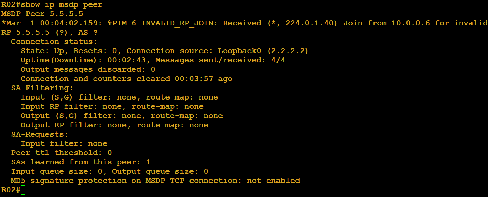

**R05**  
  
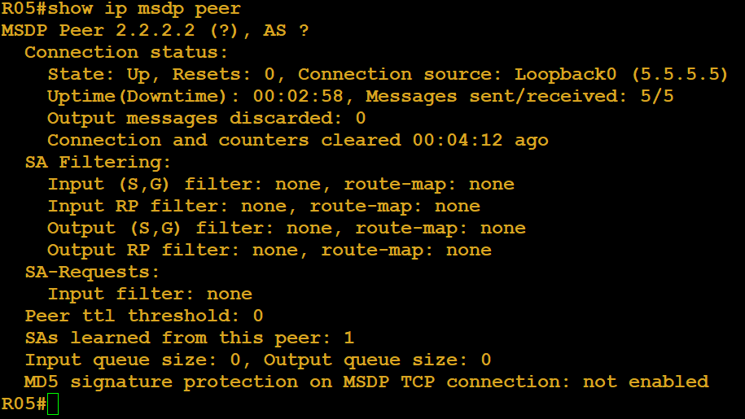
  
```ios  
show ip msdp sa-cache
```

Verifique:

- Presença de entradas (S,G);
- Origem das fontes (local ou remota);
- Tempo de vida das entradas SA.

**R02**  
  
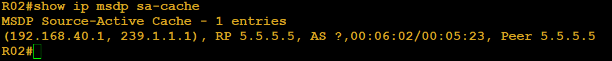

**R05**  
  
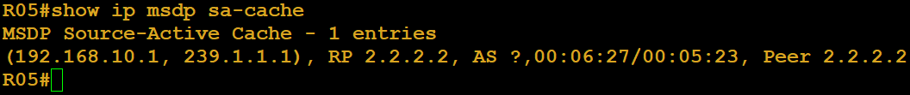
  
```ios
show ip mroute
```

Observe:

- Estados (*,G) e (S,G) ativos;
- Interfaces de entrada e saída;
- Possíveis assimetrias no encaminhamento.

**R02**  

```ios
R02#show ip mroute
IP Multicast Routing Table
Flags: D - Dense, S - Sparse, B - Bidir Group, s - SSM Group, C - Connected,
       L - Local, P - Pruned, R - RP-bit set, F - Register flag,
       T - SPT-bit set, J - Join SPT, M - MSDP created entry,
       X - Proxy Join Timer Running, A - Candidate for MSDP Advertisement,
       U - URD, I - Received Source Specific Host Report,
       Z - Multicast Tunnel, z - MDT-data group sender,
       Y - Joined MDT-data group, y - Sending to MDT-data group
Outgoing interface flags: H - Hardware switched, A - Assert winner
 Timers: Uptime/Expires
 Interface state: Interface, Next-Hop or VCD, State/Mode

(*, 239.1.1.1), 00:13:30/00:03:07, RP 2.2.2.2, flags: SJCL
  Incoming interface: Null, RPF nbr 0.0.0.0
  Outgoing interface list:
    FastEthernet0/1, Forward/Sparse, 00:12:59/00:03:07
    FastEthernet0/0, Forward/Sparse, 00:13:30/00:02:36

(192.168.40.1, 239.1.1.1), 00:10:18/00:01:50, flags: LMT
  Incoming interface: FastEthernet1/0, RPF nbr 10.0.0.6
  Outgoing interface list:
    FastEthernet0/0, Forward/Sparse, 00:10:20/00:02:34

(192.168.10.1, 239.1.1.1), 00:10:40/00:02:19, flags: LTA
  Incoming interface: FastEthernet0/1, RPF nbr 10.0.0.1
  Outgoing interface list:
    FastEthernet0/0, Forward/Sparse, 00:10:40/00:02:34

(*, 224.0.1.40), 00:13:31/00:02:32, RP 2.2.2.2, flags: SJCL
  Incoming interface: Null, RPF nbr 0.0.0.0
  Outgoing interface list:
    FastEthernet0/1, Forward/Sparse, 00:13:03/00:02:59
    Loopback0, Forward/Sparse, 00:13:33/00:02:30

R02#
```

**R05**  

```ios
R05#show ip mroute
IP Multicast Routing Table
Flags: D - Dense, S - Sparse, B - Bidir Group, s - SSM Group, C - Connected,
       L - Local, P - Pruned, R - RP-bit set, F - Register flag,
       T - SPT-bit set, J - Join SPT, M - MSDP created entry,
       X - Proxy Join Timer Running, A - Candidate for MSDP Advertisement,
       U - URD, I - Received Source Specific Host Report,
       Z - Multicast Tunnel, z - MDT-data group sender,
       Y - Joined MDT-data group, y - Sending to MDT-data group
Outgoing interface flags: H - Hardware switched, A - Assert winner
 Timers: Uptime/Expires
 Interface state: Interface, Next-Hop or VCD, State/Mode

(*, 239.1.1.1), 00:13:45/stopped, RP 5.5.5.5, flags: SJCL
  Incoming interface: Null, RPF nbr 0.0.0.0
  Outgoing interface list:
    FastEthernet0/0, Forward/Sparse, 00:13:45/00:02:09

(192.168.40.1, 239.1.1.1), 00:10:34/00:02:09, flags: LTA
  Incoming interface: FastEthernet0/1, RPF nbr 10.0.0.13
  Outgoing interface list:
    FastEthernet1/0, Forward/Sparse, 00:10:34/00:02:45
    FastEthernet0/0, Forward/Sparse, 00:10:35/00:02:08

(192.168.10.1, 239.1.1.1), 00:10:56/00:02:03, flags: LMT
  Incoming interface: FastEthernet1/0, RPF nbr 10.0.0.18
  Outgoing interface list:
    FastEthernet0/0, Forward/Sparse, 00:10:56/00:02:08

(*, 224.0.1.40), 00:13:47/00:02:16, RP 5.5.5.5, flags: SJCL
  Incoming interface: Null, RPF nbr 0.0.0.0
  Outgoing interface list:
    FastEthernet0/1, Forward/Sparse, 00:13:18/00:02:34
    Loopback0, Forward/Sparse, 00:13:48/00:02:14

R05#
```

```ios 
show ip pim rp mapping
```  

Confirme:

- RP correto por domínio multicast;
- Associação adequada entre grupos e RPs.

**R02**  

```ios
R02#show ip pim rp mapping
PIM Group-to-RP Mappings

Group(s): 224.0.0.0/4, Static
    RP: 2.2.2.2 (?)
R02#
```

**R05**  

```ios
R05#show ip pim rp mapping
PIM Group-to-RP Mappings

Group(s): 224.0.0.0/4, Static
    RP: 5.5.5.5 (?)
R05#
```

**📌 Conclusão do Baseline**  

Ao final desta etapa, deve ficar claro que:

- ✅ O MSDP está corretamente configurado e funcional;
- ✅ As fontes multicast são descobertas entre domínios;
- ❌ O comportamento do tráfego multicast não é totalmente previsível;
- 📍 A limitação observada não está no MSDP, mas no modelo de encaminhamento do PIM Sparse Mode.
  
Este baseline técnico é essencial para sustentar, de forma profissional e objetiva, a decisão de migrar para PIM BIDIR, garantindo que a próxima etapa do laboratório seja uma evolução arquitetural, e não uma tentativa de correção empírica.  

## 2️⃣ Remover dependências específicas de PIM Sparse Mode (SM)

Nesta etapa iniciamos a transição controlada do modelo **PIM-SM clássico para o PIM BIDIR**, sem alterar o funcionamento geral do multicast no ambiente. O objetivo aqui não é desligar o multicast, mas eliminar comportamentos e dependências que só fazem sentido no Sparse Mode tradicional e que interferem no design **BIDIR**.  
  
Do ponto de vista de engenharia, este é um passo crítico: ele cria um marco claro de troubleshooting, permitindo comparar o comportamento antes e depois da mudança do modelo de PIM.  
  
### 🎯 Objetivo técnico do passo

- Remover dependências de árvores dependentes de fonte (SPT);
- Preparar o ambiente para um RP como root permanente da árvore (*,G);
- Garantir que qualquer mudança observada adiante seja consequência direta do modelo BIDIR, e não de resíduos de configuração do PIM-SM.
  
**🧩 O que deve ser ajustado**  
  
**🔴 Remover**  

Nos roteadores que participam do domínio multicast:

- Remover ip pim sparse-mode das interfaces de camada 3

Essas configurações são específicas do PIM-SM e não se aplicam ao modelo BIDIR.

Então vamos entrar nos roteadores de **R01 a R06**. Executar os comandos em todos os roteadores.  
  
```ios
R01#show run | sec pim
 ip pim sparse-mode
 ip pim sparse-mode
 ip pim sparse-mode
 ip pim sparse-mode
ip pim rp-address 2.2.2.2
R01#show ip int br
Interface                  IP-Address      OK? Method Status                Protocol
FastEthernet0/0            192.168.10.254  YES NVRAM  up                    up
FastEthernet0/1            10.0.0.1        YES NVRAM  up                    up
FastEthernet1/0            10.0.0.22       YES NVRAM  up                    up
Loopback0                  1.1.1.1         YES NVRAM  up                    up
R01#conf t
Enter configuration commands, one per line.  End with CNTL/Z.
R01(config)#int f0/0
R01(config-if)#no ip pim sparse-mode
R01(config-if)#int f0/1
R01(config-if)#no ip pim sparse-mode
R01(config-if)#int f1/0
R01(config-if)#no ip pim sparse-mode
R01(config-if)#it
R01(config)#int lo0
R01(config-if)#no ip pim sparse-mode
R01(config-if)#
```

### 🟢 O que não deve ser alterado

Para garantir consistência do laboratório e valor comparativo:

- **ip multicast-routing** permanece habilitado;
- **IGMP** continua ativo nas interfaces de acesso;
- **MSDP** não sofre nenhuma alteração;
- Endereçamento IP permanece o mesmo;
- Grupos multicast utilizados no laboratório não mudam.
  
📌 **Isso garante que qualquer diferença observada adiante não seja causada por mudanças fora do modelo de PIM.**

🖥️ **Evidências e telas a serem coletadas**  
  
Durante este passo, recomenda-se gerar prints comparativos, que serão reutilizados mais adiante:

- Configuração das interfaces  
  
```ios
R01#show run interface fastEthernet 0/0
Building configuration...

Current configuration : 131 bytes
!
interface FastEthernet0/0
 ip address 192.168.10.254 255.255.255.0
 ip ospf network point-to-point
 duplex auto
 speed auto
end

R01#
```

- Mostrar a remoção explícita do ip pim sparse-mode;
  Saída de show run | section pim

```ios
R01#show run | section pim
ip pim rp-address 2.2.2.2
R01#
```

- Evidenciar que não há mais parâmetros ligados a SPT;
  Tabela de multicast logo após a remoção

```ios
R01#show ip mroute
IP Multicast Routing Table
Flags: D - Dense, S - Sparse, B - Bidir Group, s - SSM Group, C - Connected,
       L - Local, P - Pruned, R - RP-bit set, F - Register flag,
       T - SPT-bit set, J - Join SPT, M - MSDP created entry,
       X - Proxy Join Timer Running, A - Candidate for MSDP Advertisement,
       U - URD, I - Received Source Specific Host Report,
       Z - Multicast Tunnel, z - MDT-data group sender,
       Y - Joined MDT-data group, y - Sending to MDT-data group
Outgoing interface flags: H - Hardware switched, A - Assert winner
 Timers: Uptime/Expires
 Interface state: Interface, Next-Hop or VCD, State/Mode

R01#
```

### 3️⃣ Definição Explícita do RP como BIDIR (Mudança Lógica Central do Laboratório)

Até este ponto do laboratório, todas as validações e ajustes realizados tiveram como objetivo preparar o ambiente, removendo dependências específicas do modelo PIM Sparse Mode tradicional, sem alterar o funcionamento global do multicast.  
  
Neste passo ocorre, de fato, a mudança arquitetural central do laboratório.  
  
📌 **Importante**:  
Aqui não estamos corrigindo o MSDP, nem alterando o plano de controle inter-domínios.  
O MSDP permanece exatamente igual.  
O que muda é o **modelo de encaminhamento multicast** dentro de cada domínio, por meio da adoção explícita do **PIM Bidirectional (BIDIR)**.  
  
🎯 **Objetivo Técnico do Passo 03**
  
Este passo tem como objetivo:

- Transformar o Rendezvous Point (RP) no root permanente da árvore multicast compartilhada (*,G);
- Eliminar a criação dinâmica de estados (S,G) e a transição para SPT;
- Garantir encaminhamento simétrico, previsível e determinístico;
- Permitir que o MSDP opere sem expor limitações do plano de dados.

No contexto deste laboratório:

- **R02** atua como RP do Domínio A;
- **R05** atua como RP do Domínio B;

Ambos os domínios devem operar com configuração BIDIR consistente.

🧠 **Conceito-Chave: O que muda com o RP BIDIR**
  
Antes (PIM-SM tradicional):

- O RP é apenas um ponto inicial de descoberta;
- O tráfego pode migrar para árvores (S,G);
- O encaminhamento pode se tornar assimétrico;
- O MSDP anuncia fontes, mas o data-plane pode se comportar de forma imprevisível.

Depois (PIM BIDIR):

- O RP é o root fixo da árvore (*,G);
- Não existe transição para (S,G);
- Todas as fontes e receptores utilizam a mesma árvore compartilhada;
- O tráfego multicast flui de forma bidirecional e estável.
  
📌 **Esse é o motivo pelo qual este passo representa a mudança lógica central do laboratório.**  

### ⚙️ Configuração do RP como BIDIR

🔧 **Etapa 3.1 — Habilitar suporte a BIDIR no domínio**  

Este comando habilita o suporte ao modelo PIM Bidirectional no roteador.  
  
Execute nos roteadores envolvidos no domínio multicast. No nosso laboratório, **R02** é o RP do **domínio A** e, **R05** é o RP do **domínio B**.  
Então vamos entrar em **R02 e R005** e aplicar o comando  

```ios
ip pim bidir-enable
```

**R02**  

```ios
R02(config)#ip pim bidir-enable
R02(config)#
```

**R05**  

```ios
R05(config)#ip pim bidir-enable
R05(config)#
```

Agora vamos verificar as configurações com o comando:

```ios
show running-config | section pim
```

**R02**  

```ios
R02#show running-config | section pim
ip pim bidir-enable
ip pim rp-address 2.2.2.2
R02#
```

**R05**  

```ios
R05#show running-config | include pim
ip pim bidir-enable
ip pim rp-address 5.5.5.5
R05#
```

🔧 **Etapa 3.2 — Definir explicitamente o RP como BIDIR**  

Até este ponto do laboratório, realizamos apenas a mudança lógica do modelo multicast, definindo que o domínio passará a operar em PIM Bidirectional (BIDIR). Essa etapa não tem como objetivo imediato validar tráfego, mas sim preparar o plano de controle para o novo modelo.  
  
É importante reforçar um ponto crítico de design e troubleshooting:  
  
> ❗ Neste momento, ainda não existe encaminhamento multicast ativo, pois o protocolo PIM foi removido das interfaces na etapa anterior.
  
Isso é intencional e faz parte da metodologia do laboratório.  
Ao remover o comando ip pim sparse-mode de todas as interfaces (R01 a R06), eliminamos completamente o funcionamento do PIM no plano de dados. Como consequência:
  
- Nenhuma árvore multicast (*,G) pode ser formada;
- O comando `show ip mroute` não apresentará entradas relevantes;
  
Qualquer teste de tráfego multicast neste ponto não produzirá resultados válidos.

Essa separação clara entre:

- mudança de modelo (controle) e
- reativação do encaminhamento (data-plane)
- é fundamental para demonstrar que o comportamento observado posteriormente será consequência direta do PIM BIDIR, e não de resquícios do PIM-SM.

🔧 **Etapa 3.3 — Reativar o PIM nas interfaces em modo BIDIR**
  
Somente após definir explicitamente o RP como BIDIR, devemos reativar o protocolo PIM nas interfaces, agora utilizando o modelo bidirectional.  
  
Nesta etapa:

- O PIM volta a operar no plano de dados;
- A árvore multicast passa a ser construída novamente;
- O RP definido como BIDIR assume o papel de root permanente da árvore (*,G).

📌 **Configuração nas interfaces (R01 a R06)**  

Em todas as interfaces que participam do transporte multicast (links entre roteadores, interfaces com fontes e receptores), configure:

```ios
interface <interface>
 ip pim sparse-mode
```

⚠️ **Atenção (Implementação IOS e Contexto Didático):**  
  
- Neste laboratório, as interfaces continuam utilizando ip pim sparse-mode;
- Isso ocorre porque, na versão do IOS utilizada, o PIM Bidirectional não é configurado como um modo de interface separado;
- O comportamento BIDIR é ativado globalmente com **ip pim bidir-enable** e definido logicamente no RP por meio do comando **ip pim rp-address <RP> bidir**;
- A partir dessa associação, o IOS passa a tratar os grupos como BIDIR, eliminando transições para (S,G), uso de PIM Register e SPT, mesmo com sparse-mode nas interfaces;
- Pode-se interpretar esse comportamento como uma associação lógica implícita entre grupo multicast e RP BIDIR, e não como uma ACL configurável pelo administrador.
  
📘 **Nota Didática:**  
Essa abordagem foi adotada propositalmente para evidenciar a diferença entre modo de interface e modelo de encaminhamento multicast, além de refletir cenários reais de troubleshooting em ambientes legados, onde limitações de IOS influenciam diretamente o design multicast.

Execute o comando de **R01 a R06**  

Agora definimos o RP com o atributo **BIDIR**, garantindo que todos os roteadores do domínio interpretem corretamente o modelo multicast.  
  
- Domínio A — RP no R02

```ios
ip pim rp-address 2.2.2.2 bidir
```

- Domínio B — RP no R05

```ios
ip pim rp-address 5.5.5.5 bidir
```
  
📌 **Requisito fundamental:**  
Essa definição deve ser idêntica em todos os roteadores de cada domínio multicast.
  
Agora verificar os roteadores de **R01 a R06**. Executar os comandos:

```ios
show ip pim rp mapping
show running-config | include rp-address
```

**R01**  

```ios
R01#show ip pim rp mapping
PIM Group-to-RP Mappings

Acl: bidir, Static
    RP: 2.2.2.2 (?)
R01#show running-config | include rp-address
ip pim rp-address 2.2.2.2 bidir
```
  
**R04**  

```ios
R04#show ip pim rp mapping
PIM Group-to-RP Mappings

Acl: bidir, Static
    RP: 5.5.5.5 (?)
R04#show running-config | include rp-address
ip pim rp-address 5.5.5.5 bidir
R04#
```

⚠️ **Atenção**  
Como estamos simulando o tráfego com o comando **ping**, somente as interfaces dos hosts **Server01, Server02, Host01, Host02, Host03 e Host04** deve conter o comando `ip igp join group 239.1.1.1`  

🔎 **Validação Técnica do Modelo BIDIR**  

Após a aplicação da configuração, valide os seguintes pontos:
  
`show ip pim rp mapping`  
  
Verifique:

- O RP correto por domínio;
- A associação do grupo multicast ao RP BIDIR;
- A ausência de ambiguidade no mapeamento RP.
  
Agora para validarmos essa etapa, vamos executar o nosso tráfego simulado através do ping.  
Executar em **Server01 e Server02**

```ios
ping 239.1.1.1 size 50 repeat 1000
```

**Server01**  

```ios
SERVER01#
SERVER01#ping 239.1.1.1 size 50 repeat 1000

Type escape sequence to abort.
Sending 1000, 50-byte ICMP Echos to 239.1.1.1, timeout is 2 seconds:

Reply to request 0 from 192.168.10.1, 4 ms
Reply to request 1 from 192.168.10.1, 4 ms
Reply to request 2 from 192.168.10.1, 4 ms
Reply to request 3 from 192.168.10.1, 4 ms
Reply to request 3 from 192.168.20.1, 124 ms
Reply to request 3 from 192.168.60.1, 92 ms
Reply to request 4 from 192.168.10.1, 4 ms
Reply to request 4 from 192.168.20.1, 180 ms
Reply to request 4 from 192.168.60.1, 144 ms
Reply to request 5 from 192.168.10.1, 4 ms
Reply to request 5 from 192.168.20.1, 160 ms
Reply to request 5 from 192.168.60.1, 124 ms
....
````

**Server02**  

```ios
SERVER02#ping 239.1.1.1 size 50 repeat 1000

Type escape sequence to abort.
Sending 1000, 50-byte ICMP Echos to 239.1.1.1, timeout is 2 seconds:

Reply to request 0 from 192.168.40.1, 1 ms
Reply to request 1 from 192.168.40.1, 4 ms
Reply to request 2 from 192.168.40.1, 4 ms
Reply to request 2 from 192.168.30.1, 172 ms
Reply to request 2 from 192.168.50.1, 104 ms
Reply to request 3 from 192.168.40.1, 4 ms
Reply to request 3 from 192.168.30.1, 88 ms
Reply to request 3 from 192.168.50.1, 88 ms
Reply to request 4 from 192.168.40.1, 4 ms
Reply to request 4 from 192.168.50.1, 140 ms
Reply to request 4 from 192.168.30.1, 108 ms
Reply to request 5 from 192.168.40.1, 4 ms
Reply to request 5 from 192.168.50.1, 120 ms
Reply to request 5 from 192.168.30.1, 120 ms
...
```
  
Logo após, vamos executar o comado:  
  
`show ip mroute`  
  
Executar de **R01 a R06**  

**R01**  

```ios
R01#show ip mroute
IP Multicast Routing Table
Flags: D - Dense, S - Sparse, B - Bidir Group, s - SSM Group, C - Connected,
       L - Local, P - Pruned, R - RP-bit set, F - Register flag,
       T - SPT-bit set, J - Join SPT, M - MSDP created entry,
       X - Proxy Join Timer Running, A - Candidate for MSDP Advertisement,
       U - URD, I - Received Source Specific Host Report,
       Z - Multicast Tunnel, z - MDT-data group sender,
       Y - Joined MDT-data group, y - Sending to MDT-data group
Outgoing interface flags: H - Hardware switched, A - Assert winner
 Timers: Uptime/Expires
 Interface state: Interface, Next-Hop or VCD, State/Mode

(*, 239.1.1.1), 00:13:30/00:02:43, RP 2.2.2.2, flags: BC
  Bidir-Upstream: FastEthernet0/1, RPF nbr 10.0.0.2
  Outgoing interface list:
    FastEthernet1/0, Forward/Sparse, 00:13:16/00:02:49
    FastEthernet0/0, Forward/Sparse, 00:13:24/00:02:43
    FastEthernet0/1, Bidir-Upstream/Sparse, 00:13:25/00:00:00

(*, 224.0.1.40), 00:13:30/00:02:31, RP 2.2.2.2, flags: BCL
  Bidir-Upstream: FastEthernet0/1, RPF nbr 10.0.0.2
  Outgoing interface list:
    FastEthernet1/0, Forward/Sparse, 00:13:17/00:02:43
    Loopback0, Forward/Sparse, 00:13:26/00:02:30
    FastEthernet0/1, Bidir-Upstream/Sparse, 00:13:26/00:00:00

R01#
```

**R04**  

```ios
R04#show ip mroute
IP Multicast Routing Table
Flags: D - Dense, S - Sparse, B - Bidir Group, s - SSM Group, C - Connected,
       L - Local, P - Pruned, R - RP-bit set, F - Register flag,
       T - SPT-bit set, J - Join SPT, M - MSDP created entry,
       X - Proxy Join Timer Running, A - Candidate for MSDP Advertisement,
       U - URD, I - Received Source Specific Host Report,
       Z - Multicast Tunnel, z - MDT-data group sender,
       Y - Joined MDT-data group, y - Sending to MDT-data group
Outgoing interface flags: H - Hardware switched, A - Assert winner
 Timers: Uptime/Expires
 Interface state: Interface, Next-Hop or VCD, State/Mode

(*, 239.1.1.1), 00:17:30/00:03:04, RP 5.5.5.5, flags: BC
  Bidir-Upstream: FastEthernet0/1, RPF nbr 10.0.0.14
  Outgoing interface list:
    FastEthernet1/0, Forward/Sparse, 00:17:21/00:02:39
    FastEthernet0/0, Forward/Sparse, 00:17:30/00:02:49
    FastEthernet0/1, Bidir-Upstream/Sparse, 00:17:30/00:00:00

(*, 224.0.1.40), 00:18:25/00:02:36, RP 5.5.5.5, flags: BCL
  Bidir-Upstream: FastEthernet0/1, RPF nbr 10.0.0.14
  Outgoing interface list:
    FastEthernet0/0, Forward/Sparse, 00:17:31/00:02:47
    Loopback0, Forward/Sparse, 00:17:40/00:02:35
    FastEthernet0/1, Bidir-Upstream/Sparse, 00:17:41/00:00:00

R04#
```

Observe atentamente:

- Presença do flag B (Bidir Group);
- Predominância de estados (*,G);
- Ausência de transição para (S,G);
- Encaminhamento simétrico nos dois domínios.

🧪 **Validação Complementar com Wireshark**  

Para reforçar a análise técnica, recomenda-se capturar tráfego multicast em uma interface de acesso aos hosts.  
  
Com o Wireshark, observe:

- Ausência de pacotes PIM Register;
- Fluxo multicast estável;
- Tráfego fluindo sempre via RP;
- Redução de sinalização dinâmica relacionada a SPT.
  
🎯 **Interface de captura (importante)**  
  
Capture na interface do roteador ligada ao host ou no segmento L2 do host, por exemplo:
  
- Interface do R04 ↔ SERVER02
- Interface do R02 ↔ SERVER01

Assim você enxerga o efeito do BIDIR/ASM na borda, que é exatamente o ponto da validação.

**R02**  

| Filtro Whireshark                                  | Significado                                | Captura de Tela                      |
|:--------------------------------------------------:|:-------------------------------------------|:------------------------------------:|
| `ip.dst >= 224.0.0.0 && ip.dst <= 239.255.255.255` | . confirmar fluxo multicast contínuo       |                                      |
| `ip.dst >= 224.0.0.0 && ip.dst <= 239.255.255.255` | . ver ICMP multicast (ping 239.1.1.1)      | 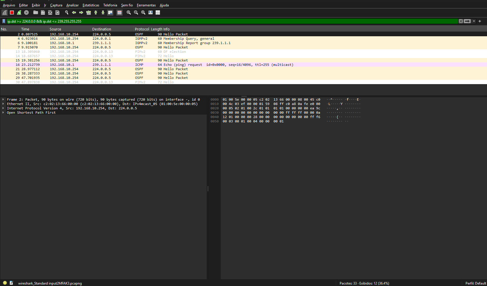 |
| `ip.dst >= 224.0.0.0 && ip.dst <= 239.255.255.255` | . validar que o tráfego está ativo         |                                      |
| `pim`                                              | . NÃO aparecem pacotes PIM Register        |                                      |
| `pim`                                              | . Aparecem apenas: PIM Hello               | 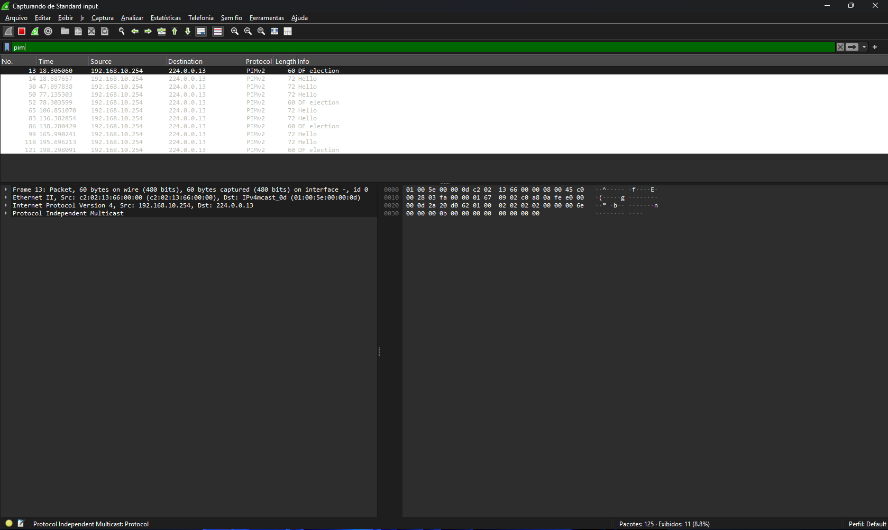 |
| `pim`                                              | . Aparecem eventualmete: PIM Join/Prune    |                                      |
| `pim.type == 1`                                    | . zero pacotes                             |                                      |
| `pim.type == 1`                                    | . “Não foram observados pacotes            |  |
| `pim.type == 1`                                    | PIM Register, o que confirma a operação em |                                      |
| `pim.type == 1`                                    | modo Bidirectional PIM.”                   |                                      |
| `icmp && ip.dst == 239.1.1.1`                      | . Echo Request enviados ao grupo           |                                      |
| `icmp && ip.dst == 239.1.1.1`                      | . Echo Reply vindos de múltiplos hosts     | 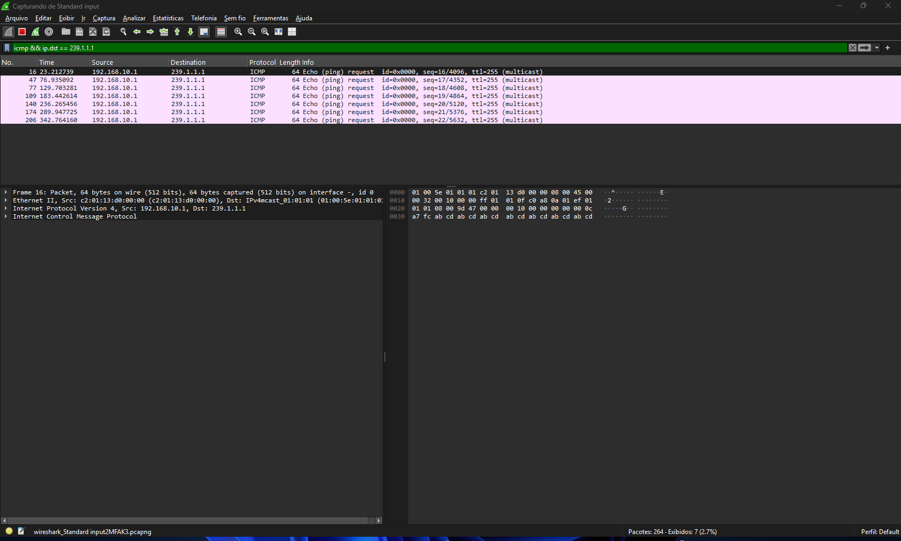 |
| `icmp && ip.dst == 239.1.1.1`                      | . múltiplas respostas                      |                                      |
| `ip.proto == 103`                                  | . tráfego de dados não alterna caminho     | 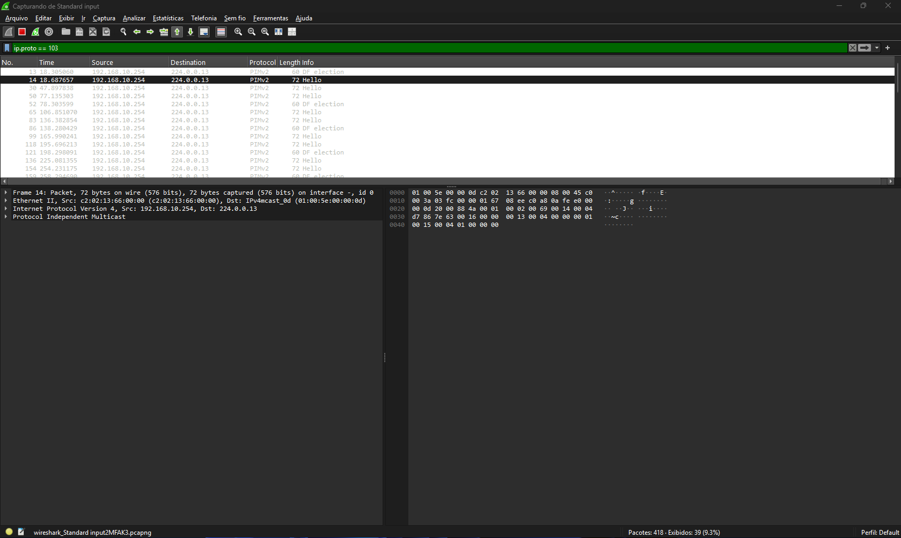 |
| `ip.proto == 103`                                  | . não surge sinalização extra de Join SPT  |                                      |
| `icmp`                                             | . tráfego de dados não alterna caminho     | 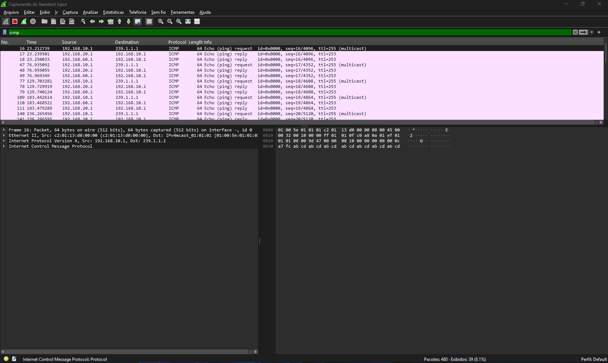 |
| `icmp`                                             | . não surge sinalização extra de Join SPT  |                                      |

**R04**  

| Filtro Whireshark                                  | Significado                                | Captura de Tela                      |
|:--------------------------------------------------:|:-------------------------------------------|:------------------------------------:|
| `ip.dst >= 224.0.0.0 && ip.dst <= 239.255.255.255` | . confirmar fluxo multicast contínuo       |                                      |
| `ip.dst >= 224.0.0.0 && ip.dst <= 239.255.255.255` | . ver ICMP multicast (ping 239.1.1.1)      | 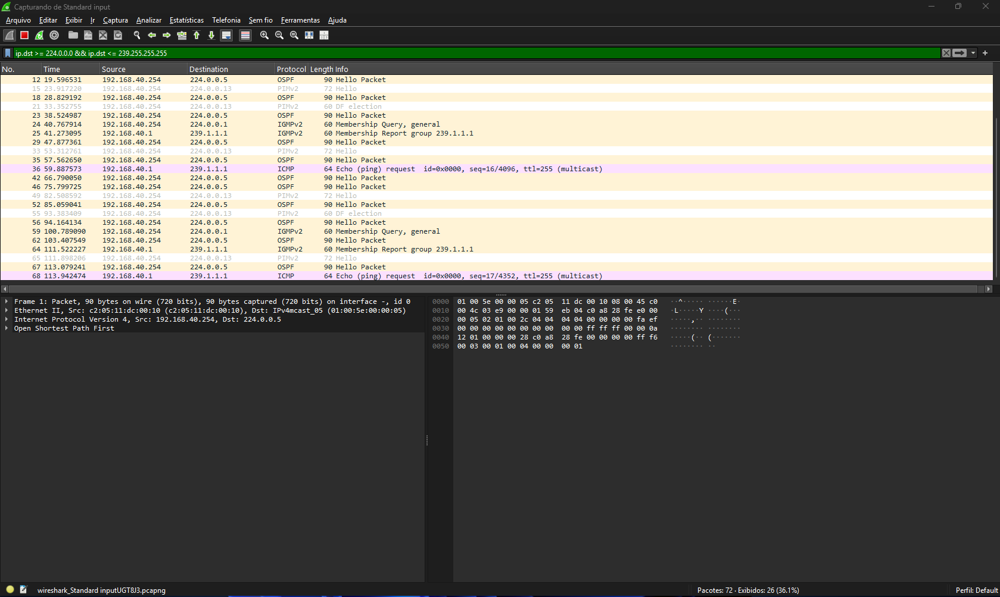 |
| `ip.dst >= 224.0.0.0 && ip.dst <= 239.255.255.255` | . validar que o tráfego está ativo         |                                      |
| `pim`                                              | . NÃO aparecem pacotes PIM Register        |                                      |
| `pim`                                              | . Aparecem apenas: PIM Hello               | 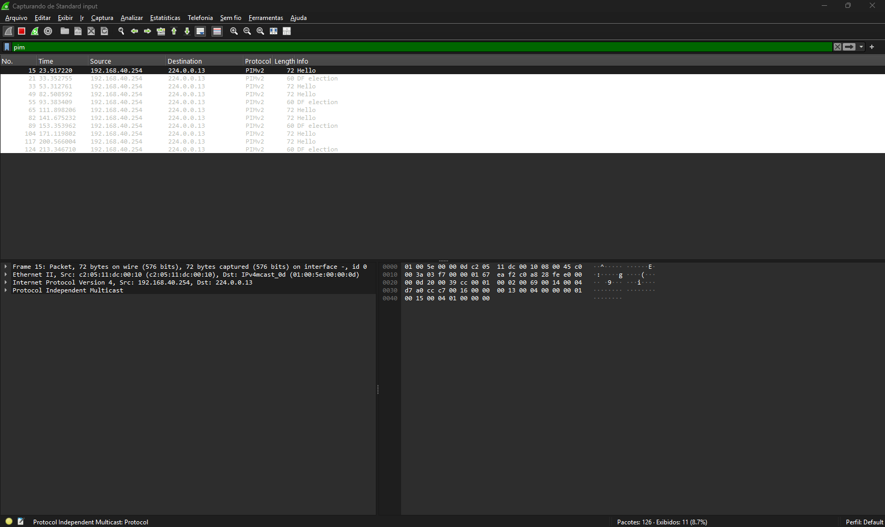 |
| `pim`                                              | . Aparecem eventualmete: PIM Join/Prune    |                                      |
| `pim.type == 1`                                    | . zero pacotes                             |                                      |
| `pim.type == 1`                                    | . “Não foram observados pacotes            | 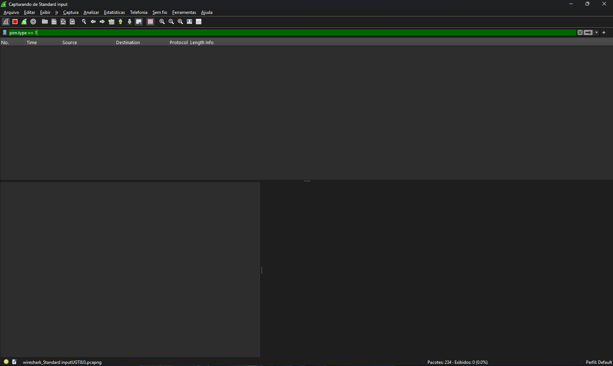 |
| `pim.type == 1`                                    | PIM Register, o que confirma a operação em |                                      |
| `pim.type == 1`                                    | modo Bidirectional PIM.”                   |                                      |
| `icmp && ip.dst == 239.1.1.1`                      | . Echo Request enviados ao grupo           |                                      |
| `icmp && ip.dst == 239.1.1.1`                      | . Echo Reply vindos de múltiplos hosts     | 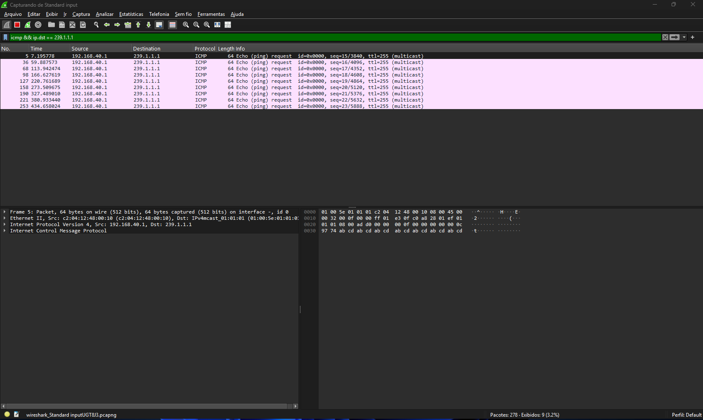 |
| `icmp && ip.dst == 239.1.1.1`                      | . múltiplas respostas                      |                                      |
| `ip.proto == 103`                                  | . tráfego de dados não alterna caminho     | 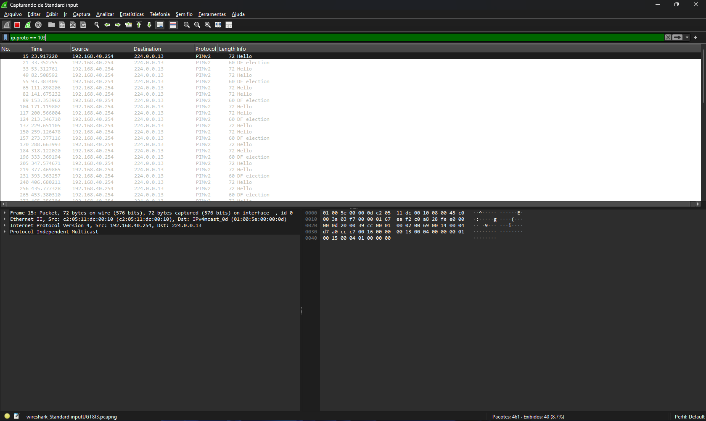 |
| `ip.proto == 103`                                  | . não surge sinalização extra de Join SPT  |                                      |
| `icmp`                                             | . tráfego de dados não alterna caminho     |  |
| `icmp`                                             | . não surge sinalização extra de Join SPT  |                                      |

📌 **Conclusão do Passo 03**  
  
Neste ponto do laboratório, fica evidente que:

- ✅ O MSDP permanece inalterado e funcional;
- ✅ A descoberta de fontes continua ocorrendo entre domínios;
- ✅ O comportamento multicast torna-se previsível e consistente;

🎯 A mudança decisiva ocorreu no modelo de PIM, não no protocolo MSDP.

Este passo consolida o entendimento de que decisões de design no plano de dados têm impacto direto na eficiência do multicast interdomínios, e prepara o cenário para as validações finais de convergência e estabilidade.  
Neste ponto conseguimos consolidar o cenário e podemos provar que temos **dois domínios multicast ( A e B) em PIM BIDIR**. Porém eles ainda não se conversam.  

## Passo 04 – Entendendo o Bloqueio Atual (BIDIR + MSDP)

Antes de qualquer ajuste prático, é importante **registrar o estado atual do laboratório**. Neste ponto, o comportamento observado **não é erro de configuração**, mas consequência direta do modelo escolhido.

### Situação atual

- Existem **dois domínios multicast independentes** (Domínio A e Domínio B);
- Cada domínio utiliza **PIM BIDIR** com seu respectivo RP;
- O **MSDP está estabelecido em TCP** entre os RPs;
- Apenas entradas `(*,G)` existem na tabela multicast;
- **Nenhuma entrada `(S,G)` é gerada**, logo **nenhuma SA é anunciada via MSDP**.

O resultado prático é simples:

> O tráfego multicast funciona **dentro de cada domínio**, mas **não atravessa os domínios**.

### Visão lógica do problema

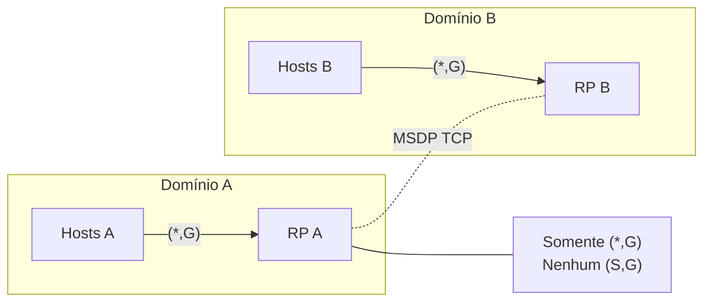
```mermaid
graph LR
  subgraph Domínio A
    HA[Hosts A]
    RPA[RP A]
    HA -->|"(*,G)"| RPA
  end

  subgraph Domínio B
    HB[Hosts B]
    RPB[RP B]
    HB -->|"(*,G)" | RPB
  end

  RPA -. MSDP TCP .- RPB

  note1["Somente (*,G)\nNenhum (S,G)"]
  RPA --- note1
```

### Conclusão técnica deste estágio

- **PIM BIDIR não cria fontes explícitas**;
- **MSDP depende de (S,G)** para propagar informação entre domínios;
- Portanto, **BIDIR puro isola os domínios por definição**.

### 🧩 Registro intencional do comportamento BIDIR

Neste estágio do laboratório, o uso de **PIM BIDIR** cumpre exatamente o papel esperado:  
o tráfego multicast é distribuído corretamente **apenas dentro de cada domínio**, utilizando exclusivamente entradas `(*,G)`.

Essa escolha **é deliberada** e tem como objetivo demonstrar uma limitação arquitetural clara:

> **Sem a criação de estados `(S,G)`, não existem anúncios Source-Active (SA),  
> e, portanto, o MSDP não possui informações para propagar entre domínios.**

Com isso, fica comprovado que **PIM BIDIR, por definição, não atende cenários inter-domínio via MSDP**.

Este ponto marca o encerramento da fase BIDIR do laboratório e prepara o terreno para a próxima etapa:  
**a transição controlada para ASM**, necessária para viabilizar a troca de informações multicast entre domínios.

## 🔄 Migração do Domínio A — De PIM BIDIR para ASM

Após validar que o **PIM BIDIR isola domínios multicast por definição**, o próximo passo do laboratório é **transformar conscientemente o Domínio A em ASM**, preparando-o para a troca de informações via MSDP.  
  
Este ajuste **não corrige um erro**, mas **altera intencionalmente o modelo operacional** do domínio.  
  
---

### 🎯 Objetivo desta etapa

- Eliminar o uso de **PIM BIDIR** no Domínio A;
- Permitir a criação de entradas **(S,G)**;
- Preparar o RP para gerar anúncios **Source-Active (SA)**;
- Tornar o Domínio A elegível para **interconexão via MSDP**.
  
---
  
### 1️⃣ Remoção do suporte a PIM BIDIR no Domínio A

Nos roteadores **R01, R02 e R06**, remover o suporte global a BIDIR:

```ios
no ip pim bidir-enable
```

📌 A partir deste ponto, o domínio não suporta mais árvores bidirecionais (*,G).  
  
### 2️⃣ Ajuste do RP — Removendo BIDIR

No RP do Domínio A (R02), remover a associação BIDIR:  

```ios
no ip pim rp-address 2.2.2.2 bidir
```

📌 Esse comando elimina o comportamento BIDIR e permite que os grupos passem a operar em ASM.  

### 3️⃣ Definição do RP ASM no Domínio A
  
Ainda no R02, configurar o RP em modo ASM (comportamento padrão):  

```ios
ip pim rp-address 2.2.2.2
```

📌 A ausência da palavra bidir faz com que o RP opere em Any-Source Multicast, permitindo:  

- Criação de entradas (S,G);
- Encaminhamento baseado em fonte;
- Geração de anúncios Source-Active (SA).

### 4️⃣ Propagação do RP ASM para os demais roteadores do domínio

Nos roteadores R01, R02 e R06, garantir que o RP ASM esteja configurado:

```ios
ip pim rp-address 2.2.2.2
```
  
📌 Com isso, todo o Domínio A passa a operar exclusivamente em PIM Sparse Mode (ASM).  
  
✅ **Estado esperado ao final desta etapa**  

- O Domínio A não utiliza mais PIM BIDIR;
- Entradas (S,G) passam a ser criadas;
- O RP (R02) torna-se capaz de anunciar fontes multicast;
- O domínio está pronto para integração via MSDP no próximo passo.

## 🔄 Migração do Domínio B – De PIM BIDIR para ASM
  
Compreendido o motivo pelo qual PIM BIDIR isola domínios multicast quando utilizado em conjunto com MSDP, o próximo passo é aplicar a mesma transição arquitetural no Domínio B, garantindo simetria de funcionamento entre os domínios.  
  
Assim como no Domínio A, o objetivo aqui não é corrigir um erro, mas alterar conscientemente o modelo multicast, preparando o cenário para a troca de informações (S,G) via MSDP.  

---

### 🎯 Objetivo desta etapa no domínio B

- Remover o comportamento BIDIR do Domínio B;
- Habilitar ASM (Any-Source Multicast) para permitir:
- Criação de entradas (S,G);
- Geração de anúncios Source-Active (SA);
- Propagação de fontes multicast entre domínios via MSDP.

### 🧠 Contexto técnico

Enquanto o Domínio B opera em PIM BIDIR, apenas entradas (*,G) são criadas.  
Esse modelo é eficiente para tráfego interno, porém incompatível com MSDP, que depende exclusivamente de entradas (S,G).  
  
Portanto, a migração para ASM é mandatória para viabilizar comunicação inter-domínio.  

### 🔧 Ajustes práticos no Domínio B

### 1️⃣ Remover o suporte BIDIR dos roteadores do domínio

Nos roteadores R03, R04 e R05, remover o suporte global ao PIM BIDIR:

```ios
no ip pim bidir-enable
```

📌 Esse comando garante que nenhum grupo multicast seja tratado como BIDIR neste domínio.  

### 2️⃣ Remover a associação BIDIR do RP do Domínio B

No roteador R05 (RP do Domínio B), remover a definição BIDIR:

```ìos
no ip pim rp-address 5.5.5.5 bidir
```
  
📌 A partir deste ponto, o RP deixa de operar exclusivamente com árvores bidirecionais.  
  
### 3️⃣ Definir o RP do Domínio B como ASM

Ainda no R05, configurar o RP em modo ASM:

```ios
ip pim rp-address 5.5.5.5
```

📌 A ausência do parâmetro bidir faz com que todos os grupos multicast passem a operar em ASM, permitindo a criação de (S,G).  
  
### 4️⃣ Propagar a definição do RP ASM para o domínio

Nos roteadores R03, R04 e R05, garantir a definição do RP ASM:

```ios
ip pim rp-address 5.5.5.5
```
  
📌 Essa configuração assegura que todo o Domínio B utilize o mesmo RP ASM, mantendo consistência no controle multicast.
  
✅ **Estado final esperado do Domínio B**  

Ao final desta etapa:

- O Domínio B deixa de operar em PIM BIDIR;
- Entradas (S,G) passam a ser criadas;
- O RP do domínio torna-se compatível com MSDP;
- O cenário fica pronto para troca de informações inter-domínio.
  
A próxima etapa consiste em validar a comunicação entre os RPs ASM dos Domínios A e B via MSDP, consolidando o funcionamento completo do laboratório.

### Diagrama de Funcionamento dos Dominios A e B em PIM ASM

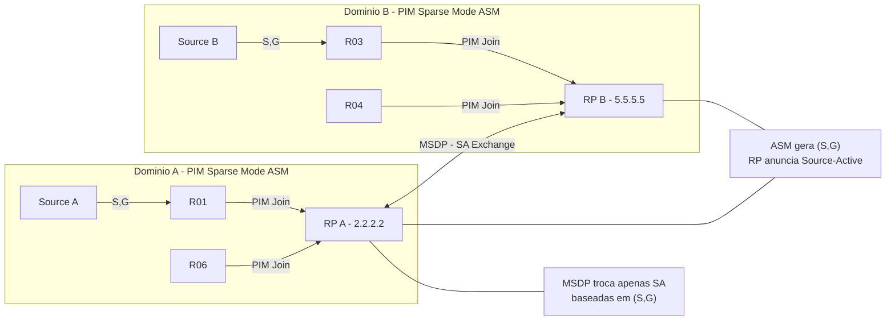
```mermaid
graph LR

%% =========================
%% Dominio A - ASM
%% =========================

subgraph Dominio_A_ASM["Dominio A - PIM Sparse Mode ASM"]
  SA["Source A"]
  R01["R01"]
  R02["RP A - 2.2.2.2"]
  R06["R06"]

  SA -->|"S,G"| R01
  R01 -->|"PIM Join"| R02
  R06 -->|"PIM Join"| R02
end

%% =========================
%% Dominio B - ASM
%% =========================

subgraph Dominio_B_ASM["Dominio B - PIM Sparse Mode ASM"]
  SB["Source B"]
  R03["R03"]
  R05["RP B - 5.5.5.5"]
  R04["R04"]

  SB -->|"S,G"| R03
  R03 -->|"PIM Join"| R05
  R04 -->|"PIM Join"| R05
end

%% =========================
%% MSDP
%% =========================

R02 <-->|"MSDP - SA Exchange"| R05

%% =========================
%% Annotations
%% =========================

noteA["ASM gera (S,G)\nRP anuncia Source-Active"]
noteB["MSDP troca apenas SA\nbaseadas em (S,G)"]

R02 --- noteA
R05 --- noteA
R02 --- noteB
```

### 🔧 Apresentar rapidamente a configuração (já feita)

A tabela abaixo resume o estado final da configuração multicast após a migração de **PIM BIDIR para ASM** nos dois domínios:

| Domínio | Roteador         | Função           | Modo PIM     | RP Configurado   |
|---------|------------------|------------------|--------------|------------------|
| A       | R01              | Router de acesso | ASM (Sparse) | 2.2.2.2          |
| A       | R02              | RP do domínio A  | ASM (Sparse) | 2.2.2.2          |
| A       | R06              | Router de acesso | ASM (Sparse) | 2.2.2.2          |
| B       | R03              | Router de acesso | ASM (Sparse) | 5.5.5.5          |
| B       | R04              | Router de acesso | ASM (Sparse) | 5.5.5.5          |
| B       | R05              | RP do domínio B  | ASM (Sparse) | 5.5.5.5          |
  
📌 Observações importantes:
  
- **PIM BIDIR foi completamente removido** de ambos os domínios;
- Todos os grupos multicast agora operam em **ASM (Any-Source Multicast)**;
- Entradas **(S,G)** passam a ser criadas;
- Os RPs tornam-se elegíveis para **troca de Source-Active (SA) via MSDP**.

Com esse estado consolidado, o cenário está pronto para a **validação do MSDP e análise do `sa-cache`**.

## 🔌 Acesso remoto aos RPs para validação do MSDP

Durante os testes multicast inter-domínio, será necessário **gerar tráfego continuamente** (ping multicast) e, ao mesmo tempo, **observar o comportamento do MSDP em tempo real**.  

Como o comando de ping multicast **bloqueia o terminal**, utilizaremos **sessões Telnet paralelas** para acompanhar os estados internos do protocolo.  
  
---

### 🎯 Por que utilizar Telnet neste estágio?

- O ping multicast mantém o terminal ocupado;
- Precisamos verificar comandos como:
  - `show ip msdp sa-cache`
  - `show ip mroute`
- O uso de Telnet permite:
  - Um terminal dedicado para **gerar tráfego**
  - Outro terminal dedicado para **análise e observação**
  
Essa abordagem reflete práticas reais de troubleshooting em ambientes de rede.

---
  
### 🔧 Configuração básica de Telnet nos RPs

Nos RPs (R02 e R05), configure o acesso remoto com autenticação simples de laboratório:

```ios
username cisco privilege 15 password cisco

line vty 0 4
 login local
 transport input telnet
```
  
📌 Usuário: **cisco**  
📌 Senha: **cisco**  
  
Essa configuração é exclusivamente para fins didáticos, permitindo acesso simultâneo aos roteadores durante os testes.

### 🧪 De onde os testes serão realizados?
  
Origem do tráfego multicast  

- Ping multicast será executado diretamente nos RPs
- Utilizando a Loopback0 como endereço de origem
  
Observação e validação
  
- Através de sessões Telnet paralelas
- Monitorando os estados do MSDP e da tabela multicast

### 🚀 Gerando tráfego multicast corretamente

Para que o MSDP funcione, é fundamental que o RP atue como fonte ASM.  
Por isso, o ping multicast deve ser executado da seguinte forma nos RPs:  

```ios
ping 239.1.1.1 source Loopback0 size 50 repeat 20
```

🧠 **Por que usar a Loopback como source?**  
  
- Garante que o RP seja visto como fonte multicast estável;
- Evita dependência de interfaces físicas;
- Facilita a criação de entradas (S,G);
  
Permite que o RP:

- Gere anúncios Source-Active (SA)
- Propague essas informações via MSDP
  
📌 **Sem definir a Loopback como source, o tráfego pode não ser reconhecido corretamente como origem multicast válida para o MSDP.**  

## 🧪 Validação Final do Laboratório (ASM + MSDP)

Com os Domínios A e B operando exclusivamente em **PIM Sparse Mode (ASM)** e com a sessão **MSDP estabelecida entre os RPs**, esta etapa tem como objetivo **validar, na prática**, a propagação de fontes multicast entre domínios distintos.  
  
A validação segue uma ordem lógica:  
**gerar tráfego → observar estados → confirmar anúncios MSDP → comprovar encaminhamento inter-domínio**.  
  
---
  
### 1️⃣ Gerar a fonte multicast (criação de (S,G))

📍 **Onde executar:**  
Nos **RPs ASM** de cada domínio (R02 e R05)

📌 **Por quê:**  
O MSDP só propaga informações quando existem **entradas (S,G)**.  
Por isso, é necessário que o RP atue como **fonte multicast explícita**.  
  
```ios
ping 239.1.1.1 source Loopback0 repeat 30
```

📌 A utilização da Loopback0 como interface de origem garante:  
  
- Endereço estável e roteável;
- Coerência no cálculo de RPF;
- Geração consistente de anúncios Source-Active (SA).

Aqui vamos entrar em **Server01**, acessar **R02** e executar o ping.

```ios
SERVER01#telnet 2.2.2.2
Trying 2.2.2.2 ... Open


User Access Verification

Username: cisco
Password:
R02#ping 239.1.1.1 size 50 sou
R02#ping 239.1.1.1 size 50 source Lo
R02#ping 239.1.1.1 size 50 source Loopback 0 repeat 30

Type escape sequence to abort.
Sending 30, 50-byte ICMP Echos to 239.1.1.1, timeout is 2 seconds:
Packet sent with a source address of 2.2.2.2

Reply to request 0 from 192.168.20.1, 12 ms
Reply to request 0 from 192.168.60.1, 116 ms
Reply to request 0 from 192.168.60.1, 100 ms
Reply to request 0 from 192.168.10.1, 96 ms
Reply to request 0 from 192.168.60.1, 84 ms
Reply to request 0 from 192.168.10.1, 80 ms
Reply to request 0 from 192.168.50.1, 72 ms
Reply to request 0 from 192.168.40.1, 68 ms
Reply to request 0 from 192.168.10.1, 56 ms
Reply to request 0 from 192.168.30.1, 36 ms
Reply to request 0 from 192.168.20.1, 36 ms
Reply to request 0 from 192.168.20.1, 24 ms
```

Aqui vamos entrar em **Server02**, acessar **R05** e executar o ping.

```ios
SERVER02#telnet 5.5.5.5
Trying 5.5.5.5 ... Open


User Access Verification

Username: cisco
Password:
R05#ping 239.1.1.1 size 50 source Loopback 0 repeat 30

Type escape sequence to abort.
Sending 30, 50-byte ICMP Echos to 239.1.1.1, timeout is 2 seconds:
Packet sent with a source address of 5.5.5.5

Reply to request 0 from 192.168.50.1, 8 ms
Reply to request 0 from 192.168.30.1, 120 ms
Reply to request 0 from 192.168.30.1, 116 ms
Reply to request 0 from 192.168.40.1, 104 ms
Reply to request 0 from 192.168.40.1, 92 ms
Reply to request 0 from 192.168.30.1, 80 ms
Reply to request 0 from 192.168.40.1, 68 ms
Reply to request 0 from 192.168.20.1, 52 ms
Reply to request 0 from 192.168.10.1, 48 ms
Reply to request 0 from 192.168.50.1, 24 ms
Reply to request 0 from 192.168.50.1, 20 ms
Reply to request 0 from 192.168.60.1, 16 ms
Reply to request 1 from 192.168.50.1, 20 ms
Reply to request 1 from 192.168.30.1, 88 ms
Reply to request 1 from 192.168.30.1, 80 ms
Reply to request 1 from 192.168.20.1, 76 ms
Reply to request 1 from 192.168.10.1, 76 ms
Reply to request 1 from 192.168.30.1, 72 ms
Reply to request 1 from 192.168.20.1, 64 ms
Reply to request 1 from 192.168.40.1, 60 ms
```
  
### 2️⃣ Verificar a criação de entradas (S,G) no RP local

📍 Onde executar:  
No mesmo RP que está originando o tráfego multicast  

```ios
show ip mroute 239.1.1.1
```
  
🔍 Resultado esperado:
  
- Presença de entrada (S,G);
- Flag T indicando uso de SPT;
- Interface de entrada coerente com o RPF.

Agora vamos acessar **R02** e executar o comando.  
  
```ios
R02#show ip mroute 239.1.1.1
IP Multicast Routing Table
Flags: D - Dense, S - Sparse, B - Bidir Group, s - SSM Group, C - Connected,
       L - Local, P - Pruned, R - RP-bit set, F - Register flag,
       T - SPT-bit set, J - Join SPT, M - MSDP created entry,
       X - Proxy Join Timer Running, A - Candidate for MSDP Advertisement,
       U - URD, I - Received Source Specific Host Report,
       Z - Multicast Tunnel, z - MDT-data group sender,
       Y - Joined MDT-data group, y - Sending to MDT-data group
Outgoing interface flags: H - Hardware switched, A - Assert winner
 Timers: Uptime/Expires
 Interface state: Interface, Next-Hop or VCD, State/Mode

(*, 239.1.1.1), 02:47:55/00:03:03, RP 2.2.2.2, flags: SJC
  Incoming interface: Null, RPF nbr 0.0.0.0
  Outgoing interface list:
    FastEthernet0/1, Forward/Sparse, 02:47:29/00:03:03
    FastEthernet0/0, Forward/Sparse, 02:47:55/00:02:16

(10.0.0.5, 239.1.1.1), 00:06:07/00:01:24, flags: T
  Incoming interface: FastEthernet1/0, RPF nbr 0.0.0.0
  Outgoing interface list:
    FastEthernet0/0, Forward/Sparse, 00:06:08/00:02:14
    FastEthernet0/1, Forward/Sparse, 00:06:08/00:03:01

(10.0.0.17, 239.1.1.1), 00:06:42/00:01:49, flags: TA
  Incoming interface: FastEthernet0/1, RPF nbr 10.0.0.1
  Outgoing interface list:
    FastEthernet0/0, Forward/Sparse, 00:06:42/00:02:14

(2.2.2.2, 239.1.1.1), 00:07:07/00:01:42, flags: TA
  Incoming interface: Loopback0, RPF nbr 0.0.0.0
  Outgoing interface list:
    FastEthernet0/0, Forward/Sparse, 00:07:09/00:02:12
    FastEthernet0/1, Forward/Sparse, 00:07:09/00:03:13

(10.0.0.2, 239.1.1.1), 00:07:09/00:01:20, flags: T
  Incoming interface: FastEthernet0/1, RPF nbr 0.0.0.0
  Outgoing interface list:
    FastEthernet0/0, Forward/Sparse, 00:07:09/00:02:12

(192.168.20.254, 239.1.1.1), 00:07:09/00:01:56, flags: TA
  Incoming interface: FastEthernet0/0, RPF nbr 0.0.0.0
  Outgoing interface list:
    FastEthernet0/1, Forward/Sparse, 00:07:09/00:03:13

R02#
```

Agora vamos acessar **R05** e executar o mesmo teste.  

```ios
R05#show ip mroute 239.1.1.1
IP Multicast Routing Table
Flags: D - Dense, S - Sparse, B - Bidir Group, s - SSM Group, C - Connected,
       L - Local, P - Pruned, R - RP-bit set, F - Register flag,
       T - SPT-bit set, J - Join SPT, M - MSDP created entry,
       X - Proxy Join Timer Running, A - Candidate for MSDP Advertisement,
       U - URD, I - Received Source Specific Host Report,
       Z - Multicast Tunnel, z - MDT-data group sender,
       Y - Joined MDT-data group, y - Sending to MDT-data group
Outgoing interface flags: H - Hardware switched, A - Assert winner
 Timers: Uptime/Expires
 Interface state: Interface, Next-Hop or VCD, State/Mode

(*, 239.1.1.1), 02:49:08/00:02:31, RP 5.5.5.5, flags: SJC
  Incoming interface: Null, RPF nbr 0.0.0.0
  Outgoing interface list:
    FastEthernet0/1, Forward/Sparse, 02:48:18/00:02:31
    FastEthernet0/0, Forward/Sparse, 02:49:08/00:02:52

(10.0.0.17, 239.1.1.1), 00:06:57/00:02:45, flags: T
  Incoming interface: FastEthernet1/0, RPF nbr 0.0.0.0
  Outgoing interface list:
    FastEthernet0/0, Forward/Sparse, 00:06:58/00:02:50
    FastEthernet0/1, Forward/Sparse, 00:06:58/00:03:29

(5.5.5.5, 239.1.1.1), 00:07:57/00:02:45, flags: TA
  Incoming interface: Loopback0, RPF nbr 0.0.0.0
  Outgoing interface list:
    FastEthernet0/0, Forward/Sparse, 00:07:57/00:02:50
    FastEthernet0/1, Forward/Sparse, 00:07:57/00:03:29

(10.0.0.14, 239.1.1.1), 00:07:58/00:02:12, flags: T
  Incoming interface: FastEthernet0/1, RPF nbr 0.0.0.0
  Outgoing interface list:
    FastEthernet0/0, Forward/Sparse, 00:07:58/00:02:49

(192.168.50.254, 239.1.1.1), 00:07:58/00:02:43, flags: TA
  Incoming interface: FastEthernet0/0, RPF nbr 0.0.0.0
  Outgoing interface list:
    FastEthernet0/1, Forward/Sparse, 00:07:58/00:03:27

(10.0.0.5, 239.1.1.1), 00:08:23/00:01:53, flags: TA
  Incoming interface: FastEthernet0/1, RPF nbr 10.0.0.13
  Outgoing interface list:
    FastEthernet0/0, Forward/Sparse, 00:08:23/00:02:49

R05#
```

### 3️⃣ Verificar a geração de anúncios Source-Active (SA)

📍 Onde executar:  
No RP que está originando o tráfego

```ios
show ip msdp sa-cache
```  
  
Então vamos no **Server01** vamos acessar via telnet **R02**  

```ios
R02#show ip msdp sa-cache
MSDP Source-Active Cache - 4 entries
(5.5.5.5, 239.1.1.1), RP 5.5.5.5, AS ?,00:00:26/00:05:33, Peer 5.5.5.5
(10.0.0.5, 239.1.1.1), RP 5.5.5.5, AS ?,00:01:11/00:05:30, Peer 5.5.5.5
(10.0.0.14, 239.1.1.1), RP 5.5.5.5, AS ?,00:00:26/00:05:33, Peer 5.5.5.5
(192.168.50.254, 239.1.1.1), RP 5.5.5.5, AS ?,00:00:26/00:05:33, Peer 5.5.5.5
R02#
```

Então vamos no **Server02** vamos acessar via telnet **R05**
  
```ios
R05#show ip msdp sa-cache
MSDP Source-Active Cache - 4 entries
(2.2.2.2, 239.1.1.1), RP 2.2.2.2, AS ?,00:02:27/00:05:25, Peer 2.2.2.2
(10.0.0.2, 239.1.1.1), RP 2.2.2.2, AS ?,00:02:27/00:05:25, Peer 2.2.2.2
(10.0.0.17, 239.1.1.1), RP 2.2.2.2, AS ?,00:01:42/00:05:25, Peer 2.2.2.2
(192.168.20.254, 239.1.1.1), RP 2.2.2.2, AS ?,00:02:27/00:05:25, Peer 2.2.2.2
R05#
```
  
### 5️⃣ Validar o encaminhamento multicast inter-domínio

📍 Onde executar:  
Nos RPs e nos roteadores de borda dos domínios  
  
```ios  
show ip mroute
```

**R02**  

```ios
R02#show ip mroute
IP Multicast Routing Table
Flags: D - Dense, S - Sparse, B - Bidir Group, s - SSM Group, C - Connected,
       L - Local, P - Pruned, R - RP-bit set, F - Register flag,
       T - SPT-bit set, J - Join SPT, M - MSDP created entry,
       X - Proxy Join Timer Running, A - Candidate for MSDP Advertisement,
       U - URD, I - Received Source Specific Host Report,
       Z - Multicast Tunnel, z - MDT-data group sender,
       Y - Joined MDT-data group, y - Sending to MDT-data group
Outgoing interface flags: H - Hardware switched, A - Assert winner
 Timers: Uptime/Expires
 Interface state: Interface, Next-Hop or VCD, State/Mode

(*, 239.1.1.1), 03:03:51/00:02:48, RP 2.2.2.2, flags: SJC
  Incoming interface: Null, RPF nbr 0.0.0.0
  Outgoing interface list:
    FastEthernet0/1, Forward/Sparse, 03:03:25/00:02:48
    FastEthernet0/0, Forward/Sparse, 03:03:51/00:02:20

(10.0.0.5, 239.1.1.1), 00:06:05/00:01:55, flags: T
  Incoming interface: FastEthernet1/0, RPF nbr 0.0.0.0
  Outgoing interface list:
    FastEthernet0/0, Forward/Sparse, 00:06:05/00:02:20
    FastEthernet0/1, Forward/Sparse, 00:06:05/00:02:48

(10.0.0.17, 239.1.1.1), 00:06:59/00:01:24, flags: T
  Incoming interface: FastEthernet0/1, RPF nbr 10.0.0.1
  Outgoing interface list:
    FastEthernet0/0, Forward/Sparse, 00:06:59/00:02:20

(2.2.2.2, 239.1.1.1), 00:07:04/00:02:04, flags: TA
  Incoming interface: Loopback0, RPF nbr 0.0.0.0
  Outgoing interface list:
    FastEthernet0/0, Forward/Sparse, 00:07:07/00:02:16
    FastEthernet0/1, Forward/Sparse, 00:07:07/00:03:17

(10.0.0.2, 239.1.1.1), 00:07:07/00:01:22, flags: T
  Incoming interface: FastEthernet0/1, RPF nbr 0.0.0.0
  Outgoing interface list:
    FastEthernet0/0, Forward/Sparse, 00:07:07/00:02:16

(192.168.20.254, 239.1.1.1), 00:07:07/00:02:01, flags: TA
  Incoming interface: FastEthernet0/0, RPF nbr 0.0.0.0
  Outgoing interface list:
    FastEthernet0/1, Forward/Sparse, 00:07:07/00:03:14

(*, 224.0.1.40), 03:03:59/00:02:47, RP 2.2.2.2, flags: SJCL
  Incoming interface: Null, RPF nbr 0.0.0.0
  Outgoing interface list:
    FastEthernet0/1, Forward/Sparse, 03:03:28/00:02:47
    Loopback0, Forward/Sparse, 03:03:59/00:02:12

R02#
```
  
**R06**  
  
```ios
R06#show ip mroute
IP Multicast Routing Table
Flags: D - Dense, S - Sparse, B - Bidir Group, s - SSM Group, C - Connected,
       L - Local, P - Pruned, R - RP-bit set, F - Register flag,
       T - SPT-bit set, J - Join SPT, M - MSDP created entry,
       X - Proxy Join Timer Running, A - Candidate for MSDP Advertisement,
       U - URD, I - Received Source Specific Host Report,
       Z - Multicast Tunnel, z - MDT-data group sender,
       Y - Joined MDT-data group, y - Sending to MDT-data group
Outgoing interface flags: H - Hardware switched, A - Assert winner
 Timers: Uptime/Expires
 Interface state: Interface, Next-Hop or VCD, State/Mode

(*, 239.1.1.1), 03:05:20/stopped, RP 2.2.2.2, flags: SJCF
  Incoming interface: FastEthernet0/1, RPF nbr 10.0.0.22
  Outgoing interface list:
    FastEthernet0/0, Forward/Sparse, 03:05:20/00:02:41

(10.0.0.17, 239.1.1.1), 00:08:21/00:02:00, flags: FT
  Incoming interface: FastEthernet1/0, RPF nbr 10.0.0.17
  Outgoing interface list:
    FastEthernet0/1, Forward/Sparse, 00:08:21/00:03:00
    FastEthernet0/0, Forward/Sparse, 00:08:23/00:02:40

(2.2.2.2, 239.1.1.1), 00:08:28/00:01:46, flags: JT
  Incoming interface: FastEthernet0/1, RPF nbr 10.0.0.22
  Outgoing interface list:
    FastEthernet0/0, Forward/Sparse, 00:08:28/00:02:40

(192.168.20.254, 239.1.1.1), 00:08:28/00:01:46, flags: JT
  Incoming interface: FastEthernet0/1, RPF nbr 10.0.0.22
  Outgoing interface list:
    FastEthernet0/0, Forward/Sparse, 00:08:28/00:02:40

(10.0.0.2, 239.1.1.1), 00:08:28/00:01:46, flags: JT
  Incoming interface: FastEthernet0/1, RPF nbr 10.0.0.22
  Outgoing interface list:
    FastEthernet0/0, Forward/Sparse, 00:08:28/00:02:40

(*, 224.0.1.40), 03:05:22/00:02:48, RP 2.2.2.2, flags: SJCL
  Incoming interface: FastEthernet0/1, RPF nbr 10.0.0.22
  Outgoing interface list:
    Loopback0, Forward/Sparse, 03:05:22/00:02:48

R06#
```

**R03**  
  
```ios
R03#show ip mroute
IP Multicast Routing Table
Flags: D - Dense, S - Sparse, B - Bidir Group, s - SSM Group, C - Connected,
       L - Local, P - Pruned, R - RP-bit set, F - Register flag,
       T - SPT-bit set, J - Join SPT, M - MSDP created entry,
       X - Proxy Join Timer Running, A - Candidate for MSDP Advertisement,
       U - URD, I - Received Source Specific Host Report,
       Z - Multicast Tunnel, z - MDT-data group sender,
       Y - Joined MDT-data group, y - Sending to MDT-data group
Outgoing interface flags: H - Hardware switched, A - Assert winner
 Timers: Uptime/Expires
 Interface state: Interface, Next-Hop or VCD, State/Mode

(*, 239.1.1.1), 03:05:53/stopped, RP 5.5.5.5, flags: SJCF
  Incoming interface: FastEthernet0/0, RPF nbr 10.0.0.10
  Outgoing interface list:
    FastEthernet0/1, Forward/Sparse, 03:05:26/00:02:54

(5.5.5.5, 239.1.1.1), 00:09:25/00:02:25, flags: JT
  Incoming interface: FastEthernet0/0, RPF nbr 10.0.0.10
  Outgoing interface list:
    FastEthernet0/1, Forward/Sparse, 00:09:25/00:02:54

(192.168.50.254, 239.1.1.1), 00:09:26/00:02:24, flags: JT
  Incoming interface: FastEthernet0/0, RPF nbr 10.0.0.10
  Outgoing interface list:
    FastEthernet0/1, Forward/Sparse, 00:09:26/00:02:53

(10.0.0.14, 239.1.1.1), 00:09:26/00:02:24, flags: JT
  Incoming interface: FastEthernet0/0, RPF nbr 10.0.0.10
  Outgoing interface list:
    FastEthernet0/1, Forward/Sparse, 00:09:26/00:02:53

(10.0.0.5, 239.1.1.1), 00:09:33/00:02:52, flags: FT
  Incoming interface: FastEthernet1/0, RPF nbr 10.0.0.5
  Outgoing interface list:
    FastEthernet0/0, Forward/Sparse, 00:09:33/00:02:48, A
    FastEthernet0/1, Forward/Sparse, 00:09:33/00:02:51

(*, 224.0.1.40), 03:06:27/00:02:33, RP 5.5.5.5, flags: SJCL
  Incoming interface: FastEthernet0/0, RPF nbr 10.0.0.10
  Outgoing interface list:
    Loopback0, Forward/Sparse, 03:06:27/00:02:33

R03#
```
  
**R06**  
  
```ios
R06#show ip mroute
IP Multicast Routing Table
Flags: D - Dense, S - Sparse, B - Bidir Group, s - SSM Group, C - Connected,
       L - Local, P - Pruned, R - RP-bit set, F - Register flag,
       T - SPT-bit set, J - Join SPT, M - MSDP created entry,
       X - Proxy Join Timer Running, A - Candidate for MSDP Advertisement,
       U - URD, I - Received Source Specific Host Report,
       Z - Multicast Tunnel, z - MDT-data group sender,
       Y - Joined MDT-data group, y - Sending to MDT-data group
Outgoing interface flags: H - Hardware switched, A - Assert winner
 Timers: Uptime/Expires
 Interface state: Interface, Next-Hop or VCD, State/Mode

(*, 239.1.1.1), 03:07:05/stopped, RP 2.2.2.2, flags: SJCF
  Incoming interface: FastEthernet0/1, RPF nbr 10.0.0.22
  Outgoing interface list:
    FastEthernet0/0, Forward/Sparse, 03:07:05/00:02:12

(10.0.0.17, 239.1.1.1), 00:10:06/00:02:02, flags: FT
  Incoming interface: FastEthernet1/0, RPF nbr 10.0.0.17, Registering
  Outgoing interface list:
    FastEthernet0/1, Forward/Sparse, 00:10:07/00:03:12
    FastEthernet0/0, Forward/Sparse, 00:10:07/00:02:11

(2.2.2.2, 239.1.1.1), 00:10:12/00:01:42, flags: JT
  Incoming interface: FastEthernet0/1, RPF nbr 10.0.0.22
  Outgoing interface list:
    FastEthernet0/0, Forward/Sparse, 00:10:12/00:02:11

(192.168.20.254, 239.1.1.1), 00:10:12/00:01:42, flags: JT
  Incoming interface: FastEthernet0/1, RPF nbr 10.0.0.22
  Outgoing interface list:
    FastEthernet0/0, Forward/Sparse, 00:10:12/00:02:11

(10.0.0.2, 239.1.1.1), 00:10:12/00:01:42, flags: JT
  Incoming interface: FastEthernet0/1, RPF nbr 10.0.0.22
  Outgoing interface list:
    FastEthernet0/0, Forward/Sparse, 00:10:12/00:02:11

(*, 224.0.1.40), 03:07:07/00:01:59, RP 2.2.2.2, flags: SJCL
  Incoming interface: FastEthernet0/1, RPF nbr 10.0.0.22
  Outgoing interface list:
    Loopback0, Forward/Sparse, 03:07:07/00:01:59

R06#
```
  
🔍 Resultado esperado:

- Entradas (S,G) com flag M (MSDP);
- Interfaces de saída apontando para o domínio remoto;
- Encaminhamento multicast ativo entre os domínios A e B.
  
### 🦈 Captura e Análise com Wireshark (Validação Complementar)

Para reforçar a análise técnica, recomenda-se capturar tráfego multicast e de controle em interfaces estratégicas.  
  
📍 Pontos recomendados de captura

- Interface entre RP ↔ RP (MSDP);
- Interface entre RP ↔ Core do domínio.
  
🎯 Filtros recomendados

MSDP (controle inter-domínio):

```whireshark
tcp.port == 639
```

Em **R02** na interface F1/0:  
  
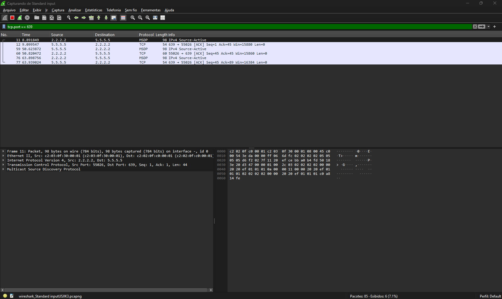  
  
Em **R05** na interface F1/0:  
  
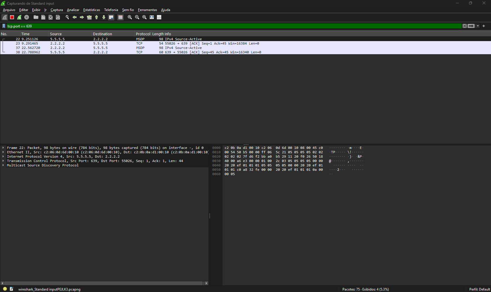  

PIM (controle multicast):

```whireshark
pim
```

Em **R02** na interface F1/0:  
  
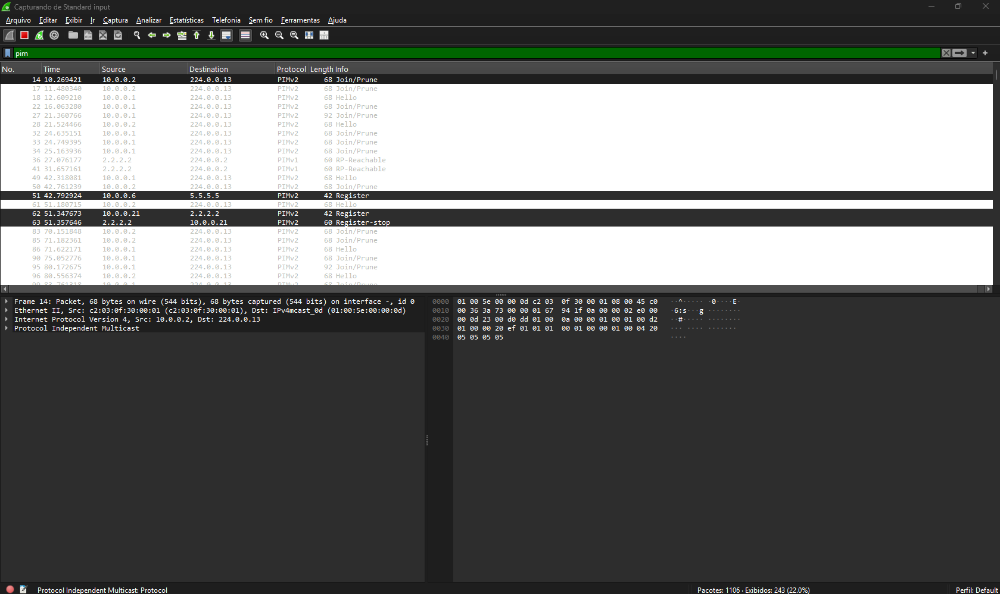  
  
Em **R05** na interface F1/0:  
  
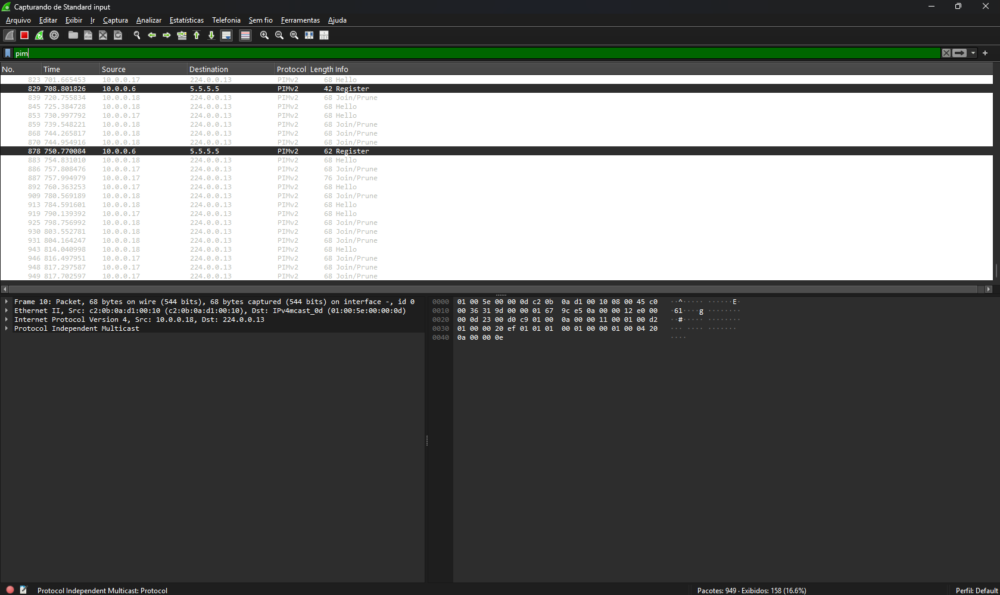

Tráfego multicast IP:

```whireshark
ip.dst >= 224.0.0.0 && ip.dst <= 239.255.255.255
```

Em **R02** na interface F1/0:  
  
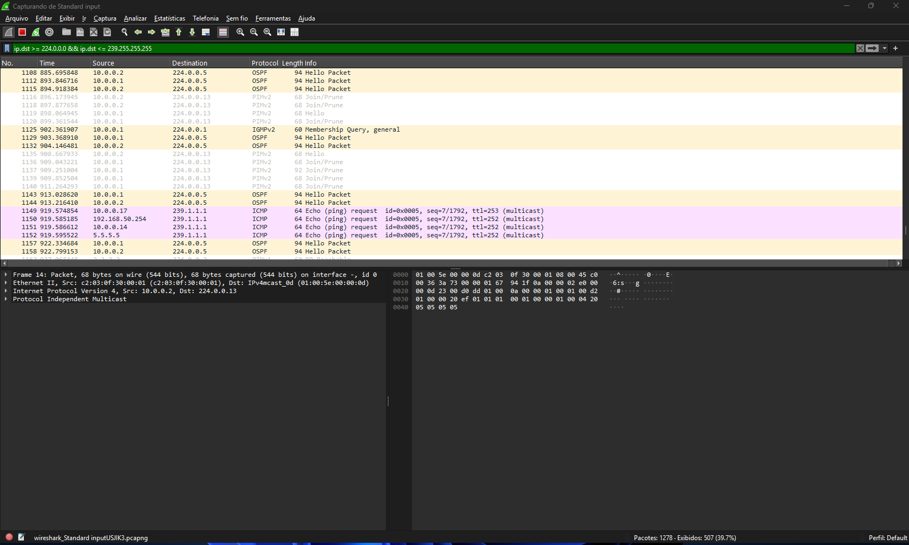  
  
Em **R05** na interface F1/0:  
  
:

```whireshark
icmp && ip.dst == 239.1.1.1
```

Em **R02** na interface F1/0:  
  
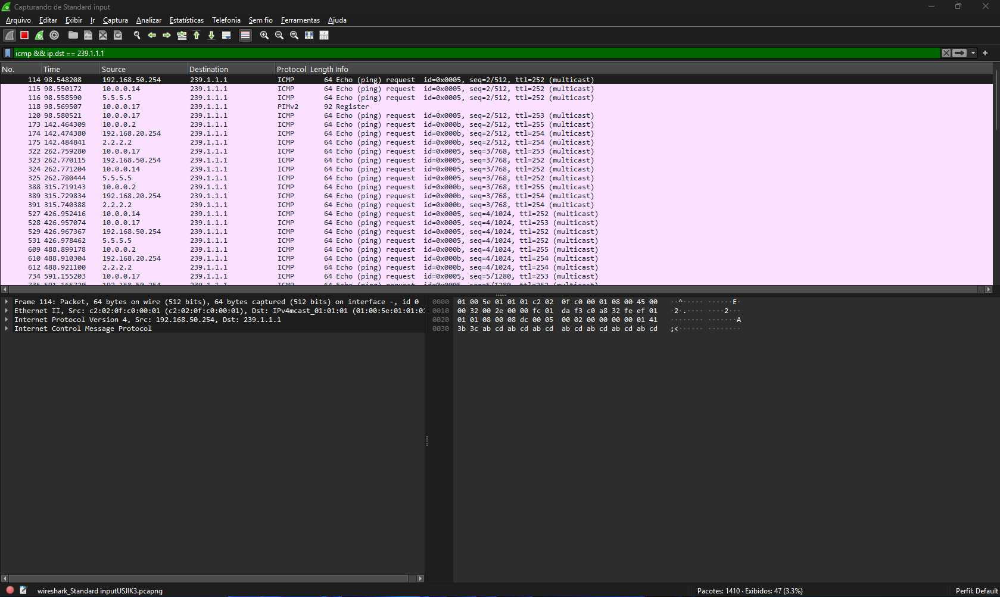  
  
Em **R05** na interface F1/0:  
  
;
- Troca de anúncios Source-Active via MSDP;
- Comunicação multicast efetiva entre domínios independentes.

Este conjunto de evidências encerra o laboratório de Multicast MSDP de forma técnica, didática e alinhada ao exame CCNP ENCOR 350-401.  

## 🛠️ Troubleshooting — PIM BIDIR → ASM + MSDP
  
Esta seção consolida os **sintomas observados durante a Parte 02 do laboratório**, onde o cenário evolui deliberadamente de **PIM BIDIR para PIM Sparse Mode (ASM)** com o objetivo de **viabilizar a troca de informações entre domínios via MSDP**.  
  
Diferente da Parte 01, aqui o foco do troubleshooting não está em limitações do Sparse Mode em si, mas na **relação direta entre modelo multicast, plano de controle (MSDP) e conectividade unicast (IGP)**.  
  
| **Sintoma Observado**                 | **Interpretação Técnica**                        | **Comandos de Verificação**      | **Observação Importante**                     |
|---------------------------------------|--------------------------------------------------|----------------------------------|-----------------------------------------------|
| **Ping multicast funciona localmente**| O domínio ASM cria corretamente entradas *(S,G)* | `show ip mroute`                 | Valida funcionamento interno do domínio       |
| **SA-cache vazio inicialmente**       | Não há anúncio MSDP sem sessão TCP estabelecida  | `show ip msdp sa-cache`          | SA depende de conectividade unicast entre RPs |
| **Sessão MSDP em estado Down / Listen**| Falha de reachability IP entre loopbacks dos RPs | `show ip msdp peer` / `show ip route <RP>` | MSDP depende exclusivamente do IGP |
| **Ausência de TCP porta 639 no Wireshark**| Sessão MSDP nunca foi estabelecida           | Wireshark (`tcp.port == 639`)    | MSDP não tenta SA sem sessão ativa            |
| **Entradas (S,G) presentes sem SA**   | ASM local funcional, mas sem propagação inter-domínio | `show ip mroute`            | Controle-plane isolado por falha unicast      |
| **Ping multicast gera múltiplas respostas** | ICMP multicast funciona como gerador de tráfego | `ping <G> source loopback`  | Ferramenta de estímulo, não valida MSDP       |
  
### 🧠 Consideração final de troubleshooting
  
Os sintomas observados **não indicam erro de configuração multicast**, mas sim um **problema estrutural de conectividade unicast**, essencial para o funcionamento do MSDP.  
  
Enquanto o **PIM ASM** foi corretamente ativado e passou a gerar estados *(S,G)*, o **MSDP permaneceu inoperante** até que a **conectividade completa entre as loopbacks dos RPs fosse garantida via OSPF**.  
  
Este comportamento evidencia que:
  
- Multicast pode funcionar **localmente** mesmo com o plano de controle inter-domínio quebrado;
- MSDP é extremamente sensível a falhas no **IGP**;
- O problema não está no PIM, mas na **base unicast que sustenta o controle-plane**.
  
---
  
## 🧩 O que aprendemos com este laboratório (PIM BIDIR → ASM + MSDP)
  
A Parte 02 do laboratório demonstrou, de forma prática e progressiva, como o **modelo multicast escolhido define os limites operacionais do ambiente**.  
  
Inicialmente, o uso de **PIM BIDIR** isolou intencionalmente os domínios multicast, evidenciando que este modelo **não gera entradas (S,G)** e, portanto, **não é compatível com MSDP**.  
  
A transição consciente para **PIM Sparse Mode (ASM)** permitiu:  

- Criação explícita de estados *(S,G)*;
- Geração de anúncios **Source-Active (SA)**;
- Preparação do ambiente para interconexão entre domínios via MSDP.
  
No entanto, o laboratório também mostrou que **ASM + MSDP só funciona quando a conectividade unicast é perfeita**, reforçando a dependência absoluta do MSDP em relação ao IGP.  
  
---

## 🎯 Principais aprendizados

| Tópico                               | Conceito-chave                                  |
| ------------------------------------ | ----------------------------------------------- |
| BIDIR isola domínios por definição   | BIDIR trabalha apenas com *(*,G)* e não gera SA |
| MSDP depende de *(S,G)*              | Sem ASM, não existe troca de fontes             |
| ASM viabiliza MSDP                   | A ausência de `bidir` permite geração de SA     |
| MSDP é puramente controle-plane      | Não cria forwarding multicast                   |
| IGP é pré-requisito absoluto         | Sem rota entre loopbacks, MSDP não sobe         |
| Ping multicast não valida MSDP       | Apenas gera tráfego para testes                 |
| Wireshark evidencia falha estrutural | Ausência de TCP 639 indica falha unicast        |
| Multicast falha silenciosamente      | Controle-plane pode falhar sem logs claros      |
| Design é mais crítico que comandos   | Multicast é decisão arquitetural                |

---

## 💡 Conclusões gerais

- **PIM BIDIR** é adequado para cenários intra-domínio, mas **incompatível com MSDP**;
- **PIM ASM** é obrigatório para troca de fontes entre domínios multicast;
- **MSDP não tolera falhas no IGP** e depende de reachability total entre RPs;
- Multicast pode aparentar funcionamento mesmo com o controle-plane quebrado;
- O laboratório demonstra que **multicast exige visão sistêmica**, integrando PIM, MSDP e roteamento unicast.
  
📌 Com esta etapa concluída, o laboratório atinge seu objetivo: demonstrar, de forma prática, **por que BIDIR isola domínios**, **como ASM viabiliza MSDP**, e **por que o IGP é o verdadeiro alicerce do controle multicast inter-domínio**.  

## 📘 Tabela de Comandos

Esta seção consolida a Parte 02 do laboratório, onde o Domínio B foi convertido para PIM Sparse Mode (ASM), eliminando BIDIR e mantendo um modelo RP-centric clássico, com integração interdomínios via MSDP.

### 🖥️ Função — R01 no plano de dados PIM Sparse Mode (LAB02 — Domínio Multicast Integrado)

> **Contexto LAB02**
> No LAB02, o R01 deixa de operar como roteador dependente de um RP remoto isolado e passa a integrar um **domínio multicast coerente**, com RPF consistente, RP alcançável via IGP e operação estável do plano de controle.

| **Seção**           | **Comando / Configuração**                | **Descrição**                                                       |
| ------------------- | ----------------------------------------- | ------------------------------------------------------------------- |
| **Global**          | `ip multicast-routing`                    | Habilita o roteamento multicast no roteador                         |
| **Global**          | `ip pim rp-address 2.2.2.2`               | Define o **RP do domínio multicast** alcançável via OSPF            |
| **Loopback0**       | `ip address 1.1.1.1 255.255.255.255`      | Router-ID do roteador e referência estável para o plano de controle |
|                     | `ip pim sparse-mode`                      | Participação no domínio multicast PIM Sparse Mode                   |
| **FastEthernet0/0** | `ip address 192.168.10.254 255.255.255.0` | Interface LAN conectada a fontes multicast                          |
|                     | `ip pim sparse-mode`                      | Interface de entrada de tráfego multicast no domínio                |
| **FastEthernet0/1** | `ip address 10.0.0.1 255.255.255.252`     | Enlace P2P com R02 (núcleo multicast do domínio)                    |
|                     | `ip pim sparse-mode`                      | Transporte de sinalização PIM e tráfego multicast                   |
| **FastEthernet1/0** | `ip address 10.0.0.22 255.255.255.252`    | Enlace P2P com R05 (trânsito interdomínios / backbone multicast)    |
|                     | `ip pim sparse-mode`                      | Interface sujeita à verificação de RPF em direção ao RP             |
| **OSPF**            | `router ospf 100`                         | IGP responsável pela convergência unicast e cálculo correto de RPF  |
|                     | `router-id 1.1.1.1`                       | Identificador lógico do processo OSPF                               |
|                     | `network 1.1.1.1 0.0.0.0 area 0`          | Publica a Loopback no domínio OSPF                                  |
|                     | `network 10.0.0.0 0.0.0.3 area 0`         | Ativa OSPF no enlace com R02                                        |
|                     | `network 10.0.0.20 0.0.0.3 area 0`        | Ativa OSPF no enlace com R05                                        |
|                     | `network 192.168.10.0 0.0.0.255 area 0`   | Ativa OSPF na LAN das fontes multicast                              |

📌 **Observações operacionais (LAB02):**

- O R01 opera **exclusivamente como roteador de plano de dados multicast**.
- Não atua como RP nem executa MSDP.
- O cálculo de **RPF** ocorre com base na tabela unicast OSPF.
- A estabilidade do domínio multicast depende da alcançabilidade consistente do RP.
- Não há geração excessiva de logs nem estados transitórios no plano de controle.

### 📘 R02 — Rendezvous Point (RP) do Domínio Multicast A (LAB02)

| **Seção**           | **Comando / Configuração**                                | **Descrição**                                                                |
| ------------------- | --------------------------------------------------------- | ---------------------------------------------------------------------------- |
| **Global**          | `ip multicast-routing`                                    | Habilita o roteamento multicast no roteador                                  |
| **Global**          | `ip pim rp-address 2.2.2.2`                               | Define o próprio R02 como **RP ASM do Domínio Multicast A**                  |
| **Global**          | `ip msdp peer 5.5.5.5 connect-source Loopback0`           | Estabelece sessão MSDP com o RP do Domínio B para troca de SA messages       |
| **Loopback0**       | `ip address 2.2.2.2 255.255.255.255`                      | Endereço lógico do RP, Router-ID OSPF e origem da sessão MSDP                |
|                     | `ip pim sparse-mode`                                      | Habilita PIM Sparse Mode (ASM) na interface                                  |
| **FastEthernet0/0** | `ip address 192.168.20.254 255.255.255.0`                 | Interface LAN local do Domínio A (hosts multicast)                           |
|                     | `ip pim sparse-mode`                                      | Interface participante do domínio multicast ASM                              |
| **FastEthernet0/1** | `ip address 10.0.0.2 255.255.255.252`                     | Link P2P com R01                                                             |
|                     | `ip pim sparse-mode`                                      | Transporte de sinalização PIM e tráfego multicast                            |
| **FastEthernet1/0** | `ip address 10.0.0.5 255.255.255.252`                     | Link P2P com R03 (interligação intra-domínio / caminho RPF)                  |
|                     | `ip pim sparse-mode`                                      | Transporte de sinalização PIM e tráfego multicast                            |
| **OSPF**            | `router ospf 100`                                         | IGP utilizado para convergência unicast e cálculo de RPF                     |
|                     | `router-id 2.2.2.2`                                       | Router-ID do processo OSPF                                                   |
|                     | `network 2.2.2.2 0.0.0.0 area 0`                          | Ativa OSPF na Loopback                                                       |
|                     | `network 10.0.0.0 0.0.0.3 area 0`                         | Ativa OSPF no enlace com R01                                                 |
|                     | `network 10.0.0.4 0.0.0.3 area 0`                         | Ativa OSPF no enlace com R03                                                 |
|                     | `network 192.168.20.0 0.0.0.255 area 0`                   | Ativa OSPF na LAN local                                                      |
| **Acesso**          | `username cisco privilege 15 password cisco`              | Credencial local para acesso administrativo                                  |
|                     | `line vty 0 4` / `login local` / `transport input telnet` | Permite acesso Telnet para troubleshooting e observação do plano de controle |

📌 **Resumo funcional no LAB02**

- O R02 atua como **RP ASM estável** do Domínio Multicast A;
- Mantém sessão **MSDP ativa** com o RP do Domínio B (R05);
- É responsável por **gerar e anunciar SAs** quando fontes multicast estiverem ativas;
- Participa plenamente do **plano de dados e do plano de controle**, sem comportamento BIDIR;
- Serve como ponto central para validação de **RPF, (S,G) e anúncios MSDP** durante os testes finais do laboratório.

### 📙 R03 — Roteador de Trânsito no Domínio Multicast (PIM Sparse Mode + MSDP)

| **Seção**           | **Comando / Configuração**                | **Descrição**                                                              |
| ------------------- | ----------------------------------------- | -------------------------------------------------------------------------- |
| **Global**          | `ip multicast-routing`                    | Habilita o roteamento multicast no roteador                                |
| **Global**          | `ip pim rp-address 5.5.5.5`               | Define o **RP do domínio multicast ao qual o R03 pertence**                |
| **Loopback0**       | `ip address 3.3.3.3 255.255.255.255`      | Router-ID utilizado pelo OSPF                                              |
|                     | `ip pim sparse-mode`                      | Interface participante do domínio multicast                                |
| **FastEthernet1/0** | `ip address 10.0.0.6 255.255.255.252`     | Link P2P com R02                                                           |
|                     | `ip pim sparse-mode`                      | Transporte de sinalização PIM e tráfego multicast                          |
| **FastEthernet0/0** | `ip address 10.0.0.9 255.255.255.252`     | Link P2P com R04 – trânsito multicast entre roteadores                     |
|                     | `ip pim sparse-mode`                      | Transporte de sinalização PIM e tráfego multicast                          |
| **FastEthernet0/1** | `ip address 192.168.30.254 255.255.255.0` | LAN dos hosts multicast                                                    |
|                     | `ip pim sparse-mode`                      | Interface de acesso onde ocorrem IGMP Joins                                |
| **OSPF**            | `router ospf 100`                         | Processo IGP para convergência unicast e cálculo de RPF                    |
|                     | `router-id 3.3.3.3`                       | Router-ID do processo OSPF                                                 |
|                     | `network 3.3.3.3 0.0.0.0 area 0`          | Ativa OSPF na Loopback                                                     |
|                     | `network 10.0.0.4 0.0.0.3 area 0`         | Ativa OSPF no enlace com R02                                               |
|                     | `network 10.0.0.8 0.0.0.3 area 0`         | Ativa OSPF no enlace com R04                                               |
|                     | `network 192.168.30.0 0.0.0.255 area 0`   | Ativa OSPF na LAN dos hosts                                                |
| **Função**          | —                                         | Roteador de trânsito multicast dependente do RP remoto (modelo RP-centric) |

### 📒 R04 — Roteador de Acesso aos Hosts + Roteador de Trânsito no Domínio Multicast (PIM Sparse Mode)

| **Seção**           | **Comando / Configuração**                | **Descrição**                                                             |
| ------------------- | ----------------------------------------- | ------------------------------------------------------------------------- |
| **Global**          | `ip multicast-routing`                    | Habilita o roteamento multicast no roteador                               |
| **Global**          | `ip pim rp-address 5.5.5.5`               | Define o **RP do domínio multicast** ao qual o R04 pertence               |
| **Loopback0**       | `ip address 4.4.4.4 255.255.255.255`      | Router-ID utilizado pelo OSPF                                             |
|                     | `ip pim sparse-mode`                      | Interface participante do domínio multicast                               |
| **FastEthernet0/0** | `ip address 10.0.0.10 255.255.255.252`    | Link P2P com R03 — trânsito multicast entre roteadores                    |
|                     | `ip pim sparse-mode`                      | Transporte de sinalização PIM e possível tráfego multicast                |
| **FastEthernet0/1** | `ip address 10.0.0.13 255.255.255.252`    | Link P2P com R05 — trânsito entre domínios multicast                      |
|                     | `ip pim sparse-mode`                      | Interface sujeita a verificação de RPF em direção ao RP                   |
| **FastEthernet1/0** | `ip address 192.168.40.254 255.255.255.0` | LAN dos hosts multicast                                                   |
|                     | `ip pim sparse-mode`                      | Interface de acesso onde ocorrem IGMP Joins                               |
| **OSPF**            | `router ospf 100`                         | Processo IGP para convergência unicast e cálculo de RPF                   |
|                     | `router-id 4.4.4.4`                       | Router-ID do processo OSPF                                                |
|                     | `network 4.4.4.4 0.0.0.0 area 0`          | Ativa OSPF na Loopback                                                    |
|                     | `network 10.0.0.8 0.0.0.3 area 0`         | Ativa OSPF no enlace com R03                                              |
|                     | `network 10.0.0.12 0.0.0.3 area 0`        | Ativa OSPF no enlace com R05                                              |
|                     | `network 192.168.40.0 0.0.0.255 area 0`   | Ativa OSPF na LAN dos hosts                                               |
| **Função**          | —                                         | Roteador de acesso aos hosts e trânsito multicast dependente do RP remoto |

### 📕 R05 — Rendezvous Point (RP) do Domínio Multicast + Roteador de Trânsito (PIM Sparse Mode + MSDP)

| **Seção**           | **Comando / Configuração**                      | **Descrição**                                                            |
| ------------------- | ----------------------------------------------- | ------------------------------------------------------------------------ |
| **Global**          | `ip multicast-routing`                          | Habilita o roteamento multicast no roteador                              |
| **Global**          | `ip pim rp-address 5.5.5.5`                     | Define o próprio R05 como **RP do domínio multicast**                    |
| **Global**          | `ip msdp peer 2.2.2.2 connect-source Loopback0` | Estabelece peering MSDP com o RP do outro domínio multicast              |
| **Loopback0**       | `ip address 5.5.5.5 255.255.255.255`            | Endereço lógico do RP e Router-ID do OSPF                                |
|                     | `ip pim sparse-mode`                            | Interface participante do domínio multicast                              |
| **FastEthernet0/0** | `ip address 192.168.50.254 255.255.255.0`       | LAN dos hosts multicast                                                  |
|                     | `ip pim sparse-mode`                            | Interface de acesso onde ocorrem IGMP Joins                              |
| **FastEthernet0/1** | `ip address 10.0.0.14 255.255.255.252`          | Link P2P com R04 — trânsito multicast dentro do domínio                  |
|                     | `ip pim sparse-mode`                            | Transporte de sinalização PIM e tráfego multicast                        |
| **FastEthernet1/0** | `ip address 10.0.0.17 255.255.255.252`          | Link P2P com R01 — caminho de trânsito para outros domínios              |
|                     | `ip pim sparse-mode`                            | Interface sujeita à verificação de RPF em direção às fontes              |
| **OSPF**            | `router ospf 100`                               | Processo IGP para convergência unicast e cálculo de RPF                  |
|                     | `router-id 5.5.5.5`                             | Router-ID do processo OSPF                                               |
|                     | `network 5.5.5.5 0.0.0.0 area 0`                | Ativa OSPF na Loopback                                                   |
|                     | `network 10.0.0.12 0.0.0.3 area 0`              | Ativa OSPF no enlace com R04                                             |
|                     | `network 10.0.0.16 0.0.0.3 area 0`              | Ativa OSPF no enlace com R01                                             |
|                     | `network 192.168.50.0 0.0.0.255 area 0`         | Ativa OSPF na LAN dos hosts                                              |
| **Função**          | —                                               | **RP do domínio multicast**, ponto de ancoragem do controle-plane e MSDP |

### 📗 R06 — Roteador de Acesso aos Hosts + Roteador de Trânsito (PIM Sparse Mode)

| **Seção**           | **Comando / Configuração**                | **Descrição**                                                       |
| ------------------- | ----------------------------------------- | ------------------------------------------------------------------- |
| **Global**          | `ip multicast-routing`                    | Habilita o roteamento multicast no roteador                         |
| **Global**          | `ip pim rp-address 2.2.2.2`               | Define o **RP do domínio multicast** ao qual o R06 pertence         |
| **Loopback0**       | `ip address 6.6.6.6 255.255.255.255`      | Router-ID lógico do roteador e do processo OSPF                     |
|                     | `ip pim sparse-mode`                      | Interface participante do domínio multicast                         |
| **FastEthernet0/0** | `ip address 192.168.60.254 255.255.255.0` | LAN dos hosts multicast                                             |
|                     | `ip pim sparse-mode`                      | Interface de acesso onde ocorrem IGMP Joins                         |
| **FastEthernet0/1** | `ip address 10.0.0.21 255.255.255.252`    | Link P2P de trânsito multicast                                      |
|                     | `ip pim sparse-mode`                      | Transporte de sinalização PIM e tráfego multicast                   |
| **FastEthernet1/0** | `ip address 10.0.0.18 255.255.255.252`    | Link P2P em direção ao núcleo do domínio multicast                  |
|                     | `ip pim sparse-mode`                      | Interface sujeita à verificação de RPF em direção ao RP e às fontes |
| **OSPF**            | `router ospf 100`                         | Processo IGP para convergência unicast e cálculo de RPF             |
|                     | `router-id 6.6.6.6`                       | Router-ID do processo OSPF                                          |
|                     | `network 6.6.6.6 0.0.0.0 area 0`          | Ativa OSPF na Loopback                                              |
|                     | `network 10.0.0.16 0.0.0.3 area 0`        | Ativa OSPF no enlace P2P                                            |
|                     | `network 10.0.0.20 0.0.0.3 area 0`        | Ativa OSPF no enlace P2P                                            |
|                     | `network 192.168.60.0 0.0.0.255 area 0`   | Ativa OSPF na LAN dos hosts                                         |
| **Função**          | —                                         | **Roteador de acesso**, participante do domínio multicast           |

### 🖥️ SERVER01 — Fonte Multicast no Domínio Multicast (PIM Sparse Mode + MSDP)
  
| **Seção**             | **Comando / Configuração**                 | **Descrição**                                                                   |
| --------------------- | ------------------------------------------ | ------------------------------------------------------------------------------- |
| **FastEthernet0/0**   | `ip address 192.168.10.1 255.255.255.0`    | Interface conectada ao roteador de acesso do domínio multicast                  |
|                       | `ip igmp join-group 239.1.1.1`             | Simula participação no grupo multicast para fins de teste                       |
| **Rota Padrão**       | `ip route 0.0.0.0 0.0.0.0 FastEthernet0/0` | Encaminha todo o tráfego unicast ao roteador adjacente                          |
| **Função no cenário** | —                                          | Atua como **fonte multicast**, originando tráfego para o grupo 239.1.1.1        |
| **Observação**        | —                                          | O servidor **não executa PIM ou MSDP** — apenas gera e recebe tráfego multicast |
  
📌 **Notas importantes:**  
  
- O **SERVER01 não participa do plano de controle PIM ou MSDP**.
- O host **executa IGMP apenas para simulação de interesse multicast**.
- O tráfego multicast é enviado como **IP multicast comum**, e todo o controle avançado:
  
  - eleição de caminhos
  - verificação de RPF
  - replicação do tráfego
  - ocorre **exclusivamente nos roteadores**.

- Em PIM Sparse Mode com MSDP, a fonte **não garante entrega multicast**:

  - a entrega depende da existência de **joins downstream ativos**
  - da coerência entre **RPF, RP e domínios multicast interconectados**

### 🖥️ SERVER02 — Fonte Multicast no Domínio Multicast (PIM Sparse Mode + MSDP)

| **Seção**             | **Comando / Configuração**                | **Descrição**                                                            |
| --------------------- | ----------------------------------------- | ------------------------------------------------------------------------ |
| **FastEthernet1/0**   | `ip address 192.168.40.1 255.255.255.0`   | Interface conectada ao roteador R03 — acesso ao domínio multicast        |
|                       | `ip igmp join-group 239.1.1.1`            | Simula interesse no grupo multicast para geração de tráfego              |
| **Rota Padrão**       | `ip route 0.0.0.0 0.0.0.0 192.168.40.254` | Encaminha todo o tráfego unicast ao roteador adjacente                   |
| **Função no cenário** | —                                         | Atua como **fonte multicast**, originando tráfego para o grupo 239.1.1.1 |
| **Observação**        | —                                         | O servidor **não executa PIM ou MSDP** — apenas envia tráfego multicast  |

📌 **Notas importantes:**

- O **SERVER02 não participa do plano de controle multicast**.
- Não há execução de **PIM** ou **MSDP** no host.
- O uso de `ip igmp join-group` é **apenas para simulação em laboratório**, permitindo gerar tráfego multicast.
- O servidor atua exclusivamente no **plano de dados**, enviando pacotes IP multicast.
- A construção das árvores multicast, verificação de **RPF**, associação ao **RP** e disseminação de **Source-Active (SA)** via MSDP ocorrem **somente nos roteadores**.
- Em ambientes com **PIM Sparse Mode + MSDP**, a entrega do tráfego multicast depende:

  - da existência de **receptores downstream ativos**
  - da consistência entre **RPF, RP e sessões MSDP**

### 💻 HOST01 — Receptor Multicast no Domínio Multicast (PIM Sparse Mode + MSDP)

| **Seção**             | **Comando / Configuração**                 | **Descrição**                                                            |
| --------------------- | ------------------------------------------ | ------------------------------------------------------------------------ |
| **FastEthernet0/0**   | `ip address 192.168.20.1 255.255.255.0`    | Host conectado à LAN do roteador de acesso ao domínio multicast          |
|                       | `ip igmp join-group 239.1.1.1`             | Inscrição explícita no grupo multicast (G) via IGMP                      |
| **Rota padrão**       | `ip route 0.0.0.0 0.0.0.0 FastEthernet0/0` | Encaminha todo o tráfego IP ao roteador adjacente (gateway da LAN)       |
| **Função no cenário** | —                                          | Atua como **receptor multicast**, consumindo tráfego do grupo (G)        |
| **Observação**        | —                                          | O host **não executa PIM nem MSDP** — apenas sinaliza interesse via IGMP |

📌 **Notas importantes:**

- O **HOST01 participa apenas do plano de controle local**, utilizando **IGMP**.
- A inscrição no grupo multicast ocorre no modelo **(*,G)**.
- O host **não possui conhecimento direto sobre fontes (S)** multicast.
- A seleção de fontes, verificação de **RPF**, associação ao **RP** e a troca de informações entre domínios via **MSDP** ocorrem exclusivamente nos **roteadores multicast**.
- O HOST01 passa a receber tráfego multicast **somente após a convergência do plano de controle** (IGMP + PIM no roteador adjacente).


---

Alterar Daqui

---

### 💻 HOST02 — Receptor Multicast no Domínio Multicast (PIM Sparse Mode + MSDP)

| **Seção**               | **Comando / Configuração**                 | **Descrição**                                                               |
|-------------------------|--------------------------------------------|-----------------------------------------------------------------------------|
| **FastEthernet0/0**     | `ip address 192.168.60.1 255.255.255.252`  | Host conectado à LAN do roteador de acesso ao domínio multicast             |
|                         | `ip igmp join-group 239.1.1.1`             | Inscrição no grupo multicast (G) via IGMP                                   |
| **Rota padrão**         | `ip route 0.0.0.0 0.0.0.0 FastEthernet0/0` | Encaminha todo o tráfego IP ao roteador adjacente (DR da LAN)               |
| **Função no cenário**   | —                                          | Atua como **receptor multicast**, consumindo tráfego do grupo (G)           |
| **Observação**          | —                                          | O host **não executa PIM nem MSDP** — apenas sinaliza interesse via IGMP    |

📌 **Notas importantes:**

- O **HOST02 participa apenas do plano de controle local**, utilizando **IGMP**.
- A inscrição multicast ocorre no modelo **(*,G)**, independente da fonte.
- O host **não tem conhecimento das fontes (S)** nem do RP.
- A descoberta de fontes, construção da árvore multicast e a troca de
  informações entre domínios via **MSDP** acontecem exclusivamente nos
  **roteadores multicast**.
- O recebimento do tráfego multicast depende da convergência correta do
  **IGP (OSPF)** e do **plano multicast** no domínio.

### 💻 HOST03 — Receptor Multicast no Domínio Multicast (PIM Sparse Mode + MSDP)

| **Seção**               | **Comando / Configuração**                | **Descrição**                                                               |
|-------------------------|-------------------------------------------|-----------------------------------------------------------------------------|
| **FastEthernet0/0**     | `ip address 192.168.30.1 255.255.255.0`   | Host conectado à LAN do roteador de acesso (R05)                            |
|                         | `ip igmp join-group 239.1.1.1`            | Inscrição no grupo multicast (G) via IGMP                                   |
| **Rota padrão**         | `ip route 0.0.0.0 0.0.0.0 FastEthernet0/0`| Encaminha todo o tráfego IP ao roteador adjacente                           |
| **Função no cenário**   | —                                         | Atua como **receptor multicast**, consumindo tráfego do grupo (G)           |
| **Observação**          | —                                         | O host **não executa PIM nem MSDP** — apenas sinaliza interesse via IGMP    |

📌 **Notas importantes:**

- O **HOST03 participa exclusivamente do plano de controle local**, utilizando **IGMP**.
- A inscrição multicast ocorre no modelo **(*,G)**, sem qualquer conhecimento da fonte (**S**).
- A seleção de fontes, construção da árvore multicast e a troca de informações
  entre domínios são responsabilidades dos **roteadores multicast**, através de
  **PIM Sparse Mode** e **MSDP**.
- O host permanece completamente **agnóstico ao RP**, à topologia multicast e
  à origem real do tráfego multicast recebido.

### 💻 HOST04 — Receptor Multicast no Domínio Multicast (PIM Sparse Mode + MSDP)
 
| **Seção**               | **Comando / Configuração**                | **Descrição**                                                               |
|-------------------------|-------------------------------------------|-----------------------------------------------------------------------------|
| **FastEthernet0/0**     | `ip address 192.168.50.1 255.255.255.0`   | Host conectado à LAN do roteador de acesso                                  |
|                         | `ip igmp join-group 239.1.1.1`            | Inscrição no grupo multicast (G) via IGMP                                   |
| **Rota padrão**         | `ip route 0.0.0.0 0.0.0.0 FastEthernet0/0`| Encaminha todo o tráfego IP ao roteador adjacente                           |
| **Função no cenário**   | —                                         | Atua como **receptor multicast**, recebendo tráfego do grupo (G)            |
| **Observação**          | —                                         | O host **não executa PIM nem MSDP** — apenas sinaliza interesse via IGMP    |

📌 **Notas importantes:**

- O **HOST04 participa apenas do plano de controle local**, utilizando **IGMP**.
- A inscrição multicast ocorre no modelo **(*,G)**, sem conhecimento da fonte (**S**).
- A seleção da fonte multicast e o transporte interdomínios são responsabilidades
  exclusivas dos **roteadores multicast**, por meio de **PIM Sparse Mode** e **MSDP**.
- O host permanece totalmente **agnóstico ao RP**, à topologia multicast e à
  existência de múltiplos domínios multicast.

### 🔚 Encerramento da Parte 01 e Transição para a Parte 02

Nesta primeira etapa do laboratório, o foco foi compreender o funcionamento do multicast em um cenário controlado, explorando a interação entre **PIM Sparse Mode**, **RPs distintos** e **MSDP**, bem como os impactos dessas decisões no **control-plane** e no **data-plane**.  
  
O ambiente foi propositalmente construído para evidenciar comportamentos operacionais, gerar logs relevantes e expor limitações naturais de um design ainda não otimizado — servindo como base didática para análise e validação conceitual.  
  
Na **Parte 02**, seguiremos com **o mesmo laboratório**, porém ajustando-o para um **cenário mais próximo da realidade de produção**, onde:
  
- os domínios multicast estarão corretamente integrados,
- o uso de MSDP será funcional e silencioso,
- não haverá geração de logs desnecessários,
- e todos os hosts multicast passarão a receber tráfego de forma consistente.
  
A próxima etapa tem como objetivo transformar um cenário apenas funcional em um ambiente **estável, previsível e operacionalmente limpo**, demonstrando a evolução natural do design multicast.  
