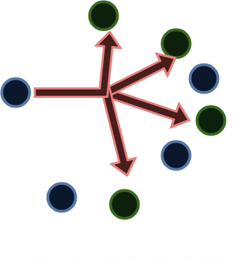

# 01 - Multicast

Agora para falar sobre o tipo de comunicação **unicast** é preciso se fazer uma pequena revisão. Então primeiramente vamos observar os tipos de comunicação existentes.

| UNICAST                         | BROADCAST                            | MULTICAST                                     |
|---------------------------------|--------------------------------------|-----------------------------------------------|
|  |   |            |

Como podemos observar, quando o tráfego vai de um emissor para um receptor podemos chamar de **unicast**, ou seja, é um trafego direto. Um exemplo que podemos citar desse tipo de comunicação é a ligação telefônica por exemplo, ou mesmo quando se faz um acesso via ssh para algum equipamento.   

Depois temos o **broadcast**. Diferente do primeiro tipo de comunicação, esse é um tipo de comunicação onde um envia e todos recebem. Podemos citar o exemplo do protocolo arp onde os equipamentos precisam mapear o endereço mac com o endereço IP. Para o protocolo arp poder descobrir a quem pertence um endereço IP por exemplo, ele faz um "flood" para todos os equipamentos na rede e com isso a comunicação se dá de forma conhecida por **broadcast**.   

Agora se analisarmos bem esses dois tipos de comunicação iremos perceber que no unicast a comunicação se dá de uma forma mais eficiente pois ela entrega os pacotes somente para o destinatário escolhido. Já no broadcst, todos recebe os pacotes independentemente se eles precisam ou não receber tal pacote. Isso faz com que o host que receba o pacote tenha que analisar o mesmo, verificar se ele é o destinatário e se não for, descartar o mesmo. Essa forma de comunicação não é muito eficiente pois em ambientes muito grandes ocupa banda muitas vezes desnecessárias e faz com que o host tenha que processar o pacote e consumir memória e processador.   

Pensando nisso, foi desenvolvido o **multicast**. Agora, nesse tipo de comunicação, existe uma fonte de envio de dados mas somente um grupo, ou grupos de hosts que irão receber esses dados. Com isso, o consumo de banda do meio é utilizada de forma mais eficiente e não força quem não tem que fazer parte da conversa receber dados indesejados.   

## Faixas de Endereçamento IP

### **IPV4**

| Classe de IP             | Faixa de Endereçamento         |
|--------------------------|--------------------------------|
| Classe A	               | 0.0.0.0 a 127.255.255.255      |  
| Classe B	               | 128.0.0.0 a 191.255.255.255    |
| Classe C	               | 192.0.0.0 a 223.255.255.255    |
| **Classe D (Multicast)** | **224.0.0.0 a 239.255.255.255**|
| Classe E (Reservado)     | 240.0.0.0 a 247.255.255.255    |

  

### **IPV6**

| Tipo de Endereço	   |  Faixa de Endereçamento |	Descrição                                                                                                                          |
| ------------------   | ------------------- | ----------------------------------------------------------------------------------------------------------------------------------------|
| Unicast Global       |  2000::/3           | Usado para comunicação unicast na Internet. É equivalente aos endereços públicos no IPv4.                                               |
| Unicast Link-Local   |  FE80::/10	         | Usado para comunicação dentro de um link (como em uma LAN). Esses endereços são configurados automaticamente em cada interface de rede. |
| Unicast Unique Local |  FC00::/7	         | Endereços para redes privadas (semelhante a 192.168.0.0/16 no IPv4).                                                                    |
| Multicast	           |  FF00::/8           | Usado para comunicação multicast.                                                                                                       |
| Anycast              | Derivado de unicast | Endereços unicast atribuídos a vários nós, mas roteados para o mais próximo.                                                            |
| Loopback	                | ::1            | Endereço para a própria máquina (equivalente a 127.0.0.1 no IPv4).                                                                      |
| Endereço Não Especificado	| ::	         | Indica ausência de endereço (usado como fonte em algumas situações, como durante a autoconfiguração).                                   |
| Reservado	           |4000::/2, 6000::/3 e outras faixas | Reservado pela IETF para uso futuro.                                                                                      |
| Embedded IPv4	       | ::FFFF:0:0/96 e 2002::/16 | Usado para compatibilidade com IPv4, como no caso de NAT64 (endereço mapeado para IPv4) ou redes 6to4.                            |

**Destaques sobre a tabela:**   

* **Unicast Global:** Utilizado para endereços roteáveis na Internet.
* **Link-Local:** Necessário para operações básicas dentro de uma rede local; todos os dispositivos IPv6 têm um endereço link-local automaticamente.
* **Multicast:** Substitui a funcionalidade de broadcast no IPv6.
* **Loopback:** Para testes internos no dispositivo.