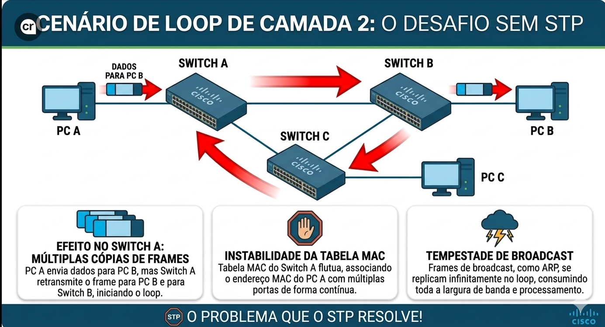
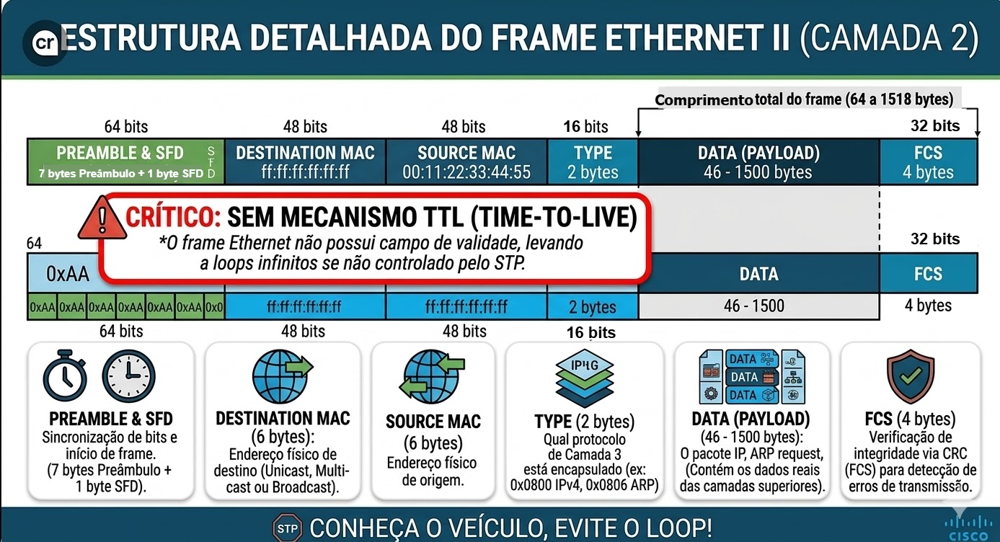
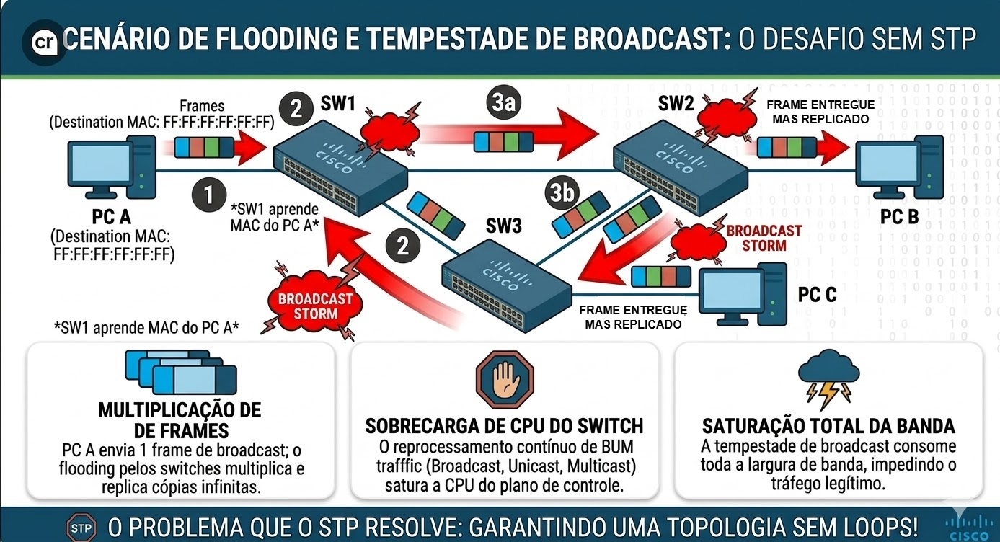
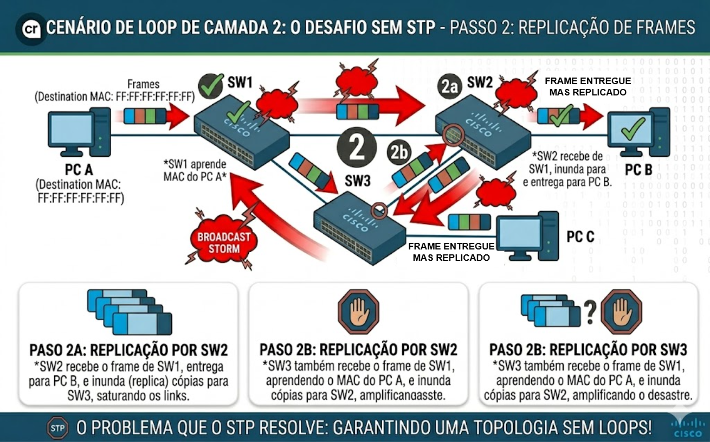
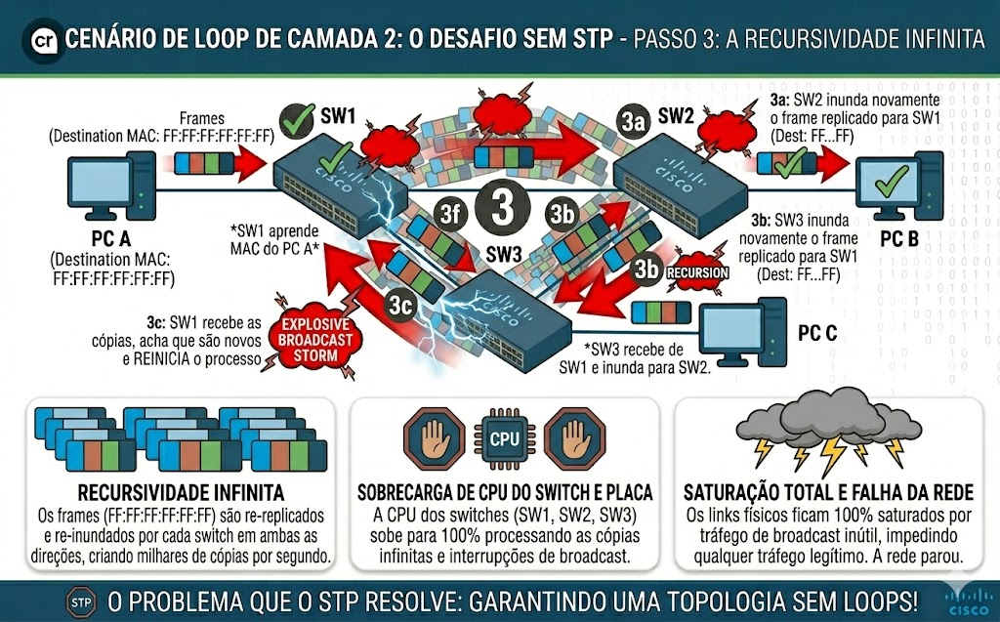
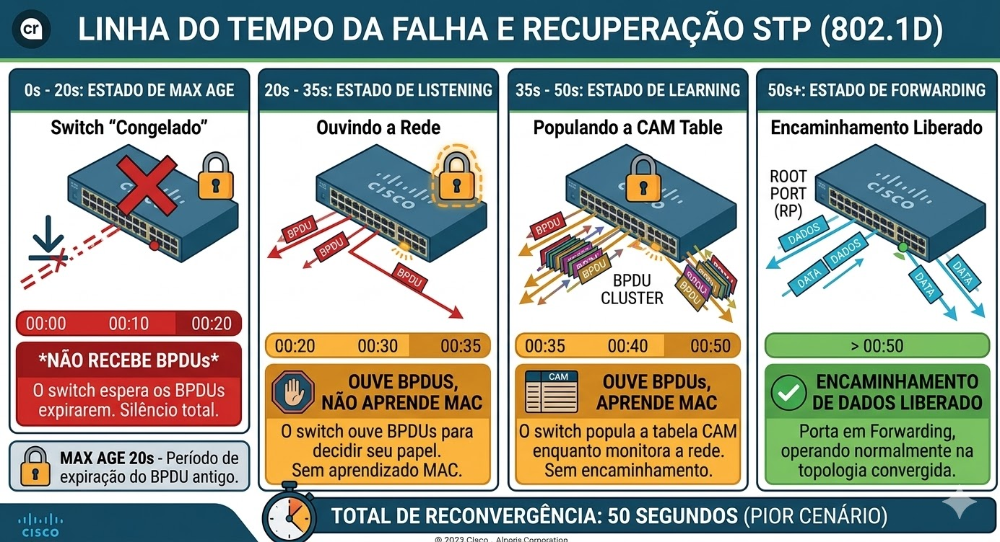
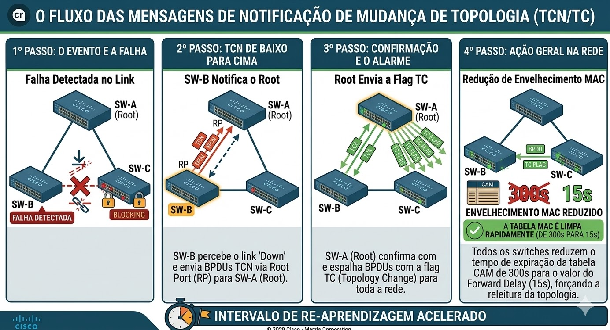

# 02 - Layer 2 Infrastructure: Spanning Tree Protocol (STP) - Revisão

- [02 - Layer 2 Infrastructure: Spanning Tree Protocol (STP) - Revisão](#02---layer-2-infrastructure-spanning-tree-protocol-stp---revisão)
  - [Glossário Técnico do STP (Dicionário de Camada 2)](#glossário-técnico-do-stp-dicionário-de-camada-2)
    - [Por que diferenciar Bridge ID de Root ID?](#por-que-diferenciar-bridge-id-de-root-id)
  - [Spanning Tree Protocol (STP) – Fundamentos](#spanning-tree-protocol-stp--fundamentos)
  - [🎯 Objetivo do Documento](#-objetivo-do-documento)
  - [Como Este Documento Deve Ser Lido](#como-este-documento-deve-ser-lido)
  - [Contexto](#contexto)
  - [O Problema: Anatomia do Loop de Layer 2](#o-problema-anatomia-do-loop-de-layer-2)
  - [Transição: Do Problema à Solução](#transição-do-problema-à-solução)
  - [Anatomia e Comportamento do Frame Ethernet (Camada 2)](#anatomia-e-comportamento-do-frame-ethernet-camada-2)
  - [O Frame Ethernet e a Ausência de TTL](#o-frame-ethernet-e-a-ausência-de-ttl)
  - [Comportamento do Switch: O Plano de Dados](#comportamento-do-switch-o-plano-de-dados)
  - [A Mecânica do Desastre: Como o Frame Causa o Loop](#a-mecânica-do-desastre-como-o-frame-causa-o-loop)
  - [Passo a Passo da Tempestade de Broadcast](#passo-a-passo-da-tempestade-de-broadcast)
    - [Passo 1: A Gênese (SW1)](#passo-1-a-gênese-sw1)
    - [Passo 2: A Replicação (SW2 e SW3)](#passo-2-a-replicação-sw2-e-sw3)
    - [Passo 3: A Recursividade Infinita](#passo-3-a-recursividade-infinita)
  - [O Padrão IEEE 802.1D](#o-padrão-ieee-8021d)
  - [A Solução - Criação do STP](#a-solução---criação-do-stp)
  - [Funcionamento do Spanning Tree Protocol (STP)](#funcionamento-do-spanning-tree-protocol-stp)
  - [Passos de Funcionamento (Eleição e Convergência)](#passos-de-funcionamento-eleição-e-convergência)
    - [1. Eleição do Root Bridge (Ponto Central)](#1-eleição-do-root-bridge-ponto-central)
    - [2. Eleição das Root Ports (Caminho mais curto)](#2-eleição-das-root-ports-caminho-mais-curto)
    - [3. Eleição das Designated Ports por Segmento](#3-eleição-das-designated-ports-por-segmento)
    - [4. Bloqueio de Portas Sobressalentes (Loop Prevention)](#4-bloqueio-de-portas-sobressalentes-loop-prevention)
    - [Tabela de Custos de Caminho (STP Path Cost)](#tabela-de-custos-de-caminho-stp-path-cost)
  - [Transição: Como as Decisões São Aplicadas](#transição-como-as-decisões-são-aplicadas)
  - [Estados de Porta no STP Clássico (802.1D)](#estados-de-porta-no-stp-clássico-8021d)
    - [Por que essa demora? (Os Timers)](#por-que-essa-demora-os-timers)
  - [A Engenharia da Decisão: BPDUs e o Bridge ID (BID)](#a-engenharia-da-decisão-bpdus-e-o-bridge-id-bid)
  - [1. O que é o BPDU? (O "Bilhete" de Eleição)](#1-o-que-é-o-bpdu-o-bilhete-de-eleição)
    - [Campos Principais do BPDU](#campos-principais-do-bpdu)
  - [2. A Anatomia do Bridge ID (BID)](#2-a-anatomia-do-bridge-id-bid)
    - [Exemplo Prático de Cálculo de BID](#exemplo-prático-de-cálculo-de-bid)
  - [3. O Processo de Eleição do Root Bridge (Passo a Passo)](#3-o-processo-de-eleição-do-root-bridge-passo-a-passo)
    - [Cenário de Exemplo](#cenário-de-exemplo)
  - [4. Influenciando a Eleição (Best Practices)](#4-influenciando-a-eleição-best-practices)
  - [Eleição das Root Ports (RP)](#eleição-das-root-ports-rp)
  - [Os 4 Critérios de Desempate (Tie-breakers)](#os-4-critérios-de-desempate-tie-breakers)
    - [1. Menor Root Path Cost (Custo Acumulado)](#1-menor-root-path-cost-custo-acumulado)
    - [2. Menor Sender Bridge ID (BID do Vizinho)](#2-menor-sender-bridge-id-bid-do-vizinho)
    - [3. Menor Sender Port Priority (Prioridade da Porta do Vizinho)](#3-menor-sender-port-priority-prioridade-da-porta-do-vizinho)
    - [4. Menor Sender Port Number (Número da Porta do Vizinho)](#4-menor-sender-port-number-número-da-porta-do-vizinho)
  - [Influenciando a Eleição: O Papel do Administrador](#influenciando-a-eleição-o-papel-do-administrador)
    - [A Lógica da Influência](#a-lógica-da-influência)
  - [Tabela de Decisão Mental do Switch](#tabela-de-decisão-mental-do-switch)
  - [Os Papéis das Portas (STP Port Roles)](#os-papéis-das-portas-stp-port-roles)
    - [1. Root Port (RP) - "O Caminho de Volta"](#1-root-port-rp---o-caminho-de-volta)
    - [2. Designated Port (DP) - "O Dono da Rua"](#2-designated-port-dp---o-dono-da-rua)
    - [3. Non-Designated / Alternate Port - "O Disjuntor"](#3-non-designated--alternate-port---o-disjuntor)
  - [Resumo de Comportamento](#resumo-de-comportamento)
    - [Por que isso é importante antes da eleição?](#por-que-isso-é-importante-antes-da-eleição)
  - [Tipos de Porta no STP: Roles vs States](#tipos-de-porta-no-stp-roles-vs-states)
    - [Papéis e Estados: A Hierarquia de Decisão](#papéis-e-estados-a-hierarquia-de-decisão)
    - [Roles (Papéis das Portas)](#roles-papéis-das-portas)
    - [States (Estados das Portas)](#states-estados-das-portas)
      - [States (A Jornada até o Forwarding)](#states-a-jornada-até-o-forwarding)
  - [Timers do STP](#timers-do-stp)
  - [Os Timers do STP (A Cronometria da Convergência)](#os-timers-do-stp-a-cronometria-da-convergência)
    - [1. Hello Time (2 segundos)](#1-hello-time-2-segundos)
    - [2. Max Age (20 segundos)](#2-max-age-20-segundos)
    - [3. Forward Delay (15 segundos)](#3-forward-delay-15-segundos)
  - [O Cálculo dos 50 Segundos (O Pior Cenário)](#o-cálculo-dos-50-segundos-o-pior-cenário)
  - [Tabela de Resumo dos Timers (Padrão IEEE 802.1D)](#tabela-de-resumo-dos-timers-padrão-ieee-8021d)
    - [Por que os Timers são configurados apenas no Root?](#por-que-os-timers-são-configurados-apenas-no-root)
  - [Operação Contínua e Detecção de Falhas](#operação-contínua-e-detecção-de-falhas)
  - [1. Falha Direta vs. Falha Indireta](#1-falha-direta-vs-falha-indireta)
  - [2. O Mecanismo TCN (Topology Change Notification)](#2-o-mecanismo-tcn-topology-change-notification)
    - [Como o TCN resolve isso](#como-o-tcn-resolve-isso)
  - [3. Resumo da Fase 3 (Operação)](#3-resumo-da-fase-3-operação)
  - [Cenários Problemáticos e Falhas do STP](#cenários-problemáticos-e-falhas-do-stp)
  - [1. Root Bridge Inadequado (O "Líder Fraco")](#1-root-bridge-inadequado-o-líder-fraco)
  - [2. Loops de Camada 2 (Broadcast Storm)](#2-loops-de-camada-2-broadcast-storm)
  - [3. Falhas Unidirecionais (O "Link Fantasma")](#3-falhas-unidirecionais-o-link-fantasma)
  - [4. Inconsistência de Porta (PVID Inconsistent)](#4-inconsistência-de-porta-pvid-inconsistent)
  - [Tabela de Sintomas de Falha no STP](#tabela-de-sintomas-de-falha-no-stp)
  - [Consolidação do Conhecimento](#consolidação-do-conhecimento)
  - [Próxima Etapa: Laboratórios](#próxima-etapa-laboratórios)

---

## Glossário Técnico do STP (Dicionário de Camada 2)

Os termos abaixo são fundamentais para o entendimento do STP e serão utilizados ao longo do documento.  
Para dominar a operação do Spanning Tree e não se perder nos comandos de `show`, é essencial diferenciar os seguintes conceitos:

| Termo               | Significado Técnico | Analogia Didática |
| :---                | :--- | :--- |
| **BPDU** | *Bridge Protocol Data Unit*. O frame de controle (multicast) que carrega as informações do STP. | O "currículo" ou "cartão de visitas" que o switch entrega ao vizinho. |
| **Bridge ID (BID)** | A identidade única de **UM** switch, composta por `Prioridade + VLAN + MAC`.                  | O "RG" ou "CPF" do switch na rede.                     |
| **Root ID**         | O Bridge ID do switch que o remetente acredita ser o "líder" (Root) da rede.                  | O nome do "Presidente" que o switch reconhece no momento. |
| **Root Bridge**     | O switch central da topologia, eleito por possuir o **menor Bridge ID**.                      | O "Topo da Árvore" ou o ponto central de referência.   |
| **Path Cost**       | O valor de custo individual de uma interface (ex: 1Gbps = 4).                                 | O valor do "pedágio" de uma única estrada.             |
| **Root Path Cost**  | A soma acumulada de todos os *Path Costs* desde o switch local até o Root Bridge.             | O valor total gasto em pedágios para chegar à capital. |
| **Hello Time**      | Intervalo padrão de envio de BPDUs pelo Root Bridge (Padrão: 2 segundos).                     | O "batimento cardíaco" (Heartbeat) da rede.            |
| **Max Age**         | Tempo que um switch espera sem receber BPDUs antes de declarar falha no Root (Padrão: 20s).   | O tempo de "espera na linha" antes de considerar que a ligação caiu. |
| **Forward Delay**   | Tempo de permanência nos estados intermediários (*Listening* e *Learning*). Padrão: 15s cada. | A "quarentena" de segurança para evitar loops temporários. |
| **Designated Port** | Porta responsável por encaminhar tráfego em um segmento | A “porta oficial” que representa o segmento |
| **Alternate Port** | Porta alternativa que pode assumir em caso de falha | Um caminho reserva, como um desvio de trânsito |
| **Blocking** | Estado onde a porta não encaminha tráfego | Rua bloqueada para evitar congestionamento |
| **Listening** | Estado onde a porta participa do STP mas não aprende MAC | Observando o trânsito antes de liberar passagem |
| **Learning** | Estado onde a porta aprende MAC mas não encaminha | Aprendendo rotas antes de começar a operar |
| **Forwarding** | Estado onde a porta encaminha tráfego normalmente | Trânsito fluindo normalmente |
| **Path Cost** | Métrica usada para calcular o melhor caminho até o root | Custo de pedágio ou distância de um caminho |
| **Hello Time** | Intervalo de envio de BPDUs | Como um “check-in” periódico dizendo “estou aqui” |
| **Max Age** | Tempo para considerar uma informação inválida | Tempo para considerar que alguém “sumiu” |
| **Forward Delay** | Tempo gasto nos estados Listening e Learning | Tempo de preparação antes de liberar o caminho |
| **Topology Change (TCN)** | Evento que indica mudança na topologia | Aviso de que “algo mudou na estrada” |
| **Convergência** | Tempo necessário para estabilizar a rede após mudança | Tempo para reorganizar o trânsito após um acidente |
| **Loop de Camada 2** | Caminho redundante que causa tráfego circular infinito | Um carro rodando em círculo sem saída |
| **Broadcast Storm** | Tempestade de tráfego broadcast causada por loops | Engarrafamento gigante causado por caos no trânsito |
| **MAC Flapping** | Mudança constante de MAC entre portas devido a loop | Pessoa aparecendo em vários lugares ao mesmo tempo |

---

### Por que diferenciar Bridge ID de Root ID?

No comando `show spanning-tree`, você verá dois blocos de informações:

1. **Root ID:** Informa quem é o dono da rede (o Root Bridge) e qual o custo para chegar nele.
2. **Bridge ID:** Informa os dados do switch que você está configurando no momento.

Se o `Root ID` e o `Bridge ID` forem iguais, parabéns: **este switch é o Root Bridge.**

> **Dica de Prova:** O STP não "vê" endereços IP. Toda a eleição e cálculo de caminhos baseiam-se estritamente nestes termos acima.

---

## Spanning Tree Protocol (STP) – Fundamentos

Em redes Ethernet, redundância é necessária — mas pode ser destrutiva.

A simples adição de um link redundante pode levar a:

- Broadcast Storms
- Instabilidade de tabela MAC
- Interrupção total da rede

Este documento tenta explicar, de forma estruturada, como o STP resolve esse problema.

## 🎯 Objetivo do Documento

Este documento tem como objetivo construir uma base sólida e aprofundada sobre o funcionamento do Spanning Tree Protocol (STP – IEEE 802.1D), fundamental para a compreensão de redes de Camada 2 em ambientes com redundância.  
  
Diferente de abordagens focadas apenas em comandos, este material prioriza o entendimento completo do comportamento da rede, explicando não apenas o que o STP faz, mas principalmente por que ele é necessário e como ele atua para evitar falhas críticas.  
  
A proposta é desenvolver um raciocínio técnico estruturado, seguindo três pilares principais:
  
- **Entendimento Conceitual:** Compreender os fundamentos do Ethernet, o funcionamento dos switches e as causas reais dos loops de camada 2.
- **Simulação Mental:** Analisar cenários de rede de forma lógica, prevendo o comportamento do STP, incluindo eleição de Root Bridge, definição de custos e papéis das portas.
- **Validação Prática (etapa posterior):** Aplicar os conceitos em laboratório, validando o comportamento observado por meio de comandos e análise de saída (CLI).
  
Este material serve como base para a evolução natural para tecnologias mais avançadas, como Rapid Spanning Tree Protocol (RSTP – IEEE 802.1w) e Multiple Spanning Tree Protocol (MSTP – IEEE 802.1s), amplamente cobradas na certificação CCNP ENCOR 350-401.  
  
Ao final deste estudo, o objetivo é que o leitor seja capaz de interpretar, prever e analisar o comportamento do STP em diferentes cenários, indo além da simples configuração e alcançando um nível sólido de entendimento técnico aplicável ao ambiente real.

---

## Como Este Documento Deve Ser Lido

Este material foi estruturado para ser seguido em uma ordem lógica e progressiva:

1. Entender o problema (loops em Layer 2)
2. Compreender o comportamento do Ethernet
3. Analisar como o loop acontece na prática
4. Introduzir o STP como solução
5. Estudar o funcionamento interno do protocolo
6. Construir um modelo mental para análise de cenários

A recomendação é não pular etapas, pois cada seção serve de base para a próxima.

---

## Contexto

Em redes corporativas de alta disponibilidade, a redundância física é mandatória para evitar que a falha de um único dispositivo ou cabo isole segmentos da rede. No entanto, o protocolo Ethernet, por design, não possui mecanismos nativos de prevenção de loop em seu cabeçalho, como o campo TTL (Time to Live) encontrado no IPv4. Sem um protocolo de controle, a redundância física necessária para a alta disponibilidade acaba causando a destruição lógica da operação da rede.

## O Problema: Anatomia do Loop de Layer 2

Uma solução que apareceu naturalmente foi se criar caminhos redundantes fisicamente.  
Quando existe um caminho redundante em Camada 2 sem a devida gerência, três fenômenos críticos inviabilizam a infraestrutura:

- **Broadcast Storms (Tempestades de Broadcast):** Frames de broadcast (como ARP ou DHCP) são replicados infinitamente por todos os switches. Como o frame não expira, o consumo de CPU e banda atinge rapidamente 100%.
- **MAC Table Instability (MAC Flapping):** O switch aprende o endereço MAC de um host por portas diferentes em intervalos de milissegundos, causando oscilação na tabela CAM (Content Addressable Memory).
- **Multiple Frame Delivery:** O dispositivo de destino recebe múltiplas cópias do mesmo frame, o que pode corromper sessões de aplicação e o stack de protocolos de camadas superiores.



## Transição: Do Problema à Solução

Até este ponto, entendemos como loops de camada 2 surgem e por que são críticos.  
Agora surge a pergunta fundamental:  
  
**Como permitir redundância sem destruir a rede?**

É exatamente esse problema que o Spanning Tree Protocol foi criado para resolver.

## Anatomia e Comportamento do Frame Ethernet (Camada 2)  

Para entender por que uma rede local (LAN) sem Spanning Tree Protocol (STP) entra em colapso, primeiro devemos analisar o "veículo" que transporta os dados na Camada 2: o **Frame Ethernet**.  
  
Diferente do Protocolo IP (Camada 3), que possui mecanismos de segurança para evitar circulações infinitas, o Ethernet foi projetado para ser simples e eficiente dentro de um domínio de broadcast confiável. Essa simplicidade, no entanto, o torna vulnerável em topologias redundantes.  
  
## O Frame Ethernet e a Ausência de TTL

A imagem abaixo mostra a estrutura padrão de um frame Ethernet II. O ponto crítico para o nosso estudo é o que **não** está lá.



- **Preamble & SFD:** Sincronização.
- **Destination MAC:** Para onde o frame vai.
- **Source MAC:** De onde o frame veio.
- **Type:** Qual protocolo de Camada 3 está dentro (ex: IPv4, ARP).
- **Data (Payload):** O pacote IP, ARP request, etc.
- **FCS:** Verificação de erros.

**O Ponto Chave:** Observe que o cabeçalho Ethernet **não possui um campo Time to Live (TTL)** ou *Hop Count*. No IPv4, o campo TTL é decrementado por cada roteador; se chegar a zero, o pacote é descartado. Na Camada 2, um frame Ethernet **não tem data de validade**. Se ele entrar em um caminho circular, ele continuará circulando e sendo replicado até que a energia dos switches seja cortada ou um link físico seja removido.

## Comportamento do Switch: O Plano de Dados

Para entender o loop, precisamos lembrar como o switch processa esses frames (o Plano de Dados):

1. **Aprendizado (Learning):** O switch olha para o **Source MAC** de todo frame recebido e grava na sua tabela CAM: *"O MAC-A está na porta Gigabit0/1"*.
2. **Encaminhamento (Forwarding):** O switch olha para o **Destination MAC**:
    - Se for um **Unicast Conhecido** (está na tabela CAM), ele envia apenas para a porta de destino.
    - Se for um **Unicast Desconhecido** (não está na tabela CAM), **Multicast** ou **Broadcast**, ele realiza o **Inundação (Flooding)**: envia o frame por *todas* as portas ativas, exceto a porta de origem.
  
É essa regra de *Flooding* que, combinada com a ausência de TTL, cria o desastre em topologias redundantes.
  
---
  
## A Mecânica do Desastre: Como o Frame Causa o Loop
  
Vamos utilizar a topologia triangular (SW1, SW2, SW3) para detalhar a mecânica de como um único frame de broadcast destrói a operação da rede.
  
## Passo a Passo da Tempestade de Broadcast
  
Considere o cenário: **PC A** (conectado ao SW1) precisa descobrir o MAC do **PC B** (conectado ao SW2). O PC A envia um **ARP Request (Broadcast)**.

### Passo 1: A Gênese (SW1)



1. **PC A** envia o frame ARP (Destination MAC: `FF:FF:FF:FF:FF:FF`).
2. **SW1** recebe o frame. Ele aprende o MAC do PC A na porta do PC.
3. Como o destino é broadcast, o **SW1 inunda** o frame pelas portas conectadas ao **SW2** e **SW3**.

### Passo 2: A Replicação (SW2 e SW3)



1. **SW2** recebe o frame do SW1. Ele aprende o MAC do PC A na porta que vai para o SW1. Ele entrega o frame para o **PC B** (que responde legitimamente). Mas, seguindo a regra de inundação, o **SW2 também envia o frame para o SW3**.
2. **SW3** recebe o frame original do SW1. Ele aprende o MAC do PC A na porta do SW1. Seguindo a regra de inundação, o **SW3 envia o frame para o SW2**.

### Passo 3: A Recursividade Infinita



1. **SW2** agora recebe o frame que o SW3 replicou. O destino ainda é broadcast (`FF...FF`). O SW2 **inunda novamente**, enviando o frame de volta para o **SW1**.
2. **SW3** recebe o frame que o SW2 replicou. O destino ainda é broadcast. O SW3 **inunda novamente**, enviando o frame de volta para o **SW1**.
3. **SW1** recebe esses frames replicados. Ele acha que são novos frames de broadcast e **reinicia o processo**, inundando-os de volta para o SW2 e SW3.

**Resultado:** O frame original foi duplicado e agora circula em ambas as direções (SW1->SW2->SW3->SW1 e SW1->SW3->SW2->SW1). Cada switch continua replicando esses frames, criando milhares de cópias por segundo. A CPU dos switches sobe para 100% processando interrupções de broadcast, e os links ficam saturados, impedindo qualquer tráfego legítimo. **A rede parou.**

Antes de avançar, pense:

- Se todos os switches estão conectados, quem decide o caminho?
- Como evitar que dois caminhos sejam usados ao mesmo tempo?
- Existe um ponto central de decisão?
  
Essas perguntas levam diretamente ao conceito de Root Bridge.
  
---
  
O **Spanning Tree Protocol (STP)** foi criado para permitir a redundância física enquanto elimina loops lógicos. Ele utiliza o Algoritmo de Spanning Tree (STA) para construir uma topologia em forma de árvore, onde apenas um caminho ativo existe para cada destino.

O protocolo elege um ponto central chamado **Root Bridge**. A partir dele, os caminhos de menor custo são calculados e as portas sobressalentes são colocadas em estado de bloqueio (**Blocking**), ficando disponíveis apenas em caso de falha do caminho principal.

## O Padrão IEEE 802.1D

O STP foi originalmente padronizado pelo IEEE como 802.1D. Embora o mercado tenha evoluído para versões mais rápidas, os conceitos fundamentais de eleição permanecem os mesmos:
  
- Bridge ID (BID): Composto por uma prioridade (padrão 32768) e o endereço MAC do switch.
- Path Cost: O custo acumulado do link para chegar ao Root Bridge, baseado na largura de banda da interface.
- BPDU (Bridge Protocol Data Unit): Mensagens trocadas a cada 2 segundos para manter a topologia.
- Consulte mais em: https://standards.ieee.org/ieee/802.1D/3387/

## A Solução - Criação do STP

Antes de avançar, considere:

- Como manter redundância sem causar loops?
- Como escolher apenas um caminho ativo?
- Quem decide isso na rede?
  
Essas perguntas levam diretamente ao funcionamento do STP.

## Funcionamento do Spanning Tree Protocol (STP)

O objetivo central do STP é transformar uma topologia de rede com redundância física (loops) em uma topologia lógica em árvore (sem loops). Para isso, o protocolo utiliza o Algoritmo de Spanning Tree (STA) para tomar decisões baseadas em custos e prioridades.  
  
## Passos de Funcionamento (Eleição e Convergência)
  
O processo de convergência do STP segue uma hierarquia rígida de quatro passos fundamentais:

### 1. Eleição do Root Bridge (Ponto Central)

> 🔥 Ponto Crítico:
> Toda a lógica do STP gira em torno do Root Bridge.
> Se você entender como ele é eleito, você entende grande parte do protocolo.
  
O primeiro passo é eleger o "centro do universo" da rede. Todos os switches trocam mensagens chamadas **BPDUs** (Bridge Protocol Data Units) e o switch com o **menor Bridge ID (BID)** vence a eleição.

- **Bridge ID:** Composto por `Prioridade + Endereço MAC`.
- No Root Bridge, todas as portas ativas tornam-se **Designated Ports (DP)** e encaminham tráfego.

> 📌 Resumo:
>
> - O switch com menor Bridge ID vence
> - Bridge ID = prioridade + MAC
> - Todos os switches concordam com um único Root Bridge

### 2. Eleição das Root Ports (Caminho mais curto)

Cada switch que não é o Root (Non-Root Bridge) deve escolher exatamente **uma porta** para ser sua **Root Port (RP)**.

- A escolha é baseada no **menor custo acumulado** até o Root Bridge.
- Se houver empate no custo, utilizam-se os critérios de desempate (Menor BID do vizinho e menor Port ID).

### 3. Eleição das Designated Ports por Segmento

Em cada segmento de rede (o link entre dois switches), deve haver apenas **uma Designated Port (DP)**.

- A porta que oferece o menor custo para alcançar o Root Bridge naquele segmento é eleita DP.
- No Root Bridge, todas as portas são inerentemente DPs, pois seu custo para si mesmo é zero.

### 4. Bloqueio de Portas Sobressalentes (Loop Prevention)

Qualquer porta que não tenha sido eleita como **Root Port** ou **Designated Port** é colocada no estado **Blocking**.

- Uma porta bloqueada não encaminha frames de dados de usuários, mas continua "escutando" BPDUs.
- Isso quebra o ciclo lógico, eliminando o risco de tempestades de broadcast e instabilidade na tabela MAC.

### Tabela de Custos de Caminho (STP Path Cost)

O STP utiliza o custo da interface para determinar o caminho mais curto até o Root Bridge. Quanto maior a largura de banda, menor o custo.

| Velocidade do Link | Custo 802.1D (Short/16-bit) |
| :---               | :---                        |
| **10 Mbps**        | 100                         |
| **100 Mbps**       | 19                          |
| **1 Gbps**         | 4                           |
| **10 Gbps**        | 2                           |
| **20 Gbps**        | 1 (Limite do 16-bit)        |
| **40 Gbps**        | 1 (Limite do 16-bit)        |
| **100 Gbps**       | 1 (Limite do 16-bit)        |

> **Nota Técnica:** Em redes modernas com links acima de 10Gbps, é obrigatório o uso do método **Long (32-bit)**, caso contrário, o STP não conseguirá diferenciar a métrica entre um link de 10Gbps e um de 100Gbps, pois ambos teriam custo 1 no padrão antigo.

## Transição: Como as Decisões São Aplicadas

Após a eleição do Root Bridge, o próximo passo é entender como cada porta participa da topologia.

## Estados de Porta no STP Clássico (802.1D)

Diferente de um switch burro que liga a porta assim que detecta sinal elétrico, um switch rodando STP coloca a interface em diferentes estágios lógicos. Isso serve para que o switch tenha tempo de "ouvir" a rede e decidir se aquela porta pode ou não encaminhar tráfego sem causar um desastre.  
  
No STP comum, o tempo total de convergência (do bloqueio ao encaminhamento) pode chegar a **50 segundos** (20s de Max Age + 15s de Listening + 15s de Learning).  

> 🧠 Checkpoint:
>
> Neste ponto, você já deve ser capaz de:
>
> - Identificar o Root Bridge
> - Entender como caminhos são escolhidos
> - Compreender por que algumas portas são bloqueadas

### Por que essa demora? (Os Timers)

O motivo de existir os estados de **Listening** e **Learning** é evitar o que chamamos de "Loops Temporários". Se uma porta fosse direto para Forwarding, ela poderia fechar um loop antes mesmo de processar o BPDU do vizinho.
  
- **Forward Delay (15s):** É o tempo que a porta passa em Listening e depois mais 15s em Learning.
- **Max Age (20s):** Tempo que o switch espera sem receber BPDUs do Root antes de considerar que a topologia mudou.

> **Insight CCNP:** Essa lentidão é o maior "calcanhar de Aquiles" do 802.1D, o que levou à criação do **PortFast** (para portas de acesso) e, eventualmente, à migração para o **Rapid-STP (802.1w)**, onde esses estados são simplificados e a convergência é quase instantânea.

## A Engenharia da Decisão: BPDUs e o Bridge ID (BID)

Para que os switches entendam a topologia e elejam um líder, eles precisam conversar. Essa conversa acontece através de mensagens padronizadas chamadas **BPDUs (Bridge Protocol Data Units)**.  
  
## 1. O que é o BPDU? (O "Bilhete" de Eleição)
  
O BPDU é um frame de Camada 2 enviado a cada **2 segundos** para um endereço de multicast específico (`01:80:C2:00:00:00`). Imagine o BPDU como um currículo que o switch envia para os vizinhos dizendo: *"Eu sou fulano, meu chefe é ciclano e meu custo para chegar nele é X"*.  
  
### Campos Principais do BPDU

- **Root Bridge ID:** O ID do switch que o remetente acredita ser o "líder" da rede.
- **Sender Bridge ID:** O ID do próprio switch que está enviando a mensagem.
- **Root Path Cost:** O custo acumulado para chegar até o Root.
- **Timers:** Hello Time, Max Age e Forward Delay.

---

## 2. A Anatomia do Bridge ID (BID)

O **Bridge ID** é a "identidade" do switch no STP. No padrão moderno (PVST+ da Cisco), ele tem **8 bytes** (64 bits) e é composto por três partes:

1. **Bridge Priority (4 bits):** Um valor configurável. O padrão é **32768**. Só pode ser alterado em incrementos de 4096.
2. **Extended System ID (12 bits):** É aqui que entra a **VLAN**. O número da VLAN é somado à prioridade.
3. **MAC Address (48 bits):** O endereço físico do switch. Serve como o "desempate final" se as prioridades forem iguais.

### Exemplo Prático de Cálculo de BID

Imagine um switch com prioridade padrão (**32768**) operando na **VLAN 10**, com o endereço MAC `0011.2233.4455`.

- **Cálculo:** Prioridade (32768) + VLAN ID (10) = **32778**.
- **BID Final:** `32778 : 0011.2233.4455`

> **Por que menores valores vencem?** No STP, a filosofia é "Menos é Mais". O switch com o menor Bridge ID será o Root Bridge. Como o MAC é único, nunca haverá um empate absoluto na rede.

---

## 3. O Processo de Eleição do Root Bridge (Passo a Passo)

Quando os switches são ligados, ocorre o seguinte drama:

1. **Todo switch é um "EGOÍSTA":** Ao dar o boot, cada switch envia BPDUs dizendo: *"Eu sou o Root Bridge!"* (colocando seu próprio BID no campo Root ID).
2. **A Escuta Ativa:** Quando um switch recebe um BPDU de um vizinho, ele compara o **Root ID** recebido com o seu próprio.
3. **A Rendição:** Se o Root ID recebido for **menor** (melhor) que o dele, o switch para de se anunciar como Root e começa a propagar o BPDU do vizinho "superior".
4. **Convergência:** Após alguns segundos, todos os switches da rede concordam sobre quem tem o menor BID. Esse switch torna-se o **Root Bridge**.

### Cenário de Exemplo

| Switch   | Prioridade | VLAN | MAC Address    | BID Resultante          | Status          |
| :---     | :---       | :--- | :---           | :---                    | :---            |
| **SW-A** | 32768      | 10   | 0000.AAAA.AAAA | 32778:0000.AAAA.AAAA    | Non-Root        |
| **SW-B** | **4096**   | 10   | 0000.BBBB.BBBB | **4106:0000.BBBB.BBBB** | **Root Bridge** |
| **SW-C** | 32768      | 10   | 0000.1111.1111 | 32778:0000.1111.1111    | Non-Root        |

*Neste caso, o **SW-B** vence porque sua prioridade foi manualmente alterada para um valor menor que a padrão.*

---

```Mermaid
flowchart TD
    A[Switch faz o Boot] --> B[Assume-se como Root Bridge]
    B --> C[Envia BPDUs com seu próprio BID como Root ID]
    C --> D{Recebeu BPDU de um vizinho?}
    
    D -- Não --> C
    D -- Sim --> E{O Root ID recebido é MENOR que o meu?}
    
    E -- Não <br>'(Meu BID é melhor)' --> F[Ignora o BPDU do vizinho e continua se anunciando como Root]
    F --> C
    
    E -- Sim <br>'(Vizinho é melhor)' --> G[Para de se anunciar como Root]
    G --> H[Passa a encaminhar o BPDU do vizinho 'superior']
    H --> I[Marca a interface de chegada como candidato a Root Port]
    
    I --> J{Todos os switches concordam com o mesmo Root ID?}
    J -- Não --> D
    J -- Sim --> K[Fim da Eleição: Root Bridge Definido]
    
    style K fill:#005073,color:#fff,stroke:#000
    style B fill:#f9f,stroke:#333
```

## 4. Influenciando a Eleição (Best Practices)
  
Em uma rede profissional, você **nunca** deixa a eleição ao acaso (pelo MAC Address). Se você não configurar, um switch antigo e lento com um MAC baixo pode se tornar o "cérebro" da sua rede.  

## Eleição das Root Ports (RP)

Após a rede eleger o **Root Bridge**, cada switch que não é o Root (Non-Root Bridge) deve selecionar exatamente **uma porta** para ser sua porta principal de retorno ao "chefe". Essa porta é chamada de **Root Port (RP)**.  
  
A seleção da Root Port não é aleatória; ela segue uma hierarquia rigorosa de desempate em 4 níveis. O switch testa o primeiro critério; se houver empate, passa para o segundo, e assim por diante.  
  
## Os 4 Critérios de Desempate (Tie-breakers)

### 1. Menor Root Path Cost (Custo Acumulado)

O switch soma o custo de todas as interfaces no caminho até o Root Bridge. A porta que tiver a **menor soma total** vence.

- *Exemplo:* Um link direto de 100Mbps (Custo 19) perde para um caminho de dois saltos de 1Gbps (Custo 4 + 4 = 8).

### 2. Menor Sender Bridge ID (BID do Vizinho)

Se o switch tem dois caminhos com o **mesmo custo total** vindos de switches vizinhos diferentes, ele olha para o "RG" de quem enviou o BPDU. O vizinho que tiver o **menor Bridge ID** (Prioridade + MAC) ganha a preferência.
  
### 3. Menor Sender Port Priority (Prioridade da Porta do Vizinho)
  
Este critério entra em cena quando existem **links paralelos** conectados ao **mesmo switch vizinho**. O switch local olha para o campo de prioridade da porta de quem está enviando o BPDU (o vizinho).

- O valor padrão é **128**.
- Valores menores são preferenciais.

### 4. Menor Sender Port Number (Número da Porta do Vizinho)

O último recurso de desempate. Se os custos são iguais, o vizinho é o mesmo e as prioridades de porta são iguais, o switch escolhe a porta conectada à interface física de menor número no vizinho.

- *Exemplo:* Se o vizinho envia BPDUs pela sua `GigabitEthernet0/1` e pela `GigabitEthernet0/2`, a porta conectada à `Gi0/1` do vizinho será a nossa Root Port.

---

## Influenciando a Eleição: O Papel do Administrador

Embora o STP possua critérios automáticos de eleição (como o MAC Address), um engenheiro de redes nunca deve deixar o destino da topologia ao acaso. Deixar que o switch mais antigo da rede se torne o Root Bridge apenas por ter o menor MAC é um erro crítico de design.  
  
### A Lógica da Influência

Para garantir que o tráfego flua pelo "coração" da rede (switches de Core ou Distribuição), manipulamos o campo de Prioridade do Bridge ID.

- **Root Primary:** Definimos uma prioridade significativamente menor que o padrão (32768) para forçar o switch principal a assumir o controle.
- **Root Secondary:** Definimos um segundo switch com uma prioridade ligeiramente maior que o primário, mas ainda menor que o resto da rede, garantindo um "herdeiro" imediato em caso de falha.
  
**Por que não fazer isso agora?**  
  
Nos próximos laboratórios manuais, vamos aprender a calcular esses valores matematicamente. Somente após dominarmos a lógica de como a prioridade altera os cálculos de custo, introduziremos os comandos específicos de configuração do IOS.

> 🧠 Checkpoint: Lembre-se, o objetivo de influenciar a eleição é garantir que o switch com maior capacidade de processamento e largura de banda seja o centro da sua estrela lógica.

---

## Tabela de Decisão Mental do Switch

| Ordem  | Critério                 | Onde o switch olha?                                      |
| :---   | :---                     | :---                                                     |
| **1º** | **Root Path Cost**       | No campo "Cost" do BPDU recebido + custo da minha porta. |
| **2º** | **Sender BID**           | No campo "Bridge ID" de quem enviou o BPDU.              |
| **3º** | **Sender Port Priority** | No campo "Port Priority" de quem enviou o BPDU.          |
| **4º** | **Sender Port ID**       | No campo "Port Number" de quem enviou o BPDU.            |

> **Cuidado com a Pegadinha:** No critério 3 e 4, o switch local **NÃO** olha para a sua própria prioridade ou seu próprio número de porta. Ele olha SEMPRE para os dados de quem está enviando o BPDU (**Sender**).

---

## Os Papéis das Portas (STP Port Roles)
  
Antes de entendermos como o switch escolhe qual porta bloquear, precisamos definir as funções (Roles) que uma interface pode assumir. No STP clássico (802.1D), existem três papéis principais:

### 1. Root Port (RP) - "O Caminho de Volta"

Toda switch **Non-Root** (que não é o líder) deve ter **exatamente uma** Root Port.

- **Função:** É a porta que oferece o caminho mais curto (menor custo) até o Root Bridge.
- **Estado:** Está sempre em modo **Forwarding** (encaminhando dados).
- **Analogia:** É o seu "GPS" configurado para a rota mais rápida para casa.

### 2. Designated Port (DP) - "O Dono da Rua"

Cada segmento de rede (o cabo entre dois switches) deve ter **exatamente uma** Designated Port.

- **Função:** É a porta responsável por encaminhar BPDUs e frames de dados para aquele segmento específico.
- **Onde ficam?** Todas as portas do **Root Bridge** são DPs. Nos outros switches, a porta que tem o melhor custo para o Root naquele segmento vira DP.
- **Estado:** Está sempre em modo **Forwarding**.

### 3. Non-Designated / Alternate Port - "O Disjuntor"

São as portas que "sobraram" após a eleição de RPs e DPs.

- **Função:** Elas são as responsáveis por quebrar o loop. Elas ficam em "standby", monitorando a rede, mas sem passar tráfego de usuário.
- **Estado:** Fica em modo **Blocking** (bloqueada).
- **Analogia:** É o pneu estepe do carro; você não o usa agora, mas se o pneu principal (RP) furar, ele entra em ação.

---

## Resumo de Comportamento

| Papel da Porta      | Sigla | Estado Lógico | Encaminha Dados? |
| :---                | :---: | :---:         | :---:            |
| **Root Port**       | RP    | Forwarding    | **Sim**          |
| **Designated Port** | DP    | Forwarding    | **Sim**          |
| **Non-Designated**  | -     | **Blocking**  | **Não**          |
  
> **Regra de Ouro para Provas:**
>
> 1. O Root Bridge **nunca** tem Root Ports (ele é a raiz).
> 2. Um segmento com duas DPs é um erro de convergência (loop).
> 3. Um switch Non-Root sempre terá **uma** RP e **zero ou mais** DPs.

---

### Por que isso é importante antes da eleição?
  
Porque a eleição nada mais é do que um processo de eliminação. O switch tenta primeiro ser o **Root Bridge**. Se perder, ele tenta eleger sua **Root Port**. Se sobrar portas, ele tenta ser a **Designated Port** do segmento. Se perder todas as disputas anteriores, a porta é obrigada a se bloquear.

---

## Tipos de Porta no STP: Roles vs States

Para entender completamente o funcionamento do STP, é fundamental diferenciar dois conceitos:

- **Roles (Papéis das Portas)** → definem a função da porta na topologia
- **States (Estados das Portas)** → definem o comportamento operacional da porta

---

### Papéis e Estados: A Hierarquia de Decisão

No STP, uma porta não decide apenas se "passa ou não passa" tráfego. Ela assume uma **Função (Role)** baseada na eleição e, a partir dessa função, ela percorre uma série de **Estados (States)** operacionais.

### Roles (Papéis das Portas)

Cada interface assume um papel estratégico para garantir uma topologia livre de loops:

- **Root Port (RP):** O caminho de menor custo até o Root Bridge. Existe **apenas uma** por switch (exceto no Root Bridge, que não tem RPs).
- **Designated Port (DP):** A porta "dona" do segmento de rede. Responsável por encaminhar BPDUs e dados para aquele link. Todas as portas do Root Bridge são DPs.
- **Alternate / Non-Designated:** A porta que "perdeu" a eleição. Ela fica em espera, bloqueando o tráfego para evitar o loop.

---

### States (Estados das Portas)

Independentemente do papel, cada porta passa por estados operacionais:

- **Blocking**  
  Não encaminha tráfego — evita loops

- **Listening**  
  Participa do STP, mas ainda não aprende MAC

- **Learning**  
  Aprende endereços MAC, mas ainda não encaminha tráfego

- **Forwarding**  
  Encaminha tráfego normalmente

---

> 🧠 Ponto Importante:
> Roles definem "o que a porta é".
> States definem "o que a porta está fazendo".

#### States (A Jornada até o Forwarding)

O STP clássico é conservador. Uma porta não vira "Forwarding" instantaneamente; ela precisa "ouvir" e "aprender" para garantir que não criará um desastre ao abrir.
  
| Estado        | Envia/Recebe BPDU? | Aprende MAC? | Encaminha Dados? | Descrição                                         |
| :---          | :---:              | :---:        | :---:            | :---                                              |
| **Blocking**  | Recebe apenas      | Não          | Não              | Estado inicial para evitar loops.                 |
| **Listening** | Envia e Recebe     | Não          | Não              | Período de eleição de RP/DP (15 segundos).        |
| **Learning**  | Envia e Recebe     | **Sim**      | Não              | Popula a tabela CAM antes de abrir (15 segundos). |
| **Forwarding**| Envia e Recebe     | Sim          | **Sim**          | Operação normal da rede.                          |
| **Disabled**  | Não                | Não          | Não              | Porta desligada (shutdown).                       |

> **Insight de Prova:** Lembre-se que o tempo total de convergência (30s ou 50s) é a soma desses estados. O estado de **Listening** é onde a topologia é decidida, e o **Learning** é onde a tabela MAC é preparada para evitar o flooding inicial.

---

## Timers do STP

Os timers do STP controlam o comportamento do protocolo e influenciam diretamente o tempo de convergência.

| Timer         | Função                                       | Valor Padrão | Analogia Didática                                   |
|---------------|----------------------------------------------|--------------|-----------------------------------------------------|
| Hello Time    | Intervalo de envio de BPDUs                  | 2 segundos   | Como um “ping” periódico dizendo “estou ativo”      |
| Max Age       | Tempo para descartar informações antigas     | 20 segundos  | Tempo para assumir que um switch parou de responder |
| Forward Delay | Tempo gasto nos estados Listening e Learning | 15 segundos  | Tempo de preparação antes de liberar o tráfego      |

---

> 🔥 Ponto Crítico:
> Esses timers são responsáveis pelo tempo relativamente alto de convergência do STP clássico.

## Os Timers do STP (A Cronometria da Convergência)

O STP clássico (802.1D) é um protocolo conservador. Ele prefere deixar a rede parada a correr o risco de criar um loop temporário. Essa "lentidão" é ditada por três timers principais que rodam no **Root Bridge** e são propagados para toda a rede via BPDUs.

### 1. Hello Time (2 segundos)

É o intervalo de tempo entre o envio de cada frame BPDU pelo Root Bridge.

- **O que faz:** Mantém a topologia "viva". Se os switches pararem de receber o Hello, eles assumem que algo falhou.

### 2. Max Age (20 segundos)

É o tempo que um switch espera após parar de receber BPDUs do Root antes de tentar mudar sua topologia.

- **O que acontece:** O switch mantém a última informação do BPDU armazenada. Se o contador chegar a 20s sem um novo Hello, o switch descarta o BPDU antigo e começa a procurar um novo Root ou uma nova Root Port.

### 3. Forward Delay (15 segundos)

É o tempo que uma porta passa em cada um dos estados intermediários (**Listening** e **Learning**).

- **Por que 15s?** É o tempo estimado para que um BPDU viaje por toda a rede (diâmetro da rede) e todos os switches concordem com a mudança antes de a porta começar a encaminhar dados.

---

## O Cálculo dos 50 Segundos (O Pior Cenário)

Quando ocorre uma falha indireta (ex: um switch vizinho trava, mas o link físico continua "Up"), o STP 802.1D leva exatos **50 segundos** para colocar uma porta bloqueada em modo de encaminhamento:

1. **Max Age (20s):** O switch espera o BPDU antigo expirar.
2. **Listening (15s):** A porta "acorda", limpa a tabela MAC e decide se será RP ou DP.
3. **Learning (15s):** A porta começa a aprender endereços MAC, mas ainda não passa dados.
4. **Forwarding:** Finalmente, a porta começa a encaminhar tráfego.

> **Cálculo:** 20s (Max Age) + 15s (Listening) + 15s (Learning) = **50 segundos de queda.**

---

## Tabela de Resumo dos Timers (Padrão IEEE 802.1D)

| Timer             | Valor Padrão | Função                                                                     |
| :---              | :---:        | :---                                                                       |
| **Hello Time**    | 2 seg        | Intervalo de anúncio do Root.                                              |
| **Max Age**       | 20 seg       | Tempo de expiração da informação do Root.                                  |
| **Forward Delay** | 15 seg       | Tempo de espera nos estados LSN e LRN.                                     |
| **Message Age**   | Variável     | Não é um timer fixo, mas um contador de "saltos" (hops) que o BPDU já deu. |



---

### Por que os Timers são configurados apenas no Root?

Se cada switch tivesse um timer diferente, a rede entraria em colapso, pois um switch tentaria abrir a porta antes do outro. O Root Bridge dita o ritmo da música, e todos os outros switches (Non-Root) apenas seguem o compasso.

---

## Operação Contínua e Detecção de Falhas

O STP não descansa após a eleição. O **Root Bridge** continua enviando BPDUs a cada **2 segundos** (Hello Time). Se um switch para de receber esses "batimentos cardíacos", ele assume que a topologia quebrou e inicia o processo de recuperação que vimos na imagem dos 50 segundos.

## 1. Falha Direta vs. Falha Indireta

A forma como o STP reage depende de **como** o link caiu:

- **Falha Direta:** O cabo é desconectado ou a interface física do switch cai (Down/Down).
  - **Reação:** O switch percebe imediatamente. Ele não precisa esperar o *Max Age* (20s). Ele pula direto para o estado de **Listening**.
  - **Tempo total:** 30 segundos (15s LSN + 15s LRN).
- **Falha Indireta:** O link físico continua "Up", mas os BPDUs param de chegar (ex: um erro de software no vizinho ou um rádio wireless travado).
  - **Reação:** O switch precisa esperar as informações antigas expirarem.
  - **Tempo total:** 50 segundos (20s Max Age + 30s Forward Delay).

---

## 2. O Mecanismo TCN (Topology Change Notification)

Este é o ponto mais importante da Fase 3. Imagine que um link caiu e o STP mudou o caminho. Os switches ainda têm endereços MAC mapeados para as portas antigas (o padrão de expiração do MAC é de **300 segundos/5 minutos**). Se não houvesse o TCN, o tráfego seria enviado para o "buraco negro" por 5 minutos até a tabela MAC expirar.

### Como o TCN resolve isso

1. **Detecção:** Um switch percebe que uma porta caiu ou subiu para *Forwarding*.
2. **Notificação:** Ele envia um BPDU especial chamado **TCN** pela sua Root Port em direção ao Root Bridge.
3. **Confirmação:** O vizinho recebe, confirma (TCA - Topology Change Acknowledgment) e repassa para cima até chegar no Root.
4. **O Alarme Geral:** O Root Bridge envia um BPDU com a flag **TC (Topology Change)** marcada para TODA a rede.
5. **Ação Instantânea:** Ao receberem esse BPDU do Root, todos os switches da rede reduzem o tempo de expiração da sua tabela MAC de **300 segundos para o valor do Forward Delay (15 segundos)**.

> **Resultado:** A rede "esquece" caminhos antigos em apenas 15 segundos, permitindo que o tráfego flua pelo novo caminho escolhido pelo STP muito mais rápido.

---

## 3. Resumo da Fase 3 (Operação)

| Evento             | O que acontece?                                          |
| :---               | :---                                                     |
| **Normalidade**    | Root envia Hellos a cada 2s; Switches repassam.          |
| **Falha de Link**  | Switch envia TCN para o Root.                            |
| **Reação do Root** | Root avisa a todos para limparem a tabela MAC (Flag TC). |
| **Convergência**   | Portas bloqueadas passam pelos estados LSN/LRN até FWD.  |



---

> 🧠 Checkpoint:
> Se você entendeu até aqui, você já consegue explicar:
>
> - Por que loops acontecem em redes Layer 2
> - Por que o Ethernet não consegue evitar loops sozinho
> - Como o flooding contribui para o problema

---

## Cenários Problemáticos e Falhas do STP
  
Entender como o STP funciona é apenas metade do caminho. Para um engenheiro CCNP, o verdadeiro desafio é diagnosticar quando ele falha ou quando está mal projetado.
  
## 1. Root Bridge Inadequado (O "Líder Fraco")

Este é o erro mais comum em redes que não foram configuradas manualmente.

- **O Problema:** Como a eleição padrão usa o Menor MAC Address, um switch antigo (de 10/100 Mbps) que foi colocado na rede apenas para "quebrar um galho" pode ter o menor MAC da topologia e se tornar o Root Bridge.
- **Consequência:** Todo o tráfego da rede passará por um switch lento, criando um gargalo (bottleneck) imenso e aumentando a latência de toda a infraestrutura.
- **Solução:** Forçar manualmente o Root Bridge principal e o secundário usando `spanning-tree vlan X priority`.

## 2. Loops de Camada 2 (Broadcast Storm)

Diferente da Camada 3 (IP), os frames de Camada 2 **não possuem TTL (Time to Live)**.

- **O Problema:** Se o STP falhar em bloquear uma porta, um frame de broadcast (como um ARP Request) circulará infinitamente na rede em velocidade de cabo.
- **Consequência:** 1. Ocupação de 100% da largura de banda dos links.
    2. CPU dos switches em 100% (tentando processar os frames).
    3. *MAC Table Instability*: O switch fica constantemente mudando a localização dos endereços MAC entre as portas (Flapping), impossibilitando a comunicação.

## 3. Falhas Unidirecionais (O "Link Fantasma")

Ocorre quando um cabo (geralmente fibra ótica) sofre uma avaria onde o Switch A recebe tráfego do Switch B, mas o Switch B não recebe nada do Switch A.

- **O Problema:** O Switch B para de receber BPDUs e acha que o caminho está livre. Ele coloca sua porta em `Forwarding`, criando um loop físico.
- **Solução:** Utilizar recursos como **UDLD (Unidirectional Link Detection)** ou **Loop Guard**.

## 4. Inconsistência de Porta (PVID Inconsistent)

Ocorre quando dois switches vizinhos estão configurados com VLANs nativas diferentes em um link Trunk.

- **O Problema:** O STP detecta essa falha de configuração e coloca a porta no estado `Broken` (BKN) para evitar que o tráfego de uma VLAN "vaze" para outra.
- **Verificação:** `show spanning-tree inconsistentports`.

---

## Tabela de Sintomas de Falha no STP

| Sintoma                                               | Causa Provável                               |
| :---                                                  | :---                                         |
| **Latência alta em toda a rede**                      | Root Bridge mal posicionado (Switch lento).  |
| **LEDs de todos os switches piscando freneticamente** | Broadcast Storm (Loop de camada L2).         |
| **Perda intermitente de conectividade**               | Instabilidade na tabela MAC (MAC Flapping).  |
| **Porta no estado "BKN" ou "Broken"**                 | Erro de configuração de VLAN nativa ou UDLD. |

> **Dica de Engenheiro:** Em um cenário de Broadcast Storm, você provavelmente perderá o acesso remoto (SSH/Telnet) ao switch. A única solução costuma ser o acesso via console físico ou começar a desconectar cabos manualmente até a rede "respirar".

## Consolidação do Conhecimento

Até este ponto, construímos todo o modelo mental necessário para compreender o STP.

Você agora possui a base para:

- Analisar topologias
- Prever decisões do protocolo
- Entender comportamento em falhas

Na próxima etapa, esses conceitos serão aplicados em cenários práticos e laboratoriais.

## Próxima Etapa: Laboratórios

- Simulação manual de cenários
- Cálculo de Root Bridge e Port Roles
- Validação com comandos reais
- Implementação no EVE-NG

O objetivo será transformar conhecimento em habilidade prática.
