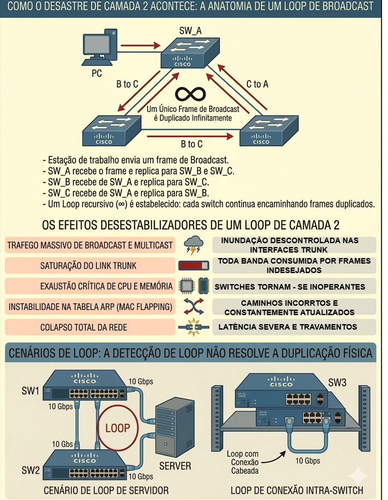
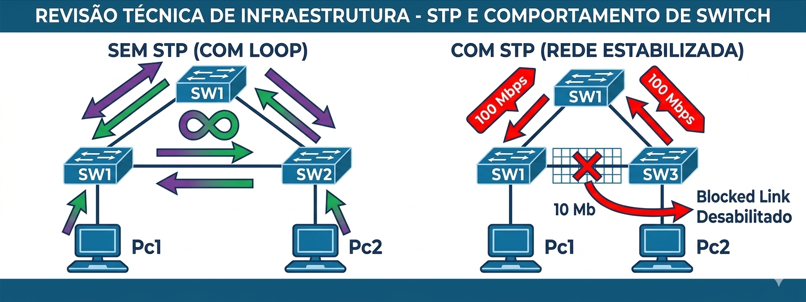
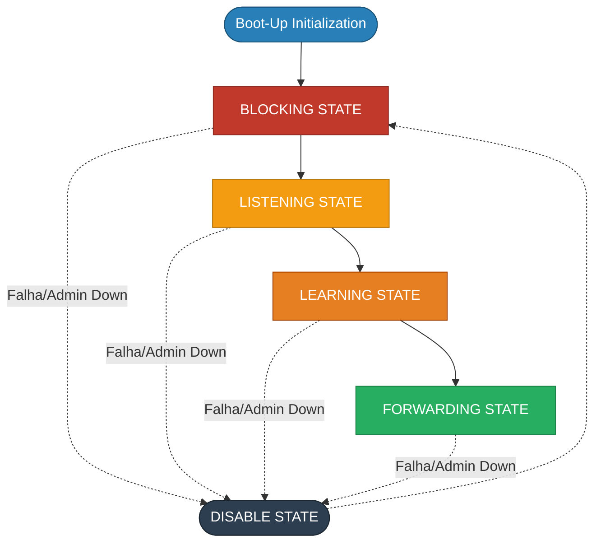
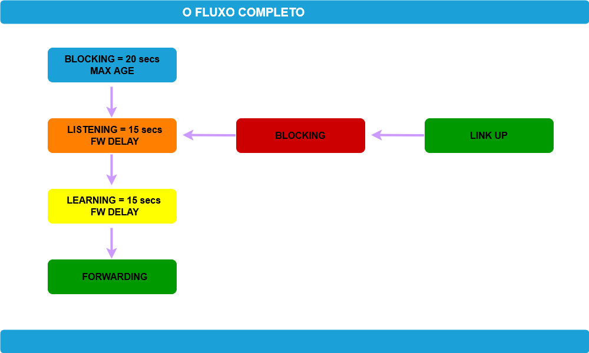
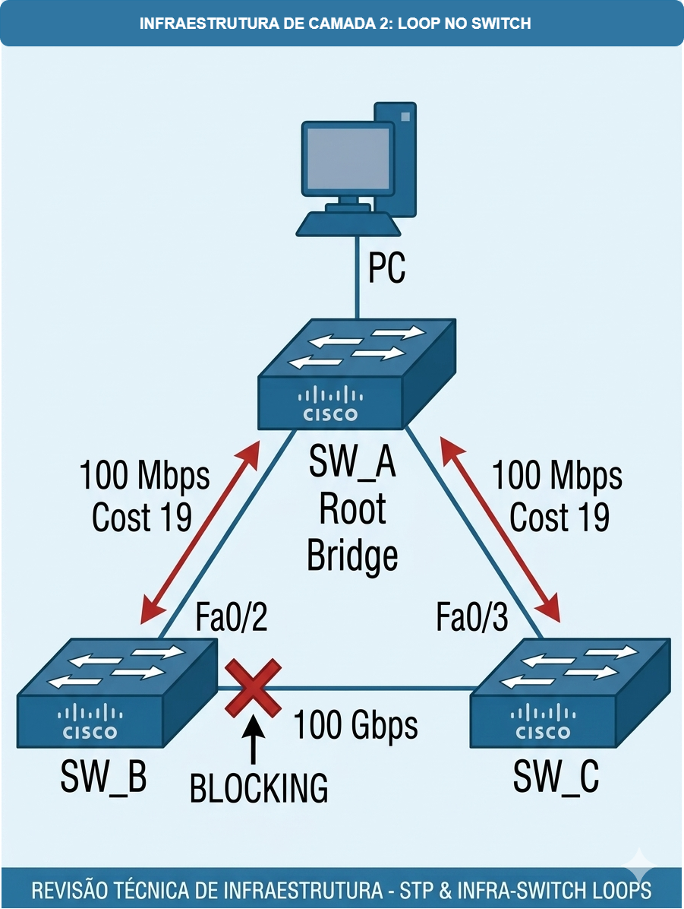
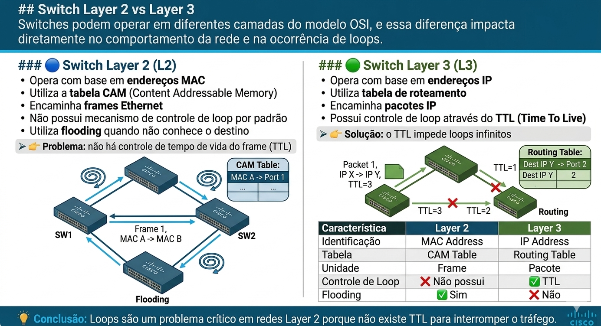
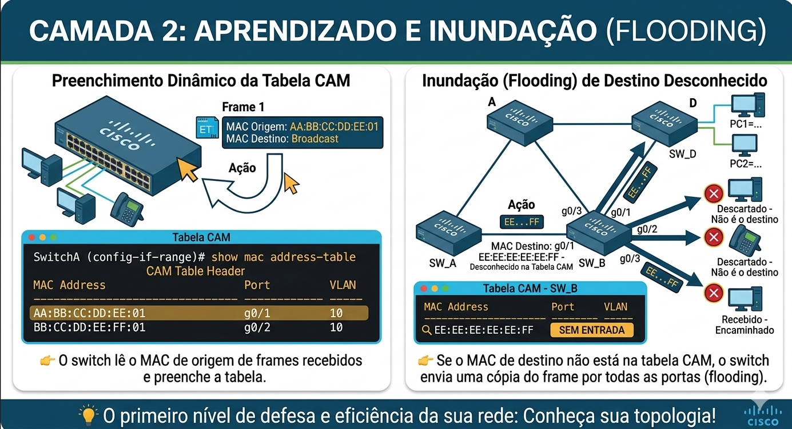
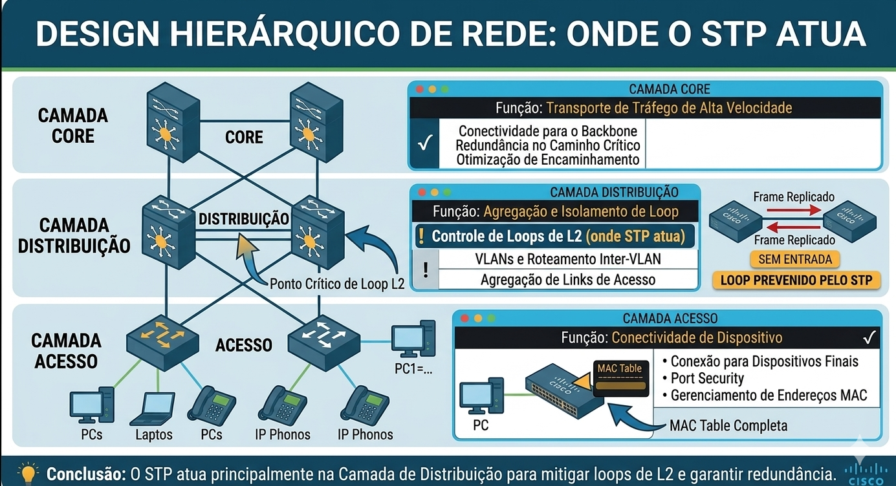
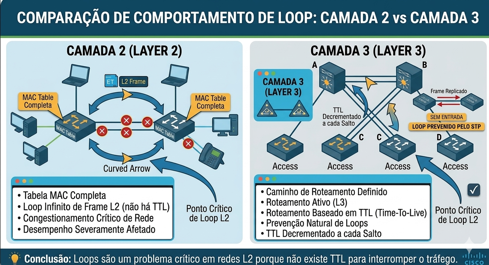

# 02 - Layer 2 Infrastructure: Spanning Tree Protocol (STP) - Estados, Timers e Convergência

- [02 - Layer 2 Infrastructure: Spanning Tree Protocol (STP) - Estados, Timers e Convergência](#02---layer-2-infrastructure-spanning-tree-protocol-stp---estados-timers-e-convergência)
  - [🎯 Objetivo do Documento](#-objetivo-do-documento)
  - [Como Este Documento Deve Ser Lido](#como-este-documento-deve-ser-lido)
  - [Contexto: Retomando o Problema](#contexto-retomando-o-problema)
  - [Onde Estamos na Progressão](#onde-estamos-na-progressão)
  - [O Problema da Convergência Lenta](#o-problema-da-convergência-lenta)
  - [Estados das Portas STP — Port States](#estados-das-portas-stp--port-states)
    - [Os 5 Estados](#os-5-estados)
    - [O que cada estado faz (e o que não faz)](#o-que-cada-estado-faz-e-o-que-não-faz)
    - [Listening e Learning: os estados temporários](#listening-e-learning-os-estados-temporários)
  - [Os Timers do STP e sua Relação com os Estados](#os-timers-do-stp-e-sua-relação-com-os-estados)
    - [STP - Estado das Portas](#stp---estado-das-portas)
    - [Port State x Temporizadores — O Fluxo Completo](#port-state-x-temporizadores--o-fluxo-completo)
    - [O Cálculo da Convergência](#o-cálculo-da-convergência)
  - [O Fluxo de Inicialização (Boot-Up)](#o-fluxo-de-inicialização-boot-up)
  - [O Fluxo de Reconvergência (Link Up após falha)](#o-fluxo-de-reconvergência-link-up-após-falha)
  - [Por que esse tempo é um problema?](#por-que-esse-tempo-é-um-problema)
  - [Fundamentos Necessários para Entender o STP](#fundamentos-necessários-para-entender-o-stp)
  - [Switch Layer 2 vs Layer 3](#switch-layer-2-vs-layer-3)
    - [🔵 Switch Layer 2 (L2)](#-switch-layer-2-l2)
    - [🟢 Switch Layer 3 (L3)](#-switch-layer-3-l3)
    - [⚠️ Comparação Direta](#️-comparação-direta)
  - [Tabela CAM vs Tabela de Roteamento](#tabela-cam-vs-tabela-de-roteamento)
    - [🔵 Tabela CAM (Layer 2)](#-tabela-cam-layer-2)
    - [🟢 Tabela de Roteamento (Layer 3)](#-tabela-de-roteamento-layer-3)
  - [Topologia em 3 Camadas (3-Tier Architecture)](#topologia-em-3-camadas-3-tier-architecture)
    - [🔷 Camadas da Arquitetura](#-camadas-da-arquitetura)
  - [Fluxo de Decisão e Encaminhamento (Layer 2)](#fluxo-de-decisão-e-encaminhamento-layer-2)
    - [🔄 Comportamento do Switch](#-comportamento-do-switch)
    - [🔥 O Problema](#-o-problema)
    - [💥 Resultado](#-resultado)
  - [Loop Layer 2 vs Loop Layer 3](#loop-layer-2-vs-loop-layer-3)
    - [🔴 Loop em Layer 2](#-loop-em-layer-2)
    - [🟢 Loop em Layer 3](#-loop-em-layer-3)
    - [⚠️ Comparação](#️-comparação)
  - [Conclusão](#conclusão)
  - [🔜 Próxima Etapa](#-próxima-etapa)
  - [🧪 Pronto para Testar seu Conhecimento?](#-pronto-para-testar-seu-conhecimento)

---

## 🎯 Objetivo do Documento

O documento **01** construiu toda a base do STP: o problema do loop L2, a eleição do Root Bridge, os papéis das portas, os BPDUs e o mecanismo de TCN.

Este documento aprofunda o que acontece **depois que o STP tomou suas decisões** — como as portas transitam entre estados, quanto tempo cada transição leva e por que o STP clássico converge lentamente.

Ao final desta etapa, você será capaz de:

- Identificar em qual estado cada porta se encontra em qualquer momento da operação
- Calcular o tempo de convergência com base nos timers
- Entender por que uma porta leva até 50 segundos para começar a encaminhar tráfego
- Reconhecer esse comportamento como a principal limitação do STP 802.1D — e a motivação direta para o RSTP

---

## Como Este Documento Deve Ser Lido

Este documento é estritamente teórico. Não há comandos de configuração aqui.

O objetivo é consolidar o modelo mental antes de qualquer interação com equipamento. Somente quando o comportamento do protocolo estiver claro na cabeça é que faz sentido sentar na frente de uma CLI.

---

## Contexto: Retomando o Problema

Antes de iniciar a análise prática, vale reforçar visualmente o problema que o STP resolve e o resultado que esperamos ao final de qualquer topologia bem convergida.  
  
Sem o STP, qualquer topologia com links redundantes resulta em loop de Camada 2 — frames circulando infinitamente, broadcast storm, colapso da rede:  
  


Com o STP convergido, a topologia redudante é mantida fisicamente, mas o loop é eliminado logicamente. O protocolo bloqueia a porta de maior custo, mantendo um único caminho ativo e os demais em standby:
  

  
É exatamente esse estado final — **qual porta bloquear, qual manter ativa e por quê** — que vamos aprender a prever manualmente antes de qualquer validação via CLI.  

## Onde Estamos na Progressão

No documento 01, o STP foi apresentado como um protocolo que:

1. Elege um Root Bridge
2. Calcula os melhores caminhos (Root Ports e Designated Ports)
3. Bloqueia as portas redundantes para eliminar loops

O que ficou em aberto é: **como uma porta passa de "conectada" para "encaminhando tráfego"?**

Não é imediato. O STP impõe uma sequência obrigatória de estados antes de qualquer porta começar a encaminhar tráfego — e isso tem um custo em tempo.

---

## O Problema da Convergência Lenta

Imagine o seguinte cenário: um switch acabou de ser ligado. Ele não sabe nada sobre a topologia. Se ele simplesmente começasse a encaminhar tráfego imediatamente, poderia criar um loop antes mesmo de receber qualquer BPDU.

Para evitar isso, o STP foi projetado com uma abordagem conservadora: **nenhuma porta encaminha tráfego até que a topologia esteja estabilizada.** O preço dessa segurança é o tempo.

---

## Estados das Portas STP — Port States

### Os 5 Estados

O STP clássico (IEEE 802.1D) define cinco estados possíveis para qualquer porta:

| Estado         | Nome         | Descrição resumida                                                        |
| :---           | :---         | :---                                                                      |
| **Blocking**   | Bloqueado    | Porta recebe BPDUs mas não encaminha tráfego nem aprende MACs             |
| **Listening**  | Escutando    | Porta participa da eleição STP mas não encaminha tráfego nem aprende MACs |
| **Learning**   | Aprendendo   | Porta aprende endereços MAC mas ainda não encaminha tráfego               |
| **Forwarding** | Encaminhando | Porta operacional — aprende MACs e encaminha tráfego normalmente          |
| **Disabled**   | Desabilitado | Porta desativada administrativamente — não participa do STP               |

### O que cada estado faz (e o que não faz)

| Estado         | Recebe BPDUs? | Envia BPDUs? | Aprende MACs? | Encaminha tráfego? |
| :---           | :---:         | :---:        | :---:         | :---:              |
| **Blocking**   | ✅            | ❌          | ❌            | ❌                |
| **Listening**  | ✅            | ✅          | ❌            | ❌                |
| **Learning**   | ✅            | ✅          | ✅            | ❌                |
| **Forwarding** | ✅            | ✅          | ✅            | ✅                |
| **Disabled**   | ❌            | ❌          | ❌            | ❌                |
  
> **Ponto crítico de prova:** Blocking e Disabled são frequentemente confundidos. A diferença é que uma porta em **Blocking ainda recebe BPDUs** — ela está monitorando a rede ativamente. Uma porta em **Disabled não faz absolutamente nada** — é como se não existisse.

### Listening e Learning: os estados temporários

Listening e Learning existem por um único motivo: **dar tempo ao STP para estabilizar a topologia antes de qualquer tráfego fluir.**

- **Listening** é o estado onde o switch participa da eleição — ele envia e recebe BPDUs, determina qual porta será Root Port ou Designated Port, mas ainda não aprende MACs nem encaminha tráfego.
- **Learning** é o estado de preparação — a eleição já terminou, o papel da porta já foi definido, e agora o switch começa a popular a tabela MAC antes de encaminhar tráfego. Isso evita um pico de flooding no momento em que a porta entrar em Forwarding.

Nenhum dos dois estados existe durante a operação normal de uma porta estabilizada. Eles são **estados de transição** — só aparecem quando uma porta está subindo.

---

## Os Timers do STP e sua Relação com os Estados

Cada estado temporário tem um temporizador que controla quanto tempo a porta permanece nele antes de transicionar.

| Timer             | Valor padrão | Controla                                                        |
| :---              | :---:        | :---                                                            |
| **Hello Time**    | 2 segundos   | Intervalo de envio de BPDUs pelo Root Bridge                    |
| **Max Age**       | 20 segundos  | Tempo máximo em Blocking aguardando BPDUs antes de transicionar |
| **Forward Delay** | 15 segundos  | Tempo em Listening + tempo em Learning (15s cada)               |

> **Detalhe importante sobre o Max Age:** uma porta em Blocking não fica 20 segundos e automaticamente sobe. O Max Age é o tempo que ela aguarda BPDUs antes de considerar que o caminho atual falhou e iniciar uma transição. Em operação normal, a porta permanece em Blocking indefinidamente enquanto continuar recebendo BPDUs.

### STP - Estado das Portas

Para evitar loops na rede, o STP controla cuidadosamente como e quando uma porta pode encaminhar tráfego.  
  
Abaixo está o fluxo completo dos estados de uma porta, desde o momento em que o switch inicia até atingir o estado de encaminhamento (Forwarding). Cada etapa possui uma função específica no processo de convergência.  

O diagrama também mostra como a porta reage a falhas ou desativações, retornando a um estado seguro (Disable), garantindo a estabilidade da rede.  
  


> ⚠️ Observação: No STP clássico (IEEE 802.1D), a transição completa até o estado Forwarding pode levar até 50 segundos no pior cenário, devido aos timers envolvidos (Max Age + Forward Delay).

### Port State x Temporizadores — O Fluxo Completo

O funcionamento do STP não depende apenas dos estados das portas, mas também dos temporizadores que controlam cada transição.  
  
O fluxograma abaixo apresenta o comportamento completo de uma porta, correlacionando diretamente os estados do STP com seus respectivos timers. A partir do momento em que uma porta entra em operação (Link Up), ela não começa a encaminhar tráfego imediatamente. Em vez disso, percorre uma sequência controlada de estados para garantir que não existam loops na topologia.  
  
Observe que:

- O estado **Blocking** está associado ao timer **Max Age (20 segundos)**, garantindo que informações antigas sejam descartadas.
- Os estados **Listening** e **Learning** utilizam o **Forward Delay (15 segundos cada)**, permitindo que a rede convirja de forma segura antes do encaminhamento.
- Apenas após essa sequência a porta atinge o estado **Forwarding**, onde passa a encaminhar tráfego normalmente.

Esse comportamento explica por que o STP clássico (IEEE 802.1D) pode levar até **50 segundos** para convergir em cenários de falha indireta.

Compreender essa relação entre estados e temporizadores é essencial para diagnosticar lentidão na convergência, interpretar o comportamento da rede e preparar-se para cenários práticos em laboratório e em produção.



### O Cálculo da Convergência

O tempo que uma porta leva para chegar ao estado Forwarding depende do ponto de partida:

**Cenário 1 — Boot-Up (switch ligado do zero):**

A porta começa em Blocking e precisa esperar o STP eleger o Root Bridge antes de transicionar.

```stp
Blocking (até 20s) + Listening (15s) + Learning (15s) = até 50 segundos
```

**Cenário 2 — Link Up após falha (porta que estava bloqueada precisa assumir):**

A porta já estava em Blocking. Quando o caminho primário cai, ela aguarda o Max Age e então transiciona.

```stp
Max Age (20s) + Listening (15s) + Learning (15s) = 50 segundos
```

**Cenário 3 — Porta diretamente conectada ao Root (Designated Port subindo):**

Em alguns casos, o Forward Delay ainda se aplica, mas o tempo efetivo pode ser menor dependendo do momento da detecção.

```stp
Listening (15s) + Learning (15s) = 30 segundos (mínimo)
```

> **Observação prática:** Na maioria dos cenários reais, o tempo observado fica entre **30 e 50 segundos**. Isso é suficiente para causar timeout de sessões TCP, falhas de autenticação e interrupção de aplicações sensíveis a latência — o que torna esse comportamento inaceitável em redes modernas.

---

## O Fluxo de Inicialização (Boot-Up)

Quando um switch é ligado, **todas as portas começam em Blocking**. O switch não sabe nada sobre a topologia.

O processo é:

1. Todas as portas entram em **Blocking** imediatamente
2. O switch começa a enviar BPDUs se anunciando como Root Bridge (todo switch começa achando que é o Root)
3. Ao receber BPDUs de outros switches, compara os Bridge IDs e atualiza seu Root ID
4. Após estabilização da eleição, cada porta recebe seu papel (RP, DP ou Non-Designated)
5. Portas que serão Designated ou Root transitam para **Listening → Learning → Forwarding**
6. Portas que serão bloqueadas permanecem em **Blocking**

> **Ponto que gera confusão:** durante o boot, todas as portas enviam BPDUs se anunciando como Root. Isso é normal — é parte do processo de eleição. A eleição converge quando todos os switches concordam sobre quem é o Root Bridge.

---

## O Fluxo de Reconvergência (Link Up após falha)

Este é o cenário mais crítico em produção. Um link principal cai e o STP precisa ativar um caminho alternativo.

**Exemplo:**



O link SW1–SW2 cai. O que acontece:

1. SW2 para de receber BPDUs pela sua Root Port
2. SW2 aguarda **Max Age (20s)** antes de declarar o caminho morto
3. SW2 inicia transição pelo único caminho restante: via SW3
4. A porta SW3 Fa0/2 (que estava em Blocking) precisa transicionar para Forwarding
5. SW3 Fa0/2 passa por **Listening (15s) → Learning (15s) → Forwarding**

**Tempo total até o tráfego fluir novamente: até 50 segundos.**

Durante esses 50 segundos, SW2 está isolado da rede.

> Esse comportamento é a **principal limitação do STP 802.1D** e a razão pela qual o IEEE desenvolveu o **RSTP (802.1w)**, capaz de reconvergir em menos de 1 segundo na maioria dos cenários. Esse é o próximo tema da progressão.

---

## Por que esse tempo é um problema?

Para contextualizar o impacto dos 50 segundos de convergência:

| Aplicação                | Tolerância a interrupção                              |
| :---                     | :---                                                  |
| Navegação web            | Alta — usuário recarrega a página                     |
| Transferência de arquivo | Média — o download reinicia                           |
| Sessão SSH / Telnet      | Baixa — a sessão cai                                  |
| VoIP / videoconferência  | Nenhuma — a chamada cai                               |
| Autenticação 802.1X      | Nenhuma — o cliente não autentica e não acessa a rede |

> Em redes modernas com autenticação de porta (802.1X), VoIP e aplicações em tempo real, 50 segundos de indisponibilidade é inaceitável. Esse é o argumento técnico que justifica a adoção do RSTP em qualquer ambiente profissional. RSTP é uma evolução do STP que será visto mais a frente.

---

## Fundamentos Necessários para Entender o STP

Antes de aprofundarmos mais no funcionamento do Spanning Tree Protocol (STP), é essencial compreender alguns conceitos fundamentais sobre como switches operam e como os loops surgem em redes de camada 2.  
  
Este bloco tem como objetivo construir a base necessária para responder uma pergunta central:
  
→ Por que o STP é necessário?
  
---

## Switch Layer 2 vs Layer 3

Switches podem operar em diferentes camadas do modelo OSI, e essa diferença impacta diretamente no comportamento da rede e na ocorrência de loops.

### 🔵 Switch Layer 2 (L2)

- Opera com base em **endereços MAC**
- Utiliza a **tabela CAM (Content Addressable Memory)**
- Encaminha **frames Ethernet**
- Não possui mecanismo de controle de loop por padrão
- Utiliza **flooding** quando não conhece o destino

> 👉 Problema: não há controle de tempo de vida do frame (TTL)

---

### 🟢 Switch Layer 3 (L3)

- Opera com base em **endereços IP**
- Utiliza **tabela de roteamento**
- Encaminha **pacotes IP**
- Possui controle de loop através do **TTL (Time To Live)**

> 👉 Solução: o TTL impede loops infinitos

---

### ⚠️ Comparação Direta

| Característica   | Layer 2       | Layer 3       |
|------------------|---------------|---------------|
| Identificação    | MAC Address   | IP Address    |
| Tabela           | CAM Table     | Routing Table |
| Unidade          | Frame         | Pacote        |
| Controle de Loop | ❌ Não possui | ✅ TTL       |
| Flooding         | ✅ Sim        | ❌ Não       |

---

💡 **Conclusão:**  
  
> Loops são um problema crítico em redes Layer 2 porque não existe TTL para interromper o tráfego.



---

## Tabela CAM vs Tabela de Roteamento

O comportamento do switch está diretamente ligado ao tipo de tabela que ele utiliza para tomar decisões.  
  
---

### 🔵 Tabela CAM (Layer 2)

- Armazena **MAC Address ↔ Porta**
- Aprendizado dinâmico
- Baseada em tráfego recebido
- Se destino desconhecido → **Flooding**
  
👉 **Isso pode gerar tráfego excessivo**  

---
  
### 🟢 Tabela de Roteamento (Layer 3)

- Armazena **rede de destino ↔ próximo salto**
- Baseada em protocolos de roteamento ou configuração manual
- Decisão determinística

👉 **Não há flooding como no Layer 2**  
  
---

💡 **Conclusão:**

> O comportamento de flooding no Layer 2 é um dos principais fatores que contribuem para loops.



---

## Topologia em 3 Camadas (3-Tier Architecture)

Redes corporativas são geralmente estruturadas em três camadas para garantir escalabilidade, redundância e organização.

---

### 🔷 Camadas da Arquitetura

- **Access Layer**
  - Conecta dispositivos finais
  - Alto uso de Layer 2
  - Principal ponto de ocorrência de loops

- **Distribution Layer**
  - Agrega switches de acesso
  - Pode operar em Layer 2 e Layer 3
  - Ponto estratégico para controle de STP

- **Core Layer**
  - Backbone da rede
  - Alta velocidade
  - Normalmente Layer 3

---

💡 **Conclusão:**

O STP é mais crítico nas camadas de acesso e distribuição, onde há maior uso de Layer 2 e redundância física.

→ Isso explica por que o STP é necessário.



---

## Fluxo de Decisão e Encaminhamento (Layer 2)

Para entender como os loops acontecem, precisamos analisar como o switch toma decisões.

---

### 🔄 Comportamento do Switch

1. Recebe um frame
2. Aprende o MAC de origem
3. Verifica o MAC de destino:

- Se conhecido → encaminha para porta específica
- Se desconhecido → realiza **flooding**

---

### 🔥 O Problema

Em uma topologia com caminhos redundantes:

- O flooding pode enviar o mesmo frame por múltiplos caminhos
- Esse frame pode retornar ao switch original
- O processo se repete infinitamente

---

### 💥 Resultado

- Broadcast Storm
- MAC Flapping
- Alto uso de CPU
- Degradação da rede

---

💡 **Conclusão:**

O comportamento natural do switch Layer 2 pode gerar loops em redes com redundância.

→ Isso explica por que o STP é necessário.

---

## Loop Layer 2 vs Loop Layer 3

Nem todo loop é igual — e essa diferença é fundamental.

---

### 🔴 Loop em Layer 2

- Não possui TTL
- Frame circula indefinidamente
- Crescimento exponencial de tráfego
- Causa colapso da rede

---

### 🟢 Loop em Layer 3

- TTL decrementa a cada salto
- Pacote é descartado ao chegar em zero
- Loop é limitado

---

### ⚠️ Comparação

| Característica | Loop L2  | Loop L3    |
|----------------|----------|------------|
| TTL            | ❌ Não  | ✅ Sim     |
| Duração        | Infinita | Limitada   |
| Impacto        | Alto     | Controlado |

---

💡 **Conclusão Final:**
  
> Loops são um problema estrutural em redes Layer 2, enquanto em Layer 3 são naturalmente mitigados.



---

## Conclusão

Neste ponto, entendemos:

- Como funciona o encaminhamento em Layer 2 e Layer 3
- Como loops surgem
- Por que o STP é necessário no contexto real

No próximo documento, vamos aprofundar no funcionamento interno do STP, analisando sua engenharia, tomada de decisão e estrutura de mensagens.

## 🔜 Próxima Etapa

Spanning Tree Protocol (STP) – Engenharia e Funcionamento Interno

---

## 🧪 Pronto para Testar seu Conhecimento?

Antes de partir para o laboratório, valide sua compreensão teórica com os simulados:

👉 **Acesse todos os simulados aqui:**  
🔗 [Abrir Simulados STP - Parte 02](https://alcancil.github.io/Cisco/CCNP%20350-401%20ENCOR/03%20-%20Infrastructure/02%20-%20STP%20(Spanning%20Tree%20Protocol)/02%20-%20Revisao02/Arquivos/Simulado/)  
  
- **Simulados temáticos (10 questões / 10 min cada):**  
  1 - [Port States: Os 5 Estados](https://alcancil.github.io/Cisco/CCNP%20350-401%20ENCOR/03%20-%20Infrastructure/02%20-%20STP%20(Spanning%20Tree%20Protocol)/02%20-%20Revisao02/Arquivos/Simulado/01.html)  
  2 - [Timers: Hello Time, Max Age e Forward Delay](https://alcancil.github.io/Cisco/CCNP%20350-401%20ENCOR/03%20-%20Infrastructure/02%20-%20STP%20(Spanning%20Tree%20Protocol)/02%20-%20Revisao02/Arquivos/Simulado/Simulado/02.html)  
  3 - [Switch L2 vs L3 e Tabela CAM](https://alcancil.github.io/Cisco/CCNP%20350-401%20ENCOR/03%20-%20Infrastructure/02%20-%20STP%20(Spanning%20Tree%20Protocol)/02%20-%20Revisao02/Arquivos/Simulado//03.html)
  4 - [Reconvergência e Fluxo de Boot-Up](https://alcancil.github.io/Cisco/CCNP%20350-401%20ENCOR/03%20-%20Infrastructure/02%20-%20STP%20(Spanning%20Tree%20Protocol)/02%20-%20Revisao02/Arquivos/Simulado//04.html)
  5 - [Topologia 3-Tier, Decisão de Encaminhamento e Visão Geral](https://alcancil.github.io/Cisco/CCNP%20350-401%20ENCOR/03%20-%20Infrastructure/02%20-%20STP%20(Spanning%20Tree%20Protocol)/02%20-%20Revisao02/Arquivos/Simulado//05.html)

- **Simulado completo STP:** [50 questões — 75 minutos](https://alcancil.github.io/Cisco/CCNP%20350-401%20ENCOR/03%20-%20Infrastructure/02%20-%20STP%20(Spanning%20Tree%20Protocol)/02%20-%20Revisao02/Arquivos/Simulado/completo.html)

- **Seu desempenho consolidado:** [📊 Painel de Estatísticas](https://alcancil.github.io/Cisco/CCNP%20350-401%20ENCOR/03%20-%20Infrastructure/02%20-%20STP%20(Spanning%20Tree%20Protocol)/02%20-%20Revisao02/Arquivos/Simulado/dashboard.html)

