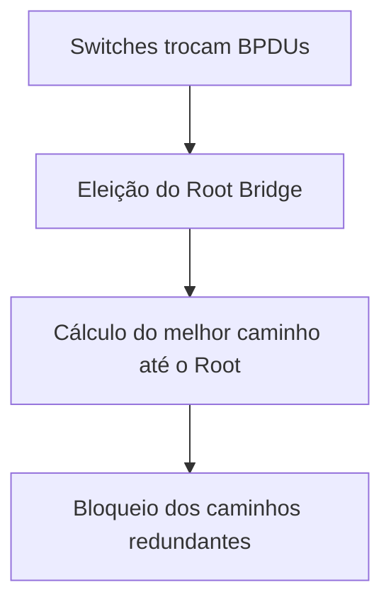
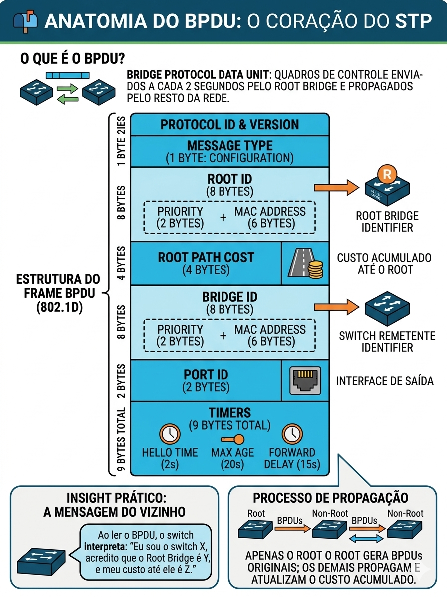
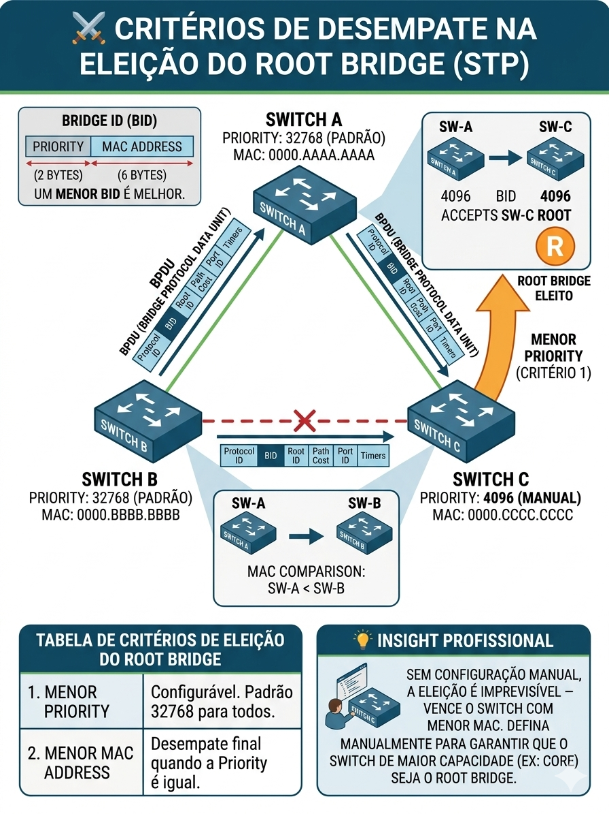
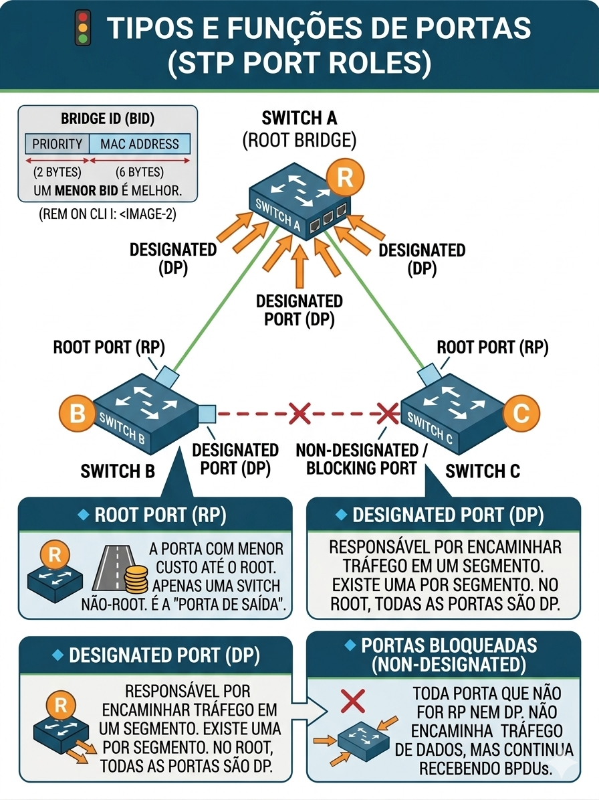
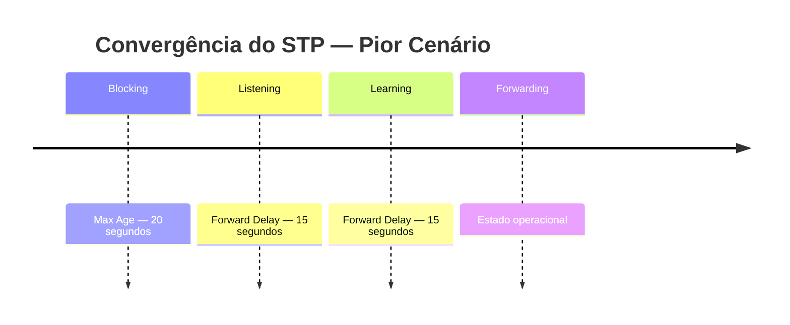
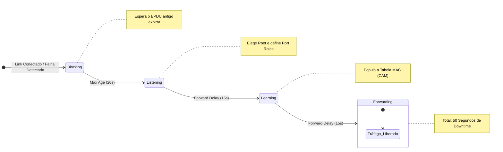

# 03 - Layer 2 Infrastructure: Spanning Tree Protocol (STP) - Fundamentos e Operação (IEEE 802.1D)

- [03 - Layer 2 Infrastructure: Spanning Tree Protocol (STP) - Fundamentos e Operação (IEEE 802.1D)](#03---layer-2-infrastructure-spanning-tree-protocol-stp---fundamentos-e-operação-ieee-8021d)
  - [📖 Glossário Técnico do STP](#-glossário-técnico-do-stp)
  - [🎯 Objetivo do Documento](#-objetivo-do-documento)
  - [🧭 Como Este Documento Deve Ser Lido](#-como-este-documento-deve-ser-lido)
  - [🌐 Contexto](#-contexto)
    - [🚨 O Problema dos Loops em Layer 2](#-o-problema-dos-loops-em-layer-2)
    - [💥 Consequências](#-consequências)
    - [💡 Solução](#-solução)
  - [🛠️ Introdução e Evolução do STP](#️-introdução-e-evolução-do-stp)
  - [⚙️ O que o STP faz](#️-o-que-o-stp-faz)
  - [📬 Anatomia do BPDU](#-anatomia-do-bpdu)
    - [📦 Campos Importantes](#-campos-importantes)
  - [🆔 Bridge ID (BID)](#-bridge-id-bid)
    - [📊 Estrutura do BID](#-estrutura-do-bid)
  - [👑 Eleição do Root Bridge](#-eleição-do-root-bridge)
    - [🏆 Regra Principal](#-regra-principal)
    - [⚔️ Critérios de Desempate](#️-critérios-de-desempate)
    - [💡 Insight Profissional](#-insight-profissional)
  - [🚦 Tipos e Funções de Portas](#-tipos-e-funções-de-portas)
    - [🔹 Root Port (RP)](#-root-port-rp)
    - [🔹 Designated Port (DP)](#-designated-port-dp)
    - [🔹 Portas Bloqueadas (Non-Designated)](#-portas-bloqueadas-non-designated)
  - [⏳ Estados das Portas e Convergência](#-estados-das-portas-e-convergência)
    - [🧭 Jornada das Portas](#-jornada-das-portas)
    - [⏱️ Tempo Total de Convergência](#️-tempo-total-de-convergência)
    - [🚨 Por que isso é um problema?](#-por-que-isso-é-um-problema)
      - [📈 Fluxo Temporal de Convergência (802.1D)](#-fluxo-temporal-de-convergência-8021d)
  - [⚖️ Critérios de Desempate](#️-critérios-de-desempate-1)
  - [🔗 Conexão com Próximos Tópicos](#-conexão-com-próximos-tópicos)
    - [🚀 A Evolução do STP](#-a-evolução-do-stp)
    - [🧠 O Próximo Passo (Antes de Evoluir)](#-o-próximo-passo-antes-de-evoluir)
    - [🎯 O que vem a seguir](#-o-que-vem-a-seguir)
    - [🧭 Direcionamento para o Estudo](#-direcionamento-para-o-estudo)
  - [🧪 Pronto para Testar seu Conhecimento?](#-pronto-para-testar-seu-conhecimento)

---

## 📖 Glossário Técnico do STP

Os termos abaixo serão utilizados ao longo deste documento. Antes de avançar, certifique-se de que cada um está claro — eles são a base para entender qualquer saída de CLI e qualquer cenário de prova.

| Termo                    | Descrição Técnica                                   | Analogia Prática                             | ⚠️ Pegadinha de Prova / Observação           |
| :---                     | :---                                                |:---                                          | :---                                         |
| **BPDU**        | Bridge Protocol Data Unit — frame de controle trocado entre switches|O "batimento cardíaco" da rede| Apenas o Root gera BPDUs originais; os demais propagam|
| **Root Bridge**          | Switch central eleito como referência da topologia  | O "Presidente" da rede                       | Sempre o menor BID vence (não é aleatório)   |
| **Bridge ID (BID)**      | Identidade única do switch: Priority + VLAN + MAC   | O "CPF" do switch                            | Priority tem precedência sobre MAC           |
| **Root Path Cost**       | Custo acumulado até o Root Bridge                   | Distância total até a capital                | Sempre somatório — não é custo local         |
| **Hello Time**           | Intervalo de envio de BPDUs (padrão: 2s)            | "Você está aí?" periódico                    | Definido pelo Root e propagado               |
| **Max Age**     | Tempo aguardando BPDUs antes de declarar falha (padrão: 20s) | Tempo de espera antes de considerar que a ligação caiu | Só expira se parar de receber BPDU |
| **Forward Delay**        | Tempo nos estados Listening e Learning (padrão: 15s cada) | Quarentena antes de liberar o tráfego  | Usado duas vezes (Listening + Learning)      |
| **Root Port (RP)**       | Porta com menor custo até o Root Bridge em um switch não-root | A "rota mais rápida" até a capital | Só existe UMA por switch (não-root)          |
| **Designated Port (DP)** | Porta responsável por encaminhar tráfego em um segmento | O "representante oficial" da rua         | Uma por segmento                             |
| **Non-Designated Port**  | Porta bloqueada para evitar loops                   | Rua interditada para evitar congestionamento | Fica em Blocking                             |
| **Blocking State**       | Estado onde a porta não encaminha tráfego, apenas recebe BPDUs | Sinal vermelho — trânsito parado             | Não aprende MAC                   |
| **Listening State**      | Estado onde a porta participa do STP, mas não aprende MAC      | Observando o trânsito antes de liberar       | Duração = Forward Delay           |
| **Learning State**       | Estado onde a porta aprende MACs, mas não encaminha tráfego    | Anotando os caminhos antes de abrir a via    | Ainda não encaminha tráfego       |
| **Forwarding State**     | Estado onde a porta encaminha tráfego normalmente              | Trânsito liberado                            | Estado final                      |
| **Disabled State**       | Porta administrativamente desligada ou sem operação            | Rua completamente fechada                    | Não participa do STP              |
| **Topology Change (TCN)**| Notificação enviada quando há mudança na topologia             | Aviso de obra ou acidente na via             | Faz flush da tabela MAC           |
| **Convergência**         | Tempo necessário para a rede estabilizar após uma mudança      | Tempo até o trânsito normalizar após um acidente| STP clássico: até 50s          |
| **Loop de Camada 2**     | Caminho redundante que causa tráfego circular infinito         | Rotatória infinita sem saída                 | Ethernet não tem TTL              |
| **Broadcast Storm**      | Tempestade de tráfego broadcast causada por loops              | Engarrafamento extremo com carros se multiplicando | Crescimento exponencial     |
| **MAC Flapping**         | Mudança constante de MAC entre portas devido a loop            | Endereço mudando de lugar a todo momento     | Indica loop ativo                 |
| **Port ID**              | Identificador da porta (prioridade + número da interface)      | Número da pista na estrada                   | Usado no desempate                |
| **Port Priority**        | Valor usado como critério de desempate entre portas (padrão: 128) | Preferência de uso entre pistas              | Menor vence                    |
| **Path Cost**            | Custo associado a uma interface baseado na velocidade do link  | Pedágio — quanto custa usar aquela estrada   | Link mais rápido = menor custo    |
| **Extended System ID**   | Campo que incorpora o VLAN ID ao Bridge ID                     | Bairro incluído no endereço                  | Explica variação do BID por VLAN  |
| **Hello BPDU**           | BPDU periódico enviado pelo Root Bridge                        | Pulso constante de verificação               | Base do funcionamento contínuo    |
| **TCN BPDU**             | BPDU específico para notificar mudança de topologia            | Alerta de mudança na rota                    | Diferente do BPDU normal          |
| **Root ID**              | Identificador do Root Bridge presente no BPDU                  | Nome do presidente atual                     | Campo mais importante do BPDU     |
| **Sender Bridge ID**     | Identificador do switch que enviou o BPDU                      | Quem está enviando a informação              | Usado em desempate                |
| **Sender Port ID**       | Porta do switch remetente que enviou o BPDU                    | De qual pista veio a informação              | Último critério de desempate      |
| **Desempate**            | Sequência de critérios para decidir melhor caminho  | Critério de escolha final                    | Ordem: Cost → BID → Port Priority → Port ID  |
| **Root Path Selection**  | Processo de escolha da Root Port baseado em custo e desempate  | Escolha da melhor rota                       | Muito cobrado em prova            |
| **Segmento de Rede**     | Link compartilhado entre switches                              | Uma rua entre dois bairros                   | Define Designated Port            |
| **STP Instance**         | Execução lógica do STP para uma VLAN ou conjunto de VLANs      | Uma eleição por bairro                       | Base para PVST/MST                |

---

## 🎯 Objetivo do Documento

Este documento é um guia de referência consolidado do **IEEE 802.1D — Classic STP**.

Os documentos 01 e 02 construíram o modelo mental completo: o problema do loop L2, a eleição do Root Bridge, os papéis das portas, os estados e os timers. Este documento organiza esse conhecimento em formato de consulta rápida — uma visão geral que conecta todos os conceitos antes de avançar para os laboratórios práticos.

Dominar este protocolo é essencial para:

- Entender redes Cisco em profundidade
- Evoluir para **RSTP (802.1w)** e **MSTP (802.1s)**
- Atender aos requisitos do exame **CCNP ENCOR 350-401**

---

## 🧭 Como Este Documento Deve Ser Lido

Este documento assume que os documentos 01 e 02 já foram estudados. Ele não repete explicações detalhadas — organiza o conhecimento em tabelas e fluxos de referência rápida.

A sequência recomendada:

1. Entenda o problema (loops em L2) — coberto no documento 01
2. Compreenda como o STP resolve — coberto no documento 01
3. Acompanhe os estados e timers — coberto no documento 02
4. Use este documento como consolidação antes dos laboratórios

---

## 🌐 Contexto

### 🚨 O Problema dos Loops em Layer 2

Redes com switches redundantes formam caminhos físicos alternativos — o que é desejável para alta disponibilidade. O problema é que o protocolo Ethernet **não possui TTL**, ao contrário do IP. Um frame que entrar em um caminho circular vai circular indefinidamente, sendo replicado a cada passagem por um switch.

Esse comportamento não se degrada gradualmente. Ele colapsa a rede em segundos.

### 💥 Consequências

- **Loop infinito:** frames circulam sem expirar
- **Broadcast Storm:** cada switch replica o broadcast para todas as portas, multiplicando os frames exponencialmente
- **MAC Flapping:** o mesmo endereço MAC é aprendido em múltiplas portas simultaneamente — a tabela CAM fica instável e o switch para de encaminhar tráfego corretamente
- **Exaustão de CPU e memória:** os switches tentam processar todos os frames duplicados até travar

### 💡 Solução

Precisamos de um mecanismo que:

- Permita redundância física — os cabos ficam conectados
- Elimine loops lógicos — apenas um caminho ativo por destino

> 👉 Esse mecanismo é o **Spanning Tree Protocol (STP) — IEEE 802.1D**

<!-- TODO: inserir imagem da topologia triangular com loop infinito e depois com STP convergido -->

---

## 🛠️ Introdução e Evolução do STP

O STP foi padronizado em 1990. Desde então, evoluiu para versões mais rápidas e escaláveis — mas os conceitos fundamentais de eleição e bloqueio de portas permanecem os mesmos em todas as versões.

| Versão    | Padrão             | Características                                                    | Fontes                                                                 |
| :---      | :---               | :---                                                               | :---                                                                   |
| **STP**   | IEEE 802.1D        | Base de tudo. Convergência lenta — até 50 segundos no pior cenário | https://datatracker.ietf.org/doc/html/rfc7727                          |
| **PVST+** | Cisco proprietário | Uma instância de STP por VLAN. Mais controle, mais consumo de CPU  | Cisco                                                                  |
| **RSTP**  | IEEE 802.1w        | Convergência rápida — menos de 1 segundo na maioria dos cenários   | https://datatracker.ietf.org/doc/html/rfc4318                          |
| **MSTP**  | IEEE 802.1s        | Múltiplas instâncias de STP para grupos de VLANs. Escalável        | https://www.ieee802.org/1/files/public/docs2005/qrev-rouyer-mstp-0105.pdf |

> **Por que estudar o STP clássico se o RSTP é melhor?** Porque o RSTP é uma evolução direta do 802.1D. Quem não entende o STP clássico não entende por que o RSTP foi projetado da forma que foi — e não consegue fazer troubleshooting em ambientes mistos, que ainda existem em produção.

---

## ⚙️ O que o STP faz

O STP atua como um controlador lógico da topologia. A partir do momento em que os switches são ligados, o protocolo executa quatro etapas em sequência:



Cada etapa depende da anterior. Sem a eleição do Root Bridge, não há referência para calcular custos. Sem os custos calculados, não há critério para decidir qual porta bloquear.

---

## 📬 Anatomia do BPDU

Switches descobrem a topologia trocando mensagens chamadas **BPDUs (Bridge Protocol Data Units)**. Essas mensagens são enviadas a cada **2 segundos (Hello Time)** pelo Root Bridge e propagadas pelos demais switches.

> 🧠 Interpretação prática: ao receber um BPDU, o switch está lendo a seguinte mensagem do vizinho: *"Eu sou o switch X, acredito que o Root Bridge é Y, e meu custo acumulado até ele é Z."*

### 📦 Campos Importantes

| Campo              | Função                                                       |
| :---               | :---                                                         |
| **Root ID**        | Bridge ID do switch que o remetente acredita ser o Root      |
| **Bridge ID**      | Bridge ID do switch que está enviando o BPDU                 |
| **Root Path Cost** | Custo acumulado do remetente até o Root Bridge               |
| **Port ID**        | Porta de onde o BPDU saiu — usado como critério de desempate |
| **Timers**         | Hello Time, Max Age e Forward Delay ditados pelo Root Bridge |

> **Detalhe crítico:** apenas o Root Bridge **gera** BPDUs originais. Os demais switches **propagam** os BPDUs recebidos, atualizando o campo de custo acumulado. Se um switch para de receber BPDUs, ele aguarda o **Max Age (20s)** antes de declarar falha e iniciar uma nova eleição.



---

## 🆔 Bridge ID (BID)

O Bridge ID é a identidade única de cada switch na topologia STP. É ele que determina quem vence a eleição do Root Bridge.

### 📊 Estrutura do BID

| Campo                            | Tamanho | Observação                                                 |
| :---                             | :---    | :---                                                       |
| **Priority**                     | 4 bits  | Múltiplos de 4096. Padrão: 32768                           |
| **VLAN ID (Extended System ID)** | 12 bits | VLAN somada à Priority. Ex: VLAN 1 → Priority real = 32769 |
| **MAC Address**                  | 48 bits | Identificador único do switch                              |

**Exemplo prático:**

Um switch com Priority padrão na VLAN 1 terá Bridge ID:

```stp
32768 + 1 (VLAN ID) = 32769 : 0000.0000.ABCD
```
  
> **Ponto de prova:** a Priority deve ser sempre múltiplo de 4096. Valores válidos: 0, 4096, 8192, 12288, 16384, 20480, 24576, 28672, **32768** (padrão), 36864... até 61440. Tentar configurar um valor fora dessa escala resulta em erro na CLI.

---

## 👑 Eleição do Root Bridge

Todos os switches iniciam achando que são o Root Bridge. À medida que trocam BPDUs, comparam Bridge IDs e o switch com o **menor BID** vence a eleição.

### 🏆 Regra Principal

> O switch com o **menor Bridge ID** será eleito Root Bridge.
> Priority tem precedência. Em caso de empate na Priority, vence o **menor MAC Address**.

### ⚔️ Critérios de Desempate
  
| Critério                 | Observação                                |
| :---                     | :---                                      |
| **1. Menor Priority**    | Configurável. Padrão 32768 para todos     |
| **2. Menor MAC Address** | Desempate final quando a Priority é igual |

### 💡 Insight Profissional

Sem configuração manual, a eleição é imprevisível — vence o switch com o menor MAC, que pode ser o mais antigo ou o menos capaz da rede. Em ambientes de produção, o Root Bridge **deve ser definido manualmente** pelo administrador, garantindo que o switch de maior capacidade (geralmente o core) seja eleito.

```stp
spanning-tree vlan <id> priority 4096   ← Root Bridge primário
spanning-tree vlan <id> priority 8192   ← Root Bridge secundário (fallback)
```



---

## 🚦 Tipos e Funções de Portas

Após a eleição do Root Bridge, cada switch define o papel de cada uma de suas interfaces. Existem três papéis possíveis:

### 🔹 Root Port (RP)

- A porta com o **menor custo acumulado** até o Root Bridge
- Existe **apenas uma por switch** não-root
- É a "porta de saída" do switch em direção ao Root

### 🔹 Designated Port (DP)

- A porta responsável por encaminhar tráfego em um segmento de rede
- Existe **uma por segmento**
- No Root Bridge, **todas as portas são Designated Ports** — seu custo até si mesmo é zero

### 🔹 Portas Bloqueadas (Non-Designated)

- Toda porta que não for RP nem DP é colocada em estado **Blocking**
- Não encaminha tráfego de dados, mas continua recebendo BPDUs
- É o mecanismo que elimina o loop logicamente mantendo o cabo conectado fisicamente



---

## ⏳ Estados das Portas e Convergência

As portas não passam diretamente de "conectada" para "encaminhando tráfego". O STP impõe uma sequência obrigatória de estados para garantir que a topologia esteja estabilizada antes de qualquer tráfego fluir.

### 🧭 Jornada das Portas

| Estado         | Encaminha tráfego | Aprende MAC | Recebe BPDUs | Timer associado      |
| :---           | :---:             | :---:       | :---:        | :---                 |
| **Blocking**   | ❌                | ❌         | ✅           | Max Age — 20s        |
| **Listening**  | ❌                | ❌         | ✅           | Forward Delay — 15s  |
| **Learning**   | ❌                | ✅         | ✅           | Forward Delay — 15s  |
| **Forwarding** | ✅                | ✅         | ✅           | — estado operacional |
| **Disabled**   | ❌                | ❌         | ❌           | — porta desativada   |



### ⏱️ Tempo Total de Convergência

| Cenário                      | Cálculo                                          | Tempo total         |
| :---                         | :---                                             | :---                |
| **Boot-Up**                  | Max Age (20s) + Listening (15s) + Learning (15s) | **até 50 segundos** |
| **Falha indireta**           | Max Age (20s) + Listening (15s) + Learning (15s) | **até 50 segundos** |
| **Porta Designated subindo** | Listening (15s) + Learning (15s)                 | **30 segundos**     |

### 🚨 Por que isso é um problema?

50 segundos de indisponibilidade causa impacto direto em:

- **Sessões SSH/Telnet** — a sessão cai
- **VoIP e videoconferência** — a chamada cai sem recuperação
- **Autenticação 802.1X** — o cliente não autentica e não acessa a rede

Esse comportamento é a principal limitação do STP 802.1D e a motivação direta para o desenvolvimento do **RSTP (802.1w)**, que reduz esse tempo para menos de 1 segundo na maioria dos cenários.

#### 📈 Fluxo Temporal de Convergência (802.1D)



## ⚖️ Critérios de Desempate

Quando dois caminhos têm o mesmo custo acumulado até o Root Bridge, o STP usa os seguintes critérios em ordem até resolver o empate:

| Ordem | Critério                    | O que é                                             |
| :---  | :---                        | :---                                                |
| **1** | Menor Root Path Cost        | Custo acumulado total até o Root Bridge             |
| **2** | Menor Sender Bridge ID      | Bridge ID do switch vizinho que enviou o BPDU       |
| **3** | Menor Sender Port Priority  | Prioridade da porta do switch vizinho (padrão: 128) |
| **4** | Menor Sender Port Number    | Número da porta do switch vizinho                   |

> **Na prática:** o quarto critério é o mais comum em laboratório — dois links paralelos entre os mesmos dois switches terão o mesmo custo, o mesmo Sender BID e a mesma Port Priority. O desempate final será feito pelo número da porta física.

---

## 🔗 Conexão com Próximos Tópicos

O **Spanning Tree Protocol (IEEE 802.1D)** resolve o problema fundamental dos loops em redes de camada 2 — garantindo estabilidade e previsibilidade na topologia.

No entanto, essa estabilidade vem com um custo.

À medida que avançamos para cenários reais de produção, algumas limitações tornam-se evidentes:

- Convergência lenta — podendo chegar a **até 50 segundos**
- Ausência de diferenciação nativa por VLAN
- Dependência exclusiva de timers — sem mecanismos ativos de reconvergência

👉 Em ambientes modernos, essas limitações impactam diretamente:

- **Disponibilidade de aplicações críticas**
- **Qualidade de voz e vídeo (VoIP)**
- **Tempo de recuperação após falhas**

---

### 🚀 A Evolução do STP

Para resolver esses desafios, o protocolo evoluiu ao longo do tempo, mantendo os mesmos fundamentos, mas introduzindo melhorias significativas:

| Próximo tema            | O que resolve                                   |
| :---                    | :---                                            |
| **RSTP (802.1w)**       | Convergência sub-segundo via Proposal/Agreement |
| **PVST+ / Rapid PVST+** | Instância por VLAN com convergência rápida      |
| **MSTP (802.1s)**       | Escalabilidade em ambientes com muitas VLANs    |

---

### 🧠 O Próximo Passo (Antes de Evoluir)

Antes de avançar para essas variações, é fundamental consolidar um ponto crítico:

> 💡 **O comportamento do STP é totalmente determinado pelo posicionamento do Root Bridge e pelas decisões de custo na topologia.**

Ou seja:

- Quem é o Root define o fluxo do tráfego  
- O custo define os caminhos  
- Os critérios de desempate definem os detalhes finos da topologia  

---

### 🎯 O que vem a seguir

No próximo documento, vamos sair da teoria descritiva e entrar na **engenharia de decisão do STP**, explorando:

- Como a eleição do Root Bridge impacta diretamente o design da rede  
- Como definir Root primário e secundário corretamente  
- Como balancear VLANs utilizando múltiplos roots  
- Como calcular manualmente:
  - Root Ports  
  - Designated Ports  
  - Caminhos preferenciais  
- Como aplicar critérios de desempate em cenários reais  
- E, por fim, como resolver **topologias completas passo a passo**

> 🔎 A partir daqui, o foco deixa de ser “o que é o STP” e passa a ser:  
> **“como o STP toma decisões — e como o engenheiro controla essas decisões”**

---

### 🧭 Direcionamento para o Estudo

👉 Esse próximo passo é essencial para:

- Fixar o conteúdo para o exame
- Desenvolver raciocínio lógico para troubleshooting
- Preparar o terreno para os laboratórios práticos

---

💥 **Resumo do momento atual:**

- Você já entende o funcionamento do STP  
- Agora é hora de **pensar como o protocolo pensa**

---

## 🧪 Pronto para Testar seu Conhecimento?

Antes de partir para o laboratório, valide sua compreensão teórica com os simulados:

- **Simulados temáticos (10 questões / 10 min cada):**
  1 - [Evolução do STP e BPDU](https://alcancil.github.io/Cisco/CCNP%20350-401%20ENCOR/03%20-%20Infrastructure/02%20-%20STP%20(Spanning%20Tree%20Protocol)/03%20-%20Revisao03/Arquivos/Simulado/01.html)  
  2 - [Bridge ID: Estrutura e Cálculo](https://alcancil.github.io/Cisco/CCNP%20350-401%20ENCOR/03%20-%20Infrastructure/02%20-%20STP%20(Spanning%20Tree%20Protocol)/03%20-%20Revisao03/Arquivos/Simulado/02.html)  
  3 - [Eleição do Root Bridge e Papéis de Porta](https://alcancil.github.io/Cisco/CCNP%20350-401%20ENCOR/03%20-%20Infrastructure/02%20-%20STP%20(Spanning%20Tree%20Protocol)/03%20-%20Revisao03/Arquivos/Simulado/03.html)  
  4 - [Critérios de Desempate (Tie-Breakers)](https://alcancil.github.io/Cisco/CCNP%20350-401%20ENCOR/03%20-%20Infrastructure/02%20-%20STP%20(Spanning%20Tree%20Protocol)/03%20-%20Revisao03/Arquivos/Simulado/04.html)  
  5 - [Consolidação: Estados, Convergência e Evolução](https://alcancil.github.io/Cisco/CCNP%20350-401%20ENCOR/03%20-%20Infrastructure/03%20-%20STP%20(Spanning%20Tree%20Protocol)/03%20-%20Revisao03/Arquivos/Simulado/05.html)  
  
- **Simulado completo STP:** [50 questões — 75 minutos](https://alcancil.github.io/Cisco/CCNP%20350-401%20ENCOR/03%20-%20Infrastructure/02%20-%20STP%20(Spanning%20Tree%20Protocol)/03%20-%20Revisao03/Arquivos/Simulado/completo.html)  
  
- **Seu desempenho consolidado:** [📊 Painel de Estatísticas](https://alcancil.github.io/Cisco/CCNP%20350-401%20ENCOR/03%20-%20Infrastructure/02%20-%20STP%20(Spanning%20Tree%20Protocol)/03%20-%20Revisao03/Arquivos/Simulado/dashboard.html)  
  