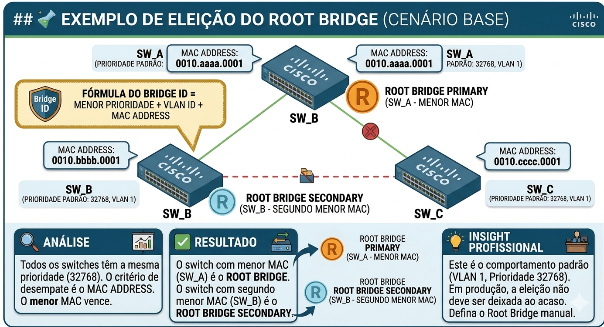
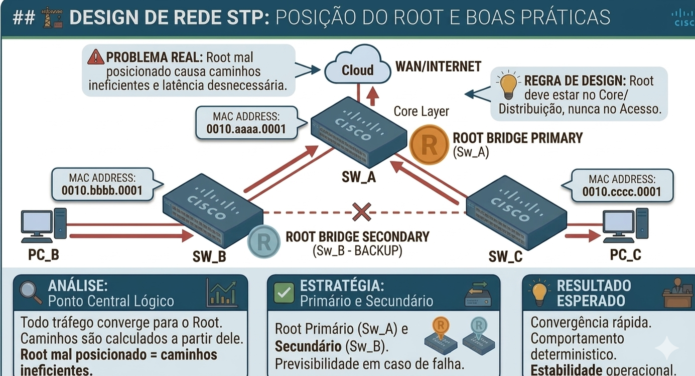
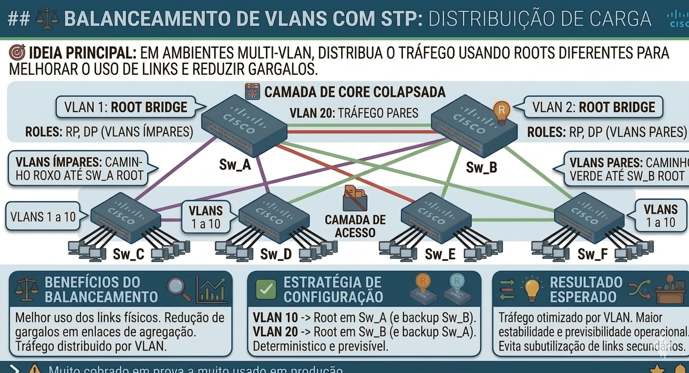
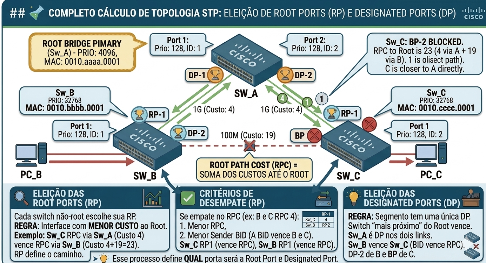
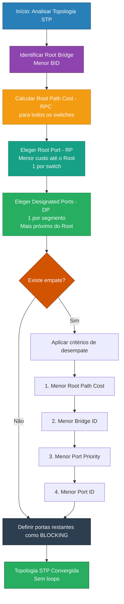

# 04 - Layer 2 Infrastructure: Spanning Tree Protocol (STP) - Engenharia de Decisão e Cálculo de Topologia

- [04 - Layer 2 Infrastructure: Spanning Tree Protocol (STP) - Engenharia de Decisão e Cálculo de Topologia](#04---layer-2-infrastructure-spanning-tree-protocol-stp---engenharia-de-decisão-e-cálculo-de-topologia)
  - [📖 Glossário Técnico do STP (Engenharia de Decisão)](#-glossário-técnico-do-stp-engenharia-de-decisão)
  - [🎯 Objetivo do Documento](#-objetivo-do-documento)
  - [🧭 Como Este Documento Deve Ser Lido](#-como-este-documento-deve-ser-lido)
  - [🧪 Exemplo de Eleição do Root Bridge (Cenário Base)](#-exemplo-de-eleição-do-root-bridge-cenário-base)
    - [🔍 Análise](#-análise)
    - [✅ Resultado](#-resultado)
  - [🏗️ Por que a posição do Root é crítica no Design da Rede](#️-por-que-a-posição-do-root-é-crítica-no-design-da-rede)
    - [🚨 Problema real](#-problema-real)
    - [💡 Regra de design](#-regra-de-design)
  - [🎯 Root Primário e Secundário (Boas Práticas)](#-root-primário-e-secundário-boas-práticas)
    - [🧠 Estratégia correta](#-estratégia-correta)
    - [🔍 Por quê?](#-por-quê)
    - [💡 Resultado esperado](#-resultado-esperado)
  - [⚖️ Balanceamento de VLANs com STP](#️-balanceamento-de-vlans-com-stp)
    - [🎯 Ideia principal](#-ideia-principal)
    - [💡 Benefícios](#-benefícios)
  - [🔗 Eleição das Root Ports](#-eleição-das-root-ports)
    - [📌 Regra principal](#-regra-principal)
    - [🧠 Interpretação](#-interpretação)
  - [📊 Custo da Porta vs Root Path Cost](#-custo-da-porta-vs-root-path-cost)
    - [🔹 Custo da Porta](#-custo-da-porta)
    - [🔹 Root Path Cost](#-root-path-cost)
    - [💡 Exemplo](#-exemplo)
  - [⚖️ Critérios de Desempate (Root Port)](#️-critérios-de-desempate-root-port)
  - [🌐 Eleição das Designated Ports](#-eleição-das-designated-ports)
    - [📌 Regra principal](#-regra-principal-1)
    - [🧠 Interpretação](#-interpretação-1)
  - [⚖️ Critérios de Desempate (Designated Port)](#️-critérios-de-desempate-designated-port)
  - [🧮 Exemplo Completo de Cálculo de Topologia](#-exemplo-completo-de-cálculo-de-topologia)
    - [🔍 Passo a passo](#-passo-a-passo)
    - [🎯 Resultado esperado](#-resultado-esperado-1)
  - [🧠 Algoritmo Mental do STP (Processo de Decisão - Como Resolver Qualquer Topologia)](#-algoritmo-mental-do-stp-processo-de-decisão---como-resolver-qualquer-topologia)
    - [1. Identifique o Root Bridge](#1-identifique-o-root-bridge)
    - [2. Calcule o Root Path Cost (RPC)](#2-calcule-o-root-path-cost-rpc)
    - [3. Eleja a Root Port (RP)](#3-eleja-a-root-port-rp)
    - [4. Eleja as Designated Ports (DP)](#4-eleja-as-designated-ports-dp)
    - [5. Defina as portas bloqueadas](#5-defina-as-portas-bloqueadas)
    - [6. Aplique critérios de desempate (se necessário)](#6-aplique-critérios-de-desempate-se-necessário)
    - [🎯 Resultado Final](#-resultado-final)
  - [🔗 Conexão com Próximos Tópicos](#-conexão-com-próximos-tópicos)
    - [🚀 Próximo passo](#-próximo-passo)
  - [🧪 Pronto para Testar seu Conhecimento?](#-pronto-para-testar-seu-conhecimento)

## 📖 Glossário Técnico do STP (Engenharia de Decisão)

Os termos abaixo são essenciais para compreender o processo de cálculo e tomada de decisão do STP.  
Aqui não estamos mais na teoria básica — esses conceitos são usados diretamente em análise de topologia e prova.

| Termo                  | Descrição Técnica                                         | Analogia Prática                     | ⚠️ Pegadinha de Prova / Observação               |
| :---                   | :---                                                      | :---                                 | :---                                             |
| **BPDU**               | Frame de controle usado pelos switches para trocar informações do STP | Batimento cardíaco da rede           | Apenas o Root gera BPDU “original” — os outros propagam |
| **Hello Time**         | Intervalo de envio de BPDUs (padrão: 2s)                  | “Você está aí?” periódico            | Definido pelo Root Bridge — os outros seguem     |
| **Max Age**            | Tempo máximo aguardando BPDU antes de considerar falha (20s) | Tempo de espera antes de reagir      | Se expirar, inicia reconvergência                |
| **Forward Delay**      | Tempo gasto nos estados Listening e Learning (15s cada)   | Tempo de preparação antes de liberar tráfego | Soma 30s no processo clássico                    |
| **Port State**         | Estado operacional da porta (Blocking, Listening, etc.)   | Status da via (fechada, analisando, liberada) | Não confundir com Port Role                      |
| **Port Role**          | Função lógica da porta (RP, DP, Blocking)                 | Função da via no trânsito            | Role ≠ State (isso cai muito em prova)           |
| **Listening State**    | Porta analisa BPDUs, mas não encaminha nem aprende MAC    | Observando o trânsito                | Não aprende MAC ainda                            |
| **Learning State**     | Porta começa a aprender MAC, mas ainda não encaminha      | Decorando rotas antes de liberar     | Ainda não encaminha tráfego                      |
| **Forwarding State**   | Porta encaminha tráfego normalmente                       | Via liberada para circulação         | Estado final operacional                         |
| **Blocking State**     | Porta bloqueia tráfego de dados para evitar loops         | Rua interditada                      | Ainda processa BPDUs                             |
| **Disabled State**     | Porta administrativamente desligada ou com falha          | Rua fechada totalmente               | Não participa do STP                             |
| **Topology Change (TC)** | Evento que indica mudança na topologia STP              | Mudança no trânsito (obra/acidente)  | Dispara atualização da tabela MAC                |
| **TCN (Topology Change Notification)** | BPDU especial informando mudança na topologia | Aviso de mudança de rota             | Propaga até o Root Bridge                        |
| **Root Bridge Primary**| Switch definido manualmente como principal                | Centro principal da cidade           | Configurado via prioridade menor                 |
| **Root Bridge Secondary**| Switch de backup para assumir em falha                 | Centro reserva                       | Deve ter segunda menor prioridade                |
| **Uplink Port**        | Porta que conecta um switch ao nível superior             | Acesso à avenida principal           | Geralmente vira Root Port                        |
| **Downlink Port**      | Porta que conecta a switches de nível inferior            | Saída para ruas menores              | Geralmente vira Designated Port                  |
| **STP Instance**       | Instância lógica do STP (por VLAN no PVST)                | Um controle de trânsito por bairro   | PVST roda múltiplas instâncias                   |
| **PVST+**              | STP por VLAN da Cisco                                     | Um STP por faixa de tráfego          | Consome mais CPU                                |
| **Rapid STP (RSTP)**   | Versão rápida do STP (802.1w)                             | Trânsito com semáforos inteligentes  | Convergência quase instantânea                   |
| **MSTP**               | Agrupa VLANs em instâncias STP                            | Vários bairros com mesmo controle    | Mais escalável                                  |
| **Edge Port (PortFast)**| Porta que entra direto em Forwarding                     | Acesso direto sem espera             | Pode causar loop se mal utilizado                |
| **PortFast**           | Recurso para acelerar convergência em portas de acesso    | Liberação imediata da via            | Nunca usar em link entre switches                |
| **BPDU Guard**         | Proteção que desativa porta ao receber BPDU inesperado    | Segurança contra conexão indevida    | Muito cobrado em prova                           |
| **Loop Guard**         | Evita loops causados por perda de BPDU                    | Monitoramento de falha silenciosa    | Atua quando BPDU para de chegar                  |
| **Root Guard**         | Impede que outro switch vire Root indevidamente           | Protege o “centro da cidade”         | Porta entra em estado inconsistente              |
| **EtherChannel (Port-Channel)** | Agrupamento de links físicos em um lógico       | Várias pistas formando uma rodovia   | STP vê como um único link                        |
| **Link Cost**          | Valor associado à velocidade da interface                 | Peso da estrada                      | Gigabit = custo menor que FastEthernet           |
| **Shortest Path**      | Caminho com menor custo até o Root                        | Rota mais rápida                     | Base para escolha da Root Port                   |
| **Convergência Lenta** | Tempo alto para estabilização no STP clássico             | Trânsito demorando a se organizar    | Até 50 segundos — ponto crítico                  |
| **Convergência Rápida**| Ajuste quase instantâneo (RSTP)                           | Semáforo inteligente                 | < 1 segundo na prática                           |

---

## 🎯 Objetivo do Documento

Este documento tem como objetivo sair da teoria descritiva do STP e entrar na **engenharia de decisão do protocolo**.

Aqui você irá aprender:

- Como o STP toma decisões na prática
- Como prever o comportamento da rede antes mesmo de aplicar configurações
- Como calcular manualmente toda a topologia

> 💡 Este é o ponto onde o conhecimento deixa de ser teórico e passa a ser **operacional e estratégico**.

---

## 🧭 Como Este Documento Deve Ser Lido

Este documento é **100% progressivo**.

Siga exatamente esta ordem:

1. Entenda a eleição do Root Bridge
2. Entenda como o Root influencia o tráfego
3. Entenda como calcular Root Ports
4. Entenda como calcular Designated Ports
5. Resolva o cenário completo

> ⚠️ Não pule etapas — cada decisão depende da anterior.

---

## 🧪 Exemplo de Eleição do Root Bridge (Cenário Base)

Considere três switches conectados em topologia triangular.

### 🔍 Análise

1. Todos os switches possuem a mesma prioridade
2. O critério de desempate será o MAC Address
3. O menor MAC vence

### ✅ Resultado

- O switch com menor MAC será o **Root Bridge**
- Todos os outros switches irão se referenciar a ele

> 💡 Esse é o comportamento padrão — e também o motivo pelo qual a eleição **não pode ser deixada ao acaso em produção**.

---

## 🏗️ Por que a posição do Root é crítica no Design da Rede

O Root Bridge é o **ponto central lógico da rede**.

Todas as decisões de encaminhamento são feitas com base nele:

- Todo tráfego converge em direção ao Root
- Todos os caminhos são calculados a partir dele

### 🚨 Problema real

Se o Root estiver mal posicionado:

- Tráfego fará caminhos ineficientes
- Links de alta capacidade podem ser subutilizados
- Latência aumenta desnecessariamente

### 💡 Regra de design

> O Root Bridge deve estar sempre no **core ou distribuição da rede**, nunca no acesso.

---

## 🎯 Root Primário e Secundário (Boas Práticas)

Em redes reais, nunca existe apenas um plano.

### 🧠 Estratégia correta

- Definir um **Root Primário**
- Definir um **Root Secundário (backup)**

### 🔍 Por quê?

Se o Root falhar:

- A rede precisa reconvergir rapidamente
- O novo Root deve ser previsível

### 💡 Resultado esperado

- Convergência mais rápida
- Comportamento determinístico
- Maior estabilidade operacional

---

## ⚖️ Balanceamento de VLANs com STP

Em ambientes com múltiplas VLANs, é possível distribuir carga utilizando STP.

### 🎯 Ideia principal

- VLAN 10 → Root em SW1
- VLAN 20 → Root em SW2

### 💡 Benefícios

- Melhor uso dos links
- Redução de gargalos
- Balanceamento de tráfego

> ⚠️ Muito cobrado em prova e muito usado em produção.

Se o Sw_A cair ou parar, a rede perderá o Root Bridge da VLAN 10 (Ímpares) e o backup da VLAN 20 (Pares). De acordo com a estratégia de configuração descrita na imagem, o Sw_B (que já é o Root da VLAN 20 e backup da VLAN 10) assumirá automaticamente o papel de Root Bridge para ambas as VLANs. Com isso, todo o tráfego da rede passará a convergir para o Sw_B, e os cabos roxos (anteriores caminhos da VLAN 10) ficarão inativos, eliminando temporariamente o balanceamento de carga, mas mantendo a conectividade total através dos caminhos verdes agora utilizados por todas as VLANs.
  
Inversamente, se o Sw_B cair ou parar, a rede perderá o Root Bridge da VLAN 20 (Pares) e o backup da VLAN 10 (Ímpares). Nesse cenário, o Sw_A (Root da VLAN 10 e backup da VLAN 20) assumirá automaticamente a função de Root Bridge para todas as VLANs (1 a 10). O tráfego da rede convergirá totalmente para o Sw_A, e os cabos verdes (anteriores caminhos da VLAN 20) ficarão inativos. O balanceamento de carga será temporariamente interrompido, mas a estabilidade e a conectividade operacional da rede serão mantidas através dos caminhos roxos agora utilizados por todas as VLANs, garantindo o "Resultado Esperado" de comportamento determinístico.

---

## 🔗 Eleição das Root Ports

Após a definição do Root Bridge:

Cada switch não-root precisa escolher sua **Root Port**.

### 📌 Regra principal

> A Root Port é a interface com **menor custo até o Root Bridge**

### 🧠 Interpretação

- O switch está perguntando:  
  **"Qual é o caminho mais barato até o Root?"**

---

## 📊 Custo da Porta vs Root Path Cost

### 🔹 Custo da Porta

- Valor associado à interface
- Baseado na velocidade do link

### 🔹 Root Path Cost

- Soma dos custos até o Root
- Sempre acumulado

### 💡 Exemplo

- Link 1G = custo 4
- Link 100M = custo 19

Caminho total = soma dos custos

---

## ⚖️ Critérios de Desempate (Root Port)

Se houver empate no custo:

| Ordem | Critério                   |
|-------|----------------------------|
| 1     | Menor Root Path Cost       |
| 2     | Menor Sender Bridge ID     |
| 3     | Menor Sender Port Priority |
| 4     | Menor Sender Port ID       |

> 💡 Esse processo define QUAL porta será a Root Port.

---

## 🌐 Eleição das Designated Ports

Agora analisamos cada segmento de rede.

### 📌 Regra principal

> Cada segmento terá **uma única Designated Port**

### 🧠 Interpretação

- O switch "mais próximo" do Root vence o segmento

---

## ⚖️ Critérios de Desempate (Designated Port)

Mesma lógica da Root Port:

1. Menor Root Path Cost
2. Menor Bridge ID
3. Menor Port Priority
4. Menor Port ID

---

## 🧮 Exemplo Completo de Cálculo de Topologia

Agora juntamos tudo.

### 🔍 Passo a passo

1. Eleger o Root Bridge
2. Calcular Root Ports
3. Definir Designated Ports
4. Identificar portas bloqueadas

### 🎯 Resultado esperado

- Topologia sem loops
- Caminhos definidos
- STP convergido

> 💡 Esse é o tipo de exercício que cai diretamente na prova.

---

## 🧠 Algoritmo Mental do STP (Processo de Decisão - Como Resolver Qualquer Topologia)

Sempre que analisar uma topologia STP, siga exatamente esta ordem:

### 1. Identifique o Root Bridge

- Menor Bridge ID (Priority + MAC)
- Esse será o ponto central da rede

---

### 2. Calcule o Root Path Cost (RPC)

- Some os custos de cada link até o Root
- Faça isso para TODOS os switches

---

### 3. Eleja a Root Port (RP)

- Em cada switch não-root:
  - Escolha a porta com MENOR custo até o Root

> Regra: 1 RP por switch

---

### 4. Eleja as Designated Ports (DP)

- Em cada segmento:
  - A porta mais próxima do Root vence

> Regra: 1 DP por segmento

---

### 5. Defina as portas bloqueadas

- Tudo que não for RP ou DP:
  - Vai para BLOCKING

---

### 6. Aplique critérios de desempate (se necessário)

Ordem:

1. Menor Root Path Cost
2. Menor Bridge ID
3. Menor Port Priority
4. Menor Port ID

---

### 🎯 Resultado Final

- Topologia sem loops
- Apenas um caminho ativo por destino

---

## 🔗 Conexão com Próximos Tópicos

Agora você já entende:

- Como o STP toma decisões
- Como calcular topologias manualmente
- Como prever comportamento da rede

### 🚀 Próximo passo

A partir daqui, avançamos para:

- Laboratórios práticos
- Configuração real em equipamentos Cisco
- Análise de saída de comandos (CLI)

> 🔎 O foco muda novamente:  
> de cálculo manual → para **implementação e troubleshooting real**

---

💥 **Resumo desta fase:**

- Você entende a lógica do STP  
- Você sabe calcular a topologia  
- Agora é hora de **validar isso na prática**

---

## 🧪 Pronto para Testar seu Conhecimento?

Antes de partir para o laboratório, valide sua compreensão teórica com os simulados:

- **Simulados temáticos (10 questões / 10 min cada):**
  1 - [Posicionamento do Root Bridge e Design de Rede](Arquivos/Simulado/01.html)
  2 - [Bridge ID: Estrutura e Cálculo](Arquivos/Simulado/02.html)
  3 - [Eleição do Root Bridge e Papéis de Porta](Arquivos/Simulado/03.html)
  4 - [Critérios de Desempate (Tie-Breakers)](Arquivos/Simulado/04.html)
  5 - [Consolidação: Estados, Convergência e Evolução](Arquivos/Simulado/05.html)

- **Simulado completo STP:** [50 questões — 75 minutos](Arquivos/Simulado/completo.html)

- **Seu desempenho consolidado:** [📊 Painel de Estatísticas](Arquivos/Simulado/dashboard.html)
  