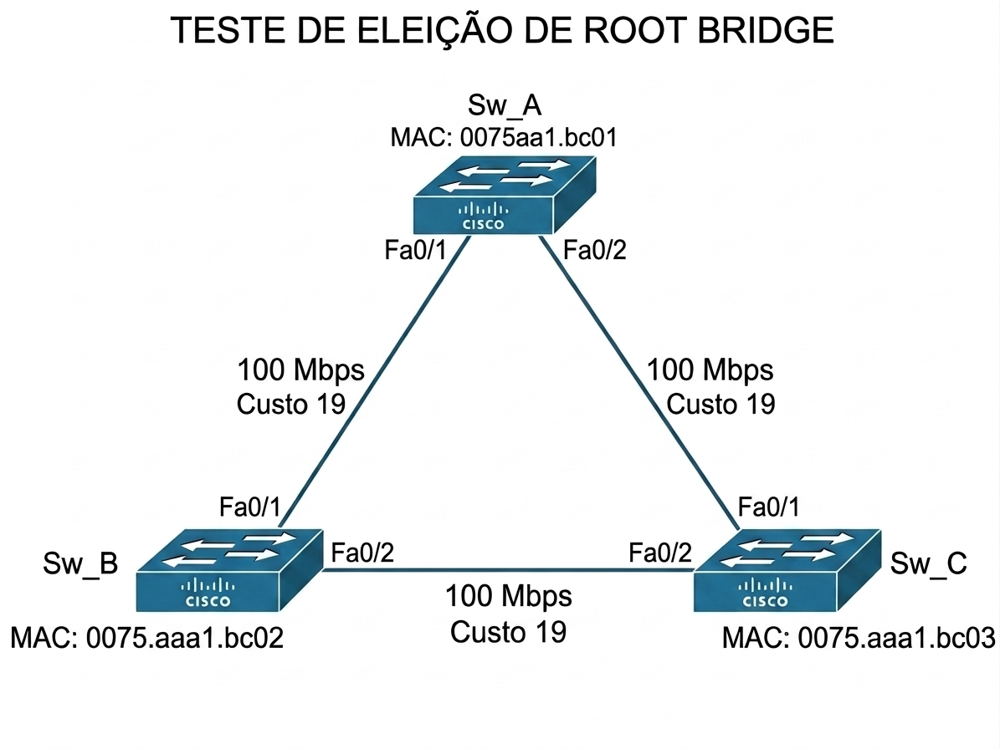
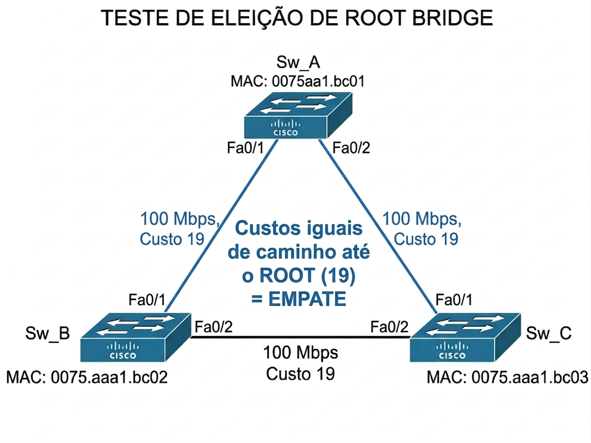
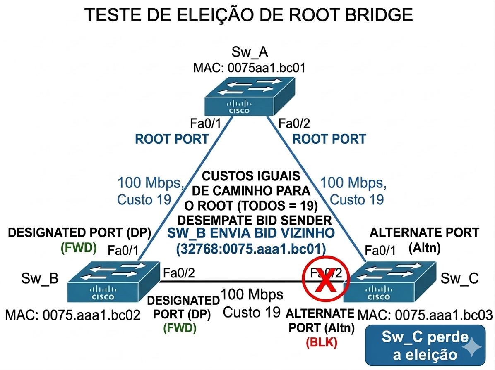
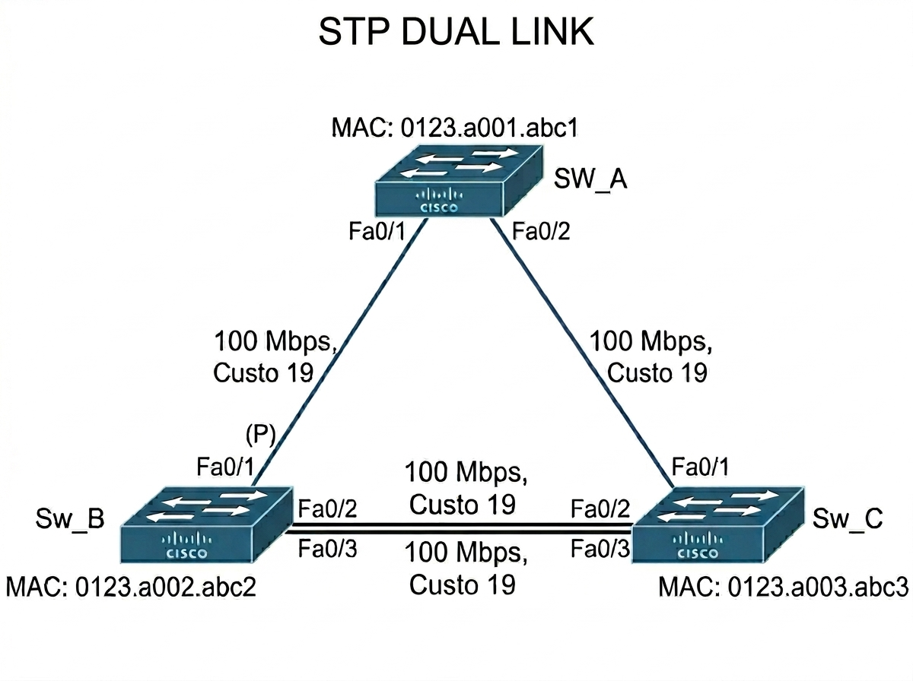
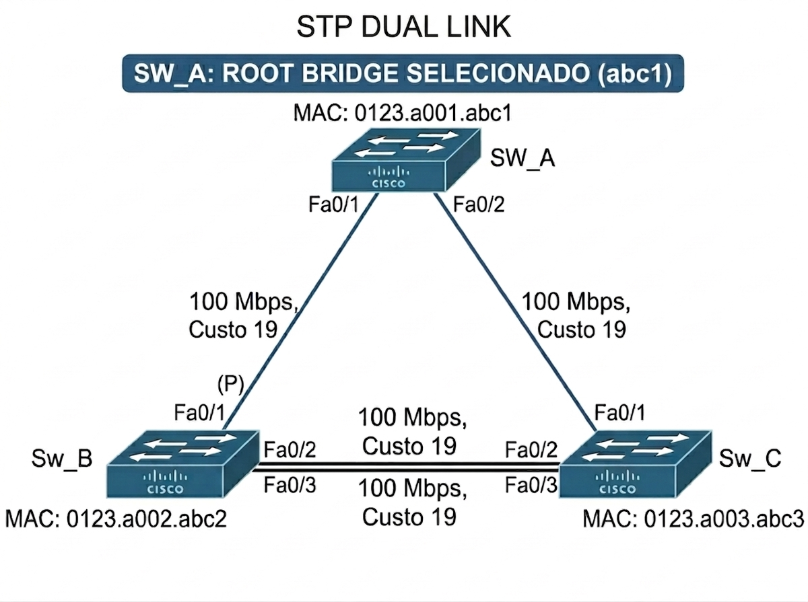
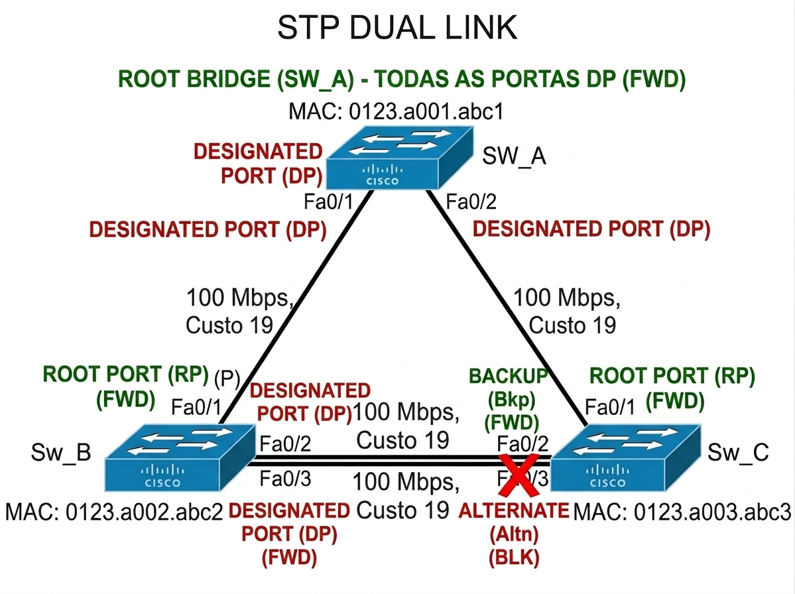
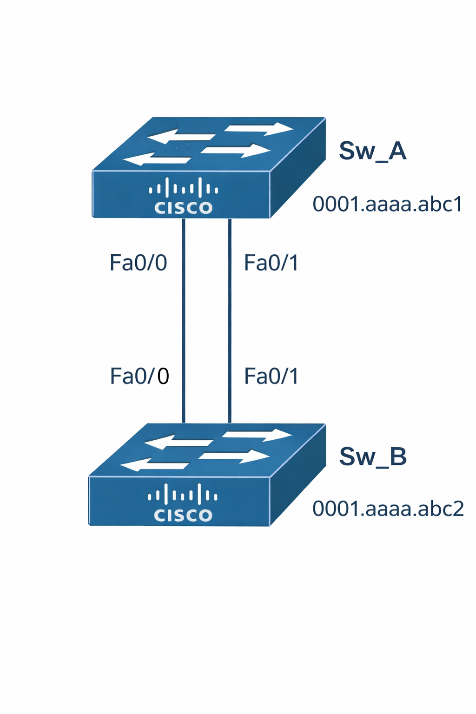
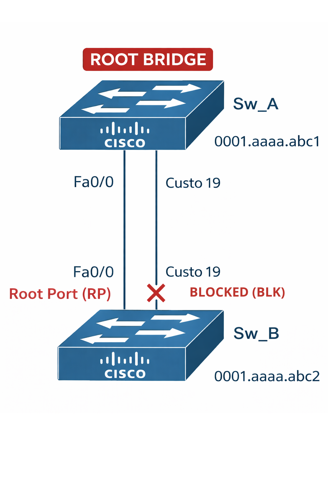

# 🧪 STP - Laboratórios Manuais (Raciocínio e Análise)

---

## 📌 Sumário

- [🧪 STP - Laboratórios Manuais (Raciocínio e Análise)](#-stp---laboratórios-manuais-raciocínio-e-análise)
  - [📌 Sumário](#-sumário)
  - [📖 Glossário](#-glossário)
  - [🎯 Objetivo do Documento](#-objetivo-do-documento)
  - [🧭 Como Este Documento Deve Ser Lido](#-como-este-documento-deve-ser-lido)
  - [🧪 Exemplo 01 - Eleição do Root Bridge](#-exemplo-01---eleição-do-root-bridge)
  - [🖼️ Topologia](#️-topologia)
  - [🔍 Análise](#-análise)
    - [Passo 1 — Verificar prioridade](#passo-1--verificar-prioridade)
    - [Passo 2 — Desempate por MAC Address](#passo-2--desempate-por-mac-address)
    - [🧠 Conclusão](#-conclusão)
  - [✅ Resultado](#-resultado)
  - [🧪 Exemplo 02 - Empate de Custo](#-exemplo-02---empate-de-custo)
  - [🖼️ Topologia](#️-topologia-1)
  - [🔍 Análise](#-análise-1)
    - [Passo 1 — Root já definido](#passo-1--root-já-definido)
    - [Passo 2 — Cálculo de custo](#passo-2--cálculo-de-custo)
    - [Passo 3 — Sender BID](#passo-3--sender-bid)
    - [🧠 Conclusão](#-conclusão-1)
  - [✅ Resultado](#-resultado-1)
  - [🧪 Exemplo 04 - Desempate por Port ID (Links Paralelos)](#-exemplo-04---desempate-por-port-id-links-paralelos)
  - [🖼️ Topologia](#️-topologia-2)
  - [🔍 Análise](#-análise-2)
    - [Passo 1 — Eleição do Root Bridge](#passo-1--eleição-do-root-bridge)
    - [Passo 2 — Determinar Root Ports](#passo-2--determinar-root-ports)
    - [Passo 3 — Análise do segmento SW\_B ↔ SW\_C](#passo-3--análise-do-segmento-sw_b--sw_c)
    - [Passo 4 — Desempate por Sender Bridge ID (BID)](#passo-4--desempate-por-sender-bridge-id-bid)
    - [Passo 5 — Desempate final (Port ID)](#passo-5--desempate-final-port-id)
    - [🔹 Port ID](#-port-id)
    - [🧠 Conclusão](#-conclusão-2)
  - [✅ Resultado](#-resultado-2)
  - [🖼️ Topologia Final](#️-topologia-final)
    - [🧪 Exemplo 05 - Identificação de Root Port (Cenário Triangular Assimétrico)](#-exemplo-05---identificação-de-root-port-cenário-triangular-assimétrico)
  - [🖼️ Topologia](#️-topologia-3)
  - [🔍 Análise](#-análise-3)
    - [Passo 1 — Eleição do Root Bridge](#passo-1--eleição-do-root-bridge-1)
    - [Passo 2 — Determinar as Portas do Root Bridge](#passo-2--determinar-as-portas-do-root-bridge)
    - [Passo 3 — Determinar Root Ports nos Switches Não-Root](#passo-3--determinar-root-ports-nos-switches-não-root)
  - [✅ Resultado](#-resultado-3)
  - [🧠 Conclusão da Análise](#-conclusão-da-análise)
    - [🧪 Exemplo 06 - Desempate por Port ID (Links Paralelos com 2 Switches)](#-exemplo-06---desempate-por-port-id-links-paralelos-com-2-switches)
  - [🖼️ Topologia](#️-topologia-4)
  - [🔍 Análise](#-análise-4)
    - [Passo 1 — Eleição do Root Bridge](#passo-1--eleição-do-root-bridge-2)
    - [Passo 2 — Determinar Root Ports no Switch Não-Root](#passo-2--determinar-root-ports-no-switch-não-root)
    - [Passo 3 — Desempate por Sender Port ID](#passo-3--desempate-por-sender-port-id)
    - [🧠 Conclusão](#-conclusão-3)
  - [✅ Resultado](#-resultado-4)
- [🧪 Exercícios Propostos](#-exercícios-propostos)
  - [🟢 Nível 1 — Básico](#-nível-1--básico)
  - [🟡 Nível 2 — Intermediário](#-nível-2--intermediário)
  - [🔴 Nível 3 — Avançado](#-nível-3--avançado)

---

## 📖 Glossário

| Termo             | Descrição                   |
|-------------------|-----------------------------|
| Root Bridge       | Switch central da topologia |
| Root Port         | Melhor caminho até o root   |
| Designated Port   | Porta ativa no segmento     |
| Alternate Port    | Porta bloqueada             |
| Root Path Cost    | Custo até o root            |

---

## 🎯 Objetivo do Documento

Este documento tem como objetivo desenvolver o **raciocínio lógico do STP (IEEE 802.1D)** através de exercícios progressivos.

Aqui, o foco NÃO é configuração.

👉 O foco é entender **como o STP toma decisões**.

---

## 🧭 Como Este Documento Deve Ser Lido

Siga esta ordem:

1. Analise o cenário
2. Identifique o Root Bridge
3. Determine os custos
4. Aplique os critérios de desempate
5. Valide sua resposta

---

> 💡 **Importante**
> Este material faz parte de uma trilha progressiva.  
> Os exercícios aumentam de dificuldade ao longo do tempo.

---

## 🧪 Exemplo 01 - Eleição do Root Bridge

## 🖼️ Topologia

## 🔍 Análise

### Passo 1 — Verificar prioridade

Todos os switches possuem prioridade padrão:

- 32768

👉 Empate

---

### Passo 2 — Desempate por MAC Address

- SW_A → menor MAC     → 0075.aaa1.bc01
- SW_B → intermediário → 0075.aaa1.bc02
- SW_C → maior MAC     → 0075.aaa1.bc03

---

### 🧠 Conclusão

👉 O switch com menor MAC será eleito Root Bridge

---

## ✅ Resultado

- Root Bridge: **SW_A**

---

## 🧪 Exemplo 02 - Empate de Custo

## 🖼️ Topologia

## 🔍 Análise

### Passo 1 — Root já definido

👉 SW_A

---

### Passo 2 — Cálculo de custo

- SW_B → custo 19
- SW_C → custo 19

👉 Empate

---

### Passo 3 — Sender BID

- SW_B envia BID menor
- SW_C perde eleição

---

### 🧠 Conclusão

👉 Porta de SW_C será bloqueada

---

## ✅ Resultado

- SW_B → Designated Port
- SW_C → Alternate (bloqueada)

---

## 🧪 Exemplo 04 - Desempate por Port ID (Links Paralelos)

## 🖼️ Topologia

---

## 🔍 Análise

### Passo 1 — Eleição do Root Bridge

Todos os switches possuem:

- Prioridade = 32768

Desempate por MAC Address:

- SW_A → menor MAC
- SW_B → intermediário
- SW_C → maior MAC

👉 **Root Bridge = SW_A**

---

### Passo 2 — Determinar Root Ports

Agora cada switch deve encontrar o melhor caminho até o Root.

- SW_B → link direto com SW_A → custo 19
- SW_C → link direto com SW_A → custo 19

👉 Ambos possuem Root Port direto

---

### Passo 3 — Análise do segmento SW_B ↔ SW_C

Temos **dois links paralelos** entre SW_B e SW_C.

Ambos possuem:

- Mesmo custo até o root (19)

👉 Empate

---

### Passo 4 — Desempate por Sender Bridge ID (BID)

Comparando os switches:

- SW_B → menor BID
- SW_C → maior BID

👉 SW_B vence a eleição no segmento
  
**OBS:** Para calcular o BID, utilizamos a seguinte fórmula: BID = Prioridade + MAC Address.  
Como o texto da análise e a imagem indicam que Sw_A foi eleito o Root Bridge, sabemos que os valores de prioridade padrão não foram alterados (são todos 32768).  
  
Portanto, os BIDs são:

- BID de Sw_B: 32768:0123.a002.abc2
- BID de Sw_C: 32768:0123.a003.abc3

---

### Passo 5 — Desempate final (Port ID)

Agora temos um cenário específico:

👉 Dois links saindo do **mesmo switch (SW_B)**

Isso significa:

- Sender BID é igual ❌
- Root Path Cost é igual ❌

👉 Aplicamos o último critério:

### 🔹 Port ID

- Fa0/1 < Fa0/2

👉 A porta com menor Port ID será escolhida como Designated

---

### 🧠 Conclusão

- SW_B → mantém a porta de menor ID como Designated
- SW_C → bloqueia uma das portas para evitar loop

---

## ✅ Resultado

| Switch | Interface | Função                     |
|--------|-----------|----------------------------|
| SW_A   | Todas     | Designated (Root Bridge)   |
| SW_B   | Para SW_A | Root Port                  |
| SW_B   | Fa0/1     | Designated Port (ativa)    |
| SW_B   | Fa0/2     | Backup / Designated*       |
| SW_C   | Para SW_A | Root Port                  |
| SW_C   | Fa0/1     | Alternate (Bloqueada)      |
| SW_C   | Fa0/2     | Forwarding / Backup**      |

---

> ⚠️ **Observação**
> O comportamento exato pode variar dependendo da implementação,
> mas sempre respeitará a hierarquia de decisão do STP.

---

## 🖼️ Topologia Final

---

> 🎯 **Dica de Prova (ENCOR)**
> O critério de Port ID só é utilizado quando
>
> - Root Path Cost empata
> - Sender BID empata

### 🧪 Exemplo 05 - Identificação de Root Port (Cenário Triangular Assimétrico)

Este exemplo é baseado em um cenário de laboratório físico, onde analisamos a topologia para determinar a localização exata da **Root Port** em um switch específico.

## 🖼️ Topologia

O diagrama a seguir representa a rede física analisada, com o switch de agregação posicionado no topo da hierarquia visual.

> **💡 Nota de Design**
> Para este laboratório, invertemos a disposição visual padrão para focar na análise do fluxo de dados de baixo para cima.

---

## 🔍 Análise

Nosso objetivo é identificar qual porta do **SW_Bottom** será eleita como **Root Port (RP)**.

### Passo 1 — Eleição do Root Bridge

Primeiro, devemos identificar o switch central da topologia.

- **SW_A:** MAC `0400.cccc.0002`
- **SW_B:** MAC `0700.cccc.0000`
- **SW_C:** MAC `0230.cccc.0001`

👉 **Conclusão:** O **Sw_C** possui o menor MAC Address da topologia. Portanto, ele é o **Root Bridge**.

---

### Passo 2 — Determinar as Portas do Root Bridge

Como aprendemos, todas as portas ativas no Root Bridge são portas de encaminhamento.

👉 **Sw_C** (interface `Gig 10`): São eleitas como **Designated Ports (DP)** e esta no estado de **Forwarding (FWD)**.

---

### Passo 3 — Determinar Root Ports nos Switches Não-Root

Agora, cada switch deve encontrar seu melhor caminho (menor custo acumulado) até o Root Bridge.

**Análise do Sw_A:**

- **Caminho via `Gig 5`:** Se conecta diretamente ao Root Bridge (Sw_C). O custo deste link é 4.
- **Caminho via `Gig 20`:** Se conecta ao Sw_B, que por sua vez se conecta ao Sw_A. O custo acumulado seria $4 + 4 = 8$ (considerando todos os links como Gigabit).

👉 **Conclusão:** O caminho direto via `Gig 5` tem o menor custo acumulado (4).

---

## ✅ Resultado

| Switch          | Interface | Função             | Estado               | Custo até o Root |
| :---            | :---      | :---               | :---                 | :---             |
| **Sw_C (ROOT)** | G10       | Designated (DP)    | Forwarding (FWD)     | 0                |
| **SW_A**        | **Gig 5** | **Root Port (RP)** | **Forwarding (FWD)** | **4**            |
| **SW_A**        | Gig 20    | Designated (DP)    | Forwarding (FWD)     | -                |
| **SW_B**        | **Gig 1** | **Root Port (RP)** | **Forwarding (FWD)** | **4**            |

## 🧠 Conclusão da Análise

Como o **Sw_C possui o menor MAC Address (0230.bbbb.0001)**, ele foi eleito o **Root Bridge.**  

- Todas as portas do Sw_C tornam-se Designated Ports (DP) em modo Forwarding.
- O Sw_A elege a porta G05 como sua Root Port (RP), pois é o caminho direto e de menor custo (4) até o Root Bridge.
- O comportamento exato do link entre Sw_A (G20) e Sw_B (G01) dependeria da configuração completa, mas a eleição da Root Port no Sw_A está consolidada na interface G05.

> 🎯 **Ponto de Atenção**
> Este exercício demonstra que a eleição da Root Port é puramente baseada no **menor custo acumulado** até o Root Bridge. A posição física dos switches ou a numeração das portas são critérios secundários de desempate.

### 🧪 Exemplo 06 - Desempate por Port ID (Links Paralelos com 2 Switches)

Neste último exemplo antes dos exercícios, analisamos o cenário mais direto de redundância: dois switches conectados por múltiplos links diretos. O desempate aqui ocorre puramente pelo identificador da porta (**Port ID**).

## 🖼️ Topologia

A topologia apresenta os switches Sw_A e Sw_B empilhados visualmente, conectados por dois cabos diretos de 100 Mbps (FastEthernet).

---

## 🔍 Análise

Nosso objetivo é identificar qual porta do **SW_B** será eleita como **Root Port (RP)** para este novo segmento redundante.

### Passo 1 — Eleição do Root Bridge

Vamos confirmar quem é o Root Bridge da topologia.

- **SW_A:** MAC `0001.aaaa.abc1`
- **SW_B:** MAC `0001.aaaa.abc2`

👉 **Conclusão:** O **SW_A** possui o menor MAC Address. Portanto, ele é o **Root Bridge**.

---

### Passo 2 — Determinar Root Ports no Switch Não-Root

O SW_B agora deve encontrar seu melhor caminho (menor custo acumulado) até o Root Bridge (SW_A).

**Análise do SW_B:**

1. **Cálculo de Custo:** Ambos os links são FastEthernet (100 Mbps), gerando um custo de 19 para cada caminho direto até o root.
2. **Custo para o Root:**
   - Via `Fa0/0`: Custo 19.
   - Via `Fa0/1`: Custo 19.

👉 **Conclusão:** Há um empate de custo. O custo para chegar ao root é o mesmo por ambas as portas.

---

### Passo 3 — Desempate por Sender Port ID

Como o custo empata, o STP deve usar o critério de desempate final: o **Port ID** do switch que está enviando o BPDU.

**Regra de Desempate (Port ID):** No switch receptor (Sw_B), quando múltiplos caminhos têm o mesmo custo para o Root, ele escolhe a porta que recebe o BPDU de um **Port ID menor** do switch vizinho.

👉 **Análise**

- **Porta Fa0/0 do Sw_B:** Recebe BPDU da porta **Fa0/0** do Root Bridge.
- **Porta Fa0/1 do Sw_B:** Recebe BPDU da porta **Fa0/1** do Root Bridge.

---

### 🧠 Conclusão

A numeração das portas no switch de topo (**Sw_A**) define o vencedor.

 👉 O Port ID `Fa0/0` é menor que `Fa0/1`.

Portanto, a porta `Fa0/0` do **SW_B** é eleita como a **Root Port (RP)**.

---

## ✅ Resultado

| Switch          | Interface | Função             | Estado               | Custo até o Root |
| :---            | :---      | :---               | :---                 | :---             |
| **SW_A** (Root) | Todas     | Designated (DP)    | Forwarding (FWD)     | 0                |
| **SW_B**        | **Fa0/0** | **Root Port (RP)** | **Forwarding (FWD)** | **19**           |
| **SW_B**        | Fa0/1     | Alternate (Altn)   | Blocking (BLK)       | -                |

> 🎯 **Ponto de Atenção**
> Este exemplo demonstra o uso prático do desempate por **Port ID**. Quando dois switches têm links paralelos, o Root Port no switch que não é Root é determinado pela menor porta do switch vizinho (**Sender Port ID**), e não pela sua própria porta.

# 🧪 Exercícios Propostos

Agora é sua vez.

---

## 🟢 Nível 1 — Básico

- [Exercício 01 - Eleição simples](./assets/lab01/lab01.md)
- [Exercício 02 - Links Paralelos (O critério do Port-ID)](./assets/lab01/lab01.md)
- [Exercício 03 - Eleição de Designated Port em Segmento Não-Root](./assets/lab01/lab01.md)

---

## 🟡 Nível 2 — Intermediário

- [Exercício 04 - Empate de custo](./assets/lab02/lab02.md)
- [Exercício 05 - Sender BID](./assets/lab02/lab02.md)
- [Exercício 06 - Designated Port](./assets/lab02/lab02.md)

---

## 🔴 Nível 3 — Avançado

- [Exercício 07 - Port ID (links paralelos)](./assets/lab03/lab03.md)
- [Exercício 08 - Múltiplos caminhos](./assets/lab03/lab03.md)
- [Exercício 09 - Cenário completo STP](./assets/lab03/lab03.md)

---

> 🚀 **Dica**
> Tente resolver todos os exercícios manualmente antes de validar.

