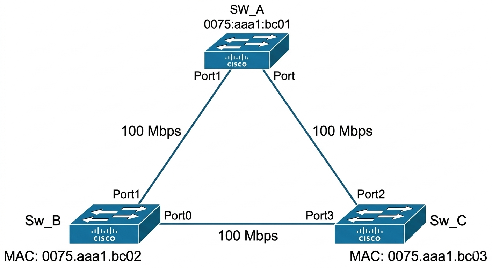
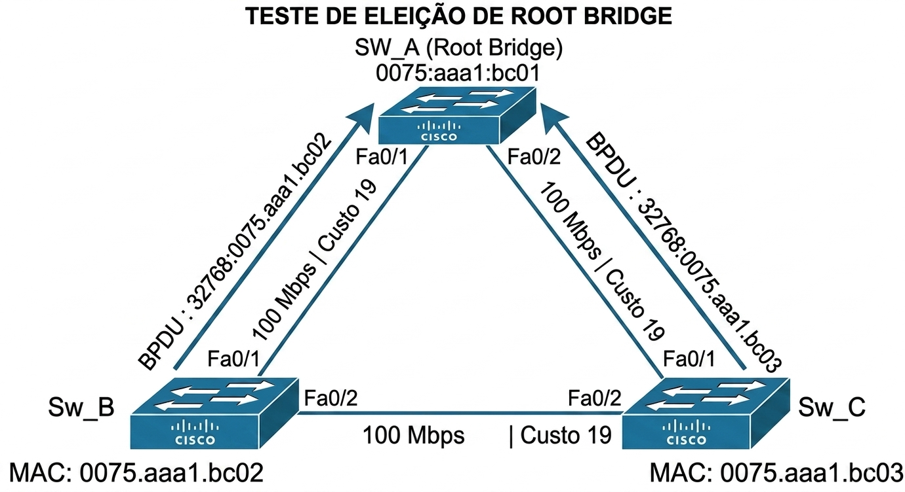
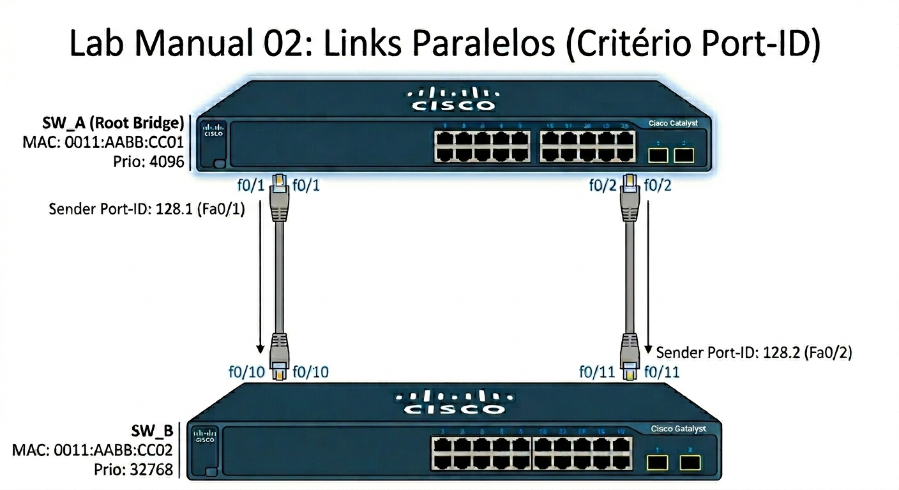
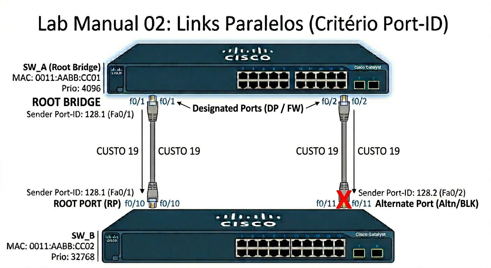
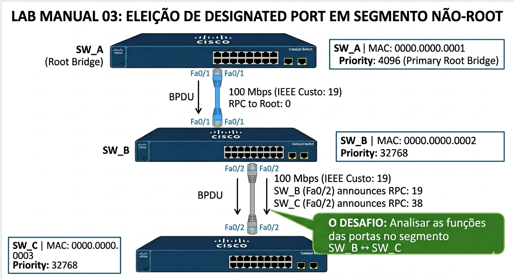
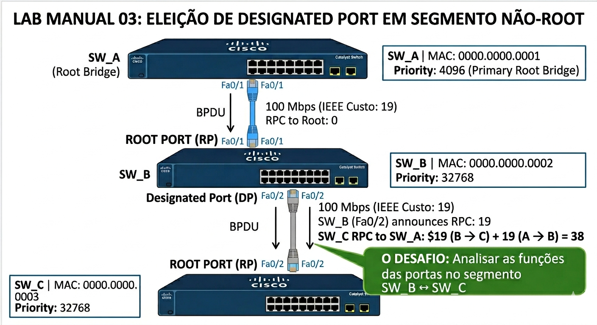

# 🟢 Nível 1 — Básico

Bem-vindo ao nível básico. Este é o ponto de partida da sua jornada para dominar o Spanning Tree Protocol (STP). Se você é novo no mundo das redes chaveadas (switched networks), este nível foi projetado para construir uma base sólida e fundamental.  
  
Neste nível, vamos focar nos conceitos estruturais e na "anatomia" de uma topologia STP simples. Você aprenderá a identificar os papéis essenciais dos equipamentos, focando na eleição do Root Bridge baseada na Prioridade e no MAC Address, e entenderá como os custos padrão dos links influenciam os caminhos. O objetivo aqui é compreender a lógica inicial que o protocolo utiliza para quebrar loops físicos em cenários sem complexidades avançadas.  
  
# 📝 Lab Manual 01: Eleição e Cálculo no Triângulo (Hierarquia de Decisão)

Neste exercício, aplique os quatro critérios de desempate do STP na ordem correta para determinar a função de cada porta.

### 🖼️ Topologia do Cenário

**Dados Técnicos (Baseados na Imagem):**

* **SW_A:** MAC `0075:aaa1:bc01` | Prio: 32768
* **Sw_B:** MAC `0075.aaa1.bc02` | Prio: 32768
* **Sw_C:** MAC `0075.aaa1.bc03` | Prio: 32768
* **Velocidade:** 100 Mbps (**Custo IEEE: 19**)

---

### ✍️ Laboratório de Cálculo (Interativo)

| Critério de Decisão                             | Sua Resposta (Clique e Digite)                                                                  |
| :---                                            | :---                                                                                            |
| **1. Quem é o Root Bridge?**                    | 
[ Digite aqui ]
 |
| **2. Menor Custo até o Raiz (Root Path Cost)?** | 
[ Digite aqui ]
 |
| **3. Menor BID Recebido (Sender BID)?**         | 
[ Digite aqui ]
 |
| **4. Menor Port-ID Recebido (Sender Port ID)?** | 
[ Digite aqui ]
 |

---

### 🔍 Gabarito Técnico (Checklist CCNP)

Clique na seta para validar sua linha de raciocínio.

<b>✅ CLIQUE AQUI PARA VER A RESPOSTA</b>

#### 1. Quem é o Root Bridge?

**SW_A**.

* **Por que?** Empate na prioridade (32768), vitória pelo menor MAC Address (`...bc01`).

#### 2. Menor Custo até o Raiz (RPC)

* **Sw_B:** Custo 19 (via porta direta para SW_A).
* **Sw_C:** Custo 19 (via porta direta para SW_A).

#### 3. Menor BID Recebido (Sender BID)

Este critério define quem ganha como **Designated Port** no segmento entre Sw_B e Sw_C:

* O **Sw_B** envia BPDUs com BID `32768:0075.aaa1.bc02`.
* O **Sw_C** envia BPDUs com BID `32768:0075.aaa1.bc03`.
* **Resultado:** Sw_B tem o menor BID. Portanto, Sw_B vence a eleição no segmento. A porta do Sw_C torna-se **Alternate (Bloqueada)**.

#### 4. Menor Port-ID Recebido

* **Neste cenário:** Não foi necessário usar este critério para desempate, pois o BID (passo 3) já resolveu a disputa no segmento Sw_B/Sw_C. Este critério só seria usado se houvesse **dois links paralelos** entre os mesmos switches.

---

### 🚀 Dica de Prova (ENCOR 350-401)

Sempre que analisar um switch, pergunte nesta ordem:

1. Qual porta tem o menor custo para o Root? (**Root Port**)
2. Se empatar no custo, qual vizinho tem o menor Bridge ID?
3. Se for o mesmo vizinho (links duplos), qual porta do vizinho é a menor? (**Port ID**)

---

# 📝 Lab Manual 02: Links Paralelos (O critério do Port-ID)

Neste exercício, vamos analisar o que acontece quando temos redundância direta entre apenas dois switches. Aqui, o foco é entender quem manda no desempate quando o BID e o Custo são idênticos.

### 🖼️ Topologia do Cenário

**Dados Técnicos para sua análise:**

* **SW_A:** MAC `0011:AABB:CC01` | Prioridade: **4096** 
* **SW_B:** MAC `0011:AABB:CC02` | Prioridade: 32768
* **Conexões:**
  * Cabo 1: SW_A (Fa0/1) <---> SW_B (Fa0/10)
  * Cabo 2: SW_A (Fa0/2) <---> SW_B (Fa0/11)
* **Velocidade:** 100 Mbps (**Custo IEEE**)

---

### ✍️ Laboratório de Cálculo (Interativo)

| Critério de Decisão                             | Sua Resposta (Clique e Digite)                                                                  |
| :---                                            | :---                                                                                            |
| **1. Quem é o Root Bridge e por que?**          | 
[ Digite aqui ]
 |
| **2. Qual o Root Path Cost (RPC) do SW_B?**     | 
[ Digite aqui ]
 |
| **3. As portas do SW_A serão o quê?**           | 
[ Digite aqui ]
 |
| **4. Qual porta do SW_B será bloqueada?**       | 
[ Digite aqui ]
 |
| **5. Qual foi o critério final de desempate?**  | 
[ Digite aqui ]
 |

---

### 🔍 Gabarito Técnico (Checklist CCNP)

<b>✅ CLIQUE AQUI PARA VER A RESPOSTA</b>

#### 1. Quem é o Root Bridge?

**SW_A**. Ele possui a menor prioridade configurada (4096).

#### 2. Root Path Cost (RPC)

O SW_B alcança o Root através de dois links de 100Mbps. O custo para ambos os caminhos é **19**.

#### 3. Funções das Portas no SW_B (O Pulo do Gato)

Como há um empate de custo (19 vs 19) e um empate de Sender BID (ambos os links vêm do mesmo SW_A), o STP recorre ao **menor Port-ID do vizinho (Sender)**:

* Pela porta Fa0/10, o SW_B recebe o Port-ID **128.1** (de Fa0/1 do SW_A).
* Pela porta Fa0/11, o SW_B recebe o Port-ID **128.2** (de Fa0/2 do SW_A).

**Resultado:**

* **SW_B Fa0/10:** Torna-se **Root Port (RP)** pois recebe o menor ID de porta do SW_A.
* **SW_B Fa0/11:** Torna-se **Alternate Port (Altn/BLK)**.

#### 4. Funções das Portas no SW_A

Como Root Bridge, todas as suas portas ativas são **Designated Ports (DP)** em estado de **Forwarding**.

---

# 📝 Lab Manual 03: Eleição de Designated Port em Segmento Não-Root

Neste terceiro exercício de nível básico, vamos explorar como os switches decidem qual porta ficará ativa em um segmento (cabo) onde nenhum dos switches conectados é o Root Bridge. O foco é entender o conceito de "proximidade lógica" (menor custo acumulado).

### 🖼️ Topologia do Cenário

**Dados Técnicos para sua análise:**

* **SW_A (Topo):** MAC `0000.0000.0001`  | Prio: **4096** (Eleito o Root Bridge)
* **SW_B (Meio):** MAC `0000.0000.0002`  | Prio: 32768
* **SW_C (Baixo):** MAC `0000.0000.0003` | Prio: 32768
* **Todos os Links:** 100 Mbps (**Custo IEEE: 19**)

**O Desafio:** Analisar as funções das portas no segmento de cabo entre o **SW_B** e o **SW_C**.

---

### ✍️ Laboratório de Cálculo (Interativo)

| Pergunta de Análise                                                         | Sua Resposta (Clique e Digite)                                                                 |
| :---                                                                        |:---                                                                                            |
| **1. Qual a Root Port (RP) do SW_B?**                                       |
[ Digite aqui ]
 |
| **2. Qual a Root Port (RP) do SW_C?**                                       |
[ Digite aqui ]
 |
| **3. Qual o Root Path Cost (RPC) do SW_B?**                                 |
[ Digite aqui ]
 |
| **4. No segmento entre B e C, quem vence a eleição de Designated Port (DP) e por quê?** | 
[ Digite aqui ]
 |

---

### 🔍 Gabarito Técnico (Checklist CCNP)

<b>✅ CLIQUE AQUI PARA VER A RESPOSTA</b>

#### 1. Root Ports (RP)

* **SW_B:** A porta Fa0/1 é sua RP (caminho direto para o Root SW_A, custo 19).
* **SW_C:** A porta Fa0/2 é sua RP. Como não há cabo direto para SW_A, o SW_C deve ir através do SW_B. O custo acumulado é $19 (B \to C) + 19 (A \to B) = \mathbf{38}$.

#### 2. Root Path Cost (RPC) para o Cálculo do Segmento

Para decidir quem é DP no cabo entre B e C, comparamos o RPC que cada switch anuncia nesse cabo:

* **SW_B:** Anuncia que seu custo para chegar ao Root é **19**.
* **SW_C:** Anuncia que seu custo para chegar ao Root é **38**.

#### 3. Eleição de Designated Port (DP) no segmento SW_B ↔ SW_C

O STP elege como Designated Port a porta do switch que tem o **menor Root Path Cost (RPC)** naquele segmento.

* **Resultado:** O SW_B vence ($19 < 38$).
* **SW_B (Fa0/2):** Torna-se **Designated Port (DP)**.
* **SW_C (Fa0/2):** Já tínhamos definido que ela é a **Root Port (RP)** do SW_C no passo 1. Lembre-se: uma porta não pode ser RP e DP ao mesmo tempo no mesmo segmento. Como ela é a melhor rota de C para o Root, sua função primária é RP.

**Conclusão do Cenário:** Neste cabo, ambas as portas ficam em **Forwarding** (DP de um lado, RP do outro), pois este é o único caminho para o SW_C alcançar o resto da rede.

