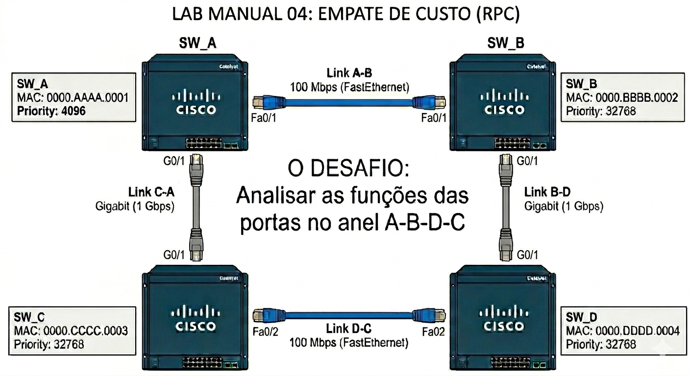
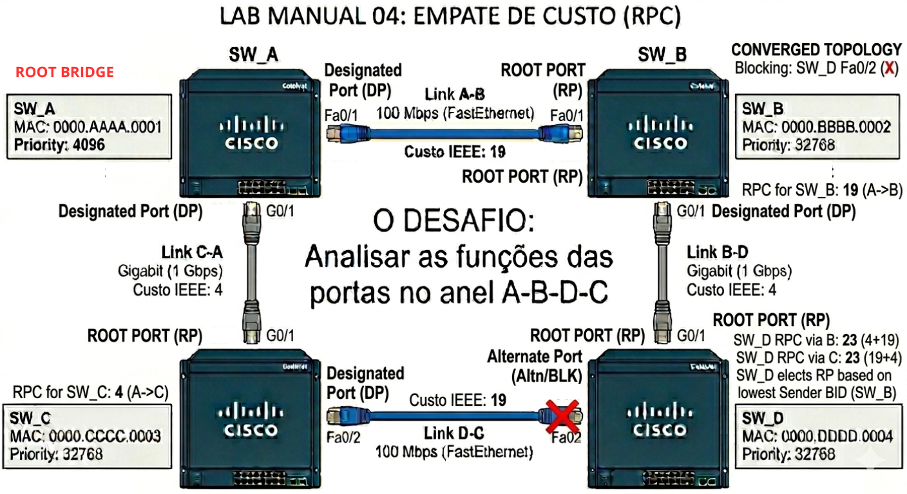
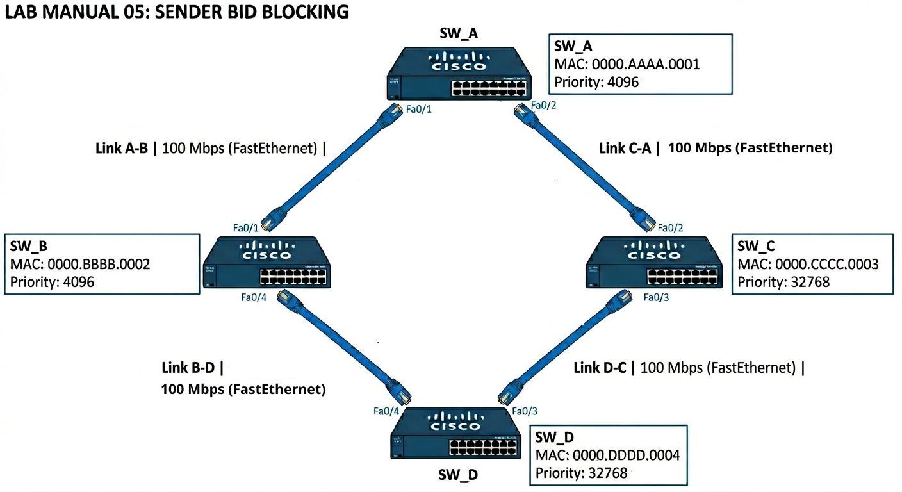
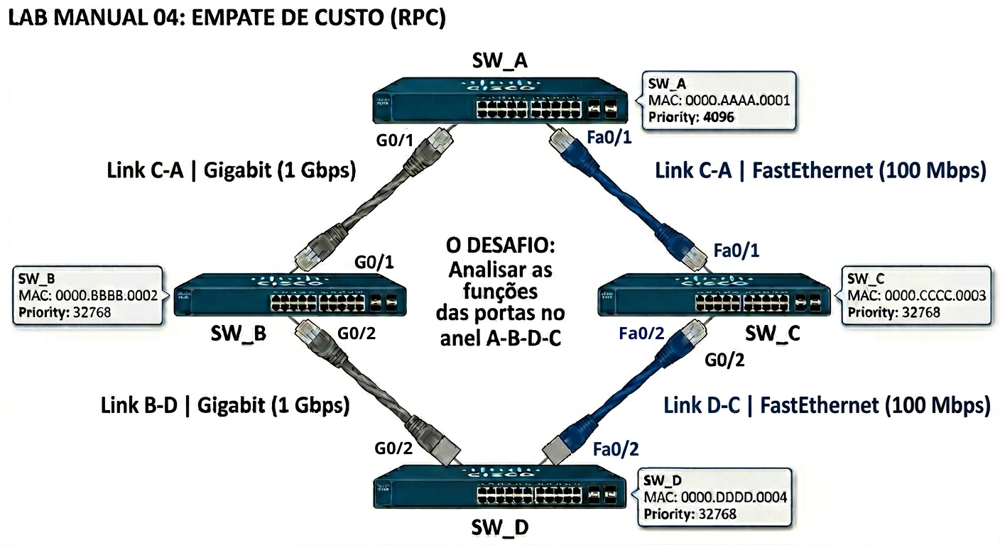
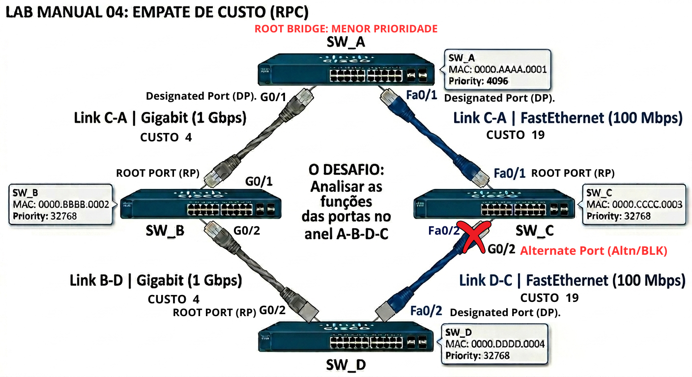
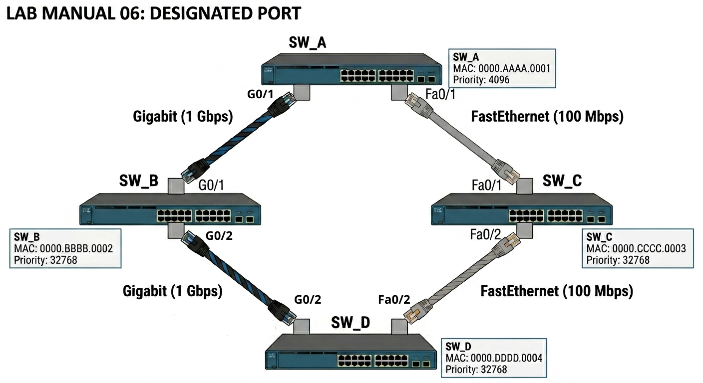
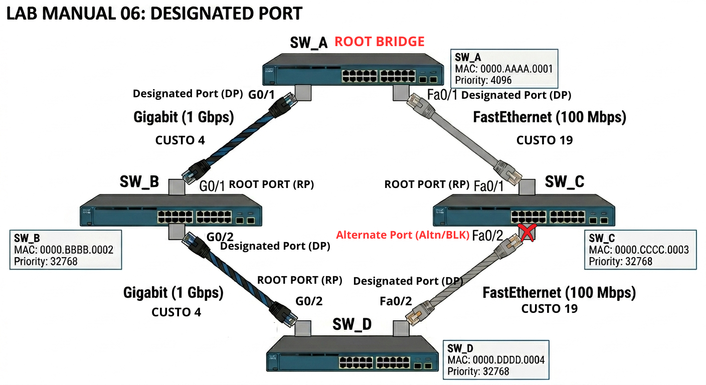

# 🟡 Nível 2 — Intermediário

Neste nível, as topologias se tornam mais complexas. Vamos introduzir custos de links diferentes (misturando Gigabit e FastEthernet) e cenários onde a manipulação manual da prioridade é necessária para desenhar o fluxo de tráfego ideal.

# 📝 Lab Manual 04: Empate de Custo (RPC) e Custo de Link Superior

Neste exercício, vamos analisar uma topologia em anel com 4 switches. O desafio é determinar o bloqueio quando um switch (SW_D) tem dois caminhos com o mesmo custo total para o Root Bridge, mas os links individuais que compõem esses caminhos têm velocidades diferentes.

### 🖼️ Topologia do Cenário

**Dados Técnicos para sua análise:**

* **SW_A:** MAC `0000.AAAA.0001` | Prio: **4096** (Eleito o Root Bridge)
* **SW_B:** MAC `0000.BBBB.0002` | Prio: 32768
* **SW_C:** MAC `0000.CCCC.0003` | Prio: 32768
* **SW_D:** MAC `0000.DDDD.0004` | Prio: 32768
* **Tabela de Custos IEEE (Revisão):**
  * **1 Gbps (Gigabit):** Custo **4**
  * **100 Mbps (FastEthernet):** Custo **19**

---

### ✍️ Laboratório de Cálculo (Interativo)

| Pergunta de Análise                                    | Sua Resposta (Clique e Digite)                                                                                      |
| :---                                                   | :---                                                                                                                |
| **1. Qual a Root Port (RP) do SW_B e qual o seu RPC?** | 
[ Digite aqui ]
                     |
| **2. Qual a Root Port (RP) do SW_C e qual o seu RPC?** | 
[ Digite aqui ]
                     |
| **3. Analise o SW_D: Qual o custo total para o Root pelo caminho B (D-B-A)?**|
[ Digite aqui ]
 |
| **4. Analise o SW_D: Qual o custo total para o Root pelo caminho C (D-C-A)?**|
[ Digite aqui ]
 |
| **5. Diante do empate de custo no SW_D, qual será sua Root Port (RP) e por quê?**|
[ Digite aqui ]
 |
| **6. Qual porta será eleita Designated Port (DP) no segmento entre B e D?** |
[ Digite aqui ]
 |

---

### 🔍 Gabarito Técnico (Checklist CCNP)

<b>✅ CLIQUE AQUI PARA VER A RESPOSTA</b>

#### 1. Root Ports (RP) dos Switches Vizinhos

* **SW_B:** Sua RP é a porta para SW_A (link FastEthernet). RPC = **19**.
* **SW_C:** Sua RP é a porta para SW_A (link Gigabit). RPC = **4**.

#### 2. Análise do Empate de Custo no SW_D

O SW_D tem dois caminhos para o Root SW_A:

* **Caminho via B (D $\to$ B $\to$ A):** Custo 4 (D-B) + Custo 19 (B-A) = **23**.
* **Caminho via C (D $\to$ C $\to$ A):** Custo 19 (D-C) + Custo 4 (C-A) = **23**.

**Temos um empate de Root Path Cost (RPC = 23).**

#### 3. Desempate para a Root Port do SW_D

Quando o custo empata, o STP utiliza o próximo critério: **Menor BID do Vizinho (Sender BID)**.

* Pelo caminho B, o vizinho é o SW_B (BID `32768:0000.BBBB.0002`).
* Pelo caminho C, o vizinho é o SW_C (BID `32768:0000.CCCC.0003`).

**Resultado:** O BID do SW_B é menor que o do SW_C (`...BBBB...` < `...CCCC...`).

* **SW_D (Porta para SW_B):** Torna-se a **Root Port (RP)**.

#### 4. Bloqueio e Designated Ports no Anel

Agora precisamos definir quem bloqueia no segmento restante. Vamos analisar o segmento entre o **SW_C** e o **SW_D**:

* **Quem é DP nesse segmento?** Comparamos o RPC anunciado:
  * SW_C anuncia RPC para o Root = **4**.
  * SW_D anuncia RPC para o Root = **23**.
* **Resultado:** SW_C vence por ter o menor custo acumulado.
  * **SW_C (Porta para SW_D):** Torna-se **Designated Port (DP)**.
* **SW_D (Porta para SW_C):** Sem outra função, torna-se **Alternate Port (Altn/BLK)** e é bloqueada.

---

# 📝 Lab Manual 05: O Peso do Sender BID no Bloqueio

Neste quinto exercício, o desafio se torna mais sutil. Você encontrará uma topologia em anel onde, à primeira vista, tudo parece simétrico para um dos switches. O objetivo é analisar rigorosamente a hierarquia de decisão para entender qual porta será bloqueada quando o custo empata e os vizinhos têm a mesma prioridade.

### 🖼️ Topologia do Cenário

**Dados Técnicos para sua análise:**

* **SW_A:** MAC `0000.AAAA.0001` | Prioridade: **4096** (Root Bridge)
* **SW_B:** MAC `0000.BBBB.0002` | Prioridade: **4096** (Mesma prioridade do Root!)
* **SW_C:** MAC `0000.CCCC.0003` | Prioridade: 32768
* **SW_D:** MAC `0000.DDDD.0004` | Prioridade: 32768
* **Todos os Links:** FastEthernet 100 Mbps (**Custo IEEE: 19**)

---

### ✍️ Laboratório de Cálculo (Interativo)

| Pergunta de Análise                                    | Sua Resposta (Clique e Digite)                                                                  |
| :---                                                   | :---                                                                                            |
| **1. Confirme: Quem é o Root Bridge e por quê?**       | 
[ Digite aqui ]
 |
| **2. Qual a Root Port (RP) do SW_B e qual o seu RPC?** | 
[ Digite aqui ]
 |
| **3. Qual a Root Port (RP) do SW_C e qual o seu RPC?** | 
[ Digite aqui ]
 |
| **4. Analise o SW_D: Qual o custo total acumulado pelos dois caminhos (D-B-A e D-C-A)?** | 
[ Digite aqui ]
 |
| **5. Diante do empate de custo, qual será a Root Port (RP) do SW_D e qual critério resolveu?** | 
[ Digite aqui ]
 |
| **6. No segmento entre C e D, quem vence a eleição de Designated Port (DP)?** | 
[ Digite aqui ]
 |

---

### 🔍 Gabarito Técnico (Checklist CCNP)

<b>✅ CLIQUE AQUI PARA VER A RESPOSTA</b>

#### 1. Confirmação do Root Bridge

**SW_A**.

* **Por que?** Tem a prioridade configurada para 4096. O SW_B também tem 4096, mas o MAC do SW_A (`...AAAA...`) é menor que o do SW_B (`...BBBB...`).

#### 2. Root Ports (RP) dos Vizinhos

* **SW_B:** Sua RP é a porta para SW_A. RPC = **19**.
* **SW_C:** Sua RP é a porta para SW_A. RPC = **19**.

#### 3. O Desempate Crítico no SW_D

O SW_D tem dois caminhos simétricos para o Root:

* **Caminho via B (D $\to$ B $\to$ A):** Custo 19 (D-B) + Custo 19 (B-A) = **38**.
* **Caminho via C (D $\to$ C $\to$ A):** Custo 19 (D-C) + Custo 19 (C-A) = **38**.

**Temos um empate de Root Path Cost (RPC = 38).**

O próximo critério é o **Menor BID do Vizinho (Sender BID)**. O SW_D compara os BIDs que seus vizinhos estão anunciando para ele nos BPDUs:

* **BID do Vizinho B (SW_B):** `4096:0000.BBBB.0002` (Prioridade 4096 + MAC)
* **BID do Vizinho C (SW_C):** `32768:0000.CCCC.0003` (Prioridade 32768 + MAC)

**Resultado:** O BID do SW_B é muito menor que o do SW_C ($4096 < 32768$).

* **SW_D (Porta para SW_B):** Torna-se a **Root Port (RP)**.

#### 4. Bloqueio no Anel

A porta que não foi eleita RP no SW_D (porta para SW_C) precisa de uma função. Vamos analisar o segmento entre **SW_C** e **SW_D**:

* **Quem é DP nesse segmento?** Comparamos o RPC anunciado:
  * SW_C anuncia RPC para o Root = **19**.
  * SW_D anuncia RPC para o Root = **38**.
* **Resultado:** SW_C vence por ter o menor custo acumulado.
  * **SW_C (Porta para SW_D):** Torna-se **Designated Port (DP)**.
  * **SW_D (Porta para SW_C):** Sem outra função, torna-se **Alternate Port (Altn/BLK)** e é bloqueada.

Neste exercício, a manipulação da prioridade do SW_B (colocando-a igual à do Root) foi o fator decisivo para a eleição no SW_D, muito antes de precisarmos olhar para os MAC Address no nível de BID.

---

# 📝 Lab Manual 06: Proximidade Lógica e a Designated Port

Neste sexto e último exercício do nível intermediário, vamos consolidar o entendimento sobre como os switches "não-raiz" colaboram para determinar o fluxo de tráfego. O foco é entender quem manda no bloqueio de um cabo redundante.

O STP utiliza o critério de proximidade lógica (Custo Acumulado) para eleger a porta que ficará ativa em um segmento onde nenhum dos switches é o Root. A porta do switch que tiver o **menor Root Path Cost (RPC)** para o Root Bridge vence e torna sua porta a **Designated Port (DP)**, deixando-a em estado de **Forwarding**.

### 🖼️ Topologia do Cenário

**Dados Técnicos para sua análise:**

* **SW_A (Root):** MAC `0000.AAAA.0001` | Prio: **4096** (Root Bridge)
* **SW_B:** MAC `0000.BBBB.0002` | Prio: 32768
* **SW_C:** MAC `0000.CCCC.0003` | Prio: 32768
* **SW_D:** MAC `0000.DDDD.0004` | Prio: 32768
* **Tabela de Custos IEEE (Revisão):**
    * **1 Gbps (Gigabit):** Custo **4**
    * **100 Mbps (FastEthernet):** Custo **19**

---

### ✍️ Laboratório de Cálculo (Interativo)

| Pergunta de Análise                                                        | Sua Resposta (Clique e Digite)                                                                 |
| :---                                                                       | :---                                                                                           |
| **1. Confirme: Quem é o Root Bridge e por quê?** | 
[ Digite aqui ]
 |
| **2. Qual a Root Port (RP) do SW_B e qual o seu RPC?** | 
[ Digite aqui ]
 |
| **3. Qual a Root Port (RP) do SW_C e qual o seu RPC?** | 
[ Digite aqui ]
 |
| **4. Analise o SW_D: Qual o custo total acumulado pelo caminho B (D-B-A)?** | 
[ Digite aqui ]
 |
| **5. Analise o SW_D: Qual o custo total acumulado pelo caminho C (D-C-A)?** | 
[ Digite aqui ]
 |
| **6. Qual será a Root Port (RP) do SW_D e qual o seu RPC total?** | 
[ Digite aqui ]
 |
| **7. No segmento entre SW_D e SW_C (D-C), qual switch vence a eleição de DP e por quê?** | 
[ Digite aqui ]
 |
| **8. Neste mesmo segmento (D-C), qual porta é bloqueada?** | 
[ Digite aqui ]
 |

---

### 🔍 Gabarito Técnico (Checklist CCNP)

<b>✅ CLIQUE AQUI PARA VER A RESPOSTA</b>

#### 1. Confirmação do Root Bridge e Root Ports dos Vizinhos

* **Root Bridge:** **SW_A**. Eleito pela menor prioridade (4096).
* **SW_B:** RP é para SW_A (link Gigabit). RPC = **4**.
* **SW_C:** RP é para SW_A (link FastEthernet). RPC = **19**.

#### 2. Eleição de Root Port no SW_D

O SW_D tem dois caminhos:

* **Caminho via B (D $\to$ B $\to$ A):** Custo 4 (D-B) + Custo 4 (B-A) = **8**.
* **Caminho via C (D $\to$ C $\to$ A):** Custo 19 (D-C) + Custo 19 (C-A) = **38**.

**Resultado:** O caminho via B tem custo muito menor.

* **SW_D (Porta para SW_B):** Torna-se a **Root Port (RP)** com RPC total de **8**.

#### 3. Eleição de Designated Port no Segmento SW_D/SW_C (D-C)

Aqui está o foco do laboratório: o SW_D tem redundância conectando-se a dois switches vizinhos que não são o Root (B e C), mas ele já elegeu sua RP (via B). O cabo que o liga ao SW_C é redundante e precisa de um ponto de bloqueio.

Para determinar qual porta será Designated (DP) e qual será Alternate (Bloqueada) no segmento D-C, comparamos o **Root Path Cost (RPC)** que cada switch *anuncia* naquele segmento:

* **SW_D anuncia:** "Custo total para chegar ao Root = **8**" (anuncia o custo de sua RP).
* **SW_C anuncia:** "Custo total para chegar ao Root = **19**" (anuncia o custo de sua RP).

**Resultado:** SW_D vence ($8 < 19$). O switch mais próximo logicamente do Root Bridge vence.

* **SW_D (Porta para SW_C):** Torna-se a **Designated Port (DP)**.
* **SW_C (Porta para SW_D):** Torna-se **Alternate Port (Altn/BLK)** e é bloqueada.

#### Conclusão Visual do Cenário

Neste cabo redundante (D-C), a porta do switch mais robusto (D) fica ativa, enquanto a porta do switch mais lento (C) é bloqueada. Isso direciona o tráfego preferencialmente pelos links de 1Gbps.

---

# 📝 Lab Manual 06: Proximidade Lógica e a Designated Port

Neste sexto e último exercício do nível intermediário, vamos consolidar o entendimento sobre como os switches "não-raiz" colaboram para determinar o fluxo de tráfego. O foco é entender quem manda no bloqueio de um cabo redundante.

O STP utiliza o critério de proximidade lógica (Custo Acumulado) para eleger a porta que ficará ativa em um segmento onde nenhum dos switches é o Root. A porta do switch que tiver o **menor Root Path Cost (RPC)** para o Root Bridge vence e torna sua porta a **Designated Port (DP)**, deixando-a em estado de **Forwarding**.

### 🖼️ Topologia do Cenário

**Dados Técnicos para sua análise:**

* **SW_A (Root):** MAC `0000.AAAA.0001` | Prio: **4096** (Root Bridge)
* **SW_B:** MAC `0000.BBBB.0002` | Prio: 32768
* **SW_C:** MAC `0000.CCCC.0003` | Prio: 32768
* **SW_D:** MAC `0000.DDDD.0004` | Prio: 32768
* **Tabela de Custos IEEE (Revisão):**
  * **1 Gbps (Gigabit):** Custo **4**
  * **100 Mbps (FastEthernet):** Custo **19**

---

### ✍️ Laboratório de Cálculo (Interativo)

| Pergunta de Análise                                    | Sua Resposta (Clique e Digite)                                                                                      |
| :---                                                   | :---                                                                                                                |
| **1. Confirme: Quem é o Root Bridge e por quê?**       | 
[ Digite aqui ]
                     |
| **2. Qual a Root Port (RP) do SW_B e qual o seu RPC?** | 
[ Digite aqui ]
                     |
| **3. Qual a Root Port (RP) do SW_C e qual o seu RPC?** | 
[ Digite aqui ]
                     |
| **4. Analise o SW_D: Qual o custo total acumulado pelo caminho B (D-B-A)?** | 
[ Digite aqui ]
 |
| **5. Analise o SW_D: Qual o custo total acumulado pelo caminho C (D-C-A)?** | 
[ Digite aqui ]
 |
| **6. Qual será a Root Port (RP) do SW_D e qual o seu RPC total?** | 
[ Digite aqui ]
 |
| **7. No segmento entre SW_D e SW_C (D-C), qual switch vence a eleição de DP e por quê?** | 
[ Digite aqui ]
 |
| **8. Neste mesmo segmento (D-C), qual porta é bloqueada?** | 
[ Digite aqui ]
 |

---

### 🔍 Gabarito Técnico (Checklist CCNP)

<b>✅ CLIQUE AQUI PARA VER A RESPOSTA</b>

#### 1. Confirmação do Root Bridge e Root Ports dos Vizinhos

* **Root Bridge:** **SW_A**. Eleito pela menor prioridade (4096).
* **SW_B:** RP é para SW_A (link Gigabit). RPC = **4**.
* **SW_C:** RP é para SW_A (link FastEthernet). RPC = **19**.

#### 2. Eleição de Root Port no SW_D

O SW_D tem dois caminhos:

* **Caminho via B (D $\to$ B $\to$ A):** Custo 4 (D-B) + Custo 4 (B-A) = **8**.
* **Caminho via C (D $\to$ C $\to$ A):** Custo 19 (D-C) + Custo 19 (C-A) = **38**.

**Resultado:** O caminho via B tem custo muito menor.

* **SW_D (Porta para SW_B):** Torna-se a **Root Port (RP)** com RPC total de **8**.

#### 3. Eleição de Designated Port no Segmento SW_D/SW_C (D-C)

Aqui está o foco do laboratório: o SW_D tem redundância conectando-se a dois switches vizinhos que não são o Root (B e C), mas ele já elegeu sua RP (via B). O cabo que o liga ao SW_C é redundante e precisa de um ponto de bloqueio.

Para determinar qual porta será Designated (DP) e qual será Alternate (Bloqueada) no segmento D-C, comparamos o **Root Path Cost (RPC)** que cada switch *anuncia* naquele segmento:

* **SW_D anuncia:** "Custo total para chegar ao Root = **8**" (anuncia o custo de sua RP).
* **SW_C anuncia:** "Custo total para chegar ao Root = **19**" (anuncia o custo de sua RP).

**Resultado:** SW_D vence ($8 < 19$). O switch mais próximo logicamente do Root Bridge vence.

* **SW_D (Porta para SW_C):** Torna-se a **Designated Port (DP)**.
* **SW_C (Porta para SW_D):** Torna-se **Alternate Port (Altn/BLK)** e é bloqueada.

#### Conclusão Visual do Cenário

Neste cabo redundante (D-C), a porta do switch mais robusto (D) fica ativa, enquanto a porta do switch mais lento (C) é bloqueada. Isso direciona o tráfego preferencialmente pelos links de 1Gbps.

