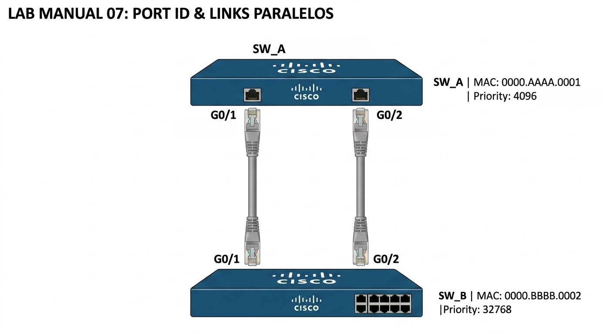
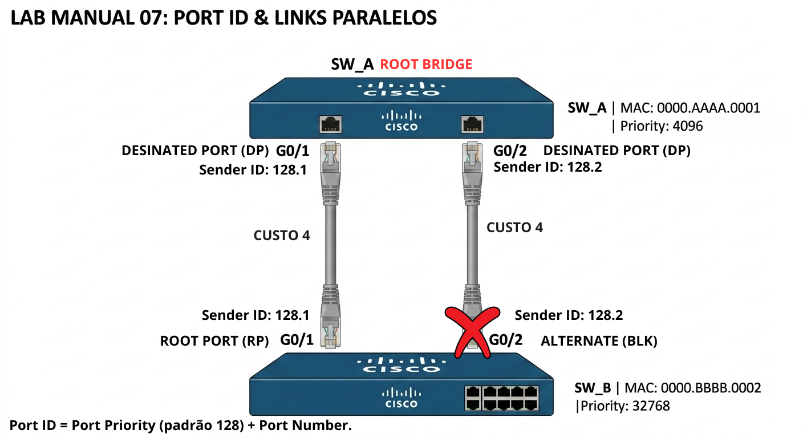
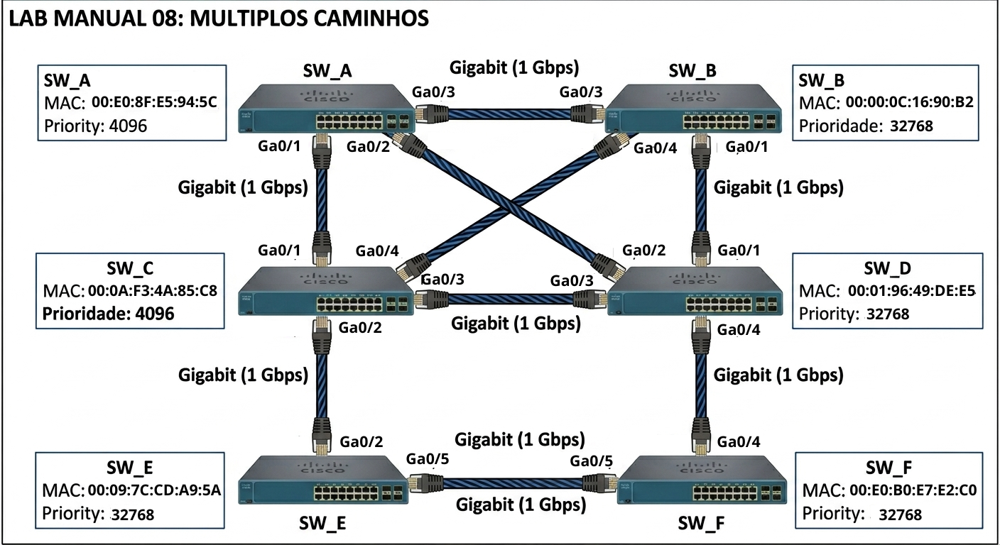
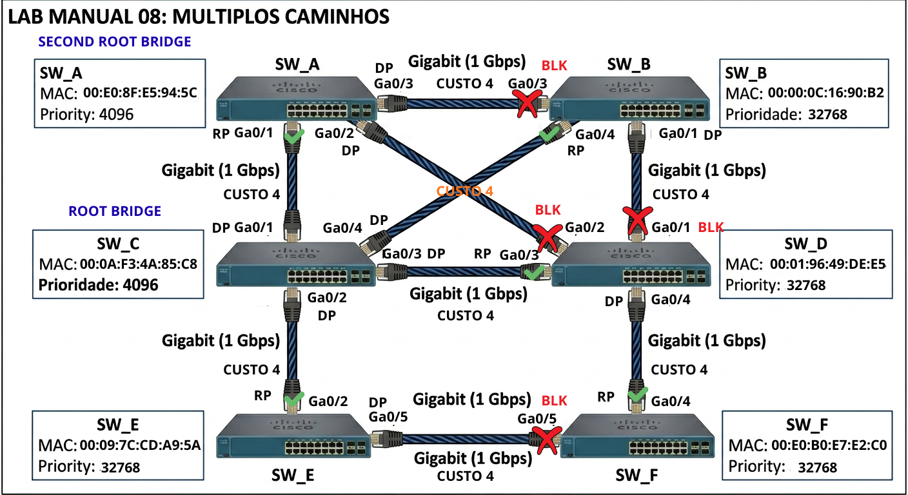
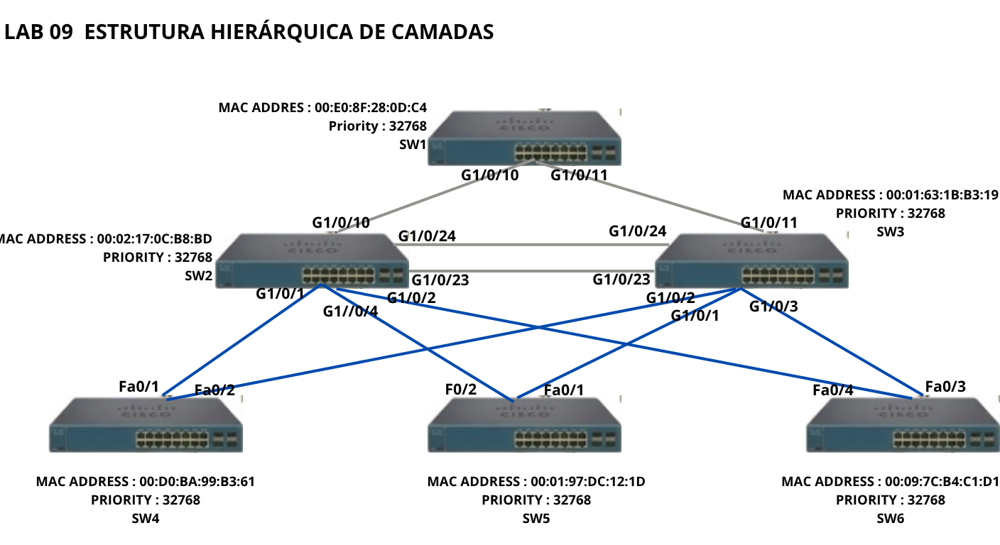
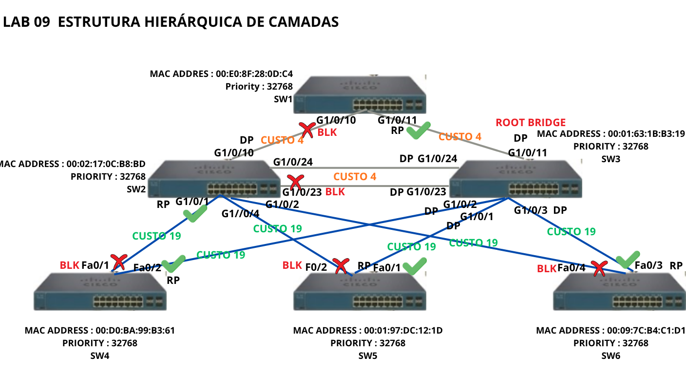

# 🔴 Nível 3 — Avançado

Bem-vindo ao nível avançado. Neste ponto, você já domina a eleição do Root Bridge, os cálculos de Custo Acumulado (RPC) e as desempates por BID (tanto Prioridade quanto MAC). As topologias anteriores foram resolvidas através destes critérios padrão.

Neste nível, vamos explorar os cenários de "último recurso" do STP. Você enfrentará topologias onde há um empate absoluto em Custo e em BID, forçando o protocolo a utilizar critérios baseados em IDs de porta ou até mesmo em características específicas do Sender BID, exigindo uma análise microscópica do protocolo.

# 🚀 Lab Manual 07: Port ID e Links Paralelos (Nível Avançado)

Bem-vindo ao nível avançado. Neste exercício, vamos explorar o que acontece quando todos os critérios de desempate padrão do STP falham. Quando temos dois cabos ligados entre os mesmos dois switches, os custos e os BIDs dos vizinhos são idênticos. 

Para resolver este loop, o STP utiliza o **Port ID** do switch vizinho (o remetente dos BPDUs). O Port ID é composto pela prioridade da porta (padrão 128) + o número da porta. O switch local bloqueará a porta que estiver conectada à porta de maior valor no vizinho.

### 🖼️ Topologia do Cenário

**Dados Técnicos para análise:**

* **SW_A (Root):** MAC `0000.AAAA.0001` | Prio: **4096**
* **SW_B:** MAC `0000.BBBB.0002` | Prio: 32768
* **Configuração de Portas no SW_A (Sender):**
  * Porta **G0/1**: Port ID `128.1`
  * Porta **G0/2**: Port ID `128.2`
* **Conexão:**
  * A porta **G0/1** do SW_A liga na **G0/1** do SW_B.
  * A porta **G0/2** do SW_A liga na **G0/2** do SW_B.

---

### ✍️ Laboratório de Cálculo (Interativo)

| Pergunta de Análise                                                        | Sua Resposta (Clique e Digite)                                                                  |
| :---                                                                       | :---                                                                                            |
| **1. Existe empate de Root Path Cost (RPC) no SW_B?**                      | 
[ Sim/Não ]
     |
| **2. O BID do vizinho (SW_A) é diferente para as duas portas do SW_B?**    | 
[ Sim/Não ]
     |
| **3. Qual o critério final que o SW_B usará para escolher sua Root Port?** | 
[ Digite o critério ]
 |
| **4. Entre as portas G0/1 e G0/2 do SW_A, qual tem o menor Port ID?**   | 
[ Digite a porta ]
 |
| **5. Qual porta do SW_B será a Root Port (RP)?**                        | 
[ Digite a porta ]
 |
| **6. Qual porta do SW_B será a Alternate Port (Altn/BLK)?**             | 
[ Digite a porta ]
 |

---

### 🔍 Gabarito Técnico (Regra de Ouro do Port ID)

<b>✅ CLIQUE AQUI PARA VER A EXPLICAÇÃO TÉCNICA</b>

#### O Processo de Decisão do SW_B:

**🔍 O que compõe o Port ID?**  
  
O Port ID é um valor de 16 bits usado pelo STP para desempate, composto por duas partes:

> Port ID=Prioridade da Porta (8 bits) + Número da Porta (8 bits)
  
* **O "128"**: Este é o valor padrão de Prioridade da Porta. É um valor configurável que permite que você influencie manualmente a escolha da Root Port, se necessário. Se não for alterado, o STP usa 128 por padrão.
* **O ".1" e ".2":** Estes são os números das portas físicas (Port Number).

No exemplo da topologia:  

* 128.1 indica a porta G0/1 (Prioridade padrão 128 + número da porta 1).
* 128.2 indica a porta G0/2 (Prioridade padrão 128 + número da porta 2).

1. **Menor Custo:** Empate (ambos são Gigabit, custo 4).
2. **Menor BID do Vizinho:** Empate (ambas as portas recebem BPDUs do mesmo switch, SW_A).
3. **Menor Port ID do VIZINHO (Sender Port ID):**
   * O SW_B olha para o que o SW_A está enviando.
   * Pela porta G0/1, o SW_B recebe a informação: "Eu sou a porta 128.1".
   * Pela porta G0/2, o SW_B recebe a informação: "Eu sou a porta 128.2".

**Resultado:** A porta G0/1 do SW_B vence porque está conectada à porta de menor ID do vizinho (G0/1 do SW_A).

* **SW_B G0/1:** Torna-se **Root Port (RP)**.
* **SW_B G0/2:** Torna-se **Alternate Port (Altn/BLK)** e é bloqueada.

*Lembre-se: O desempate é feito com base no ID da porta de quem ENVIA o BPDU, não de quem recebe!*

---

# 📝 Lab Manual 08: Hierarquia de Decisão e Múltiplos Caminhos

Bem-vindo ao oitavo exercício do nível avançado. Esta topologia é a mais complexa que enfrentamos até agora, com 6 switches e múltiplos caminhos redundantes de mesma velocidade (links Gigabit).
  
O desafio aqui é duplo e exige uma análise microscópica da hierarquia de decisão do STP. Primeiro, você terá que analisar a eleição do **Root Bridge**. Você descobrirá um cenário sutil onde dois switches diferentes têm a mesma prioridade configurada manualmente. O desempate final exigirá que você olhe para o MAC Address, o critério de "último recurso" no nível de BID.
  
Segundo, com a Root Bridge definida, você terá que lidar com empates de **Custo Acumulado (RPC)** em vários switches não-raiz. Para desempata-los e eleger as **Designated Ports (DP) e os pontos de bloqueio (BLK)**, você terá que analisar rigorosamente o BID de switches vizinhos diferentes, cada um com sua própria prioridade e MAC. Esta topologia é um teste final de tudo o que você aprendeu.

### 🖼️ Topologia do Cenário

**Dados Técnicos para sua análise:**

* **SW_A (Root):** MAC `0000.AAAA.0001` | Prio: **4096** (Root Bridge)
* **SW_C:** MAC `0000.CCCC.0003` | Prio: **4096** (Atenção: Mesma prioridade do Root!)
* **SW_E:** MAC `0000.EEEE.0005` | Prio: 32768
* **Todos os outros (B, D, F):** MACs correspondentes, Prio: 32768
* **Tabela de Custos IEEE (Revisão):**
  * **1 Gbps (Gigabit):** Custo **4**

---

### ✍️ Laboratório de Cálculo (Interativo)

| Pergunta de Análise                                                        | Sua Resposta (Clique e Digite)                                                                  |
| :---                                                                       | :---                                                                                            |
| **1. Confirme: Quem é o Root Bridge e por quê?**                           | 
[ Digite aqui ]
 |
| **2. Confirme: Quem é o Second Root Bridge e por quê?****                  | 
[ Digite aqui ]
 |
| **3. Qual é o custo dos Links ?**                                          | 
[ Digite aqui ]
 |
| **4. Quantas Root Port Existem ?**                                         | 
[ Digite aqui ]
 |
| **5. Em quais Switches e quais portas são Root Ports ?**                   | 
[ Digite aqui ]
 |
| **6. Explique a eleição de Root Port no SW_D. Qual melhor caminho ?**      | 
[ Digite aqui ]
 |
| **7. Quantas Designated Port (DP) Existem ?**                              | 
[ Digite aqui ]
 |
| **8. Em quais Switches e quais portas são Designated Ports (DP)? Marcar SW + Porta** | 
[ Digite aqui ]
 |
| **9. Quantas Portas Bloqueadas (BLK) Existem ?**                           | 
[ Digite aqui ]
 |
| **10.Em quais Switches e quais portas são Designated Ports (DP)? Marcar SW + Porta** | 
[ Digite aqui ]
 |

---

### 🔍 Gabarito Técnico (Checklist CCNP)

<b>✅ CLIQUE AQUI PARA VER A EXPLICAÇÃO TÉCNICA</b>

#### 1. Confirmação do Root Bridge  

| **ORDEM** | **MENOR MAC ADRRESS** | **SWITCH** | **PRIORIDADE** |
| :---:     | :---:                 | :---:      | :---:          |
| 1         | **00:0A:F3:4A:85:C8** | **SW_C**   | **4096**       |
| 2         | 00:00:0C:16:90:B2     | SW_B       | 32768          |
| 3         | 00:E0:8F:E5:94:5C     | SW_A       | **4096**       |
| 4         | 00:01:96:49:DE:E5     | SW_D       | 32768          |
| 5         | 00:E0:B0:E7:E2:C0     | SW_F       | 32768          |
| 6         | 00:09:7C:CD:A9:5A     | SW_E       | 32768          |

* **Root Bridge:** **SW_C**. Eleito pela menor **MAC ADDRESS 00:0A:F3:4A:85:C8** + **MENOR ?PRIORIDADE (4096).**

#### 2. Confirmação do Second Root Bridge

* **Second Root Bridge:** **SW_A**. Eleito pelo segundo menor **MAC ADDRESS 00:E0:8F:E5:94:5C** + **MENOR ?PRIORIDADE (4096).**

#### 3. Confirmação dos Custos dos Links

* Todos os links são de **1 Gbps**. Então o custo é **4**

#### 4. Quantas Root Port (RP) Existem ?

* Existem **5 ROOT PORTS** no total

#### 5. Em quais Switches e quais portas são Root Ports (RP)?

* **ROOT PORT** = Porta com menor custo acumulado para o **ROOT BRIDGE**
  
| **SWITCH** | **ROOT PORT** | **CAMINHO SW_PORTA**                                   | **CUSTO ACUMULADO** |
| :---:      | :---:         | :---:                                                  | :---:               |
| SW_A       | G0/1          | SW_A_G0/1 ---> SW_C_G0/2                               | 4                   |
| SW_B       | G0/4          | SW_C_G0/4 ---> SW_B_G0/4                               | 4                   |
| SW_D       | G0/3          | SW_D_G0/3 ---> SW_B G0/3                               | 4                   |
| SW_E       | G0/2          | SW_E_G0/2 ---> SW_C_G0/2                               | 4                   |
| SW_F       | G0/4          | SW_F_G0/4 ---> SW_D_G0/4 ---> SW_D_G0/3 ---> SW_C_G0/3 | 4 + 4 + 4 = 12      |

#### 6. Explique a eleição de Root Port (RP) no SW_D

O SW_D tem 3 caminhos principais para o ROOT BRIDGE (SW_C):

* **Caminho via SW_B (SW_D $\to$ SW_B $\to$ SW_A $\to$ SW_C):** Custo 4 (D-B) + Custo 4 (B-A) + Custo 4 (A-C) = **12**
* **Caminho via SW_A (SW_D $\to$ SW_A $\to$ SW_C):** Custo 4 (D-A) + Custo 4 (A-C) = **8**
* **Caminho via SW_D (SW_D $\to$ SW_C):** Custo 4 (D-C) = **4 MENOR CUSTO ACUMULADO**

#### 7. Quantas Designated Port (DP) Existem ?

* Existem **9 ROOT PORTS** no total

#### 8. Em quais Switches e quais portas são Designated Ports (DP)?

* **Designated Port** = Porta que atenda os critérios na ordem: **Menor Custo de Caminho para o Root Bridge (Root Path Cost)**, **Menor Bridge ID (BID) do Switch**, **Menor Port ID (Port ID)**

| **SWITCH** | **DESIGNATED PORT (DP)** | **Custo de Caminho para o Root Bridge (Root Path Cost)** | **Bridge ID (BID) do Switch** | **Port ID (Port ID)** |
| :---:      | :---:                    | :---:                                                    | :---:                         | :---:                 |
| SW_A       | G0/2                     | 4                                                        | 4096 : 00:E0:8F:E5:94:5C      | 128.2                 |
| SW_A       | G0/3                     | 4                                                        | 4096 : 00:E0:8F:E5:94:5C      | 128.3                 |
| SW_B       | G0/1                     | 8                                                        | 32768 : 00:00:0C:16:90:B2     | 128.1                 |
| SW_C       | G0/1                     | 4                                                        | 4096 : 00:0A:F3:4A:85:C8      | 128.1                 |
| SW_C       | G0/2                     | 4                                                        | 4096 : 00:0A:F3:4A:85:C8      | 128.2                 |
| SW_C       | G0/3                     | 4                                                        | 4096 : 00:0A:F3:4A:85:C8      | 128.3                 |
| SW_C       | G0/4                     | 4                                                        | 4096 : 00:0A:F3:4A:85:C8      | 128.4                 |
| SW_D       | G0/1                     | 4                                                        | 32768 : 00:09:7C:CD:A9:5A     | 128.1                 |
| SW_E       | G0/5                     | 8                                                        | 32768 : 00:E0:B0:E7:E2:C0     | 128.5                 |

#### 9. Quantas Portas Bloqueadas (BLK) Existem ?

* **Porta Bloqueada (BLK)** é toda a porta que não é **ROOT ou DESIGNADA**. Portanto existem **4 portas BLOQUEADAS (BLK)** no toal.

#### 10.Em quais Switches e quais portas são Designated Ports (DP)? Marcar SW + Porta

| **SWITCH** | **DESIGNATED PORT** |
| :---:      | :---:               |
| SW_B       | G0/3                |
| SW_D       | G0/1                |
| SW_D       | G0/2                |
| SW_F       | G0/5                |

**OBS:**

No STP clássico (802.1D) os estados de porta são:
  
| **Porta**                | **Condição**                                       |
| :---                     | :---                                               |
| **Root Port (RP)**       | Melhor caminho até o Root Bridge — 1 por switch    |
| **Designated Port (DP)** | Melhor porta do segmento em direção ao Root Bridge |
| **Blocked (BLK)**        | Toda porta que não é RP nem DP                     |

# 📝 Lab Manual 09: Cenário Completo Baseado no Modelo de 3 Camadas
  
Bem-vindo ao nono exercício do nível avançado. Esta topologia representa um design de rede clássico de 3 camadas (Core, Distribuição e Acesso), mas com links redundantes propositais que criam múltiplos loops físicos.  
  
O desafio aqui é consolidar todo o conhecimento adquirido até agora. Você enfrentará a necessidade de eleger um Root Bridge com base no Bridge ID (BID) padrão, calcular custos de caminho complexos que envolvem saltos por múltiplos switches e, crucialmente, resolver empates de eleição de porta Designated (DP) em segmentos onde os switches têm prioridades idênticas, forçando o uso do MAC Address como desempate final. Este laboratório é o teste definitivo da sua capacidade de análise do STP.  
  
### 🖼️ Topologia do Cenário

Aqui está a topologia detalhada para sua análise. Note que todos os switches são da Cisco e os links têm velocidades variadas.

**Dados Técnicos para sua análise (Extraídos da Imagem):**

* **SW1 (Topo):**      MAC `00:E0:8F:28:0D:C4` | Prioridade: **32768** (Padrão)
* **SW2 (Meio-Esq):**  MAC `00:02:17:0C:B8:BD` | Prioridade: **32768** (Padrão)
* **SW3 (Meio-Dir):**  MAC `00:01:63:1B:B3:19` | Prioridade: **32768** (Padrão)
* **SW4 (Base-Esq):**  MAC `00:D0:BA:99:B3:61` | Prioridade: **32768** (Padrão)
* **SW5 (Base-Meio):** MAC `00:01:97:DC:12:1D` | Prioridade: **32768** (Padrão)
* **SW6 (Base-Dir):**  MAC `00:09:7C:B4:C1:D1` | Prioridade: **32768** (Padrão)

---

### ✍️ Laboratório de Cálculo (Interativo)

Preencha a tabela abaixo com sua análise detalhada do protocolo.

| Pergunta de Análise                        | Sua Resposta (Clique e Digite)                                                                                                  |
| :---                                       | :---                                                                                                                            |
| **1. Quem é o Root Bridge da topologia ?** | 
[ Digite o Switch e o critério ]
                |
| **2. Qual é a Custo dos Links ?**          | 
[ Digite a resposta e o critério ]
              |
| **3. Qual é a Root Port (RP) do SW1 e qual o seu Root Path Cost (RPC)?** | 
[ Digite a porta e o custo ]
 |
| **4. Qual é a Root Port (RP) do SW5 e qual o seu Root Path Cost (RPC)?** | 
[ Digite a porta e o custo ]
 |
| **4. Explique a eleição de RP no SW6. Mostre os cálculos dos custos dos caminhos.** | 
[ Digite a explicação e os cálculos ]
 |
| **5. No segmento entre SW2 e SW3, qual porta será a Designated Port (DP)? Explique.** | 
[ Digite a porta e a explicação ]
 |
| **6. No segmento entre SW5 e SW2 (porta G1/0/4), qual porta será DP? Explique.** | 
[ Digite a porta e a explicação ]
 |
| **7. Quantas portas bloqueadas (BLK) existem no total na topologia?** | 
[ Digite a quantidade ]
 |
| **8. Liste 3 portas que ficarão no estado de Bloqueio (BLK). (Ex: SW_X Porta Y)** | 
[ Digite 3 portas ]
 |

---

### 🔍 Gabarito Técnico (Checklist CCNP)

<b>✅ CLIQUE AQUI PARA VER A EXPLICAÇÃO TÉCNICA E AS RESPOSTAS CORRETAS</b>

Este gabarito detalha o estado final de convergência da topologia.

#### 1. Eleição do Root Bridge

O Root Bridge é eleito pelo menor Bridge ID (Prioridade + MAC Address). Como todos os switches têm a prioridade padrão de 32768, o desempate é pelo menor MAC Address.

* **Comunidade dos MACs:** O MAC mais baixo é `00:01:63:1B:B3:19`.
* **Vencedor:** **SW3** é o Root Bridge.

#### 2. Qual é a Custo dos Links ?

* **Portas Gigabit** = custo **4**
* **Portas FastEthernet** = custo **19**

#### 3. Cálculo de Root Ports (RP)

Cada switch não-raiz escolhe a porta com o menor custo acumulado até o Root Bridge (SW3).

* **SW1:** A conexão direta é Gigabit (Custo 4). A Root Port é **G1/0/11** (RPC: **4**).
* **SW2:** A conexão direta é Gigabit (Custo 4). A Root Port é **G1/0/24** (RPC: **4**).
* **SW3:** É o Root Bridge, não tem Root Port.
* **SW4:**
  * Caminho via SW2: FastEthernet (19) + Gigabit (4) = 23.
  * Caminho via SW3: FastEthernet (19) + Gigabit (0, direto) = 19.
  * Root Port é **Fa0/2** (ligada ao SW3 G1/0/2) (RPC: **19**).
* **SW5:**
  * Caminho via SW2: FastEthernet (19) + Gigabit (4) = 23.
  * Caminho via SW3: FastEthernet (19) + Gigabit (0, direto) = 19.
  * Root Port é **Fa0/1** (ligada ao SW3 G1/0/1) (RPC: **19**).
* **SW6:**
  * Caminho via SW2: FastEthernet (19) + Gigabit (4) = 23.
  * Caminho via SW3: FastEthernet (19) + Gigabit (0, direto) = 19.
  * Root Port é **Fa0/3** (ligada ao SW3 G1/0/3) (RPC: **19**).

  | **SWITCH** | **CUSTO ACUMULADO** | **ROOT PORT** |
  | :---       | :---                | :---          |
  | SW1        | 4                   | G1/0/11       |
  | SW2        | 4                   | G1/0/24       |
  | SW4        | 19                  | Fa0/2         |
  | SW5        | 19                  | Fa0/1         |
  | SW6        | 19                  | Fa0/3         |

#### 4. Eleição de Designated Ports (DP) e Pontos de Bloqueio (BLK)

Para cada segmento de link, uma porta é eleita Designated Port (DP) para encaminhar tráfego. A porta oposta que não for DP nem RP é bloqueada. O critério de eleição de DP é: **Menor Root Path Cost (RPC) anunciado pelo switch e, em caso de empate, menor Bridge ID (BID) do switch remetente.**
  
Aqui estão as análises dos segmentos críticos de loop:
  
* **Segmento Central (SW1 <-> SW2 <-> SW3):**
  * Link SW1 G1/0/10 <-> SW2 G1/0/10:
    * RPC do SW1 (via G1/0/11 para SW3): 4.
    * RPC do SW2 (direto via G1/0/24 para SW3): 4.
    * Empate de custo. O desempate é pelo Bridge ID (BID).
    * BID do SW1: 32768 : 00:E0:8F...
    * BID do SW2: 32768 : 00:02:17...
    * SW2 vence (MAC mais baixo). A porta **SW2 G1/0/10** torna-se **DP**. A porta **SW1 G1/0/10** torna-se **BLK**.
  * Link SW2 G1/0/23 <-> SW3 G1/0/23:
    * SW3 é Root, RPC anunciado é 0. SW3 vence. A porta **SW3 G1/0/23** é **DP**. A porta **SW2 G1/0/23** é **BLK**.

* **Segmentos de Acesso Múltiplos (SW2 <-> SW_X <-> SW3):**
  * **Segmento SW4 Fa0/1 <-> SW2 G1/0/1:**
    * SW4 tem RP na porta Fa0/2 (RPC 19).
    * SW2 tem RPC 4.
    * SW2 vence (menor custo). A porta **SW2 G1/0/1** é **DP**. A porta **SW4 Fa0/1** é **BLK**.
  * **Segmento SW5 Fa0/2 <-> SW2 G1/0/4:**
    * SW5 tem RP na porta Fa0/1 (RPC 19).
    * SW2 tem RPC 4.
    * SW2 vence. A porta **SW2 G1/0/4** é **DP**. A porta **SW5 Fa0/2** é **BLK**.
  * **Segmento SW6 Fa0/4 <-> SW2 G1/0/2:**
    * SW6 tem RP na porta Fa0/3 (RPC 19).
    * SW2 tem RPC 4.
    * SW2 vence. A porta **SW2 G1/0/2** é **DP**. A porta **SW6 Fa0/4** é **BLK**.

**OBS:**
  
* O STP funciona através de fofoca (BPDUs). Um switch conta para o outro o que ele sabe sobre o Root Bridge.
  
  * **Custo Total do Caminho (Path Cost):** É uma análise interna e egoísta de um switch. O SW5 olha para a sua porta Fa0/2 e calcula: "Se eu enviar dados por aqui, vou pagar 19 (meu link azul) + 4 (o link cinza do SW2) = 23". Este custo de 23 é o que faz o SW5 decidir: "Esta porta não será minha Root Port".
  
  * **Root Path Cost (Custo Acumulado - RPC):** É a informação pública que um switch anuncia para os seus vizinhos para disputar quem manda no cabo. O RPC é sempre o custo da própria Root Port do switch que está falando.
  
> "Então o gabarito olha somente para o SW2 apesar da comunicação começar em SW5..."
  
O gabarito não olha "somente" para o SW2. O gabarito está descrevendo o resultado da comparação que ocorreu no cabo. O SW5 olhou para o custo anunciado pelo SW2 (4) e aceitou a derrota.
  
> "...ai sim o custo seria de 4 pois é a velocidade do cabo."

Cuidado aqui! O custo de 4 não é porque "a velocidade do cabo entre SW5 e SW2 é Gigabit". Esse cabo é FastEthernet (Azul, Custo 19). O custo de 4 é o custo do cabo cinza que liga o SW2 ao Root Bridge (SW3). O SW2 está contando para o SW5: "O meu caminho direto é custo 4".
  
> "Então o custo acumulado não é o mesmo do custo total ?"
  
Exatamente. O Custo Total que o SW5 teria (23) é irrelevante para a disputa no cabo. O que importa para a eleição de DP é o custo acumulado que o vizinho (SW2) já pagou para chegar lá.

> "Por que disso se estamos analisando o SW5 ?"
  
Estamos analisando o SW5 para decidir o estado final da porta dele. Para decidir se a porta Fa0/2 do SW5 fica aberta ou bloqueada, precisamos saber se ele venceu ou perdeu a eleição de Designated Port (DP) naquele cabo. E para saber isso, precisamos olhar para o custo que o concorrente (SW2) apresentou.

#### Resumo Final da Topologia Convergida

* **Root Bridge:** SW3
* **Portas Bloqueadas (BLK):** Total de **5 portas bloqueadas** para quebrar todos os loops.
  1. **SW1:** G1/0/10
  2. **SW2:** G1/0/23
  3. **SW4:** Fa0/1
  4. **SW5:** Fa0/2
  5. **SW6:** Fa0/4

| **SWITCH** | **PORTA** | **ROLE PORT** | **ROOT BRIDGE** |
| :---       | :---      | :---          | :---            |
| SW1        | G1/0/10   | **BLK**       | ---             |
| SW1        | G1/0/11   | RP            | ---             |
| SW2        | G1/0/10   | DP            | ---             |
| SW2        | G1/0/1    | RP            | ---             |
| SW2        | G1/0/4    | DP            | ---             |
| SW2        | G1/0/2    | DP            | ---             |
| SW2        | G1/0/23   | DP            | ---             |
| SW2        | G1/0/24   | BLK           | ---             |
| SW3        | G1/0/11   | DP            | **ROOT BRIDGE** |
| SW3        | G1/0/23   | DP            | **ROOT BRIDGE** |
| SW3        | G1/0/23   | DP            | **ROOT BRIDGE** |
| SW3        | G1/0/2    | DP            | **ROOT BRIDGE** |
| SW3        | G1/0/1    | DP            | **ROOT BRIDGE** |
| SW3        | G1/0/3    | DP            | **ROOT BRIDGE** |
| SW4        | Fa0/1     | **BLK**       | ---             |
| SW4        | Fa0/2     | RP            | ---             |
| SW5        | Fa0/2     | **BLK**       | ---             |
| SW5        | Fa0/1     | RP            | ---             |
| SW6        | Fa0/4     | **BLK**       | ---             |
| SW6        | Fa0/3     | RP            | ---             |

